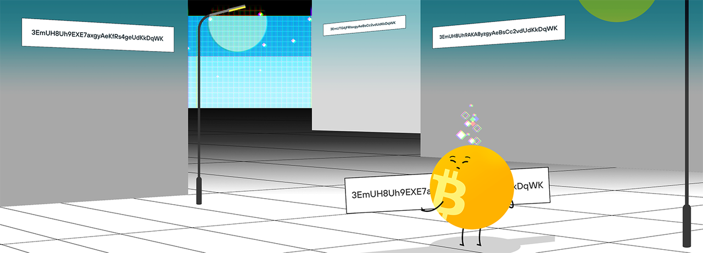
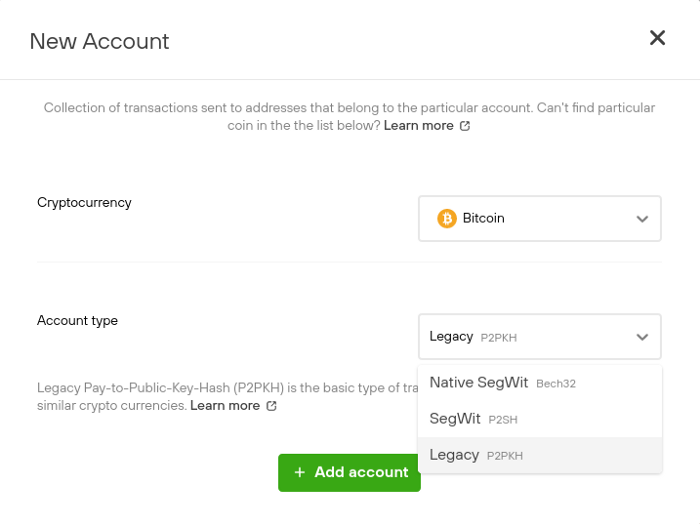
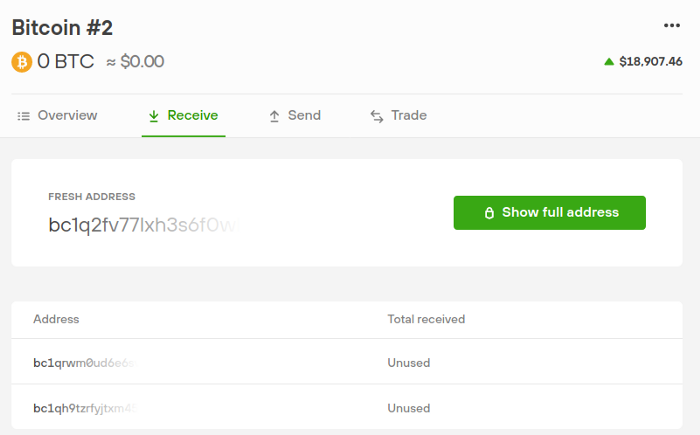
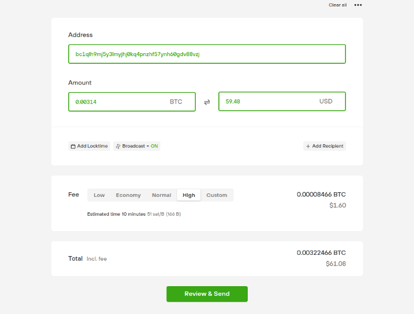
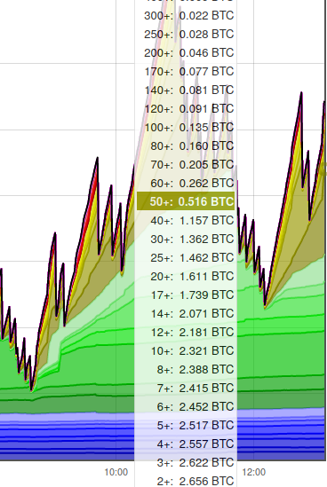

*作者：SatoshiLabs*

*来源：<https://blog.trezor.io/bitcoin-addresses-and-how-to-use-them-35e7312098ff>*

*译者：阿剑*

在追求更好的技术时，一些附属的事物免不了会变得有些混乱。虽然比特币地址的格式化方法改变了许多，它实在不是普通人需要关心的东西。比特币在过去几年中使用了多种标准，有时候还同时使用多个标准，这让这些奇怪的字符串变得更加可怕，过分可怕了。

[不同类型的比特币地址](https://wiki.trezor.io/Address#Address_types)基本上是交叉兼容的，意思是任何一种地址上的资金都可以发送到别种地址。如果你在发送资金到某种地址时遇到了问题，那很有可能是你钱包客户端的问题，只要尝试升级你的钱包到支持下文所述的地址类型即可。

一般来说，你所用的钱包软件会帮你管理地址，并防止你把资金发送到一个无效的地址上。不过，各种钱包的做法可能不一致。Trezor Suite app 最近发布了[公开的 beta 版](https://blog.trezor.io/introducing-trezor-suite-public-beta-7c5949aeef45)，它可以防止您把钱发送到无效的地址，也支持所有常用的地址类型，还可以帮助你避免多付手续费；这最后一个问题在流行的钱包软件中很普遍，尤其是在网络繁忙的时期。

## 不同类型的比特币地址长什么样？

要想惬意地收发比特币，你需要知道两件事：如何识别一个有效的地址，以及应该使用哪种类型的地址。

大多数时候，你应该都会倾向于使用原生的[隔离见证](https://wiki.trezor.io/SegWit)地址（也就所谓的 “[Bech32 地址](https://wiki.trezor.io/Bech32)”），这种类型的地址总是以 **bc1** 开头。这种地址是最好的，因为它在构造交易时数据的使用效率最高，因此手续费也最低，因为比特币的手续费是按照交易的数据量来计价的。

**原生的隔离见证 Bech32** 地址长这样：

> bc1qj89046x7zv6pm4n00qgqp505nvljnfp6xfznyw

不过，现在并不是所有的钱包软件都支持 Bech32 格式。一个更通用的地址格式是 “支付到脚本哈希值（[P2SH](https://wiki.trezor.io/P2SH)）” 地址，也叫 “嵌套隔离见证地址”。从交易费的角度看，它的效率也比传统的地址类型要高，而且可以一眼识别出来，因为以 **3** 开头。如果你不确定你的交易发往的目标地址是否支持隔离见证，那么，嵌套的隔离见证地址一般都支持。

**隔离见证 P2SH** 地址长这样：

> 3EmUH8Uh9EXE7axgyAeBsCc2vdUdKkDqWK

如果你使用的是比较旧的钱包软件，你可能需要使用传统的 “支付到公钥哈希值（[P2PKH](https://wiki.trezor.io/P2PHK_address)）”地址。之所以叫传统地址，是因为这种地址被视为早期科技的残余。这种地址一般来说手续费会更高，但也仍然是通用的。你可以从一个地址是否以 **1** 开头来辨别它是不是 P2PKH 地址。

**传统的 P2PKH** 地址长这样：

> 1MbeQFmHo9b69kCfFa6yBr7BQX4NzJFQq9

你要养成每次发起交易都检查目标地址的习惯，确保目标地址没有被篡改。虽然地址的开头可以帮你辨识这种地址的类型，但地址的长度也会随类型的变化而变化。Bech 32 地址有 42 个字符 —— 这是最新的地址类型 —— 而 P2SH 和 P2PKH 地址只有 32 个字符。

## 什么是能接收资金的有效比特币地址？

你的所有类型的地址都是从同一个源头衍生出来的，就是你的[助记词](https://wiki.trezor.io/Seed)（也叫 “种子词”）。下面是一个种子词的例子，所有三种类型的地址都可以从这个助记词衍生出来：

> gentle melt morning mother surprise situate lens beef cloud inquiry genuine feel

有了助记词，你就可以创建一个有效的比特币收账地址，任何类型都可以，只要你的钱包软件支持。使用 [Trezor Suite](https://suite.trezor.io/)，只需点几下鼠标就能生成上述任意一种类型的地址。

- 在 “账户” 页面使用侧边栏的菜单 “增加新账户” -

因为比特币开发和升级的特点，随着时间推移，你可能会遇上更多的地址类型，但地址都是向后兼容的。一个 Bech32 地址可以发送资金给一个 P2SH 或 P2PKH 地址，无需任何担心。反过来也可以，你也可以用传统地址给 Bech32 和 P2SH 地址发送资金；只不过，如果你使用的是比较旧的钱包软件，软件可能不能识别 Bech32 和 P2SH 地址，因此阻止你发送，即使这笔交易很有可能会成功。这只是保护机制过时的问题，不是比特币的问题，你只要升级软件，这笔交易就会通过了。

当你有疑虑时，你可以放心使用传统地址，因为它有最广泛的支持。虽然你所用的钱包软件可能会给你一些限制，但只要它允许你签名和发送交易，你就没什么可担心的。比特币地址是交叉兼容的，每种类型的地址都可以给任意类型的地址发送资金。想获得最佳的灵活性、最少的混淆，请升级到 [Trezor Suite](https://suite.trezor.io/)，在这里你可以完全控制任意一种地址。

## 为什么地址类型一直在变化？

在这里讲解的地址类型中，P2SH 和 Bech32 类型都跟[隔离见证](https://wiki.trezor.io/SegWit)升级有关，隔离见证是一种交易格式的升级，使得一个区块可以放进更多的交易，可以提高网络的吞吐量。这也意味着，只有从隔离见证兼容的地址（比如 P2SH 和 Bech32 地址）上发起交易时，才能享受到隔离见证所提供的好处；而且，接收地址的类型并无关系。从隐私的角度看，确保交易中剩余的密码货币返回到（与发送方）同种类型的地址中是很重要的。Trezor Suite 会自动帮你处理。

## 如何获得比特币地址

新人可能会困惑于如何获得一个可以收账的地址。很简单，你只要下载一个钱包软件就可以了，比如这个[推荐列表](https://wiki.trezor.io/Apps#Third-party_cryptocurrency_wallets)里列出的。钱包软件会为你生成一个助记词，并使用这个助记词来生成可用的地址并展示给你。一种比较好的做法是每个地址都只使用一次，无论是收账还是发账。因为一个助记词可以生成无数个地址，你不需要担心地址不够用的问题，这种做法会给你提供额外的隐私保护。

如果你拥有一个 Trezor 硬件钱包，那你可以使用 Trezor Suite 桌面版软件来创建和管理比特币地址，这些地址所用的助记词是在你的 Trezor 硬件中生成并保管的，所以别人没法看到你的助记词，也无法复制你的钱包。你也可以在 Suite 中直接为每一笔交易生成一个新地址。

## 查找你的比特币收账地址

如果你想要发送比特币到自己的钱包，你需要确定自己的收账地址。在 Trezor Suite 中，你需要选择自己希望接收资金的账户，然后点击 “收款” 按钮。然后你可以看到一个列表，里面包含了你之前生成的作用地址，以及最新未使用的地址的预览。点击 “显示完整地址” 即可看到最新的未使用的收账地址。点击后，请检查屏幕上显示的地址与你的硬件钱包设备上显示的地址一直，然后你就可以将这个地址复制并发送给向你发账的人了。

如你所见，这里我们使用的是 bc1 开头的 Bech32 地址，但除非发送资金者也使用 Bech 地址或 P2SH 地址，否则他们是无法享受 SegWit 所提供的低手续费好处的。总是使用 Bech32 地址来发账可以节省交易手续费。

如果这是你第一次收账，建议你在将所有资金转入之前先发一笔测试交易；这样做看起来有点小心过头，但对于刚进入这个世界的朋友来说，这样做可以抵消不确定性。尝试发少量比特币（比如以聪为单位的额度）来测试你的收账地址，在你发送更多资金进入前，先耐心等待这笔测试交易确认。

## 如何发送比特币到某个地址

当你需要给某人支付比特币时，你只需要拿到对方提供的接收地址即可。使用 Trezor Suite，只需移动到账户页面的 “发送” 栏，输入对方的地址，然后，**你还要检查文本框里的字符与你一开始得到的地址一致**，因为总有机会你的电脑剪贴板会被恶意软件劫持。

输入地址之后，再设定你愿意为这笔交易支付多少手续费。更高的手续费会激励矿工优先打包你的交易，所以对方也会更快收到账。在下面这个图中，我们使用的是 Trezor Suite 建议的最高手续费，以期在 10 分钟之内，就可以让交易上链（这是比特币网络能做到的最快速度了）。

检查自己支付的手续费是个好习惯。一些钱包软件的自动设置会大大高估手续费。即使在繁忙时期，你需要支付的手续费也就是几美元，不会高出太多。如果钱包所建议的手续费在你看来太高，你可以找找高级选项，自己输入一个数值。网络上有很多工具可以帮你看到正在发交易的用户都支付了多高的手续费，比如[这个网站的第二张图](https://jochen-hoenicke.de/queue/#0,24h)。你可以在下图看到，大部分的交易所支付的的手续费水平都低于 50 聪/字节，所以 Trezor Suite 所建议的 51 聪/字节 应该可以在 10 分钟之内上链。

## 如何找回发送到错误地址的比特币？

大部分情况下，发送到错误接收方的比特币都是无法找回的，如果那是个无效地址的话。

在很少的情况下，如果你知道你的交易的目标地址（有效地址）属于谁，你可以尝试联系他，幸运的话 TA 会愿意把资金发回给你。

如果两种办法都不奏效，最后一种办法是使用 [OP_RETURN](https://wiki.trezor.io/OP_RETURN) 向那个意外收账的地址发送消息，描述你的失误并请求对方善意归还。这也很有可能失败，所以防止你把资金发送到错误地址的方法永远是，检查检查再检查，在你按下发送键之前再三检查交易的目标地址是否有误。

令人痛心的事实是，虽然许多钱包软件在识别有效地址方面做得很好，还是有用户把资金发送到错误类型地址，比如把比特币发送到一个莱特币地址，这种错误，一些钱包是检查不出来的。在这种情况下，网络是无法识别出这是一笔错误交易的，因为从钱包的角度看，这笔交易的形式与其它交易没啥区别，也是一笔有效的交易。在这种情况下，你能不能找回资金取决于你填入的地址属于哪个网络。假如你把资金发给了一个莱特币地址，只要你拥有这个接收地址的私钥，你应该还是能找回自己的比特币（即使那是一个莱特币地址）。但如果你没有那个地址的私钥，那找回的可能性就几乎没有了。要是真的发生了这种事，你只能自食其果了。另外，请记得换用一个更好的钱包。

（译者注：这里多解释一句，用户不可能用这种办法把比特币发到莱特币区块链上去。只是把这些比特币发到了某个跟已知的莱特币地址重合的比特币地址上。而有些区块链的地址是通用的，即一个有效的莱特币地址也有可能是一个有效的比特币地址，因此如果你拥有生成这个莱特币地址的私钥，也就意味着你可以控制同样的比特币地址，也就可以找回。但如果你填入的是不通用的区块链网络的地址，那就没有这么幸运了。）

（完）
