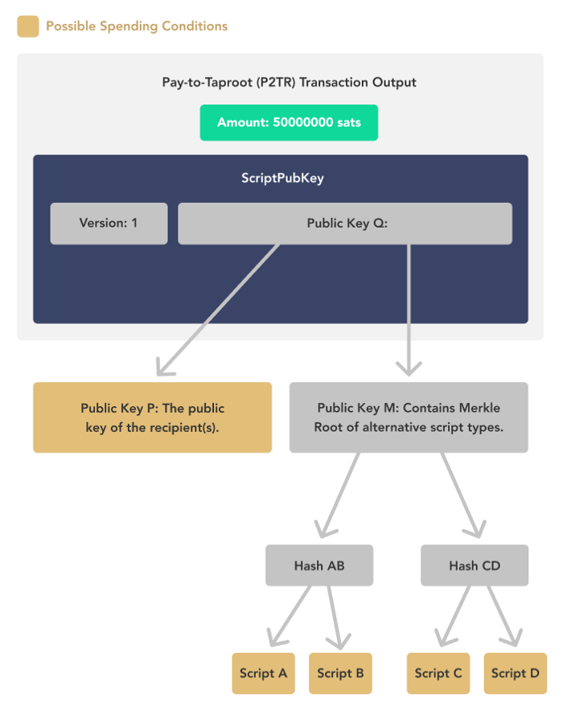
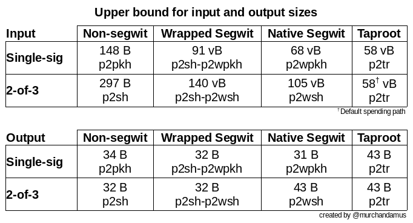
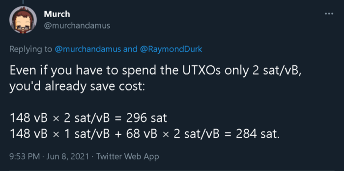
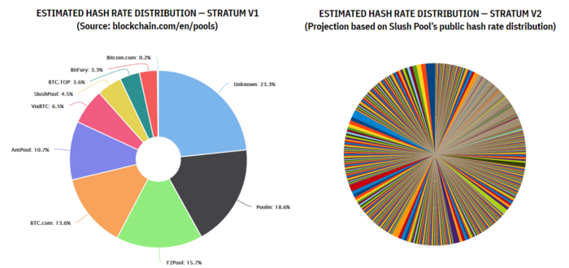

> *作者：Raymond Durk*
>
> *来源：<https://raymonddurk.medium.com/bitcoin-after-taproot-86c93fe5cc0c>*
>
> *原文撰写于 2021 年 11 月 15 日。*

Taproot 是比特币自 2017 年的 “隔离见证（SegWit）” 升级以来的最大升级，已经于昨天晚上激活。虽然从提出到激活花去了许多时间，但这次升级也为其它许多一直在并行开发的创新打开了空间。

## Taproot

Taproot 实际上是自 [2012](https://bitcointalk.org/index.php?topic=103172.0) 以来一直在讨论的三项内容的合集，第一份 BIP 可以追溯到 [2016](https://github.com/bitcoin/bips/blob/master/bip-0114.mediawiki) 年。在核心效果上，它略微提升了比特币的可扩展性，提高了部分用户（多签名用户）的隐私性，并使得许多新特性能够在未来的几年中开发出来。

## BIP 340 —— Schnorr 签名

比特币当前正在使用 ECDSA 签名，但将会引入 Schnorr 签名；现在 Schnorr 签名的专利保护已经到期，所以时候已经到了。River 做了一个很棒的按步详解，如下图所示。但简而言之，公钥聚合让多签名（包含闪电网络用户）交易与常规的单签名比特币交易没有区别。这是通过将参与多签名的多个公钥聚合成一个新的组合公钥来实现的。这就意味着，你不再需要展示 3 个公钥中的 2 个（比如 ABC 中的 AB）来签名一笔交易，因为公钥 ABC 就足以代表三者的任意组合（AB、AC 和 BC）。这种节约效果涵盖所有的 m-n 多签名。

- 来源：<a href="https://river.com/learn/what-are-schnorr-signatures/">River</a> -

## BIP 341 —— Taproot

这个 BIP 关系到的就是 Taproot 升级的 Taproot  部分。它引入了一种新的脚本类型（Pay to Taproot，也叫 P2TR），来实现一种逻辑：既可以从一个 Schnorr 公钥中花费，同时又可以通过满足脚本的条件从一个默克尔根中花费。它是通过上述的 Schnorr 签名以及 MAST 来实现的。MAST 是 “Merkelized Alternative Script Tree（默克尔另类脚本树）” 的缩写，其正式名称为 “Merkelized Abstract Syntax Trees（默克尔抽象语法树）”。默克尔脚本树最深可以有 32 层，用大白话来说，就是最多可以为一笔资金创建 40 亿个脚本，而只要满足其中一个脚本的条件，这笔资金就可以被花费；这个被满足的脚本也是唯一一个需要在链上曝光的脚本，其余脚本则永远不会曝光；因为不曝光其它的条件，隐私性也显著提升。当前，只要动用一笔资金，该资金所有的花费条件都会曝光，意味着你可以很容易分辨出哪些是闪电网络通道，一个多签名用到的公钥有哪些。

- 来源：<a href="https://river.com/learn/what-is-taproot/#schnorr-signatures">River</a> -

River 又给了一个很棒的图示，来解释你用 Taproot 公钥 Q 锁定的 5000 万聪既可以用 Schnorr 公钥 P 来花费，也可以使用公钥 M（默克尔根）下面的任何一个脚本条件来花费。

## BIP 342 —— Tapscript

Tapscript 通过验证 Taproot 花费的脚本和 Schnorr 签名，将上述所用特性结合在一起。它是通过引入多个新的操作码来实现的，并其添加方式也是灵活的，未来的升级可以更平滑地引入。

## 不在 Taproot 中的内容

不幸的是，跨输入的签名聚合（Cross Input Signature Aggregation）不在这次升级中。如 [Pieter Wuille](https://www.reddit.com/r/Bitcoin/comments/8wmj5b/pieter_wuille_submits_schnorr_signatures_bip/e1wwriq/) 在 2018 年写的：

> 现在出现了许多改善比特币脚本执行的想法（MAST、Taproot、Graftroot、新的 sighash 模式、多签名方案，等等），显然已经多到没法再一次升级中实现全部。因为聚合会跟所有其它东西相互影响，推迟实现似乎是更好的选择。

不过，一旦 CISA 实现，升级的后果之一将是 CoinJoin 得到经济上的激励。这是多个签名者节约后的签名成本将比单签名交易的更低。

## 那么 Taproot 升级对我来说有什么意义呢？

对现状来说影响不大。因为可能要过一年的时间才有足够多的钱包支持 Taproot 的各项功能。Taproot 在区块高度 709632 处激活后，钱包就将开始开发软件升级，以支持 Taproot。这不需要你创建新的助记词，整个体验也会跟 2017 年的隔离见证升级相似：你将可以选择两种地址类型。作为用户，你可以看到的唯一区别在于，新类型地址的前缀从 “bc1q” 变成了 “bc1p”，因为版本号增加，成了 SegWit v1。

## 我可以利用 Taproot 来做什么呢？

我个人会推荐你把旧的 UTXO 从旧的地址转入 Taproot 地址，只要交易池不是很满（译者注：交易池很满的时候，手续费率会比较高），这样你在未来发送交易时可以节约一些手续费，尤其如果你已经在使用，或一直在考虑使用多签名设置的话。因为多签名从本次升级中获得的节约效果更多。

它是怎么实现节约的呢？当前，如果你要从一个地址中花费，你需要在输入中包含公钥。Taproot 将公钥放在了要被花费的输出中（因此它会增加输出的体积）但节约了输入的体积。体积缩写的效果主要来自 Schnorr 签名成为默认的签名方案，因此也推荐使用多签名。

- 来源：<a href="https://twitter.com/murchandamus/status/1262062602298916865?s=20">Murch</a> -

你可能会想，“为什么我要在囤币时付出手续费，而不是真正花的时候再付呢？” 我一开始也想了同样的问题，但正如 Murch 指出的，在 2021 年的大部分时间里，交易池都不是很满，所以我们只需为每字节支付 1 聪就能让交易上链了。哪怕你要多付一次手续费，只要未来手续费涨到每字节 2 聪，你就是省钱了。所以如果你所用的钱包软件允许接收 Taproot 输出，你应该趁手续费不贵的时候，把 UTXO 都传进去，然后利用 Taproot 为多签提供的隐私性好处。

- 来源：<a href="https://twitter.com/murchandamus/status/1402443595026685955?s=20">Twitter 回答</a> -

它怎么能提高隐私性呢？[Bitcoin Op Tech](https://bitcoinops.org/en/preparing-for-taproot/#multisignature-overview) 观察了 692039 号区块内的多签名使用。他们用颜色区分了闪电网络这样的 2-2 多签名交易以及常见的 2-3 多签名交易。如果这些多签名钱包都使用 Taproot 的密钥路径而不是更复杂的脚本，它们的交易将与普通的单签名交易没有区别。你也将无法分辨出具体的应用，比如  [Liquid](https://blockstream.com/liquid/) 就使用 11-15 的多签名。

## Schnorr 和 Taproot 为下列创新打开了大门

### Scriptless Scripts

[这](http://diyhpl.us/wiki/transcripts/layer2-summit/2018/scriptless-scripts/)是一种将智能合约的信息编码到签名中的方法。坦白说，许多东西超出了我的认知范围，我必须看两遍才能理解，但它会影响很多东西。你可以听听这个[演讲](https://www.youtube.com/watch?v=jzoS0tPUAiQ&t=12960s)。很不幸，Andrew Poelstra 不上推特，但如果你在了解最新的开发进展时曾听过他上[播客](https://www.youtube.com/watch?v=M3grwZCwav0)或[圆桌](https://www.youtube.com/watch?v=zv6_zXUI2-E)，你会发现他的工作真值得关注，因为那会影响下面列举的大部分事物。

### MuSig

MuSig 是基于 Schnorr 签名的多签名协议族。我说这是一个家族，是因为它现在就有 3 个版本：MuSig、MuSig2 和 MuSig-DN。我们很可能会看到 MuSig2 的实现，因为它易于使用。不过，所有三个版本都只适合 n-n 的情形，所以可以用在闪电网络中（闪电网络的通道是一个 2-2 的多签名合约），但不太可能用在 m-n 的多签钱包中。话说回来，也有人在开发基于 Schnorr 签名的（像 2-3 这样的）门限签名方案。

### 适配器签名

适配器签名是一种可以将一个秘密值与签名数据结合起来，从而揭示签名；或者用签名来揭示秘密值的方法。它可用来实现多种用途，与合约的锁定和高效、隐私执行有关。两个这样的例子是 CoinSwap 和原子化互换（atomic swap），双方可以免信任地一手交钱一手交货（揭示秘密值）。这些是技术上的解释，但这里有 Rene 作的一个[简单解读](https://www.youtube.com/watch?v=a8Pdpz_Jzok)，以及一个围绕 DLC（谨慎日志合约）的[更长的解释](https://www.youtube.com/watch?v=a8Pdpz_Jzok&t=514)。

### PTLC（点时间锁合约）

适配器签名的另一个重要用法是 “点时间锁合约（Point Time Lock Contracts，PTLC）”。现正使用 HTLC（哈希时间锁合约）的闪电网络可能会升级到使用 PTLC，它可以[消除支付交易之间的可关联性](https://bitcoinops.org/en/preparing-for-taproot/#ptlcs)，从而提高用户的隐私性，并让他人更难发现哪个节点在转发支付。它实现这种效果用的不是脚本（不像 HTLC），而是适配器签名和标量推导出来的签名。它无法给予闪电网络用户完美的隐私，但确实让闪电支付变得更难跟踪，尤其是在跟多路径支付相结合的时候。你可以在[这里](https://twitter.com/RaymondDurk/status/1268357523423350787?s=20)看到一个 PTLC 的演示。

### DLC

有了 Taproot，谨慎日志合约（Discrete Log Contracts，DLC）可以更高效地实现。DLC 的大致含义是参与合约的双方对事件的结果打赌；可以用来对体育赛事打赌、创建奖金，等等。断言机发布对结果的签名。而双方可以用这个签名来执行合约并分割资金。现在 Suredbits 已经推出了[Krystal Bull](https://github.com/bitcoin-s/krystal-bull/releases) 帮你生成 DLC，可以在桌面端或者 Umbrel 节点中使用（演示视频见[此处](https://www.youtube.com/watch?v=Gac_swBvl3A)）。

### BIP118: AnyPrevOut

曾用名 “SIGHASH_NOINPUT”，后来称呼更新为 “SIGHASH_ANYPREVOUT” 和 “SIGHASH_ANYPREVOUTANYSCRIPT”。这个变化[微不足道](https://github.com/ajtowns/bips/blob/bip-anyprevout/bip-0118.mediawiki#revisions)，但主要的收获在于，当前的 BIP 利用了 [BIP342](https://github.com/bitcoin/bips/blob/master/bip-0342.mediawiki) 为 tapscript 安排的升级路径。所以，虽然它在技术上并不依赖于 Taproot，但 Taproot 升级移除了为止设立单独的 segwit 版本的需要。介绍一下背景，在 SegWit 引入之时，它还引入了 16 个版本后。2017 年新启用的、以 “bc1” 为前缀的隔离见证地址属于 segwit v0。而 Taproot 是此后第一个升级，使用 segwit v1 的版本号。

那到底什么是 AnyPrevOut 呢？它是一种签名方式，使用这种方式的签名的对象包含交易的大部分内容但不包含交易的输入。所以它允许一种特殊的花费方法：任何输入，只要满足使用该公钥的脚本，都可以用在交易中；如有必要，还可以切换输入。它使得支付的条件更灵活，提高了效率以及可扩展性，也打开了创新的空间。你可以在[这里](https://anyprevout.xyz/)了解更多。

### Eltoo

AnyPrevOut 可开启的一种技术叫做 “Eltoo”，这是一种闪电网络可用来取代当前的 LN-Penalty（基于惩罚的旧状态撤销机制）的执行方法。它对闪电网络的主要好处在于，你将不再需要为每一笔可能有问题的路由交易跟踪通道的备份数据。不过，Eltoo 也可以降低链上的成本、消除通道双方之间的一些安全担忧，并简化 “[通道工厂](https://www.tik.ee.ethz.ch/file/a20a865ce40d40c8f942cf206a7cba96/Scalable_Funding_Of_Blockchain_Micropayment_Networks%20(1).pdf)”。从通道工厂中获得的效率可以让多个用户使用一个 UTXO 互相开设闪电通道。你可以向 [Christian Decker](https://www.youtube.com/watch?v=kGQF3wtzr04) 学习 BIP 118 和 Eltoo 的详情。

### CoinPool

另一个在 AnyPrevOut 合并之后可以实现的点子是 [CoinPool](https://lists.linuxfoundation.org/pipermail/bitcoin-dev/2020-June/017964.html)。它类似于 [JoinPool](https://bitcoinops.org/en/newsletters/2020/06/17/#coinpool-generalized-privacy-for-identifiable-onchain-protocols) 提议（下文将揭示），但它更具体地利用了 Taproot。因为允许多方共有一个 UTXO，并且该 UTXO 与其它的 UTXO 无法区分，它使得更隐私的闪电通道和金库等得以出现，因为你将不再能确定这个 UTXO 的哪个参与者发起了交易，因为你不再能假设只有一个主体持有它。

### **BIP 119** OP_CTV

OP_CHECKTEMPLATEVERIFY 是一个还在 BIP 阶段的提议，它提出了一个新的操作码来记录资金如何花费的条件。[它可以支持许多用途](https://utxos.org/)，在扩容方案、金融服务中使用这种紧急属性。一个简单的例子是继承方案。如果你是家里唯一一个了解比特币的人，你不想让家人在你去世之后第二天就把你的币全卖掉，你可以使用 OP_CTV 来指示你的钱包，每年转移 10% 的资金到一个特定的地址，持续转移 10 年。这样你来，你的家人就能从未来 10 年的价格涨幅中受益，而他们也不得不囤币因为每年都有支出的上限。

### TLUV 限制条款提议

不过，AJ Towns 最近提出了一个与 BIP 119 [类似的想法](https://lists.linuxfoundation.org/pipermail/bitcoin-dev/2021-September/019420.html)，叫做  “OP_Tapleaf_Update_Verify”。它依赖于 Taproot 升级以及一种叫做 “[joinpool](https://gist.github.com/harding/a30864d0315a0cebd7de3732f5bd88f0)” 的应用场景。JoinPool 是许多人共享一个 UTXO，它造成了独特的隐私效果，并打破了更多链上监控的假设。它对比 OP_CTV 的主要优势在于，用户可以自己退出，无需来自池中其它每个人的签名，这使得这种池子更容易运行，并在签名交易时节约手续费。

## Taproot 之外的其它可能升级

### Stratum v2

[Stratum v2](https://braiins.com/stratum-v2) 是一种矿池协议的升级。Stratum v2 由 Pavel Moravec、Jan Capek 和 Matt Corallo 提出，它通过提升小体量的、在家挖矿的矿工跟矿池沟通的安全性，来进一步提高去中心化。而且，它使得个人矿工可以挖自己提出的区块，并在区块内包含有区别的交易子集，而不是只能挖掘矿池作为一个整体提出的区块。这给了业余的矿工贡多的灵活性，并让网络的抗审查性更抢，因为小矿工不再非得受制于矿池指定的规则。

- （预期）为矿工赋能后的算力分布变化。来源：<a href="https://medium.com/braiins/experts-discuss-stratum-v2-and-the-future-of-bitcoin-mining-d62568df73a6">Braiins</a> -

### Erlay 与 [BIP330](https://github.com/bitcoin/bips/blob/master/bip-0330.mediawiki)

Erlay 是对节点转发未确认交易的方式的改进提议。其[论文](https://arxiv.org/pdf/1905.10518.pdf)由 Gleb Naumenko、Pieter Wuille、Gregory Maxwell、Sasha Fedorova 和 Ivan Beschastnikh 撰写，声称可以节约超过 80% 的带宽。它还允许节点增加出站连接的数量。这可以帮助用户防御某些类型的攻击并提高隐私性。

如果哪位专家发现我上面的表述有误，请[联系我](https://twitter.com/RaymondDurk)。也请关注 [Bitcoin Op Tech](https://bitcoinops.org/)，这是一份介绍生态内开发进展的周报，我也大量运用这个网站来检验我自己的理解并提供额外的链接。

[Tippin.me/@RaymondDurk](https://tippin.me/@RaymondDurk)

（完）

