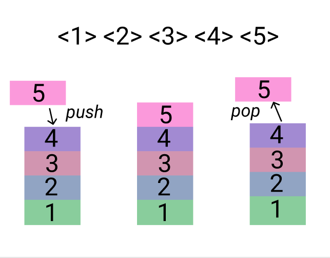

> *作者：Ishaana Misra*
> 
> *来源：<https://medium.com/coinmonks/bitcoin-always-had-smart-contracts-script-part-1-c84ca4739758>*


在我学习比特币工作原理的过程中，我惊讶地发现，比特币是有智能合约的，至少一定程度上如此。虽然它们都是很简单的，**但这些强大的合约保护了比特币交易的安全性**。了解脚本如何工作，也是理解 Taproot 升级的意义的关键。

## 比特币网络中的交易是在满足预先设定的条件并花费

一开始学习比特币交易，你可能会有一些困扰，所以我们先从区块链（也就是所有交易存储的地方）开始。区块链是一种跟踪已发生交易的数据结构，就像一个电子账本。区块链中的每个区块都包含了一些交易。那么，这些交易都长什么样？通常来说，在一开始解释区块链的工作原理时，我们会说区块链所记载的信息就是许多余额以及这些余额所述的假名地址。为了理解交易在比特币网络中是如何工作的，我们必须摒弃这些印象。

我们先来讲讲一笔比特币交易的形态。**每一笔交易都可以有多个输入和多个输出**。而一个交易的输出有一定数量的比特币（以 “聪” 为单位）以及花费这些比特币时所需满足的条件（叫做 “锁定脚本（locking script）”）。

交易的输出可分为两种：“未花过的交易输出（UTXO）” 和 “已经划过的交易输出（STXO）”。一个 UTXO 就是一个其花费条件还未必满足的交易输出。这些条件只能满足一次，因为一旦条件得到满足，这个交易输出就不再是 UTXO，而变成了一个以后再也不能花费的 STXO。

交易输入就是花费 UTXO 的办法。交易输入的内容有：产生它正在消费的这个 UTXO 的交易的 ID，指明该 UTXO 是该交易的哪个输出的索引值（别忘了，一笔交易可以产生多个不同输出），以及一个 *解锁脚本*。这个解锁脚本的目标就是满足（由该输入所尝试花费的 UTXO 的）锁定脚本所设置的条件。

所以，你的比特币余额 *不是* 跟你的比特币地址一起存储在在区块链上的，而是由多个可以拥同一把私钥来花费的 UTXO 的面额加总起来的。比特币钱包软件可以扫描链上的 UTXO 并检查哪个可以拥你的私钥来花费，从而加总出你的余额。这些 UTXO 的面额之和就是你的余额。

我们再举几个不同类型的锁定脚本例子，更深入地了解锁定和解锁脚本是如何工作的。

## 比特币交易是使用一种叫做 “Script” 的脚本编程语言来构造的

这种语言不同于今天我们使用的大部分编程语言。虽然它看起来有点奇怪，也不高级，就像比特币上的许多其它东西一样，但它的独特设计有非常扎实的理由。Script 与其它编程语言的两大关键区别如下：

1. 它并非图灵完备的
2. 使用 “堆栈” 这种数据结构

所谓 “[图灵完备](https://en.wikipedia.org/wiki/Turing_completeness)” 的语言，指的是它可以表达一切可能编写出来的程序。这种特性也被视为能够解决一切可能解出的问题。但这里的问题是，你可能无法提前预知程序会在什么时候结束。图灵完备的语言可以编写出 “循环”，可能会运行很长时间。所以虽然它能解决一切可能解决的问题，它也预设了有无限的内存可用，而且你无法提前预祝其运行时间。

拥有一种图灵完备的脚本编程语言，对比特币可能有害，因为**比特币网络中的每一个节点都需要能够验证每一笔交易，所以可预期的执行时间是必要的**。所以，Script 并非图灵完备的。它主要包含条件式的 “If...Then...Else” 语句（如果...那么...不然就...），不能写出可能导致运行时间不可预测的循环和递归。

此外，比特币使用 *堆栈*，在这种数据结构中，你只能往栈顶添加对象，或者从栈顶移除对象；它是 “先进后出” 的数据访问方法。你可以使用 “push” 操作符向栈顶增加一层堆栈，它会在栈顶加入一个对象；使用 “pop” 操作符在栈顶移除一个对象。



虽然从功能上来看，这是一种初级的语言，但它很切合比特币的专门需求。举个例子，在更广泛使用的编程语言，比如Python 中，把两个数相加往往是这样的：

```python
1 + 1
```

程序会返回 2。非常直接，对吧？

但在 Script 中，情形是这样：

```javascript
OP_1 OP_1 OP_ADD
```

先是一个 1  被推入栈中，然后是另一个 1 被推入栈中。最后一个操作符 “ADD” 会将这两个值从栈中取出，将它们相加，最终把结果推入栈中。所以，栈中唯一剩下的值就是 2，然后程序终止。

### 交易脚本的类型

**P2PKH**

具体到比特币交易，有多种不同类型的交易脚本。最常见的类型就是 “给公钥哈希值支付（P2PKH）”，它看起来就像这样：

```typescript
OP_DUP OP_HASH160 <public key hash> OP_EQUALVERIFY OP_CHECKSIG
```

它可以被如下这种解锁脚本花费：

```typescript
<signature> <public key>
```

那么，这些脚本是如何运行和验证的呢？如果一笔新的交易取用上述锁定脚本并使用上述解锁脚本来花费它（作为这个交易的输入） ，收到该笔交易的节点可以通过同时运行锁定和解锁脚本来验证这笔交易。这个节点先从交易输入中复制解锁脚本，再从该输入所引用的 UTXO 中复制锁定脚本，然后按顺序运行解锁和锁定脚本。

```typescript
<signature> <public key> OP_DUP OP_HASH160 <public key hash> OP_EQUALVERIFY OP_CHECKSIG
```

细致来看，这个组合起来的脚本有两个关键部分。第一部分是为了保证解锁脚本所提供的公钥的哈希值，等于锁定脚本所指定的公钥哈希值（而公钥哈希值定义为该公钥的 SHA-256 哈希值的 RIPEMD160 哈希值【当这两个哈希计算这样连用时，我们使用 HASH160 操作符】）。

第二个关键部分是使用 “OP_CHECKSIG” 来验证签名，它会取出签名和对应的公钥作为输出，并将结果（通过 或者 错误）推入栈中。

**P2SH**

另一种常见的交易脚本类型是 “支付给脚本哈希值（P2SH）”，它允许多种多样的交易格式。在 P2SH 交易中，有一个锁定脚本，一个解锁脚本，还有一个 “赎回脚本”。这个赎回脚本指定了花费该脚本所控制的比特币所需花费的条件。举个例子，我们假设我们的赎回脚本是这样的：

```java
<3> <Public Key 1> <Public Key 2> <Public Key 3> <Public Key 4> <4> OP_CHECKMULTISIG
```

OP_CHECKMULTISIG 让我们可以创建[多签名](https://en.bitcoin.it/wiki/Multi-signature)交易。这些交易有多个可以花费这些交易的公钥，并且预先指定了成功花费所需的不同公钥签名的数量。在上面这个赎回脚本中，合适的签名者有 4 个，只需凑足其中 3 把公钥的签名，就可以花费这些资金。这就是我们常说的 3-of-4 多签名。

而这时候的锁定脚本则完全不包含这些条件。相反，它只是一个带有该赎回脚本的 HASH160 哈希值的脚本，看起来就像这样：

```java
OP_HASH160 <hash of redeem script> OP_EQUAL
```

这个锁定脚本说得是，解锁脚本必须提供赎回脚本，然后程序会计算这段赎回脚本的哈希值，来确认它就是花费这些资金所要满足的条件；然后，是这些由赎回脚本所设定的条件实际上得到了满足。UTXO 本身不包含这个赎回脚本，只包含这个赎回脚本的哈希值，因此得名 “支付给脚本哈希值”。

解锁脚本长这样：

```java
<Signature 1> <Signature 2> <Signature 3> <<3> <Public Key 1> <Public Key 2> <Public Key 3> <Public Key 4> <4> OP_CHECKMULTISIG>
```

看起来很长，但意思很简单，它就是赎回脚本以及为使执行结果为 TURE 而提供的签名，让你可以花里面的钱。

这就意味着，解锁脚本和锁定脚本的形态如下所示：

```typescript
<Signature 1> <Signature 2> <Signature 3> <<3> <Public Key 1> <Public Key 2> <Public Key 3> <Public Key 4> <4> OP_CHECKMULTISIG> OP_HASH160 <hash of redeem script> OP_EQUAL
```

其运行步骤是：

1. 赎回脚本先被哈希，与锁定脚本所提供的赎回脚本哈希值比对，这保证了解锁脚本所提供的赎回脚本与锁定脚本所设定的是同一个
2. 解锁脚本与赎回脚本一起运行，以验证交易提供了正确的签名

P2SH 比 P2PKH 更加灵活，因为赎回脚本的形态可以多种多样。

虽然它不像以太坊智能合约（用 Solidity 语言编写）那么灵活，因为后者是图灵完备的，比特币的有限智能合约功能**允许用户发起简单的以及有点复杂的交易，并且安全性得到了保证**！

**参考资源**

[Mastering Bitcoin, Chapters 6 & 7](https://github.com/bitcoinbook/bitcoinbook)

[Bitcoin Wiki: Script](https://en.bitcoin.it/wiki/Script)

[Advanced Bitcoin Scripting — Part 1: Transactions & Multisig](https://www.youtube.com/watch?v=8FeAXjkmDcQ&t=30s)