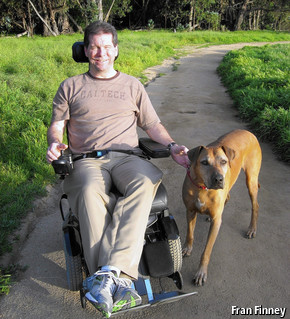

> *作者：Hal Finney*
>
> *来源：<https://nakamotoinstitute.org/bitcoin-and-me/>*
>
> *首次公开于 [BitcoinTalk 论坛](https://bitcointalk.org/index.php?topic=155054.msg1643833#msg1643833)。发表时间为 2013 年 3 月 19 日。*

我想我应该将过去四年的经历记录下来。无论对比特币还是对我，这都是不平凡的一段日子。

或许你并不认识我，容我先自我介绍一下：我叫哈尔·芬尼（Hal Finney），与菲尔·齐默尔曼（Phil Zimmermann）共同开发了 PGP（优良保密协议）的早期版本，自此迈入密码学行业的大门。菲尔决定成立 PGP 公司时，我是最早一批成员之一。那时候我就决心在 PGP 干到退休。与此同时，我也参与了密码朋克邮件组（Cypherpunk）。我运行了首个基于密码学的匿名电子邮件转发器，还参与了其它密码学运动。

快进到 2008 年末，即，比特币宣告诞生之际，我发现密码学行业的 “老人们”（当时我已经年过半百）变得犬儒，我反而变得更加理想主义。我一直热爱着密码学，爱它的神秘莫测、也爱它的悖论。

中本聪在密码学邮件列表中公告比特币项目时遭到了很多怀疑。密码学界已经看过太多无知菜鸟的 “宏伟” 计划，产生了条件反射式的怀疑心理。

我则积极一些。我一直都对密码学支付方案很感兴趣。而且我很有幸见过 Wei Dai 和尼克·萨博（Nick Szabo）并与他们有过很多通信交流；众所周知，他们早就创造出了比特币尝试实现的理念。我自己也曾尝试过创建基于工作量证明的货币，并将它命名为 RPOW。因此，我对比特币产生了浓厚的兴趣。

当中本聪发布第一版比特币软件时，我立即下载了。我应该是除了中本聪之外第一个运行比特币的人。我挖了大约 70 个区块，是第一个收到比特币交易的人（中本聪向我发送了 10 个比特币作为测试）。接下来几天，我一直通过电子邮件与中本聪进行交流，主要是我提出漏洞，他进行修复。

如今，中本聪的真实身份已经成了一个谜。但是在当时，我觉得与我交流的是一个非常聪明真诚的日裔小伙子。我这一生有幸结识了很多俊才，我能够看出哪些人不同凡响。

又过了几天，比特币已经可以非常稳定地运行，于是我任由它自己运行。那时，比特币的难度值是 1，用 CPU 就可以挖出区块，甚至连 GPU 都不需要。接下来几天，我又挖了一些区块。但是，之后由于电脑持续运行过热，风扇又太吵，我就关掉了挖矿软件。回想起来，要是我再多挖一段时间就好了。但是话又说回来，我作为最早的参与者已经幸运至极。这件事具体怎么看取决于你的心态是乐观还是悲观。

我再度听说比特币已经是 2010 年末。我惊讶地发现比特币网络还在运行，比特币甚至有了货币价值。我找到了尘封已久的旧钱包，欣慰地发现我之前挖出的比特币还在。随着币价不断攀升，比特币成为了货真价值的货币，我将自己的比特币转移到了冷钱包里，希望传到后世子孙手里能成为一笔不菲的财富。

说到后代，令我震惊的是，我在 2009 年突然被查出患有绝症。那年年初，我的体形达到了一生中的巅峰状态。我减了很多体重，并且开始长跑锻炼。我跑了几场半程马拉松，又开始了全程马拉松的训练。我努力跑下了几场 20 英里的马拉松，我觉得自己已经准备充分。就在这时，我的人生急转直下。

我的身体开始衰竭。我说话开始含糊不清，双手乏力，双腿恢复缓慢。2009 年 8 月，我被确诊 患有 ALS（渐冻症）。ALS 又名卢·格里克氏症，因著名棒球运动员卢·格里克罹患此症而得名。

ALS 会杀死负责将信号从大脑传输到肌肉的运动神经元，导致肌肉无力直至瘫痪，通常会在 2 到 5 年内致死。起初，我的症状较轻，于是我继续工作。但是，肌无力和说话不清等症状迫使我在 2011 年初退休。此后，我的病情急速恶化，一发不可收拾。

时至今日，我已经全身瘫痪。我靠着一根管子进食，另一根管子辅助呼吸。我使用商用眼动追踪系统操控电脑，依靠语音合成器说话，整天都坐在电动轮椅上。我还使用 Arduino 创建了一个接口，以便使用眼睛调整轮椅的位置。

我的人生虽然有了些改变，但是还不算太坏。我依然能读书、听音乐、看电视和电影。我最近发现我甚至还能写代码，但是非常慢，大概比之前慢了 50 倍。但是，我依然喜欢编程，它给了我目标。现在，我正在根据麦克·赫恩（Mike Hearn）的建议开发一款软件，旨在利用现代处理器的安全功能来支持 “可信计算”，从而强化比特币钱包。这个软件已经准备发布了，我只要完成文档就行。

当然了，比特币的价格波动也很吸引我。毕竟关乎我的切身利益。但是，我能得到比特币全凭运气，没花什么力气。我经历了 2011 年的价格崩盘，对我来说不是什么新鲜事了。来得容易，去得也容易。

这就是我的故事。总的来说，我还是很幸运的。虽然得了渐冻症，但我过得很知足。只是我已时日无多。那些关于将比特币传给后代的讨论并不只是出于学术兴趣。我已经将我的比特币存放在了保险箱里。我的儿子和女儿都是科技达人。他们应该会保护好这些比特币的。我很高兴自己能留下这笔遗产。

（完）