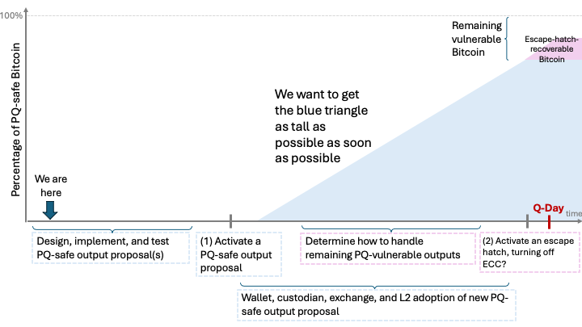

> *作者：Neha Narula*
> 
> *来源：<https://nehanarula.org/2026/04/20/bitcoin-and-quantum-a-roadmap.html>*

因为[上一篇文章](https://nehanarula.org/2026/04/03/bitcoin-and-quantum-computing.html)，我有些负罪感。因此我花了一些时间来思索后量子的比特币。内容包括：

1. 仔细思考让比特币走向面对 CRQC（有密码学意义的量子计算机）的安全位置的良好 “路线图”
2. 考察为在比特币后量子大陆上登陆而准备的一切
3. 识别剩余的开放问题

我看一些人已经编撰了关于 (2) 的清单或者说总结，然后指着它说 “你看！这些工作都在开展。你怎么说没有进展呢？” 确实如此，一些工作在推进。甚至我可以说，**许多**工作在推进。但有多少工作在开展中，并不是有意义的问题。(1) 和 (3) 才是最重要的部分！为了让比特币获得 PQ（量子计算抗性），哪些工作是必要但还没做的？现有的选项有哪些取舍、如何在它们之间作出选择？我们需要知道从 *此岸* 到 *彼岸* 的距离：在可以断言比特币无惧 CRQC 之前，还需要做什么、我们是否在正确方向上作出了足够多的努力？ <a href='#note1' id='jump-1-0'>1</a>

**在本文中，我准备主张，我们应该为有志于让自己的资金能够对抗 CRQC 的用户提供牺牲最少的一击即中方案**。我们应该这样做，*哪怕我们还不知道如何解决 CRQC 出现时会引发的所有问题*，比如如何处理那些还不具有量子抗性的钱币。

我不认为我们必须立即找出无懈可击的答案，我们也做不到。不同的缓解措施都有自己的取舍。但我们**现在**就应该提供低伤害、低风险、高收益、安全至上的缓解措施，将高伤害、高风险的缓解措施**留待以后**，在我们更确定 CRQC 即将到来的时候考虑。

那么，关于我们应该怎么做，我是怎么看的呢？

1. 设计、实现、评估、测试和激活一个软分叉，以增设 PQ的输出类型以及比特币输出可用的 PQ的签名方案（考虑钱包实现、L2 协议和比特币应用，确保这项软分叉能解决问题）
2. 协调（有意愿的）钱包实现、L2 协议和比特币应用的开发者，以正确地支持这种输出类型
3. 与用户沟通，解释为什么他们应该选择支持这种输出类型的应用、将资金迁移到这种输出类型。清晰告知这种输出类型的正确使用方法、调整流程以支持正确的使用方法，如有必要，开发新的流程。

完成了这些，这就给了比特币用户立即迁移钱币到安全的输出类型的能力，使我们有信心：即使一台强大的 CRQC 出现，他们的钱币也是安全的，不需要关心未来的软分叉。

目前为止，我看到的最佳候选是 P2MR（BIP 360）结合一种新的 PQ 签名操作码，以及 “[密码学敏捷性（使用不同签名方案的多个分支）](https://youtu.be/QoIqsKgqfHg?t=6772)”。这种组合，让我们可以大胆地说：迁移你的钱币到这种输出类型中，只要你没有暴露你的非 PQ 的公钥（没有复用地址），就能：

- 你的钱币在 CRQC 面前也是安全的（足以应对短程攻击和长程攻击两种攻击！），即使比特币未来不再增加软分叉
- 你可以继续使用使用体积较小的、生成速度较快的 Schnorr 签名来花费你的钱币，只要 CRQC 不是马上就出现（而且你的钱币依然是量子抗性的！）

这很棒。缺点则是这些：

- 如果你揭晓了你的 P2MR 输出内的 Schnorr 公钥，你的钱币在 CRQC 面前就不安全了，*除非未来又有一次软分叉会禁用不安全的签名方案* 。揭晓公钥的事情可能已经存在于特定的 钱包实现/托管商 的流程中，为了重复使用相同的地址。但在 P2MR 输出中，为了量子安全，你不能这么做。

  - 如果你认为 *所有* 用户都会这样做，那干脆别费劲（增加新的输出类型）了，只要指望未来的软分叉会禁用 ECC（椭圆曲线密码学）就好了。如果你觉得每个人都复用了地址，那么 P2MR 提议在安全性上看等价于另一种提议：P2TRv2 。

    （译者注：“P2TRv2” 的想法是先让钱包实现在生成钱包和地址时，在 P2TR 地址的脚本树中放置一个未定义的脚本操作码，当确定 CRQC 即将到来时，将该操作码启用为量子安全签名的验证操作码，然后禁用 ECC 。）

- P2MR 消灭了 P2TR 的一种可以称为 “效率隐私性” 的好处。在 P2TR 上，你花费资金时，可以假装它没有别的花费条件（即便有，别人也看不出来）；但 P2MR 没有密钥路径花费。消灭了这种花费方式，会泄露关于该输出的额外恰好 1 比特的信息（是否存在其它合约路径）。如果你真的在乎，那么在 P2MR 中，你可以追加 32 字节来避免这种泄露，但你就损失了一些效率，所以激励因素不再能让这种实践成为默认模式。

这些缺点，对于我们能够放心说你可以很长时间不关注这里的事，而你的钱币在 CRQC 面前将依然安全，在我看来，是可以接受的。失去效率隐私性有点烦人，但也许有一天，当我们全都用上量子抗性签名时，可以重新拿回这种好处。

## 比特币的安全性是一种公共物品

上述提议能能帮助你 *让你自己的钱币变得安全* 。但它不能保证这会让 *每个人的钱币都变得安全*，因为其他人可能不用它，或没有正确使用它。因为比特币是一个货币系统，也许你应该关心这个。在 bitcoin-dev 邮件组中，（到目前为止）绝大部分争议都是关于这个区别的；有一种观点是，如果 *太多其他人的钱币是不安全的*，那么你的钱币就也是不安全的（或者说你的钱币安全没有什么意义）。

我不是很确定该怎么思考这个问题。最起码，我会认为，这取决于具体的数字 —— 如果只有 0.0001% 的钱币是不安全的，那么我认为比特币不受影响；如果 20% 的钱币是不安全的，我认为，确实会非常混乱（如果 CRQC 出现），但我并不相信，比特币将因此 *只有死路一条*。也就是说，我也知道这会很糟糕，可能不再是我们今天所知的比特币，人们可能会对它彻底失去信心，或者风险太高无法用它来存储价值（too high risk to bank on） <a href='#note2' id='jump-2-0'>2</a>。不管在么说，我不知道有多少钱币会保持不安全状态。我们假设其比例为 X 。我认为可以肯定 X > 0（不是所有钱币都会迁移到 PQ 输出），并且 X < 100（至少有 *一些* 钱币会迁移到 PQ 输出）。

本提议（立即实现新输出类型）的好处在于，人们可以立即迁移、无需等待得出应对大 X 的答案。**并且**，我们可以获得 *真实数据* 。可以看到多少人会在链上移动资金！我们显然需要这个，从而能够尽可能缩小 X：但即使我们不能一致同意 X 到底是多少、该怎么处理，我们也可以先提供迁移方案。我们可以立即开始给人们提供选择，从而缩小 X，而不必知道接下来钥做什么。

还需要指出的是：在这个方向上推进，我们就不需要回答如何为 *没有* 及时迁移但在 Q-Day 之后表示希望安全迁移的人提供[救生舱方案](https://www.bitmex.com/blog/Mitigating-The-Impact-Of-The-Quantum-Freeze)的问题。层级式确定性钱包种子的 STARK 证据、承诺-揭晓 方案，等等，它们都远远没到必要考虑的时候，并且也是独立的，除非你认为这些解决方案太好了，以至于今天就要实现其中一种让 *所有* 钱币可以使用。我完全不同意这一点。这些解决方案都很糟糕。所以，虽然有人寻找这些方案这件事算是有趣，但它们不是摆在我们面前立即可用的修复措施（而且我认为，在上面花费太多时间会让人混淆，并且使人们偏离重点，无法聚焦在解决这个问题的务实方法上）。而且，如果你的钱币能逃生，它要 *去哪里* 呢？无论如何还是需要一种 PQ 输出。

最重要的是，我们不必为了取得进展而现在就决定拿那些完全不可能出现的的人（中本聪）怎么办 <a href='#note3' id='jump-3-0'>3</a>。最终，如果一台 CRQC 会成真，我们将不得不作出决定（置之不理、冻结它们、转为挖矿奖励、送给我，等等。什么？你要骂我？我说说而已。）那肯定是艰难的讨论，我也高兴我们现在就开始了。但解决这些争议，并非作出有用、有意义的进展的前提。

*为缓解措施而提出的路线图。蓝色框中的动作对于改变蓝色三角形（尽快将尽可能多的钱币转为量子安全的）有用；紫色框中的动作只对紫色梯形（帮助剩余的脆弱钱币）有用。在第一次激活之后，我们才能得到一种 PQ 输出类型；但在临近 Q-Day 的时候我们才需要考虑要不要冻结钱币。即使第二次软分叉不会激活，或者我们无法达到共识，至少蓝色三角形中的比特币是量子安全的。启发来自 [Ethan Heilman 的密码学敏捷性演讲](https://youtu.be/QoIqsKgqfHg?t=6772) ，来自2026 MIT Bitcoin Expo 或 2026 OPNEXT 。*

## 反对意见

也许你也希望让比特币在后量子世界变得安全，但依然不能同意上述策略，其中也有道理（反之，如果你不认为 CRQC 是一个值得解决的问题，那么请看我的[上一篇文章](https://nehanarula.org/2026/04/03/bitcoin-and-quantum-computing.html)）。我会在下一篇博客中讨论更详细地讨论其中最合理的一个，但目前，你可以看看邮件组的最新讨论。我会非常简要地总结这些论证中我理解到的层面：

首先，你可能会认为，P2MR 很难在钱包上正确实现（正因为他们太喜欢重复使用地址），所以即使部署了软分叉、实现了软件，它也会被搞砸，不会有太多钱包变成量子安全的。你可能基本同意上述策略，但不认为 P2MR 是正确的道路。

其次，你可能会认为，蓝色三角形怎么都不够大（钱包不会实现 PQ 输出类型、人们不会迁移），所以我们应该花更多时间和精力在紫色梯形上。事实上，你可能会认为紫色梯形非常大，大到我们不如静观其变，等到 Q-Day 临近再一次性把它们塞到一个软分叉里。

再次，你可能会认为，现在就部署一种 PQ 输出类型是某种意义上的 “放弃”，因为 X 将变得太高，所以当更好的解决方案出现时，人们会更难迁移。他们可能不会理会上面提到的公共物品特性。

我不知道这有没有把反对意见表达清楚，因为在我看来，直白地说，这些似乎都不是让我们什么都不做的好理由。如有遗漏，可以联系我。还要指出的是，这些反对意见并不必然与冻结问题的意见有关。

FAQ 部分简要地解释了我认为算不上有趣的提议，但因为常常出现，还是值得专门解释一下（请别再把它们当成严肃的提议了）。

## FAQ

**为什么需要 P2MR 和新的 PQ 签名操作码？怎么不直接使用 OP_CAT 呢？**

没错，软分叉激活 OP_CAT，也将让我们能够在脚本中手动实现  PQ 签名，甚至验证 STARK 证据（但只要我们是在 tapscript 中激活的 OP_CAT，你就依然需要另一次软分叉来禁用 Taproot 密钥花费，或者说实现 P2MR）。 我们需要区分 *技术上可以实现* 与 *编程上的良好思路* 。鼓励所有用户采用这种技术并非好的主意：脚本会变得很大、臃肿而且难以管理。从效率角度看，这不是一种好方法。

**那么 [QSB 论文](https://github.com/avihu28/Quantum-Safe-Bitcoin-Transactions)呢？那不是已经让比特币变成量子安全了吗？**

这篇论文并没有提供一种技术方法，让人们今天就可以迁移钱币到无惧 CRQC 的输出中而不需要任何软分叉（假设它是正确的；我还没有自己求证过，所以无法确定）。但是，请回看上一条问题的答案：技术可能性 与 编程好想法 不是同一回事。除了别的方面的问题，这种技术也非常昂贵，发送一笔交易需要几百美元，而且制作出来的交易不是标准交易，所以你只能自己发送给某一个矿工，这对去中心化也不利。因为它已经存在，所以是一个关于存在性的研究。但不是让比特币获得量子抗性、帮助尽可能多的人的良好解决方案。

**那么后量子签名方案呢？你在这里一句也没讨论。**

谢谢你问了这个问题。我这是为了控制文章的篇幅。请看 Jonas Nick [在 OPNEXT 关于 OP_CHECKSHRINCS 的演讲](https://blockspace.media/podcast/op_checkshrincs-a-hash-based-signature-opcode-for-post-quantum-bitcoin-opnext-26/)。这是最有可能得到采用的方案。简单来说，这种方案由两种签名方案组成：一种的体积**不算很大**，但需要你跟踪自己签名的此处，而且依然是今天服役的 Schnorr 签名的 5 倍大，如果你失去了跟踪记录，那么你可以回退到一个 *签名体积非常大* 的签名方案。我们可能也需要区块体积增大，除非我们愿意接受每秒只能处理半笔交易的吞吐量（最乐观情形）。我知道你们中的许多人都对这种事情很反感，但这就是生活。在 PQ 世界里有许多事物，随着 PQ 签名将要出现在链上，我们确实需要考虑。我愿意公开表示，2 到 8 倍的区块空间提升，从去中心化的角度看，应该是没问题的。我们也确实能用软分叉实现。现在已不是 2016 年了。我自己更愿意看到区块体积提升，而不是吞吐量减半（这还是最乐观情形）。

我在等待描述新签名方案的 BIP 发布以及人们的热切讨论。开发 钱包/L2 协议 等等的开发者应该保持关注，看看它会给你带来多少压力。此外，如果你能提出一种体积更小的后量子的基于哈希函数的签名方案，那对比特币真的非常棒！

**BIP 361 让我很生气**

好了，我理解你的愤怒。有一线希望，使我们不必去面对 BIP 361 尝试解决的那个问题：要么，CRQC 永远不会出现，要么，几乎每个人都把钱币迁移到 PQ 输出（也包括中本聪）。不幸的是，我认为，长期来看，这两件事情都渺茫。所以，没错，我预期最终我们还是不得不面对如何处理中本聪的钱币的问题，但我们大概还有时间。而且，我们实现 PQ 输出越快，就有越多时间来迁移。所以你可以看看 P2MR (BIP 360) ，然后深呼吸。

**你这不是在主张我们可以回避真正困难的问题吗？**

是的，确实如此。这就是我作为一个拖延症患者，面对人生的策略，并且诚实地说，到目前为止这真的非常有用。有时候你只要等等看，问题就会自己小时。好了扯远了，让我提出一个更好的论证：首先，在回答那个真正困难的问题之前，我们需要更多的信息。诚实地说，我不知道该拿中本聪的钱怎么办 <a href='#note4' id='jump-4-0'>4</a> 。为了获得信心（不管要怎么做），我会希望更好地理解关于 CRQC 敌手的博弈论，尤其是它对矿工激励的影响。来啊，快来人资助这项研究。

其次，我们现在尽最大所能解决这个问题，但也要理解，这可能不是完全由我们决定的。如果 CRQC 接下来 100 年都不出现，那么我们就不应该为 100 年之后的用户作出决定。那已经是他们的比特币，以及他们的决定。

## 致谢

感谢 Ethan Heilman 给本文的反馈。这不是背书，所有错误都由我自己负责。

**4 月 21 日编辑**：感谢 Antoine Poinsot 指出，根据 BIP 360，由于输出只能使用 tapscript ，所以Schnorr 签名将是唯一可用的签名。所以我移除了上文关于 ECDSA 的索引。

## 脚注

1.边注：我不想打击人们的积极性，但我真有个很不满意的地方。仅仅 “做点什么” 并不总是有帮助的。首先，有时候，做一些不重要的事情会分散有价值的注意力以及对重要事项的评估。其次，真正启动一些东西，需要大量的工作。单纯是发明或者概念验证是远远不够的，还需要设计、评估、生产环境支持、测试、激活。在研究领域有一个 “[圈地](https://www.redhat.com/en/blog/dont-lick-cookie)” 的概念，指的是抢先开始含糊地提到某个想法，但并不真正投身让这个想法产生成果而需要的的艰难的工作。但这样一来，就没有别人愿意在这方面继续工作了，因为它已经被圈起来了。现实当然并不总是如此，在有许多案例中，有人提出一个想法，其他人接手继续开发，有时候确实会这样。但请别当这样的圈地人，也别畏惧走进已经圈好的地。不过，我也不是你的上司，做你想做的事情就好，这里是自由的天地。 <a href='#jump-1-0'>↩</a>

2.一语双关。（译者注：“bank” 有 “河岸” 的意思，与前文 “此岸/彼岸” 的比喻双关。） <a href='#jump-2-0'>↩</a>

3.如果你认为中本聪不会移动自己的币，就[默认了 X 会大于 2.9](https://www.bitmex.com/blog/satoshis-1-million-bitcoin) 。如果你认为所有老旧的 P2PK 可能都不会再移动，那么 [X 大于 8.1](https://arxiv.org/pdf/2603.28846) 。 <a href='#jump-3-0'>↩</a>

4.如果你仅仅因为我 *考虑过* 禁用 ECC 的可能性（因为这会冻结中本聪的钱币，假定 TA 自己没有及时转移）就对我大喊大叫，请理解，这也非我所愿。在本文说到的所有糟糕的事情中，这是最糟糕的之一。我不是在鼓吹这种想法。我只会在一种情况下支持它：我被 *说服*，只要有一个强大的 CRQC 敌手存在而中本聪的钱币是量子脆弱的，比特币作为一个整体就无法保持安全（我现在的想法是，这有可能成立，因为矿工有通过重组区块链来争夺这些钱币的激励。什么量子敌手在市场上抛售大量钱币我们就完蛋这种说辞，我根本不在乎，而且也不是什么好理由，我很确定这种冲击是可以复原的。比如说，Michael Saylor 可能会破产，明天就把手上的比特币全卖掉，没人会把这个当成冻结他的钱币的理由。）所以如果要在 “比特币毁灭” 和 “警告 ECC 可能受到严重破坏多年后在比特币上禁用它”  之间二选一，我会选后者。但我不知道我们面临的选择是不是真的就是这样。也许其他人更清楚。 <a href='#jump-4-0'>↩</a>