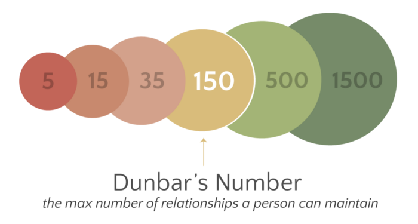

> *作者：Hugo Nguyen*
> 
> *来源：<https://hugonguyen.medium.com/bitcoin-and-the-dunbar-limit-5c820c4e5632>*

- 图片来自 <a href="https://commons.wikimedia.org/w/index.php?title=User:JelenaMrkovic&action=edit&redlink=1">JelenaMrkovic</a>。遵循自由创作-分享协议 4.0  -

*免责声明：本文包含我的个人观点和推论*。

谈及密码学货币时，我的主要兴趣在比特币而非 “区块链” 上。过去几年来，区块链炒作之风过盛，让我不禁想起了之前的互联网泡沫和其它泡沫，过往种种仍历历在目。眼看着一个在很多方面都毫无意义的东西开始达到数十亿美元的估值，周遭的人都在呐喊 “FOMO！（再不上车就来不及了）”， 你应该会感到困惑不已。

这里要说明的一点是，我可以想象到，未来将有极少数优秀的数字资产与比特币共存。这不是完全没有可能的。尽管如此，就影响力而言，或许再难有数字资产堪与比特币争锋。接下来我将阐述我的理由。

在之前的文章中，我已经解释过为什么我认为[以太坊](https://hugonguyen.medium.com/why-ethereum-architecture-is-flawed-d4eefd15db3e)、[PoS](https://hugonguyen.medium.com/work-is-timeless-stake-is-not-554c4450ce18)、[效用代币](https://twitter.com/hugohanoi/status/976261540419534848)、[NFT](https://twitter.com/hugohanoi/status/1368050381922529288) 等项目是不可行的，但是这不是本文的主旨。

那么，本文的主旨是什么？从根本上来说，我认为比特币将在很多方面大幅提高我们的合作效率并改变我们的社会组织方式。换言之，比特币将提高我们的 “邓巴能力（Dunbar level）”。

邓巴能力是什么？与比特币有什么关系？我们先来看几则故事。

## 1. 哥伦布和明朝

很多出生在当今时代的人都想当然地认为，西方一直是全球范围内的主导力量。无论是在人均 GDP 还是发达程度和技术发展方面，西方都领先于东方。在向西方思想文化敞开大门之后，东方才开始缓慢追赶上来。19 世纪末，处于明治时代的日本（在福泽谕吉等日本思想家的领导下）率先开始向西方学习，到了 20 世纪下半叶亚洲四小龙（韩国、台湾、新加坡和香港）紧随其后。最后，中国、越南和东南亚进一步壮大了这一浪潮。不必专门找什么证据，只消看看我们的日常生活：那些改善我们物质生活水平的东西，例如互联网、智能手机、汽车、空调、自动清洁马桶，都带有深刻的西方印记。

然而，东西方的地位并非一向如此。数千年来，东方，尤其是中国，都牢牢占据文明的顶峰。

早在哥伦布 “发现” 美洲之前，明朝宦官郑和就奉命率领舰队出海探索地平线以外的世界。郑和所率舰队包含数万名水师和数百艘海船。其中，最大的海船长约 500~600 英尺（约合 150 至 180 米），是哥伦布所率海船的 10 倍大。中国远征队踏足了很远的地方，几乎包括东南亚、印度洋、波斯湾和东非海岸的每一片土地。即使是叹为观止也不足以形容。

然而，中国的远征活动在很多方面都是失败的，尤其是与一个世纪后改变世界命运的欧洲远征活动相比。具体原因如下：

第一，中国远征活动的主要目的是扬中华王朝之威，并从外邦那里获取朝贡。但是，仅仅是这些贡品远远抵不上成本。第二，过于庞大（且维护成本很高）的海船并不适用于海上贸易。这意味着，这些海船的商业价值很低。出于上述原因，随着明朝由盛转衰，朝廷不得不停止这些航海活动，专心应对来自北方蒙古族的威胁。

但是，郑和的舰队彰显了中华王朝在那个时代无与伦比的国力。在任何一个时代，发现新大陆或许只反映了社会的某个方面，但是这些远征和探索活动凸显了这个社会的财富和技术水平。郑和的远征活动不同于如今 NASA、CSNA、SpaceX 和 BlueOrigin 之间的太空竞赛。只有地球上最强大、技术最发达的实体才能负担得起这些活动。

直到 19 世纪，中国依然是全球最大的经济体，其 GDP 约为全球 GDP 的 1/3。中国发明了指南针、造纸术、印刷术和火药。（曾被誉为 “白色黄金” 的中国瓷器是如此先进，以至于欧洲国家花了几个世纪才掌握其制造技术。）想象一下，如果早期的郑和远征活动有侵略目的，再加上火药的帮助，我们所生活的世界或许会是另一番面貌。事实上，是西方在几个世纪以后先对中国点燃了炮火。

然而，大约 400 年以前，中国开始逐渐失去主导地位。 中国走向衰弱的主要原因是什么？或者换个更准确的问法，是什么让西方在过去 400 年里超越东方？

## 2. 信仰体系的力量和限制

如果你读过尤瓦尔·赫拉利（Yuval Noah Harari）的《未来简史：从智人到智神》，你应该听说过 “邓巴数（Dunbar's number）”。由于人类的认知能力有限，每个人最多只能与 150 个人维持稳定的社交关系。邓巴数由英国人类学家罗宾·邓巴（Robin Dunbar）于 20 世纪 90 年代提出。邓巴 “发现了灵长类动物的大脑大小与社交群体平均规模之间的关联。”

值得一提的是，邓巴数具体由个人的实际情况和所处环境而定，但是该理论在大方向上是成立的。

在这里，我想要冒昧地在 “邓巴数” 上进一步延伸出 “邓巴能力” 的概念。“邓巴能力” 大体上可定义为：有些工具可以帮助人类更好地进行合作博弈，但是每一个工具在（a）能够支持的合作人数以及（b）对合作的促进作用上都是有限的1。这就是邓巴能力。换言之，当我们创造出能够更好地促进合作的工具时，我们就会 “升级” 2。

人类若想超越初始邓巴极限（第一级）并组成更庞大的群体，需要通过一些特殊的力量将陌生人团结起来。如若不然，我们至今仍只能生活在部落时代。

过去，宗教就是这样一种力量。

可以说，宗教是人类发明的第一个能够让数千乃至数百万人建立起相同的人生观、奉行同一套行为准则的东西。这些人甚至愿意为了信仰而奉献出自己的生命。在宗教出现之前，想要让人们像这样团结起来是不可能的。

11 世纪，基督教已经传遍了欧洲的每个角落。中世纪的国王纵使权势滔天，也要向教会低头。在教会权力最盛时，国王需接受教皇的加冕。那时，欧洲的权力中心不是英格兰、法国或西班牙，而是梵蒂冈城。

在东方，儒家思想起到了相似的作用。

自汉代（公元前 206 年至公元 220 年）以来，儒家思想成为了东方社会组织的核心。得益于儒家思想，民众有了自我调节的能力，使得国家无需干预其日常生活。

儒家思想赋予了中国人同一套认知系统，让中国人自发形成组织、形成不同的职业和阶层、支撑起东方的封建社会，从而突破了邓巴极限。

基督教和儒家思想拥有不可思议的凝聚力，而且能创造出高度复杂的社会结构，但是它们也拖住了我们的祖先。

基督教将上帝的话语置于首位。生活中的一切必须严格遵守圣经的教导。如果圣经说地球是宇宙的中心，那么这 “事实” 就不容否认。如果圣经说罪人应该被石头砸死或被火烧死，人就会被这么对待。

另一方面，儒家思想过分强调和谐以及每个人在维护和谐中起到的作用。孔子有云：“君君臣臣，父父子子。” 儒家认为每个人所扮演的角色自出生时就已经决定，几乎没有偏差的余地。儒家认为人们不需要探索或理解自然，只需要接受它并与之和谐共处。儒家重视人的内心所想，轻视人的所见所闻，因为儒家思想本质上以人为本，而非以自然为本。儒家思想也不鼓励人们跳出固有的思维模式，因为这样会破坏和谐并威胁社会秩序。简而言之，儒家思想是一种极度约束、压迫的思想体系。

欧洲的巨变始于哥白尼和伽利略。他们是最早敢于挑战教会权威的人，坚称地球不是宇宙的中心。再加上古腾堡于 15 世纪发明了印刷术，书本促进知识的传播，哥伦布远航所带来的灵感，这些事件逐渐改变了人们对生活的看法。它们为科学变革埋下了种子，带领人们跨入大发现时代。由于科学方法被发明出来，人们对宗教的依赖越来越少。人们不再盲从宗教教义，而是磨练自己的观察技巧，发现隐藏在自然界里的奥秘。

现在，我们可以回答第一则故事里的问题了：西方之所以能够超越东方，是因为西方能够摆脱其早期信仰体系（基督教）的束缚，而东方却没有跳出儒家思想的框架。

透过这则故事，我们可以看出信仰体系是一把双刃剑。它们通常都拥有团结人心的力量，但是也具有压迫性，阻碍人们进步。

如果信仰体系给予我们正向的引导（例如，不杀生、不偷盗），社会从长远来看会变得更好。但是，如果信仰体系阻碍我们进一步理解世界，我们就会止步不前，甚至倒退。

## 3. 美元宗教

基督教和儒家思想是最早帮助我们突破邓巴极限的两个信仰体系。

但是，有一个信仰体系甚至比宗教更加强大，那就是货币。

引用赫拉利的话来说：

> “货币比语言、法律、文化符码、宗教信仰和社会习惯更加开放。货币是人类创造出的唯一能够消弭几乎一切文化差异的信任系统，而且不会因宗教、性别、种族、年龄和性取向而产生歧视。”

感谢货币，即使是相隔万里或文化背景不同的两个陌生人也能进行交易；感谢货币，我们得以拥有市场和充满活力的经济体；感谢货币，我们可以创造出像公司和股东这样抽象的经济学概念；感谢货币，一个由数亿人组成的社会得以平稳运转。

纵观货币的发展史，黄金几乎都占据着首位。早在 5000 年前，人类就开始痴迷并收集黄金。但是，到了 20 世纪，美元取代黄金成了全球头号货币。这都要归功于两次世界大战和美国得天独厚的地理优势。

在 19 世纪的很长一段时间里，美国都在扩张版图。当太平洋战争于 20 世纪初爆发时，美国已经牢牢控制住了大部分内陆地区，并拥有北美的两条海岸线，因此在东西两边都有大洋作为天然屏障。得益于此，美国在两次世界大战期间都是受损最小的工业国。

美国不仅受损最小，更是从战争中收获了不少好处。在一战爆发前，美国只是世界舞台上的众多强国之一。在战争期间，美国为参战国提供武器和物资。美国不仅调整工业基地以适应战争需要，而且通过提供贷款成为越来越大的债权国。毫无疑问，全世界的财富都在逐渐流向美国。

这一趋势在二战后达到顶峰：这时的美国拥有全球一半以上的黄金储备（一些数据显示高达 75%）。 与此同时，世界上的其它国家遭到严重破坏，曾经的帝国主义列强发行的货币大幅贬值。在这种背景下，布雷顿森林体系于 1944 年确立，使得美元正式成为国际储备货币。这时，美元依然与黄金挂钩。拥有美元就等于间接拥有黄金。

但是，到了 1971 年，局势再度发生改变。美国因越南战争和林登·约翰逊（Lyndon Johnson）总统的 “伟大社会（Great Society）”计划而负债累累，财政紧张。之后，美国总统尼克松做出了近代史上影响最重大的决策之一，即，单方面终结雷顿森林体系，让美元与黄金脱钩并允许美元汇率浮动。美元与黄金已经存在的长达 200 年的关系就此正式终止。

（在美国历史上，黄金的作用曾受到极高的重视，以至于美国开国元勋在 1787 年宪法中增加了 “黄金和白银” 条款。）

将这些点滴事件串连起来，我们可以得出这样一个结论：是战争将美国和美元推向了主导地位，也是战争间接帮助我们创造了如今的全球金融体系。3

自 1971 年以来，美元的总供应量由被称为美联储的阴谋集团控制。我们没有将一般交换价值锚定到像黄金这样的中立、稀缺且不可伪造的金属上，而是信任这样一个小群体。

我们也可以这么说，自 1971 年以来，美元已经成了成熟的宗教。就像基督教一样，美元有自己的教义（双重使命）、自己的教堂（央行）、自己的传教士和施行者（主流经济学家和政治家）以及自己的教皇（美联储主席）。

事实上，我们对美元的信任不同于中世纪的人们相信地球是宇宙的中心。我们相信美元仅仅因为其他人也相信它。

美联储有着与梵蒂冈城一样深远的影响力。每当美联储发布政策公告时，全球市场都屏息以待。美联储跺跺脚，全世界都要抖三抖。

就像基督教一样，美元也有很强的压迫性。

随着美元崛起，美国成为了全球经济活动的 “警察”。

现实情况是，绝大多数国际支付都以美元作为支付货币。这意味着美国可以自由阻断全球经济活动，即使是与美国完全无关的活动。这就是美国制裁机制的基础。

美国实现制裁的主要方式是直接通过 Chips（美国清算所银行同业支付系统）和间接通过 SWIFT（环球银行金融电信协会）。Chips 平均每天处理价值约 1.5 万亿美元的交易，在大额国内和国际美元支付市场的占有率高达 96%。SWIFT 不负责交易的结算，但它是连接全球 11000 家银行的通信网络，而且牢牢掌控在美国手中。

近年来，尤其是 911 事件之后，美国已经增加了制裁行动。此举惹恼了很多国家，包括俄罗斯、中国，甚至是美国自己的同盟国。当美国总统特朗普开始向伊朗实施制裁时，欧盟鼓励其成员国与伊朗保持经济往来。2019 年，英国、法国和德国创建了一个叫作 INSTEX 的工具，用来绕开美国的制裁，但是以失败告终。美国对全球金融机制的控制实在过于强大。

正如上文所说，欧盟、俄罗斯和中国都在积极寻找方式推广本国货币，摆脱美元的影响。

美国对伊朗的制裁有力地证明了中心化货币系统的压迫性。如果没有这样一个系统，伊朗原本可以创造数十亿美元的贸易额，但是美国违背了很多国家的意愿，单方面阻止了这一切。

如果我们停下来思考一下，制裁这个概念本身就很奇怪。全球有近 200 个国家，仅靠一个国家的力量是如何在经济上完全孤立另一个国家的？只有当这个国家能够完全控制其它国家的经济时，才有可能做到这一点。如果我们把全世界看作一个村庄，美国就是当之无愧的头号村霸。

由国家发行的货币还有一个更大的问题是，通货膨胀和恶性通货膨胀。

由于人们盲目信任法币，国家可以轻易践踏民众的信任，不负责地超发货币。从古到今已经出现过很多因国家大肆超发货币而引起恶性通货膨胀的案例。前有罗马帝国、唐朝和明朝，后有阿根廷、委内瑞拉、津巴布韦和土耳其。

恶性货币超发会引发长期结构性问题。第一，导致货币丧失公信力，经济遭到破坏；第二，让深层次的矛盾火上浇油，而这些矛盾可能会快速转变成暴力冲突（一些历史学家认为罗马货币贬值是罗马帝国发生内战乃至走向衰亡的主要原因）；第三，极大地加剧了财富分配不均问题，因为上层阶级通常可以采用更多手段来对冲通胀的影响，例如，购买稀有商品或房地产。

财富分配不均问题自 1971 年以来不断加剧，这并非巧合。自中世纪以来，财富失衡问题已经达到近几个世纪以来最严重的程度。贫富悬殊导致了很多社会摩擦，还在多个国家引发了街头游行事件。

2020 年，美元流通量增加了 20%，这是史无前例的。2021 年，通胀压力随处可见，从天然气到蔬菜再到建筑材料都存在价格上涨情形。

美元（有近 50 年的历史）究竟是会存活下来还是因通胀而走向灭亡，只有时间才能告诉我们答案。但是，前车之鉴告诉我们别太乐观。

## 4. 比特币的使命

比特币有巨大的潜力，因为它能够成为比黄金和美元更好的货币标准。

比特币优于黄金，因为它像黄金那样不受任何人控制，而且具备真正的稀缺性。比特币的供应上限是 2100 万个，无法任意更改。

比特币优于黄金，因为它是数字化的，具备数字产品的所有特征，例如，光速转移、高效存储等等。黄金的运输、存储和鉴定成本都很高。因此，黄金的所有权在历史上一直受到不当没收的威胁。相比之下，比特币更容易存储和运输，而且验证成本很低。比特币非常适合互联网经济，因为它和互联网一样是无国界的。

比特币类似于黄金，因为二者的[伪造成本极高](https://nakamotoinstitute.org/shelling-out)（[中文译本](https://www.btcstudy.org/2020/08/23/the-origins-of-money-by-nick-szabo/)），而且它们最终都由能源背书。金原子来自数十亿年以前发生的中子星碰撞 —— 这就是黄金的 “[工作量证明](https://bitcointechtalk.com/the-anatomy-of-proof-of-work-98c85b6f6667)”（[中文译本](https://www.btcstudy.org/2020/09/04/the-anatomy-of-proof-of-work/)）。由于创造或合成黄金需要消耗大量能源，黄金很难伪造。同样，伪造比特币也需要消耗大量能源，因此任何个人或群体都不可能悄无声息地伪造比特币。

尽管如此，比特币并非无懈可击。相比经过了数千年检验的黄金，比特币存在的时间要短得多。比特币（为保持中立性所必需）的去中心化特性是相对而言的，可能会随时间的推移而发生变化。比特币网络的参与者（开发者、用户、企业、交易所和矿工）需要时刻保持警惕，确保整个系统的开放性和免许可性。

迄今为止，比特币一直在积极朝着这个方向发展，不断提高自己的去中心化程度和抗逆性。

在比特币的发展初期，挖矿活动都集中在中国，但是如今已经全部从中国境内转移到了其它国家。自主托管（self-custody）方面也取得了巨大的进步。早期，绝大多数比特币都由少数交易所持有，但是安全的自托管方式正在迅速增多。从长远来看，比特币系统还会变得更加健壮。

2017 年，比特币经历了最大的考验：几家最大的比特币挖矿企业和全网约 80% 的算力想要强行改变比特币协议的规则，削弱其去中心化程度。 然而，它们彻底失败了，对将来那些妄图操控比特币的人起到了威慑作用。

比特币是唯一一个自诞生以来正常运行时间高达 99.99% 的软件网络。在短暂的历史中，它已经拯救了很多生活在极权主义横行、战火纷飞或遭受经济制裁的国家的民众。

就货币的未来而言，没有哪个区块链项目能具备像比特币那样的网络效应和优势。

## 结论

人类之所以能站上食物链的顶端，是因为我们能够相互合作。如果缺少特殊的工具将我们凝聚起来并提高我们的合作技巧，我们只能生活在由数百人组成的小部落中。这就是邓巴极限。

总的来说，宗教和信仰体系是人类发明的首个能够打破邓巴极限的工具。在西方，这个工具是基督教；在东方，这个工具是儒家思想。信仰体系虽然拥有难以置信的强大力量，但是也有可能带来压迫感并阻碍进步。

货币也是一种信仰体系。货币的凝聚力甚至比宗教更强。感谢货币，我们可以与陌生人交换商品和服务。但是，与宗教相似的是，货币完全基于信仰运行，并由一小群能够创造压迫性金融环境的人控制。20 世纪，美国和美元一跃成为主导，但是自从尼克松于 1971 年单方面结束布雷顿森林体系后，美国逐渐将美元变成了一种金融武器。

比特币有望改变世界，因为它在很多方面都优于黄金和美元。比特币是政治中立的货币，而且没有歧视。在这个已经丧失了价值感受的世界，比特币为我们提供了良好的价值尺度。一旦取得成功，比特币将提高我们的合作效率，去除把关人，实现无障碍贸易，让全球大批人口实现繁荣富裕。

### 脚注：

1. 如果距离太远，比方说跨越行星，比特币可能就失灵了。

1. 尼克·萨博（Nick Szabo）称之为 “[社会可扩展性](http://unenumerated.blogspot.com/2017/02/money-blockchains-and-social-scalability.html)”（[中文译本](https://www.btcstudy.org/2021/10/27/money-blockchains-and-social-scalability-echo-edition/)），并从专业角度论证了比特币是如何提高社会可扩展性的。萨博的文章对本文的影响很深。

1. 战争和货币之间的关系是双向作用的。

（完）