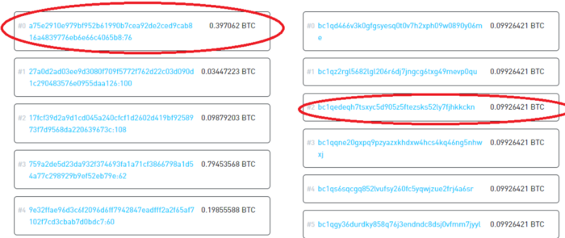

> *作者：nopara73*
> 
> *来源：<https://nopara73.medium.com/bitcoin-development-mental-models-9ac944435709>*

随着我的比特币开发经验的积累，有时候我会突然顿悟，颠覆原本的思维方式、过往的认知以及对钱包软件中基本构建块的处理方式。事实上，每次发生这种情况，我都会带着新的认识将我的钱包彻头彻尾重写一遍。

过去几天里，我意识到我可以使用另一种更好的方式来做我正在做的事。遗憾的是，这次没办法重写钱包，因为 Wasabi Wallet（芥末钱包）拥有大量用户，重构软件的核心部分会带来很高的风险。但是，至少我可以将这些新的认识分享出来。

## 1. 基于地址的心智模型

钱包软件里保存着许多地址，每个地址有各自的余额。我开发的第一个比特币钱包叫作 [DotNetWallet](https://github.com/nopara73/DotNetWallet)，还专门为此写了篇文章 [《构建你自己的比特币钱包》](https://www.codeproject.com/Articles/1115639/Build-your-own-Bitcoin-wallet)。DotNetWallet 钱包使用的就是这个心智模型。但是，比特币网络不是这么运作的。比特币区块链上没有地址。如果你围绕地址构建基本数据结构，这会导致你将来无法执行更高级的操作。

## 2. 基于交易的心智模型

下一步是从交易而非地址的角度来思考。我开发的第二个比特币钱包 [HiddenWallet](https://github.com/zkSNACKs/WalletWasabi/tree/hiddenwallet-v0.6) 就是采用的这一思路。软件里存储着一堆交易（的数据），每当我要向用户展示余额、找到可用的 UTXO 或做点别的什么事时，我可以根据这些交易计算出一切数据。这可以让我时刻掌握正确的钱包状态并执行各种高级操作，但是事实证明这是非常低效的，我需要增加各种辅助数据结构来缓解这个过程所带来的痛苦。

## 3. 基于 UTXO 的心智模型

接着，我又改用了 UTXO 模型，即，比特币单元模型。UTXO 是智能的，它们知道很多东西：谁花费的、付给了谁、标签、匿名集等……事实证明这个模型用起来很简单。我的第三个钱包 [Wasabi Wallet](https://github.com/zkSNACKs/WalletWasabi/) 就是以这个数据结构作为基础的。[Wasabi Wallet](https://github.com/zkSNACKs/WalletWasabi/) 的一切都以 UXTO 为中心。每当需要收发交易时，软件就把相关的 UTXO 整合为可感知的比特币。

问题在于，随着 Wasabi Wallet 软件的发展，钱包会变得越来越臃肿，那些用于检查我的 Coins List（代币列表）的算法变得极其缓慢。因此，在给软件增加功能支持时，我不得不十分谨慎，因为新功能可能可以解决一些极端需求，但也有可能更加拖慢整个软件的运行，对性能造成进一步打击。我需要找到一种方法来妥善检查这些 UTXO 之间的关系，这就是后面图模型的由来。

## 4. 基于图的心智模型

之后，我又顿悟了基于图（Graph）的心智模型。如果我创建一个基于图的数据结构，将 UTXO 作为点，使用加权边表示 UTXO 之间的关系，那会实用得多。

在这个图表中，当前 UTXO 将是顶点，但是我会将一些东西转移到边上。这里，边会发挥很重要的作用。

基于 UTXO 的心智模型的问题在于，UTXO 通过 txid（交易 ID）相互连接：某个 UTXO 存在于哪笔交易内，哪笔交易花费了该 UTXO。但实际上，UXTO 之间存在各种联系。例如，共享脚本的 UTXO 也应该相互连接，共享标签的 UTXO 也应该相互连接。

好吧，但是为什么要加上权重呢？为了提高区块链分析的准确性。以下面这个交易为例：

假设输入 #0（UTXO #0）和输出 #2（UTXO #1）都来自用一个用户，总共有 6 个不同的输出，因此 UTXO #1 的匿名集是 6。但是，如果 UTXO #0 和 UTXO #1 在同一个地址上呢？那么 UTXO #1 的匿名集就是 1。Wasabi 钱包处理的就是这种关系，但是这些额外的检验和探索需要消耗大量资源，而且遍布整个代码库。将这种关系添加到图的边，完全放弃匿名集概念，改用概率模型会更好。

我们可以得出以下结论：

- 如果没有标签或脚本匹配，UTXO #1 和 UTXO #0 之间联系的强度是 1/6。

- 如果有标签或脚本匹配，无论交易本身是什么样的，UTXO #1 和 UTXO #0 之间联系的强度都是 1。

根据图理论，只要我们在图中引入更多连接并意识到联系的强度就是图的权重，就可以做到很多意想不到的事。例如，我们能够根据权重来决定将哪些 UTXO 整合起来是最合理的，将隐私泄漏降至最低！

## 蝴蝶效应

这类概念乍看之下可能微不足道，但是在这些层面上做出改变和调整会产生深远的影响。

我之前谈论过一些细小的变化是如何以有趣的方式产生深远影响的，或许你会想试一试。我现在要去[学习图理论](https://mrpandey.github.io/d3graphTheory/)了。

（完）