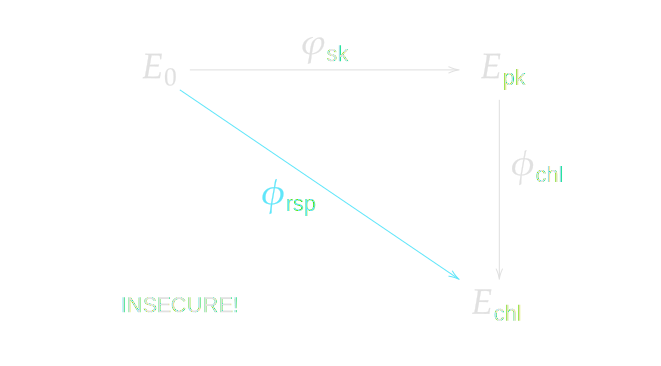
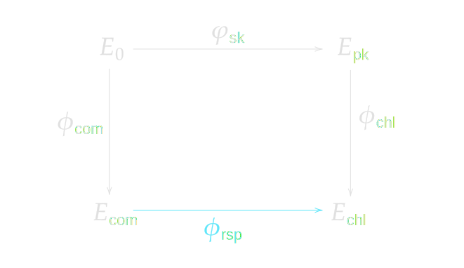
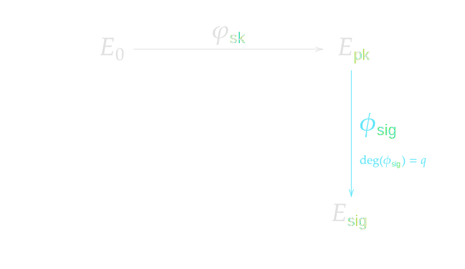
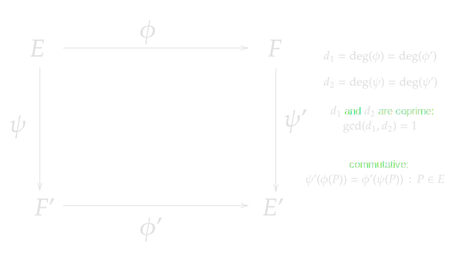

> *作者：conduition*
>
> *来源：<https://conduition.io/cryptography/isogenies-intro/>*
>
> *译者：Kurt Pan*
>
> *原文出版于 2026 年 3 月。*

在这篇文章中，我想说服比特币人，我们确实应该更多地了解基于同源的密码学（isogeny based cryptography），并像我们对经典椭圆曲线密码学所做的贡献那样，为这一领域做出贡献。

我将通过展示以下事实来阐述这一论点：当我们考虑将后量子密码系统集成到比特币中时，许多冒出来的问题，如果使用基于同源的密码学，基本都可以解决。这意味着，当比特币人某天寻找一种比目前的领先候选方案 —— [基于哈希的签名](https://conduition.io/cryptography/quantum-hbs/)（[中文译本](https://www.btcstudy.org/2026/03/02/hash-based-signature-schemes-for-post-quantum-bitcoin-part-1/)）—— 更灵活、代数结构更丰富的密码系统时，同源密码学将是一个天然的强劲竞争者。

我将先介绍一些同源密码学的背景知识 —— 不求严谨，只求提供一个高层概述，希望任何对经典椭圆曲线密码学有基本了解的人都能理解。特别地，作为案例研究，我们将考察前沿的 [SQIsign 协议](https://sqisign.org/)及[其 NIST 提交文档](https://sqisign.org/spec/sqisign-20250707.pdf)（最后更新于 2025 年 7 月），以及更新且尚未被充分理解的 [PRISM 签名系统](https://eprint.iacr.org/2025/135)。

一旦我们理解了同源的基础知识及其如何用于构建高效协议，我们就可以接着讨论，同源如何挽救比特币开发者认为在大多数后量子密码方案下已经失效的常用密码学技巧，例如密钥调整（key-tweaking）、BIP32 扩展公钥派生以及静默支付（silent payments），同时保持紧凑的签名和公钥。

**免责声明**

由于这是一篇技术文章，我假设读者已经熟悉经典椭圆曲线密码学（ECC）和哈希函数在比特币中的应用。如果你不具备这些知识，抱歉，这篇文章可能会有些难读。请参阅[我的 ECC 资源页面](https://conduition.io/cryptography/ecc-resources/)获取背景知识。

## 同源密码学

*同源*（isogeny）（非正式地）是一个将一条椭圆曲线上的点映射到另一条椭圆曲线上的点的函数。

没错，我们又要用到椭圆曲线（EC）了。

> 打住，椭圆曲线不是对量子计算机脆弱的吗？

不。椭圆曲线实际上对量子计算机或任何东西都不 “脆弱”，那是因为它们根本就没有什么需要保护的。椭圆曲线只是数学对象。

利用椭圆曲线构建的 *密码系统*（如签名或密钥交换）则可能是容易受到攻击的，但这还取决于这个密码系统所依赖的数学假设。

经典椭圆曲线密码学（ECC）假设 *椭圆曲线离散对数问题*（ECDLP）是困难的，但由于 Peter Shor 的同名算法，我们现在知道该问题可以用量子计算机来高效求解。

基于同源的密码学（IBC）则假设 *超奇异同源路径问题*（SIPP）是困难的。SIPP 问题是这样的：

**给定两条超奇异椭圆曲线 $E_1$ 和 $E_2$，你能否找到一个从 $E_1$ 到 $E_2$ 的同源？**

据我们所知，目前没有高效的量子算法能够高效求解这个问题。因此，大多数 IBC 系统使用 *超奇异*（supersingular）椭圆曲线来利用这一困难性假设。我将跳过 “超奇异” 含义的兔子洞不做详细解释，现在只需将它们视为 “好的” 椭圆曲线即可。

### 概述

基于同源的密码学（IBC）有一个好处，就是继承了经典椭圆曲线密码学的一套术语。不过，基本规则发生了变化。我们不再使用点和标量，而是使用椭圆曲线和它们之间的同源。

|                | 私钥               | 公钥           |
| -------------- | ------------------ | -------------- |
| **经典 ECC**   | 对某素数取模的标量 | 固定曲线上的点 |
| **同源密码学** | 同源               | 整条椭圆曲线   |

在 IBC 中，我们通常从一条公认的基础椭圆曲线 $E_0$ 开始。要生成密钥对，用户需要生成一个秘密同源 $\varphi$，将 $E_0$ 上的点映射到另一条曲线上。我们更简洁地写作：

$$\varphi: E_0 \to E_{\mathrm{pk}}$$

**同源 $\varphi$ 是用户的私钥，曲线 $E_{\mathrm{pk}}$ 是其公钥。**

签名通常由一个非交互式零知识证明组成，证明用户知道秘密同源，方法是计算并揭示某个别无其它方式知晓的同源，并使所揭示的同源与消息绑定。

### 基本规则

要理解签名在同源世界中如何工作，我们必须了解数学家发现的一些关于同源的有趣结论。你暂时需要相信我的话，因为我们没有所需的背景来完整证明它们，但这些事实已被证明且广为人知。

1. 每个同源都有一个 *核*（kernel），即某个有限的点集合，同源将其映射到余域（codomain）（输出曲线）上的无穷远点。同源几乎可以被其核唯一标识，而核本身通常可以用一个 *核生成点* 高效表示。

   > 校对注：设有函数 f(X) ，则 X 的取值范围被称为 “定义域（domain）”；已知 f(X) 的值会落在集合 Y 内，则称 Y 为该函数的 “余域（codomain）”。数学教学往往在 $f(X) \rightarrow Y$ 时将 Y 称为 “值域”，但两个概念其实并不相等：值域是小于等于余域的。 

2. 每个同源 $\varphi: E_1 \to E_2$ 都有一个 *对偶* $\hat{\varphi}: E_2 \to E_1$（用小帽子表示），你可以将其视为一种逆，尽管并不完全如此。$\hat{\varphi}$ 可以仅通过 $\varphi$ 高效计算。

3. 一个从椭圆曲线 $E$ 映射回自身的同源 $\alpha: E \to E$ 称为 *自同态*（endomorphism）。在有限域上定义的任何一条椭圆曲线都有一个有限（但非常大）的可能自同态集合。

4. 如果将一条椭圆曲线的自同态通过复合和加法（作为多项式函数）组合起来，它们构成一个结构化的群，具体来说是一个 [*环*](https://en.wikipedia.org/wiki/Ring_(mathematics))。曲线 $E$ 的自同态环记作 $\text{End}(E)$。

5. 某些超奇异椭圆曲线具有已知且友好的自同态环。其中一条这样的曲线是 $E_0: y^2 = x^3 + x$。

6. 仅给定 $E$ 来计算 $\text{End}(E)$ 通常是一个非常困难的问题，现在被称为*自同态环问题*。

7. 自同态环问题等价于同源路径问题。具体来说：
   - 给定曲线 $E_1$ 和 $E_2$ 及其自同态环 $\text{End}(E_1)$、$\text{End}(E_2)$，我们可以高效计算一个同源 $\varphi: E_1 \to E_2$（或 $E_2 \to E_1$）。
   - 给定曲线 $E_1$ 和 $E_2$、一个自同态环 $\text{End}(E_1)$ 和一个同源 $\varphi: E_1 \to E_2$，我们可以高效计算自同态环 $\text{End}(E_2)$。

拥有私钥 $\varphi: E_0 \to E_{\text{pk}}$ 后，我们可以利用对 $\text{End}(E_0)$ 的了解来计算 $\text{End}(E_{\text{pk}})$。现在我们拥有了一些其他任何人 —— 有希望连量子攻击者 —— 都无法做到的新能力：

- 如果给定一个同源 $\phi_1: E_{\text{pk}} \to E'$，我们可以高效计算一个同源 $\psi_1: E_0 \to E'$
- 如果给定一个同源 $\phi_2: E_0 \to E'$，我们可以高效计算一个同源 $\psi_2: E_{\text{pk}} \to E'$

### 朴素（不安全的）签名

了解了同源的基本规则后，也许你已经能看出签名方案可能是如何工作的了。

- 对公钥曲线 $E_{\text{pk}}$ 和消息 $m$ 进行哈希，生成一个伪随机的 *挑战* 同源 $\phi_{\text{chl}}: E_{\text{pk}} \to E_{\text{chl}}$，将公钥映射到一条任意的挑战曲线 $E_{\text{chl}}$
- 利用对 $\text{End}(E_{\text{pk}})$ 和 $\phi_{\text{chl}}$ 的知识，计算挑战曲线的自同态环 $\text{End}(E_{\text{chl}})$
- 利用对 $\text{End}(E_0)$ 和 $\text{End}(E_{\text{chl}})$ 的知识，计算一个 *响应* 同源 $\phi_{\text{rsp}}: E_0 \to E_{\text{chl}}$
- 签名即为 $\phi_{\text{rsp}}$。验证者重新计算 $\phi_{\text{chl}}: E_{\text{pk}} \to E_{\text{chl}}$ 并检查 $\phi_{\text{rsp}}$ 确实是从 $E_0 \to E_{\text{chl}}$ 的同源

这产生了非常简洁的密钥和签名。密钥就是椭圆曲线，具有非常紧凑的表示（小到一个标量），签名就是同源，如我之前提到的，可以压缩到椭圆曲线上的单个点，如果同源具有 [*光滑*](https://en.wikipedia.org/wiki/Smooth_number) 度（smooth degree），还可以进一步压缩。

但请注意，这个朴素方案是不安全的。一方面，没错，这个过程确实 *证明* 了签名者知道 $\varphi_{\text{sk}}$——否则她无法计算 $\text{End}(E_{\text{chl}})$。用密码学术语来说，该证明是*可靠的*（sound）。

然而，它并 *不是零知识的*。通过揭示响应同源 $\phi_{\text{rsp}}: E_0 \to E_{\text{chl}}$，签名者也暴露了她的私钥。

- 攻击者大概知道 $\text{End}(E_0)$，因为它是方案的固定参数。
- 知道 $\text{End}(E_0)$ 和 $\phi_{\text{rsp}}: E_0 \to E_{\text{chl}}$，攻击者可以计算 $\text{End}(E_{\text{chl}})$
- 验证者必须知道消息 $m$ 和公钥 $E_{\text{pk}}$，因此可以计算 $\phi_{\text{chl}}: E_{\text{pk}} \to E_{\text{chl}}$
- 从 $\phi_{\text{chl}}$ 攻击者可以计算其对偶 $\widehat{\phi_{\text{chl}}}: E_{\text{chl}} \to E_{\text{pk}}$
- 知道 $\text{End}(E_{\text{chl}})$ 和 $\widehat{\phi_{\text{chl}}}: E_{\text{chl}} \to E_{\text{pk}}$，攻击者可以计算 $\text{End}(E_{\text{pk}})$（糟糕）
- 攻击者现在可以使用 $\text{End}(E_{\text{pk}})$ 伪造签名。

让我们看看 SQIsign 如何修复这个朴素方案，将其转变为一个可以被证明 *可靠* 且 *零知识* 的安全签名方案。

## SQIsign

[SQIsign](https://sqisign.org/)（发音为 “ski-sign”）是领先的基于同源的签名协议，由数十名研究人员合作开发，其中许多人是同源领域的知名专家。它目前正在参与 NIST 的后量子密码签名标准化竞赛。

### SQIsign 尺寸

SQIsign 对比特币人来说应该特别有意义，因为它在 NIST 考虑的所有后量子签名协议中提供了迄今为止最小的 密钥 + 签名 尺寸。

| 参数集   | 安全级别（位） | 公钥     | 签名     | 公钥 + 签名 |
| -------- | -------------- | -------- | -------- | ----------- |
| NIST I   | 128 位         | 65 字节  | 148 字节 | 213 字节    |
| NIST III | 192 位         | 97 字节  | 224 字节 | 321 字节    |
| NIST V   | 256 位         | 129 字节 | 292 字节 | 421 字节    |

最小化 公钥 + 签名 尺寸对基于区块链的密码货币（如比特币）至关重要，因为这个指标直接影响整个系统的交易吞吐量，通常每花费一个 UTXO 至少需要一对 公钥+签名 。

与之比较，下一个最小的非平凡签名方案 SNOVA（NIST-I 级别）仅在 NIST-I 级别的 公钥 + 签名 尺寸就达到 1264 字节。SNOVA 已被多次攻击削弱 —— 下一个在设计上具有一定公众信心的最小方案是 Falcon-512，公钥 + 签名 尺寸为 1563 字节。

要比较其他后量子密码方案，请参阅 [Thom Wigger 的 PQC Zoo](https://pqshield.github.io/nist-sigs-zoo/)。

### SQIsigning

SQIsign 通过在签名算法中添加几个额外步骤来修复我们之前设计的朴素方案：

- **生成一个随机的秘密 *承诺* 同源 $\phi_{\text{com}}: E_0 \to E_{\text{com}}$，将 $E_0$ 映射到一条任意的承诺曲线 $E_{\text{com}}$。**
- 对公钥曲线 $E_{\text{pk}}$、承诺 $E_{\text{com}}$ 和消息 $m$ 进行哈希，生成一个伪随机的 *挑战* 同源 $\phi_{\text{chl}}: E_{\text{pk}} \to E_{\text{chl}}$，将公钥映射到一条任意的挑战曲线 $E_{\text{chl}}$
- 利用对 $\text{End}(E_{\text{pk}})$ 和 $\phi_{\text{chl}}$ 的知识，计算挑战曲线的自同态环 $\text{End}(E_{\text{chl}})$
- **利用对 $\text{End}(E_0)$ 和 $\phi_{\text{com}}$ 的知识，计算承诺曲线的自同态环 $\text{End}(E_{\text{com}})$**
- 利用对 $\text{End} \lbrace \boldsymbol{E}_{\text{com}} \rbrace $ 和 $\text{End} \lbrace E_{\text{chl}} \rbrace$ 的知识，计算一个 *响应* 同源 $\phi_{\text{rsp}}: \boldsymbol{E}_{\text{com}} \to E_{\text{chl}}$
- 签名即为 $\phi_{\text{rsp}}$。验证者重新计算 $\phi_{\text{chl}}: E_{\text{pk}} \to E_{\text{chl}}$ 并检查 $\phi_{\text{rsp}}$ 确实是从 $\boldsymbol{E}_{\text{com}} \to E_{\text{chl}}$ 的同源

注意添加 $\phi_{\text{com}}$ 是如何创建了一种 *缓冲区*，将基础曲线 $E_0$ 与响应同源 $\phi_{\text{rsp}}$ 分隔开来的。由于攻击者不知道 $\phi_{\text{com}}$，他们无法找到从 $E_0$ 到 $E_{\text{pk}}$ 的同源路径。这一步让我们能够证明签名方案的零知识性，使其完全安全。

承诺同源 $\phi_{\text{com}}$ 及其余域 $E_{\text{com}}$ 对每个签名*必须*是唯一的，且不能重用。可以将其视为与经典 Schnorr 签名中的随机数（nonce）扮演类似角色：如果我们对两个不同的签名重用一个承诺，就会揭示 $E_{\text{pk}}$ 的一个非平凡自同态，这[可以用来提取 $\text{End}(E_{\text{pk}})$ 的完整自同态环](https://arxiv.org/pdf/2309.11912v4)。

有很多细节和重要步骤我略过了，特别是整个 *Deurring 对应* 以及超奇异椭圆曲线与四元数代数之间的关系，但这就是 SQIsign 协议的骨架。迄今为止我读到的最好的描述来自 [SQIsign NIST 提交文档](https://sqisign.org/spec/sqisign-20250707.pdf)（第 5 页），我在这里做了一些美学调整和省略后复述。在 NIST 提交中，作者将 SQIsign 描述为一个 *sigma 协议*，他们使用 Fiat-Shamir 变换将其转化为非交互式签名方案。

然而，理解本文其余部分并不需要这些细节。如果你想更多了解 SQIsign，也可以查看他们的[原始论文](https://eprint.iacr.org/2020/1240)、[参考实现](https://github.com/SQISign/the-sqisign)或[这个博客](https://learningtosqi.github.io/)。

## PRISM

SQIsign 很出色，但即使是其作者也承认该方案极其复杂且难以实现。PRISM 是一个后起之秀方案，提供了更简单的实现、紧凑的公钥和签名，以及与 SQIsign 相当的性能。

| 参数集   | 安全级别（位） | 公钥     | 签名     | 公钥 + 签名 |
| -------- | -------------- | -------- | -------- | ----------- |
| NIST I   | 128 位         | 66 字节  | 189 字节 | 255 字节    |
| NIST III | 192 位         | 98 字节  | 288 字节 | 386 字节    |
| NIST V   | 256 位         | 130 字节 | 388 字节 | 518 字节    |

*PRISM 作者在[其论文第 26 页](https://eprint.iacr.org/2025/135)中指出，使用配对函数可以将签名的尺寸进一步压缩约 20%（SQIsign 也这样做），代价是额外的复杂度和较慢的性能。*

与 SQIsign 一样，PRISM 的私钥也是一个秘密同源 $\varphi : E_0 \rightarrow E_{\mathrm{pk}}$。PRISM 签名也是一个只有 $\varphi$ 的持有者才能创建的同源。PRISM 甚至使用与 SQIsign 相同的有限域，并借用了他们的密钥生成算法。这种兼容性奇妙地意味着 SQIsign 密钥可以用来创建或验证 PRISM 签名，反之亦然。

然而，PRISM 使用了超出 SQIsign 所依赖假设之外的额外安全假设。SQIsign 主要依赖超奇异同源路径问题（以及等价的自同态环问题）。除了 SIPP，PRISM 还依赖于这样一个假设：给定一条超奇异椭圆曲线 $E$ 和一个大素数 $q$，找到一个以 $E$ 为定义域（输入曲线）且 *度* 为 $q$ 的同源是困难的。

>  **同源的 “度” 是什么？**
>
>  同源可以被视为一对 *有理* 多项式，作用于曲线点的 $x$ 和 $y$ 坐标：
>
>  $$\varphi((x, y)) = \left(\frac{g_1(x)}{h_1(x)}, y\frac{g_2(x)}{h_2(x)}\right)$$
>
>  其中：
>
>  - $g_1$、$h_1$、$g_2$、$h_2$ 是多项式
>  - $g_1$ 和 $h_1$ 互素
>  - $g_2$ 和 $h_2$ 互素
>  - $h_1$ 和 $h_2$ 具有相同的根
>
>  同源 $\varphi$ 的*度*，记作 $\deg(\varphi)$，就是：
>
>  $$\deg(\varphi) = \max(\deg(g_1), \deg(h_1))$$
>
>  同源的度也与其 *核* 有关，但我们留到后面再讨论。

我们知道，如果你知道 $\text{End}(E)$，这个问题可以轻松解决。虽然 PRISM 作者提出了不错的论证，说明在不知道 $\text{End}(E)$ 的情况下找到素度同源可能是困难的，但这个问题并没有严格归约到 SIPP 或 ERP。需要一个新的假设。

撇开风险不谈，如果这个假设成立，我们可以创建一个非常简单的哈希签名方案。

- 构造一个哈希函数 $H$，将二进制输入哈希为大素数。
- 给定消息 $m$ 和公钥 $E_{\text{pk}}$，计算素数 $q = H(E_{\text{pk}}, m)$
- 签名者利用她对 $\text{End}(E_{\text{pk}})$ 的知识，找到一个同源 $\phi_{\text{sig}}: E_{\text{pk}} \to E_{\text{sig}}$ 使得 $\deg(\phi_{\text{sig}}) = q$
- 签名即为 $\phi_{\text{sig}}$。验证者检查 $\deg(\phi_{\text{sig}}) = H(E_{\text{pk}}, m)$

这比 SQIsign 实现起来和推理起来都简单得多，但其安全性显然更难以确证。它也是一个更新的协议，[新的攻击](https://eprint.iacr.org/2025/1602)始终是可能的。

奇妙的是，如果从任意曲线生成素度同源（prime-degree isogenies）是容易的，*这将证明 SQIsign 是安全的*，因为 SQIsign 在其零知识安全证明中假设了素度同源预言机（prime-degree isogeny oracles）的存在。PRISM 和 SQIsign 的安全性证明 —— 很神奇地 —— 是 *互补的* —— 如果 SQIsign 被攻破，这将证明此类预言机不存在，从而 PRISM 的假设是安全的；反之亦然，如果生成素度同源很容易，PRISM 会被攻破但 SQIsign 将被证明安全。这让我们有理由预期，如果任一方案在不破坏 ERP/SIPP 的情况下被成功攻击，我们会对另一方案突然更有信心。

我听过 PRISM 的一位作者在[一次演讲](https://www.youtube.com/watch?v=YUMc5kOIACg)中称此为“基于共识的安全性（security by common belief）”。这并不必然意味着两者之中只有一个是安全的。可能两者都安全，只是目前没人知道如何严格证明。

说到攻击……

## SIDH 攻击

大多数听说过基于同源密码学的人可能还记得 2022 年关于 SIKE/SIDH 被 [“一台 10 年前的笔记本电脑攻破”](https://www.quantamagazine.org/post-quantum-cryptography-scheme-is-cracked-on-a-laptop-20220824/)的事。领先的基于同源的公钥交换密码系统 SIDH（超奇异同源 Diffie-Hellman）[被 Wouter Castryck 和 Thomas Decru 发现了一种毁灭性的攻击](https://eprint.iacr.org/2022/975)，该攻击可以在普通的经典计算机上快速高效地执行。[这里有 Decru 关于攻击原理的精彩演讲](https://www.youtube.com/watch?v=mx9qNHm3mco)，我发现无需太多背景知识就能理解。

人们经常将这一攻击作为基于同源密码学对于现实使用来说太年轻、不够安全的证据。虽然我部分同意，但上下文非常重要。

### 重新发现 Kani 引理

Castryck 和 Decru 发现的实际上是一个非常 *古老* 的结果，源于 [Ernst Kani 在 1997 年的一篇论文](https://mast.queensu.ca/~kani/papers/numgenl.pdf)，该论文已被现代同源研究者遗忘。这篇 25 年前的论文证明了一个非常重要的命题，现在被称为 *Kani 引理*，其内容（非完全一般化地）为：

*给定椭圆曲线 $E$、$E^\prime$、$F$、$F^\prime$，以及它们之间的下列可交换（commutative \*）同源：*

*…… 那么存在一个度为 $N = d_1 + d_2$ 的高维同源 $\Phi$，作用于椭圆曲线的**积**之间：*

$$\Phi: E \times E' \to F \times F'$$

*…… 由一个 2x2 同源矩阵给出：*

$$\Phi = \begin{pmatrix} \phi & \widehat{\psi}' \\\\ -\psi & \widehat{\phi}' \end{pmatrix}$$

*…… 其核为：*

$$\begin{aligned}\ker(\Phi) &= \{\, (\widehat{\phi}(P), \psi'(P)) : P \in F[N] \,\} \\\\ &= \{\, (d_1 P, \psi'(\phi(P))) : P \in E[N] \,\}\end{aligned}$$

这里 $E[N]$ 和 $F[N]$ 分别是 $E$ 和 $F$ 的 $N$-挠子群（N-torsion subgroup）。

理解挠子群并非关键，但要记住的一个重要事实是：*同源可以由其核唯一标识，如果你知道核就可以高效求值该同源。*

Kani 引理向世界展示了，来自同源的挠点像（求值结果）实际上是该同源之核 *嵌入* 到某个高维同源中的一种表达形式。

碰巧的是，SIDH 正是通过在密钥交换参与者之间交换挠点像来工作的。我在这里将跳过这个已被破解的密码系统的细节 —— Decru 本人在他的演讲中做了更好的解释 —— 但这一重新发现自然地打破了 SIDH 的基本假设，使得攻击者可以利用 SIDH 要求参与者共享的挠点像，通过计算高维同源来发起高效攻击。

你可以在[这里](https://www.math.auckland.ac.nz/~sgal018/kani.pdf)和[这里](https://eprint.iacr.org/2025/1706.pdf)阅读更多关于 Kani 引理的内容，也可以参阅 [Castryck 和 Decru 的 SIDH 攻击论文](https://eprint.iacr.org/2022/975)，以及 [Decru 的这个演讲](https://www.youtube.com/watch?v=mx9qNHm3mco)。

### 后续发展

这次攻击并没有危及大多数其他基于同源的密码系统，原因很简单：大多数其他协议（除非基于 SIDH）都不涉及挠点像的交换。即使是名称相似的 CSIDH 协议也未受影响，因为它的工作原理完全不同。

相反，Castryck 和 Decru 在 2022 年的攻击 *极大地加速了 IBC 的进展*。现代研究的很大一部分围绕着如何巧妙地使用 Kani 引理和高维同源来创建新方案和加速现有方案。

例如，SQIsign 的作者利用高维同源在 SQIsign 协议的 v2 版本中大幅提升了签名和验证性能。SQIsigning 过去需要一秒多的时间，现在只需要几毫秒。如果没有 Kani 引理，PRISM 就不会存在——它将 Kani 引理用作生成和求值素度同源的高效手段。许多其他 IBC 密码系统都因这次复兴而受益和蓬勃发展。

（未完）