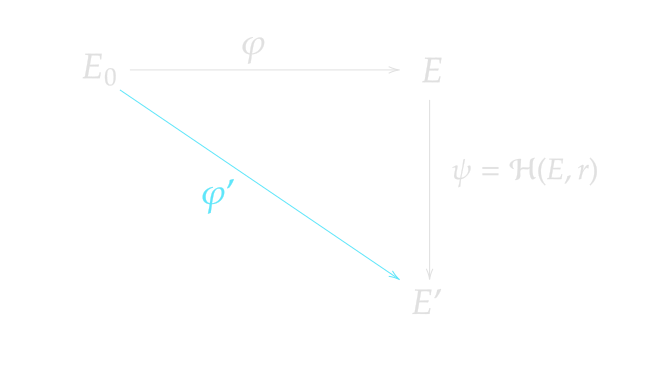

> *作者：condution*
>
> *来源：<https://conduition.io/cryptography/isogenies-intro/>*
>
> *译者：Kurt Pan*
>
> *原文出版于 2026 年 3 月。*
>
> [*前篇见此处*](https://www.btcstudy.org/2026/04/15/bitcoin-devs-should-be-learning-isogeny-cryptography-part-1/)

## 旧技巧，新密码学

虽然我们可以花很多时间探索 SQIsign、PRISM、SIDH 的内部工作原理以及同源密码学底层的数学证明，但这对本文的核心论点并非必要。请记住：我试图论证的是*比特币人*应该学习基于同源的密码学并向其投入资源。我们该切入正题了。

现在我们对基于同源的密钥对和签名方案如何工作有了一些理解，我们已经看到了如何攻击它们以及如何证明安全。我们知道了基本规则。

终于可以讨论同源如何替代比特币上常用的经典 ECC 技巧了。

## 可以重随机化的公钥

也许令人惊讶的是，比特币生态中使用的许多高层密码学构造，都可以抽象为一个更简单的构建模块，叫做 “*可以重随机化* 的公钥方案”，该方案可以用 IBC 方案实例化（并且已经有这样的案例）。

*可重随机化公钥方案* 是一种公钥密码系统，我们有以下算法：

- $\text{KeyGen}(sk) \to pk$ 生成一个密钥对。
- $\text{RerandomizePublic}(pk, r) \to pk'$，其中 $r$ 是随机盐。
- $\text{RerandomizeSecret}(sk, r) \to sk'$，其中 $r$ 是随机盐。

对于可重随机化公钥方案的 *正确性*，给定 $pk = \text{KeyGen}(sk)$，我们需要：

$$\text{KeyGen}(\text{RerandomizeSecret}(sk, r)) = \text{RerandomizePublic}(pk, r)$$

用白话说：*重随机化的私钥必须正确地对应于其公钥的重随机化。*

构造一个 *正确* 的可重随机化公钥方案是容易的。只需定义 $\text{RerandomizeSecret}(sk, r)$ 输出一个从 $sk$ 和 $r$ 派生的随机私钥，然后定义 $\text{RerandomizePublic}(pk, r) := \text{KeyGen}(\text{RerandomizeSecret}(sk, r))$ 。

但显然这不会是安全的。任何知道 $pk$ 和 $r$ 的对手都可以重新派生出重随机化的私钥，从而签名消息。

为了获得完全的隐私和安全性，我们还需要 *不可链接性*（unlinkability）和 *不可伪造性*（unforgeability）这两个属性。

- **“不可链接性”**意味着重随机化的密钥与独立生成的随机密钥不可区分，除非你知道用于重随机化密钥的盐 $r$。
- **“不可伪造性”**意味着攻击者无法为重随机化的公钥伪造签名，除非他们也知道私钥（本身可能重随机化过）。

### 动机

重随机化概括了比特币中使用的许多密码学技术的本质：

| 技术                              | 重随机化等价物                                               |
| --------------------------------- | ------------------------------------------------------------ |
| Taproot 密钥调整（BIP341）        | $\text{RerandomizePublic}(pk, H(pk, m)) \to pk'$，其中 $m$ 是 Merkle 树的 Merkle 根。重随机化后的公钥 $pk'$ 是对 $m$ 的一个隐藏且绑定的承诺，可以通过揭示 $(pk, m)$ 来打开。 |
| 强化（秘密）子密钥派生（BIP32）   | $\text{RerandomizeSecret}(sk, H(sk, c, i)) \to sk'$，其中 $c$ 是链码（伪随机盐），$i$ 是一个 32 位整数。重随机化后的私钥 $sk'$ 是一个子密钥，只有在你知道父私钥 $sk$ 和链码 $c$ 的情况下才能派生。 |
| 非强化（公开）子密钥派生（BIP32） | $\text{RerandomizePublic}(pk, H(pk, c, i)) \to pk'$，其中 $c$ 是链码（伪随机盐），$i$ 是一个 32 位整数。重随机化后的公钥 $pk'$ 是一个子密钥，只有在你知道父公钥 $pk$ 和链码 $c$ 的情况下才能派生。 |

这种可重随机化公钥方案的通用性使我们得出结论：只要我们能使用同源实例化一个正确、不可链接且不可伪造的重随机化系统，那我们就立即让 BIP32、BIP341 密钥调整以及（附带一些条件的）BIP352 静默支付有了后量子继承者。

### 先前工作

经典 ECC 实现（包括在比特币中）通常按如下方式实例化重随机化：

- 设 $G$ 为素数阶 $n$ 的椭圆曲线的基点
- 构造一个抗碰撞哈希函数 $H_n: \{0, 1\}^* \to \mathbb{Z}_n$，将任意输入映射为模 $n$ 的整数
- 给定 $sk \leftarrow \mathbb{Z}_n$，定义 $\text{KeyGen}(sk) := sk \cdot G$
- 给定 $pk = \text{KeyGen}(sk)$ 和
  - 定义 $\text{RerandomizeSecret}(sk, r) := sk + H_n(r)$
  - 定义 $\text{RerandomizePublic}(pk, r) := pk + H_n(r) \cdot G = (sk + H_n(r)) \cdot G$

虽然在后量子格密码学背景下已有一些关于可重随机化密钥的工作，但该技术总是受制于格密码公钥的不灵活的结构。试图为格密码密钥对引入结构似乎会妨碍密钥和签名的紧凑性。例如，[这篇近期论文](https://eprint.iacr.org/2026/380)（也可参见[这篇配套博客文章](https://blog.projecteleven.com/posts/lattice-hd-wallets-post-quantum-bip32-hierarchical-deterministic-wallets-from-lattice-assumptions)）给出了一种可重随机化签名方案并将其用于非强化 BIP32 密钥派生，但代价是 16kb 的公钥和 20kb 的签名（比 ML-DSA 大 8 倍以上）。

对于格密码来说，密钥重随机化还影响安全性，需要我们施加使用限制：

> 备注 2. 虽然使用 Raccoon-G 的构造允许公钥重随机化，但这会增加密钥的噪声并改变签名的分布。这影响了签名分布可以被论证为不可区分的最大深度，这是不可链接性论证的一部分。可以考虑一种 “混合” 方法，即限制每个用 $\text{DetKeyGen}$ 生成的公钥的非强化派生次数。

## 同源重随机化

我们可以用同源实现高效且安全的后量子重随机化。

设 $\varphi: E_0 \to E$ 为从基础曲线 $E_0$ 映射到公钥曲线 $E$ 的秘密同源。

设 $\mathcal{H}(E, r)$ 为一个哈希函数，返回一个以 $E$ 为定义域（输入曲线）的均匀随机同源。

要在不知道私钥的情况下重随机化公钥曲线 $E$ —— 给定随机盐 $r$，我们派生一个同源 $\psi = \mathcal{H}(E, r)$，它将 $E \to E'$，并使用余域（输出）曲线 $E'$ 作为更新后的公钥。相当简单。事实上，SQIsign 在其签名和验证的 Fiat-Shamir 变换中每次生成挑战同源 $\phi_{\text{chl}}$ 时，做的几乎正是这件事。

重随机化私钥同源 $\varphi$ 则更微妙。给定盐 $r$，我们可以重新派生同源 $\psi = \mathcal{H}(E, r)$。因为我们知道公钥的自同态环 $\text{End}(E)$ 和同源 $\psi: E \to E'$，我们可以计算 $\text{End}(E')$。同时，由常识知道 $\text{End}(E_0)$，我们现在可以找到一个秘密同源 $\varphi': E_0 \to E'$，这就是我们的新私钥。

*一个关于同源的有用一般性事实：如果你知道从任一曲线 $E_1$ 到任何另一曲线 $E_n$ 的同源路径，即使该路径涉及其他曲线 $E_2, E_3, E_4, \ldots$ 之间的许多中间同源，只要你知道路径上至少某一条曲线的自同态环（不一定是第一条或最后一条曲线的），就相对容易计算一个直接从 $E_1$ 到 $E_n$ 的新的简洁同源。*

更具体地说：

- 定义 $\text{KeyGen}(\varphi) := \text{Codomain}(\varphi)$
- 定义 $\text{RerandomizePublic}(E, r)$：
  - 计算 $\psi = \mathcal{H}(E, r): E \to E'$
  - 返回 $E' = \text{Codomain}(\psi)$
- 定义 $\text{RerandomizeSecret}(\varphi, r)$：
  - 计算 $E = \text{KeyGen}(\varphi)$
  - 利用 $\text{End}(E_0)$ 和 $\varphi$ 计算 $\text{End}(E)$
  - 计算 $\psi = \mathcal{H}(E, r): E \to E'$
  - 利用 $\text{End}(E)$ 和 $\psi$ 计算 $\text{End}(E')$
  - 利用 $\text{End}(E_0)$ 和 $\text{End}(E')$ 计算 $\varphi': E_0 \to E'$
  - 返回 $\varphi'$

正确性很容易看出。通过重随机化 $\varphi$ 所生成的公钥与通过重随机化原始公钥 $E$ 所找到的曲线 $E'$ 相同。

$$\text{KeyGen}(\text{RerandomizeSecret}(\varphi, r)) = \text{RerandomizePublic}(E, r)$$

### 性质

基于同源的 $\text{ReRandomizePublic}$ 算法快速且更容易实现，因为我们只需要生成一个伪随机同源并计算其余域，这是一个具有现成高效算法的已知任务。技术上讲，我们甚至不需要求出这个同源。

$\text{ReRandomizeSecret}$ 更为复杂且计算开销更大，但最终仍是多项式时间的。我不知道实际速度如何，但根据 SQIsign 的性能推测，可能在毫秒量级。

### 安全性

这种技术已在几篇论文中被描述，例如[这篇](https://eprint.iacr.org/2024/400)（第 3 页）和[这篇](https://eprint.iacr.org/2023/1915)（仅限有向同源，第 10 页），尽管总是在加密上下文中而非签名方案中。不过该概念同样适用于签名密钥。

证明不可链接性需要证明 $\text{RerandomizePublic}(E, r)$ 所得的更新曲线 $E'$ 与超奇异椭圆曲线的均匀随机分布不可区分。细节开始变得更加重要，例如所使用同源的度。虽然我不是密码学家，但我相信如果使用超奇异同源图论的事实，这是一个容易的证明。SQIsign 已经证明了关于挑战曲线分布的类似事实。证明不可伪造性将取决于你所选择的签名方案。

尽管如此，鉴于这种技术的新颖性以及在文献中相对罕见，在现实世界中依赖它之前，还有安全性证明工作要做。缺乏可用的实现意味着我们无法评估性能。所有这些都是未来的开放性工作。

## 示例

为了举例，设想我们身处一个 SQIsign 和/或 PRISM 验证算法已在比特币共识中标准化的世界。

### BIP32 HD 钱包

确定性层级式（HD）钱包可以像今天一样运作，从一个人类可读的种子派生出单个主秘密同源 $\varphi_m: E_0 \to E_m$ 和主链码 $cc_m$：

$$(\varphi_m, cc_m) = H(\text{seed})$$

强化子密钥可以通过重随机化主密钥来派生，使用 $cc_m$、子索引 $i$ 和私钥本身作为盐，如 BIP32 的 `CKDpriv`。

$$(r, cc_i') = H(\varphi_m, cc_m, i)$$

$$\varphi_i' = \text{RerandomizeSecret}(\varphi_m, r)$$

非强化子密钥可以通过重随机化主密钥来派生，使用 $cc_m$、子索引 $i$ 和公钥作为盐，如 BIP32 的 `CKDpub`。

$$(r, cc_i) = H(E_m, cc_m, i)$$

$$\varphi_i = \text{RerandomizeSecret}(\varphi_m, r)$$

拥有扩展公钥 $(E_m, cc_m)$ 的观察者可以派生非强化子公钥：

$$(r, cc_i) = H(E_m, cc_m, i)$$

$$E_i = \text{RerandomizePublic}(E_m, r)$$

结果是经典 BIP32 HD 钱包的几乎完全的直接替代方案，应该具有量子安全性，代价是较慢的密钥派生。

### BIP341 密钥调整

未来某天，如果我们对同源密码学有了更多信心，可以考虑一种升级，在裸公钥输出中隐藏对脚本树的基于同源的承诺，就像今天 Taproot 的工作方式一样。

链上发布的裸公钥将是一条椭圆曲线 $E^\prime$（大约 66 字节）。对于链上观察 $E^\prime$的任何人来说，它看起来是随机选择的且不透明的。密钥持有者可以通过发布一个在 $E^\prime$ 下验证通过的签名来执行*密钥路径花费*：PRISM、SQIsign 或当时标准化的任何方案。

或者，花费者可以不公布裸签名，而是揭示第二条曲线 $E$（我要特意称之为 *内部密钥* ）和一个 Merkle 树根 $m$，使得

$$E' = \text{RerandomizePublic}(E, m)$$

Merkle 树根 $m$ 现在可以用来证明该 UTXO 也承诺了某些之前被隐藏的花费条件，如时间锁、多签或限制条款脚本，这就是所谓的 *脚本路径花费*。所有这些都与今天 BIP341 Taproot 地址的工作方式密切类似。

但也有一些复杂之处。目前没有基于同源的等价物来替代某些 Taproot 地址用来禁用密钥路径花费的 “Nothing-Up-My-Sleeve”（NUMS）点。到目前为止，还没有人找到一种透明算法来生成具有未知自同态环的超奇异椭圆曲线 —— 即 *NUMS 曲线*。

> 校对注：Nothing-Up-My-Sleeve 的字面意思是魔术师在开展魔术之前向观众展示自己的袖子，证明自己没有在袖子里面藏东西。用到密码学里面，就取这个 “没有藏东西” 的意思：一个数值是用透明的方式生成的，而不是出于某种不可告人的目的而精心构造的。比如，BIP 341 Taproot 花费验证规则就定义了一个 NUMS 点（公钥），该点的 x 坐标值是 secp256k1 曲线生成元 G 的未压缩编码的哈希值。

如果相关方可以交互，他们可以运行[一个生成 NUMS 曲线的多方协议](https://eprint.iacr.org/2022/1469.pdf)，从起始曲线 $E_0$ 走到某条最终曲线 $E_n$，每个 $n$ 参与方贡献一个中间同源 $\phi_i: E_{i-1} \to E_i$，并且——为了安全性——提供一个简单的证明表明他们知道 $\phi_i$。每个参与方承诺在仪式结束后忘记其同源 $\phi_i$。

任何参与了设置仪式的诚实代理都能确信所得到的曲线确实不可花费，因为，只要任何一个参与方确实诚实地擦除了他们的贡献同源，那么就不存在从 $E_0$ 到 $E_n$ 的已知路径，因此 $\text{End}(E_n)$ 也是未知的。然而，这个协议要求所有相关方参与仪式，即使是异步的，这在实践中可能很麻烦。

比特币社区可以像以太坊社区那样举行 [Perpetual Powers-of-Tau 仪式](https://github.com/privacy-ethereum/perpetualpowersoftau)，产生某种不断演变的半可信规范 NUMS 曲线集合，通过类似 OpenTimestamps 的方式定期承诺到区块链上。不过理想情况下，我们会更希望有更透明且可复现的方案。

[这里有一篇 2024 年的论文](https://academic.oup.com/comjnl/article/67/8/2702/7681095)调查了将任意输入哈希成随机（NUMS）超奇异椭圆曲线的各种尝试。

### 静默支付

静默支付在概念上工作如下：

- Bob 在网上某处（社交媒体、GitHub 等）发布一个包含公钥 $B$ 的静态 *静默支付* 地址。
- Alice 看到 $B$ 并想在不与 Bob 交互的情况下向他汇款。
- Alice 有一个 UTXO 在使用公钥 $A$ 的地址上。
- 已知自己的私钥 $a$ ，Alice 使用她的密钥和 Bob 的密钥之间的 Diffie-Hellman 密钥交换计算一个共享密钥 $ss$。
- Alice *重随机化* Bob 的公钥 $B' = \text{RerandomizePublic}(B, ss)$ 并将币发送到 $B'$。
- Bob 通过暴力搜索扫描区块链以寻找对其静默支付地址的付款，为每笔可能是静默支付的交易计算共享密钥。
- 最终 Bob 测试 Alice 的交易，计算相同的共享密钥 $ss$，并发现其派生密钥 $B' = \text{RerandomizePublic}(B, ss)$ 匹配 Alice 交易中的一个输出。

虽然从概念上讲，用同源实现这种效果是可能的，但比我们之前看到的其他例子困难得多。如我们所见，重随机化部分是可能的，但在保持双方隐私的同时就共享密钥达成一致很难做到。

IBC 世界中确实存在许多安全的密钥交换协议——参见 [CSIDH](https://eprint.iacr.org/2024/624)、[POKE](https://eprint.iacr.org/2024/624)、[QFESTA](https://eprint.iacr.org/2023/1468.pdf) 等——但这些密钥交换都不直接兼容 SQIsign 或 PRISM 公钥。

要就 Bob 控制的随机化密钥达成一致，Alice 和 Bob 必须交换信息。Bob 通过传达他的静默支付地址开始对话。这发生在链下，所以它几乎可以是我们想要的任何东西，在合理范围内可以相当大——只要它能放入二维码。例如，这可以是一个 66 字节的 PRISM 公钥加上一个 64 字节的 CSIDH-512 公钥，总共 130 字节。

Alice 看到 Bob 的 CSIDH 密钥后可以轻松计算共享密钥，因为 CSIDH 密钥交换是非交互式的。但 *Alice 如何将她的 CSIDH 公钥传达给 Bob？* 没有它，Bob 无法计算共享密钥，也无法识别 Alice 的付款。

Alice 可以将她的 64 字节 CSIDH 公钥附在链上，在她给 Bob 的支付交易中，例如通过 OP_RETURN 或铭文信封。然而这对双方的隐私都不利，因为链上观察者现在可以启发式地将 Alice 的付款识别为静默支付交易——尽管他们无法证明 Bob 是接收者。

Alice 可以在链下将她的 CSIDH 公钥发送给 Bob，但如果 Alice 能在链下与 Bob 通信，为什么不直接向 Bob 索取一个他自己选择的新地址呢？这也会危及 Alice 的网络层隐私 —— Alice 可能更不希望通过互联网连接到 Bob，因为担心 Bob 通过 IP 地址追踪她。

在理想世界中，应该有某种方法创建混合密钥对，使得密钥同时编码有效的密钥交换公钥 *和* 有效的签名公钥。这样的系统确实存在；有[与 CSIDH 密钥互操作的签名方案](https://eprint.iacr.org/2019/498)，但这些方案通常性能较差，签名比 SQIsign 和 PRISM 大得多。[这里有一篇前沿论文可能有助于弥合这一差距](https://eprint.iacr.org/2025/1737)。或者，也许有某种方法让 Alice 在她的签名中嵌入一个只有 Bob 能提取的 CSIDH 公钥。到目前为止，这个问题仍然难以捉摸。

另一个问题是性能。要使这个系统完全工作，Bob 必须能够扫描每个区块中的每笔候选交易以识别付款。[CSIDH 密钥交换的优化工作已经做了很多](https://ctidh.isogeny.org/)，但执行一次仍需要数十到数百毫秒，取决于硬件。对于发送者 Alice 来说这没什么大不了的 —— 她只需要运行一次密钥交换 —— 但 Bob 可能需要重复这个密钥交换数千次来识别付款，除非发送者给他提供某些额外的提示。

## 缺点

如果不承认 IBC 现有技术的局限性，我就太天真了。

首先也是最重要的，验证性能不太好。虽然近年来已有很大改善，但 SQIsign 的验证算法仍然需要相当大的计算能力，即使是优化过的代码也需要超过一毫秒来验证单个签名。这在一定程度上可以通过并行化来抵消，但仍然肯定是同源密码学的阿基里斯之踵。

另一点值得注意的是，SQIsign 的签名是可以熔铸的（malleable）：

> 请注意，SQIsign 不以强不可伪造性安全为目标，实际上给定一个消息上的有效签名，可以通过操纵辅助同源（auxiliary isogeny）高效地生成同一消息上第二个不同的有效签名。用任何其他相同度的同源替换辅助同源都会产生有效签名。辅助同源在签名中的作用仅仅是使响应能够以二维方式表示，但它不对协议的安全性做出贡献。换言之，二维表示本质上不是唯一的：给定这样一个表示，在大多数情况下很容易找到同一同源的不同表示。因此，SQIsign 无法实现强不可伪造性。
>
> —— [SQIsign NIST 提交文档](https://sqisign.org/spec/sqisign-20250707.pdf)，第 93 页

我相信 PRISM 也是如此，因为 PRISM 签名也是用二维同源表示以实现紧凑性。

然而，这不应影响闪电网络等二层协议，因为如今签名仅包含在见证数据中，不影响 TXID 的计算。

虽然我一直在赞扬 IBC 密码学灵活性的前景，但 IBC 景观中仍然缺乏的一个东西是紧凑的多签方案。虽然存在一些基于同源的多签方案，如 [CSI-SharK](https://eprint.iacr.org/2022/1189)，但它们远不如 SQIsign 和 PRISM 那样空间高效。

如前所述，在同源环境下生成有效的 NUMS 公钥似乎很困难。我们可以做多方设置仪式，但如果能像今天通过哈希找到 NUMS 曲线点那样，简单地哈希找到 NUMS 超奇异曲线就好了。

最后，还得承认 IBC 的认识门槛。与更基础的东西如基于哈希的签名相比，同源密码学对于非训练有素的数学家来说有着非常高的入门门槛。我自己是一名经验丰富的密码学开发者和工程师，但在过去几个月里，由于缺乏必要的数学背景，我一直在努力理解 IBC。相比之下，基于哈希的签名简直是小菜一碟。

这个问题似乎源于缺乏对初学者友好的教育资源。我找到的大多数信息都在学术论文和长达一小时的录像 PPT 演示中。

## 结论

关于同源密码学的大部分信息仍然隐居在数学学术界的象牙塔中。我希望这篇文章能提供一个更易接近、更直观的窗口来窥探这个世界。

致任何正在阅读的专业同源研究者：如果我不小心遗漏了任何不准确之处，我深表歉意。为了减少冗长，我有些东西没有说。请[联系我](mailto:conduition@proton.me)纠正任何严重错误！我很乐意与你交流。

既然我们已经看到了同源密码学能做些什么，我希望你能理解为什么我如此命名这篇文章。如果你关心大型量子计算机出现后比特币的未来，你应该至少将你的一部分资源用于学习哪些系统可能有朝一日取代经典 ECC，而我相信同源在这里领先于其他竞争者。

更明确地说，我的论点是：

- **依赖经典 ECC 特性的比特币企业**应该花钱研究如何用量子安全的替代方案替换这些特性。你能把它 *同源化* 吗？
- **比特币开发者**应该学习同源，这样他们有朝一日就能编写使用同源密码学的安全软件。
- **比特币二层协议工程师**应该考虑更长远。不要花数年时间构建基于 ECC 的协议，只等量子计算机在十年或二十年内将其全部摧毁。要构建一些至少有机会比你活得更久的东西。
- **比特币核心开发者**应该思考，在 ECC 消亡后，我们希望使用什么密码学作为未来链上花费的长期扩展和表达力的基础。正如许多读者所知，[我喜欢 SLH-DSA](https://conduition.io/code/fast-slh-dsa/)，我认为它是一个很好的后备和权宜之计，但从长远来看，我们可以做得更好。
- **比特币风险资本投资者**应该思考他们所资助公司的未来。未来几年创立的初创公司可能是第一代直接受量子计算影响的未 IPO 的比特币公司，或者至少是第一批被量子 FUD 严重拖累的公司。如果一个 CEO 没有可靠的量子计算应对计划，你应该持怀疑态度。
- **比特币托管机构**如 Coinbase、Fidelity、Gemini、Anchorage 等应该资助研究其复杂的离线和多签托管模型的安全后量子替代方案。如果一个 CRQC 持有者决定开始攻击比特币，这些公司的钱包将是攻击清单上最优先的目标。他们损失最大，也最有动力投资于构建可扩展的后量子安全钱包。
- **比特币用户**应该对我们可能高效替代经典 ECC 的可能性垂涎三尺。我们可以保留多年来习惯的大部分好东西，而代价与花在量子计算研发上的数十亿美元相比微不足道。

作为一名专注于替代经典 ECC 的自由比特币研究员，我知道这可能听起来像是在找人请我吃午饭，但我说的不一定是我自己和我自己的工作。当然如果你有兴趣，尽管[联系我](mailto:conduition@proton.me)。

我说的是人类的脑力，以及激励许多聪明人集中精力的金钱。今天的比特币行业是一股不可忽视的力量，尽管社区可能是碎片化的，但我们的集体资源是巨大的。如果我们调动这些资源并在最具杠杆效应的地方施加压力，我完全有信心比特币能够且将会在即将到来的密码分析突破中存活下来。

众所周知，早期投资新型强大技术的人承担最大的风险，但也获得最多的回报。

## 关于同源的其他资料

- https://arxiv.org/pdf/1711.04062
- https://www.pdmi.ras.ru/~lowdimma/BSD/Silverman-Arithmetic_of_EC.pdf
- https://www.math.auckland.ac.nz/~sgal018/crypto-book/ch25.pdf
- https://ocw.mit.edu/courses/18-783-elliptic-curves-fall-2025/mit18_783_f25_lec04.pdf
- https://troll.iis.sinica.edu.tw/ecc24/slides/1-02-intro-isog.pdf
- https://math.mit.edu/classes/18.783/2019/LectureNotes5.pdf
- [https://cs-uob.github.io/COMSM0042/assets/pdf/Isogeny-based%20Cryptography_Advanced%20Cryptology.pdf](https://cs-uob.github.io/COMSM0042/assets/pdf/Isogeny-based Cryptography_Advanced Cryptology.pdf)
- https://eprint.iacr.org/2023/671.pdf
- https://eprint.iacr.org/2024/1071.pdf

（完）