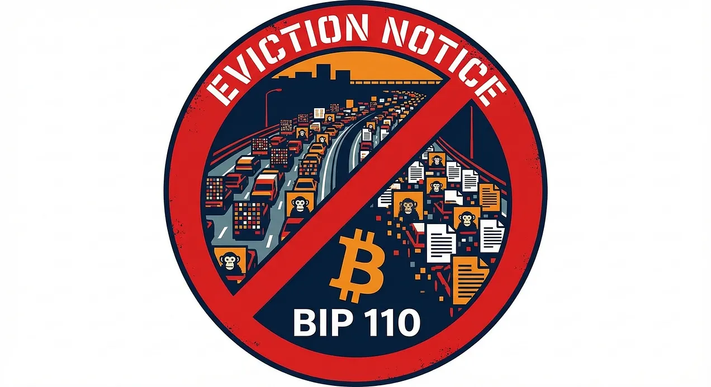
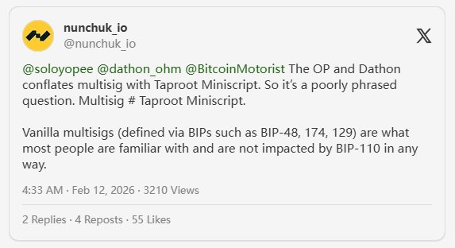

> *作者：Kyle Santiago*
> 
> *来源：<https://privkey.substack.com/p/bitcoin-has-a-squatter-problem-bip>*

假设你造了一条高速公路。它的作用当然是：运输人和货物从 A 点到 B 点，越快越好，越便宜越好。

现在，有人发现他们可以在这条高速公路上停泊房车，一辆接一辆，把它当成一个免费的停车场。他们当然付钱了 —— 付的是高速通行费，但是其他司机却被堵在路上，明明付了通行费却走不动，不得不烧更多的汽油，只能纳闷自己帮助造出来的高速路怎么就成了停车场。

这就是现在发生在比特币上的事。BIP 110 则是一个 “不能泊车” 标志。

## 正在比特币上发生的事

比特币的设计目标是把一件事做到极致：无需取得任何人的许可，就能转移价值。不需要银行许可，不需要政府许可，也不需要中间人的许可。点对点的电子现金，这是写在白皮书里面的。

在 2022 年，有人发现了一个聪明的骇客技巧：通过利用 Taproot（比特币的最新升级）的一项特性，他们可以在比特币交易中塞入不限定形式的数据，比如图片（JPEG 格式）、视频乃至整个文档。他们把这种技巧称为 “铭文（inscriptions）”。一夜之间，比特币的区块链上沦为了猴子图片和表情包的垃圾场。

（译者注：比特币的共识规则从来无法禁绝用户以直接或伪装的形式向区块链写入与比特币的密码学安全无关的数据。只是在 Taproot 之前，各种写入方式会受到共识层面的体积限制 以及/或者 交易传播限制。Taproot 升级解除了对见证脚本对象的体积限制，铭文利用这一点实现了第一种既不会在体积上受限（无需割裂文件）、又不会在传播上受限的非限定数据写入方法。）

这就是问题：**地球上的每一个比特币节点都必须下载、验证和存储这些数据。永远**。

这些向比特币区块链上传了 4MB 体积的图片的人只给矿工支付了一次性的手续费。矿工拿到手续费之后就可以什么都不管。但是成千上万的运行节点的志愿者呢？他们要为比特币的整个生命周期负担存储成本、带宽成本还有验证成本，而不会得到明确的回报。

这不是按照预期工作的自由市场，而是市场失灵。倾倒数据的人获得了永续的、不可审查的、散布到全世界的存储空间。而提高这些存储空间的人从没被问过愿不愿意，也永远不会得到补偿。经济学家会管这叫 “**外部性**”。普通人会管这叫 “搭便车”。

让人痛心的地方在于：我们绝大多数人，支持 Taproot 是因为它改善了多签名（钱包）。它让复杂的花费条件，比如多签名、时间锁备用路径，可以隐藏起来，直到用上才揭晓。这带来了更小体积的交易、更低的手续费，以及为真实用户带来了更好的隐私性。这就是它何以让人激动。没人曾经说 Taproot 的好处在于向区块链上传图片时能打折。

（译者注：在铭文方法中，非限定数据是交易输入的见证脚本的一部分，而见证脚本在计算名义体积时会获得折扣，相比同等字节体积的交易其它字段，会缴纳更少的手续费。这种折扣源自隔离见证升级，从验证成本的角度看，有其意义，因为同样数量（体积）的隔离见证签名比传统签名验证起来更便宜。然而，区块验证不仅要付出计算成本，还要付出存储成本。随着非限定数据体积的增加、签名体积占比的下降，情形就偏离了使这种折扣得到辩护的一般情形。）

但这就是实际发生的事情。明文使用 `OP_FALSE OP_IF` 操作码组合，将数据塞入 Taproot 见证脚本中不会被执行的部分， 就这样获得了 75% 的手续费折扣（因为隔离见证计算见证数据体积的方式）。一种扩容技术被转化成了一种反扩容的技术。从 2023 年以来，UTXO 集的大小翻了一倍。同步新节点时，从同步 2023 年的区块开始就明显变慢。

（译者注：铭文方法不会直接导致 UTXO 集膨胀。导致 2023 年以来 UTXO 集大幅膨胀的一种因素是一些使用了铭文方法的链外智能合约协议的流行。）

Bitcoin Core 本来可以在 2023 年铭文刚开始流行的时候补上这个漏洞，但他们没有。相反，到 2025，他们还放宽了 OP_RETURN 输出的传播限制。BIP 110 就是他们拒绝发布的修复措施。

（译者注：这指的是，从 `Bitcoin Core` v30.0 开始，将默认的交易转发规则之一 —— 最多只携带一个 OP_RETURN 输出、该输出体积在 82 字节以内 —— 放宽为可以携带多个 OP_RETURN 输出、总体积不作要求。OP_RETURN 输出是一种无法被花费、因此不会进入 UTXO 集的交易输出，可用来携带非限定数据。）

## BIP 110 要做什么

撇开技术上的黑话，BIP 110 要做的事情很简单：暂时限制你可以向比特币交易的单个字段塞入的数据体积为 256 字节。

背景信息：

- 一个比特币地址是 **34 字节**
- 比特币上的一个密码学签名是 **64 ~72 字节**
- 一个 2048 比特的公钥可以塞进 **256 字节**的空间
- 一个 JPEG 格式的图片需要**几千甚至几百万字节**
- 256 交易

256 字节对于可以想象的任何金融交易来说都足够了。但不足以嵌入一张猴子表情包。

这就是 BIP 110 的全部想法：保留比特币作为货币所需要的东西，堵上让比特币变成一块硬盘的漏洞。

这个提议还封堵了别的一些走私数据的计量，比如在脚本中滥用 `OP_IF` 分支以藏匿数据（这些条件分支会被跳过）、利用未定义的 Taproot Annex（附言）作为一种不受限制的字段。每一条规则都针对一种曾被用来向区块链嵌入非金融数据的界面。

而且，这里还有绝大部分人都忽略的一点：**它是临时的**。BIP 110 会在一年后自动过期。如果比特币社区认为它是一个错误，他们不必做任何事，这东西就会自动消失。不需要第二次投票、不需要采取行动，它会自动终止。

## “这不是一种审查吗？”

不是。这里面有重大区别。

“审查” 意味着根据发送者的身份或者目的地来阻拦 *有效交易*。BIP 110 不关心你是谁、你在哪里生活、你买的是什么。它不阻拦任何货币性质的交易。它也没有黑名单地址，它不需要身份验证。

它只是要禁用一些不符合设计目标的意料之外的特性。

可以这样打比方：你的电子邮件服务商给了每封邮件 25MB 的附件空间。它是一种审查吗？显然不是。它是一种设计抉择，要让这个系统为预定的用途 —— 通信 —— 而工作，不让人们拿它当一种文件分享服务。

将比特币交易的单段数据限制在 256 字节也是一样的意思。这是一种设计抉择，让整个网络为其预定用途 —— 货币 —— 而工作，不让人们把它当成一种共享硬盘。

实际上，如果你真的在乎抗审查性，你应该 *支持* BIP 110 。因为，当铭文泛滥导致交易手续费暴涨时，普通人就无法负担发送链上交易的代价了。他们就会被推着去使用托管服务，比如交易所、支付处理商、托管式钱包。而且，托管服务 *可能* 被审查、监管、冻结和关停。

**数据轰炸不仅会与支付交易竞争，还会主动破坏让比特币具备价值的抗审查性。**

## “那么多签名呢？钱包开发者说它会把多签名搞砸！”

关于 BIP 110，最持久的顾虑之一是它会威胁 Taproot 多签名装置，尤其是保护隐私性的那种 —— 签名人的密钥不会暴露给外部观察者。这种装置很重要，因为 Nunchuk、Liana 和 Sparrow 都在积极将 Taproot 多签名建设为隐私型自主保管装置的标准。

那么好了：钱包开发者自己出来澄清了它。当 Nunchuk 被问到 BIP 110 对他们的用户的影响时，他们的技术分析是非常清楚的。

首先，今天绝大部分的多签名装置都使用传统的或隔离见证的地址。BIP 110 对他们毫无影响。

其次，让每个人都兴奋的 Taproot 隐私性好处 —— 多个公钥聚合为一个，所以外部观察者无法分辨出多签名交易和单签名交易 —— 来自 Shcnorr 签名和 MuSig  签名方案。Nunchuk 确认了 BIP 110 对 MuSig 没有影响。

第三，唯一可能受影响的领域是高级的 Taproot Miniscript 脚本，在脚本树的叶子中使用 `OP_IF` 操作码。那么，正如 Nunchuk 自己指出的，这是编译器层面的顾虑，不是钱包层面的。修复措施也很简单：将 `OP_IF` 分支分割到一个专门的叶子中，这本身就是 Taproot 脚本设计的最佳做法。

现在，实事求是：BIP 110 这种修复措施也不是什么代价都没有。以一种简单的企业财务为例：首先，Alice 无论如何必须签名；其次，要么 Bob 作为联合签名人，要么时间锁解锁。在一个使用 `OP_IF` 的脚本中，不执行的时间锁分支，在揭晓的脚本中只占 5 个字节；但将它分割为两个 Taproot 叶子，你需要在花费脚本的控制块中添加一个 32 字节的默克尔证据。付出 32 字节，只为隐藏 5 字节。在特定的钱包配置中， `OP_IF` 确实更便宜。

这些事情的重要性在于，Miniscript，这种标准化这些钱包构造的工具，是比特币上最重要的工程项目之一。自主保管是所有东西的基石：Layer 2 协议、隐私性工具 …… 如果在基础层上你无法保管自己的钱币，它们就都没有意义。从单签名到多签名，再到使用时间锁的递减式多签名（花费要求逐渐降低从而继承人或合伙人可以复原资金）是比特币保管的自然演化轨迹。Miniscript 让这样的装置可以在钱包软件之间互操作，这可不是吹毛求疵的顾虑。

BIP 110 的详述直接承认了这种取舍。它的立场是：暂时要求用户将 `OP_IF` 分支分割为 taproot 脚本树叶子，哪怕要多占用少量字节，是值得的，它是在发送一种明确的信号：比特币是一种货币，而不是一个数据存储平台。这种说法合不合理，可以争论。但是，如果有人跟你说 BIP 110 对钱包开发者毫无影响，那是错的；同时，如果有人说这种负担是灾难性的，那也是错的。

再次提醒：它会在一年后自动过期。如果社区认为这是一种错误的号召，这些限制会自动消失，无需任何人付出吹灰之力。

结论：如果你正在使用多签名钱包，或计划为了隐私性而迁移到 Taproot 多签名钱包，BIP 110 对你没有影响。

## “那动机的资金怎么办？”

这是围绕 BIP 110 的最大心理恐吓（FUD），所以我们正面对决。

有批评意见是，BIP 110 可能会冻结或者说没收人们的比特币。我们来看看，究竟在什么情况下，会有这种效果。下面的**五种**条件必须**同时满足**：

1. 钱币锁定在 Taproot (P2TR) 输出
2. 钱币是用预先签名的交易锁定的
3. 钱币**必须**在 BIP 110 的一年部署期内获得区块确认 *并且* 花费掉
4. 用来花费它的具体的叶子脚本违反了 BIP 110 的规则（包含了 `OP_IF` 操作码，或者在脚本树的 7 层以下）
5. 没有 *别的办法* 能够花费这些钱币：不能使用密钥路径、脚本树上也没有其它有效的叶子脚本

只要任何一个条件不为真，那资金就是完全不受影响。

这种情形有多罕见？几乎不可能。绝大部分比特币用户都还没使用 Taproot 输出。就算是已经用上的用户，也几乎没有人会使用这么深的脚本树，或是故意使用无效的叶子脚本。就算是真的用了，也几乎都有密钥路径，作为备用花费方法。

但 BIP 110 甚至采取了更多措施来保护用户：

- **在激活之前创建的 UTXO 会被当做例外**。新规则只对分叉激活之后的输出有效。现有的这些钱币不会受到影响。
- 在软分叉锁定和激活之间还有**两周的宽限期**，所以使用这些罕见配置的人有时间可以转移资金。

有没有什么人、在什么情况下，哪怕是理论上，会受到影响？在非常极端的情形中，可能会。但这些情形太过罕见，就像你的房子已经着火了，你还担心它被陨石砸中，这样子。铭文泛滥就是这场火，已经烧掉了 37% 的区块空间、赶走了许多普通用户，这才是真正危急的事情。

（译者注：“37%” 这个数据在文中多次出现，但作者没有交代如何统计出来的。读者显然能找出占用更大的情形，也能找出占用更小的情形。）

这里还有一个非常能说明问题的事情：批评者从来没有主张 BIP 110 会毁灭铭文。他们直接跳到了假想中的继承方案。这就是一种默认。他们直到铭文是对网络的一种攻击，而不是一种合理的用法，所以他们甚至不花力气为之辩护。剩下的唯一主张基于一种极为复杂的情形：某人既是技术高超的专家、可以构造出深度超过 8 的脚本树、叶子脚本中带有 `OP_IF` 条件、用预先签名的时间锁交易来花费钱币，同时，又对自己所在网络上的被广泛讨论的软分叉充耳不闻。

## “这不会伤害创新吗？BitVM 怎么办？”

BitVM 以及类似协议，使用了大型的 Taproot 脚本树，理论上确实可能违反 BIP 110 的 128 片叶子（7 层脚本树）数量限制。这是一种真实的取舍，BIP 110 的支持者们公开承认了这一点。

但让我们从另一个角度来看这个问题：

- Citrea 是第一种基于 BitVM 的侧链，在 2025 年上线。但他们的桥接合约已经使用了 Taproot 输出并且在 BIP 110 的限制之内。 需要比特币的协议请别在 BIP 110 关闭的数据写入界面上开发。
- BIP 110 会持续一年。任何明确需要更大脚本树的协议都可以在测试网和侧链上继续开发。
- 限制会自动过期。没有人需要为恢复以前的能力而付出代价。

问题不在于 “BIP 110 有什么牺牲什么”，当然有。问题在于：“为了保护比特币作为货币的核心功能，为这套实验性的协议经历一年的不便利是否值得？

如果比特币的区块空间永远被数据存储占据，可能也不会留下一个能用的货币网络让 BitVM 来开发了。

## “有人已经把整个 BIP 写到区块链上了！”

是的，一位知名的比特币开发者这样做，以示自己反对：把 BIP 110 的整个文本放到一笔比特币交易中。讽刺的是，这实际是在 *帮助* BIP 110，而不是打击它。

这个活动证明的是，你依然可以通过将数据切成小段、分散在交易的多个字段中，将数据嵌入比特币区块链。确实如此。BIP 110 没有说能够禁绝嵌入数据。它只说要让这样的操作**不方便而且很昂贵**，贵到不再值得大范围这样做。

可以这样理解：理论上，通过窗户也可以搬运沙发。但只要你把前门拆了，大部分人就不会想着把沙发搬到房子里去了。那些坚决要通过窗户来运沙发的人会为这种特权付出高昂的成本，而且要花很多力气。

现在，铭文就像一辆搬家卡车经过前门。BIP 110 要把门关上。那够坚决的人是不是还是能塞数据进去？当然可以。但是，随意进行的大规模的数据倾倒，比如说占据 37% 的区块空间这种，在经济上就变得不可行了。

所以，BIP 110 的用意不是彻底根除，而是让比特币的立场变得更加清楚：**这是一个货币网络，不是一个存储平台。请自重。**

## “这不会导致链分裂吗？”

也许会，但是比特币历史上的每一个软分叉都有这种风险。

隔离见证带来了区块链分裂风险。Taproot 也一样。这种风险是任何共识变更都有的，BIP 110 也不例外。问题不在于是否 *有可能* 造成区块链分裂。而是什么情形下会发生。

如果 BIP 110 缺乏经济支持，那么支持它的节点会停滞。他们会停在自己认为的最后一个有效区块上，等待不会到来的信号区块。主链会继续出块，就像没有发生任何事。这种情况下，不会有链分裂，也不会有人受伤。也就是 BIP 110 悄悄地失败了。

如果 BIP 110 得到了许多经济支持，交易所、企业和用户都支持它，那么矿工会面临跟隔离见证时候一样的抉择：挖掘大部分经济力量支持的区块，还是挖掘越来越多人拒绝的区块。在 2017 年，超过 80% 的节点在 UASF（用户激活软分叉）之前迫使最后一个反对派（比特大陆）低头。矿工们倒戈并非出于意识形态，而是因为经济激励让他们没有选择。

BIP 110 还没有获得这么多支持。支持的节点占比在逐渐增加，但还是只有个位数，还没有主要的交易所公开支持。经济共识正在形成，但还无法保证。运行一个节点的意义也就在这一刻凸显：这是发送信号的方式。

还要说一句：表态支持并不需要矿工付出什么代价。形式上只是改变一个比特的数值。不表态，则会因为支持率逐渐增加而形成长尾风险。即使激活的概率很小，当成本为零时，服从也会成为默认的理性选择。一旦大矿池表态，“囚徒困境” 就会出现 —— 没人想成为错误阵营中的最后一个人。

在最坏情况下，会出现持续的区块链分裂 —— 两条区块链相互竞争。这在比特币的软分叉历史上从未出现过。一次也没有。失败的一方总是会回头。BIP 110 的一年过期时间让长期分裂更不可能出现：即使针尖对麦芒，BIP 110 的限制也会自动消失。

## 没有人追问的真正问题

在所有的关于技术细节的来回沟通中，真正被冷落的问题是：

**如果比特币不是货币，那它是什么？**

因为现在，37% 的区块空间都被用来存储跟支付完全无关的数据。节点运营者们自愿让比特币去中心化，却要用自己的计算机硬件和带宽来补贴这种存储。普通交易的手续费超过了本来需要支付的水平。开发者的注意力本来应该投放到闪电网络、隐私性、可扩展性和用户体验提升上，却被应该允许哪种数据写入区块链的无止境辩论消耗。

BIP 110 无法回答所有问题。它也不能根绝垃圾数据。它从没有这样说。

它做的只是给比特币一年的喘息时间。让开发者有一年时间可以专注于货币性能提升，而不是跟数据写入漏洞玩打地鼠游戏。节点运营者也有一年时间，不必被迫下载和存储这些不断增长的图片堆。在这一年时间里，网络可以发送一个明确的信号：**比特币首先是货币。其它东西都是次要的**。

如果一年以后，社区觉得这种限制是错误的呢？那它会自动过期，不会再造成伤害。

## 你可以做什么

如果你也认为比特币应该把货币性放在首位，那么你可以：

- **运行一个 BIP 110 节点**。这种激活客户端建立在 `Bitcoin Knots` v29.2 之上，可以从 [bip110.org](https://bip110.org/)  下载。现在已经有超过 1,800 个节点表示支持。
- **联系你的矿池**。矿工表态可以加速激活，但无论如何，支持它的节点会在区块高度 965,664 激活 BIP 110 规则 。请求你所在的矿池运营者用信号比特 4 表示支持。加速激活要求 55% 的矿工支持，比常见的 95% 更容易达成。
- **发声**。绝大部分反对 BIP 110 的意见都来自从铭文中获得利益或者没有读过实际提议的人。分享这篇文章，激发讨论。

比特币从区块体积战争、SegWit2x 阴谋中活了下来，打败了每一种声称要取代它的山寨币。一年没有数据泛滥，它当然也能存活。

唯一问题是我们够不够在乎它。

- - -

*BIP 110 由 Dathon Ohm 撰写，在 2025 年 12 月 3 日被分配了 BIP 编号。完整的技术详述可见 [bips.dev/110](https://bips.dev/110) 。比特币开发者邮件组中的讨论可见[此处](https://groups.google.com/g/bitcoindev/c/nOZim6FbuF8)。*

（完）