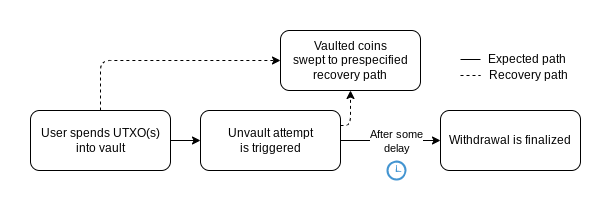
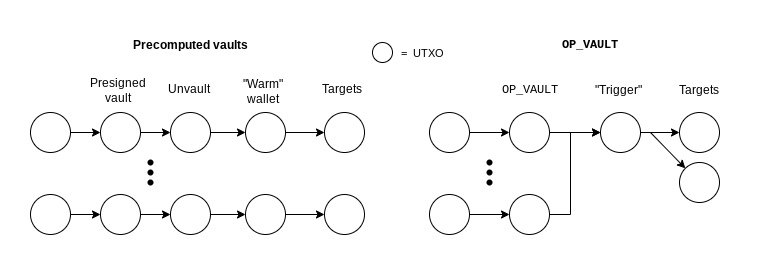
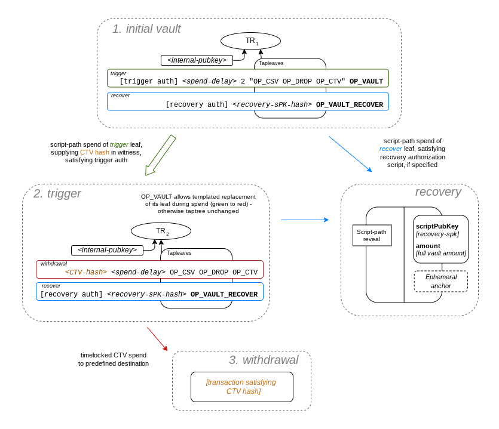

> *作者：James O'Beirne、Greg Sanders、Anthony Towns*
>
> *来源：<https://github.com/bitcoin/bips/blob/0b0674c546eba07583da87d029f42a5da551af42/bip-0345.mediawiki>*
>
> 本译本为该 BIP 的 0b0674c546 版本，后续可能有更改。
>
> 前文：
>
> - 2023-01-09: https://lists.linuxfoundation.org/pipermail/bitcoin-dev/2023-January/021318.html 
> - 2023-03-01: https://lists.linuxfoundation.org/pipermail/bitcoin-dev/2023-March/021510.html 

## 引言

本 BIP 提出了两种 tapscript 操作码，为一种专门的限制条款（covenant）提供了共识层面的支持：`OP_VAULT` 和 `OP_VAULT_RECOVER`。这些操作码与 `OP_CHECKTEMPLATEVERIFY`（[BIP-0119](https://github.com/bitcoin/bips/blob/master/bip-0119.mediawiki)）结合之后，就可以让用户在指定资金被花费到任意目的地之前强制执行一段时延，只有预先指定的一条 “复原” 路径可以例外。最终取款完成之前的任何时间，资金都可以转移到复原路径中。

## 动机

保管比特币的难题众所周知。比特币的用户必须花很大的力气来保护自己的私钥，并祈祷自己的保管系统不会在任何后续产生的以及恒在的威胁下屈服。保管系统一旦被攻破，用户就几乎无法再介入。本提议引入了一种机制，可以极大地缓解私钥泄露所造成的最坏后果：资金丢失。

引入一种可以干预意外花费的办法，用户就可以采用高度安全的私钥存储方法或者不常用的反击策略，仅在最糟糕的情形下启用，否则可以永远不用。本提议的目标就是尽可能降低这样的策略的复杂性，使之对任意规模的保管者都可用。

### 用法案例

个人保管比特币的一种常用方案是 “单签名 + 密语” + 硬件钱包。他们担心在私钥管理上依赖于单一的硬件制造商以及其他人触达硬件的风险，于是生成了一个高度安全的心思要，但是，日常使用并不便利。举个例子，比如，私钥可以用某种模拟方式生成，或者在某台旧的计算机上生成（具有额外的熵）随后将计算机摧毁，然后仅用纸张复制私钥。或者，密钥可以是一种 2-of-3 多签方案，用上了不同制造商所生产的设备。也许私钥也是地理上分散的。

这样的个人可以使用 `OP_VAULT`，将高度安全的私钥作为不常用的复原路径，同时使用现有的签名流程作为取款触发密钥，同时为之配置 1 天的花费时延。他们可以在自己的手机上运行软件，以监控区块链上出现的相关交易。

如果存入这样的保险柜（vault）的资金竟然移动了，用户可以立即将这些资金扫入高度安全的复原路径中 —— 但是，存入保险柜不会影响资金的日常花费操作，只是带有一个时延。

复原路径可以是任何比特币脚本方案：2-of-3 多签且私钥放在不同设备上；3-of-5 多签且私钥在地理上分散；一种结合了某一种多签、但可在时延期将资金扫入 “更容易的” 复原路径的 Taproot 构造，以防止复原路径变得 *过于* 安全。

机构保管者也会希望以类似的方式使用这样的保险柜。

### 可证明的时间锁

本提议还提供了一种缓解 “[五美元扳手攻击](https://web.archive.org/web/20230210123933/https://xkcd.com/538/)” 的缓解措施。通过设定花费时延为（例如）一周，然后用复原路径的脚本执行一个更长的时间锁，保险柜的所有者可以证明他没法立即访问这些钱。就笔者所知，这是唯一一种可以无需永续滚动时间锁以及依赖于受信任第三方的防御方法。

## 目标



在比特币上实现 “保险柜（vault）” 的正式讨论从 2016 年就开始了（[MES16](http://fc16.ifca.ai/bitcoin/papers/MES16.pdf)），非正式的讨论可以追溯到 [2014](https://web.archive.org/web/20160220215151/https://bitcointalk.org/index.php?topic=511881.0) 年。

在先用的共识规则下，除了[用大型的多签合约模拟保险柜](https://github.com/revault)之外，实现保险柜的唯一方法，就是用一个一次性的私钥创建预先签名的交易。这种方法[在 2020 年](https://lists.linuxfoundation.org/pipermail/bitcoin-dev/2020-April/017755.html)初次得到演示。

不幸的是，这种方法在实用性上有许多缺点：

- 需要生成和安全地删除一次性私钥；这个私钥用来模拟保险柜限制条款；
- 取款的数量和取款的模式都必须预先承诺；
- 必须预先承诺一个地址，作为资金经过一系列流转之后的最终取款目的地，但这样的目的地可能只有在取款的时候才方便知道；
- 必须在创建保险柜时就确定好特定的手续费追加技术以及钱包；
- 只要复用了金库地址，后来进入保险柜的资金就会丢失；（译者注：已不再有私钥能为之签名）
- 表示保险柜的 “不记名资产” 的交易数据必须永久保存，否则资金就会丢失；最后，
- 每次储蓄新的一笔钱，都必须执行一次保险柜创建仪式。

如能部署 “[OP_CHECKTEMPLATEVERIFY](https://github.com/bitcoin/bips/blob/master/bip-0119.mediawiki)” 和 “[SIGHASH_ANYPREVOUT](https://github.com/bitcoin/bips/blob/master/bip-0118.mediawiki) ” 这样的 “预先计算的” 限制条款机制，就不必再使用一次性私钥了，因为限制条款是在链上执行的；同时也放宽了敏感数据的存储负担，因为必要的交易可以用一组紧凑的参数创建出来。这种方法首次得到演示是[在 2022 年](https://github.com/jamesob/simple-ctv-vault)。

但是，预先计算的缺点依然在：数量、目的地、手续费安排，都是定死的。资金必须经过一系列预先确定的中转站，然后达到最终的目的地。在手续费暴涨期间或者较短的花费时延中成功复原的关键操作 —— 批量操作，是无法实现的。



拥有一种 “通用的”（能够编码任意交易状态机的）限制条款机制可以解决这些问题，但代价是复杂和体积较大的脚本可能会在区块链上多次复制。这样的通用框架的具体设计和部署时间，也是不确定的。这种方法[在 2016 年](https://blog.blockstream.com/en-covenants-in-elements-alpha/)得到了展示。

本提议的初衷是，利用一种专门的限制条款，来提供一种交易和操作开销尽可能小的 花费时延/复原 路径，从而解决上述问题。

本提议的设计目标是：

- **高效复用已有的保险柜配置** <sup><a href="#note1" id="jump-1">1</a></sup>。单个保险柜，无论字面上的 `scriptPubKey`（脚本公钥）是否相同，都应该能 “接收” 多笔存款。
- **批量操作**。复原和取款都可以批量操作，从而可以高效管理多笔保险柜资金。
- **无限制的部分取款**。允许用户取出部分保险柜资金，而无需建立一个新的保险柜。
- **动态的最终目的地**。允许在取款时为保险柜资金设定区块目的地（而不是只能在保险柜第一次创建时设定）。将不再需要预先定义的、只为路由脱离保险柜的资金到意图目的地而存在的中间钱包。
- **动态的手续费管理**。与动态目的地类似，将手续费率和来源的设定推迟到打开保险柜的时间，而不是创建保险柜的时间。

此外还有基本的安全考虑（例如，应能抵御交易池钉死）以及简洁的愿望：输出的数量和脚本的体积都要考虑。

本提议设计成跟任何未来可能引入的 sighash 模式（例如 “`SIGHASH_GROUP`”）和手续费管理策略（例如 “[交易费赞助](https://lists.linuxfoundation.org/pipermail/bitcoin-dev/2020-September/018168.html)”）都兼容。使用这些操作码将能从 “[v3 交易转发](https://lists.linuxfoundation.org/pipermail/bitcoin-dev/2022-September/020937.html)”和 “[临时锚点输出](https://github.com/instagibbs/bips/blob/ephemeral_anchor/bip-ephemeralanchors.mediawiki)” 中受益，但不是严格依赖于它们。

## 设计

按标准的用法，保险柜的创建方法是：将资金锁在一棵 taptree（[BIP-341](https://github.com/bitcoin/bips/blob/master/bip-0341.mediawiki)）下，这棵 taptree 包含至少两个叶子：一个是包含了 `OP_VAULT` 的脚本，协助符合预期的取款流程；另一个使用 `OP_VAULT_RECOVER`，保证在取款终局化之前的任何时间，都能将资金复原（移走）。

`OP_VAULT` 的规则通过允许一笔花费交易按照预先定义的脚本模板，将 `OP_VAULT` tapleaf 替换掉，这就创造了一种带时间锁的、可以打断的取款操作，并且，一些参数可以在花费（触发）的时候再设定。目标输出的 taptree 上的所有其它叶子必须保持不变，这就保证了该保险柜原来包含的复原路径以及所有其它花费条件都能保留下来。这类似于[在 2021 年](https://lists.linuxfoundation.org/pipermail/bitcoin-dev/2021-September/019419.html)提出的 `TAPLEAF_UPDATE_VERITY` 提议。

这些 tapleaf 替换规则（我们下文将准确说明）保证了可以使用带时间锁的取款、将资金转移到语族固定的输出中（通过 `OP_CHECKTEMPLATEVERIFY` <sup><a href="#note2" id="jump-2">2</a></sup> 实现）；而时间锁是通过最初的 `OP_VAULT` 参数固定的。

虽然本提议使用 `OP_CHECKTEMPLATEVERIFY` 作为将提议取款绑定到特定最终输出集合的首选方法，但 `OP_VAULT` 可以跟其它（未来的）操作码结合、协助其它类型的取款流程。



### 交易类型

保险柜可分成许多阶段，其中有一些是可选的：

- **保险柜交易**：将一些资金锁定到一个 Taproot 结构中，这个 Taproot 包含至少一个 `OP_VAULT` 叶子和一个 `OP_VAULT_RECOVER` 叶子。

- **触发交易**：将一个乃至多个 `OP_VAULT` tapleaf 输入花费到一个输出中，这个输出带有时间锁，可以花费到一组固定的后序输出中；这些后序输出是在触发时选定的。这将公开广播将资金取出到某一组输出中的意图。

  触发交易可能带有一个额外的输出，将保险柜中的一些资金分配到一个更小的 “副保险柜” 中，副保险柜将应用跟被花费的 `OP_VAULT` 输入相同的 `scriptPubKey`。

- **取款交易**：在触发交易的输出成熟（花费时延过期）之后、按照 `OP_CHECKTEMPLATEVERIFY` 规则、根据 CTV 哈希值花费它、将资金转移到符合规则的最终取款输出中。使用带时间锁的CTV 交易，是使用 OP_VAULT 的动机，但也可以在创建保险柜的使用指定其它脚本模板。

- **复原交易**：花费一个乃是多个 `OP_VAULT_RECOVER` tapleaf 输入到预先指定的复原路径中，可以人取款交易确认之前的任何时间做到。每一个输入都可以选择要求一段能够满足一个指定的 “复原授权” 脚本的见证数据；这种可选的脚本以 `OP_VAULT_RECOVER` 作为前缀。使用复原授权脚本有特定的取舍，将在后文讨论。

### 手续费管理

本提议的一个重要考虑是手续费管理问题的处理。动态手续费管理对保险柜的操作是极为关键的，因为：

- 预先计算的手续费可能无法让交易的高手续费的环境中得到确认；以及
- 预先指定的用来支付手续费的钱包可能会在使用之前就被攻破，或丢失。

但动态的手续费管理可能引入[钉死攻击因素](https://bitcoinops.org/en/topics/transaction-pinning/)。在使用本提议所提出的新的基于内容的花费条件时，已经谨慎避免了不必要地引入这些因素。

最开始，本提议高度依赖于改革过的交易 nVersion=3 的交易池对策；这样的交易包含临时锚点输出；但后来修订了，变为可以从这些对策以及其它潜在的手续费管理机制的变化中受益，而不必严格依赖于它们。

## 详述

 Tapscript 操作码 `OP_SUCCESS187`（`0xbb`）和 `OP_SUCCESS188`（`0xbc`）分别使用实现 `OP_VAULT` 和 `OP_VAULT_RECOVER` 的新规则来约束使用。

### `OP_VAULT` 运算

在运算 `OP_VAULT`（`OP_SUCCESS187`，`0xbb`）时，预计的堆栈格式，自顶到底，是这样的：

```
<leaf-update-script-body>
<n-pushes>
[ n leaf-update script data items ... ]
<trigger-vout-idx> 
<revault-vout-idx>
```

其中：

- `<leaf-update-script-body>` 是将一个序列化脚本的最小编码的数据推入栈中的操作 <sup><a href="#note3" id="jump-3">3</a></sup>。
  - 否则，脚本执行**必须**失败并立即终止。
- `<n-pushes>` 是一个最多 4 字节的 `CScriptNum` 编码的数字，指明了多少个叶子更新脚本（leaf_update script）对象**必须**从栈中弹出 <sup><a href="#note4" id="jump-4">4</a></sup>。
  - 如果这个值无法正确解码成一个有效的 CScriptNum，花费这个输出的脚本执行**必须**失败并立即终止。
  - 如果这个值小于 0，花费这个输出的脚本执行**必须**失败并立即终止。
  - 如果栈中只有不到 `<n-pushes> + 2` 个对象，则花费这个输出的脚本执行**必须**失败并立即终止。
- 后面的 `<n-pushes>` 堆栈对象会被弹出堆栈，并作为 `<leaf-update-script-body>` 的最小编码的 push-data 参数前缀，以构造预期的 tapleaf 替换脚本。
  - 如果栈中只有不到 `<n-pushes> + 2` 个对象，则花费这个输出的脚本执行**必须**失败并立即终止。
- `<trigger-vout-idx>` 是一个最多 4 字节的 `CScriptNum` 编码的数字，指明继承本输入的价值的输出的索引号（可能还有副保险柜输出会继承一部分交织），并且，该输出的 taptree 跟本输入的 taptree，除了当前正在执行的叶子以外的部分，将完全相同。
  - 如果这个值无法正确解码成一个有效的 CScriptNum，花费这个输出的脚本执行**必须**失败并立即终止。
  - 如果这个值小于 0，或者大于或等于输出的数量，则花费这个输出的脚本执行**必须**失败并立即终止。
- `<revault-vout-idx>` 是一个最多 4 字节的 `CScriptNum` 编码的数字，指明继承本输入的价值的副保险柜输出的索引号，且该输出将跟本输入有相同的脚本公钥。
  - 如果这个值无法正确解码成一个有效的 CScriptNum，花费这个输出的脚本执行**必须**失败并立即终止。
  - 如果这个值小于 0，或者大于或等于输出的数量，则花费这个输出的脚本执行**必须**失败并立即终止。

在堆栈解析完之后，执行列下验证检查：

- 将被 `<trigger-vout-idx>` 指定的输出称作 “triggerOut”。
- 如果 triggerOut 的脚本公钥并非一个跟当前正在执行的脚本具有相同版本和相同 tapleaf 版本的见证程序，脚本执行**必须**失败并立即终止。
- 获得 `<leaf-update-script-body>` 并以 `<n-pushes>` 叶子更新脚本数据对象的最小编码数据推入操作为之添加前缀，从而构建脚本，称为 “leaf-update-script”。
  - 这些叶子更新数据对象在 *leaf-update-script* 中的顺序将跟它们在堆栈中出现的顺序相同。
- 如果 *triggerOut* 的脚本公钥不能与当前正在运算的输入的 taptree 将 OP_VAULT 叶子替换成 *leaf-update-script* 之后的形态相匹配（不一致），则脚本执行**必须**失败并立即终止。
  - 注意：最终产生的 taproot 输出的奇偶校验位允许变动，因此必须检查新输出的两个值。
- 将被 `<revault-vout-idx>` 指定的输出称作 “revaultOut”。
- 如果 *revaultOut* 的脚本跟要跟正在被花费的输入的脚本公钥不等同，花费这个输出的脚本执行**必须**失败并立即终止。
- 如果 *triggerOut* 和 *revaultOut*（如果有的话）的面额之和不大于或等于这个输入的价值，花费这个输出的脚本执行**必须**失败并立即终止。
- （延期 <sup><a href="#note5" id="jump-5">5</a></sup>）*triggerOut* 的 `nValue` 加上 *revaultOut* `nValue`（如果有的话），必须等于所有引用它作为对应的触发输出的保险柜输入的和。如果两值不相等，则脚本**必须**失败并立即终止。

如果没有条件出错，堆栈中将仅留下一个真值（`0x01`）。

### `OP_VAULT_RECOVER` 求值

在运算 `OP_VAULT_RECOVER`（`OP_SUCCESS188`，`0xbc`）时，预计的脚本格式自顶到底应如下：

```
<recovery-sPK-hash>
<recovery-vout-idx>
```

其中：

- `<recovery-sPK-hash>` 是一个 32 字节的数据推入操作。
  - 如果这个数值不是 32 字节长，则花费这个输出的脚本执行**必须**失败并立即终止。
- `<recovery-vout-idx>` 是一个最多 4 字节的 CScriptNum 编码的数字，指明复原输出的索引号。
  - 如果这个值无法正确解码成一个有效的 CScriptNum，花费这个输出的脚本执行**必须**失败并立即终止。
  - 如果这个值小于 0，或者大于或等于输出的数量，则花费这个输出的脚本执行**必须**失败并立即终止。

在解析完堆栈后，执行下列验证检查：

- 将 `<recovery-vout-idx>` 位置的输出称作 “recoveryOut”。
- 如果 *recoveryOut* 的脚本公钥没有一个与 `<recovery-sPK-hash>` 相等的带标签哈希值（`tagged_hash("VaultRecoverySPK", recoveryOut.scriptPubKey) == recovery-sPK-hash`，其中 `tagged_hash()` 来自 [BIP-0340 参考代码](https://github.com/bitcoin/bips/blob/master/bip-0340/reference.py)），花费这个输出的脚本执行**必须**失败并立即终止。
- 如果 *recoveryOut* 不具有一个大于或等于这个输入的面额的 `nValue`，则脚本执行**必须**失败并立即终止。
- （推迟）如果 *recoveryOut* 的 `nValue` 不等于所有带有对应 `recovery-sPK-hash` 的 `OP_VAULT_RECOVER` 输入的综合，交易验证**必须**失败 <sup><a href="#note6" id="jump-6">6</a></sup>。

## 交易池对策

为了防范可能的钉死工具，复原交易必须是可替换的。

- 在验证一个被花费的 `OP_VAULT_RECOVER` 输入时，如果下列两个条件都满足 <sup><a href="#note7" id="jump-7">7</a></sup>，则脚本必须**失败**（在交易池对策的层面上，不是在共识层面）：
  1. 输入没有让 nSequence 数字小于 `0xffffffff - 1`（根据 [BIP-0125](https://github.com/bitcoin/bips/blob/master/bip-0125.mediawiki)，这是标记选择性可替换的方式）；以及
  2. 复原交易的版本号 nVersion 不是 3。

如果包含 `OP_VAULT_RECOVER` 的脚本是 34 字节或更小 <sup><a href="#note8" id="jump-8">8</a></sup>，将它称作 “不带授权的”，因为没有脚本来保护恢复的过程。为了防止这种不带授权的复原的情境下出现的钉死攻击 —— 因为这个输入（以及交易体）没有得到一条签好名的签名消息的授权 —— 不带授权的复原交易的输出结构是受限的。

- 如果复原交易未得到授权，复原交易**必须**（在对策层面上）受到下列约束：
  - 如果花费交易拥有超过两个输出，脚本**必须**失败并立即终止。
  - 如果花费交易拥有两个输出，而不是 *recoveryOut* 的的输出又不是[临时锚点输出](https://github.com/instagibbs/bips/blob/ephemeral_anchor/bip-ephemeralanchors.mediawiki)，则脚本**必须**失败并立即终止 <sup><a href="#note9" id="jump-9">9</a></sup>。

## 实现

一个实现样本可以在 bitcoin-inquisition [这里](https://github.com/jamesob/bitcoin/tree/2023-01-opvault-inq)获得；还有一个相关的 [pull request](https://github.com/bitcoin-inquisition/bitcoin/pull/21)。

## 应用

上文的详述可能令人惊讶：它没有解释带有相对时间锁的取款流程如何用固定的取款目的地实现。由 `OP_VAULT` 指定的 tapleaf 更新语义，以及由 `OP_VAULT_RECOVER` 打开的基于输出的授权，可以用来实现保险柜，但没有下面两件别的东西，它们是不完整的：

- 一种执行相对时间锁的方法，比如 `OP_CHECKSEQUENCEVERIFY`，以及
- 一种让提议取款最终花费到一组准确的输出集合中的方法，比如 `OP_CHECKTEMPLATEVERIFY`。

这两件东西跟 `OP_VAULT` 更新 tapleaf 的功能相结合，就创造了一种保险柜。见下文。

### 创建保险柜

为了把钱存入保险柜，资金必须进入一个包含了下列格式的 taptree 的隔离见证 v1 `scriptPubKey` 中：

```
tr(<internal-pubkey>,
  leaves = {
    recover: 
      <recovery-sPK-hash> OP_VAULT_RECOVER,

    trigger: 
      <trigger-auth-pubkey> OP_CHECKSIGVERIFY                     (i)
      <spend-delay> 2 $leaf-update-script-body OP_VAULT,          (ii)

    ... [ possibly other leaves ]
  }
)
```

其中：

- `$leaf-update-script-body` 是（举个例子）`OP_CHECKSEQUENCEVERIFY OP_DROP OP_CHECKTEMPLATEVERIFY` 这样的脚本片段。
  - 这是触发脚本的一个例子，但我们可以使用 *任意的* 脚本片段，从而创建不同类型的保险柜。举个例子，你可以使用 `OP_CHECKSEQUENCEVERIFY OP_DROP OP_CHECKSIG`，让资金在时间锁结束后进入另一个公钥。这也是让 `OP_VAULT` 可以兼容未来的脚本编程功能的设计。
- `(i)` 中的脚本片段叫做 “触发授权（trigger authorization）”，因为它是触发取款的开关。这可以用钱包设计者喜欢的任何方式来完成。
- `(ii)` 中的脚本片段是不完整的 `OP_VAULT` 调用；在触发交易的见证数据提供了其余参数（CTV 的目标哈希值、trigger vout index 以及 revault vout index）之后，它就完整了。

一般来说，保险柜 taproot 输出的内部公钥需要指定，使得它被用于复原路径的同一个描述符控制，这可以协助另一种（虽然也许是无用的）恢复保险柜输出到复原路径中的方法。它还有一个潜在的长处是复原资金而无需揭晓它是一个保险箱。

不然，内部公钥也可以选择一个不可花费的 NUMS 点，以强制执行 taptree 的内容。

### 触发取款

为了使用保险柜，并将它花费到一些输出，我们构造了上述 `tr()` 输出的一笔花费交易，直接将 “trigger” 叶子替换成完整的叶子更新脚本（在这里是一个带有时间锁的 CTV 脚本）：

```
Witness stack:  
# 见证数据堆栈

- <revault-vout-idx> (-1 if none) # 如果没有副保险柜输出，就取 -1 值
- <trigger-vout-idx> 
- <target-CTV-hash>
- <trigger-auth-pubkey-signature> # 触发授权的公钥签名
- [ "trigger" leaf script contents ] # “trigger” 叶子的脚本内容
- [ taproot control block prompting a script-path spend to "trigger" leaf ] # 提示一条使用 “trigger” 叶子的脚本花费路径的 taproot 控制模块

Output scripts:
# 输出脚本

[
  tr(<internal-pubkey>,
    leaves = {
      recover: 
        <recovery-sPK-hash> OP_VAULT_RECOVER,               <--  unchanged  
		# 复原路径保持不变
		
      trigger:
        <target-CTV-hash> <spend-delay> 
        OP_CHECKSEQUENCEVERIFY OP_DROP OP_CHECKTEMPLATEVERIFY  <--  changed per the 
                                                                    leaf-update
                                                                    rules of OP_VAULT
       	# 根据 OP_VAULT 的叶子更新规则改变
       ... [ possibly other leaves ]
     }
   ),                                                               

   [ optional revault output with the
     same sPK as the original vault output ],
     # 可选的副保险柜输出，使用跟原保险柜输出相同的脚本公钥
]
```

`OP_VAULT` 允许 taptree 转化，使得 triger 叶子变成一个带有时间锁的 CTV 脚本，由这个脚本来实际协助取款操作公开。取款操作是可以由复原路径打断的，因为新输出的 “recover” 叶子跟原来的 taptree 上的同一部分完全相同。

注意，这个 CTV 哈希值是在花费保险柜的时候，使用见证数据堆栈指定的，而且通过 `OP_VAULT` 花费规则来锁定（`OP_VAULT` 断言其在输出中存在）。

保险柜资金可以在花费这个带有时间锁的 CTV 脚本之前随时复原，就使用 “recover” 叶子的脚本花费路径。

### 复原授权

在配置一个保险柜是，用户必须决定自己是否希望在 “recvoer” 叶子中放置以脚本片段为前缀的 `OP_VAULT_RECOVER` 构造，作为复原过程的开关。

**无需授权的复原**

不带授权的复原方法简化了保险柜的用法，因为复原除了保险柜的输出点（outpiont）位置和复原路径之外不需要别的信息 —— “授权” 只是揭晓复原路径，即 `<recovery-sPK-hash>` 的原像。

但是，因为揭晓路径是让保险柜资金复原所必需的唯一授权信息，用户必须一次性复原所有这样的金库（使用相同复原路径的金库），因为其他观察者可以重播这样的复原操作（如果他们知道这样的输出点的话）。

此外，同一笔交易不能进行阔约多个不同恢复路径的不带授权的复原操作，而且手续费控制也更加受限：因为不带授权的复原操作的输出结构是受限的，手续费管理依赖于要么有完全变成手续费的输入，要么使用临时锚点输出和交易包转发对策。

这些限制是为了避免钉死攻击。

**需要授权的复原**

使用需要授权的复原操作，用户必须跟踪一个额外的信息：如何在需要复原的时候解决复原授权脚本片段。

如果私钥丢失，用户就无法启动相关资金的复原程序了。如果一个攻击者获得了复原私钥，他们可能会瞅准用户执行复原操作时构造并广播低手续费率的交易，从而让用户苦恼（虽然这些交易是无法被钉死的，因为复原交易本身要求可替换性）。

但是，需要授权的复原设置有极大的好处。批量复原由此成为可能，否则使用不兼容的复原参数的金库就无法一起复原。手续费管理也会灵活得多，因为带有授权的复原交易可以 “自由” 添加无关的输入和输出。

**建议：使用一个简单、不触网的复原授权私钥**

由需要授权的复原设置带来的批量处理和手续费管理的好处是巨大。如果复原授权私钥落到了攻击者手里，后果就不堪设想；同时，如果用户弄丢了复原授权私钥以及触发私钥，结果大概率也是资金丢失。因此，作者的建议是，使用一个简单的复原授权私钥，可以写下来、离线保存及复制。

注意，复原授权私钥**并不是**复原路径私钥（recovery path key），而且本建议跟任何关于复原路径私钥生成方法的建议**截然不同**。

### 地址复用与复原

在创建保险柜是，四个因素会影响最终的 P2TR 地址：

1. 内部公钥（有可能属于复原钱包）
2. 复原路径叶子
3. 触发路径叶子
4. taptree 上存在的任何其它叶子

终端用户可以改变描述符中的特定内容，以避免重复使用保险柜的地址，且不影响私钥的管理，例如，改变触发授权公钥。

注意，在使用无需授权的复原机制时，复原路径 scriptPubKey 揭晓将允许任何观察者对使用同样复原参数的保险柜启动复原流程，只要他们知道这些保险柜的输出点。因此，建议预期**所有分享相同得无需授权的 `<recovery-sPK-hash>` 的保险柜输出都应该同时复原**。

这种情况可以使用类似的密钥管理模式来避免：变动同一个描述符所描述的每一个保险柜的复原路径 scriptPubKe；但是，请注意，这将使得多个保险柜无法复原到同一个复原输出中。

为每一个保险柜输出改变内部公钥，将使这些保险柜无法同时触发、进入同一个 trigger 输出；因此，建议用户在不希望复用地址是，共边 trigger 叶子脚本中的一些元素。用户可以改变描述符中的 trigger 公钥，保持复原路径和内部公钥不变，这既能避免地址复用，又能允许批量处理触发和复原操作。

**建议：为新的 trigger 公钥生成新的复原地址**

如果使用了无需授权的复原机制，建议不要为多个 trigger 公钥使用相同的复原 scriptPubKey。否则，只要一个 trigger 私钥泄露，就将毫无必要地让所有跟该 trigger 公钥所在保险柜使用相同的（无需授权）复原机制的保险柜都必须复原。因为，一旦为它复原一个保险柜，就将揭晓复原路径原像，从而让任何观察者都有可能启动由其他未泄露的 trigger 私钥控制的保险柜的复原程序。

**手续费管理**

手续费可以用许多方式来管理，但值得注意的是，触发交易和复原交易都必须保留保险柜输入的总价值，所以保险柜中的资金无法用来支付手续费。取款交易不受此限制，可以任意分配价值。

对使用需要授权的复原机制的保险柜而言，所有的交易都可以通过无关联的输入和输出 “携带自身的手续费”。这些交易也可以自由指定临时锚点输出，只要相关的交易池转发策略就绪即可。这意味着，使用需要授权的复原机制的保险柜不需要依赖于 v3 转发对策。

对使用不需要授权的复原机制的保险柜而言，复原交易依赖于使用完全成为手续费的输入，或者临时锚点输出。这意味着，这样的交易本质上是依赖于 v3 交易转发对策的。

### 批量处理

**触发交易**

具有相同形式的 taptree 以及稍有区别的 trigger 叶子的 `OP_VAULT` 输出，可以在同一个取款流程中批量处理。只要具有相同的 `OP_VAULT` 参数，两个不同的 trigger 叶子可以兼容。

注意，这表明触发的授权 —— 也就是 `OP_VAULT` 创新的前缀脚本 —— 可以不同，而依然允许批量处理。

触发交易可以作用在多个互不兼容的 `OP_VAULT` 输入集合上，只要每一个集合都有合适的、相互关联的 *triggerOut* 输出。

因为 `SIGHASH_DEFAULT` 可以用来签名触发授权，不相关的输入和输出也可以纳入，它可以协助手续费管理以及互不兼容的保险柜的批量取款。

**取款交易**

在最终取款期间，多个 tigger 输出可以用在同一笔取款交易中，只要它们共享相同的 `<target-CTV-hash>` 参数。这可以协助批量取款。

**复原交易**

使用同一个 `<recovery-sPK-hash>` 的 `OP_VAULT_RECOVER` 输出可以复原到同一个输出中。

复原操作不兼容的保险柜，只要都带有需要授权的复原操作，就可以在同一笔交易中处理，只要每一个集合（按 `<recovery-sPK-hash>` 划分）都由一个相关的 *recoveryOut*。这使得不相关的复原操作可以共享手续费管理技术。

### 瞭望塔

保险柜的价值取决于有合适的监控服务，在预期外的花费交易出现时向保险柜主人发出警报。这可以用许多方式来做，自动化程度和信任程度各有不同。

若不顾虑信任因素，可以让瞭望塔可以完全知晓所有的保险柜资金、并且有能力启动复原流程（只要花费行为没有预先报告瞭望塔）。

如要信任最小号，用户可以提供一个概率性过滤器，包含他们可能想要监控的资金。瞭望塔会在过滤器所匹配的任何资金被花费时同质用户，用户负责忽略掉误报，并在真的有事发生时自己启动复原。

### 输出描述符

保险柜相关的输出描述符将在一份后续的 BIP 中介绍。

## 部署

需要一种激活机制。

本 BIP 应该跟 BIP-0119 联合部署，以启用保险柜的完整功能。

## 后向兼容性

`OP_VAULT` 和 `OP_VAULT_RECOVER` 分别取代了仅 witness v1（taproot）输出可以访问的操作符 OP_SUCCESS187 和 OP_SUCCESS188，加上更严格的验证语义。因此，原来使用这些操作符并能有效通过的脚本，在变更后将不再有效。

为 OP_SUCCESSx 操作符施加更严格的验证语义是一种软分叉，所以除了挖矿和区块验证程序，现有的软件在不必升级也能完整工作。

此处的后向兼容性考量跟以前部署的 OP_CHECKSEQUENCEVERIFY 和 OP_CHECKLOCKTIMEVERIFY 是非常相似的（分别见 [BIP-0065](https://github.com/bitcoin/bips/blob/master/bip-0065.mediawiki) 和 [BIP-0112](https://github.com/bitcoin/bips/blob/master/bip-0112.mediawiki)）。

## 设计依据

1.<a id="note1"> </a>**为什么这个提议要支持地址复用？**本提议不依赖也不鼓励地址复用，但如果无法处理地址复用，某些用法将是不安全的 —— 举个例子，如果一个托管商给了用户一个存钱的保险柜地址，他们是无法迫使用户只存一次钱的。 <a href="#jump-1">↩</a>

2.<a id="note2"> </a>**为什么这个提议需要依赖于 `OP_CHECKTEMPLATEVERIFY`（BIP-119）？**在取款流程中，被取走的价值的最终流向必须得到承诺。`OP_CTV` 是最简单、最安全的将资金的流向承诺到一个特定的输出集合中的方法。本提议的一个早期版本尝试使用一种更简单但类似的方法，以将资金的流向锁定到一组输出中，但这种方法引入了有害的不定型性（malleability）。注意，如果一些别的将资金流向锁定到特定输出集合中的方法能够得到部署，那么这样的方法也能为 `OP_VAULT` `<leaf-update-script-body>` 所用，本提议无需改变。 <a href="#jump-2">↩</a>

3.<a id="note3"> </a>结合叶子更新数据对象，它指示输出的 taptree 中的 tapleaf 脚本应该替换成正在执行的这一段。 <a href="#jump-3">↩</a>

4.<a id="note4"> </a>**为什么要将数据推入操作放在前面？**用操作码将 `leaf-update-script-body` 放在前面，会开启将 OP_SUCCESSx 操作码放在前面的可能性，而这会绕过被承诺的脚本想要运行的验证（仅举一个问题）。 <a href="#jump-4">↩</a>

5.<a id="note5"> </a>**什么是 “延迟检查”，为什么这个提议需要它才能正确对脚本求值？**延迟检查是一种验证检查，仅在所有输入脚本都被验证之后才执行，基于从每一个输入的 EvalScript 运行中收集起来的聚合信息。当前，每一个输入的有效性（通常是）在一笔交易的所有输入中并行检查的。因为本提议允许批量处理多个保险柜输入的花费、花费到单个复原输出或者取款输出中，我们需要一种机制，保证每一个输出的预期价值都可以被加总，然后检查。所以，必须引入一种 “聚合” 检查集合，仅能在每一个输入的脚本求值都完成之后执行。注意，对于批量输入验证以及跨输入的签名聚合（CISA）这样的技术来说，也需要类似的功能。 <a href="#jump-5">↩</a>

6.<a id="note6"> </a>**复原交易如何支付手续费？**如果复原机制无需授权，手续费要么通过使用临时锚点输出和 CPFP 来提供，要么通过一个完全成为手续费的输入来提供（也就是不设找零输出）。如果复原机制需要授权，则手续费可以按任意方式提供，例如：不相关的输入和输出，或者使用临时锚点和 CPFP。 <a href="#jump-6">↩</a>

7.<a id="note7"> </a>**为什么复原需要需要是可替换的？**在无授权的复原操作中，攻击者可能会尝试通过广播带有低手续费的 “重新绑定” 版本交易来钉死主人的复原交易。保险柜主人必须能够通过替换交易来克服这样的攻击。而在带有授权的复原操作中，如果攻击者盗取了复原授权私钥，则攻击者可能会尝试在盗窃中钉死复原交易。要求可替换性，保证了主人总是能够提高复原交易的手续费率，即使他们因为 RBF 规则 #3 而备受折磨。 <a href="#jump-7">↩</a>

8.<a id="note8"> </a>34 字节是仅有 `<recovery-sPK-hash>` 和 `OP_VAULT_RECOVER` 操作码的复原脚本的长度。 <a href="#jump-8">↩</a>

9.<a id="note9"> </a>**为什么不带授权的复原操作仅能处理一种复原路径？**因为这样的复原操作不要求签名，如果允许加入额外的输出，则观察到这样的复原操作出现在交易池中的人将可以重新绑定输出并以低手续费广播另一个版本的复原交易。 <a href="#jump-9">↩</a>

## 参考文献

- [[bitcoin-dev] Bitcoin Vaults (2016)](https://lists.linuxfoundation.org/pipermail/bitcoin-dev/2016-February/012470.html)
- [[bitcoin-dev] Simple lock/unlock mechanism (2018)](https://lists.linuxfoundation.org/pipermail/bitcoin-dev/2018-February/015793.html)
- [[bitcoin-dev] On-chain vaults prototype (2020)](https://lists.linuxfoundation.org/pipermail/bitcoin-dev/2020-April/017755.html)
- [[bitcoin-dev] TAPLEAF_UPDATE_VERIFY covenant opcode (2021)](https://lists.linuxfoundation.org/pipermail/bitcoin-dev/2021-September/019419.html)
- [Custody Protocols Using Bitcoin Vaults (2020)](https://arxiv.org/abs/2005.11776)
- [Vaults and Covenants (2023)](https://jameso.be/vaults.pdf)（[中文译本](https://www.btcstudy.org/2023/03/13/why-bitcoin-needs-covenants/)）

## 致谢

感谢：

- AJ Towns 和 Greg Sanders 的讨论、不计其数的优化本提议的意见，以及建议。
- Jeremy Rubin 的启发、建议和指导。
- BL 的讨论和洞见。
- John Moffett 的早期反馈和测试案例，证实了一种递归型脚本求值攻击的存在。
- Johan Halseth 的概念性审核；他还指出了一种钉死攻击。
- Pieter Wuille 的实现建议。

（完）