> *作者：Parker Lewis*
>
> *来源：<https://nakamotoinstitute.org/mempool/bitcoin-is-common-sense/>*
>
> *首次出版于 [Unchained Capital Blog](https://unchained-capital.com/blog/bitcoin-is-common-sense/)* ，在 2020 年 5 月。

> *“可能在这本书里包含的情感还不是那么流行，无法形成普遍的偏好；不觉得某事错误的顽固习惯，让这件事看起来是对的，并且第一时间引发保卫传统的疾言厉色。但是骚动会很快平息。时间比理性更能说服人。”*
>
> —— 《常识》（1776 年 2 月 24 日），托马斯·潘恩

以上是托马斯·潘恩在 1776 年号召美洲独立的开篇词。那时候，宣告独立还远远没有定数，但在潘恩看来，却是板上钉钉。不再是辩论，因为往前走的路只有一条。当然，他知道公众的意见还没有跟上，而且自然会固守现状、倾向于和解而不是独立。旧习惯很难消亡。人们总有捍卫现状的倾向，这与现状的优点无关，仅仅因为它与事物的样貌并存了很长时间。然而，真理总有办法在时间中变成不言自明的东西（self-evidence），而且通常是因为普遍的感觉（common sense，常识），而不是因为多少理性和逻辑。真理更有可能在某一天向你迎面撞来，用这种痛苦的亲身体验，让你打开前所未有的视角。虽然潘恩无疑尝试用理性和逻辑说服一些犹豫不决的人，但同时也是一种呼吁：不要过度分析那些与现有不言自明的事物完全相反的东西。

在潘恩看来，独立并不是一种新型的智商测试，也不是只跟美洲殖民地有关；相反，它是一种常识测试，而且它的好处对于 “全人类的事业” 都是普遍的（潘恩原话）。在许多方面，比特币也是一样的。比特币也不是什么 IQ 测试；相反，比特币只是常识，而且它的影响也几乎是无远弗届的。

很少有人会专门停下来怀疑和理解货币的功能。明明货币协助了几乎每一个人的每一笔交易，但没有人真正知道为什么某个方程、某种属性就让货币得以实质上协助经济活动。货币的功能被认为是理所当然的，也正因此，它没有得到广泛的思考和研究。然而，虽然基准知识有限，却不妨碍人们对比特币作为一种货币的核心想法作出本能的反应。常见的立场（大家都可以猜到）是否定。对所有国度的现有习俗来说，比特币都是一个讨厌鬼。从表面上看，它与人们以为的货币完全不同。对于大部分人来说，钱就是钱，一直都只有一个样子。普遍来说，对于任何个体，货币的构造都是锚定在时间长河中的，因此也非常自然不会被质疑。但讲到比特币的时候，每个人都会突然变成判断什么是货币、什么不是货币的专家，而且根据那些（显然靠不住的）专家，比特币肯定不是货币。比特币天生是电子化的，它不与某个政府或者中央银行绑定，它是[高波动的](https://nakamotoinstitute.org/mempool/bitcoin-is-not-too-volatile)，而且[处理速度很 “慢”](https://nakamotoinstitute.org/mempool/bitcoin-is-not-too-slow)，它没有被大量用于协助商业，而且它不会通胀。这是一个极为罕见的例子：它走起路来不像鸭子、叫声也不像鸭子，但却是货真价实的鸭子，而且你一直以为的鸭子其实是完全不同的东西。现代货币也像潘恩说的，**不觉得某事错误的顽固习惯，带来了该事正确的粗糙表象*。

在今天所有被认为成功的案例中，货币都是由一个中央银行来发行的，其价格相对稳定，而且有近乎无限的交易吞吐量，它协助每天发生的商业，而且，拜上帝所赐，其供给量可以快速膨胀，以满足一个瞬息万变的经济体的需要。比特币没有上述 “优点”（一部分是现在没有，另一部分是永远不会有），因此，人们通常认为它不能满足现代货币的标准。这就是过度分析会让智商最高的人也陷进去的地方。模式识别之所以会失败，是因为赛局已经完全改变，但玩家们还没意识到。这就类似于在草丛中迷路，或者说只见树木不见森林。比特币是有限稀缺的，是易于分割的，而且可以通过通信通道来发送（并且是以免信任的方式）。最终只有 2100 万 BTC。火箭科学家和我们这个时代最聪明的投资者可能会拿这些方程跟市场上的其它案例相比较，然后觉得困惑、看不到它的价值。但如果就在此刻，抛给他们一个非常简单的问题：你希望你的工资用一种固定供应量（无法被操纵）的货币来支付，还是用一种会遭受持续性、系统性重大贬值的货币来支付；那么绝大部分人都会选择前者，永永远远。

> *“这可能是老鼠药的平方。”*
>
> —— [沃伦·巴菲特](https://www.cnbc.com/2018/05/05/warren-buffett-says-bitcoin-is-probably-rat-poison-squared.html)，评论比特币

> *“比特币，拿着它也没什么用呀 …… 我宁愿要香蕉，起码还可以吃。”*
>
> —— [Mark Cuban](https://cointelegraph.com/news/id-rather-have-bananas-tech-billionaire-mark-cuban-on-bitcoin)

## 天上不会掉馅饼

做小孩子的时候，我们都听过这句谚语：“天上不会掉馅饼（money doesn't grow on trees）”，但从社会层面看，或者说作为一个国家，这种常识似乎已经完全消失了。就在过去的两个月里，美国、欧洲和日本的中央银行（Fed、ECB 和 BOJ）集体增加了他们各自发行的货币的供给量，总计 3.3 万亿 —— 仅仅 8 个星期以内，增加了超过 20% 。美联储（Fed）自己占了大头，铸造了 2.5 万亿美元，并将基础货币供给量增加了超过 60% 。这还远远没有结束，还有几万亿在路上。这不是概率事件，这是确定性事件。常识，也就是对许多人正在面临的不确定性的深刻感受，它告诉你 “这没有任何意义” 或者是 “这不会有好结果”。但很少人会坚持这个思维过程直到得出符合逻辑的结论，通常是因为思考这些东西令人不舒服，但这种感受在整个世界中回荡。虽然并不是每个人都把法定货币的这种机制与只有 2100 万 BTC 的比特币联系在一起，但越来越多人意识到了。*时间比理性更能说服人*。人们不需要知道为什么最终只有 2100 万 BTC（或者说这是怎么做到的）；只需要在实际经验中意识到，美元在未来的价值会比现在小得多，然后就会出现 “一种固定供应量的货币是好东西” 的想法。对比特币的实现方式的理解，可以发生在建立这种初步关联之后，但即使如此，也没有人需要知道如何理解它的价值。灯亮了就是亮了。

- 如果人们可以印钱，那他们就一定会印钱。 -

对于每一个人来说，要么选择生活在一个某些人可以免费（意思是他自己无需付出代价）制造增量货币的世界中，要么选择生活在一个没有人（包括他们自己）可以这样做的世界中。从个人的角度看，这两个世界可不是到处月亮都一样圆；这就是天差地别，而且任何意识到这种选择的人凭直觉都会选择后者，因为他知道前者要么是不可持续的，要么不会让 TA 得到好处。设想一个经济体中有 100 个人，每个人的技能都不同，他们决定使用一种共同的货币形式来协助他们所生产的商品和服务的交换。但其中有一个例外，某一个人拥有印钱的超能力，他不需要投入时间，而且几乎没有开销。给定人的时间是一种天然稀缺的资源，而且任何用于交换的生产和服务都需要这种资源，那就意味着，这个拥有超能力的人可以没有代价地买下其他所有人的产出。为什么其他人要同意这一切？把那个人换成一个企业，或更具体一些，一家被期望按照公共利益来运作的中央银行，并没有改变根本的东西。如果在小范围内没有意义，它也不会因为被放大到更大的范围内就魔法般产生完全不同的效果。如果没有人愿意将这种权力赋予其他人，那么让中央银行获得这种权力也不会是人们清醒考虑之后的决定。

任何超过这个根本事实的东西都只是抽象的理论，依赖于信仰的飞跃、理论假设和各种没人理解的大词儿，所有这些都偏离了个人的决策点。某个人比另一个人更可靠、某家中央银行比另一家更可靠，这些都无关紧要；紧要的是，从个人层面看，没有哪个人会因为其他人有能力印钞而获得好处，不管那个人是谁、有什么利益。这条真理，使我们只有一个选择：每个人都可以从保证没有其他人或实体拥有这种权力中获得好处。美联储可以无成本制造美元，但 *树上不长钱*。或者这么说，某些形式的货币，并不比那些从魔法树上长出来的货币更真实。在个人层面上，每个人都有动机确保钱不要这么假。虽然有一种不认为这件事错误的顽固习惯，但以习俗为名的错误辩护只能到此为止。时间会把每个人带回现实。当前，美联储的 “秀肌肉” 活动与比特币的 2100 万 BTC 固定供应量的简洁性形成了鲜明的对比。再多借口，都无法掩盖这两条截然不同道路上可以观察到的区别。

### 保卫传统

> *“钱与信用不同。唯一重要的事情是花费，你可以花费钱，也可以花费信用。而且，当你的信用流失的时候，你最好往系统里面存点钱，这样才能保持花费的能力。这就是他们在金融系统中的做法（参考应对上一次危机的货币量化宽松政策），这奏效了。”*
>
> —— Ray Dalio，[CNBC September 19, 2017](https://www.cnbc.com/2017/09/19/ray-dalio-talks-the-biggest-economic-and-social-question-of-our-time.html)

### 基本的比特币常识

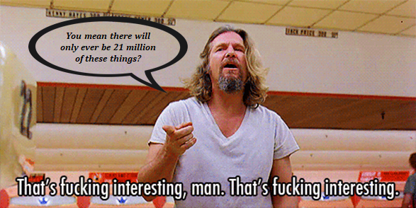

- “你说最终只会有 2100 万个这玩意儿？有点意思。” -

## 再说一遍：没有免费的午餐

越多人察觉到美联储的活动，发现的疑点就会越多。2 5000 0000 0000 （2.5 万亿）美元是一个很大的数字，但这到底是怎么发生的呢？谁得到了这些钱？这会有什么效果？效果什么时候发作？后果是什么？这怎么可能做到呢？这有什么意义？

所有这些都是有效的问题，但没有一个问题可以改变多得多的美元出现了的事实、每一美元的价值在未来都会大幅缩水的事实。这是很直观的。然而，在更加根本的层面，要认识到，印钱（以及创建数字美元）的操作并不能产生更多的经济价值。要简化它，请先想象一台永不停歇的印刷机。或者设想，在一台计算机上输入几个数字（美联储创造 “货币” 的操作在技术上就是这么回事）。这些操作显然不能产生真实世界中的任何价值。相反，这些操作只是诱使人们采取价值生产以外的行动。

要知道，任何有形的商品和服务都是由某一些个体生产的。人力时间是生产的输入，资本生产是输出。无论是软件应用、制造业设备、一项服务或是最终消费品，在整个价值链条上，某些个体付出时间来生产更多商品或服务。这些时间和价值是货币最终要追踪和定价的东西。给电脑输入几个数字不能产生软件、硬件、汽车和房子。人们生产这些东西，货币会被用来表达一个经济体中的所有个体的主观偏爱，并不同程度地补偿人们花费的时间。

当美联储在几周内创造出 2.5 万亿美元，它是在巩固对人力时间的定价权力。这听起来很神秘，但并不表示美联储中的人是故意的或恶意为之。这只是美联储行动的根本后果，即使他们本心善良。再说一遍，美联储的操作（武断地给几个银行账户余额加几个零）不能产生经济活动；它能做的只是如何分配这些新的美元。这样做会给某一些人、某一些企业或某一些经济经济部门带来（比其他人）更大的好处。在分配自己创造的增量美元时，它是在取代由数百万人参与定价的市场，代之以集权，从而极大地影响了控制货币资本的权力平衡；而货币资本本身是永远协调经济活动的。请把货币的分布理解成控制影响力的余额，而且最终会决定什么能得到开发、谁来开发、以什么价格开发。在创造增量货币的一刻，出现了更多的货币，但没有出现更多的人力时间、商品和服务。类似地，随着时间推移，美联储的活动并没有创造更多的工作，只是更多的美元在劳动力中分配，但货币持有人的分布不同。美联储可以印美元（技术上来说是创造电子美元），但无法印出时间以及其它一切，只能武断地操纵一个经济体的资源分配。

### 没有免费的午餐，只有更多的美元

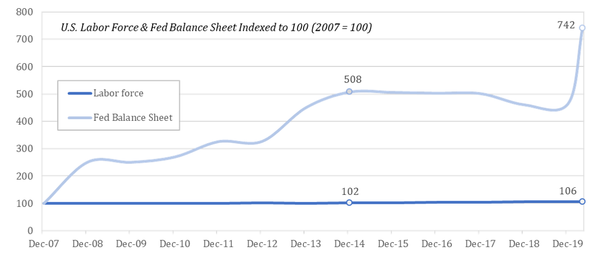

自 2007 年以来，美联储的资产负债表已经增加了 7 倍，但劳动力只增加了 6% 。也就是贡献经济产出的人的数量（人力时间）大致相同，但补偿人力时间的美元多了很多。不要被那些比较保住了多少工作、失去了多少工作的无法量化的理论迷惑了；这就是美元的劳动力数量，由劳工统计局定义的，所有 16 岁以上的人，包括已经就业的和失业状态的。不可避免的结果是每一单位的美元价值下降，但不会创造出更多的劳动者，而且所有价格并不会因为货币供应量的增加作出等量的调整（do not adjust ratably），包括劳动力的价格。

在一个理论世界中，如果美联储将新货币按人们原来的货币持有量按相同比例发放给他们，就不会改变权力的平衡。但在现实世界中，所有权的分布会迅速改变，严重偏袒金融资产的持有者（这些金融资产就是美联储在创造新美元的过程中买入的东西），以及那些可以便宜获得信贷的人（政府、大企业、高净财富人士，等等）。总结以下，每一单位的美元的购买力都下降了，只是不会马上反映出来，同时，一小群人从这种牺牲所有人的活动中受益（详见 “[坎蒂隆效应](https://www.austriancenter.com/cantillon-effect-populism/)”）。即使有这些后果，美联储还是采取这些行动来尝试支持一个如果不增发新美元就会崩溃的信贷系统。在美联储的经济体系中，这个信贷系统就是设定价格的机制，因为以美元计价的债务的数量远远超过美元的供应量，这也是为什么单位美元的购买力不会因为货币供给量的增加而立即下降。

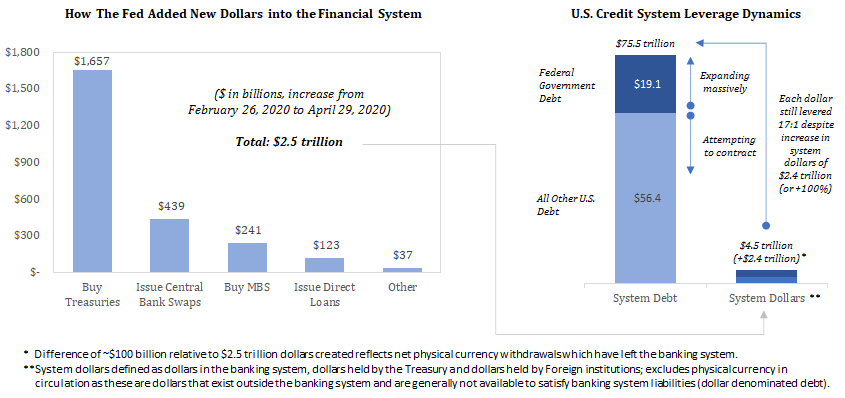

- 美联储如何向金融系统注入新的美元？购买国债、推出中央银行货币互换、购买 MBS（以房贷为担保的证券）、发行直接债务，其他。 -

相反，增加货币供应量的效果会通过信贷系统的扩张逐渐传递。信贷系统会收缩，是因为市场（也就是经济体中的个体）在适应和重新估价；美联储则试图通过增发大量美元来扭转这一自然过程；不言而喻，这就是凌驾于市场的价格设定功能之上，在根本上改变了经济体的结构。市场对问题的解决方案是减少债务（表达偏好），美联储的解决方案则是增加美元的供给量，使得现有的债务水平可被维持，目标是为稳定这个信贷系统，使之可以继续扩张。这就是 2008 年金融危机的重演，剧本一模一样。在上一次金融危机刚刚结束的时候，美联储在几个月内增发了 1.3 万亿的新美元。尽管如此，美元最初还是因为来自信贷系统的收缩压力盖过了货币增发的效果而走强了一段时间，但然后，随着信贷系统开始扩张，美元的购买力就恢复了下跌趋势。目前来看，美联储的货币刺激的起点是信贷系统，其效果也主要是通过信贷系统来传导的。2008 年的金融危机就是这样的，只要信贷系统保持不变，这一次也不会有什么区别。

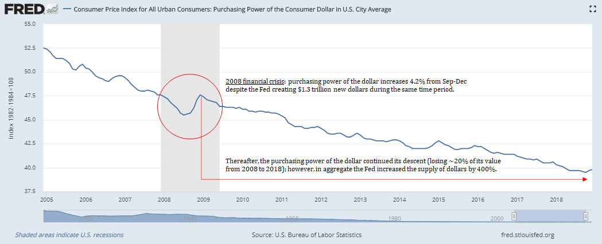

- 2008 年金融危机时刻，美联储增发了 1.3 万亿的美元，美元的购买力在 9 月到 10 月的一个月之内减少了 4.2%。后来，美元的购买力继续下降，从 2008 年到 2018 年的十年间减少了 20%；不过，总的来说，在此期间，美元的货币供给量增加了 400% 。 -

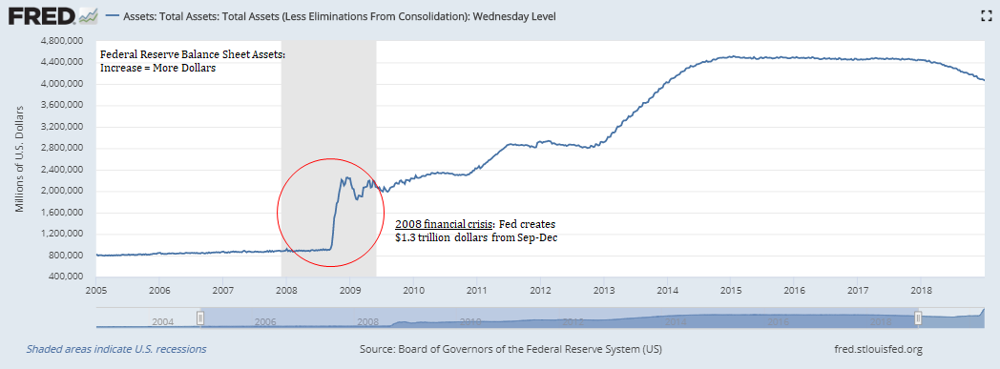

- 2008 年金融危机。美联储在一个月之内增发了 1.3 万亿美元。 -

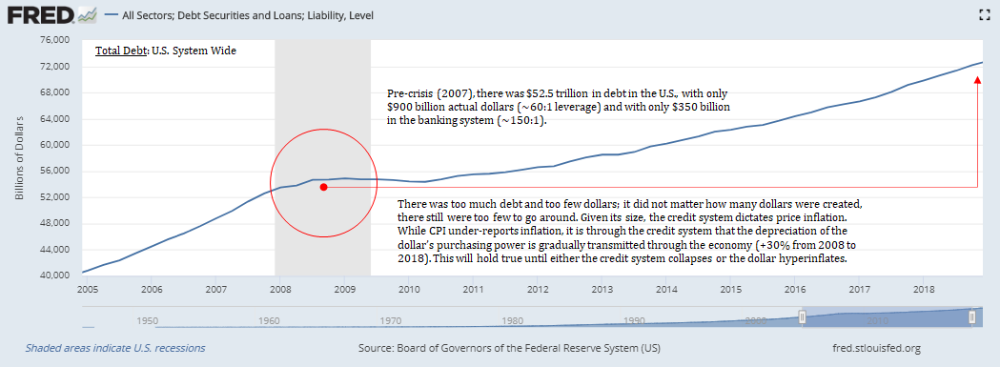

- 在危机发生之前（2007 年），美国国内总共有 52.5 万亿的债务，但只有 9 千亿的美元存量（大约是 60:1 的杠杆）；而且银行系统里只有 3.5 千亿美元（150:1 的杠杆）。 -

这些效果在真实的经济体中如何显现，是非常复杂的，但不需要多复杂的知识就能理解游戏解决的总体方向、它的根本缺陷。更多的美元的结果是每一单位美元的价值都会下降，而任何商品的价格都会自然趋向于其生产成本。美联储生产一单位美元的边际成本近乎是零。来自美联储和国会的救助，无论是对个人的还是企业的，最终都要有人来买单。不言自明的是，*印钱（或者说创造数字美元）不会产生经济活动*；它只会改变分配货币、定价风险的权力的平衡。它剥夺人们原有的权力、集中到政府手里。它也在根本上影响经济体的健康，因为它扭曲了所有地方的价格。但最重要的是，它将此等货币的稳定性置于风险之中，这是我们每个人都要承受的代价。美联储科技也许可以免费创造美元、财政部也许可以接到近于零利息的钱（这是前者的直接后果），但天下依然没有免费的午餐。依然要有人做事，印钱的效果是改变了美元的分布，也即更换了协调和定价这些工作的人。

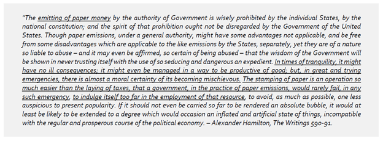

- “通过政府的权威来发行纸币，在各州以及国家宪法中得到了明智的禁止；合众国政府也不应抛弃这种禁止背后的精神。……” -

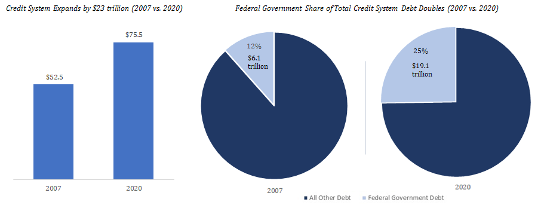

- 左图为信贷系统的规模；右图为政府债务的体量。比较对象为 2007 年情形与 2020 年情形。 -

> *“Gospodin”，他马上说，“你刚刚用了一个奇怪的词，至少对我来说有点奇怪，我是说……”*
>
> *“哦，'tanstaafl' 是不是？就是说世间没有免费的午餐。如果有的话”，我指着房间里的一个 “免费午餐” 标志，补充了一句，“那这些饮料就应该是半价。这是为了提醒她，任何免费的午餐，从长期来看其价格会是双倍，又或者，得到的是全然没有价值的东西。”*
>
> *“这观点挺有意思。”*
>
> *“不是观点，是事实。不论如何，想要什么，就得买单。”*
>
> —— Robert Heinlein, *The Moon is a Harsh Mistress*

## 比特币只是常识

许多人认为，作为一种货币，比特币的可以感知到的缺陷是过于复杂，因此无法获得广泛采用。事实上，美元更复杂，比特币更简单。抽象到极点，比特币非常简单：2100 万 BTC；谁控制着这个供应量呢？没有人！既不是美联储，也不是任何人。这就足够了。比特币在技术上确实复杂，包含更多的数学密码学，而且依赖于一种从表面上来没有意义的 “挖矿” 过程。整个系统里面有区块、节点、公钥、椭圆曲线、数字签名、难度调整、哈希值、nonce、默克尔树、地址，等等。

但即便如此，比特币还是非常简单的。其供应量固定在 2100 万 BTC，越多人想要它，其购买力就越强；底层的复杂性不会有影响其采用。在美元经济体中，绝大部分成员，甚至包括最聪明的人，也对美元系统的技术细节一无所知。美元系统不仅比比特币复杂很多，而且不透明得多。比特币中的复杂性和原语，在 iPhone 中也一样存在，但人们不需要知道 iPhone 细节，就能使用手机上的应用。比特币也是一样的。比特币的创新在于实现了有限的电子稀缺性，同时它易于分割和传输。2100 万 BTC，就这么简单。把它跟一家可以在两个月内增发 2.5 万亿美元的央行对比，是人们唯一需要用常识来分析的东西。

## 附录

### 附录 A. 美元的供给量

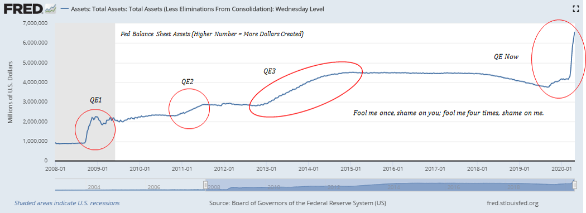

- 一而再、再而三，耍了我四次！ -

### 附录 B. 比特币的供给量

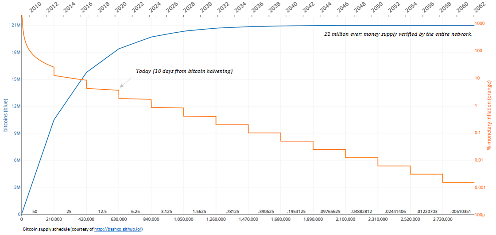

### 附录 C. 比特币对比美元的购买力

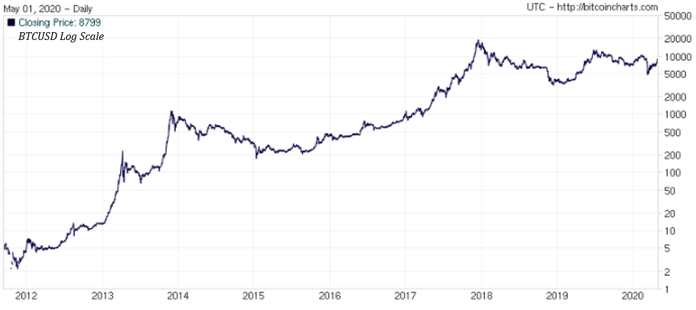

幕后当然发生了许多事，但这几张图就是一切的根本。这些点背后就是全世界的人。在美联储增发几万亿美元的时候，比特币的增发速率减半了（详见 [bitcoin halvening](https://bitbo.io/halving/)）。虽然大多数人可能没有意识到这两条不同的路，但越来越多人知道了（知识会随时间扩散），甚至发现了这点的一小部分人带来了比特币供给和需求的显著失衡。发生这种情况，比特币的价格就会跳升。就这么简单，这就是吸引其他所有人的地方：价格。价格是沟通信息的工具。所有本来没有关注的人也会对价格信号作出反应。底层的需求最终是由基本面决定的（即使投机存在），但大多数人不需要理解这些基本面，也能理解市场在发出信号。

一旦信号得到沟通，真相就会大白：比特币更简单。下载安全的 app，买一些比特币。买一块硬件，用它生成一个地址，把比特币发到地址里面。没有人可以把它拿走，也没有人能印出更多。在那一刻，比特币就会变得非常直观。表面上看似乎很复杂，但其实很简单，而且任何有常识的人都能理解它；好处这么大，货币又是这么基础的必需品，那么随着时间推移，其相对门槛一定会越来越低。自我保护是唯一必要的动机，它会打破一切不能克服的障碍。

支撑这一切的稳定基础是一个不能伪造的固定供给量、可以保存而没有对手方风险、抵抗审查和没收。有了这些基础，不需要太多的想象力，就能知道比特币会如何从一个不稳定的创新，变成一个稳定的经济主宰。硬性供给量限制，对比无穷无尽的贬值；生产成本指数型上升的货币，对比生成成本几乎总是零（其材料如此）的货币。最终，这种货币的供给量是无法操纵的，在此之上产生的价格系统也是不可操控的。对比特币的基本需求由此开始，也结束于此。

以比特币为背景，不言自明的是，无论是割让印钞的权力、还是允许一个央行来分配经济体内的资源，都不会有任何好处。多米诺骨牌一个接一个倒下，比特币的采用就会增长。并且，因此，比特币会从一个高波动、笨拙和新奇的玩意儿，变成稳定、顺滑和无处不在的东西。但整个转型要由价格来指引，而价格产生于一个基础：只有 2100 万的比特币。无法预测比特币具体会如何演化，因为绝大部分将为未来创造价值的人还不知道比特币。但随着比特币捕获更多的关注，其能耐会指数级扩大，超出当前已有的资源的范围。但这些新资源要以传统系统的直接损失为代价。这最终是两种货币系统的竞争，这两条路是截然不同的。

香蕉是从树上长出来的，货币不是，比特币就是让人们重新认识到现实的力量。同样地，世界上也没有免费的午餐。总要有人来买单。当政府和中央银行不能再凭空创造货币之后，暗箱通货膨胀只是一种分配资源的诡计、没有人愿意为此纳税的事实就会水落石出。凭借常识，这一切都不是问题。可能会有争论，但比特币是无可回避的前进道路。*时间比理性更能说服人*。

> *“你可以骗过所有人一段时间， 也可以永远骗过某一些人，但不可能永远骗过所有人。”*
>
> —— 亚伯拉罕·林肯

> *“这些程序可能乍看起来奇怪且困难，但就像我们已经走过的所有其他步骤一样，只需一些时间来熟悉，然后就会愉快接受：而且，在独立宣布之前，美洲会感觉自己就像一个一直死命干苦差事的人，既不得不做，又不愿意做，指望它有一天结束，还总质疑做这件事的意义。”*
>
> —— 托马斯·潘恩，*常识*

（完）