> *作者：Parker Lewis*
> 
> *来源：<https://nakamotoinstitute.org/mempool/bitcoin-is-the-great-definancialization/>*

你有没有遇到过那种投资顾问（或者你的父母），谆谆教导你要让自己的钱增值？这个观念，在全世界无数努力工作的人心中可谓是根深蒂固，简直已经成了 “工作” 这个概念的一部分了。

重复得多了，它就成了工作文化的一部分。找一个高薪的工作、养老金账户里的钱有多少拿出多少，然后找一个一看名字就很有钱途的共同基金，把钱投进去，然后坐等账户里的数字往上涨。大多数人每两周就会自动重复这个路径，从不怀疑自己的智慧，也不觉得其中有任何风险。这就是 “聪明人” 会做的事情。现在有许多人认为，这就是所谓的 “储蓄”，但实际上，这一金融化的过程，将退休储蓄变成了永久性的风险承担者，结果就是金融投资成了许多人（我就不说是绝大部分人了）的第二份全职工作。

很糟糕的是，一直有人在为金融化站台，结果就是储蓄（不承担风险）和投资（承担风险）的界限变得越来越模糊，以至于大部分人认为这两种活动是一回事。相信金融工程是幸福退休生活的必要条件可能缺乏常识，但已经成为许多人的家传宝训。

- 也许你只需要一种更好的货币TM ？ -

在过去的数十年中，全世界的经济体，尤其是发达国家（尤其是美国），都在日益金融化。膨胀的金融化，也是 “你要让你的钱升值” 这种观念的重要推手。但这个观念本身 （“你必须让钱升值” ），只有在每个人都被同一个不幸的现实 —— 钱会随着时间的流逝而失去价值 —— 笼罩之时，它才会进入主流的意识。

**钱会越来越 “不值钱” → 需要让钱升值 → 需要金融产品来让钱升值  → 往复循环**  

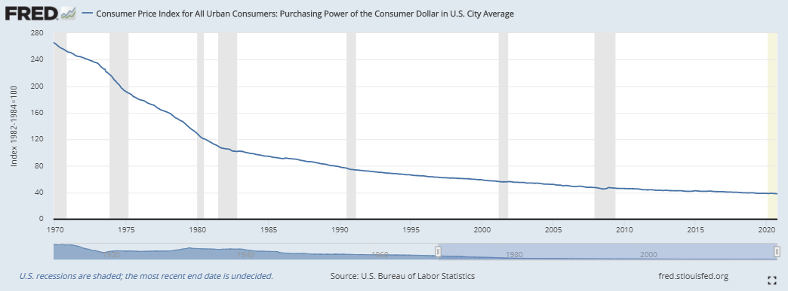

- 美元的购买力（从 1970 到2020) -

这种需求的迫切程度，很大程度上是被货币的价值流逝速度决定的；但这只是起点，要命的是，这是中央银行有意策划的结果。世界上绝大多数的中央银行，都以让本国的通货每年减少约 2% 的价值为目标，方法就是增加货币的供应量。怎么做的、为什么这么做，都不重要；重要的是，它是一种现实，产生了一些结果。退休金不是储蓄起来未雨绸缪，而是投入到金融市场中并背上永久的风险，往往只是为了跟上央行所制造的通货膨胀，维持自己的财富价值。

央行稀释货币的价值，导致此类畸形需求的产生，然后导致了此类投资的流行。过度金融化的经济体是通货膨胀的必然结果，因为通胀引致了永久性的风险承担并打破了储蓄的激励。而打消储蓄的激励、强制人们承担一定风险的系统也会制造不稳定，既不能发展生产力，也不能长期维持。哪怕是最懵懂于世事的人，都能一眼看出其中的道理，以及，驱动金融化和金融工程普遍化趋势的支配力量，就是货币媒介的破碎的激励结构。但货币媒介是所有经济活动的支撑啊。

从根本上来说，股份制公司、债券以及任何集合投资工具（pooled investment vehicle），都没有什么原罪。个人的投资工具往往有结构上的缺陷，所以共同投资工具和资本分配方法可以（也往往能够）创造价值。因资金汇集而产生的风险汇集并不是问题，金融资产的存在当然也不是。相反，根本的问题在于一个经济体金融化的程度，以及，人们对一个破损和受操控的货币结构的理性反应，意外地导致了金融化程度的不断升高。

如果数亿的市场参与者，开始认识到他们所用的货币是人为（而且是有意）制造每年稀释 2% 的价值的，那会怎么样？要么接受不可避免的穷困，要么试图用承担额外的风险来跟上通胀的步伐。什么意思呢？意思是，你有了钱就一定要去投资，同时也是说，你可能血本无归。只要货币的贬值不结束，这个循环就将持续下去。本质上来说，人们在 “日常” 工作中已经在承担风险了，但后来又被训练成把自己存到的所有钱都拿去冒险，只是为了跟上通货膨胀。这就跟仓鼠笼子一模一样 —— 仓鼠在这个滚轮里面不断奔跑，只是为了能待在原地。听起来似乎是失了智，但这就是现实。而且一定会带来后果。

- 美元的仓鼠笼子 -

## 储蓄 VS. 风险

虽然储蓄与风险的关系常常被误解，但是，任何人在一开始，如果想积累储蓄，都必须先承担风险。这种风险有各种各样的形式：投入时间和精力去追求那些别人愿意出价（还必须愿意持续出价）的东西，这样才能得到报酬（并继续得到报酬）。这个过程从教育、工作训练开始，终极来看就是不断完善一门其他人愿意购买的手艺。

这是有风险的。投入时间和精力尝试去生产对其他人有用的东西并讨一个生活，同时也是默认地接受了未来的高度不确定性。如果成功了，结果可能是一个学生教室、货架上的一个商品、一场世界级的演出、一个全职的体力劳动工作，或者是任何其他人认为有价值的东西。参与这个过程人从一开始就承担着风险，同时也期待着其他人愿意补偿你所花费的时间和交付给他们的价值。

补偿的常见形式就是货币，因为作为一种经济商品的货币使得个人可以将自己能提供的价值转化为许多种其他人创造的价值物。在一个货币不被操控的世界里，理解货币储蓄的最佳角度是：它是一个人为他人创造的价值和从他人处消费的价值之间的差额。储蓄只不过是推迟到未来的消费或者投资；再换句话说，储蓄表示一个人创造出了但还没消费的价值。不过，我们今天的世界不是这样子的。现代的货币就是汤里面的那颗老鼠屎。

中央银行创造越来越多的货币，导致储蓄永久贬值。货币的整个激励结构都是被操纵的，也破坏了货币这种本可以记录谁创造和消耗了多少价值的计分卡的公正。今天创造的价值，在未来只能买回更少的东西，就因为中央银行武断地允许更多的通货进入流通。货币本来是为了储存价值的；但在中央银行有意打造的经济体里面，每个人都不经意地被迫以承担风险替换货币储蓄，因为货币储蓄会不断贬值。货币储蓄的不断贬值，迫使组成经济体的成员承担不必要和毫无根据的风险。所以，除了要承担已经承担的风险（并从中获得报酬），每个人都被迫要承担增量的风险。

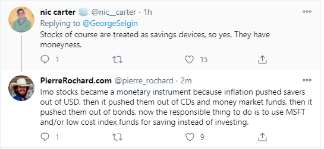

-  Pierre Rochard 和 Nic Carter 在 Twitter 上讨论储蓄和投资 -

强迫经济体中的几乎所有人都承担风险，对一个经济体的运行来说并不是天然的，也不是必要的。相反，这种安排不利于整个系统的稳定。作为一种经济功能，风险承担本身是生产性的、必要的，也是不可避免的。糟糕的地方在于，个人是被强制去承担风险的，这是央行制造货币贬值的副产品，无论这些被迫的个体是否意识到了其中的因果关系。仅当风险承担是主观有意识的、自愿的、是为着积累资本而承担起来的，它才能够是生产性的。

虽然生产性投资和由货币通胀引致的投资之间有灰色地带，不容易区分清楚，但只要你看到它，就能认出来。生产性投资在市场中会自然发生，因为参与者希望提升自己以及亲友的生活。在自由市场中本来就存在承担风险的激励。央行的干预不会有所帮助，还会添乱。

当风险承担的起点更多是绑架而不是自由意志时，它还会变成反生产性的。这是很直观的，而且就是因货币贬值而引致投资的情形。要知道，所有未来的投资（和消费）都来自于今天的储蓄。操控货币激励，尤其是遏制储蓄的意愿，会扭曲未来投资的时机和条件。

它强迫所有地方的储户参与投资，毫无必要地点燃了消耗所有货币储蓄的导火索。它也不可避免会制造出一个烫手山芋的游戏 —— 没有人想持有货币，因为它会不断贬值（反过来说也是对的，因为没有人想持有货币，所以它会不断贬值）。你认为，在这样的世界里会产生什么样的投资？央行的冰山渐渐融化不会产生对储蓄的激励，而只会引发新一轮的的永续风险承担，而大部分的储蓄都几乎立即就会倒回去承担风险、投进金融资产中，要么是个人直接操作，要么是吸收储蓄的金融机构的间接操作。更糟糕的是，这两件事情的混淆是如此严重，以至于大部分人认为投资，尤其是投资金融资产，就是储蓄。

毫无疑问，投资（不管是金融资产还是其它方式）绝不等于储蓄，由央行反激励储蓄而引致的风险承担也不是什么正常、自然的事情。任何有常识、有现实世界经验的人，都能理解这一点。即使如此，还是没有改变货币每年都会贬值这个事实（因为它确实就贬值了），而且，对这一事实的知觉非常理性地支配着人们的行为。每个人都被迫接受了一个人为制造的困局。要让你自己的钱升值，这种想法的背后是有史以来最大的骗局之一。你根本没法让钱升值；是央行制造了这种糟糕的困局。央行耍过的最大花招就是说服大家相信人必须永远承担风险才能保卫已经创造出的价值。这根本是不可理喻，而唯一实际的解决方法就是发现一种更好的货币，消除系统性的货币贬值中固有的不对称性。

这就是比特币背后的理念。一种更好的货币，为所有人提供了一条可靠的退出路径，逃离这个仓鼠笼子。

## 大金融时代

无论你是否认为这是个被操纵的游戏，还是仅仅认识到了永恒的法币贬值就是一个现实，全世界的经济体都已经被迫接受了一个货币会不断贬值的世界。虽然贬值货币的初衷是鼓励投资并刺激 “[总需求](https://en.wikipedia.org/wiki/Aggregate_demand)” 的增长，但当经济激励被外生的力量扭曲的时候，就总是会产生意想不到的的后果。要是印钱就能解决这个世界的问题，那我想最愤世嫉俗的人也会拥护，但是，再说一遍，只有小孩子才会相信这种童话故事。印钱非但不是消除问题的魔法，还会导致问题一再地出现。现代经济的结构已经彻底被货币创造的过程改变了。

美联储也许相信印钱可以鼓励生产性投资，实际上创造出来的却是错误投资和过度金融化的经济体。经济体的日益金融化，就是货币贬值和信贷成本被操控的直接后果。完全没有脑子的人才看不到其中的关联：被人为制造贬值的货币、没有动力持有货币、（包括信贷系统内的）金融资产的迅速膨胀；因果关系如此明显。

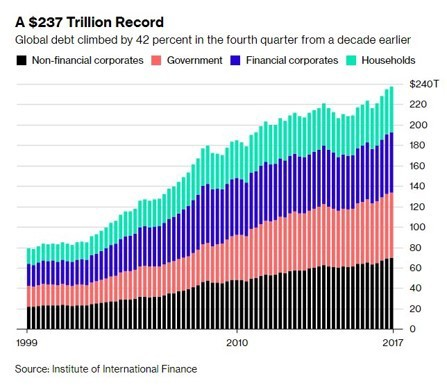

银行业和财富管理行业也是在相同的作用下形成的。就像毒品贩子要免费送你第一支一样。毒品贩子是通过制造瘾君子来创造对自己产品的需求的。美联储就是毒品贩子，货币通胀就是毒品，而发达国家的金融化就是瘾君子。制造货币贬值后，本来没有需求的金融产品市场就发展了出现。各种金融产品，浑身解数，帮助人们开发能走出美联储挖好的陷阱的办法。货币通胀了，承担风险、创造回报的需求就产生了。

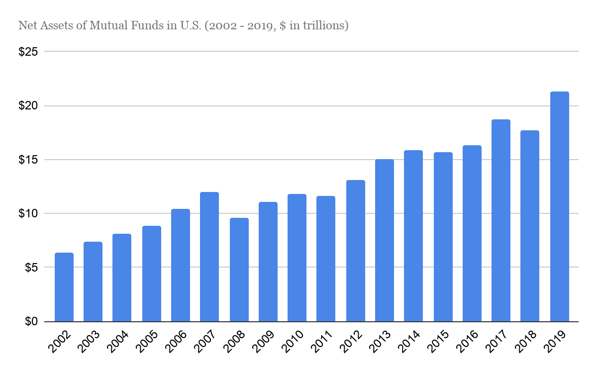

- 来源：Statictica -

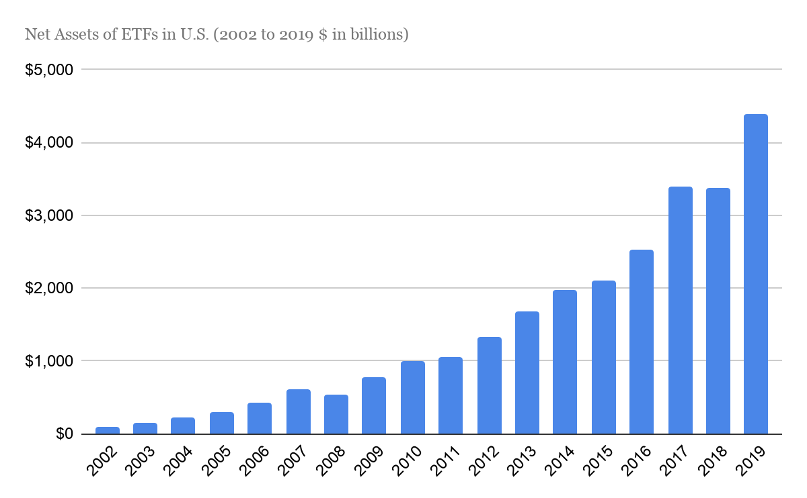

- 来源：Statictica -

随着时间的推移，金融业在经济体中的比重会越来越大，因为对金融服务的需求会越来越大（原因？你懂的）。股票、公司债、国债、外国债、共同基金、股票 ETF、债券 ETF、杠杆 ETF、三倍杠杆 ETF、分拆股（fractional shares）、房贷支持型证券（MBS）、有担保债务包（CDO）、债务支持型证券（CLO）、信用违约互换（CDS）、信贷默认互换指数（CDX）、合成 CDS/CDX，等等。所有这些产品都代表着经济体的金融化，而且货币功能损坏越严重，这些产品就越重要（需求越多大）。

每一次向资金池、打包和再打包的风险的增量转移，都可能跟内生于货币的、被破坏的激励结构有关，跟人为导致的 “让钱增值” 的需求有关。再说一遍，我不是在说某些金融产品和金融工具无法创造价值；而是说，人们使用金融产品的程度以及风险层累的程度，基本上都是被一个有意破坏的货币政策激励结构决定的。

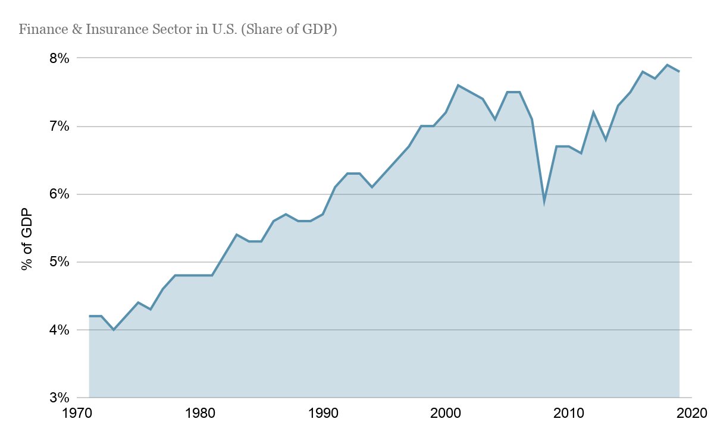

- 来源：Statictica -

虽然绝大部分的市场参与者在美联储把  2% 的年通胀率目标常态化之后都还能睡个好觉，但你想想政策实施十年甚至二十年的后果。这意味着在 10 年、20 年期间你的储蓄的价值会缩水 20% 和 35%（复合缩水率）。如果社会上的每个人，都必须重新创造相当于他们储蓄价值的 20% 到 35%，才能保持自己的财富、留在原地，你觉得这个世界会变成什么样？

最终的影响就是大规模的错误投资；这些投资，如果人们不是被迫去承担没必要的风险才能弥补自己当前储蓄的预计损失，就不会发生。从个人角度来看，这意味着医生、护士、工程师、教师、屠夫、杂货商人、建筑工人，等等，都被转化成了一个金融投资者，将自己大部分的储蓄投入到华尔街的金融产品中，承担着风险却以为没有风险。随着时间推移，股票的价格只会上升、房地产的价格只会上升，而利率只会下降。

-  发个图表示一下，我也是 Dave Portnoy 的粉丝  -

对于 Davey Day trader （及世界上此类节目）的听众来说，怎么做到的、为什么要这么做，都是一个谜，而且也不重要，因为在他们看来，这就是这个世界运作的方式，而每个人都相应地做出自己的行动。放心，这一切都会以糟糕的后果结束，但大部分人都开始相信，投资金融资产只是一种更好的（或者必要的）储蓄方式，而信念指导着他们的行为。“多样化投资组合” 已经变成了储蓄的同义词，人们不认为资产有风险，也不觉得投资是一个要承担风险的活动。虽然说这实在是太扯了，但你有什么办法呢？要么承担风险，要么让你的货币储蓄的购买力确定无疑地越来越小。从储蓄的角度，这其实是进退两难。在这场扭曲的比赛中，人们要么被迫上场，要么不能入场，没有人是赢家。

## 不愿储蓄的后果

强迫所有人活在一个货币价值会不断稀释的世界里，创造了一个每况愈下、不断强化的反馈循环；当储蓄货币无论如何也成不了赢家之后，整体上所有结果都变得更加消极。当货币会不断损失价值，仅仅持有货币就变成是一个不可靠的策略了。人们还在这么做，但只这样做就铁定是输家。这也是为什么永续的风险承担会成为对储蓄的（不情愿的）替代品。本质上，当没人能通过储蓄货币而赢的时候，其实所有人都是输家。因为，每个人在想要获得货币的时候就已经承担了风险了。对储蓄的正向激励并不等同于奖励不愿意冒险的人，正好相反。这是在奖励已经承担了风险的人，让他们可以只持有货币，因为不会有货币的购买力在未来必将贬值的承诺。

在一个自由市场中，货币的价值在一个特定的时间段内可能涨也可能落，但 *明确承诺* 货币会贬值创造了一个极端负面的结果，就是经济体中的绝大部分参与者都会失去储蓄。因为货币会缩水，那机会成本就使人们的行为变成了一条单行道。现在就把钱花出去，因为明天它能买到的东西会更少。持有现金（也即是以前人们所知的 “储蓄”）的想法在主流的金融界已经被看成是一种近乎疯狂的立场，因为每个人都知道货币会贬值。但疯的是谁？虽然货币是为着储蓄价值而得到采用的，但现在没有愿意持有它，因为今天大家用的主流货币的表现正好相反！如果不能找出一种更好的货币，每个人都只能用投资来替代！

> “我依然认为，相对于其他替代品，尤其是那些在通货再膨胀的时期能维持价值乃至升值的东西，现金就是垃圾。”
>
> —— Ray Dalio（[April 2020](https://markets.businessinsider.com/news/stocks/i-still-think-cash-trash-ray-dalio-dismissed-dollars-reddit-2020-4-1029079224)）

即使最有资历的华尔街投资人，也可能会陷入迷乱，表现得像个傻瓜。因为通胀而去承担风险，比买彩票好不了多少，但这就是遏制储蓄动机的结果。当货币经济激励被打破的时候，机会成本就很难测量和估计出来。但今天人们都学乖了。做出投资决策、购买金融资产，仅仅是因为预计美元会贬值。结果不会仅仅停留在储蓄和投资上。每一个经济决策都会受影响，因为货币已不再能实现储存价值的初始目标。所有支出和储蓄的决策，包括日常的消费，都会受影响。

如果给支出货币重新引入一个更明显的机会成本（也就是有储蓄激励的话），每个人的风险计算都必然会改变。经济决策会变得更敏锐，因为货币能够满足保值的功能。只要货币媒介的价值有可靠的预期、至少能维持价值（就不说升值了），每个支出-储蓄决策都会变得更精准，并且最终能得到一个更好的、激励相容的结构的指导。

> “评价政策的时候最大的错误就是只看它是不是出于好心，而不看它产生了什么结果”
>
> —— Milton Friedman

凯恩斯主义的经济学家常常担心，如果有储蓄的激励，就不会存在投资。这种漏洞百出的理论说，如果人们有激励 “囤积（hoard）” 货币，就不会有人愿意支出货币，因此即使 “必要” 的投资也不会发生。如果没人支出货币、没人愿意做承担风险的投资，那失业率就会抬头！这完全是教室里空想出来的理论；现实与凯恩斯主义者想的正好相反，储蓄有激励的世界，风险也会被承担起来。

不仅如此，投资的质量反而会更高，因为消费和投资都能从没有被扭曲的价格信号中受益，而且在自由市场之下，支出货币的机会成本能得到更清楚的定价。当所有的支出决策，都是在货币在未来的购买力可能上升的预期下考量的，投资就会导向最具有生产力的活动，而日常消费会经过更严格的考虑。

相反，如果投资决策都是在不想持有美元的前提下做出的，结果就是金融化。类似地，当消费偏好被货币贬值的预期影响时，投资也会被导向去迎合这些扭曲的偏好。最终来看，短期的激励会打败长期的激励，已经进圈的人会比新来者更受欢迎，经济体会停滞，一样一样助推金融化、集中化和金融工程而不是生产性投资。这就是原因和结果；有意的行为，产生了意外但可以预测的结果。

让货币贬值，人们就会做傻事，因为干傻事的代价更低。原来人们会储蓄，但现在要去承担多一份风险，因为储蓄会贬值。在这样的世界里，储蓄也被金融化污染。而当人们有了不去储蓄的激励时，很快就没有多少人有储蓄了，你用不着惊讶。经验证据恰恰证明了这一点，无论一个拿了终身教职的经济学教授会不会惊讶，（完全可以预测），因为没有储蓄激励导致的储蓄不足，就是传统金融系统内在脆弱性的主要来源。

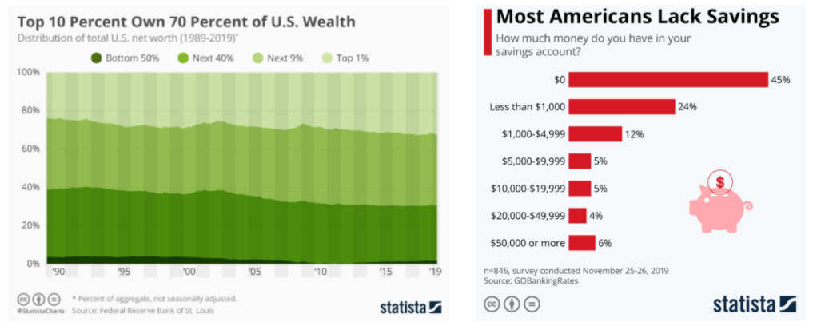

## 固定货币总量的悖论

储蓄不足和经济不稳定，都来自底层通货的扭曲的激励，而这正是比特币要解决的原则性问题。消除了货币贬值的可能性之后，被打破的激励措施也会回到相容的状态；只需总量有上限这一条，就足以扭转金融化的趋势。虽然每个比特币都可以划分成 1 亿个单位（就是小数点后 8 位），但比特币的名义数量上限就是 2100 万个。比特币可以切分成越来越小的单位、让越来越多人接受它作为货币本位，但没人能任意增发比特币。

考虑一个所有 2100 万比特币都在流通的极端情况：技术上来看，人们不可能储蓄超过 2100 万比特币，但结果是 100% 所有的比特币都在储蓄中 —— 被那个时候持有比特币的某个人储蓄者。比特币（包括散钱）会在人个人之间、公司和公司之间不断转移，但总供应量是不变的（而且是完全没有弹性的）。

通过创造一个货币总量固定的世界（能储蓄的总量不会更多也不会更少），个人的储蓄的激励和情绪就会上升。这是一个悖论：如果总量上没有更多的钱可以储蓄，个人层面的储蓄意愿就会上升。表面上看，似乎不过应了一句老生常谈，就是人们看重稀缺的东西。但实际上，更好的解释应该是这样：只有储蓄有好处人们才会去储蓄，即使能储蓄的数量是有上限的。而且，某人想储蓄的时候，必须有其他人愿意支出自己现有的储蓄。

不管怎么说，所有的消费和投资都来自储蓄；对储蓄的激励产生了储户，反过来，更多储户则使人们有更多工具可以消费和投资。从个体层面看，如果一个人预计一个货币单位的购买力会提升，TA 可能会理性地推迟自己的消费和投资（请注意关键词是 “推迟”）。这就是为什么说对储蓄的激励创造了储户。这并没有消除消费和投资；它只是保证了决策会经过更严密的审视（因为预期未来的购买力会上升）。你可以自己对比一下每个人都在这种激励机制下行动的情形，和我们今天的情形。

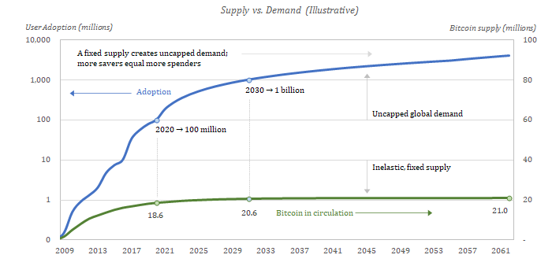

虽然凯恩斯主义者担心一种会升值的货币会遏制消费和投资、会使人们偏向于囤积货币并深刻损害经济体，但实际上，自由运行的市场比运用了凯恩斯主义理论时候的市场更高效。会升值的货币每天都会参与消费和投资，因为人们有储蓄的激励。正的时间偏好会指引对消费和投资的需求，而且也会有明显的储蓄动机；每个人都会尝试赚其他人的钱，而且每个人每天都要消费商品。

“时间偏好” 这个概念在 [Saifedean Ammous](https://saifedean.com/) 的《比特币本位》一书中有详细描述。虽然这本书是一本必读书，但也没有简单的几句话能总结出其全部的内容；我略微解释一下：个体可能拥有较低的时间偏好（更看重未来的享受，而不是现在的享受）或者较高的时间偏好（更看重现在而不是未来），但每个人的时间偏好都为正。货币仅仅是一个工具，用来协调人们日常所消费之物的生产活动。给定时间本身是稀缺的、未来是不确定的，即使那些会为未来做计划和储蓄的人（低时间偏好的人），在边际上也会认为当前的享受比未来更重要。

说极端一些，如果你赚了钱，而且真的从来没花过一分钱（或者 1 satoshi，亿分之一个比特币），这也不会给你带来任何好处。所以即使货币会逐渐升值，（平均而言）当下的消费和投资也总比未来的更重要，因为正的时间偏好，以及你还有生存（且不说享受）的需要。

**70 亿人的竞争 + 2100 万比特币  = 不断升值的货币 + 持续的支出**

现在，想象一个，在比特币数量有上限的世界里，每个人都遵循同样的原则，会是一个什么样的世界。70 亿以上的人口，只有 2100 万比特币。每个人都既有储蓄的激励（因为货币的数量有限），又有正的时间偏好以及日常消费需要。这样的世界里会产生对货币的激烈竞争。每个人都不得不创造充分有价值的东西来吸引其他人辛勤劳动赚来的钱；而他之所以会这样做（想赚钱），也是因为他知道角色可以调转过来，TA 可以买到很好的东西。这就是比特币提供的契约。

储蓄的激励有了，但想要储蓄就必须生产对其他人有价值的东西。如果一开始你没有成功，你可以继续尝试。在那些持有这种货币和提供产品和服务的人之间，利益和激励都是完美相容的，因为在交换中，买卖双方的角色会不断轮转。违背直觉的是，在一个（技术上来说）钱不能变得更多的世界里，每个人都有激励 “储蓄更多钱”。随着时间推移，平均来看每个人持有的货币名义数量都会越来越少，但每个货币单位的购买力都会越来越高。推迟消费和投资的能力会得到奖励（至少不会被惩罚），就是保证所有经济激励能够相容的关键。

## 比特币与伟大的反金融化

储蓄比特币的首要激励就是，比特币代表着一种权利，可以永久拥有一种数量有限的世界货币的一个不变的比例。没有中央银行来任意增加通货的供给量并让储蓄贬值。通过编程出一套没有人能改变的规则，比特币将会成为逆转金融化趋势的催化剂。全世界经济体的金融化程度如此过分，正是货币经济激励不相容的直接后果，而比特币会通过重新引入合适的激励来鼓励储蓄。更直接的是，货币的贬值一直是金融化的根本动力，现在完全被釜底抽薪了。当产生这些现象的动力被扭转过来了，反向的运动自然而然就会出现。

如果说货币贬值导致了金融化，那么符合逻辑的推论就是：回到健全货币本位将产生相反的效果。金融化的浪潮已经开始褪去，但因为人们还没看到那不祥征兆，海啸才正要开始形成。把大部分货币储蓄都用于投资的做法已经盛行了几十年，不可能在一夜之间改变。但随着世界慢慢了解比特币，全球央行又发行几万亿美元的货币，以及 17 万亿的负利率债务的存在，这些独立事件之间的关联渐渐地浮出水面。

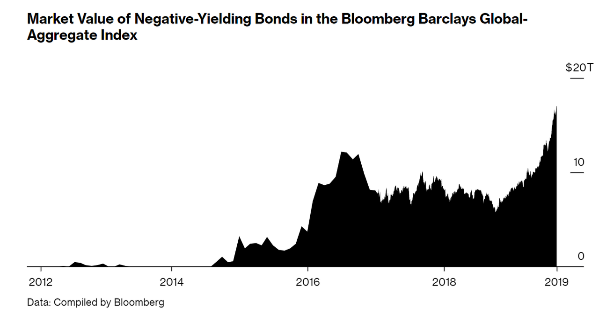

>“彭博巴克莱全球负利率债务指数的市值上升到 17.05 万亿 [2020 年 11 月]，乃是有史以来的最高点，略高于 2019 年 8 月的 17.04 万亿。”
>
>—— Bloomberg News

越来越多人开始怀疑把退休金投到有风险的金融资产里去的做法。负利率的债务没有道理；中央银行在几个月内放水几万亿，也没有道理。全世界的人都开始质疑金融系统的整套建构。适应这样的系统也许已成传统智慧，但世界非如此不能运行吗？如果我们需要的其实只是一种更好的货币，而不是每个人都去买股票、买债券、用储蓄去承担层累的金融风险呢，我们能回到过去吗？

如果每个人都有办法获得一种编程好了永不稀释价值的货币，而不必去承担永无止境的风险，那这个失去理智的世界就有可能回归正常，而副产品就是更好的经济稳定性。你动动脑子：每个人都去投资大公司的股票、债券和结构化的金融产品，这件事很理性吗？其中有多少是因为被破坏的货币激励而引起的？有多少退休金是因为想在货币通胀下保值才加入这个风险承担的游戏的？金融化是金融危机的导火索，其崩溃也是金融危机的直接原因。

虽然不是唯一的原因，但货币系统的激励机制缺失导致了经济体变得高度金融化。很少有人会未雨绸缪，而到了流动性危机的时候人们才明白，货币资产和金融资产是有区别的。同样的事情（流动性危机）在 2020 年上半年再度上演。俗话说得好，上当一次该谴责骗子，但同样的技俩上当两次就该反思自己了。

根本原因在于货币系统的破损，以及由此催生的金融系统所引入的道德风险。这不是什么误解；整个经济体的不稳定，就是货币系统不健全的结果；随着越来越多的后果浮现出来，越来越多的人们会转身寻找更好、更可持续的发展道路。

现在，随着比特币走进舞台中央，市场机制会去金融化并拯救我们的经济。当市场参与者日益偏好持有一种更可靠的货币，而不是一堆有风险的资产，金融资产中的价值会逐步转移到比特币上。这一过程，原则上可以通过增长的比特币接受度、比特币相对其他资产的升值以及整个金融系统的去杠杆化表现出来。以比特币为计价单位，几乎所有的东西都会逐渐失去购买力，因为比特币会被全世界接受为货币本位。

而在短期内，比特币会吃掉近于价值存储用途的金融资产的市场份额；这些长期充当货币替代品的资产，会被慢慢换手成比特币，这是唯一的结果。在这个过程中，金融系统的规模，相对于比特币网络的购买力会逐渐收缩。作为一种健全的货币标准，比特币不仅会导致金融资产的消失，还会影响未来对同类产品的需求。如果你能拥有有史以来最稀缺的资产（以及货币），你还要买啥主权债务（收益率近于 0）、公司债（流动性差）和股票（带风险溢价）？

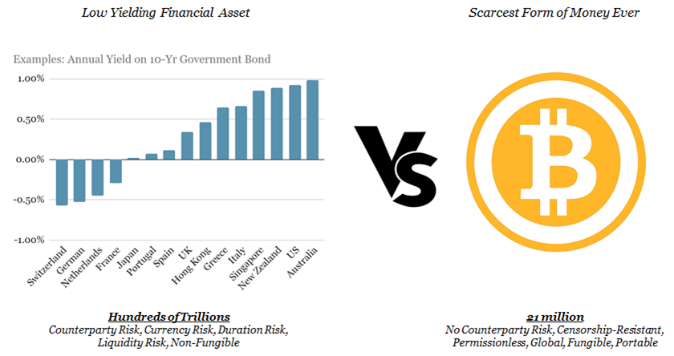

首当其冲的会是那些明显估价过高的金融资产，比如负利率的主权债务，但其实别的东西也没啥不同，排着队看是谁先完蛋而已。等到趋势逆转的时候，非比特币资产的价格会面临下跌压力，然后这些资产所支撑的债务工具也会面临下跌压力。对信贷的需求会大幅下降，使得信贷系统收缩。而这又会反过来加速对量化宽松（增加基础货币）的需求，以维持和吹胀信贷市场，然后进一步推动价值从金融资产出逃到比特币。去金融化的过程会自我持续和加速，因为金融资产价格、信贷系统和量化宽松所组成的反馈循环。

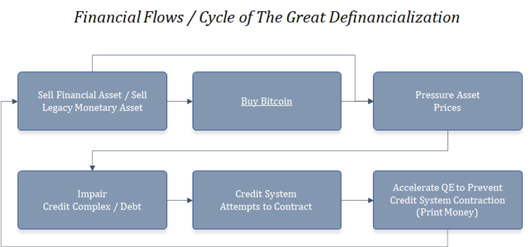

更重要的是，随着时间的推移，知识的传播，个人会越来越倾向于简单的比特币（及其 2100 万的硬上限），而不是复杂的金融投资和结构化金融风险。金融资产需要承担操作风险和交易对手风险，而比特币是一种不记名的资产，总量严格固定，而且容易转让。货币的作用与金融资产截然不同。一项金融资产只是对一份收入流或者一项生产性资产的索取权，而这些索取权都要以特定形式的货币来计价。金融资产的持有者期望能在未来获得更多的货币，但都要承担风险。但拥有和储蓄货币，就只是储蓄而已，其意义在于未来能换回商品和服务。一言以蔽之，货币可以买回家用杂物；但股票、债券和国债不行。而且其中也是有理由的。

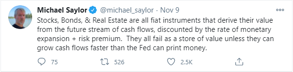

- Michael Sylor：“股票、债券和房地产都是法币的工具，其价值是未来的现金流收入以综合了货币通胀和风险溢价的利率折成的现值。他们都不会是好的价值储存工具，除非其收入流增长得比美联储印钱的速度更快。” -

储蓄和投资之间有亘古不变的根本区别；储蓄是持有货币形式的资产；而投资是拿去承担风险的储蓄。其中的界限在一个金融化的系统中已经很模糊了，但比特币会再次擦亮这条界线。带有正确激励结构的货币将压倒对复杂金融资产和债务工具的需求。普通人会义无反顾地选择由固定数量的货币媒介所带来的安全感。随着个体出逃金融资产而拥抱比特币，经济体将去金融化。这会自然地削弱华尔街的权力，把它还给普通人。

银行也将不再是经济体的中心，也不再是寻租的场所，相反，他们会跟其它行业一样，更卖力地竞争资本。今天，货币资本大部分都归于银行系统，但在比特币化的世界里将不再如此。作为转型的一部分，货币的流动也将越来越远离银行业，它会更直接、更自由地在实际创造价值的参与者之间流动。

信贷市场、股票市场和中介的功能都仍然存在，但其规模将回归合适的水平。随着金融化的系统所消耗的资源越来越少、创造经济价值的参与者之间的货币激励也会越来越越相容，比特币会重构经济体。打消储蓄的激励造成了一系列的社会后果，但以后，船头将朝向正确的方向。在未来，人们为股票和投资组合每天挠头的日子将一去不返，更多的精力将回归日常生活和真正重要的事情。

储蓄比特币（无风险）和投资金融资产（承担风险）有天壤之别。拿你喜欢（而不是讨厌）的货币来储蓄有一种宣泄作用，就像无意间从肩头卸下重担。可能不会那么快显现出来，但以后会越来越清楚：储蓄一种健全的货币，最终能使个体更少忧虑，不必焦虑于让钱增值。

如果几十亿人都使用同一种货币，那么每个人都可以专注于创造价值。没人知道未来到底会怎么样，但比特币将使经济体去金融化，让世界重焕新生。

(完）
