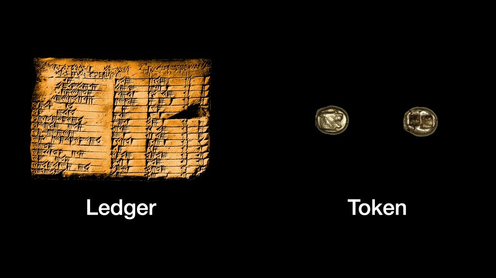
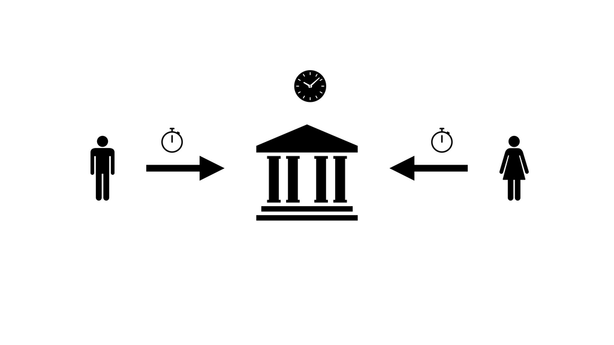
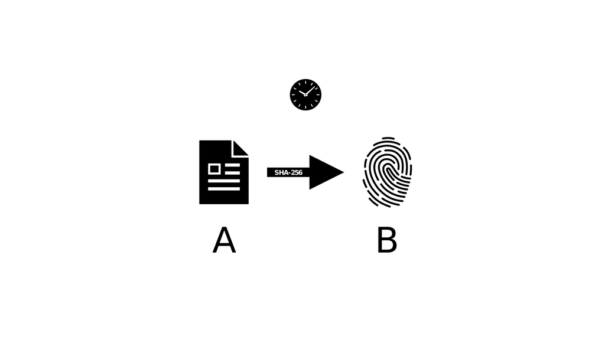
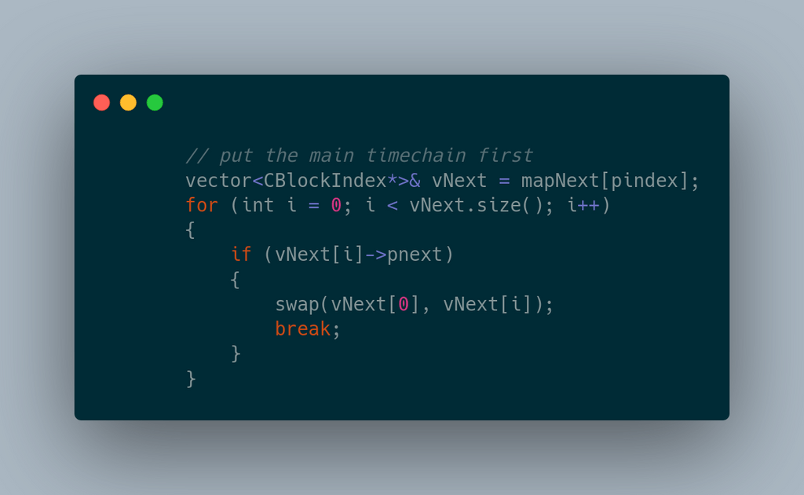

> *作者：Gigi*
>
> *来源：<https://www.swanbitcoin.com/bitcoin-is-time/>*
>
> *原文使用 [CC BY-SA 4.0 许可](https://creativecommons.org/licenses/by-sa/4.0/)，只要保持原作者署名并以同样的许可发布成品，即可自由分享和改编。本译本也采用同样的许可。*
>
> *This work is published with [CC BY-SA 4.0 license](https://creativecommons.org/licenses/by-sa/4.0/).*

---

> 一轮漾着清辉的时钟高悬于空，
>
> 宣告时间没有对错。
>
> —— 罗伯特·弗罗斯特，《我与夜晚熟稔》（1928）

> 我们仍未猜透时间这个巨大的谜题。时间不过是一个概念；我们甚至不知道它是否真的存在……
>
> ——Clifford D. Simak，《莎士比亚的星球》（1976）

俗语有云，时间就是金钱。反之，金钱也是时间：时间就是人类体内存储的所有经济能量。然而，时间和金钱之间的关系远比乍看之下复杂得多。如果创造金钱不需要时间，金钱就不成其为金钱，至少无法长时间发挥金钱的作用。再想深一层，追踪信息世界的事物就是追踪时间。

一旦金钱数字化，我们必须就时间的定义达成共识，这就是问题所在。或许你觉得报时无非就是瞥一眼旁边的时钟那么简单。如果只是处理日常工作，你这么想也行。但是，如果要让一个全球的、人们在其中各行其是的分布式网络同步推进状态，报时就成了巨大的难题。如果时钟无法信任，你该如何获得正确的时间？如果你的系统跨越星系，你该如何建立时间的概念？在没有时钟的世界，你该如何衡量时间？时间究竟是什么？

为了解答这些问题，我们必须进一步了解时间的概念，以及比特币是如何自创时间单位（出块时间，也就是我们通常所说的*区块高度*）的。我们将探索的问题包括：为什么计时最终会与记账联系起来？为什么去中心化系统中没有绝对时间？比特币是如何利用因果关系和不可预测性来定义 “现在” 这一时态的？

记时器已经多次为文明社会带来巨大改变。正如 Lewis Mumford 在 1934 年所说：“工业时代最重要的机器不是蒸汽机，而是时钟。” 如今，计时器再一次推动现代文明发生变革：信息时代最重要的机器不是计算机，而是时钟。这个时钟就是比特币。

## 追踪

> “让孩子学习数东西，从而获得数字的概念。在计数的时候，这些东西就可以当作都是一模一样的，它们可能是单个对象或一组对象。”
>
> —— David Eugene Smith，《初等数学教学》（1900）

总的来说，我们可以通过两种方法来追踪物品：物理象征物和账本。你可以直接使用现实世界中的物品，例如，贝壳、硬币或其它有形的东西（来表达相应的数量）；也可以通过在一张纸上记下已经发生的事来复制世界的状态。

想象一下，你是一个牧羊人，想要确保每只羊都会返回家中。你可以为每只羊戴上项圈，每当有一只羊回家，你就取下那个项圈，挂在棚子里。假设每个项圈都会挂到一个单独的挂钩上，只要挂钩都挂满了，就说明所有羊都到家了。当然了，你也可以每次都数一遍，然后列一张表。然而，每当你开始数之前，你都要重新列一张表，防止重复计数或漏计。

货币本质上就是用来追踪债务的工具。总的来说，迄今为止充当过货币的东西可分为两类：物理制品和信息列表。更通俗一点的说法就是，象征物和账本。

理解这两类货币的本质区别很重要。我要在此作出明确说明：物理象征物 *直接* 表示事物的状态；账本则 *间接* 反映事物的状态。二者各有优缺点。例如，象征物是物理的、分布式的，账本是信息化的、中心化的；象征物本质上是免信任的，账本不是。

在数字世界，我们只能使用账本（虽然总有许多 “大师” 想让你相信还有别的办法）。这是 *信息* 世界，不是物质世界。即使你将某类信息定义为 “象征物”，它依然是一段写入硬盘或某种信息存储媒介的可塑信息，以信息记录的形式呈现出来。

所有数字信息本质上都是账本，这就是产生 “一币多花” 问题的根源。信息从不直接表示世界的状态。此外，信息的移动也意味着信息能够复制。信息存在于某个地方。要想 “移动” 信息，你必须将它复制到另一个地方，然后将原有信息删除。物质世界则不存在这种问题，移动就是移动，并不意味着复制。信息世界不具备这种特征。如果你想将信息从表 A “移动至” 表 B，你必须将信息从表 A 复制到表 B。除此之外，没有其它方法。

另一种思路是 “惟一性”。物理象征物是独特的原子组合，不能轻易复制。纯粹的信息不具备这一特征。只要你可以阅读某个信息，你就可以将它完美复制出来。因此，我们可以得出这样一个结论，物理象征物具备独特性，数字象征物不具备。我甚至认为 “数字象征物” 一词有待商榷。象征物可以表示秘密信息，但绝不会表示绝无仅有、不可复制的信息。

这种特征差异表明，信息实际上是无法 “移交” 的。数字象征物不可能像物理象征物那样转移，因为你无法确定原所有者是否破坏了信息。和所有信息一样，数字象征物只能像想法一样被传播。

> “……如果你有一个苹果，我也有一个苹果，我们可以互换苹果，换完之后还是一人一个苹果。但是，如果你有一个想法，我也有一个想法，我们交换完之后，每人就有两个想法。”
>
> —— Charles F. Brannan (1949)

物理象征物（我们称之为物理不记名资产，或 “现金”）不会面临这种困境。在现实世界中，如果你给了我一枚硬币，你就失去了这枚硬币。这世上没有魔法可以复制这枚硬币，要让我得到一枚硬币，就必须把一枚硬币交给我。物理世界的规律阻止了一币多花。

虽然非数字世界确实存在多重花费的情况（臭名昭著的诈骗犯 George Parker 就曾靠着一房多卖牟利，卖的还是布鲁克林大桥等地标建筑），但是这需要精心设计的骗局和容易上当的买家。数字世界就不一样了。

在数字世界，由于我们总是在与*信息* 打交道，多重花费是一个*固有的* 问题。凡是复制过文件或使用过复制粘贴功能的人都知道，信息是可以*完美*复制的，而且它不会与保存该信息的媒介绑定。假设你有一张数码照片，你可以将它复制 100 万次，将其中一些副本存入 U 盘，并将其发送给成千上万的人。完美的副本是可以实现的，因为可以使用完美的修正手段，消除一切瑕疵。最重要的是，复制几乎是零成本的，而且副本与原件之间无法区分。

再说一遍：信息只存在复制一说。数字信息是无法从 A *移动* 至 B 的，只能从 A*复制* 到 B。如果复制成功，再将A 处的原件删除，才能叫 “移动”。这就是为什么多重花费问题如此棘手。没有权威机构，就无法以不带对手方风险的方法将任何信息从 A 转移给 B。我们必须相信原件会被删除。一个天然的副作用就是，就数字信息而言，我们无法确定存在多少副本，以及这些副本都在哪里。

因此，数字象征物永远都无法充当货币使用。象征物因其独特的物理构造而难以复制，从而具备可靠性。到了数字世界，这一优势荡然无存。在数字世界，象征物是不可信的。由于信息的固有特性，数字货币的唯一可行形式只能是账本，而非象征物。因此，数字货币不得不面对时间问题。

## 象征物是不带时间属性的，账本不是

> “看得见的东西是一时的，看不见的东西是永恒的。”
>
> ——Paul of Tarsus, Corinthians 4:18b

对于物理象征物来说，交易是在什么时候发生的（你的钱是从哪里来的）并不重要。你的兜里要么有钱，要么没有。要么花掉，要么不花。花钱的唯一前提就是兜里有钱。剩下的全交给自然法则。从这个意义上来说，物理象征物是无需信任且不带时间属性的。

对于账本来说，物理占有就没那么重要了。管理账本的人需要确保所有账目都井井有条。原本由物理定律（你无法花费不属于你的钱，也不能重复花费同一笔钱）赋予的特征必须由人为制定的规则来强制实现。正是这些规则（而非物理定律）在维持账本的有序运作。

从物理定律转向人为制定的规则就是问题的症结所在。后者是可以修改和破坏的，前者则不然。例如，你无法 “伪造” 一枚实物金币，你得从地底下挖出金子。但是，你可以在纸上伪造金币。你只需要在账本上添加一个条目，声称自己有一些金币就行。如果是央行，只需要在电脑上敲几个键，就可以增发数万亿美元。（金融从业人称之为 “再抵押”、“部分准备金制度” 和 “量化宽松” —— 但是千万不要被这些花里胡哨的术语弄糊涂了，它们本质上都是造假钱。）

为了确保账本以及管理账本的人没有弄虚作假，我们必须定期对账本进行独立审计。对账本中的每个条目进行核算不是什么了不得的事 。审计员要能检查过去的账簿，来确保账本的可靠性和有效性。没有可靠的时间戳，我们就无法验证账本的内部一致性。我们必须建立一个机制来确定交易顺序。

如果没有一个绝对的时间概念，我们就无法确定交易顺序。如果无法确定交易顺序，我们就无法保证账本没有伪造。除此之外，还能有什么方式来证实你拥有多少钱？还能有什么方式来确保所有账目都井然有序？

象征物和账本之间的区别凸显了追踪时间的必要性。在物理世界，货币是不带时间属性的人工制品，可以在无人监督的情况下用于交易。在数字世界中，标记货币需要时间戳。

## 中心化的货币标记

> “时间能刻上一切印记，也能抹去一切印记。”
>
> ——Yahia Lababidi (b. 1973)

解决多重花费问题（确保每笔数字转账仅发生一次）最常见的方法是创建一个中心化交易列表。一旦你有了一个中心化交易列表，你就有了可以充当唯一真相来源的账本。这时，解决多重花费问题就很简单，只需仔细检查交易列表，确保每条账目都正确无误即可。这就是 PayPal、Venmo、Alipay 以及全球所有银行（包括央行）解决多重花费问题的方法：权威机构。

> “这一过程的问题在于，收款人难以检验，之前的某位持有者是否多重花费过某一笔钱。通常的解决方案是，引入可信的第三方权威，或类似铸币厂之类的机构，来对每一笔交易进行检验，以防止多重支付……该解决方案的问题在于，整个货币系统的命运完全依赖于铸币厂的运营方，因为每一笔交易都要经过该铸币厂的确认，这个铸币厂就好比是一家银行。”
>
> —— 中本聪，《白皮书》

需要注意的是，中本聪无法让信息变得无法复制。比特币的每个部分（源代码、账本、用户的私钥）都是可以复制的。这一切都是可以复制并窜改的。然而，中本聪成功创建了一个系统，让违反规则的副本变得毫无用处。比特币网络通过执行复杂的机制，来决定哪些副本有用，哪些副本没用。正是该机制为数字世界带来了稀缺性。这个机制就好比一支舞蹈，需要控制节奏。

即使是中心化账本，也必须采用统一的时间追踪方式，才能解决多重支付问题。当一笔交易发生时，我们必须知道交易方、交易金额，以及最重要的，交易时间。在信息领域，没有时间戳就无法标记货币。

> “必须强调的一点是，由于我们一直未能解决分布式系统中事件与时间点的关联问题，去中心化账本无法实现，直至中本聪发明出了解决方案。”
>
> ——Gregory Trubetskoy（2018）

## 去中心化的时钟

> “时间会带走一切。”
>
> —— 埃斯库洛斯（公元前 525 至 456 年）

时间和顺序有着非常密切的关系。正如 Leslie Lamport 在 1978 年的论文《分布式系统中的时间、时钟和事件顺序》中所述：“时间概念是我们思维方式的基石。它源自一个更基础的概念，即，事件的发生顺序。” 由于缺少一个中心协调时间点，“先”、“后” 和 “同时” 等看似直观的概念都没了参照。用 Lamport 的话来说：“ ‘先发生’这一概念定义的是分布式多进程系统中不变的那部分事件顺序。”

换言之：如果我们不能让某个人来负责管理时间（授时），那么我们如何确定事件发生的顺序？如果没有一个中心参照系，我们如何才能获得一个可靠的时钟？

你可能认为这个问题很容易解决，因为每个人都可以使用他们自己的时钟。但是，只有在每个人的时钟都准确无误（且人人都遵守规则）的情况下，这个方法才有效。在一个人们有对立、有利益冲突的系统中，每个人都使用自己的时钟会是场灾难。而且，根据相对论，这一方法无法跨越空间。

来个思维实验：假设你生活在一个每个人都自己跟踪事件发生顺序的世界中，你可以怎样欺骗其他人呢？你可以假装你今天发送的一笔交易其实是昨天的（只是因为某个原因而延迟），这样你今天花掉的钱就还是你自己的。由于每个去中心化系统本质上都是异步通信，上述场景不只是理论上的思维实验。消息确实会延迟，时间戳会不准确。再加上相对论效应和宇宙的天然速度限制，我们很难在没有中心化权威机构或观察者的情况下辨别事件的先后顺序。

> “Who's there? Knock knock.”（“咚咚咚！”“谁啊？”）
>
> —— 经典谐音梗

为了更好地说明这个问题，我们来看一个具体的例子。想象一下，你和你的商业伙伴都能够访问你公司的银行账户。你的业务遍布全球，因此你是在瑞士开的银行账户，你本人住在纽约，而你的商业伙伴住在悉尼。你这边的时间是 1 月 3 日，你正在宾馆惬意地度过周末夜晚。你的商业伙伴那边的时间已经是周一上午，她决定使用共享银行账户的借记卡买早餐。当时卡上余额为 615 美元。当地时间为上午 8:21。她的早餐花了 27 美元。

于此同时，你打算用另一张关联该银行账户的借记卡支付住宿费。此时卡上余额为 615 美元。当地时间为下午 5 : 21。住宿费是 599 美元。

也就是说，你们在同一时刻刷了卡。会发生什么事？（物理学家们，请原谅我使用了 “同一时刻” 这一表述，此处我们暂且忽略相对论效应，以及宇宙中不存在绝对时间这一事实。另外，我们还要假定同步事件概念是存在的。比特币本身就已经够复杂了！）

银行的中央账簿很可能是一前一后收到这两笔交易的，这样你们中必然有一个成了幸运儿，另一个成了倒霉蛋。如果中央账簿恰好在同一瞬间（精确到毫秒）收到这两笔交易，银行就必须决定由谁来花费这笔钱。

那么，如果没有银行会怎么样？谁来决定交易先后？如果不只是你们两个，而是成百乃至上千人同时交易会怎么样？如果你不信任这些人该怎么办？如果有人想要作恶，比如将自己的时钟拨慢，假装自己的交易是几分钟前的，该怎么办？

> “我们需要一种与时间有关的工具来创建公认的排序，并在不依赖于任何中央协调者的情况下维护唯一的历史记录。”
>
> ——Giacomo Zucco, 《[发现比特币](https://bitcoinmagazine.com/articles/discovering-bitcoin-a-brief-overview-from-cavemen-to-the-lightning-network)》（2019）

这就是为什么以往所有关于数字现金的尝试都离不开中心化注册表。也就是说，我们必须信任某个人，才能正确决定事务的顺序。我们需要中心化参与方来充当中心化时钟。

比特币解决这一问题的方法是重新定义时间。比特币是通过区块，而非秒来度量时间的。

## 以区块为时间单位

> 帝王息争，乃时光之风采；
>
> 将谎言揭穿，让真相大白；
>
> 将岁月印记，给往事封印；
>
> 将黑夜坚守，唤黎明醒来；
>
> 将恶人惩治，直至其悔改；
>
> —— 莎士比亚，《鲁克丽丝受辱记》（1709）

所有时钟都依赖于规律的过程，也就是我们常说的 “嘀嗒（读秒声）”。从本质上来说，老爷钟发出的滴答声与现代石英钟和原子钟发出的嗡嗡声没有任何区别。具体来说，我们利用钟表中某个部件摆动或振动的次数来度量秒或分钟。

大型摆钟的钟摆很长，摆动起来很明显。更专业的小型时钟则需要特殊部件。时钟的振动频率（“嘀嗒” 的频率）取决于其应用场景。

大多数时钟的振动频率都是固定的，以便精准报时。然而，有些时钟的振动频率是可变的。例如，节拍器就可以预先设置振动频率，一旦设置完成，就会按照恒定频率打拍子。比特币每次 “嘀嗒” 的时间间隔都不同，因为其内部机制存在概率性。不过，二者的目的都一样：演奏音乐，让舞蹈可以继续。

| 老爷钟        | ～0.5 Hz（Hz “赫兹”表示周期性事件在一秒内发生的次数）        |
| :------------ | :----------------------------------------------------------- |
| 节拍器        | ～0.67 Hz 至 ～4.67 Hz                                       |
| 石英表        | 32768 Hz                                                     |
| 铯 133 原子钟 | 9,192,631,770 Hz                                             |
| 比特币        | 一个区块（0.00000192901 Hz* 至 ∞ Hz\*\*）  *创世块（6 天） \*\* 区块之间时间戳的 delta 值可以是负数。 |

眼前的比特币不就是一个时钟吗？中本聪确实暗示过，整个比特币网络就像一个时钟，用他的话来说，一个分布式时间戳服务器。

> 在这篇论文中，我们将提出一种通过点对点分布式时间戳服务器来为一组交易的发生顺序生成计算证明，从而解决多重支付问题。
>
> —— 中本聪，《比特币：一种点对点的电子现金系统》（2009）

从比特币白皮书最后的参考文献来看，时间戳显然是一大根本问题。在 8 篇参考文献中，有 3 篇与时间戳有关：

* 《如何为数字文档加上时间戳》，S. Haber，W.S. Stornetta（1991）
* 《论如何提高数字时间戳的效率和可靠性》，D. Bayer，S. Haber，W.S. Stornetta（1992）
* 《如何设计一个信任最小化的安全时间戳服务》，H. Massias，X.S. Avila，J.-J. Quisquater（1999）

正如 Haber 和 Stornetta 在 1991 年所述，数字时间戳就是利用计算过程让用户（或敌对方）无法向前或向后更改数字文档的日期。不同于纸质文档，数字文档易于篡改，而且篡改时并不一定会在物理媒介上留下任何明显的迹象。在数字世界，伪造和篡改可以达到无懈可击的地步。

鉴于信息的可塑性，为数字文档添加时间戳成了一个非常复杂的过程。直觉的解决方案根本不起作用。以文本文档为例，只是简单地在文档末尾加上一个日期是根本没用的，因为任何人（包括你自己）都可以轻而易举地修改日期。更何况，你一开始就可以伪造日期。

## 时间是一条因果链

> 极端一点，整个世界无非就是一张关系网而已。
>
> ——Tim Berners-Lee，《编织万维网》（1999）

伪造日期是一个普遍问题，并不仅仅存在于数字世界。例如，在绑架案中，绑匪就需要一种办法来证实绑票发生的时间。

- 时间证明 -

这个方法之所以可行，是因为报纸很难伪造，而且易于验证。由于报纸头版报道的都是前一天的事件，绑匪是不可能提前预知头版新闻、并提前几周就伪造好人质照片的。因此，照片中人质手持的报纸的发行日期就是人质在世的证明。

这个方法凸显了一个重要概念：*因果关系*。时间箭头反映了事件的因果关系。没有因果关系，就无所谓时间。在赛博世界，哈希函数对于解决时间戳问题来说至关重要，因为它引入了因果关系。如果没有某份文档，我们就无法生成对应的密码学哈希值，因此文档和哈希值之间存在因果关系：先要有数据，而后才能生成（该数据对应的）哈希值。换言之，如果没有单向函数的计算不可逆性，赛博世界中就不会存在因果关系。

- 先有 A，才有 B -

有了因果关系，我们就可以创建出一连串环环相扣的事件。因此，安全的数字时间戳方案得以为原本不存在时间的数字世界谱写历史。

> 因果关系决定了事件的时间顺序。如果一个事件由之前的某些事件引发，并且引发了之后的某些事件，则该事件在历史上的位置得以确定，不会再更改。
>
> ——Bayer，Haber，Stornetta (1992)

毋庸置疑的是，因果关系对于经济计算而言至关重要。鉴于账本其实是多个合作方之间经济计算的具象化，因果关系对于每个账本而言同样至关重要。

> 我们需要一个能让所有参与者就唯一历史记录达成共识的系统 …… 我们提出的解决方案基于时间戳服务器。
>
> —— 中本聪（2009）

有趣的是，让比特币得以运作的所有组件其实早已存在。早在 1991 年，Haber 和 Stornetta 就介绍了两种 “可以有效防止时间戳造假” 的方案。一个是依赖于可信第三方的方案，另一个是更为复杂的 “分布式信任” 方案，无需依赖于可信第三方。两位作者甚至发现了信任事件因果链背后的固有问题，以及重写历史所需的条件。换言之，“有可能成功做恶的唯一方法是，准备好一条足够长的时间戳链，长到连最疑心最重的挑战者都怀疑不了的地步。”如今，比特币也存在一个类似的攻击向量，即 51% 攻击（详见下一节）。

一年后，Bayer、Haber 和 Stornetta 在之前的研究基础上提出使用 “默克尔树”，而非简单的链表将所有事件连接起来。默克尔树是一种简单高效的数据结构，可以根据多个哈希值计算出一个确定的哈希值。从时间戳的角度来看，这意味着一单位时间可以容纳多个事件。另外，这三位作者还提议对他们在 1991 年提出的分布式信任模型进行改进，即，不断举办 “世界冠军锦标赛” 来决定唯一的 “获胜者”，由获胜者在（类似报纸这样）公开的地方发布计算出的哈希值。听起来是不是很熟悉？

我们可以看出，报纸是一个绝佳的例子，能让我们更好地思考时间的第二个特性：不可预测性。

## 因果关系和不可预测性

> 时间不是现实（hupostasis），而是一种概念（noêma）或计量单位（metron）……
>
> —— 智者安提丰，《论真理》（公元三世纪）

因果关系虽然很重要，但是远远不够。时间流逝还离不开不可预测性。在物理世界，我们通过观察自然过程来描述时间的流逝。我们观察到熵是在不断增加的，并称之为时间箭头。尽管在大多数情况下，自然规律看似与时间箭头无关，但是某些事情实际上是无法撤销的。俗话说得好，破镜难圆。

同样地，数字世界也需要增熵函数来创建时间箭头。SHA256 哈希值和密码学签名并非绝对不可破解，但就像破镜几乎不可能重圆，SHA256 和密码学签名也几乎不可破解。

如果没有熵增，我们就可以任意更改时间戳。例如，斐波纳契数字的顺序具备因果关系，但不具有熵增特质。在斐波纳契数列中，每个数字都是由前两个数字相加得到的。因此，斐波纳契数列是一条因果链。但是，斐波纳契数列无法用来报时，因为它是完全可预测的。这就好比说，绑匪不能用人质和日历的合影来证明人质还活着。我们不能使用可预测的东西作为时间证明，只能使用无法提前预测的事物，如，当日报纸的头版。

比特币的不可预测性是通过交易和工作量证明实现的。就像没人能预测明天的报纸会刊登什么内容，也没人能预测下一个比特币区块长什么样。你无法预测区块中会打包哪些交易，因为你无法预测未来将有哪些交易被广播 。更重要的是，你无法预测谁会解开当前的工作量证明难题，以及得出的解是什么。

不同于报纸，工作量证明*直接* 与已经发生的事件联系起来。工作量证明不仅仅是事件的记录，而且是事件本身。正是这种基于概率的直接联系免去了工作量证明的信任需求。找到有效工作量证明的唯一方法是做出大量猜测，每次猜测都要花费少量时间。每找到一个解所需要的猜测次数是概率性的，从而构成比特币的时间链。

利用哈希链的因果顺序和工作量证明的不可预测性，比特币网络提供了一种机制，可以创建无争议的事件历史。如果没有因果关系，我们就无法区分事件先后。如果没有不可预测性，因果顺序就毫无意义。

关于上文提到的绑匪的做法，其实 Bayer、Haber 和 Stornetta 早在 1992 年就给出了明确解释：“如果要确定某个文档是在某个时间之后创建的，该文档必须记录已经发生但无法提前预料的事件。”

- 出版证明 -

正是因果关系和不可预测性的结合，我们才能在原本没有时间概念的数字世界中人为定义 “现在”。正如 Bayer、Haber 和 Stornetta 在 1991 年的论文中指出：“请求时间戳的客户端的顺序以及它们所提交的哈希值是无法预知的。因此，如果我们在签名证书中包含之前客户端请求序列的比特，就知道证书的时间戳晚于这些请求……证书中必须包括之前文档的比特这一要求也可以从另一个方向指明时间的先后，因为时间戳机构无法预先发行证书，除非它拥有此时此刻的请求。”

所有组件都在这里了。中本聪的高明之处在于将这些组件全都组合到了一起，从而免去对时间戳机构的需求。

## 时间证明

> 原因虽被深藏，结果却已知晓。
>
> —— 奥维德，《变形记》（公元 8 年）

让我们来概括一下：要想在数字世界花钱，我们必须依靠账本。要想账本变得可靠，我们必须明确交易顺序。要想明确顺序，我们必须使用时间戳。因此，如果我们想要在数字世界创造出免信任货币，我们必须移除任何创建并管理时间戳的实体，以及负责计时的单一实体。

天才如中本聪找到了解决方案：“为了实现点对点的分布式时间戳服务器，我们需要使用工作量证明系统，类似于 Adam Back 提出的哈希现金（Hashcash）。”

我们之所以需要使用工作量证明系统，是因为我们需要数字世界原生的东西。一旦你了解数字世界的本质是信息化的，那么显而易见的是，计算就是我们拥有的一切。如果你的世界是由数据组成的，就会存在数据操纵。

工作量证明是一种点对点机制，因为它无需信任。工作量证明之所以具备免信任性，是因为它与所有外部输入（如，时钟或报纸）隔绝。它只依赖于一样东西：计算离不开工作量的投入。在我们的世界里，产生工作量需要投入能源和时间。

## 通往时间的桥梁

> 我知道我已着魔。
>
> 我们跑过桥 —— 熊熊燃烧的桥 ——
>
> 火焰在身后肆虐，
>
> 我们站在死亡边缘，
>
> 亲爱的，你我正与世界为敌。
>
> —— Kate Bush，《燃烧的桥》（1985）

如果没有工作量证明，我们必然会遇到信息输入机制问题，因为物理世界和信息世界永远有隔阂。牧羊人数羊时在列表上做的标记并不是真正的羊，地图不能与真正的领土相提并论，报纸上的新闻也不一定是真实发生的事件。同理，即使你使用现实世界的时钟来创建时间戳，也并不代表实际时间就是如此。

坦白来说，我们无法相信数据代表了现实，除非是数据本身所固有的现实。比特币的难度可调节型工作量证明的高明之处在于，它创造了自己的现实，以及空间和时间。

工作量证明能够将数字世界和物理世界直接联系起来。只有这种连接是以免信任方式建立的。其它一切都依赖于外部输入。

比特币的出块难度是会调整的，从而维持比特币时间与人类时间之间的联系。就像发条一样，每挖出 2016 个区块，比特币系统就会重新调整挖矿难度。难度调整旨在将平均出块时间控制在 10 分钟，从而在物理世界和信息世界之间建立稳定的联系。因此，比特币时钟的走时需要根据人类的时间感知重新调整。纯粹基于时钟的难度调整是不可行的，因为这会将比特币与人类世界完全割裂。难度调整的目的就是防止人们的出块速度太快（或太慢）。

正如爱因斯坦告诉我们的那样，时间不是绝对的。没有什么所谓的宇宙时间。时间是相对的，同时性并不存在。仅凭这一事实，所有时间戳（尤其是跨越了遥远空间的）本质上都是不可靠的，即使参与者之间不存在对立也是如此。（顺带一提，这就是为什么 GPS 卫星的时间戳必须不断调整。）

对于比特币来说，人类时间戳并不精确这一事实不是很重要。一开始就没有绝对的参考系也不重要。时间戳的精确程度只需让以 2016 个区块为基数计算得出的出块时间足够可靠，即可。为了保证这一点，只有在满足以下两个标准的情况下，一个区块的 “物理世界” 时间戳才会被接受：

1. 该时间戳必须大于之前 11 个区块的时间戳中位数。
2. 该时间戳必须小于网络调整时间加两小时。（“网络调整时间” 就是与你连接的所有节点返回的时间戳的中位数。）

换言之，难度调整就是保持时间恒定，*而非* 安全性、难度或能源消耗量恒定。该设计颇具独创性，因为良币 *必须* 具备很高的时间成本，而非能源成本。如果货币只与能源关联，并不足以产生绝对的稀缺性，因为一旦能源生产技术有了改进，我们就能创造出更多货币。时间是唯一一个无法再生的东西。正如 Julian Simon 所言，时间是*终极资源*。正因如此，比特币成了货币的终极形态，因为比特币的发行量与宇宙的终极资源（时间）直接相关。

难度调整至关重要。如果没有难度调整，随着越来越多矿工加入网络，或矿机效率提高，比特币的内部时钟就会越走越快。我们很快就会遇到协调问题。一旦出块时间降到某个阈值（如 50 毫秒）以下，系统就无法对某个共享状态达成共识，即使在理论上也是如此。光从地球的一侧到达另一侧需要大约 66 毫秒。因此，即使我们的电脑和路由器是完美的，我们也会束手无策：面对两个事件，将无法断言其先后顺序。如果我们不对比特币的出块时间进行周期性调整，就会陷入绝境 —— 必须以超越光速的速度解决协调问题。时间也是导致密码学不稳定性问题的根源（详见第一章）。密码学之所以能发挥作用，是因为利用了时间的不对称性：建起一道密码学墙壁只需要一瞬间，打破它却需要很久，除非你有密钥。

因此，从某种意义上来说，工作量证明以及难度调整都是在人为放慢时间，至少从比特币网络的角度来看是这样。换言之，比特币是在强行控制内部节奏，通过低频率为对等节点之间的通信延迟提供充足的缓冲空间。每挖出 2016 个区块，比特币的内部时钟都会重新调整。因此，平均每 10 分钟只会挖出一个有效区块。

从外部角度来看，比特币就是将在全球广播的异步消息集中到一个平行宇宙中。这个平行宇宙有自己的规则，以及时空观。从比特币网络的角度来看，交易池中的交易是没有时间属性的。只有被打包进有效区块的交易才会被赋予时间：该交易所在区块的编号。

- BitCoin v0.01 ALPHA (2009) -

这个解决方案之精妙已经无以言表。一旦你能够自行定义时间，就可以轻松辨别事件的先后顺序。因此，人们也可以轻而易举地在发生了什么、按照什么顺序，以及谁欠谁什么等问题上达成共识。

难度调整可以确保比特币的内部节拍器打出的拍子是恒定的。它是比特币这支乐团的指挥，可以让音乐永葆鲜活。

但是，凭什么认为，“工作量” 是一个最终值得依赖的东西呢？答案有三重。首先，因为计算需要投入工作量；产生工作量需要花费时间；而在我们这里，工作 —— 猜测随机数 —— 是无法取巧的。

## 基于概率的时间

> 时间无休止地生出岔路，通往无数个未来。
>
> ——博尔赫斯，《小径分叉的花园》（1958）

为比特币区块找到有效的 nonce 就是一场猜谜游戏，类似于掷骰子、抛硬币或轮盘赌。本质上，你是在寻找一个天文数字。每一次猜测都不会让你更接近答案。要么猜中，要么重来。

每次你抛硬币，抛中正反面的概率都是 50% —— 哪怕你之前抛了 20 次，次次都是正面朝上。同样地，在比特币挖矿过程中，每一秒出现一个有效区块的概率都是 0.16% 左右。上个区块是什么时候找到的并不重要。找到下个区块之前需要等待的时间永远都一样：10 分钟左右。

因此，比特币时钟的每一次 “嘀嗒” 都是不可预测的。相比我们人类使用的时钟，比特币时钟似乎是粗糙且不准确的。正如 Gregory Trubet­skoy 所言：“这个时钟是否准确并不重要。重要的是，每个人的时钟都相同，并且整条链的状态与时钟的走时明确关联。”虽然比特币的时钟是基于概率的，但它不是一种幻觉。

> 时间是一种幻觉。午餐时间尤其如此。
>
> —— 道格拉斯•亚当斯，《银河系漫游指南》（1979）

然而，在比特币系统中，“现在” 绝对是一种幻觉。由于网络中没有中央机构，可能会有奇怪的情况出现。虽然不太可能，但是万一有两个人同时找到有效区块呢？（再次向所有物理学家致歉。）也就是说，两个不同位置的时钟同时嘀嗒了一声。这两个区块的内容很可能不同。它们虽包含不同的历史，但都同样有效。

这就是所谓的链分裂（chain split），是中本聪共识在运行中自然而然会出现的一种情形。就像迁徙中的鸟群，时而分成两列，时而合在一起。经过一段时间之后，比特币网络中的节点最终会形成一个共享的历史，这得益于猜测所带来的概率性。

中本聪共识只是简单地要求，正确的历史在最重的链（即，包含最多工作量证明的链）上。因此，如果我们有 A 和 B 两个历史，有些矿工会在 A 上续写历史，有些矿工会在 B 上续写历史。一旦某一方的矿工找到了下一个有效区块，另一方的矿工就会接受自己是在错误的历史上挖矿，并转向最重的链（根据定义，就是代表实际发生的事件的链）。在比特币中，历史是由胜利者书写的。

> 收款人需要有证据能够证明，每笔交易发生时，绝大多数节点认同它们最先收到了该交易……当同一笔交易存在多个支付对象时，只有一个是有效的。收款人必须等待一小时左右，然后才能相信这个交易是有效的。届时，网络就能解决一切有可能发生的多重花费竞赛。
>
> —— 中本聪（2009）

上面段话揭开了分布式协调问题的秘密。中本聪就是通过这种方式解决了上文提到的 “同时付款” 问题，而且是一劳永逸地。让相对论见鬼去吧！

由于比特币时钟具有概率性，“现在”（我们称之为链顶端）永远是不确定的。过去（链顶端以下的区块）永远是确定的。

> 若想理解得更深入，我们必须追溯到更早的时间。
>
> ——Gordon Clark，《从基督教的角度理解人与物》（1951）

因此，对于某些对等节点来说，比特币时钟有时会倒退一两下。如果你的链顶端（现在）恰好输给了另一个链顶端，你的时钟就会先倒退再前进，覆盖你原先以为正确的历史。如果你的时钟具有概率性，你对历史的记忆也不得不如此。

> 嘀嗒嘀嗒 —— 几点了？
>
> 嘀嗒嘀嗒…… 停在了[c619](https://www.blockstream.info/block/000000000000000000095eaf76a73a7986ea2e6a3b0d190fb10ab986b683c619)。
>
> 真是这样吗？会不会慢了？
>
> 管它准不准：[8 ](https://www.blockstream.info/block/0000000000000000000318291249db2c9b658d087e4f06bcd2ed24481e81533c)在 9 前不会错。
>
> 这个钟不准，有时倒着走。
>
> 准时才有鬼，中心化要不得！
>
> 这个钟在嘀嗒，嘀嗒复嘀嗒，
>
> 使坏也没好处，嘀嗒到下个区块。
>
> —— 一首关于比特币和时间的小诗（2020）

## 总结

> 时间依然是物理学最大的谜题之一，甚至引起了人们对物理学本身定义的质疑。
>
> ——Jorge Cham 和 Daniel Whiteson，《我们一无所知：通往未知宇宙的指南》（2017）

追踪信息世界的事物就意味着追踪一系列事件，因此需要追踪时间。追踪时间需要就 “现在（永远连接过去和将来的时间点）” 达成共识。在比特币系统中，“现在” 是最重工作量证明链的端点。

对于时间结构来说，最重要的两个组成部分是：因果关系和不可预测事件。因果关系用来定义过去，不可预测事件用来构建未来。如果事件顺序是可预测的，就有可能跳过。如果每个事件之间没有联系，要改变过去就很容易。由于比特币系统定义了内部时间，作假难度极高。如果有人想作假，必须改写过去或预见未来。比特币的时间链可以有效防止这两点。

如果从时间角度来看待比特币，我们就应该清楚，“区块链（通过因果关系将多个事件连接起来的数据结构）”并非主要创新，甚至不是什么新想法。只要研究过前人关于时间戳的文献，我们就能发现这点。

> 区块链，就只是数据块组成的链条而已。
>
> —— Peter Todd

中本聪的创新之处在于，各方如何在没有中心化协调的情况下独立就事件历史达成共识。中本聪找到了一种实现去中心化时间戳机制的方法。该机制 （a）不依赖于时间戳机构或服务器，（b）不需要报纸或其它任何物理媒介作为证据，（c）可以确保走时节奏基本不变，即使是在 CPU 时钟时间更快的环境中运行也是如此。

计时需要 *因果关系*、*不可预测性* 和*协调性*。在比特币中，因果关系由单向函数提供，即，位于比特币协议核心的密码学哈希函数和数字签名。不可预测性是通过工作量证明难题和节点交互实现的：你无法提前预知其它节点在干什么，你也无法提前预知工作量证明难题的解。协调性是通过难度调整实现的，秘诀就是将比特币时间与人类时间联系起来。只有将物理世界和信息世界连接起来，我们才能只依赖于数据在时间上达成共识。

**比特币是时间**不只体现在一方面。比特币的最小单位 satoshi 是时间，因为它是货币；比特币的网络也是时间，因为它是一个去中心化时钟。正是因为比特币时钟孜孜不倦地转动，比特币才能具备这些神奇的特性。否则，整个比特币系统就会分崩离析。也正因如此，这一鬼斧神工般的互联网货币才能惠及所有人。

（完）
