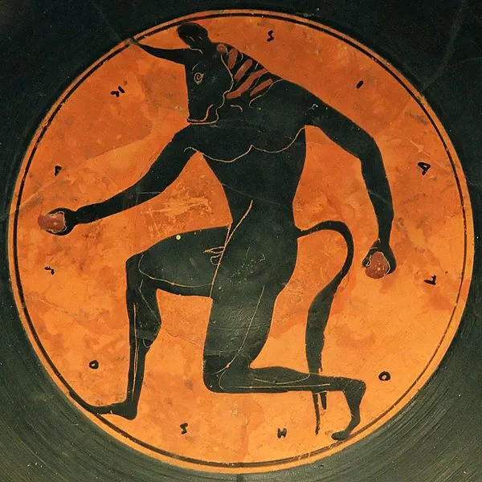
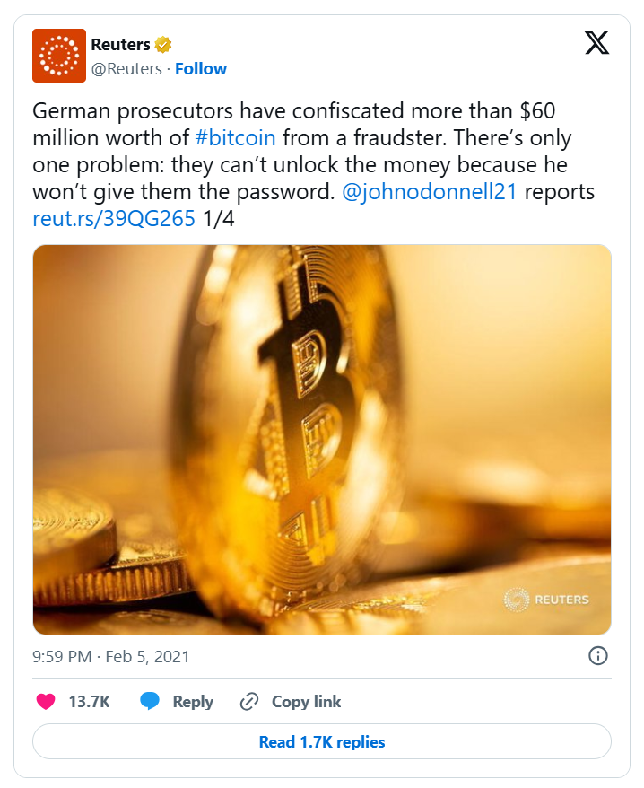
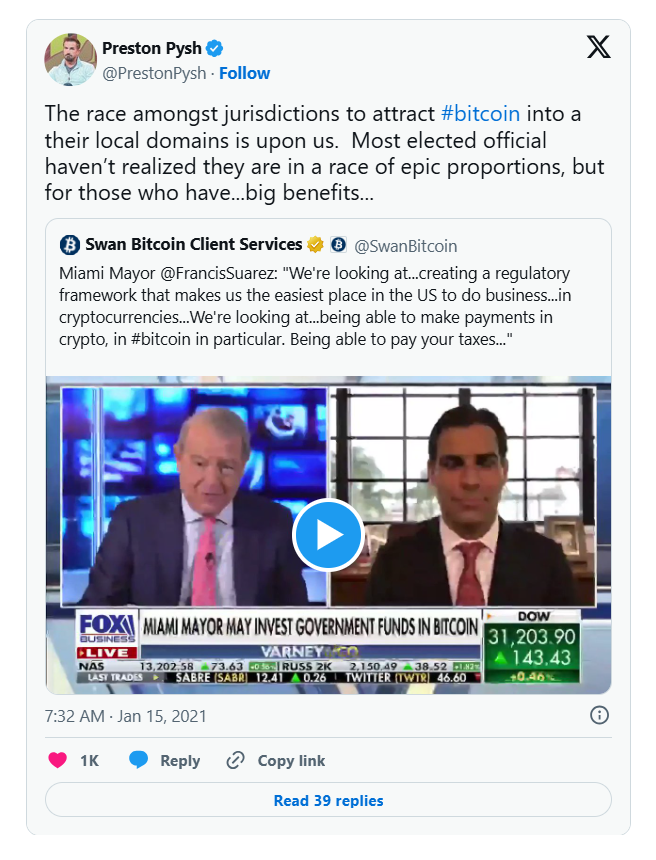
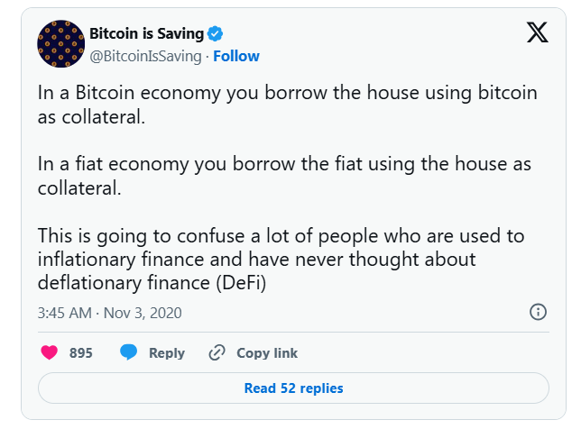
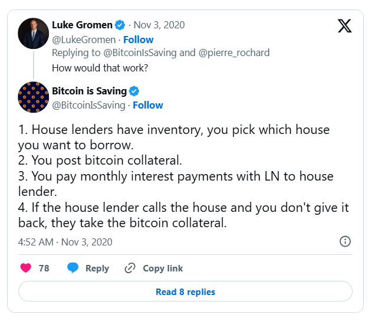
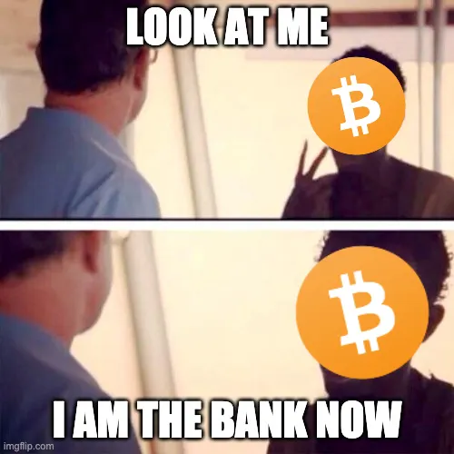
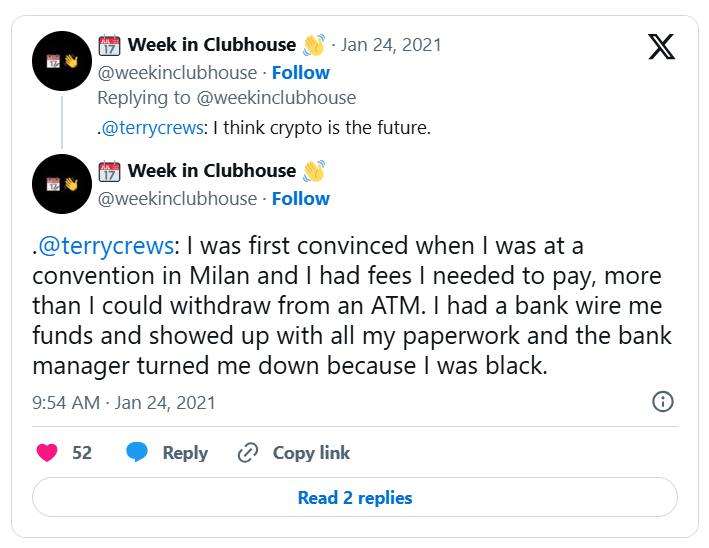
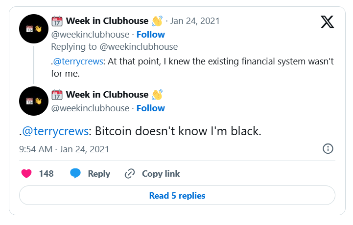

> *作者：Allen Farrington*
>
> *来源：<https://allenfarrington.medium.com/bitcoin-is-venice-8414dda42070>*
>
> *作者注：本文已被选入作为同名图书《比特币就是威尼斯》的一个独立章节。该书由 Allen Farrington 和 Sacha Meyers 合作撰写，亚马逊购书链接在[此处](https://www.amazon.com/Bitcoin-Venice-Essays-Future-Capitalism/dp/B09TTTGT11/)。*
>
> *原文出版于 2021 年。*

斯金纳（Quentin Skinner）对现代政治哲学萌芽的不朽概述《[现代政治思想的基础](https://www.amazon.com/Foundations-Modern-Political-Thought-Vol/dp/0521293375/)》开篇是这样几句话：

> *“早在 12 世纪中期，德语历史学家弗莱辛的奥托（Otto of Freising）便注意到，意大利北部出现了一种新的、引人注目的社会形式和政治组织。他指出的一个特点是，意大利社会显然已不再具有封建（feudal）特征。”*

虽然斯金纳关注的是政治哲学，不是经济史，他还是能轻松分辨出，这种社会变革是因为资本主义的萌芽而成为可能的。正如伟大的中世纪专家皮雷纳（Henri Pirenne）在其著作《[中世纪城市](https://www.amazon.com/Medieval-Cities-Origins-Princeton-Classics/dp/0691162395/)》中对这个时期的这个地区的评论：

> *“伦巴底（Lombardy）大区，东至威尼斯（Venice）、西至比萨（Pisa）和热那亚（Genoa），地中海（Mediterranean）的所有商业活动畅通无阻并融为一体，欣欣向荣、极为繁华。在美丽的平原上，城市蓬勃发展，如同丰收。肥沃的土壤让无限的扩张成为可能，与此同时，能够轻松获得市场，让原材料的进口和制成品的出口都一起繁荣起来。在那里，商业催生了工业，并且，随着工业的发展，贝加莫（Bergamo）、克雷莫纳（Cremona）、洛迪（Lodi）、维罗纳（Verona），所有的古老城镇、古罗马城市，全都焕发新生，还远比古典时代有活力得多。”*

皮雷纳还补充说，建立在商业和工业扩张的基础上，这些城市的兴起：

> *“有力地促进了社会进步。而且，它还促进了一种新的‘劳动’概念的传播。以往，劳动意味着你是农奴；现在，劳动意味着你是自由人；这个事实的后果，是无可估量的（我们后面还会谈到）。最后，我还要多说一句，在 12 世纪展现出繁荣景象的经济复苏，反映出了资本的力量；而且，可能已经足以表明，它对人类的影响超过其它任何一个时期。”*

你可能不会知道，但是，封建主义似乎正在卷土重来。Joel Kotkin 在自己的精辟的论文《[新封建主义的到来](https://www.amazon.com/Coming-Neo-Feudalism-Warning-Global-Middle/dp/1641770945/)》中预见了这种复活：

> *“当然，这一次（的封建主义）看起来会有所不同：不会出现穿着闪亮盔甲的骑士、臣民们向领主致敬、一个有权的天主教廷强迫认同正统思想。我们即将看到的是一种新的贵族制 —— 在这个后工业经济时代，随着财富越加集中在少数人手中 —— 出现在美国以及其他地区。社会分层越来越固化，对于绝大部分人来说，向上流动的机会越来越少。一个思想领袖和意见制造者阶层，我称为 ‘clerisy’，为这种即将出现的层级制提供智识支持。随着向上流动的途径逐渐消失，自由资本主义模式也在全球范围内逐渐失去吸引力，取而代之的是新的学说，包括那些支持一种新封建主义的学说。”*

这些苦难，不能说全部、但一定有 *一些* ，可以可靠地归因于我在本系列文章的第二篇《[资本的露天矿山](https://allenfarrington.medium.com/the-capital-strip-mine-ec627e9fe40a)》里介绍的情况：为了追求更高杠杆率的 “增长”，将资本的露天开采常态化。不拥有硬资产（hard assets）的人会在债务里越陷越深、实际上永远无法摆脱；如果不靠投机，就无法形成积蓄；无法负担生活刚需成本的不断膨胀 —— 而官方甚至不会承认有通胀哩。“官方” 消息的内容是 Christine Lagarde（时任国际货币基金组织（IMF）主席，现在是欧洲中央银行（ECB）主席）之流的自言自语：“ *比起储蓄得到了保护，还能有一份工作会更让人开心* ”；而世界经济论坛（WEF）预测，到了 2030 年，“ *你将什么都不拥有，但也无所谓，还是开心的* ”。提醒你，你将 *使用* 一些 *某人拥有* 的东西，但这个某人不会是你自己。

如果我们相信这些人是心口如一的，那么资本露天开采就不会停止 —— 实际上，是 *不能停止* —— 我们可能要像 弗莱辛的奥托 那样，寻找一切文明的萌芽，以期超越这个又重新生根的封建制。我们最终找到的可能是一些团体避免这种状态（封建制）的不同理由。我认为，对一些人来说，这个理由就是比特币。

什么意思呢？我敢肯定，对大部分人来说，如果这个理由即使不算可笑，也起码是夸张的，但实际上，这再平常不过了。它仅仅意味着，一些社会单元，会自愿清算掉循环错误定价的有毒贷款（self-referentially mispriced toxic loans），走向一种全球化、电子化、健全的、开源的、可编程的货币；并且，这些人将比不这样做的人以快得多的速度积累长期导向的资本。他们会获得一种更优越的基础，从而建立健康的社会和政治机构，与停滞不前的社会形成鲜明对比 —— 就像中世纪的威尼斯对比西罗马帝国的残余一样。从个人、家庭、朋友、邻居，到公司、城市、行业、国家，乃至整个世界，不论在什么层面，这种速度差都成立。我们只需拭目以待。

当然，可能没人会这么做，比特币可能会完全失败 …… 我这样说，主要是为了避免有人指责我迷信、投机狂热、一点也不严肃。但我 *不是* 为了用事后无法证伪的墙头草表述来假装博学。如果这还不够清楚的话，我很高兴能够公开声明：比特币极有可能会成功。而且，虽然一些重要理由可能会让它失败，“ *它太笨了* ”、“ *我不喜欢它* ”可不在其中。想要清楚地说明它可能失败的理由，你先要理解它。但大部分人并没有理解它。如我在本系列第一篇文章《[维特根斯坦的货币](https://allenfarrington.medium.com/wittgensteins-money-7cac8d0635cf)》中说的那样，大部分人甚至不知道自己在看什么东西。他们也不太可能很快看清楚，因为他们不想看到它。科学哲学家汉森（Norwood Russell Hanson）[可能会说](https://www.amazon.com/Patterns-Discovery-Inquiry-Conceptual-Foundations/dp/0521092612/)，他们的看法 *戴着理论滤镜*。此外，他们的理论还是错的。哈。

所以，有感于这种丰富多彩的气愤，比如 “ [*它是一个庞氏骗局！*](https://unchained-capital.com/blog/bitcoin-is-not-a-pyramid-scheme/)”、“ [*它浪费能源！*](https://unchained-capital.com/blog/bitcoin-does-not-waste-energy/) ”，以及“ [*它背后什么都没有！*](https://unchained-capital.com/blog/bitcoin-is-not-backed-by-nothing/)”，我会用我自己的色彩鲜明的离谱隐喻来完成这三部曲、尝试帮助人们理解 *正在发生的是什么事情* ，以及，为什么这些东西正好就像它们应该是的样子。

太离谱了，离谱到只有可能是真的 ……

## 比特币是阿里阿德涅

> *任何积累了大量的财富、又独立于 军事-政治 控制机构的人都会遭遇一个问题：如何保护他已经获得的财产。一个商人，如果他的货物触手可得，除了指望得到某些实权人物的保护之外，没有任何办法能阻止本地的权贵随时夺取他的财产。要获得实质性的保护，曾经是非常昂贵的 —— 贵到足以扼杀私人资本的大规模积累。*
>
> *—— 麦克尼尔（William McNeill）*

比特币常常被说成是在跟法币 “竞争”。在一定程度上，可以说确实如此；但我担心，这里有一种修辞上的危险 —— 它会误导你对这种 “竞争” 的理解。比如说，比特币与法币的竞争不是 *打架*，也不是冲突。比特币并不尝试摧毁它的对手，因为它并不 *尝试* 做任何事情，也不知道自己有什么对手。它对于谁会反对它、为什么要反对它，根本无知无觉。它只是一种替代选择、一个通气阀门、一个可选的退出路径。之所以构成竞争，只是因为它正显现出是一种远为优越的替代方案。它不是忒修斯（Theseus）用来对抗米诺陶洛斯（Minotaur，牛头怪）的宝剑，仅仅是一条可以走出迷宫的线索。比特币是阿里阿德涅（Ariadne）（译者注：在古希腊神话中，阿里阿德涅在给了忒修斯一个线团，使其能在进入米诺陶洛斯的迷宫之后原路退出）。

在日益增加的反对声音歇斯底里地诋毁比特币是天生邪恶（甚至是阴谋）的环境中，仅仅将上述修辞正常化，就有不可顾虑的价值。反对者们将不得不解释，（按照他们的想法）人们自由地互动有什么不对、为什么真正的善良只能来自强制。那些找出了一种办法来逃脱资本露天开采这窒息迷宫的人，难道不该采用它吗？他们欠那牛头怪什么了？

如果真的理解他们所面临的选择，谁会真的认为，人们应该用循环错误定价的有毒贷款来储蓄、而不是采用一种可以证明健全的电子不记名资产呢？或者，更简单地说，他们会觉得，持有一种纯粹是资产的货币，比持有一种明明白白 *定义是* 一种债权的货币，更没有意义吗？为什么不选择一种建立在免信任的可验证性上的金融系统，而要选择一个建立在不可验证的信任之上的系统呢？

是因为暴力威胁吗？毕竟，“罚没” 妥善保管的比特币的唯一办法，就是[严刑拷打](https://xkcd.com/538/)。在《[追逐权力](https://www.amazon.com/Pursuit-Power-Technology-Society-D/dp/0226561585/)》一书中，历史学家麦克尼尔解释说，在现代欧洲的早期，工业化、标准化武器和军事训练的努力产生了这样一种效果，“ *每一块钱税收所能产生的有组织暴力的规模和可控性都急剧上升* ”。不过，似乎可以合理认为，这样的回报率在近期可能出现了类似的急剧 *下降* ，就如德国的检察官们和路透社（Reuters）最发现的那样：

- “德国检察官们查封了价值超过 6 亿美元的比特币。唯一的问题在于：他们并不能解锁这些钱，因为他不给他们口令。johnodonnell21 报道。<a href="https://x.com/Reuters/status/1357690223187161088">路透社</a>” -

- 也可能他们没有意识到，只是发了这么一条推特。谁知道呢…… -

任何一种以真正敌意态度对待比特币的政策都值得仔细研究，因为它一定会出现。麦克尼尔提醒我们，哪怕是在 700 多年以前，“ *打破既有的行为模式，对于见证这一切的大多数人来说，都是令人遗憾的事* ”。我对这个问题并不抱有乌托邦式的看法 —— 相反，同意反乌托邦式的偏执并非一无是处，可以说是智力上的成人礼。比特币会被禁止的，会被禁止许多次、会在许多地方。但一个禁令就是对比特币的实用性和其自身道德错误的一次公开承认，可以说是最好的广告。禁令就是柏林墙（Berlin Walle）；禁令的任何碎片，总有一天会成为愚蠢和残酷镇压的见证物。比特币不会强迫任何人跟它站在一起。人们是自己来的，自己愿意站在那里的，因为他们就是想要这样 —— 因为比特币不管在实用上，还是道德上，都更加优越。

就像东柏林与西柏林的例子所表明的，重视和鼓励自愿互动与否的根本差异，会在社会层面显示出它的涟漪，也是值得探究的话题。使得，比特币也有不同的机制 —— 我后面会详细说 —— 但从这些机制中，会产生不同的行为；从这些行为，可以产生不同的文化；这些文化，又 …… 谁知道呢？

我不敢说我都知道，但我可以提供一些想法。首先，我们完全没有准备好面对让绝大部分财富和许多资本 *完全* 流动的社会影响。自从专业投资人 Marc Andreessen 提出 “ [*软件已经吞噬了整个世界*](https://a16z.com/2011/08/20/why-software-is-eating-the-world/) ” 的著名说法以来，我们已经往这个方向走了数十年。正如我在[这篇文章](https://allenfarrington.medium.com/its-time-to-reflect-21673608f5a1)中说的，Andressen 的文章可能仍是本世纪最重要的金融专著，而许多金融行业的人还没有读过它，还有许多人以为他说的不是金融而是技术。如果 “技术” 意味着 “软件”、“软件” 意味着 “一切”、而 “一切” 等同于 “金融”，那你就可以说，这文章只跟 “技术” 有关。所以，你也是对的，但至少有三个地方犯了错（也许还不止哦）。

我所偏爱的对 Andreessen 的论证的哲学抽象是这样的：软件是生产性资本，而它的原材料是连贯的人类思想。它将独立的 熟练劳工-企业家 重新确立为一个经济参与者阶层，他们创建资本的能力来自人力，而非金融。自从工业革命将威尼斯式的资本主义蓝图切换成更加复杂的后继阶段、依赖于围绕不可移动的资本来组织和指挥劳工以来，这个阶层在经济景观中可以说已经小得不能再小了。这些参与者对金融资本家有巨大的议价能力，当前，他们常常通过要求公司股权来议价。但是注意，在现有的金融系统中，股权是在为资本创造铺路。这种议价能力永远只是前瞻性的 —— 这些工作者可以不断讨价还价、赚得他们还未创造出来的流动财富。

但比特币切断了这最后的联系。从理论上来说，许多资本现在都是流动的：它们不再需要停泊在某一个金融系统中。说 “一切” 不一定指 “金融”，但确实可以意味着 “一切”，尤其是紧闭（lockdown，可能指伴随新冠病毒 COVID-19 流行而来的旅行管制）的噩梦带来了一线曙光，让知识工作的工作者可以待在任何地方，而不是少数几个不适宜居住的大城市。让 Kotkin 感到遗憾的是：

> *“大城市已经很大程度上成了吸引已经富裕的人的磁体，而不是向上流动性的基础。更少的工薪阶层和中产阶层家庭可以负担得起迁徙到巴黎、伦敦、东京、纽约、旧金山这样的地方。许多以前的居民，比如芝加哥的黑人中产阶层，已经离开、到别的地方生活。许多依然在这些城市工作的人，被迫忍受很长的通勤时间。随着中产阶层的减少，留下的是城市边缘人口，他们的生活依赖于城市，但常常只能勉强度日。”*

但可能不会再这样下去了。当然，无论这些高技能的、新得流动能力得 资本-劳工 在哪里重新汇聚，所有其它形式得工作也会变得可行 —— 这不需要肤浅地理解成一种精英主义的猜测，而应该看成是[终于迈向可行的地方主义的蹒跚步伐](https://bitcoinurbanism.substack.com/)。

当然，实体资本依然重要。文化资本也是。专门指出反而显得奇怪。但那些处在能够从实体资本中收取保护性税收的人（可能还带着文化资本的诱惑），将需要适应这种新的现实。大棒不管用了，要有胡萝卜才行。你想怎么做？建一堵墙？那祝你好运。

- “司法辖区将比特币吸引到本地的竞赛就在我们面前。大部分胜选的官员都还没有意识到他们处在一个如此大规模的竞赛中，但已经意识到的人 …… 优势多多 ……” -

在这篇令人赞叹的随笔《[有组织暴力的经济后果](https://www.jstor.org/stable/2114533?seq=1)》中，历史学家洛纳（Frederic Lane）强调，在一个资本流动性比我们今日更强的时代，在使用和控制暴力上的主权间竞争的重要性：

> *“如果所有贡品都被用于 ‘炫耀性消费’—— 这个词似乎特别适合旧制度（ancièn regime）下一个王子的排场 —— 增长就会因为缺乏投资而放慢。从国际贸易和殖民地中获得保护费的商人，虽然不是完全不浪费，但消费倾向可能较低。若是如此，则政府的较低利润与贸易企业的较高利润意味着更多的资本积累和更多增长。”*

类似地，麦克尼尔也观察到，威尼斯人和热那亚人在地中海的私人商业活动在 11 世纪的涨潮中，

> *“老式命令社会的规则根本无法再像以往时代那样彻底地约束行为。街头小贩和商人，让自己对统治者和臣民都有用；并且，通过在商队道路和海路沿途的一个又一个港口寻求庇护，他们得以可以保护自己免遭税收和抢劫 —— 这些地方的统治者已经学会了不要对自己的收入和权力赖以存在的商业过度征税。”*

我们很有可能会回到这样一种动态中，而互联网的荒野会成为公海的精神继承者。

但在这样的社会中，金融会是什么样子？显然，从上文的描述看，金融 *不会消失* 。它只是会改变 —— 那么会变成什么样？我认为，有两条有用的答案。第一条是 *可以编程* ，它的本性就是不可预测，我们只知道它拥有潜力。类比成早期的互联网是陈词滥调，但确实有充分的理由。有了开放的准入和一个可以编程的界面，谁知道会发明出什么懂？谁知道创新迭代和组合的速度会有多么快？第二条是 *伊斯兰教*。

## 比特币是清真的

- 图片来自 <a href="https://unsplash.com/@bmefaraz">Abdullah Faraz</a> ，Unsplash 平台 -

> *“个人可以因为在自己家里 ‘制造’ 货币而被逮捕；商业银行系统在做完全一样的事情时却拥有完全的法律保护。这里面没有公正 …… 有人说我们必须发展出一种伊斯兰金融来替代现代商业银行。但是我们必须这样做？烟草行业的伊斯兰替代就是没有烟草行业，而且，如果我们坚持原则，可能就会意识到，商业银行的伊斯兰替代就是没有商业银行。”*
>
> *——Tarek El Diwany*

比特币可以说与伊斯兰金融的教训一致，这是我在跟 Saifedean Ammous 聊天时得出的洞见。简单来说，我们的意思是这样的：比特币是一种电子化的不记名资产，不是一种债务工具，它在安全保管时的自然状态就是处在金融机构之外。而且，因为无法在政治上方便的时候就铸造新的比特币，存款保险是无法实现的，所以贷款机构需要预先投入流动资本。因此，未来的中介机构将无法保证投资人免受因为债务人的活动而引起的损失。

而且，相对来说，资本的提供者将更不愿意接受有限的收益和无限的风险，尤其是考虑到那时候通货紧缩几乎是确定的，不像现在一样，不得不通过低波动的资本升值来追平通货膨胀。未来的储户（大部分时候）将要么单方面储蓄，要么要求分享股权的升值空间。供给将收缩，对金融杠杆的大规模需求将付出更高的价格才能留在剩余的市场中。

人际间的、非程序化的金融以外的部分，可能会跟伊斯兰金融禁令非常相似，债务的角色大大变弱，更多关注 *风险分摊* 而非 *风险转移*。比特币是清真的。

说清楚一些，得出这一结果的推理是非常特别的。在伊斯兰教中，货币债务的利息（riba， الربا）是违反道德的（haram，حرام）；而我认为，在比特币本位中，即使纯粹出于经济原因，债务利息也不太可能大规模存在，因为风险（最终！）会被妥当地定价，因此更多是合法地分享，而不是被不诚实地转嫁。虽然如此，（伊斯兰金融）最终的行为跟比特币社区中的文化规范有显然的道德相似性，首要的是 “低时间偏好”。伊斯兰学者 Abul Alā Mawdūdī（ابو الاعلی مودودی）[劝告](https://www.amazon.com/Principles-Islamic-Economics-Sayyid-Mawdudi/dp/0860374920/)称：

> *“穆斯林社区中的每个人都有责任量入为出。他不得让自己的支出超过自己的收入、然后迫使自己向他人伸手来维持自己的奢侈、使用不公平的工具来攫取其他人的财富、或是对他人负债以资助自己无止境的欲望，然后，为了清偿债务而消耗自己的资源、最终加入贫困者的行列。”*

即使我们不管底层的道德反对，更高层面上的态度的相似性也会迅速浮现。比如说，我们可能会认为，即使在比特币本位中，也依然会 *有人* 愿意供给和需求有息的风险资本；那么，为什么要阻止这种自愿的交换呢？伊斯兰教的反应基于 *haram* 特征（被认为是 “投机”）；给定创业内在的不确定性，为货币债务金融支付利息的承诺不可避免就是欺诈，因为债务人不知道也 *无法* 知道自己能不能完成义务。只有 *同等权利（pari passu）* 的股权是公平和诚实的；不仅如此，在资本供应者之间也不能引入不和谐的激励和愿景。又一次，我们会在对这些合约的道德性质的理解上出现分歧，但 Mawdūdī 对这种 “投机” 的泛滥的后果的预测，有明显的吸引力：

> *“因为资本家（放贷者）与企业家（贷款人）之间的参与式合作缺乏合理和健康的关系，全球经济会承受极大的痛苦，并且高点和低点不断交替，它们会对世界经济的健康产生不利的影响。资本家的扼喉鼓动了投机和通过利息铸造货币的精神。这自然会毒害资本与企业的双边关系，现在利息的高涨和低落让整个世界的经济健康始终处在风险之中。”*

只要将 “所有债务” 替换为 “作为债务的货币” 并相应地追踪后果，比特币人可能会完全同意上面的段落。经济学家和著名的伊斯兰金融学者 Mohammad Siddiqi 在《[对未来伊斯兰经济的愿景](http://siddiqi.com/mns/AVisionForTheFutureOfIslamicEconomics.htm)》中将两者直接联系起来，他指出，*“几乎所有流通中的货币都是负担利息的债务，让财富从资金的使用者转移给资本的拥有者。这在技术上，也就是对社会的支付工具的正常运转来说，并不是必要的。”* 在《利息的问题》中，Tarek El Diwany 提出了一个跟我在《[资本露天开采](https://allenfarrington.medium.com/the-capital-strip-mine-ec627e9fe40a)》中提出的惊人相似的观点，而且更让人惊讶的是来自完全不同的角度：*“被污染的河流、腐烂的垃圾堆和资源耗尽的大海，可能只是为参与这场复利竞赛而要支付的第一份代价。”*

不管你信不信，国际货币基金组织似乎在一定程度上也同意这个观点。在 2010 年一份名为 “全球危机对伊斯兰和传统银行的影响：比较研究” 的[工作论文](https://www.imf.org/external/pubs/ft/wp/2010/wp10201.pdf)中，Maher Hasan 和 Jemma Dridi 得出结论：伊斯兰银行的运作模式是基于资产的，而不是基于债务的，*“这使他们的活动跟实体经济关联更加密切，而且倾向于减少催生泡沫。”* 这篇论文也包含了一本正经（却引发了搞笑效果）的解释：

> *“投资性存款的 利润/损失 共担特性，给伊斯兰银行提供了额外的缓冲。不过，这种特性在这次危机中并没有受到考验，因为绝大部分银行仍然是盈利的。此外，在此次危机和大部分国家货币宽松的大背景下，这种特点可能会使伊斯兰银行的盈利能力处于劣势（相比于传统银行）。”*

（在伊斯兰金融中）最接近于我们所知的 “loans（贷款）” 的东西是 “qard al-hasan（(قرض الحسن）”（一种没有利息、仁慈的贷款）和 “sukuk（صكوك）”（一种汇成池子、定期的股权投资）；奇怪的是，后者更像威尼斯的 “ colleganza ” ，而不是现代的场景金融工具。不论哪一种，都很少使用担保品；但在有担保的情况下，最终还有一个非常有趣的区别：担保品必须在期限中转移给债权人占有，因此，在违约的情况下，不会发生收回担保品的情形。跟伊斯兰金融中的所有东西一样，最终的理由总是公平和公正；那些在房屋按揭贷款中违约的人不会被赶出自己的房子 —— 因为房子早已由债权人占有和使用了，担保品从一开始就不能是 *清真的* 。这跟比特币的关联是，在一个健康的通缩环境中，可能会有激励让人们不要拿可以长期储存价值的硬资产来当作担保品，同时，有一种不断增长的背景激励、金融交易中的各方都想要获取和保留健全货币：

- “在一个比特币经济体中，你使用比特币作为担保品来借住房子；在法币经济中，你使用房子作为担保品来借入法币。已经习惯于通胀金融、从来没想过通缩金融（DeFi）的许多人，还会继续困惑。” -

- “这是怎么做到的呢？”“1. 房东获得存货，你得到自己要借住的房屋；2. 你提供比特币担保品；3. 每个月通过闪电网络给房东支付利息；4. 如果你的房东索求房屋，而你不归还，房东就拿走你的比特币担保。” -

你不需要认同伊斯兰金融的所有教条（也不必认同专门的哪一条），也能欣赏到，在认为它与比特币联系微弱的公认观点之外，尚有更加宽宏的观点。伊斯兰经济学和金融的研究引人入胜，因为（在我看来）它是我们称为 “西方” 的金融教义 —— 尽管它现在已经近乎是全球化的、无处不在 —— 的唯一一种系统化的、当代的、*成功的* 替代品。注意，举个例子，IMF 将 “伊斯兰银行” 与 “传统银行” 相对（而我在上文中将 “成功的” 标为斜体，以正确地区分和对比伊斯兰经济学与社会主义；关于这一点，读者可能有兴趣知道，Mawdūdī 的《人类的经济问题与伊斯兰解决方案》提供了我所读过的最简洁有效的反驳，在两页的论战中调和了米塞斯（Mises）和哈维尔（Havel））。

比特币所带来的概念性挑战的一个常见困难是，“西方” 金融教义的无处不在，使得人们很难完全站在它的主流框架之外严肃地思考。西方金融是 *水* 。但远景是 *可以* 实现的，教义也是 *可以* 挑战的。Mawdūdī、Siddiqi 和 El Diwany 挑战了它们、中本聪也挑战了它们、读者自己也可以挑战它们。将道德放在可以感知到的效率之上，本身就是一个深刻的出发点。

## 比特币是重力

- 图片来自 <a href="https://pixabay.com/users/wikiimages-1897/">Wikilmages</a>，Pixabay -

> *“借给政府的一定数量的金钱，以及由此可以收取的一定数量的利息，被假设是无风险的，因为这反过来是在假设政府可以征税、借款、乃至印出更多的金钱来偿还债务。这三种手段，对一个现代政府来说都是可用的，但我们不应该忽略这样一个事实：在把借来的钱投资出去时，政府无法获得无风险的回报。上面提到的选项，不过意味着把这些账单转移给其他人，直到物理世界无法免除风险这一事实重新显现出来。”*
>
> —— *Tarek El Diwany*

到目前为止，很难概念化到底是什么价值平静地退出了法币世界、进入了比特币世界。定价只发生在边际上，而跟比特币相交换的边际法币只是一种银行（自己重新贴上标签的）负债。如前面所讨论的，在边际上交换的比特币可能会引起更低的时间偏好，从而减少垃圾的消费，但可以想象这只是一种假想。

当人们不仅卖出自己的法币、自己的时间，还开始卖出真实资产时，事情就会发生变化。黄金可能是第一个受害者，原因很容易理解，因为（相比黄金）比特币在各方面都有所升级。但黄金并不具有系统层面的重要性。这个转变会引人注目，但不会产生别的影响。当积累的动力触及短期贷款、房地产和被动股权时，派对才会真正开始。

这三种才是人为制造的资产大类，因为它们在法律上（de jure）是生产性的，也就是可以产生现金，因此可以用未来收益来定价，然而，事实上（de facto）它们只是投机性的储蓄工具，因为用法币来长期储蓄是不可能的。但更重要的是，它们 *具有* 系统层面的重要性。它们的价格，总的来说，会影响资本的形成。本系列第二篇《[资本露天开采](https://allenfarrington.medium.com/the-capital-strip-mine-ec627e9fe40a)》的摘要就说，这些价格是错误的，因此资本也在形成的过程中被尽快地挖走。逆转这一切是我们的长期希望所在，但预测这种逆转的短期机制则完全是另一回事。

关键的洞见在于，如果这些资产 *真的* 是用收益来定价的，那么我估计，这种类型的流动（译者注：应指资金从这些资产撤出、流向比特币）对长期持有者毫无影响，只是会让他们微微有些失望。但正因为它们不是，所以，任何持续的流出都很容易成为一种自我实现的预言。企业们使用短期信贷作为现金代用品，以对冲通胀，只是如今收益微乎其微。但是，它不是一种 “投资”。它没有升值空间，只是拥有足够的贬值保护。如果这种贬值保护消失了，那么整个命题就蒸发了 —— 而且注意，这很容易发生，都不需要持续卖出，而只需要在疏忽之下停止买入，因为短期信贷的生命正在于要不断轮替（展期）。接下来可能会发生的是，中央银行下场，通过资产购买来 “支持” 这些市场 —— 当然是可以想象到的对比特币效用的最好背书。

在这一切的背后，似乎有一个非常直接的问题，就是比特币的 “公允价值”。在还完全不确定如何比较比特币的价格与其 “基本面” 的时候，人们就是会犹豫不决、不敢把储蓄从众所周知、自然定价的产品（比如短期信贷）转移到比特币上。人们会逐渐察觉的是，在比特币上，传统的关系被逆转了。我并不认为，说 “比特币的价格 *就是* 它的基本面” 是非常准确的，但显然，它的价格，很大程度上是它的基本面的反身函数（reflexive function）：随着价格上涨，基本面也上行（而我们也必须记得，随着价格下跌，其基本面也下行。推动价格长时间下跌的持续攻击是目前的最大风险）。比特币[在最小的时候是最弱的](https://satoshi.nakamotoinstitute.org/posts/bitcointalk/523/)，但随着时间推移就会越来越强。比特币是一个黑洞，持续吸收着其事件视界（event horizon）之外的不可持续的人造价值。它越长大，引力也就越大。比特币就是重力。

关于它的引力，“价值储存物” 论点是目前最明显的，也是最没有创意的，因为它只触及了比特币持续演化可能性的表面。想想看流动性加深的影响。注意，流动性与 “价格” 本身有微妙的不同。它是不断增加的大规模购买的前提。“MicroStrategy” 公司在一年以前是无法操作的。“苹果（Apple）” 公司和 “伯克希尔（Berkshire）”（我连这都敢预测？）也无法启动购买（虽然他们可能有一天会买）。

但市场深化还有更有趣的影响。比如说，它让 “Strike” 得以出现 —— 快速被复制、快速打败外汇市场：

[视频链接：比特币正在打败支付清算所](https://youtu.be/iSvMVWS9yoA)

Strike 结合了法币流动性池的不断收紧的价差，与闪电网络的即时结算功能和相对可编程性，提供了无法比拟的外汇转账。这里有几项令人惊讶的特性，绝对值得我们去理解。

首先，法币结算基础设施是无法赶上这种服务的。我不是说这很难做到，我是说这根本不可能。同一司法辖区内、同一种通货之间的跨银行支付，或多或少可以做到免费和即时，而且在很多地区也确实做到了，因为所有这些转账金额都会被重新标记为一笔银行债务，或者，在最糟糕的情况下，互为交易对手的银行之间的净资金流动，都可以打包成大规模并妥善结算，从而给终端用户提供较低的成本（甚至零成本）。但是，货币不同、司法辖区不同，甚至两者兼有时，这就不可能了 —— 根本上，*因为* 法币是一种债务工具。在这一语境下，我们认为是简单的 “支付” 的东西，更像是信贷的转发。转发链条上每一个参与者都需要相信下一个参与者，并且，在转发之前，还要确定价格（不仅包括运营开销，还包括这种可以感知到的风险），因为实际的请求权（claim）要在很久、很久之后才能得到结算。那如果是支付 *流* 呢？天方夜谭。最狂野的梦里都没有这种东西。而在 Strike 中，这些都不相关。闪电网络没有支付数额下限，而且立即结算，事情就结束了。

而且，这种服务 *完全* 不会让用户暴露在比特币价格的风险中。虽然，它存在并且深化了市场的事实，直接为比特币的基本面作了贡献，因此比特币的价格会上涨。如果这个系统的重度用户们有一天发现，他们更想要让收到的转账保持健全、开源、可编程货币的形式，那么，整个过程就更加简单了 ……

还没结束呢。闪电网络基础设施还很年轻、很小，而且需要投入价值才能成长。想要让以比特币计价的资本运转起来，除了在竞争性的流动性和路由中寻找回报，还有更好的办法吗？随着比特币的法币价格上涨，参与扩大闪电网络的激励也会增加，而这又会提高 Strike 以及其它服务商在闪电网络中路由法币支付的效率，然后又会加深比特币的法币市场的深度。闪电网络的规模越大、流式支付的前景所带来的机会就越多、就能更好地为去中心化的基础设施提供资金 —— 比如说，激励运行 Tor 退出节点、“Sci-Hub” 这样的公司所寻找的存储和路由技术、游戏行业的可访问和可移植经济、非平台的内容变现以及无广告的内容驱动 app，还有字面意义上还没有人能想到的东西。所有这些都会增加闪电网络的功用，也就是增加比特币的功用。进入这个轨道的东西越多，这个轨道就越大。这是元宇宙的 “[杰文斯悖论](https://en.wikipedia.org/wiki/Jevons_paradox)”！

更深的市场也会间接让 “[基于比特币储备发放法币贷款](https://www.forbes.com/sites/billybambrough/2020/06/16/exclusive-borrowing-dollars-against-bitcoin-and-crypto-is-about-to-get-easier/)” 合法化。虽然名义上是为了允许合成机构杠杆，但这种服务的正常化也会降低人们卖出比特币的激励，与比特币在给定时间点被广泛接受为日常支付工具的程度成反比。将会有 Pierre Rochard 说的 “[投机攻击](https://nakamotoinstitute.org/mempool/speculative-attack/)”，甚至不需要人们有意识或者主动，只是明智的事情。只要矿工能够使用这项服务（发放贷款）来支付电费，哪怕只是一部分，边际供应也会消失。它也会让信用卡返点计划、工资分配以及（再说一遍）还没有人想象到的事更加可行。可能从名义上看，这微不足道，但更多是获得思想支持（而不是法币支持）。小规模的购买会带来大规模的购买。

[富有智慧的](https://www.citadel21.com/why-the-yuppie-elite-dismiss-bitcoin)、成熟的、读过常春藤盟校工商管理硕士、拿过 CFA（注册金融分析师）证书的读者，可能会把我这整段的推理和我对它的热情，比拟为 “GameStop 事件”，金融界的专属笑话 —— 傲慢自大的散户以为自己是在惩罚巨头，没想到只是将自己的积蓄挥霍在一个笑话上，而 “Citadel” 公司是最终的赢家（先说明，这不是我的解读，但却是常见解读。我的理解是，这些散户完全知道自己在干什么，而且他们可以证明这一点，只要你愿意 [*看一看*](https://www.reddit.com/r/wallstreetbets/comments/ip6jnv/the_real_greatest_short_burn_of_the_century/) ）。我鼓励这些读者们更加严肃地思考跟所有这些情形相关的博弈理论，尤其是如果先是黄金然后是短期 *国债* 落入比特币的轨道。

你可能会认为，这完全是不着边际，但是，委内瑞拉（Venezuela）、伊朗（Iran）、北朝鲜（North Korea）、新加坡（Singapore）的中央银行，都不会同意你，这仅仅是现在我们数得上来的名字。中央银行囤积将会成为接下来十年的决定性的宏观经济现象，而来自[技术专家的的囤积倡议](https://balajis.com/why-india-should-buy-bitcoin/)将成为决定性的政治现象之一。完全流动、无法发膜的资本，将被吸引到最欢迎它的地方，并与之产生化学反应，随它而来的人力资本也是如此。那些拥有地缘政治对手的国家，如果选择禁止比特币，就是自讨苦吃。如果有一天，中国开始给俄罗斯用比特币区块链上的美元稳定币支付天然气，然后 *用上比特币*，别说我没提醒你要多想一想。

仔细想象，甚至 GameStop 事件也正儿八经跟这个讨论有关。它表明，相当一部分的冒牌的民粹主义怨恨，是找错了对象；打击这些小人物的真正罪魁祸首不是 Citadel、“Sequoia”、美国证券交易委员会（SEC）、美联储（Fed）的幕后交易，而是[在对手方风险机制下股权清算的局限性](https://www.bloomberg.com/news/articles/2021-01-29/clearing-firms-prevent-cascading-failures-q-a-with-larry-tabb)。想象一下，哪怕只想一瞬间，跟一种安全的电子化不记名资产锚定的 token 化股权证书，没有对手方，*立即* 结算，你能够想象吗？Citadel 可能是短期的赢家，但长期的赢家，是侧链上的 token 化股权。

## 比特币即理性

- 照片来自 <a href="https://unsplash.com/@aaronburden">Aaron Burden</a>，Unsplash 平台 -

> *“想象一种语言就是想象一种生活形态。”*
>
> *—— 维特根斯坦（Ludwig Wittgenstein）*

“领英（LinkedIn）” 创始人 Reid Hoffman 竟然在 [Tim Ferris 的播客](https://tim.blog/2015/08/31/the-oracle-of-silicon-valley-reid-hoffman-plus-michael-mccullough/)上潦草地说比特币就像一种维特根斯坦语言游戏，不加任何说明！在我拿起指挥棒之前，我想引用维特根斯坦的《[哲学研究](https://www.amazon.com/Philosophical-Investigations-Ludwig-Wittgenstein/dp/1405159286/)》和那句格言，*“一个词语（word）的含义就是它在那种语言中的用法”*。换个词（word）来说（我这不是在玩梗哈），Hoffman 认为，只有将参与者们的行动解释为本质上由 TA 与其他人的交流组成，因此用一种成形的语法来表达他们的 *意思* 并依赖于这种语法来理解其他人的 *意思*，比特币才是可以理解的。

我认为，有必要再一次引用汉森，来理解一个实际的文盲局外人 —— 一个（诚然是讽刺的）货币语义理论的拥护者 —— 在面对这种语言游戏时候的处境。如果感知总是戴着理论滤镜，而如果我们的理论否认了一种新货币从零开始生长的可能性，并且这种货币的形式是一种我们并不懂得的语言，并且我们又不学习它因为我们认为它不可能存在 —— 那么我们 *必定* 不能够理解它。

比特币可以理解为一种语言游戏，这就解释了为什么它天生是和平的。货币是一种信息系统，记录和更新谁做了别人认为有价值的工作，这样，信用就可以普遍化、可以扩展到整个社会。 Frederic Lane 和 Reinhold Mueller 在《[中世纪及文艺复兴时代威尼斯的货币和银行](https://www.amazon.com/Money-Banking-Medieval-Renaissance-Venice/dp/1421436086/)》中指出，*“‘交易媒介’ 和 价值标准’ 两者都是模糊不清的，所以 ‘货币性’ 就只是一个程度问题”*，以及，*“在概念上和经验上，这两者都是可以相互分离的。”*

记录和更新是一个技术问题，而且候选的技术解决方案应该这样评估：不仅要看它们是否以及多大程度上适合 *充分模糊* 的定义，而且要看 *它们如何工作、效果好不好*。是石币（Rai stones）、金币、美元计价的银行账务；实体的或电子的、抽象的还是具象的、是债务还是纯粹的资产。比特币所提供的解决方案可以说是最纯粹的，因为它将这种信息捕获为 *言辞（speech）* —— 我们只需要使用软件来检查语法。

又如 [Ross Stevens 在 SaylorCon 大会](https://www.youtube.com/watch?v=B2I0FB2Wn50)上澄清的那样，Ammous 造出来词语 “跨越空间的适销性” 和 “跨越时间的适销性”，已经在辞典中牢牢站住。在把比特币理解为一种语言、把货币理解为一种信息系统的背景下，值得进一步品读。时间适销性的本质是健全性（soundness）；空间适销性的本质是便携性。在比特币出现以前，这两者无法兼得；经济的发展使得对货币的市场需求日渐变得纯粹是信息性的，因为商业变得非常复杂，钱币的空间移动已无法高效支持。但信息，从本质上来说，是不稀缺的，所以，为了保持信息论货币的稀缺性，也就是它的时间适销性，需要人们信任一个中心化的真相来源。

注意，这并不意味着 “法币”，更多是 “信托”，这个词来自拉丁文中的 “信任”：*fiducia* 。*相对* 谨慎的银行家持有 *相对* 稳健的钱币作为储备，也就是 “银行货币” —— 支付则完全由一家银行的账户的贷记和借记 来完成 —— 在 13 世纪的威尼斯，这是 *相对* 值得信赖的，而且事实上，也确实成为主导、蓬勃发展。[更不用说](https://www.jstor.org/stable/2112936?origin=JSTOR-pdf)，在热那亚、佛罗伦萨、巴塞罗那和布鲁日，还可以通过汇票的交易来互操作；所有这些在时间适销性上都稍微差一些，但也许地理适销性变得更强。不过，当然，比特币完全解决了两者的紧张关系。它是电子化的（也就是 *信息化的*），又是稀缺的。我们获得了电子邮件那样的便携性，同时，又无需信任，只需验证。

- 用梗图来表达这个历史和技术论点 -

一笔比特币交易就是一次全球演讲（global speech），表达的是这样一种意思：*“我，可被证明是货币供给量的这一部分 x 的主人，现在要把它转让给别人”*，并且，这种语言是每个人永远不会忘记，而且无法用来说话的。这就是为什么总有人尝试禁止比特币，但却几乎毫无疑问会失败。比特币是终极的地下出版物。比特币即理性（logos）。

这也是乐观主义的一个理由，因为社会普遍承诺要保护政治上不受欢迎的言论（speech）。我知道有人会说我天真，但我确信，未来 20 年里最重要的美国最高法院判决，将是裁定广播比特币交易的权利受到宪法第一修正案的保护。在此之前，虽然比特币的合法性依然悬而不决，我完全期待一位国会议员会援引国会特权、在参议院或者众议院中通过口述十六进制数字来“广播” 一笔交易。

接下来，可能是用推特发布这笔交易、把它写进公开的证词、印到旗帜上 —— 最后印到 T 恤和徽章上、以实物形式出现在抗议活动上。*不要为难我的比特币节点！* 要么让不计其数的数字、文字、颜色都成为非法的 —— 不管它们到底是什么意思 —— 要么，就得接受比特币正在生长。

## 比特币是工艺

- 图片来自 <a href="https://unsplash.com/@garett3">Garett Mizunaka</a>，Unsplash 平台 -

> *“威尼斯人不是思想家，他们是行动者。作为顶尖的经验主义者，他们不信任抽象的理论。”*
>
> *—— John Julius Norwich*

记录和更新转移价值的演讲活动，是一个技术问题，因此比特币是一种技术解决方案。它不是一种关于事物 *应该如何运作* 的观念；它是 *能够工作* 的真实事物。虽然这个观察可能显得草率，但其中的区别是非常重要的。

[Nic Carter 最近在 Frances Coppola 上也讲到了这一点](https://www.youtube.com/watch?v=hy8JhNgU8eI#t=18m13s)：为了从头做一个苹果派，你需要先创造出一个宇宙；他的意思是，如果你想要创建一种强大、快速结算且带有终局性的互联网支付系统，你需要先发明比特币。没有别的替代方案 *能够工作* 。非常清楚，比特币所解决的问题 *不仅是个学术问题* ，更是人类文明化的核心问题，*能够运行* 是更加重要的。比特币是工艺。

我认为，这就抓住了绝大部分新人在尝试理解比特币的细节时可能面临的最大障碍，因为，从表面上看，作为一种工程结构，比特币是完全不合理的。*矿工干的是**什么**？！？钱币**怎么**存储的？！？* 等等 —— 我们都有过这样的内心对话。即使是具有数学天赋、能够跟密码学原语玩耍的人，可能也会非常合理地认为，*比特币是完全荒谬的，这世界根本没问题* —— 如果他们不能理解更广大的背景的话。但对背景有了恰当的理解，我们就可以确定地说，*它荒谬得正好符合它的目标，因为这一切就是**有问题***。

然而，还有一类怀疑人士，自称欣赏比特币的一部分乃至大部分设计，但无法完全认同，因为有一些比特币似乎无法完全解决的（无甚所谓的）问题、或是在解决问题的方法上，有一些（微不足道的）问题。

（译者注：作为一个俗语，作者在这里的用词 “pet problem” 应该是熟悉英语的读者易于理解的，至少在这上下文中是如此，用中文来说，就是 “没什么大不了、不足挂齿的小毛病”。然而，如果你在搜索引擎里搜索，绝大部分置顶的 AI 搜索功能会将它理解为它的字面意思：“宠物的问题”，比如猫猫精神紧张；令人不禁莞尔又感叹，或许这个词很快将会因为 AI 占领人们的头脑而不复存在。）

Coppola 很可能就是其中一员。我会说 Peter Schiff 和 Mike Green 也是。他们都是有趣又严肃的人，看起来对比特币所触及的许多问题也有正确的态度，唯独不愿正视 *比特币本身*，令人难以理解。关于比特币，这些人都采取了这种那种迂腐的诡辩，看起来非常高深，实际上是最浮夸、最不严肃的立场，因为他们根本没有提供任何实用的东西。对待现实，他们并不客观，只把它当成他们希望它是的样子。他们的 “解决方案” 也是干净、圆滑、根本没有希望的。比特币客观地对待现实；比特币看起来丑，但它真的有用。

这种观点可能永远不会消失，哪怕早在 2011 年 5 月，Gwern 就在《[比特币大巧不工](https://www.gwern.net/Bitcoin-is-Worse-is-Better)》中全面驳斥了这中观点：

> *“为了实现去中心化，比特币作出的牺牲是极为丑陋的 —— 但却是非常实用的。对比特币的第一反应，哪怕来自友好的密码学家、电子货币爱好者，也几乎都是极为消极的、并且强调这种（可以感知到的）低效率和（相对于绝大部分密码学）较弱的安全保证。这些批评让 ‘完美成了进步的死敌’，并没有意识到比特币的潜力。然而，作为 ‘大巧不工’ 的一个案例，比特币的丑陋的低效率原型成功地创造了一种安全的去中心化的电子货币，它有无限长的时间可以等待成功，这已足以让它最终被采用、改进并成长为一种安全的全球电子货币。”*

秉持这种工程哲学，求知者就能免受种种[空洞的后见之明](https://alexdanco.com/2021/01/22/the-michael-scott-theory-of-social-class/)的干扰，比如 Nassim Taleb（塔勒布）关于 “[复杂系统](https://medium.com/opacity/bitcoin-1537e616a074)”、“[波动性](https://twitter.com/nntaleb/status/1360276917992230919)”、“[量纲转变](https://twitter.com/nntaleb/status/1274692670502383617?ref_src=twsrc^tfw)” 的胡言乱语，以及 Eric Weinstein [说的](https://www.youtube.com/watch?v=QCKCQNFsJUw)，*“我们需要抛弃区块链，使之成为一种局部强制执行的守恒定律，用计算节点系统来取代时间和空间”*。Eric，如果你想 *把比特币嵌入物理学的规范场论（gauge theory）*，那么请加油。我等着读你写的 BIP（比特币升级提议）。请 *身体力行* 。不要一边用分析语言（metalanguage）重复着[乔姆斯基式的句子](https://en.wikipedia.org/wiki/Colorless_green_ideas_sleep_furiously)，一边又指望别人会严肃对待它。一种去中心化的货币不是由没有颜色的绿色观念构造的。

## 比特币是威尼斯

> *“在整个文艺复兴时代晚期，共和主义的观念在许多话题中被讨论和赞美，其中，对独立和自治的传统价值观念的最持久的效忠，来自威尼斯。当意大利的其他地区屈服于贵族的统治的时候，威尼斯人从未放弃他们传统的自由。”*
>
> —— 斯金纳

我常常发现，对比特币的类比，如果不够透明，就不可避免有种种缺陷，最终带来困惑大于帮助。然而，威尼斯有一种神秘的吸引力，使我无法将它归为纯粹的幻想。作为一种通过拥抱贸易和资本形成而脱离封建制的社会和政治秩序，它当然具有启发性。但还不止于此。显然，比特币不是一个 *城市* ，但它是一个系统，一个符号；（作为这样的符号）它超越了自己的代码实例，就像威尼斯超越了自己的岛屿和泻湖。

有些比较既可爱，又容易。威尼斯非常、非常易守难攻，以至于进攻根本没有用。它的治理模式不透明到令人头昏，而且根源上（constitutianally）抵制癫狂（seizure）。如果癫狂还是成为一种现实的威胁，就会触发一种免疫反应，围绕危险形成创新。传说中，Bajamonte Tiepolo 的暴动被击退，并不是由于公社（Commune）的武装力量，而是一位老妇人从窗口丢出一块石头；这不就是原始的 *“用户激活的软分叉”* 吗？当然了，怎么就不是呢。当然，如何才能走出与货币贬值为首要特征的黑暗时代？看看皮雷纳的观察：

> *“如果我们承认（也不得不承认），13 世纪佛罗伦萨（Florence）的弗罗林（florins）和威尼斯的杜卡特（ducats）等金币的重新出现，是欧洲经济复兴的特征，那么反过来说也是正确的：8 世纪放弃金币，也是经济严重衰退的表现。”*

威尼斯的相对平均主义（relative egalitarianism）。John Julius Norwich 在《[威尼斯史](https://www.amazon.com/History-Venice-John-Julius-Norwich/dp/0679721975/)》中写道，威尼斯之所以声名远扬，*“是因为它的司法系统为富人和穷人、贵族和工匠、威尼斯人和外国人提供无偏私的保护；因为，在理论上完全如此，在现实中大部分情况下也确实如此：在法律面前，生活在圣马可（St Mark）旗帜下的每个人都是平等的。”* 皮雷纳指出，这种态度根植于商业的必要性，因此延伸到城市自己的管辖范围和内部事务之外：*“威尼斯人没有任何忌讳。他们的宗教是商人的宗教。只要生意有利可图，他们就不在乎穆斯林是基督徒的敌人。”* 类似地，比特币也与政治无关，或者，恰如其分是 “敌人也可用的货币”，但 Terry Crewes 的铭心刻骨的轶事尤为让我触动：

- “我认为密码货币就是未来。”“我是这样被说服的。当时我在米兰参加会议，需要支付许多费用，超出了可以从 ATM 机提取的数额。所以我让一家银行给我汇钱，也出示了所有的文书，但银行经理还是拒绝了我，因为我是一个黑人。” -

- “那一刻我知道了现在的金融系统不是为我准备的。”“而比特币可不会管我是不是黑人。” -

威尼斯常年蔑视教廷（Church）的宣言。而教廷正对应着 Kotkin 所说的现代 *clerisy*，他们是精英阶层的品味塑造者、正统思想的思想家；他们已经选择，并且毫无疑问会继续选择 —— 正如皮雷纳所总结的 —— *“轻蔑和敌视商业复兴，（认定）它从一开始就是一项耻辱和焦虑的源头”*。

但我认为，（比特币和威尼斯）最为显著的共性是，它们都将迥异的理念融合为金融的坚固基石。很少商业技术是在中世纪和文艺复兴时代的威尼斯发明的 —— 复式记账法可能是从热那亚借用而来的，最初由黎凡特（Levant）传入意大利；其中最有用的数字系统，众所周知，来自印度，由阿拉伯人通过波斯、黎凡特和马格里布（Maghreb）传入；其它大部分有助于商业管理的技术，可能都是由阿拉伯人和君士坦丁堡传入的；而当时材料工业的颈部主要来自中国。但威尼斯将所有这些熔冶于一炉；可以说，最晚在 15 世纪初，现代金融业的绝大部分元素，在威尼斯就已经出现了；自那以来，很少有什么是真正的 *发明* ，更多是进一步的组合、标准化、扩容以及现代化。在我看来，只有中央银行及其操作，既成为了现实，又是完全的创新。

当然，自那以来，科技、工业和社会都取得了巨大的进步，但我们仍然遵循着威尼斯的金融传统，却完全不明白其中的缘由。就连 “银行” 这个词（的金融学含义）也起源于威尼斯，源自里亚托桥（Rialto Bridge）旁边货币兑换人的 *banca*（“长凳”）。Lane 和 Mueller 指出：*“如今人们已经普遍同意，真正的银行业，并非由货币借贷或典当业务发展而来，而是从铸币的双向兑换发展而来。”* 现代银行业是技术早已解决的一个问题的遗留产物。

以下是 Lane 的《[威尼斯：海上共和国](https://www.amazon.com/Venice-Maritime-Republic-Frederic-Chapin/dp/080181460X/)》对 14 世纪威尼斯金融基础设施的解释；我认为，要理解 *今天* 信用卡网络和银行结算机制所扮演的角色，它（这段解释）是完美的坚实基础：

> *“威尼斯银行家的主要职责并非发放贷款，而是代表客户进行支付操作。即便一位商人的宝箱中藏有大量铸币，如果每次买东西都要取出这些铸币、确保每枚铸币都是真币并且状态良好，那既麻烦又危险。而且，他也不想每次卖东西时又重复一遍。他更愿意通过一位知名银行家的账簿上贷记（credit）一笔来收款。他可以用这笔贷记资金来支付下一次的购买。这些贷记资金不会（像今天一样）通过开具支票来转移，而是，付款人要亲自出现在里亚托桥旁教堂的门廊，去找那位坐在长凳上的银行家，而这位银行家则会将账簿摊开给他。付款人会口头指示银行家将款项转至收款人账户。银行家会按照指示在自己的账簿上进行记录，这是一份正式的公证记录，因此无需收据。通常会有四五位这样的银行家，在里亚托桥旁营地的摊位上营业。任何有头有脸的商人都会拥有一个银行账户，以便能够通过银行进行转账和收款。这些账户被称为 “banche di scritta” 或 “del giro”，因为它们的主要功能是记录转账，然后根据商人的指令将贷记资金从一个账户转到（girare）另一个账户。”*

如果我们加入汇票交易、信贷创造和浮动的国债，则这些都是 *账本* 所具有的功能的自然延伸 —— 当然，我们要减去一种在一开始就存入、随时可以提取的硬储备资产—— 除此之外，没有什么需要解释的了。请注意，这也预示了用于结算的比特币和用于支付的闪电网络 —— 它们的信任最小化、原生数字化、可编程和去中心化特性 —— 会极大地改进这种体系。比特币可能是一种魔法互联网货币，但更重要的是，它是 *为互联网而设计的* 货币。在 2009 年之前，你可以即时向世界任何地方的任何人发送任何信息 …… 除了最重要的信息：价值。现在，我们赶上来了。

常常有人评论说，比特币更多是应用密码学过去发明的一种巧妙的组合，自身算不上一项 *发明* 。我非常同意这种浪漫的想法：比特币是被发现的，而不是被发明出来的。比特币是让经济发展进入下一个伟大阶段的基础。比特币是威尼斯。

## 比特币是……

- 照片来自 <a href="https://unsplash.com/@vegesblue">Christian Puta</a>，Unsplash 平台 -

> *“太阳底下没有新鲜事：一种正统思想总会变得狭隘、顽固、唯利是图、道德败坏、仇视异议。这一遍又一遍上演。也许，这该视为正统思想的成熟；一旦一种思想同意成为正统，那这就是它的终局。但如果这种事情发生在现代科学身上的话，如果不让人感到惊讶，也起码会觉得有点好笑 —— 因为它不厌其烦地宣称，建立它是为了追求真理，而不是为了保护成见 …… 如果要出现变化，那么，变化需要来自外部。必须来自边缘。”*
>
> *—— Wendell Berry*

五彩斑斓的离谱隐喻最终消失，只剩下最令人印象深刻的事实：比特币已然存在。比特币 *存在* 。这是无法否认的，哪怕你可以忽略它存在的理由 —— [我们的货币系统是竭尽所能露天开采资本的](https://allenfarrington.medium.com/the-capital-strip-mine-ec627e9fe40a) —— 可以误解它的崛起 —— [主流的货币观念否决它靠的是定义而不是观察](https://allenfarrington.medium.com/wittgensteins-money-7cac8d0635cf)。

维特根斯坦曾经问一位朋友，*“告诉我，为什么人们说，太阳围绕地球转的想法，比地球围绕太阳转的想法更加自然？”* 这个朋友说，*“嗯，显然，这只是因为**看起来**大地不动而太阳在动。*” 维特根斯坦回应说，*“那么，什么**景象**，能够**显得**是地球在旋转呢？”*

如果景象已是一种全球化、电子化、健全的、开源的可编程货币正在从零开始，那就更让人相信啦。

*感谢 [Giacomo Zucco](https://twitter.com/giacomozucco)、[Saifedean Ammous](https://saifedean.com/)、[Obaid Khan](https://twitter.com/obaidkav) 和 Robert Natzler 对本文的边际和贡献。*

