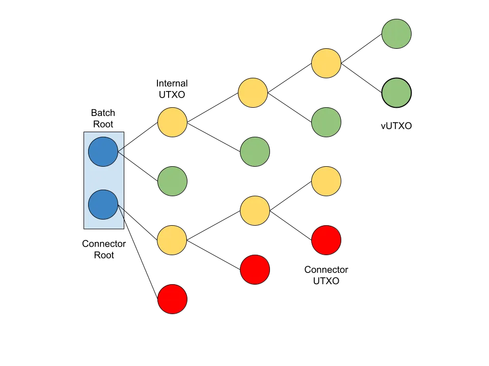

> *作者：Shinobi*
> 
> *来源：<https://bitcoinmagazine.com/technical/bitcoin-layer-2-ark>*

Ark 是一种新的链下交易批处理机制，最初由一位年轻的土耳其开发者 Burak 提出。当前有两种开发中的实现，一个来自 “Ark Labs”，另一个来自 “Second”；Burak 两个都没有参与。

相比于当前开发中的实现，最初的 Ark 提议要复杂得多，而且包含一些更多围绕隐私的设计目标；其最初也设想需要 [CHECKTEMPLATEVERIFY](https://bitcoinmagazine.com/technical/bitcoin-covenants-checktemplateverify-bip-119)（CTV） 来构建。

为了正常工作，一个 Ark 实例需要一个中心化的协调服务商，但除此之外，Ark 协议能够提供跟闪电网络一样的功能性和安全保证。只要用户在所要求的时间段内保持在线，资金在全时间段都是安全的（除非用户自己选择在一个较短的时间内信任服务商）。每个用户都能随时退出一个 Ark 实例、让自己的资金恢复成链上的只受自己控制的形态。

与闪电网络不同，Ark 协议并不要求用户预先给自己调配收款额度。用户从上手钱包的一刻开始就可以接收资金，完全不需要考虑收款额度。

我们来看看 Ark 协议的各个组成部分。

## Ark 树

Ark 协议中资金叫做 “虚拟 [UTXO](https://bitcoinmagazine.com/glossary/utxo)（vUTXO）”。它们只是预签名交易，保证了在某个用户决定提交上链时就一定能创造出该用户排他控制的真实 UTXO；但如果没有用户决定这么做，就只是保存在链下。

每个用户的 vUTXO 都被嵌入一棵由预签名交易组成的树（也可以叫一个 “批次”）中。Ark 的工作原理是让协调服务商（也叫 “Ark 服务供应商（ASP）”）来协调用户们创建交易树所需的交互。无论什么时候，当用户收到资金、进入一个 Ark 实例或离开时，都必须构造一笔交易以及相关的交易树，形成一个新的批次。

交易树构造好之后，只需让一个根 UTXO 在链上得到区块确认；该 UTXO 是使用 n-of-n 多签名装置锁定的，签名人包含了所有在这棵交易树上持有 vUTXO 的用户以及 ASP；这个根 UTXO 可以凭借之前用户预签名的交易逐步分解出越来越多的 UTXO，直到最终抵达交易树的叶子 —— 也就是某个用户持有的 vUTXO 。每个 vUTXO 都使用了一种脚本：要么用户和 ASP 一起使用 2-of-2 的多签名来花费，要么用户可以在一段时间后独自花费。

每次分解的时候，就有 vUTXO 在链上成为 UTXO，但还未分解的 “内部 UTXO（internal UTXO）” 中也包含同样的结构。这样的内部 UTXO 也同样是用 n-of-n 多签名锁定的，签名人包含 ASP 以及在该内部 UTXO 所携带的交易树上持有 vUTXO 的所有用户。在批次创建流程中，用户先从各自的 vUTXO 开始，沿这交易树逐层签名向上、直至抵达树根。这保证了树根在每一位用户领到一个 vUTXO 之前不会得到签名，也就保证了每一位用户总是能够单方面退出。

（译者注：作者在此处的描述可搭配上图来理解。不过，分解的具体情形取决于交易树是如何构造的，作者此处描述的只是其中一种构造方式；另一种构造方式可见：《[Ark 协议中的关键概念](https://www.btcstudy.org/2025/06/09/key-concepts-in-the-ark-protocol/)》。交易树的构造方式决定了 ASP 需要如何跟用户交互，以及用户尝试退出时候的难易程度，可参见：《[多方共享的 UTXO：形式与特性](https://www.btcstudy.org/2024/08/30/on-sharing-utxo-forms-and-features/)》。）

每一个批次都有过期时间（理由将在下一节解释）。这种过期花费路径，是链上的根 UTXO 以及每一个内部 UTXO 在多签名装置以外的一种花费路径，它让 ASP 能够单方面取走 UTXO 中的所有价值。

## 交易，预确认和连接器输出

Ark 协议中的交易有两种可用的机制，从安全模式的角度看，各有各的代价和影响；一种是 “轮次外转账”，也叫 “预确认交易”；另一种是 “轮次内转账”，也是实际上得到区块确认的交易。

要构造一笔轮次外转账是非常简单的。如果一个用户（Alice）想给另一个用户（Bob）支付，他们只需联系 ASP，然后一起签名一笔交易，将 vUTXO 转移给 Bob 就可以了。Bob 就得到了一笔预签名的交易，以及其它使自己可以一路回溯到链上根 UTXO 的交易。所以，Bob 现在也可以用自己的交易单方面离开这个 Ark 实例了，*但是*，他必须信任 ASP 不会勾结 Alice 从而重复花费 Alice 原本的 vUTXO。在最终得到区块确认之前，这样的轮次外转账可以多笔串联。

要终局化一笔 Ark 交易，用户必须参与一次 “批次互换”。用户没法真的在一个批次内免信任地确认一笔转账，他们必须将现有批次中的一个 vUTXO 替换成新的一个批次中的 vUTXO。这是通过让 ASP 成为互换协调员、借助 “连接器输出” 来实现的。

当一个用户要使用批次轮换来终局化一笔 Ark 交易的时候，他们将 vUTXO 的控制权退还给 ASP。那么，怎么保证 ASP 不会直接扣住它、不交付新批次中的 vUTXO 呢？这就要用到连接器输出。

在新轮次创建的时候，在链上得到确认的、创建根 UTXO 的交易还有第二个输出，该输出承诺的是一棵由连接器 UTXO 组成的树。当 Bob 要签名给 ASP 的弃权交易（以构造批次互换）时，该交易包含了 *来自新批次* 的其中一个连接器 UTXO 作为输入。

这就创造了一种原子化保证。Bob 在某一批次中的 vUTXO，会跟让其弃权交易成为有效交易的连接器输出，在同一时间创造出来。如果这个新批次不会在链上创建出来，也即 Bob 不会收到新的得到确认的 vUTXO，那么他签名给 ASP 的弃权交易也就不会有效，也不会在链上得到确认。

## 流动性动力学与区块空间

创建新批次以协助用户间转账所需的流动性全部由 ASP 提供。他们需要拥有足够的流动性，直到某一批次的用户的旧 vUTXO 全都过期，从而自己能一次性扫走原本锁定的所有资金（也即回收资金）。

这就是居于 Ark 协议核心的流动性动力学。虽然从某一个角度看，Ark 协议带来了巨大的效率提升，它不需要流动性供应商来评估用户（本质上是预先猜测哪个用户接下来会收到大量支付），但从另一个角度看，它又损失了效率，因为 ASP 必须拥有足够的流动性，才能持续为用户创建新的批次，必须撑过自己设定的过期时间，才能回收之前分配的流动性。

ASP 调节创建新批次以终局化待定交易的频率，可以大大缓解这个问题。如果 ASP 总是尝试随着交易发生而实时创建频次，那么流动性要求就会非常高。但是，ASP 可以降低频率，从而大大降低自己的流动性要求。

这种动力学也会影响区块空间的使用。与可以完全在链下提供健壮的确认保证的闪电通道不同，为了让一笔 Ark 交易获得同等免信任程度的终局性，就 *必须* 在链上创建一个新的批次。因此，闪电网络自身的交易量不会在链上反映出来，但 Ark 交易的速度却内在地要求使用一定数量的区块空间，虽然是以经过压缩的、非常高效的形式。因此，理论上，给定时间段内可以创建的 Ark 批次数量是有上限的（尽管 Ark 树的大小可以因为动力学而变化）。

## 总结

Ark 在许多方面都选择了与闪电网络几乎截然相反的取舍。它使链下交易的区块空间效率获得巨大提升，并且消除了闪电网络中的流动性调配问题，但它又使自身的吞吐量更密切地与区块链吞吐量的限制相关。

几乎截然相反的取舍使之非常适合作为闪电网络的互补系统。Ark 也能跟闪电网络交易，即，vUTXO 可以原子化地换成进入或离开闪电网络的交易。

Ark 到底适不适合广大的比特币生态，尚未见分晓，但它无疑是一个有价值的协议栈，会找到一些小众场景的（也许与最初的设想不同）。

