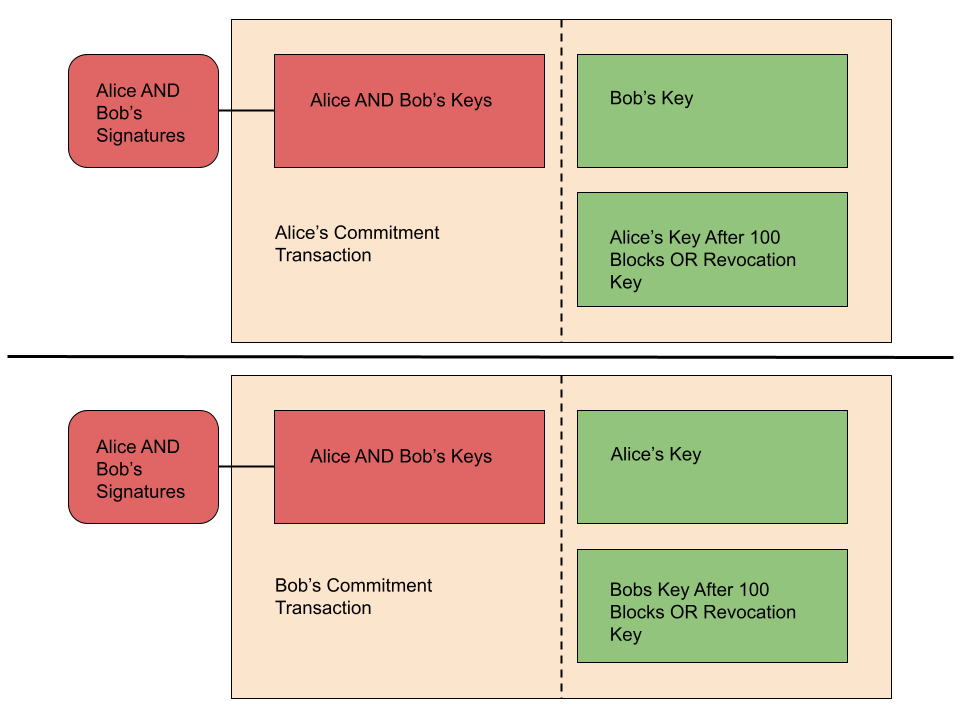
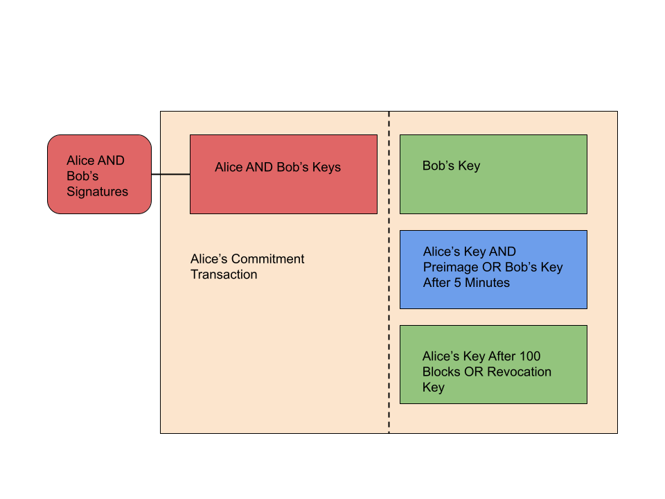

> *作者：Shinobi*
> 
> *来源：<https://bitcoinmagazine.com/technical/bitcoin-layer-2-lightning-network>*

“[闪电网络](https://lightning.network/lightning-network-paper.pdf)” 是一个由支付通道组成的路由网络，其概念最早由 Thaddeus Dryja 和 Joseph Poon 在 2015 年提出，已经完成的主要实现有：CLN（来自 Blocstream）、LND（来自 Lightning Labs）、Eclair（来自 Eclair）和 LDK（来自 Spiral）。

“支付通道” 概念在比特币世界里面算得上历史悠久，就是一个用户将资金存入一个 2-of-2 多签名地址中，然后通过预签名的交易，给另一方（支付接收方）分配越来越多的资金。最初的支付通道构想是单项的，而且有过期时间，支付的接收方 *必须* 在此过期时间之前使用最新一笔预签名交易关闭（结算）通道，否则支付的发起方可以动用接收方在此前签过名的一笔预签名交易，将多签名地址中的所有资金都拿走。

闪电网络的两个重大创新是：（1）一种不会局限于单向支付和硬性截止日期的支付通道类型；（2）使用 “哈希时间锁合约（HTLC）” 的概念，从而可以在多条支付通道中原子化地转发支付。

闪电网络（广义来说，支付通道皆如此）的主要缺点是其天生的流动性要求。为了收取支付，用户必须已经开设了一条支付通道，并且通道中的对方有足够多的余额，才能成功将支付转发过来。为了让支付穿过网络，沿途的每一条通道的转发方都必须具有大于支付数额的余额，才能转发支付。

虽然有这些缺点，从 2018 年它开始在比特币网络上启动以来，闪电网络还是在使用量和增长速度上获得了巨大的成功。

## Poon-Dryja 通道

从寿命有限的单向支付通道走向没有硬性截止日期的双向通道，要克服的关键问题只有一个：一旦你创建了一笔交易、给出了对它的签名，就没有办法取消它，也没法收回。这笔交易（会在你的对手那里）一直存在，除非它所花费的钱币（它的输入）被别的交易花掉，否则它一直是有效的，随时可以使用。

对该问题的解决方案就是 Poon-Dryja 通道的核心。你不能取消掉一笔预签名的交易，但你可以创造一种很强的激励，让人们永远不要使用更旧的预签名交易；甚至，如果有人尝试欺骗自己的通道对手，对手还会因此获得好处。实现这种效果的是 “撤销密钥” 的概念。

在一条 Poon-Dryja 通道中，两方各自有一组预签名交易（双方的预签名交易互为镜像），称为 “承诺交易”。每次通道更新（或者说余额变更），其实就是双方都给对方签名一条新的承诺交易。每一方所持有的承诺交易，都会将应当归属于对方的资金立即交给对方；但应当归属于自己的资金，则带有一个时间锁，在交易确认之后还要等待一段时间才能取回，并且，我们还要再加上一个撤销密钥的花费条件。

无论什么时候，只要更新了通道状态，在更新过程完成之前，双方都必须把自己用在上一笔承诺交易中的撤销密钥交给对方。如果某一方尝试发送一笔旧的承诺交易到网络中、尝试将现在已经属于对方的资金据为己有，那么被攻击的一方可以直接使用撤销密钥，立即取走该旧承诺交易中属于欺诈者的输出中的资金；加上 TA 原本就可以立即取走属于自己的输出中的资金，整条通道中的资金都会被 TA 取走。

**哈希时间锁合约（HTLC）**

在网络中跨越多条支付通道而转发交易，并且要保证安全性，是通过 HTLC 来做到的。这跟曾被用来协助不同资产的原子化互换（不论处在同一个区块链网络中、还是处在不同网络中）的机制是同一种。

HTLC 让一个输出有两种花费条件：（1）一方（HTLC 的接收方）如果能够提供某一个哈希值的原像，就能花费它；（2）另一方（HTLC 的发送方）也可以花费它，但需要等待一个时间锁过期）。利用闪电网络来支付的支付发送方可以让一连串的通道都传递使用相同哈希锁的 HTLC，直到传递给支付的接收方。由于设置哈希锁的哈希值是由接收方给出的，所以当接收方收到自己的通道对手发来的 HTLC 时，就可以释放原像。

那么，每一个收到原像的节点都向自己的通道对手出示原像，最终，原像会传递给支付的发送方。每当一方向另一方出示原像，双方就更新通道内的余额（释放原像的一方获得更多资金）。从接收方到发送方的回传路径上，越靠近发送方的通道中的 HTLC 的时间锁就越长。这是为了保证如果真的有什么事情发生，一些人必须关闭通道、在链上结算 HTLC 的话，上游（更靠近发送方）的节点有时间（在链上）发现原像、然后更新自己的通道。

## Gossip 协议

为了成功在网络中路由支付，闪电节点需要对整个网络的情形有一些基本概念。这是用 gossip 协议来实现的。Gossip 协议会被用来广播不同闪电节点以及他们的通道的信息，从而收到这些消息的闪电节点能够对网络的样貌有所认识，能够从中挑选传递支付的路径。

这是一个非常简单的协议，有三种消息：通道宣告、节点宣告和通道信息更新。每一种消息都与其它消息有具体的依赖关系，并且每一种消息都在传播关于支付通道网络的信息中有其作用，最终，用户能够使用这些信息，为自己的支付选择可行的路径。

通道宣告消息传播证明一条闪电通道真的存在所需的信息：形成这条通道的 UTXO、其双签名地址中的两个公钥的各自签名；还有来自双方闪电节点身份公钥的签名（针对前述 UTXO 证据和签名）。所有东西都是为了证明这里有一条真实的闪电通道，由区块链上的真实比特币支持，并且，这条消息不是用来轰炸网络的假消息。

只有制作出一条通道宣告消息、广播到网络中之后，一个节点才能传播节点宣告消息。这条宣告包含节点身份公钥、可以触达该节点的一个网络地址、该节点自选的一个昵称，以及少量其它元数据。

通道信息更新消息则传播一条具体的通道为转发支付而要求的手续费和其它条件。包括一个节点愿意传递的 HTLC 的最大价值和最小价值、基础手续费和手续费率（闪电支付必须支付一个基础手续费绝对值以及一笔与支付价值成比例的手续费）、该节点所收到的 HTLC 和所发送的 HTLC 的时间锁的差值。

这让每一个闪电节点都可以构造出一个对整个网络的视图，从而，在他们尝试让自己的支付穿过网络的时候，可以从视图中找出可以尝试的路径。

## 洋葱路由

在转发支付的时候，闪电节点之间传递的消息都是 “洋葱路由” 的。每一条消息都被一个加密层封装起来，从而支付转发路径上每一个节点都只能解开一个加密层、读取其中的信息；这其中包含的是指令，告诉收到这条信息的节点应该选择哪个通道对手来转发支付、继续传递加密的消息。

想想一层一层的洋葱。就是这样。

这为穿过网络的支付提供了一定程度的隐私性，因为转发路径上的每一个节点都只能知道跟自己关联的信息（谁发送了 HTLC 给自己、自己要把 HTLC 在哪条通道中发送给谁），但并不能看到完整的路径。所以他们即不知道支付的最终接收方是谁，也不知道发送方是谁。

这就是为什么我们需要 gossip 协议，以及为什么支付的发送方要自己选出要尝试的支付路径。通过让发送者来构造路径，支付获得了一定程度的隐私性；但是，构造路径的发送者必须知道网络的大概样貌，才能选出路径而不泄露这条路径的信息给其他人。

## 流动性机制

任何人想在闪电网络中收款，都必须先参与至少一条闪电通道；并且，其通道对手应该有一定数量的余额，才能将支付转发过来。也就是说，其通道对手需要打一个赌：会经常有人愿意给这个人支付，而且有一定的体量，从而自己能够从中收取手续费、赚一点钱。

这就产生了一个瓶颈，并且参与者们需要以某种方式获得其他人的信任。愿意在闪电网络中提供这种 “收款流动性” （向其他人开设通道并在其中投入资金）的人需要一些办法来衡量其他人的声誉，这是为了帮助他们，也是为了自己赚钱。

这就产生了对所谓的 “闪电网络服务商（LSP）”  的需要。LSP 就是专门运行基础设施来定位终端用户、为他们提供收款流动性的服务商。除了这样中心化的解决方案，协议层的解决方案，比如 gossip 协议的插件，可以向其它拥有流动性的人广播开启通道的出价和手续费要求。

## 总结

闪电网络显然有自身的局限性，例如因为需要预先分配资金才能收款而带来的障碍。但即使有这样的障碍，它还是取得了很大的成功。

它确实还不能说已经成为了全面自主保管的支付解决方案，但至少，自主保管是完全可以做到的，哪怕有点辛苦。除此之外，它无疑已经证明了，作为一个通用的结算层，面向更大规模或中心化用途，它是非常有用的。

无论闪电网络能不能成为一个可以完全面向终端用户的支付系统，对于能够处理其复杂性的人，这是无可否认的高效结算解决方案。这保证了它在比特币生态系统中的长期适应性，不论这是不是它的初衷。