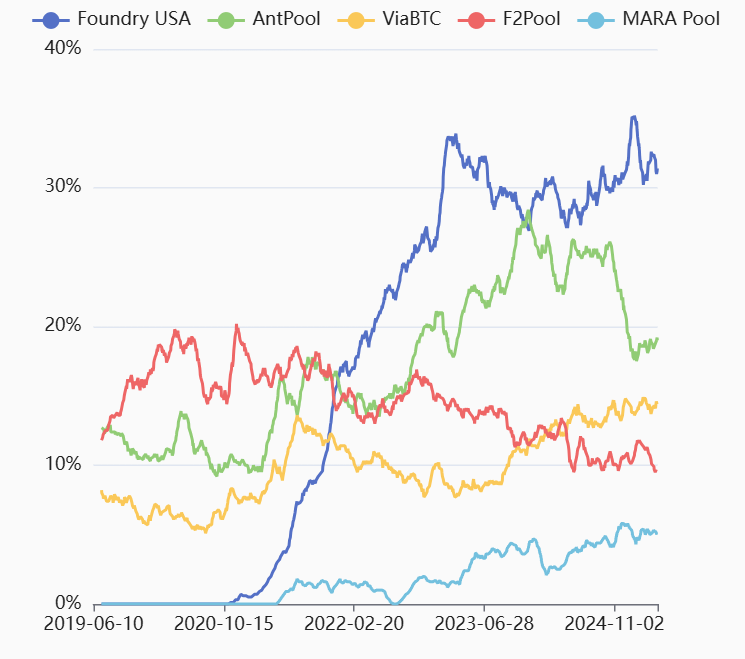
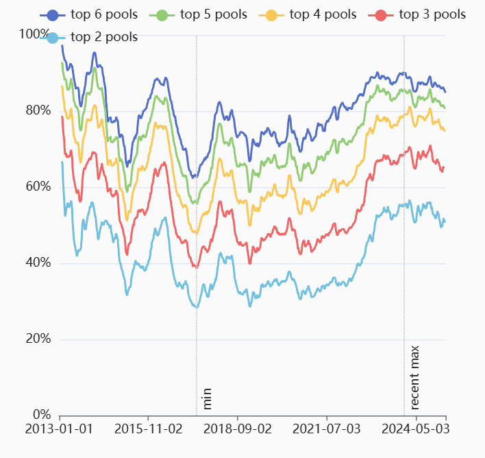
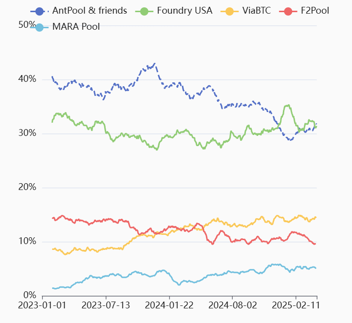
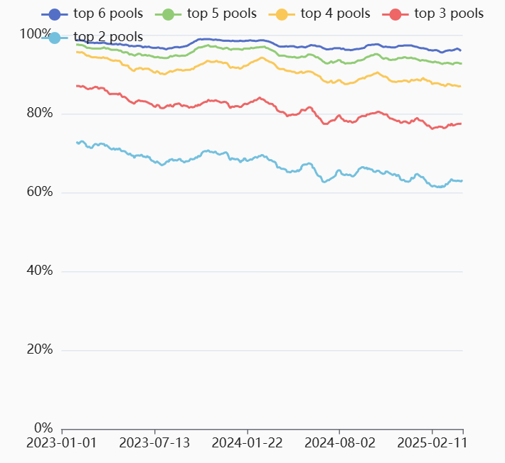
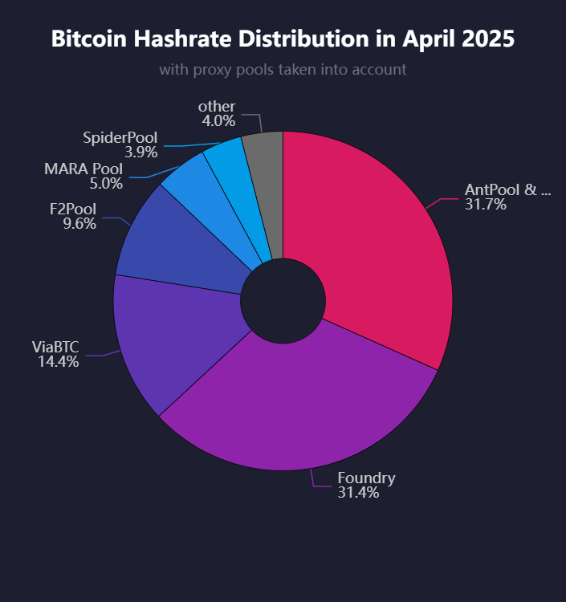

> *作者：b10c*
> 
> *来源：<https://b10c.me/blog/015-bitcoin-mining-centralization/>*

本文通过观察当前五个最大规模矿池的哈希率占比来研究比特币挖矿在 2025 年的中心化趋势。本文提出了一种挖矿中心化指数（Mining Centralization Index），并使用假设的代理矿池 “AntPool & friends” 来更新它。该指数表明，比特币挖矿行业在今天是高度中心化的，6 个矿池挖出了 95% 的区块。

在当前的比特币挖矿行业中，几乎所有挖矿算力都被少数大型矿池控制，他们决定了区块的模板（也即区块的内容）。这些矿池控制着他们挖出的区块要包含哪些交易、排除哪些交易。他们并不会伤害比特币的抗审查性，只要这些矿池不会勾结起来审查交易。但是，这确实带来了一个问题：到底存在多少不同的区块模板生产者？众所周知的“51% 攻击” 是说，单个控制超过一半哈希率的矿工或者矿池可以通过生产自己的链来打败所有其它矿工。但是，即使一个矿池只有 40% 的算力，也有大约 50% 的几率，可以在连续 6 个区块中打败其他所有矿池  <a href='#note1' id='jump-1-0'>1</a>。那今天有没有矿池掌握 40% 的哈希率？更广义地说，比特币挖矿行业在今天有多么中心化？尤其是，可能存在一种代理矿池 —— 一些规模更小的矿池可以将挖矿任务委托给更大的矿池，同时在 coinbase 交易中保留自己的名字。

本文以两部分研究了比特币挖矿的中心化。第一部分观察了 coinbase 交易中包含的矿池信息。第二部分则考虑了假想的代理矿池。两部分都展示了在该视角下当前最大的矿池和挖矿中心化指数。

## 统计 coinbase 交易标签以度量中心化

矿池通常会在自己挖出的区块的 coinbase 交易中留下一个 ASCII 编码的标签。比如，矿池 F2Pool 会写入标签 `/F2Pool/`。此外，矿池会频繁复用自己的 coinbase 输出地址。这些标识符的数据集可以用来分辨哪个矿池挖出了哪个区块。为这篇博客，我使用了 [bitcoin-data/mining-pools](https://github.com/bitcoin-data/mining-pools) 数据集。为了度量哈希率的占比，我以各矿池每天挖出的区块数量除以网络每天产生的区块总量。下图展示的数据经过了周期为 31 天的移动平均。

**当前 5 个最大矿池的哈希率占比**

（译者注：原网站的折线图允许缩放，可获得更详细的观察。）

当前，最大的 5 个矿池分别是：Foundry（30%）、AntPool（19%）、ViaBTC（14.5%）、F2Pool（10%）和 MARA Pool（5%）。

MARA Pool 是最年轻的矿池，从 2021 年 5 月才开始营业。而且，他们是这五个矿池中唯一的私人矿池。

在 2020 年底，Foundry 挖出第一个区块。经过一年的运行，Foundry 超越了其他矿池，以 17% 的哈希率占比成为最大的矿池。差不多又一年之后，在 2023 年 1 月，Foundry 的哈希率占比达到 30% ，并一直维持到今天。

AntPool 是由  ASIC 制造商比特大陆运营的矿池，哈希率占比从 2020 年的 10% 一直提高到 2024 年超过 25% ，不过在 2024 年底又重新跌到 20% 以下。

去年，ViaBTC 在第三名的竞争中打败了 F2Pool 。

当前，最大的两家矿池就占据了超过 50% 的哈希率，第三名和第四名占据另外 25% ，所以，75% 的哈希率由四家矿池控制。为恰当地了解这一点，下图的挖矿中心化指数折线图会派上用场。

**挖矿中心化指数**

为度量比特币挖矿中心化程度的历时趋势，挖矿中心化指数展示了最大的 2 个、3 个、 4 个、5 个 和 6 个矿池在每一个时间点上的哈希率占比总和。越高的数值表示越中心化。

比如说，在 2017 年 5 月，最大的两家矿池的哈希率占比之和不超过 30% ，而最大的 6 个矿池的哈希率占比之和不超过 65% 。那是自比特币矿池出现以来，比特币挖矿最为去中心化的时候。而 2023 年 12 月是最严重的反面情形，55% 的哈希率控制在最大的 2 个矿池手里，90% 的哈希率控制在最大的 6 个矿池手里。相比 2019 年到 2022 年之间的情形 —— 最大的 2 个矿池只占据大约全网 35% 的哈希率、最大的 6 个矿池占据 75% 的哈希率 —— 现在的比特币挖矿行业要中心化得多了。

## 在代理矿池时代度量中心化

已经有人[观察到](https://b10c.me/observations/12-template-similarity/)，AntPool 和几个规模较小的矿池会派发非常相似的区块模板（给池中的矿工）。这里假设这些较小的矿池是 AntPool 的代理矿池，意思是，他们只是转发由 AntPool 派发的挖矿认为，只是改变其中的 coinbase 标签和矿池收款地址。这使得基于 coinbase 交易标签和地址的哈希率估计变得不准确。AntPool 的哈希率被低估了，因为部分区块被归到那些小矿池名下。不过，AntPool 和这些小矿工，可以合并称为 “AntPool 和朋友们”，可以统计为由多个矿池组成的大矿池。不过，只能假设哪些矿池属于 “AntPool 和朋友们” 团体 <a href='#note2' id='jump-2-0'>2</a>，不清楚他们是何时加入团体的。

**AntPool 和朋友们在场的哈希率**

上图假设了所有属于 “AntPool 和朋友们” 的矿池都是从 2023 年开始加入。因为并不能证明这一点，所以他们在 2023 年的哈希率占比是被稍微高估的。不过，他们的 2024 年的数据就会变得更加准确了，其中 “AntPool 和朋友们” 占据了 40% 的哈希率。虽然 AntPool 和朋友们在至少两年时间里哈希率占比都高于 Foundry ，Foundry 似乎在 AntPool 和朋友们在 2025 年初失去 5% 的哈希率时得到了这部分哈希率。近期的趋势似乎在反转，AntPool 和朋友们重新开始增长。

给定 AntPool 和朋友们比上一部分的假设高出了 10% 到 15% 的算力，我们应该重新编制一份指数。

**AntPool 和朋友们在场的挖矿中心化指数**

这一份挖矿中心化指数包含了 AntPool 和朋友们，它表明，在过去两年中，AntPool 和朋友们以及 Foundry 一起控制了 60% 到 70% 的哈希率。不过，更糟糕的是，96% 到 99% 的区块，都是由最大的 6 个矿池挖出的。这些数字表明，比特币挖矿极度集中到了几个模板生产矿池手上。

比特币需要 MARA Pool 这样占据 5% 哈希率的小矿池。美国的一些大型挖矿企业也许可以离开 Foundry、开始独自挖矿（他们有这个规模）。此外，转移哈希率到 Ocean（< 1%）和 DEMAND（0 %）这样的矿池，矿工可以构造赞成的模板，也能帮助比特币挖矿行业变得更加去中心化。更多家庭挖矿用户也会有所帮助，但是，当前，家用矿机的哈希率与工业矿池的哈希率依然无法相比。

- - -

回答我们引言部分提出的几个问题：

**存在多少相异的区块模板生产者？**

我们无法知道，只知道 6 个区块模板生产商生产了 95% 的区块。

**当前有矿池占有 40% 的哈希率吗？**

没有，但可以假设，AntPool 和朋友们在 2023 年控制了 40% 的哈希率，并且一直持续到 2024 年上半年。Foundry 在 2025 年初期占有 35% 的哈希率。当前，AntPool 和 Foundry 各自都有 30% 的哈希率。

**今天的比特币挖矿有多么中心化？**

根据挖矿中心化指数，比特币挖矿在 2017 年 5 月的一段时间里是最为去中心化的。2019 年到 2022 年也不错。从 2023 年开始，比特币挖矿变得越来越中心化，尤其是因为 Foundry 和代理矿池（AntPool）的存在。

- - -

1.https://bitcoinops.org/en/tools/reorg-calculator/ <a href='#jump-1-0'>↩</a>

2.截至本文撰写之时，假定属于 “AntPool 和朋友们” 的矿池有：AntPool、Poolin（[模板相似性](https://b10c.me/observations/12-template-similarity/), [无效任务](https://b10c.me/observations/14-antpool-and-friends-invalid-mining-jobs/), [无效任务 2](https://x.com/boerst/status/1899102559161520497)）, CloverPool（前身为 BTC.com, [模板相似性](https://b10c.me/observations/12-template-similarity/), [无效任务 2](https://x.com/boerst/status/1899102559161520497)）, Braiins （[模板相似性](https://b10c.me/observations/12-template-similarity/), [无效任务](https://b10c.me/observations/14-antpool-and-friends-invalid-mining-jobs/)）, Ultimus Pool（[模板相似性](https://b10c.me/observations/12-template-similarity/), [无效任务](https://b10c.me/observations/14-antpool-and-friends-invalid-mining-jobs/), [无效任务 2](https://x.com/boerst/status/1899102559161520497)）, Binance Pool（[模板相似性](https://b10c.me/observations/12-template-similarity/), [无效任务](https://b10c.me/observations/14-antpool-and-friends-invalid-mining-jobs/)）, SecPool（[模板相似性](https://b10c.me/observations/12-template-similarity/)), SigmaPool ([模板相似性](https://b10c.me/observations/12-template-similarity/)）, Rawpool（[无效任务 2](https://x.com/boerst/status/1899102559161520497)）, Luxor（[模板相似性](https://b10c.me/observations/12-template-similarity/)）, Mining Squared（[mining-squared](https://x.com/boerst/status/1907036334784458974)）。SpiderPool 当前不被认为是 AntPool 的代理矿池，因为还没有足够多的证据。 <a href='#jump-2-0'>↩</a>