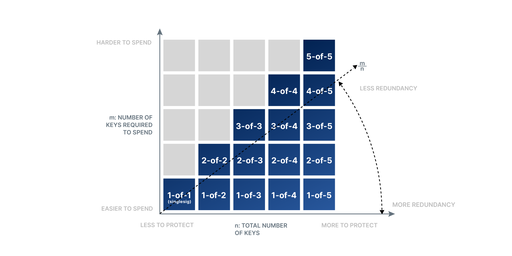
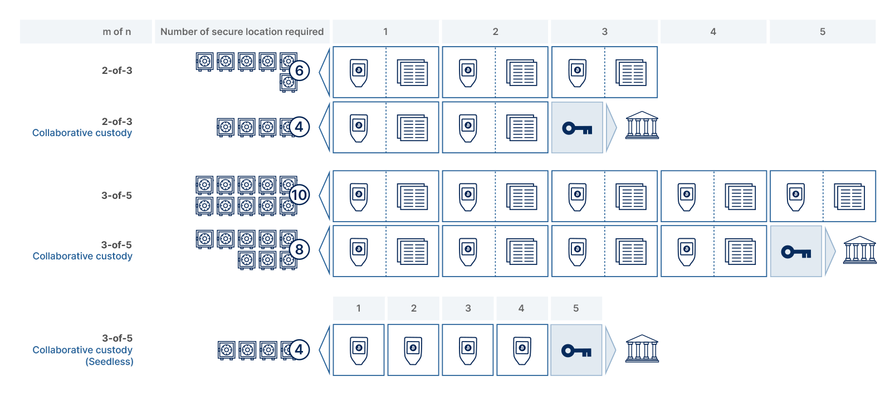
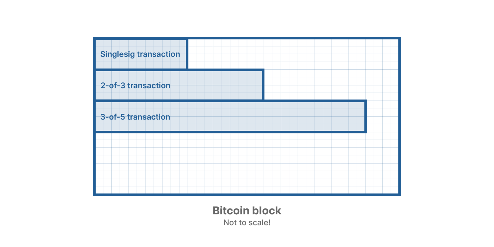
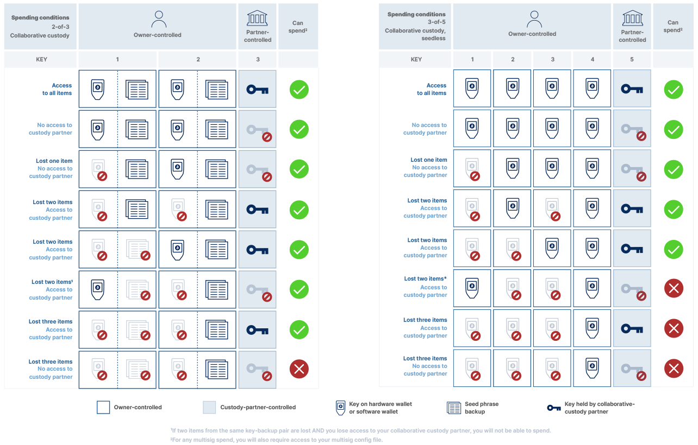

> *作者：Neil Woodfine*
> 
> *来源：<https://unchained.com/blog/bitcoin-multisig-2-of-3-vs-3-of-5/>*

多签名是一种[比特币自带的功能](https://unchained.com/blog/why-multisig/)，让你可以在由多个私钥（而非单个私钥）控制的钱包中保管比特币。你可以将花费这些比特币所需的几个私钥存放在不同的地方，从而提高财产的安全性。

多签名是非常灵活的，比特币应用开发者可以选择一个多签名钱包的私钥总数（*n*）和成功发起交易所需的私钥数量（*m*）。多签名的配置被写为 *m-of-n*。一些钱包允许用户自定义这两个数值。

## 最常见的多签名配置

比特币冷存储钱包（不联网钱包）最常见的 m-of-n 配置是：

- 2-of-3：总共有 3 个私钥，任意 2 个即可花费资金
- 3-of-5：总共有 5 个私钥，任意 3 个即可花费资金

2-of-3 和 3-of-5 都已经成为标准，因为它们通过分散控制权提供了更强的安全性，同时平衡了冗余度和简洁性。如果你的多签名的私钥太少，比如 1-of-2 或者 2-of-2，风险都是很大的，因为只要一个私钥丢失，你的安全性就会下降甚至弄丢资金；而如果超过了 5 个私钥，这对普通用户来说又太笨重了。

| 比特币 app        | 多签名设置               |
| ----------------- | ------------------------ |
| Blockstream Green | 2-of-3 和 3-of-5         |
| Unchained         | 2-of-3                   |
| Casa              | 2-of-3、3-of-5 和 3-of-6 |
| Hodl Hodl         | 2-of-3                   |
| Liquid Network    | 11-of-15                 |
| Caravan           | 可自定义，最多 m-of-7    |
| Electrum          | 可自定义，最多 m-of-15   |
| Sparrow           | 可自定义，最多 m-of-15   |
| Specter           | 可自定义，最多 m-of-15   |

## 2-of-3 vs. 3-of-5：到底哪个好？

在深入对比 2-of-3 和 3-of-5 之前，先要澄清一点：你应该使用什么样的多签名形式，很大程度上取决于你的环境。多签名本身是非常灵活的，当前你最多可以使用 15-of-15 的多签名（千万别这么做！除非你有[绝对必要的理由](https://twitter.com/thebitcoinrabbi/status/1300097349230956544)），而且每个人的金融和安全需求都是不同的。

因为没法断定哪一种 m-of-n 配置在所有情境下都是最优的，我们写这篇文章只是为了探讨适合 绝大多数 个人和考虑比特币冷存储的小业主的配置。

你可能也发现了，在 Unchained 钱包中，我们仅为 [bitcoin vaults 功能](https://unchained.com/vaults/)提供 2-of-3 的配置。但我们有充分的理由选择这个模式并继续推广它！

## 多签名钱包原理

为了帮助你更好地理解选择 m-of-n 过程中的权衡，我们要先了解一些基本的原理。

### 1. 花费资金所需的私钥数量（*m*）

提高花费资金所需的私钥数量（*m*）最终影响的是花费你的比特币的难度 —— 既包括攻击者（黑客或窃贼），也包括你自己！

m 越大，发起资金转移所需控制的私钥就越多。听起来好像 m 越高就越安全，但这仅仅在一些时候成立，并不绝对如此。我们下文细说。

### 2. 多签名的私钥总数（*n*）

提高多签名的私钥总数（*n*）并不会直接提高你的财产的安全性，只是给了你提高 m 的空间。它同时也提供了减低 m-of-n 比例的空间，提高了冗余度。我们下文也会解释。

 不利之处在于，n 越大，你要保管的敏感信息就越多 —— 每多一个私钥，就多两样东西需要保管：一把私钥和它的助记词备份。

### 3. m-of-n 比例（“多数比例”）

提高 m-of-n 比例（更大的 m 或者更小的 n）会降低你的多签名存储的冗余度。例如：如果你使用一个 5-of-5 多签名钱包，弄丢一个私钥和它的备份就会导致你的比特币永久锁住。（译者注：请绝对不要使用 m=n 的多签名设置，因为只要你弄丢其中一个私钥，就会导致你的财产永远锁住）。

降低 m-of-n 比例会提高冗余度，所以弄丢一个或更多私钥也变得没那么糟糕。当然，它会反过来提高保管每一个私钥的重要性，例如：如果你使用了一个 1-of-5 的多签名钱包，你需要保管好这五个私钥中的每一个，因为它现在就像一个单签名钱包（但即使在这个例子中，即使攻击者得到了你的一个私钥，也还需要你的[多签名配置文件](https://unchained.com/blog/what-is-a-multisig-wallet-configuration-file/)才能花费你的钱）。

## 多签名冷存储的好处

如果你要长期持有比特币，一般来说，使用多签名（而非单签名） 的动机是为了提高安全性。但 “提高安全性” 是个很宽泛的词，我们来分析下：

- **抵抗攻击**：抵抗远程攻击（恶意软件、黑客和钓鱼）和物理攻击（盗窃和抢劫）。
- **容错**：保护你自己 —— 免受自己的错误之累。举个例子：弄丢一个私钥或助记词、为一笔交易输入一个不正确的地址。也能抵抗房屋失火、洪水、火山爆发和天灾。
- **分散控制权**：在一个组织的多个利益相关者之间分散一笔比特币资金的控制权，例如公司、基金、慈善机构乃至家庭理财。
- **协作托管**：可以跟协作式的托管伙伴（就像 Unchained）部分分享你的资产的控制权，从而帮助保管你的比特币。

##  比特币多签名 vs. 单签名

本文预设了，在保管大体量的财富时，自主托管（包括协作托管）总是好过第三方托管 —— 毕竟，*无钥即无币，币钥为一体*。在自主托管时，相比单签名，多签名能提供许多好处。但它也有所牺牲，具体的程度取决于你的多签名设置：

- **便利性**：虽然整个流程日益变得简单，但设置多签名钱包和从中花费，总会比单签名钱包更复杂。
- **备份的便利**：使用单签名钱包时，你只需要保管一个私钥（在这里，私钥意味着一个存储着你的私钥的设备，例如一个硬件钱包或者一部智能手机），以及一个[助记词备份](https://unchained.com/blog/what-is-a-bitcoin-seed-phrase/)。使用多签名钱包的话，你就需要保管多个设备和多个助记词。
- **可用性**：如果你的多签名钱包需要多个私钥来发起交易，而你又在多个地点分散存储你的私钥，那么你的资金的可用性就会降低。多签名所需的私钥越多，你在支付时需要抵达的地方也就越多。
- **交易成本**：在比特币网络中发送支付需要支付交易费。交易费的大小取决于交易的体积和发送交易当时市场对比特币区块空间的需求。多签名交易一般来说比单签名交易需要更多的区块空间。你的多签名钱包使用的私钥越多，交易的数据量（体积）也就越大。

## 对比 2-of-3 和 3-of-5多签名：需要考虑的因素。

### 抵抗攻击

假设攻击中知道你在使用多签名保护自己的财产，而且合理地分散并保管好的私钥，3-of-5 会比 2-of-3 更能保护你，因为攻击者必须获得更多的私钥来转走你的币（见上文的原理 1）。

**警告**：对于大部分攻击者来说，要拿到你分散存放的两个离线私钥就已经很棘手了。投机性质的攻击者即使发现了你的一把私钥，也未必知道这把私钥会用在一个多签名钱包中，更不用说知晓还需多少私钥才能转走你的资金了。此外，要保管的私钥越多，可以被攻击的地方也越多 —— 见下文的 “备份便利性”。

**胜者**：3-of-5

### 容错

如上所述，理论上，3-of-5 也会比 2-of-3 有更好的容错能力。根据上文的原理 3，3-of-5 有更低的 m-of-n 比例，所以可以容许更多私钥弄丢或被摧毁。

**警告**：请记住，你在多签名中使用的私钥总数越多，你需要备份的私钥也就越多，你出错的可能性也就越高。举个例子，如果你要保管 5 个乃至更多设备，你弄丢一个私钥的可能性就更高。只要你发现了哪怕一把私钥丢失、被盗或损坏，你就需要通过一个繁琐的 “rekey” 流程来替换私钥。

**胜者**：3-of-5

### 分散控制权

如果你需要分散你的组织的控制权，选择 2-of-3 还是 3-of-5 很大程度上要取决于你想在组织的比特币保管中安排多少受信任的利益相关者。请注意，你在密钥管理中安排的人越多，在员工离职时你需要执行 rekey 的可能性就越大。

**胜者**：平局

### 协作托管

如果你跟一个协作托管伙伴（例如 Unchained）分享了一个私钥，2-of-3 会让这个伙伴在钱包的恢复和联合签名中占据更重要的角色。你可以确信他们时无法动用你的比特币的。你只需要保证自己永远能访问你的冷存储中的一个私钥即可，托管伙伴会提供另一个。

在一个 3-of-5 的协作托管方案中，你依然需要保证两个私钥的可用性，最好是分散保管的；加上协作托管伙伴的私钥，才能动用你的资金。

**胜者**：平局

### 便利性

建立和保管 3 个离线私钥，显然比保管 5 个要更直接；保证 2 个私钥可以签名，也比保证 3 个要更直接。2-of-3 也提供了没有单点故障的安全性。

复杂性是安全性的死敌。比特币持有者的一个常见错误是高估了恶意攻击的风险、给自己的报告方案加入过量的复杂性来抵御这种威胁，但这样以来，这种复杂性本身就成了比特币保管的首要风险隐私。持有者自己成了自己最可怕的敌人。

使用更少的私钥，你可以集中心思在最大化私钥存储和操作的安全性上，同时保留可观的去中心化所带来的好处。

**胜者**：2-of-3 

### 备份便利性

在建立一个单签名钱包时，你要保管你的私钥（例如：存放在一个硬件钱包里）以及一个助记词备份。于是你要留心两样东西。而在多签名钱包中，你要为每一个私钥保管一个设备和一份备份。如果你用的是 2-of-3 ，那你就要保管 6 件东西（3 个私钥、3 份助记词）。要是你用的是 3-of-5，那你就要保管 10 件东西了。

要合理地保管你的比特币，你需要分别保管每一个私钥和相应的助记词（我们建议在个人保险箱和保管服务处分别保管）。要不然，把它们都放在一起就违背了使用多签名的目的。要选出并维护 6 个安全地点可不容易，更别说 10 个了！

随着保管私钥和备份所需的地点增加，你在地点的安全性上也可能会作更多妥协。更少需要保护的物件，可以让你集中心思在最大化每个地点的安全性上。

一个协作托管服务商可以帮助降低你的备份负担。举个例子，使用 Uchained 的 vault 功能，你可以享受 2-of-3 的安全性，同时只需要保管 5 个物件（2 个私钥，2 个助记词以及一个钱包配置文件）（而不必保管 7 个物件）。Casa 建议为其 3-of-5 方案采取 “免助记词备份” 方案，最终你也只需要保管 4 个物件（而不是 10 个）。但我们将解释，使用无助记词的备份也会引入新的风险。见下文的 “协作托管” 章节。

**注意**：不管使用什么样的多签名钱包 —— 无论带不带协助托管 —— 除了你的私钥和助记词，你都需要存储一份[多签名配置文件](https://unchained.com/blog/what-is-a-multisig-wallet-configuration-file/)。不过，多签名配置文件并不需要私钥和助记词同样的物理安全性，所以就没有在这里比较。

**胜者**：2-of-3 

### 可用性

虽然多签名主要是让攻击者更难触碰你的财产，但它也让你更难花费自己的财产。我们假设你会分散存放多签名设置中的每一个私钥。那么，花费资金所需的私钥（m）越多，你在使用自己的比特币时需要前往的地方也就越多。

储蓄的目的，无论是储蓄比特币还是法币，都在于你想用的时候就能用。如果你因为无法预见的事件而无法前往存放私钥的地方，你就会发现自己 “屋漏偏逢连夜雨”。

虽然一些多签名钱包允许你在移动设备上存放私钥，但我们不建议在任何联网的 “热” 设备中存放任何事关大量资金的比特币私钥（见下文的 “协作托管” 一节）。假设所有私钥都安全地存储在离线的设备中，2-of-3 比 3-of-5 对个人来说要更容易访问。

**胜者**：2-of-3 

### 交易成本

在区块空间需求较低的时候，交易成本不是问题，因为交易费水平本身是非常低的。但是，只要拥堵在比特币链上发生，比如说在牛市的时候，多签名交易的成本（矿工费）与单签名交易的区别就非常大了。

你的多签名交易中涉及的私钥越多，交易的体积就越大，你需要支付的矿工费就越高。举一个极端的例子，如果在区块空间需求高涨的时候（手续费水平大于 100 聪/vbyte）使用 2-of-3 多签名交易，想让交易在一个小时内上链的成本可能到达 1000 美元。而且，假设所有其它条件都相同，3-of-5 的多签名交易的体积会大得多，因此比 2-of-3 多签名交易更为昂贵。

**胜者**：2-of-3 

### 最终结果

当然，在现实中，上述每一个分类都还有许多细节，所以答案并不是非黑即白的。

要选择什么样的多签名设置，最终取决于你的情景和偏好。我们希望上述的对比可以帮助你作出更为明智的决定！不论 2-of-3 还是 3-of-5，都提供了非常好的安全性，只要你有办法备份和保管好你的私钥。

而且，如果你给自己的多签名钱包加入了协作托管，这可能会改变 2-of-3 与 3-of-5 的对比。我们在下一个章节集中讲解。

## 协作托管商

在比特币多签名钱包终使用一个协作托管伙伴，你可以加强多签名钱包的好处并缓解其缺点。不论 2-of-3 还是 3-of-5，都可以借助协作托管获得更好的可用性。但天下没有免费的午餐，你也会暴露在新的风险中。

### 更少需要保管的东西

多签名的一个主要挑战之一便是你要保管的敏感物件的数量。在 Uchained，我们提供 2-of-3 的协作托管，你的私钥之一及其相关的备份是由我们的团队来保管的。协作托管减少了你需要保管的敏感物件无量（从 6 件降到了 4 件）—— 所以更容易管理了！

你也可以在 3-of-5 多签名中采取同样的方法，但只能将数量从 10 件减少到 8 件 —— 对于普通用户和小企业主来说还是太多了。因此，3-of-5 多签名钱包供应商比如 Casa 提供了一种名为 “免助记词备份”的方案 ……

### 免助记词 vs. 助记词备份

在免助记词备份中，每个私钥的助记词都被完全摧毁了，你仅仅依赖你的私钥本身作为备份。在 3-of-5 的协作托管方案中，一个私钥由托管商保管，免助记词设计使得你需要保管的东西从标准方案的 10 个变成了 4 个。即使两个私钥弄丢或被破环了，因为你还留下了三个，依然可以重新拿回你的资金。

虽然表面让看起来，它是一个很大的进步，但免助记词的多签名也让你暴露在多种不那么明显的威胁中。我们建议你坚持为你的私钥保存助记词。离线的物理备份，可以保证你不必依赖于你的硬件钱包和多签名软件供应商。硬件钱包是很好的、经过实战考验的存放比特币私钥的技术，但它们[也像任何硬件一样可能出现技术故障（也确实出现过）](https://unchained.com/blog/why-you-should-always-secure-your-seed-phrase-four-unexpected-errors/)。

在 2-of-3 多签名中，1 个私钥由协作托管商保管，你可以弄丢 2 个私钥和一个助记词，只要你还有 1 个助记词，你就依然能通过协作托管伙伴重新拿回自己的比特币。

我个人的看法是，我已经在比特币行业里面待了很长时间了，我见过的第二常见的丢币原因并不是黑客攻击，而是弄丢了助记词和私钥（最常见的原因是拿比特币换山寨币）。你必须确保自己拥有备份并妥善保管它们。

| **设置** | **托管形况**       | **需要保管的私钥** | **需要保管的助记词** | **需要保管的物件总数** | **允许丢失的物件数量上限\*** |
| -------- | ------------------ | ------------------ | -------------------- | ---------------------- | ---------------------------- |
| 3-of-5   | 标准               | 5                  | 5                    | 10                     | 7                            |
| 3-of-5   | 协作托管           | 4                  | 4                    | 8                      | 5                            |
| 3-of-5   | 免助记词的协作托管 | 4                  | 0                    | 4                      | 2                            |
| 2-of-3   | 标准               | 3                  | 3                    | 6                      | 4                            |
| 2-of-3   | 协作托管           | 2                  | 2                    | 4                      | 3                            |

注 \*：剩余的物件必须属于不同的 密钥-助记词。你还必须保留由自己的[多签名配置文件备份](https://unchained.com/blog/what-is-a-multisig-wallet-configuration-file/)。丢失任何一个多签名私钥或助记词都是危险的事，绝不要掉以轻心觉得无所谓，应该在发现 丢失/故障 之后立即安排[私钥替换](https://help.unchained.com/how-do-i-conduct-a-key-replacement)。

### 强化可用性

前面的章节已经提到，协作托管也可以提高你的比特币的可用性。

在 2-of-3 的协作托管方案中，你要是因为无法预见的情形而无法动用多一把私钥或助记词，你依然可以联系协作托管商来一同签名交易。在 Unchained 中，我们有严格的身份和内部验证流程，来保证共同签名的安全性。

你在旅途中也是同理，只需要能在出门前取出一把私钥带在身上，就能保证可以动用自己的资金。

不过，在 3-of-5 的协作托管方案中，你总是需要能够动用至少 2 个私钥或助记词，这样才能和托管伙伴共同签名。Casa 在你的智能手机中存储你的 5 个私钥之一，希望缓解这个问题，但这也引入了新的风险（见下一个章节）。

### 手机 app vs. 离线的硬件设备

通过在你的智能手机上存储一个私钥，Casa 保证了你至少能动用一个私钥。技术上来说，你只需要能动用另一个硬件钱包，就能跟 Casa 的联合签名服务发出有效的交易。

虽然这听起来也是个妙计，我们依然认为：将关系着大量财产的私钥存放在你随身携带的联网设备中，仅仅为了提供可用性，是不可接受的。

比特币的私钥应当离线保管，最好是在专门的设备上，在你不会暴露给他人、也不会遭受远程攻击的地方。

手机随时随地都可能丢。任何你随身携带的东西，不仅从定义上来说更不安全，因为非恶意的情形丢失的风险也更大。如果你弄丢了自己的手机，就要默认自己的私钥已被攻破，那么你就需要替换私钥并将资金转移到新的多签名设备中。替换私钥需要访问至少 3 个存放在其它地方的私钥，这不仅仅是麻烦，也可能会牺牲你的私钥存储地点的安全性。

## 安全性离不开取舍

多签名的安全性，并不是攻击者需要获得的私钥数量的简单加总。安全性也跟你要保管多少个私钥及其备份又跟，跟你需要用到它的时候它的可用性有关，跟你如何保护自己避免因失误铸成大错有关。而复杂性可能比任何攻击者的威胁都要大！

对于大部分人来说，2-of-3 是保护他们的大比例财产的最优比例。

2-of-3 使得你需要保管的私钥和备份的数量较少，让你可以专注于提高私钥及其备份的存放地点的安全性。它也保留了去中心化所带来的安全性得益，使你能抵御丢失、硬件故障和其它不可预见的事件。选择协作托管，可以进一步降低你需要保管的私钥数量。

但最终来说，每个人的财务状况和安全需求都是不同的，许多的多签名设置都可以提供比单签名钱包更强的安全性。而且，多签名几乎绝对优于托管型钱包。只需要确保自己作了充分的调查，使用了安全记录良好的钱包，并记得定期检查自己的各项钱包设置，即可。

## 开始使用多签名

如果你认为多签名钱包适于你或者你的企业的比特币财产，我们非常乐于帮助你。你可以[跟我们的客户解决方案团队预约咨询](https://unchained.com/schedule-a-consultation/)，或者你已经准备好上手了，那么[请向多签名钱包专家报名 1 对 1 的课程](https://unchained.com/the-vault-concierge-onboarding-package/)，或者[参考我们的 DIY 教程自己尝试一下](https://unchained.com/blog/how-to-create-a-do-it-yourself-unchained-capital-multisig-vault/)。

（完）