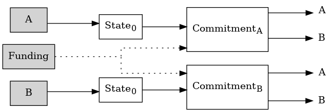
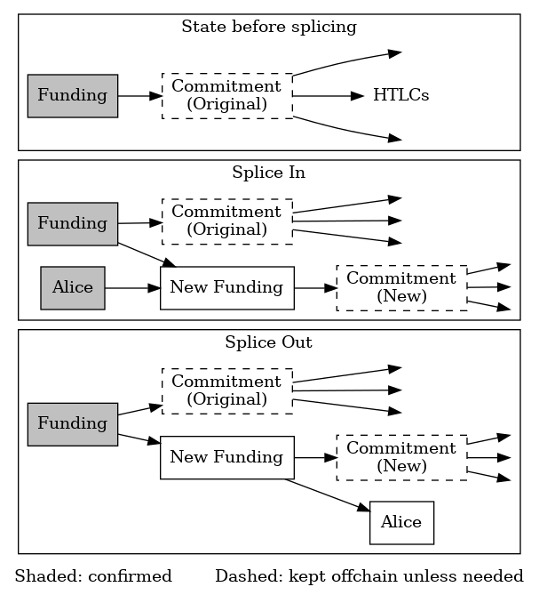

> *作者：Optech*
>
> *来源：<https://bitcoinops.org/en/newsletters/2023/12/20/>*
>
> *本译本由 “Optech 中文翻译小组（[BitcoinOptechCN](https://github.com/PrimitivesLane/BitcoinOptechCN)）” 提供。*

本期为 Optech Newsletter 的特刊， 总结了 2023 年全年比特币开发中的重要进展。 它接续了我们的年度总结传统：[2018](https://bitcoinops.org/en/newsletters/2018/12/28/)、[2019](https://bitcoinops.org/en/newsletters/2019/12/28/)、[2020](https://bitcoinops.org/en/newsletters/2020/12/23/)、[2021](https://bitcoinops.org/en/newsletters/2021/12/22/)，以及 [2022](https://bitcoinops.org/zh/newsletters/2022/12/21/)。

## 目录

- [一月](#一月)
  - Bitcoin Inquisition
  - Swap-in-potentiam
  - BIP329 钱包标签导出格式
- [二月](#二月)
  - Ordinals 与铭文
  - Bitcoin Search, ChatBTC, and TL;DR
  - 对等节点存储备份
  - LN 节点的服务质量
  - HTLC 背书提议
  - Codex32
- [三月](#三月)
  - 层级式通道
- [四月](#四月)
  - 瞭望塔问责证明
  - 路径盲化
  - MuSig2
  - RGB 和 Taproot Assets
  - 通道拼接
- [五月](#五月)
  - LSP 规范
  - Payjoin
  - Ark
- [六月](#六月)
  - 静默支付
- [七月](#七月)
  - 验证闪电签名者
  - LN 开发者峰会
- [八月](#八月)
  - 洋葱消息
  - 过时备份证明
  - 简单 taproot 通道
- [九月](#九月)
  - 压缩比特币交易
- [十月](#十月)
  - 付款拆分与切换
  - Sidepools
  - AssumeUTXO
  - 第 2 版加密 P2P 传输
  - Miniscript
  - 状态压缩与 BitVM
- [十一月](#十一月)
  - 要约
  - 流动性广告
- [十二月](#十二月)
  - 集群交易池
  - Warnet
- 特别总结
  - [软分叉提议](#soft-fork)
  - [安全披露](#security-disclosure)
  - [流行基础设施项目的主要发布](#major-release)
  - [Bitcoin Optech](#contributor)

## 一月

Anthony Towns [推出](https://bitcoinops.org/zh/newsletters/2023/01/04/#bitcoin-inquisition) 了 Bitcoin Inquisition，一款复刻了 Bitcoin Core 的软件，设计目标是在默认的 signet 上运行，以测试人们提出的软分叉和其它重大的协议变更。截至今年年底，Bitcoin Inquisition 已经支持了多项提案：[SIGHASH_ANYPREVOUT](https://bitcoinops.org/en/topics/sighash_anyprevout/)、[OP_CHECKTEMPLATEVERIFY](https://bitcoinops.org/en/topics/op_checktemplateverify/) 以及基本的 “[临时锚点](https://bitcoinops.org/en/topics/ephemeral-anchors/)”；并且，旨在为 [OP_CAT](https://bitcoinops.org/en/topics/op_checksigfromstack/#relationship-to-op_cat)、`OP_VAULT` 以及限制 64 字节交易而增加支持的 PR 已经提交到其代码库。

ZmnSCPxj 以及 Jesse Posner [提出](https://bitcoinops.org/zh/newsletters/2023/01/11/#noninteractive-ln-channel-open-commitments) 了 “swap-in-potentiam”，这是一种可以开启闪电通道的非交互式方法，用于解决经常离线的钱包（比如移动设备上的钱包）所面临的挑战。客户端可以在自己离线时以链上交易的形式接收资金。一旦这样的交易得到足够多的确认，当客户端再次回到线上时，就可以立即安全地跟预先选定的对等节点开启一条通道 —— 无需信任该对等节点。在这个提案提出的几个月内，至少一个热门的闪电钱包已经用上了这个想法的实现。

一种用于导出和导入[钱包内部标签](https://bitcoinops.org/en/topics/wallet-labels/)的标准格式被[分配](https://bitcoinops.org/zh/newsletters/2023/01/25/#bips-1383)了标识符[BIP329](https://github.com/bitcoin/bips/blob/master/bip-0329.mediawiki)。这个标准不仅让用户更容易备份无法通过 [BIP32 种子](https://bitcoinops.org/en/topics/hd-key-generation/) 来复原的重要钱包数据，还大大方便了复制交易元数据到非钱包程序（比如记账软件）中。截至今年年底，已经有多款钱包实现了 BIP329 导出功能。

## 二月

二月份[开始出现](https://bitcoinops.org/zh/newsletters/2023/02/08/#discussion-about-storing-data-in-the-block-chain)贯穿了全年的关于 Ordinals 和 “铭文（Inscriptions）” 的[讨论](https://bitcoinops.org/zh/newsletters/2023/02/15/#continued-discussion-about-block-chain-data-storage)，这两个相关的协议旨在为交易输出附加含义和数据。Andrew Poelstra 总结了许多协议开发者的立场：“没有一种实用的办法能够在阻止人们在交易的见证字段存储任意数据的同时，不吸引他们尝试更加糟糕的行为 以及/或者 打破合理的用途。”鉴于铭文所用的方法允许存储大体积的数据，Christopher Allen 建议提高 Bitcoin Core 对以 `OP_RETURN` 为前缀的输出可存储的数据体积限制（83 字节）；同年晚些时候，Peter Todd 也[支持](https://bitcoinops.org/zh/newsletters/2023/08/09/#bitcoin-core)这样的提议。

BitcoinSearch.xyz 在今年初[启动](https://bitcoinops.org/zh/newsletters/2023/02/15/#bitcoinsearch-xyz)了，它为比特币的技术文档和讨论提供了一个搜索引擎。截至今年年底，该网站也提供了一个[聊天界面](https://chat.bitcoinsearch.xyz/)，以及最新讨论的[总结](https://tldr.bitcoinsearch.xyz/)。

Core Lightning [添加](https://bitcoinops.org/zh/newsletters/2023/02/15/#core-lightning-5361)了对 “对等节点存储备份” 的实验性支持；该特性允许一个节点为其对等节点存储一个小体积的加密备份文件。如果一个对等节点需要重新建立连接，可能已经弄丢了数据，那么可以请求这个备份文件。请求节点可以使用从自己的钱包种子词中派生的密钥来解密这个文件，然后用其中的内容来复原其所有通道的最新状态。

Joost Jager [提议](https://bitcoinops.org/zh/newsletters/2023/02/22/#ln-quality-of-service-flag)给闪电通道增加一种 “高可用性” 标记，以允许一条通道表示自己可以提供可靠的支付转发服务。Christian Decker 指出创建声誉系统会面临的挑战，比如同一个节点可能不会被同一个支付发起方频繁使用。此前出现的一种替代性方法也被提及：“[带有复原机制的超额支付](https://bitcoinops.org/en/topics/redundant-overpayments/)”（曾用名 “回旋镖”、“可退款的超额支付”），其中支付会被分切并通过多条路径来发送，从而减少对高可用通道的依赖。

来自去年出版的一篇[论文](https://bitcoinops.org/zh/newsletters/2022/11/16/#paper-about-channel-jamming-attacks)的想法成了 2023 年缓解 “[闪电通道阻塞](https://bitcoinops.org/en/topics/channel-jamming-attacks/)” 问题的焦点。二月份，Carla Kirk-Cohen 以及论文的联合作者 Clara Shikhelman 开始[征求](https://bitcoinops.org/zh/newsletters/2023/02/22/#feedback-requested-on-ln-good-neighbor-scoring)对实现论文的其中一个想法 “[HTLC 背书](https://bitcoinops.org/en/topics/htlc-endorsement/)” 时应使用的建议参数的反馈。四月份，他们为自己的测试计划[提出](https://bitcoinops.org/zh/newsletters/2023/05/17/#htlc)了一份规范草案。六月份，论文中的想法和提议在闪电网络开发者会议上得到了[讨论](https://bitcoinops.org/zh/newsletters/2023/07/26/#channel-jamming-mitigation-proposals)，从而引起了邮件组内关于一种[替代性方法](https://bitcoinops.org/zh/newsletters/2023/08/09/#dos)的讨论；该替代方法希望让攻击者和诚实用户所支付的费用都能反映节点运营者提供服务所需付出的真实成本，如此一来，能够凭借向诚实用户提供服务来赚取合理回报的节点，也将能在攻击者尝试使用其服务时持续获得合理的回报。八月份，[公开消息](https://bitcoinops.org/zh/newsletters/2023/08/09/#htlc)称 Eclair、Core Lightning 和 LND 的开发者都实现了部分的 HTLC 背书协议，以开始收集与之相关的数据。

Russell O’Connor 和 Andrew Poelstra 为备份和存储 [BIP32](https://github.com/bitcoin/bips/blob/master/bip-0032.mediawiki) 助记词[提出](https://bitcoinops.org/zh/newsletters/2023/02/22/#codex32-bip)了一个新的 BIP，称为 “[codex32](https://bitcoinops.org/en/topics/codex32/)”。类似于 SLIP39，codex32 允许使用 Shamir 私钥分割方案将一个种子词分成多个碎片，并允许配置复原种子词的阈值要求。攻击者所得的碎片数量若小于阈值，就无法得出完整的种子词。但是，codex32 不像其它复原码使用一张词表，它使用跟 [bech32](https://bitcoinops.org/en/topics/bech32/) 地址相同的字母表。与现有的方案相比，codex32 的主要优势在于，用户可以使用纸、笔、指令和剪纸，手动运行所有操作，包括生成一个编码过的助记词（使用骰子）、用一个校验和来保护它、创建带有校验和的碎片、验证校验和以及复原种子词。这使得用户可以周期性地验证单个碎片的完整性，而无需依赖于可信任的计算设备。

## 三月

三月份，化名开发者 John Law [出版](https://bitcoinops.org/zh/newsletters/2023/03/29/#preventing-stranded-capital-with-multiparty-channels-and-channel-factories)了一篇论文，介绍了一种可以仅使用单笔链上交易就为多个用户创建一种层级式通道的方法。这种设计允许即使在部分参与者离线时，在线的用户也能花费自己的资金，而这在当前的闪电通道中是做不到的。这种优化使得总是在线的用户能够更高效地使用自己的资金，从而也可能降低其它闪电网络用户的成本。本提议基于 Law 的可调整惩罚协议，而该协议从 2022 年提出以来，还未看到任何公开的软件开发。

- - -

### 2023 总结 软分叉提议

James O’Beirne 在一月[提出](https://bitcoinops.org/zh/newsletters/2023/01/18/#vault)了一种新的 `OP_VAULT` 操作码，[随后](https://bitcoinops.org/zh/newsletters/2023/02/22/#op-vault-bip)在二月为之编写了一份 BIP 草案以及提交到 Bitcoin Inquisition 的实现。几周后，Gregory Sanders [提出](https://bitcoinops.org/zh/newsletters/2023/03/08/#op-vault)了 `OP_VAULT` 的一种替代性设计。

“默克尔化一切（MATT）” 提议首次亮相是在去年，而在今年再次有了动静。Salvatore Ingala [展示](https://bitcoinops.org/zh/newsletters/2023/05/03/#mattbased-vaults-matt)了 MATT 如何能够提供拟议的 `OP_VAULT` 操作码的绝大部分特性。Johan Torås Halseth [进一步展示](https://bitcoinops.org/zh/newsletters/2023/06/07/#matt-ctv-joinpools)来自 MATT 提议的其中一个操作码如何能够复制拟议的 `OP_CHECKTEMPLATEVERIFY` 操作码的关键功能，虽然 MATT 的做法在空间效率上稍差。Halseth 还利用这个机会，向读者介绍了一种他开发的工具 “[tapsim](https://bitcoinops.org/zh/newsletters/2023/06/21/#tapscript-tapsim)”，可以用来调试比特币交易和 [tapscripts](https://bitcoinops.org/en/topics/tapscript/)。

六月份，Robin Linus [描述](https://bitcoinops.org/zh/newsletters/2023/06/28/#speculatively-using-hoped-for-consensus-changes)了用户如何能够在当下用时间锁锁定资金、在侧链上长期使用这些资金、允许侧链上的资金接收者在未来从比特币网络上取出资金 —— 但仅在比特币用户最终决定以某种方式改变共识规则时才可以。这将允许愿意承担财务风险的用户立即开始在自己的资金上尝试想要的新共识规则，同时提供一种办法，让这些资金日后能够回到比特币主链上。

八月份，Brandon Black [提出](https://bitcoinops.org/zh/newsletters/2023/08/30/#txhash-csfs) 了一种 `OP_TXHASH`，结合 [OP_CHECKSIGFROMSTACK](https://bitcoinops.org/en/topics/op_checksigfromstack/)，就能提供 [OP_CHECKTEMPLATEVERIFY](https://bitcoinops.org/en/topics/op_checktemplateverify/)（CTV）和 [SIGHASH_ANYPREVOUT](https://bitcoinops.org/en/topics/sighash_anyprevout/)（APO）的绝大部分特性，而且链上开销相比这两个单独的提议不会高太多。

九月份，John Law [提议](https://bitcoinops.org/zh/newsletters/2023/09/27/#using-covenants-to-improve-ln-scalability)使用限制条款来加强闪电网络的可扩展性。他使用了一种类似于 “[通道工厂](https://bitcoinops.org/en/topics/channel-factories/)” 和拟议的 Ark 协议的构造，以在链下同时为大量的通道注入资金；这些资金在一定时间之后，可以被工厂的注资者收回，因此用户需要提前通过闪电网络取出自己的资金。这种模式允许资金在多个工厂之间移动，而无需用户的交互，从而降低工厂生命末期的链上阻塞风险和交易费。Anthony Towns 提出了对 “*强制过期洪水*” 问题的担忧，也就是一个大体量的用户的故障可能迫使许多时间敏感型链上交易同时出现。Law 回应称他正在研究一种解决方案，以在高手续费时期推迟过期。

十月份，Steven Roost 为新的 OP_TXHASH 操作码[发布](https://bitcoinops.org/zh/newsletters/2023/10/11/#op-txhash)了一份 BIP 草稿。这个操作码的想法，前面已经提到过，但这份草稿是其第一份规范。除了准确地描述这个操作码会如何工作，该规范也探究了其一些缺点，例如，每次涉及这个操作码时，全节点可能都需要哈希高达几 MB 的数据。该 BIP 草案也包含了该操作码的一个实现样本。

同样在十月，Rusty Russell [研究](https://bitcoinops.org/zh/newsletters/2023/10/25/#research-into-generic-covenants-with-minimal-script-language-changes)了如何以对比特币脚本语言的尽可能小的变更实现通用的限制条款，而 Ethan Heilman [发布](https://bitcoinops.org/zh/newsletters/2023/10/25/#proposed-bip-for-op-cat-op-cat-bip)了一份 BIP 草稿，提议加入一种 [OP_CAT](https://bitcoinops.org/en/topics/op_checksigfromstack/#relationship-to-op_cat) 操作码，以拼接堆栈中的两个元素。对这两个主题的讨论都[持续](https://bitcoinops.org/zh/newsletters/2023/11/01/#continued-discussion-about-scripting-changes)到了十一月。

在年底，Johan Torås Halseth 也[提出](https://bitcoinops.org/zh/newsletters/2023/11/08/#htlc-aggregation-with-covenants-htlc)，限制条款类型的软分叉可以聚合多个 [HTLCs](https://bitcoinops.org/en/topics/htlc/) 成单个输出；如果某一方知道所有的原像，则可以一次性花费；如果 TA 只知道部分原像，则只能取走一部分的资金，而剩余资金将由另一方收回。这将具有更高的链上空间效率，而且更难对其执行特性类型的[通道阻塞攻击](https://bitcoinops.org/en/topics/channel-jamming-attacks/)。

- - -

## 四月

Sergi Delgado Segura [提议了](https://bitcoinops.org/zh/newsletters/2023/04/05/#watchtower-accountability-proofs)一种问责机制，以应对[瞭望塔](https://bitcoinops.org/en/topics/watchtowers/)未能对其应该检测到的协议违规行为做出回应的情况。例如，Alice 为瞭望塔提供了用于检测和响应旧 LN 通道状态确认的数据；后来，该状态得到了确认，但瞭望塔未能作出反应。Alice 希望能够通过公开证明瞭望塔未能适当回应来追究瞭望塔运营商的责任。Delgado 建议使用一种基于密码学累加器的机制，瞭望塔可以用其来创建承诺，如果发生违规，用户随后可以用它来产生问责证明。

[路径盲化](https://bitcoinops.org/en/topics/rendez-vous-routing/)在三年前被首次提出，在今年四月被[添加到](https://bitcoinops.org/zh/newsletters/2023/04/05/#bolts-765) LN 规范当中。它允许收款方向付款方提供特定转发节点的标识符和从该节点到付款方自己节点的洋葱加密路径。付款方将支付和加密的路径信息转发到选定的转发节点；转发节点为下一跳解密信息；下一跳为其下一跳解密；依此类推，直到支付到达收款方节点，付款方和任何转发节点都永远不会（确定地）知道哪个节点属于收款方。它显著提高了使用 LN 收钱的隐私性。

[BIP327](https://github.com/bitcoin/bips/blob/master/bip-0327.mediawiki) 在四月份[被分配](https://bitcoinops.org/zh/newsletters/2023/04/12/#bips-1372)给了用于创建[无脚本多重签名](https://bitcoinops.org/en/topics/multisignature/)的 [MuSig2](https://bitcoinops.org/en/topics/musig/) 协议。该协议将在一年内在多个程序和系统中实施，其中包括 LND 的 [signrpc](https://bitcoinops.org/zh/newsletters/2023/02/15/#lnd-7171) RPC、 闪电实验室的 [Loop](https://bitcoinops.org/zh/newsletters/2023/05/24/#lightning-loop-defaults-to-musig2-lightning-loop-musig2) 服务、BitGo 的[多重签名服务](https://bitcoinops.org/zh/bitgo-musig2/)、LND 的试验性[简单 taproot 通道](https://bitcoinops.org/zh/newsletters/2023/08/30/#lnd-7904)和一个[BIP 草案](https://bitcoinops.org/zh/newsletters/2023/10/18/#proposed-bip-for-musig2-fields-in-psbts-psbt-musig2-bip) 以用来扩展 [PSBTs](https://bitcoinops.org/en/topics/psbt/)。

Maxim Orlovsky 在四月[宣布了](https://bitcoinops.org/zh/newsletters/2023/04/19/#rgb) RGB v0.10 版本，这是 RGB 协议的一个新版本，允许使用链外定义和[客户端验证](https://bitcoinops.org/en/topics/client-side-validation/)的合约创建和转移代币（以及其他一些东西）。与典型交易相比，合约状态的改变（例如转账）与链上交易相关联，这种方式不需要额外的区块空间，且能够完全保护合约状态（包括合约的存在）的所有信息对第三方完全保密。今年晚些时候，Taproot Assets 协议（部分源自 RGB）发布了旨在成为 BIP 的[规范](https://bitcoinops.org/zh/newsletters/2023/09/13/#taproot-assets)。

四月，针对已提议的[通道拼接](https://bitcoinops.org/en/topics/splicing/)协议，出现了大量的[讨论](https://bitcoinops.org/zh/newsletters/2023/04/12/#splicing-specification-discussions)，该协议允许节点在向通道添加资金或从通道中取出资金的同时继续使用该通道。这对于在允许即时链上支付的同时保持通道中的资金尤其有用，以允许钱包用户界面向用户显示可用于链上或链下支付的统一余额。到今年年底，Core Lightning 和 Eclair 都将支持通道拼接。

## 五月

五月[发布了](https://bitcoinops.org/zh/newsletters/2023/05/17/#lsp)一套针对闪电网络服务商（LSP）的规范草案。这些标准使客户端可以轻松连接多个 LSP，这将防止供应商锁定并改善隐私性。首个发布的规范描述了一个 API，以允许客户端从 LSP 购买一个通道，实现了类似于[流动性广告（liquidity ads）](https://bitcoinops.org/en/topics/liquidity-advertisements/)的功能。第二个规范描述了一个用于建立和管理[即时(JIT)通道](https://bitcoinops.org/en/topics/jit-channels/)的API。

Dan Gould 在今年的大部分时间致力于增强 [payjoin](https://bitcoinops.org/en/topics/payjoin/) 协议，这是一种提高隐私的技术，使第三方很难可靠地将交易中的输入和输出与发送方或接收方相关联。在二月，他[提议了](https://bitcoinops.org/zh/newsletters/2023/02/01/#serverless-payjoin-proposal-payjoin)一个无服务器版 payjoin 协议，即使接收方不在公共网络接口上运行始终在线的 HTTPS 服务器，也可以使用。在五月，他[讨论了](https://bitcoinops.org/zh/newsletters/2023/05/17/#payjoin)使用 payjoin 的几种高级应用，包括支付合并（payment cut-through）的变体；例如，Alice 不是向 Bob 付款，而是向 Bob 的供应商 （Carol） 付款，从而减少他欠她的债务（或预付将来的预期账单）——这节省了区块空间，并进一步改善了标准的 payjoin 的隐私。在八月，他发布了一个无服务器版 [BIP 草案](https://bitcoinops.org/zh/newsletters/2023/08/16/#serverless-payjoin-payjoin)，即不要求发送方和接收方同时在线（尽管他们每个人在交易发起后至少需要上线一次才能广播交易）。一整年里，他是 [payjoin 开发工具包](https://bitcoinops.org/zh/newsletters/2023/07/19/#payjoin-sdk) (PDK)以及为 Bitcoin Core 创建 payjoin 提供插件的 [payjoin-cli](https://bitcoinops.org/zh/newsletters/2023/12/13/#bitcoin-core-payjoin) 项目的头号贡献者。

Burak Keceli [提出了](https://bitcoinops.org/zh/newsletters/2023/05/31/#joinpool)一种新的 [joinpool](https://bitcoinops.org/en/topics/joinpools/) 式协议，名为 Ark。基于此协议，比特币所有者可以选择在特定时间段内使用对手方作为所有交易的共同签名人。所有者可以在时间锁过期后在链上取回比特币，或者在时间锁过期前即时且免信任地将比特币在链下转移给对手方。该协议为所有者向交易对手方提供了免信任的单跳、单向原子转账协议，可用于混币、进行内部转账和支付 LN 发票等用途。与 LN 相比，链上足迹较大且运营商需要在热钱包中持有大量资金引起了些许担忧。然而，几位开发人员对该提议协议及其为用户提供简单且免信任的体验的潜力仍然保持热情。

## 六月

Josie Baker 和 Ruben Somsen [发布了](https://bitcoinops.org/zh/newsletters/2023/06/14/#draft-bip-for-silent-payments-bip)一份用于[静默支付](https://bitcoinops.org/en/topics/silent-payments/)的 BIP 草案，这是一种可复用的支付代码，每次使用时都会产生一个唯一的链上地址，从而防止[输出关联（地址复用）](https://bitcoinops.org/en/topics/output-linking/)。输出关联可以显著降低用户（包括未直接参与交易的用户）的隐私。该草案详细介绍了该提案的好处、它的权衡以及软件如何有效地使用它。此外，在 Bitcoin Core PR 审核俱乐部会议期间还[讨论了](https://bitcoinops.org/zh/newsletters/2023/08/09/#bitcoin-core-pr-审核俱乐部)正在进行的为 Bitcoin Core 实施静默支付的工作。

- - -

### 2023 总结 安全披露

Optech 今年报告了三个重大安全漏洞：

- [●](https://bitcoinops.org/zh/newsletters/2023/12/20/#libbitcoin-bx-milk-sad) [Libbitcoin `bx` 中的 Milk Sad 漏洞](https://bitcoinops.org/zh/newsletters/2023/08/09/#libbitcoin-bitcoin)：用于创建钱包的命令中存在广泛未记录的熵缺失，最终导致多个钱包中的大量比特币被盗。
- [●](https://bitcoinops.org/zh/newsletters/2023/12/20/#ln) [LN 节点的虚假注资拒绝服务攻击](https://bitcoinops.org/zh/newsletters/2023/08/30/#disclosure-of-past-ln-vulnerability-related-to-fake-funding)：Matt Morehouse 私下发现并[负责任地披露了](https://bitcoinops.org/en/topics/responsible-disclosures/)一种拒绝服务攻击。所有受影响的节点都能够更新，在撰写本文时，我们尚未发现该漏洞被利用。
- [●](https://bitcoinops.org/zh/newsletters/2023/12/20/#htlc) [对 HTLC 的替代交易循环攻击](https://bitcoinops.org/zh/newsletters/2023/10/25/#replacement-cycling-vulnerability-against-htlcs-htlcs)：Antoine Riard 私下发现并负责任地披露了一种针对使用 [HTLC](https://bitcoinops.org/en/topics/htlc/) 技术的 LN 和其他潜在协议的窃取资金的攻击。Optech 跟踪的所有 LN 实现都部署了缓解措施，尽管这些缓解措施的有效性还在讨论之中，同时已经提出了其他缓解措施。

- - -

## 七月

验证闪电签名者（VLS）项目于七月[发布了](https://bitcoinops.org/zh/newsletters/2023/07/19/#vls-beta)他们的第一个 beta 版本。该项目允许将 LN 节点与控制其资金的密钥分离。使用 VLS 运行的 LN 节点将签名请求路由到远程签名设备，而不是本地密钥。Beta 版支持 CLN 和 LDK、layer-1 和 layer-2 验证规则、备份和恢复功能，并提供了参考实现。

七月举行的 LN 开发者[峰会](https://bitcoinops.org/zh/newsletters/2023/07/26/#ln-summit-notes)讨论了各种话题，包括可靠的主链交易确认数量、[taproot](https://bitcoinops.org/en/topics/taproot/) 和 [MuSig2](https://bitcoinops.org/en/topics/musig/) 通道、 更新的通道公告、[PTLC](https://bitcoinops.org/en/topics/ptlc/) 和[冗余超额支付](https://bitcoinops.org/en/topics/redundant-overpayments/)、[缓解通道阻塞攻击提议](https://bitcoinops.org/en/topics/channel-jamming-attacks/)、简化承诺和规范流程。同时期关于 LN 的其他讨论包括[整理](https://bitcoinops.org/zh/newsletters/2023/07/12/#ln)LN 规范以删除未使用的传统功能和[简化的闪电通道关闭协议](https://bitcoinops.org/zh/newsletters/2023/07/26/#simplified-ln-closing-protocol)。

## 八月

八月，LN 规范中添加并[支持了](https://bitcoinops.org/zh/newsletters/2023/08/09/#bolts-759)[洋葱消息](https://bitcoinops.org/en/topics/onion-messages/)。洋葱消息允许通过网络发送单向消息。与支付（[HTLC](https://bitcoinops.org/en/topics/htlc/)）一样，消息使用洋葱加密，这样每个转发节点只知道它从哪个对等节点接收消息和哪个对等节点应该下一个接收消息。消息净荷也是加密的，所以只有最终接收者可以读取它。洋葱消息使用了四月添加到 LN 规范中的[盲化路径](https://bitcoinops.org/en/topics/rendez-vous-routing/)，洋葱消息本身也在拟议的[要约（offers）协议](https://bitcoinops.org/en/topics/offers/)中使用。

Thomas Voegtlin [提出了](https://bitcoinops.org/zh/newsletters/2023/08/23/#fraud-proofs-for-outdated-backup-state)一项协议，该协议允许对提供给用户过期备份状态的服务商进行惩罚。该服务涉及一个简单的机制，即用户 Alice 使用版本号和签名将备份的数据给 Bob。Bob 添加一个随机数，并使用带时间戳的签名对完整的数据承诺。如果 Bob 提供过时数据，Alice 可以生成一个欺诈证明，显示 Bob 曾经签署过一个更高版本号。这个机制并不是比特币专用的，但是结合特定的比特币操作码可以使其在链上使用。在闪电网络（LN）通道中，如果 Bob 提供了一个过期的备份，Alice 可以要求索取所有通道资金，从而降低了 Bob 欺骗 Alice 并窃取她余额的风险。该提议引发了重要的讨论。Peter Todd 指出了其超越了 LN 的通用性，并提出一个更简单的没有欺诈证明的机制，而 Ghost43 强调了在与匿名对等节点打交道时这些证明的重要性。

LND 添加了对“简单 taproot 通道”的[实验性支持](https://bitcoinops.org/zh/newsletters/2023/08/30/#lnd-7904)，允许 LN 的注资和承诺交易使用[P2TR](https://bitcoinops.org/en/topics/taproot/)，并在双方合作时支持 [MuSig2](https://bitcoinops.org/en/topics/musig/) 风格的[无脚本多重签名](https://bitcoinops.org/en/topics/multisignature/)。这在通道合作关闭时减少了交易重量并提高了隐私。LND 继续专门使用 [HTLC](https://bitcoinops.org/en/topics/htlc/)，允许在 taproot 通道中开始的支付可以继续通过其他不支持 taproot 通道的 LN 节点进行转发。

## 九月

今年九月，Tom Briar [发布了](https://bitcoinops.org/zh/newsletters/2023/09/06/#bitcoin-transaction-compression)一份压缩比特币交易的规范和实现草案。该提案解决了压缩比特币交易中均匀分布数据的难题，用变长整数来表示整数，使用区块高度和位置来引用交易而不是其输出点 txid，并省略了 P2WPKH 交易中的公钥。虽然压缩格式节省了空间，但与处理常规序列化的交易相比，将其转换回可用格式需要更多的 CPU、内存和 I/O，在卫星广播或隐秘传输等情况下，这是可以接受的权衡。

- - -

### 2023 总结 流行基础设施项目的主要发布

- [●](https://bitcoinops.org/zh/newsletters/2023/12/20/#eclair-0-8-0) [Eclair 0.8.0](https://bitcoinops.org/zh/newsletters/2023/01/04/#eclair-0-8-0) 新增了对[零配置通道](https://bitcoinops.org/en/topics/zero-conf-channels/)和短通道标识符 (SCID) 别名的支持。
- [●](https://bitcoinops.org/zh/newsletters/2023/12/20/#hwi-2-2-0) [HWI 2.2.0](https://bitcoinops.org/zh/newsletters/2023/01/18/#hwi-2-2-0) 增加了对使用 BitBox02 硬件签名设备的 [P2TR](https://bitcoinops.org/en/topics/taproot/) keypath 花费的支持。
- [●](https://bitcoinops.org/zh/newsletters/2023/12/20/#core-lightning-23-02) [Core Lightning 23.02](https://bitcoinops.org/zh/newsletters/2023/03/08/#core-lightning-23-02) 增加了对等节点备份数据存储的实验性支持，并更新了对[双向注资](https://bitcoinops.org/en/topics/dual-funding/)和[要约](https://bitcoinops.org/en/topics/offers/)的实验性支持。
- [●](https://bitcoinops.org/zh/newsletters/2023/12/20/#rust-bitcoin-0-30-0) [Rust Bitcoin 0.30.0](https://bitcoinops.org/zh/newsletters/2023/03/29/#rust-bitcoin-0-30-0) 提供了大量 API 变动，同时宣布了一个新网站。
- [●](https://bitcoinops.org/zh/newsletters/2023/12/20/#lnd-v0-16-0-beta) [LND v0.16.0-beta](https://bitcoinops.org/zh/newsletters/2023/04/05/#lnd-v0-16-0-beta) 为这个流行的闪电网络实现提供了一个新的主要版本。
- [●](https://bitcoinops.org/zh/newsletters/2023/12/20/#libsecp256k1-0-3-1) [Libsecp256k1 0.3.1](https://bitcoinops.org/zh/newsletters/2023/04/12/#libsecp256k1-0-3-1) 修正了一个与代码有关的问题。这些代码本应在恒定时间内运行，但在使用 Clang 14 或更高版本编译时却无法运行。
- [●](https://bitcoinops.org/zh/newsletters/2023/12/20/#ldk-0-0-115) [LDK 0.0.115](https://bitcoinops.org/zh/newsletters/2023/04/26/#ldk-0-0-115) 包含对实验性[要约](https://bitcoinops.org/en/topics/offers/)协议的更多支持，并改进了安全性和隐私性。
- [●](https://bitcoinops.org/zh/newsletters/2023/12/20/#core-lightning-23-05) [Core Lightning 23.05](https://bitcoinops.org/zh/newsletters/2023/05/24/#core-lightning-23-05) 支持[盲化支付](https://bitcoinops.org/en/topics/rendez-vous-routing/)、第 2 版 [PSBT](https://bitcoinops.org/en/topics/psbt/) 和更灵活的 feerate 管理。
- [●](https://bitcoinops.org/zh/newsletters/2023/12/20/#bitcoin-core-25-0) [Bitcoin Core 25.0](https://bitcoinops.org/zh/newsletters/2023/05/31/#bitcoin-core-25-0) 添加了新的 `scanblocks` RPC，简化了 `bitcoin-cli` 的使用，为 `finalizepsbt` RPC 添加了 [miniscript](https://bitcoinops.org/en/topics/miniscript/) 支持，使用 `blocksonly` 配置选项减少了默认内存的使用，并在启用[致密区块过滤器](https://bitcoinops.org/en/topics/compact-block-filters/)时加快了钱包重新扫描的速度。
- [●](https://bitcoinops.org/zh/newsletters/2023/12/20/#eclair-v0-9-0) [Eclair v0.9.0](https://bitcoinops.org/zh/newsletters/2023/06/21/#eclair-v0-9-0) 是一个“包含大量重要（且复杂）闪电功能准备工作的版本：[双向注资](https://bitcoinops.org/en/topics/dual-funding/)、[通道拼接](https://bitcoinops.org/en/topics/splicing/)和 BOLT12 [要约](https://bitcoinops.org/en/topics/offers/)”。
- [●](https://bitcoinops.org/zh/newsletters/2023/12/20/#hwi-2-3-0) [HWI 2.3.0](https://bitcoinops.org/zh/newsletters/2023/07/26/#hwi-2-3-0) 增加了对 DIY Jade 设备的支持，以及在 MacOS 12.0+ 的 Apple Silicon 硬件上运行 hwi 主程序的二进制文件。
- [●](https://bitcoinops.org/zh/newsletters/2023/12/20/#ldk-0-0-116) [LDK 0.0.116](https://bitcoinops.org/zh/newsletters/2023/07/26/#ldk-0-0-116) 支持[锚点输出](https://bitcoinops.org/en/topics/anchor-outputs/)和 [keysend](https://bitcoinops.org/en/topics/spontaneous-payments/) [多路径支付](https://bitcoinops.org/en/topics/multipath-payments/)。
- [●](https://bitcoinops.org/zh/newsletters/2023/12/20/#btcpay-server-1-11-x) [BTCPay Server 1.11.x](https://bitcoinops.org/zh/newsletters/2023/08/02/#btcpay-server-1-11-1) 包括对发票报告的改进、结账流程的额外升级以及售货点终端的新功能。
- [●](https://bitcoinops.org/zh/newsletters/2023/12/20/#bdk-0-28-1) [BDK 0.28.1](https://bitcoinops.org/zh/newsletters/2023/08/09/#bdk-0-28-1) 添加了一个模板，用于在[描述符](https://bitcoinops.org/en/topics/output-script-descriptors/)中为 [P2TR](https://bitcoinops.org/en/topics/taproot/) 使用 [BIP86](https://github.com/bitcoin/bips/blob/master/bip-0086.mediawiki) 派生路径。
- [●](https://bitcoinops.org/zh/newsletters/2023/12/20/#core-lightning-23-08) [Core Lightning 23.08](https://bitcoinops.org/zh/newsletters/2023/08/30/#core-lightning-23-08) 包括无需重启节点即可更改多个节点配置设置的功能、对 [codex32](https://bitcoinops.org/en/topics/codex32/) 格式种子备份和还原的支持、用于改进支付路径查找的新实验插件、对[通道拼接](https://bitcoinops.org/en/topics/splicing/)的实验支持以及支付本地生成发票的功能。
- [●](https://bitcoinops.org/zh/newsletters/2023/12/20/#libsecp256k1-0-4-0) [Libsecp256k1 0.4.0](https://bitcoinops.org/zh/newsletters/2023/09/06/#libsecp256k1-0-4-0) 添加了一个实现 ElligatorSwift 编码的模块。该编码以后将用于[第 2 版 P2P 传输协议](https://bitcoinops.org/en/topics/v2-p2p-transport/)。
- [●](https://bitcoinops.org/zh/newsletters/2023/12/20/#lnd-v0-17-0-beta) [LND v0.17.0-beta](https://bitcoinops.org/zh/newsletters/2023/10/04/#lnd-v0-17-0-beta) 包含对“简单 taproot 通道”的实验性支持，允许使用基于 [P2TR](https://bitcoinops.org/en/topics/taproot/) 输出在链上注资的[未公告通道](https://bitcoinops.org/en/topics/unannounced-channels/)。这是为 LND 通道添加其他功能（如支持 Taproot Assets 和 [PTLC](https://bitcoinops.org/en/topics/ptlc/)）的第一步。该版本还包括对使用[致密区块过滤器](https://bitcoinops.org/en/topics/compact-block-filters/)的 Neutrino 后端用户性能的大幅提升，以及对 LND 内置的[瞭望塔](https://bitcoinops.org/en/topics/watchtowers/)功能的改进。
- [●](https://bitcoinops.org/zh/newsletters/2023/12/20/#ldk-0-0-117) [LDK 0.0.117](https://bitcoinops.org/zh/newsletters/2023/10/11/#ldk-0-0-117) 包含与前一版本中的[锚点输出](https://bitcoinops.org/en/topics/anchor-outputs/)功能相关的安全漏洞修复。该版本还改进了寻路功能，改进了[瞭望塔](https://bitcoinops.org/en/topics/watchtowers/)支持，并启用了新通道的[批量](https://bitcoinops.org/en/topics/payment-batching/)注资功能。
- [●](https://bitcoinops.org/zh/newsletters/2023/12/20/#ldk-0-0-118) [LDK 0.0.118](https://bitcoinops.org/zh/newsletters/2023/11/01/#ldk-0-0-118) 包含对[要约协议](https://bitcoinops.org/en/topics/offers/)的部分实验性支持。
- [●](https://bitcoinops.org/zh/newsletters/2023/12/20/#core-lightning-23-11) [Core Lightning 23.11](https://bitcoinops.org/zh/newsletters/2023/11/29/#core-lightning-23-11) 为 *符文* （rune）鉴定机制提供了更多灵活性，改进了备份验证，并为插件提供了新功能。
- [●](https://bitcoinops.org/zh/newsletters/2023/12/20/#bitcoin-core-26-0) [Bitcoin Core 26.0](https://bitcoinops.org/zh/newsletters/2023/12/06/#bitcoin-core-26-0) 包含对[第 2 版传输协议](https://bitcoinops.org/en/topics/v2-p2p-transport/)的实验性支持、对 [miniscript](https://bitcoinops.org/en/topics/miniscript/) 中 [taproot](https://bitcoinops.org/en/topics/taproot/) 的支持、用于 [assumeUTXO](https://bitcoinops.org/en/topics/assumeutxo/) 处理状态的新 RPC，以及用于向本地节点的 mempool 提交[交易包](https://bitcoinops.org/en/topics/package-relay/)的实验性 RPC。

- - -

## 十月

Gijs van Dam 发布了有关 *支付拆分与切换* （PSS）的[研究成果和代码](https://bitcoinops.org/zh/newsletters/2023/10/04/#payment-splitting-and-switching)。他的代码允许节点将正在接收的付款分成[多个部分](https://bitcoinops.org/en/topics/multipath-payments/)，这些部分在到达最终收款人之前可以通过不同的路径。 例如，Alice 支付给 Bob 款项的一部分可以通过 Carol 来路由。这种技术可以显著抑制余额发现攻击，即攻击者通过探测通道余额来追踪整个网络的支付情况。Van Dam 的研究表明，使用 PSS，攻击者获得的信息减少了 62%。此外，PSS 要约提高了闪电网络的吞吐量，并有助于减轻[通道阻塞攻击](https://bitcoinops.org/en/topics/channel-jamming-attacks/)。

开发者 ZmnSCPxj [提出了](https://bitcoinops.org/zh/newsletters/2023/10/04/#pooled-liquidity-for-ln-ln)一个名为 *sidepools* 的概念，旨在加强闪电网络的流动性管理。Sidepools 涉及多个转发节点将资金存入类似于闪电网络通道的多方链外状态合约。这样，资金就可以在参与者之间进行链外再分配。例如，如果 Alice、Bob 和 Carol 开始时各有 1 BTC，则可以更新状态，使 Alice 拥有 2 BTC，Bob 拥有 0 BTC，Carol 拥有 1 BTC。参与者仍将使用和广告常规的闪电网络通道，如果这些通道失衡，则可以通过状态合约内的链外点对点互换进行重新平衡。这种方法对参与者来说是私密的，需要的链上空间更少，而且很可能省去链外再平衡费用，从而提高转发节点的收入潜力和闪电网络支付的可靠性。不过，它需要多方状态合约，而这在生产中尚未经过测试。ZmnSCPxj 建议可以建在[对称闪电网络（LN-Symmetry）](https://bitcoinops.org/en/topics/eltoo/)或双工支付通道上，这两者各有利弊。

[assumeUTXO 项目](https://bitcoinops.org/en/topics/assumeutxo/)的第一阶段已于十月份[完成](https://bitcoinops.org/zh/newsletters/2023/10/11/#bitcoin-core-27596)，其中包含使用假定有效的链状态快照和在后台进行一次完整验证同步所需的所有剩余更改。它使 UTXO 快照可以通过 RPC 加载。虽然经验少的用户还无法直接使用该功能集，但此次合并标志着多年努力的最终成果。该项目于 2018 年提出，2019 年正式确定，将显著改善新的全节点首次进入网络时的用户体验。

Bitcoin Core 项目在十月份还[完成了](https://bitcoinops.org/zh/newsletters/2023/10/11/#bitcoin-core-28331)对 [BIP324](https://github.com/bitcoin/bips/blob/master/bip-0324.mediawiki) 中规定的[第 2 版加密 P2P 传输](https://bitcoinops.org/en/topics/v2-p2p-transport/)的支持。该功能目前默认为禁用，但可以使用 `-v2transport` 选项启用。加密传输可以防止被动观察者（如互联网服务提供商）直接确定节点向其对等节点转发了哪些交易，从而有助于提高比特币用户的隐私保护。还可以使用加密传输通过比较会话标识符来检测主动的中间观察者。未来，增加[其他功能](https://bitcoinops.org/en/topics/countersign/)可能会使轻量级客户端更方便地通过 P2P 加密连接安全地连接到受信任节点。

在这一年中，Bitcoin Core 对 Miniscript 描述符的支持又有了一些改进。二月，为 P2WSH 输出脚本创建 miniscript 描述符的[能力](https://bitcoinops.org/zh/newsletters/2023/02/22/#bitcoin-core-24149)得以实现。十月，对 miniscript 的支持进行了[更新](https://bitcoinops.org/zh/newsletters/2023/10/18/#bitcoin-core-27255)以支持 taproot ，包括 tapscript 的 miniscript 描述符。

Robin Linus 和 Lukas George 在今年五月[描述](https://bitcoinops.org/zh/newsletters/2023/05/24/#state-compression-with-zeroknowledge-validity-proofs)了一种在比特币中使用零知识有效性证明进行状态压缩的方法。这极大地减少了客户端为无需信任地验证系统中未来的操作而需要下载的状态量，例如，只需相对较少的有效性证明即可启动一个新的全节点，而无需验证区块链上每一笔已确认交易。今年十月，Robin Linus [介绍了](https://bitcoinops.org/zh/newsletters/2023/10/18/#payments-contingent-on-arbitrary-computation) BitVM，这是一种能够以任意程序的成功执行为条件支付比特币的方法，而不需要改变比特币的共识。BitVM 需要大量的链外数据交换，但只需要单个链上交易来达成一致。如果有争议，也只需要少量的链上交易。BitVM 使复杂的无需信任的合约成为可能，即使在有敌手的场景下也是如此。这引起了一些开发者的关注。

## 十一月

随着[盲化路径](https://bitcoinops.org/en/topics/rendez-vous-routing/)和[洋葱信息](https://bitcoinops.org/en/topics/onion-messages/)的规范定稿及其在多个流行的闪电网络节点中的实施，依赖于它们的[要约协议](https://bitcoinops.org/en/topics/offers/)在今年的开发取得了重大进展。要约允许接收者的钱包生成简短的 *要约*，并分享给花费者的钱包。花费者的钱包可以使用要约通过闪电网络协议来联系接收者的钱包，要求开具特定发票，然后再以常规方式支付。这样就可以创建可重复使用的要约，每个要约可以产生不同的发票，发票可以在支付前几秒更新当前信息（如汇率），要约可以由同一个钱包支付多次（如订阅）等等。在这一年中，[Core Lightning](https://bitcoinops.org/zh/newsletters/2023/02/08/#core-lightning-5892) 和 [Eclair](https://bitcoinops.org/zh/newsletters/2023/02/22/#eclair-2479) 更新了现有的实验性要约实现，[LDK](https://bitcoinops.org/zh/newsletters/2023/09/20/#ldk-2371) 也增加了对要约的支持。此外，十一月还[讨论](https://bitcoinops.org/zh/newsletters/2023/11/22/#offers-compatible-ln-addresses)了创建一个兼容要约的更新版本的 Lightning Addresses 的问题。

十一月还有[流动性广告](https://bitcoinops.org/en/topics/liquidity-advertisements/)规范的[更新](https://bitcoinops.org/zh/newsletters/2023/11/29/#update-to-the-liquidity-ads-specification)，允许节点向新建立的[双向注资通道](https://bitcoinops.org/en/topics/dual-funding/)宣布提供部分资金以获得手续费的意愿，从而使请求的节点能够迅速开始接收闪电网络的付款。这些更新大部分都是次要的，但关于流动性广告创建的通道是否应包含时间锁的讨论一直[持续](https://bitcoinops.org/zh/newsletters/2023/12/13/#discussion-about-griefing-liquidity-ads)到十二月。时间锁可以向买方提供激励性保证，即他们将实际收到所支付的流动性，但时间锁也可能被恶意或不考虑他人的买方用来对提供者锁定额外资本。

- - -

### 2023 总结 Bitcoin Optech

在 Optech 的第六年，我们出版了 51 期[周报](https://bitcoinops.org/zh/newsletters/)，发表了一个关于交易池政策 10 篇的[系列](https://bitcoinops.org/zh/blog/waiting-for-confirmation/)文章，并为我们的[主题索引](https://bitcoinops.org/en/topics/)增加了 15 个新页面。今年，Optech 总共发表了超过 86,000 个英文单词的比特币软件研究和开发文章，大致相当于一本 250 页的书。

此外，今年的每期周报都配有一集[播客](https://bitcoinops.org/en/podcast/)，音频总时长超过 50 小时，文字稿超过 45 万字。比特币的许多顶级贡献者都是节目嘉宾。2023 年共有 62 位不同的特别来宾——其中有些人不止参加一集：

- Abubakar Ismail
- Adam Gibson
- Alekos Filini
- Alex Myers
- Anthony Towns
- Antoine Poinsot
- Armin Sabouri
- Bastien Teinturier
- Brandon Black
- Burak Keceli
- Calvin Kim
- Carla Kirk-Cohen
- Christian Decker
- Clara Shikhelman
- Dan Gould
- Dave Harding
- Dusty Daemon
- Eduardo Quintana
- Ethan Heilman
- Fabian Jahr
- Gijs van Dam
- Gloria Zhao
- Gregory Sanders
- Henrik Skogstrøm
- Jack Ronaldi
- James O’Beirne
- Jesse Posner
- Johan Torås Halseth
- Joost Jager
- Josie Baker
- Ken Sedgwick
- Larry Ruane
- Lisa Neigut
- Lukas George
- Martin Zumsande
- Matt Corallo
- Matthew Zipkin
- Max Edwards
- Maxim Orlovsky
- Nick Farrow
- Niklas Gögge
- Olaoluwa Osuntokun
- Pavlenex
- Peter Todd
- Pieter Wuille
- Robin Linus
- Ruben Somsen
- Russell O’Connor
- Salvatore Ingala
- Sergi Delgado Segura
- Severin Bühler
- Steve Lee
- Steven Roose
- Thomas Hartman
- Thomas Voegtlin
- Tom Briar
- Tom Trevethan
- Valentine Wallace
- Vivek Kasarabada
- Will Clark
- Yuval Kogman
- ZmnSCPxj

Optech 还发表了两篇来自业界的田野调查报告：一篇来自 BitGo 公司的 Brandon Black，介绍了如何[实施 MuSig2](https://bitcoinops.org/zh/bitgo-musig2/) 以降低费用成本和提高隐私保护；另一篇来自 Wizardsardine 公司的 Antoine Poinsot，介绍了如何使用 [miniscript 构建软件](https://bitcoinops.org/zh/wizardsardine-miniscript/)。

- - -

## 十二月

几位 Bitcoin Core 开发者[开始](https://bitcoinops.org/zh/newsletters/2023/05/17/#mempool-clustering)研究一种新的[聚类交易池](https://bitcoinops.org/en/topics/cluster-mempool/)的设计，以简化交易池操作，同时保持必要的交易排序，即父交易必须先于子交易确认。交易被分组到群组中，然后被分割成按费率排序的交易块，同时会确保高费率的交易块首先被确认。这样就可以通过简单地选择交易池中费率最高的交易块来创建块模板，并通过放弃费率最低的交易块来剔除交易。这解决了一些现有令人不满意的行为（例如，矿工可能会因为次优的剔除策略而损失手续费收入），并可能在未来改善交易池管理和交易中继的其他方面。他们讨论的归档内容已于十二月初[发布](https://bitcoinops.org/zh/newsletters/2023/12/06/#cluster-mempool-discussion)。

十二月还有一个新工具[公布](https://bitcoinops.org/zh/newsletters/2023/12/13/#warnet)，用于启动大量比特币节点。节点之间（通常在测试网络上）会有一组定义好的连接。这可以用来测试用少量节点难以复现的行为，或者在公共网络上测试会造成问题的行为，比如已知的攻击和 gossip 信息的传播。使用该工具的一个[公开示例](https://bitcoinops.org/zh/newsletters/2023/12/06/#testing-with-warnet-warnet)是测量 Bitcoin Core 在一项提议变更前后的内存消耗。

*我们感谢所有上面提到的比特币贡献者及其他很多贡献者。他们的工作同样重要。感谢他们为比特币的发展又贡献了不可思议的一年。Optech 周报将于 1 月 3 日恢复正常的每周三发布安排。*

（完）