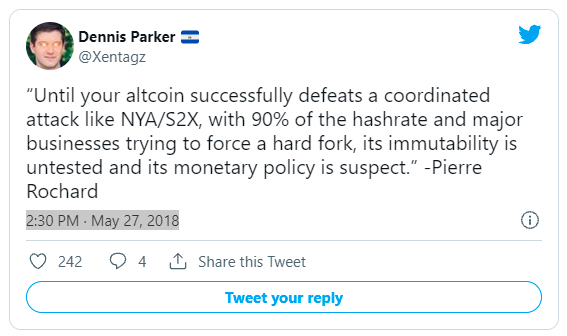
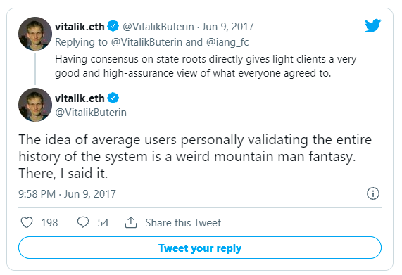
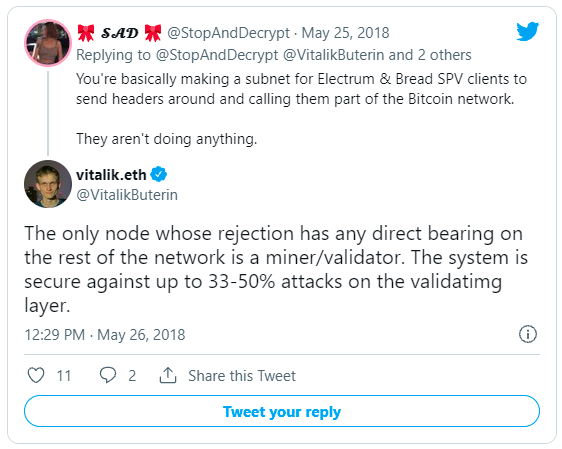
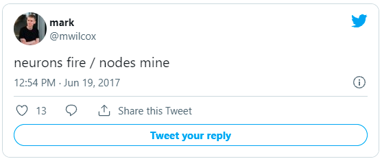
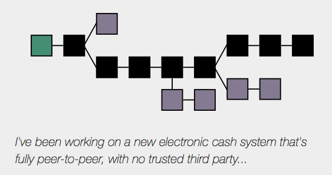
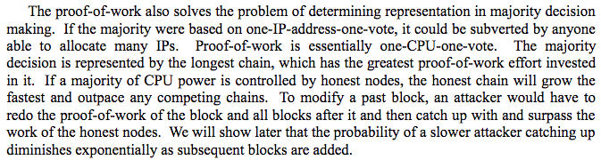
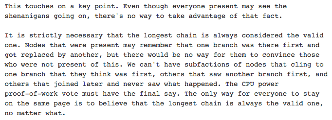
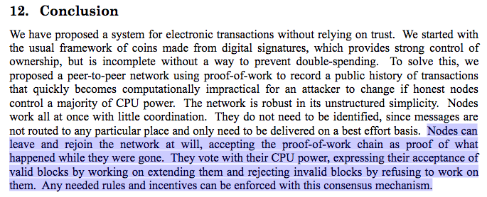
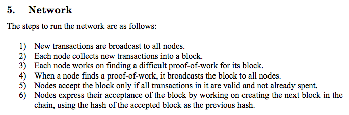
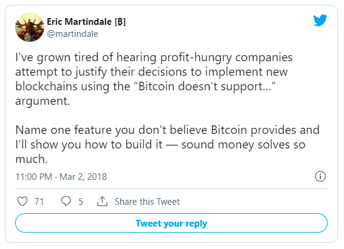

> *作者：Murad Mahmudov*
>
> *来源：<https://medium.com/@muradmahmudov/bitcoin-past-and-future-45d92b3180f1>*
>
> *原文发表于 2018 年 5 月。*
>
> *[前篇中文译本](https://www.btcstudy.org/2021/11/30/the-many-faces-of-bitcoin/)*

## 前言

本文是《[*The Many Faces of Bitcoin*](https://hackernoon.com/the-many-faces-of-bitcoin-1c298570d191)》的续篇。那篇文章讨论了有关比特币的四种思想流派，本文将通过讨论利弊权衡、社区内部的哲学分歧以及不同流派支持者预想的系统属性，来分析这些观点。

## 比特币作为一种货币

比特币给了我们重新发明黄金的机会，甚至让我们有机会重新设想数字化未来的货币。许多经济学家已经认为，在估量物品的价值时，以其 *货币性* 来衡量可以获得更准确的估价。根据这种思想，事物就不是非黑即白的，要么是货币要么不是货币；相反，许多东西都可以扮演货币，只不过某些东西比别的东西演得更好、更真。从许多角度来看，比特币都拥有很高的货币性。与黄金和无担保的纸币相比，比特币更易于携带，更便于长期保存，更容易分割，也更稀缺。

到今天为止，比特币最多也只能被认为是具有货币特性的数字商品。根据比特币神教（Bitcoin Maximalist）[对货币史的阐释](https://twitter.com/NickSzabo4/status/954225789129469952)，新形式的、更具稀缺性的货币，可能会沿着以下四种路径演化：

1. 收藏品
2. \+ 价值存储
3. \+  交易媒介
4. \+ 记账单位

“比特币是一种电子现金” 论调的支持者认为，效用先天比价值储存更重要，所以，比特币应该先获得交易媒介属性，也就是先得让比特币支付尽可能地便宜。

而对于那些相信比特币会变成未来的全球本位货币的人来说，他们会把比特币当前的价格波动归因于比特币正在慢慢变成货币，以及全世界认知的缓慢变化。在他们眼中，即使波动性巨大，比特币呈指数型上涨的长期价格走势，表明越来越多人相信，未来我们会生活在一个广泛采用比特币的世界里。

自认是[罗斯巴德主义者](https://www.mises.org/profile/murray-n-rothbard)的[奥地利学派](https://mises.org/what-austrian-economics)，比如作家 [Saifedean Ammous](https://twitter.com/saifedean)，则相信比特币的通缩属性和供给量硬上限使其成为了有史以来最健全的货币。他们相信，比特币（因为其固定的货币供给量）是唯一道德的货币，因此它能让个体实现最有效率的资本安排，让市场整体获得最有效率的价格信号。

这个流派中的许多人都反对部分储备金的银行制度，认为这就是一种欺诈。他们认为，比特币上不大可能出现一个部分准备金的银行系统，因为比特币不像黄金那样有物理实体、天然会产生集中保存的倾向。黄金的这种特性迫使我们必须通过中心化的机构来清算，也使得政府能够完全控制货币的供给、流通以及整个货币制度。政府的控制力非常大，连金本位也可以不要（而金本位是市场在几个世纪中自发选择的），还能引入没有任何商品背书的法币本位。

这个流派也认为，如果没有 “最后的贷款人”，部分储备金制度长期来看是不可持续的；但是比特币先天并不存在这种特性，人们以为不会愿意接受纸面比特币。

至于奥地利学派中的 “[自由银行派](https://www.alt-m.org/2015/07/18/hayek-and-free-banking/)”，比如 [George Selgin](https://www.hillsdale.edu/wp-content/uploads/2016/02/FMF-2014-Bitcoin-Problems-and-Prospects.pdf) 和 [Lawrence White](https://soundcloud.com/cryptovoices/show-40-lawrence-white-money-banking-bitcoin)，则相信比特币的严格供应量上限和最后贷款人缺位（从原理上来说）不会阻碍接受比特币的部分储备银行和实体形成竞争性的系统；在一个比特币成为事实上的货币本位的系统中，此类机构也不会绝迹。

很明显，比特币最起码有可能成为一种波动较为温和的电子商品，一种类似于数字黄金的价值储存手段。不过，人们依然对其能否跨越粗糙的价值储存角色、实现足够低的波动性、变成全球的交换媒介和记账单位心存怀疑。

有些人认为，因为严格无弹性的供应量，比特币短期来看不可能实现稳定的购买力，甚至永远不能，而人们希望自己每天都在用的通货能实现购买力的稳定。这些人对内置更灵活、更多自我调节机制的密码货币更感兴趣。举个例子，“[稳定币](http://juliankohtx.com/stablecoins-and-the-story-of-money/)” 就致力于让自身的市场价值铆定于另一种价值形式，比如美元或者一定重量的黄金。

还有人[认为](https://medium.com/@rextar4444/a-neo-gold-standard-bitcoins-optimal-use-case-62d7fbb2f76f)，尽管比特币的供应量严格无弹性，比特币仍然是 [John Nash](https://en.wikipedia.org/wiki/John_Forbes_Nash_Jr.) 所谓的 “[理想货币](http://personal.psu.edu/gjb6/nash/money.pdf)” 的完美解决方案。这个拿过诺贝尔经济学奖的教授在这个议题上思考了超五十年时间。他提议：央行应该根据一个无关政治的指数决定货币的通胀目标，以此实现所有国家货币的汇率稳定。一些人认为，为了应对对比特币的日益增长的需求，银行会将他们发行的货币与比特币的比价，作为货币价值标准化的一个基准。

## 通缩的死亡螺旋

主流的经济学家、凯恩斯主义者乃至货币主义的经济学家，都表达过对比特币的固定供应量的担忧。他们担心，如果比特币真的通过所谓的 “[超级比特币化](https://nakamotoinstitute.org/mempool/hyperbitcoinization/)” 成为主流货币，那它会面临严重的通缩压力。

他们的担心是，无法增加货币的供给，会使比特币的购买力以每年 2~3% 的速度增长，也即与全球经济产出的增长率同步。一些人则担心，通缩的经济体会降低眼前和近期的总需求，导致过量的储蓄和货币贮藏，然后减少消费、投资以及个人的创业活动。

奥地利派经济学家则认为，这种对通缩货币的恐惧是[杞人忧天](https://mises.org/library/deflationary-spiral-bogey)，所谓的 “通缩死亡螺旋” 是一种迷思。他们反驳凯恩斯主义者和货币主义者：这种支出的推迟不会无限持续下去，只是推迟到了未来。人们会拥有更低的时间偏好，而不是视手上的货币为烫手山芋，购买 “没用的东西” 只为了把手上持续贬值的货币花出去，他们会把注意力转向长期的生产力。

他们还认为，企业的利润不会受到影响，因为不仅产品的价格在下降，企业的成本也在下降，两者的下降幅度是一样的，所以企业的利润保持不变。奥地利学派认为，通货紧缩是一种完全正常的，如果没有对货币供应量的集中式控制，资本主义和技术进步都会自然导致通缩。在监管较少的数码产品行业，你就能观察到这种现象：硬盘、内存、计算能力的单价都在逐年下降。

根据奥地利学派的说法，*正是中央银行通胀式地印刷纸币* 加剧了经济衰退和商业周期，因为持续贬值的货币给公民制造了源源不断的焦虑和压力，最终导致了欠缺考虑的投资和支出，统称为 “不良投资”。这些不良投资本质上是无效率的资本分配，不可能导致个人富裕、社会繁荣、生产力和资本存量的增长。

## 全节点和矿工在 Bitcoin、Bitcoin Cash 网络中的作用

### **比特币扩展路径争议**

有关比特币应该如何扩容的争议非常激烈。所谓扩容，就是增加吞吐量，用人们常说的 “TPS（每秒处理交易笔数）” 来衡量。主要的争议就是[全节点](https://bitcoin.org/en/full-node)的运行成本应该定在什么水平，以及全节点和矿工在这个系统中应该是什么角色。

[据说](https://www.reddit.com/r/Bitcoin/comments/3giend/citation_needed_satoshis_reason_for_blocksize/ctygzmi/)，比特币的创建者中本聪在 2010 年 7 月，加入了区块体积不能超过 1 MB 的限制，作为一种抗 DoS（拒绝服务式攻击）的保护措施。这个 1 MB 的限制一直都存在，但区块从未饱和，直到 2017 年比特币网络上的交易量剧增。在这个限制引入的时候，1 MB 是区块平均体积的几百倍。

到了 2017 年 8 月，一个叫做 “隔离见证”（缩写为 “SegWit”，后文亦以此为简称）的升级在比特币网络中激活；该升级使得一个区块的体积可以超过 1 MB。让许多人惊讶的是，几乎同一时间，一个叫做 Bitcoin Cash（BCH）的比特币分叉从用户的不满中冒出头来，他们不满意比特币开发者的扩展路线图以及数字黄金理念（译者注：“分叉（fork）” 原本是个软件术语，表示复制代码并增加自定义的内容）。这个分叉的开发者很快把区块体积的上限提高到了 32 MB，还计划进一步提高这个限制。上限提高使得一个区块可以塞入更多交易，因此手续费也会降低，只不过运行一个全节点的成本会变得更高。

影响全节点运行成本的因素包括带宽、UTXO 集合的规模（如果你不熟悉比特币的 UTXO 概念，请看[这篇入门材料](https://www.safaribooksonline.com/library/view/mastering-bitcoin/9781491902639/ch05.html)）、所需的 CPU、内存和硬盘空间，这些因素都会被区块的体积影响。

而小区块的支持者则将这个体积限制视为维护系统去中心化属性的关键，因为它让任何人都能负担得起使用一个全节点来验证比特币区块链，并且能够发展出一个[手续费市场](https://medium.com/@jimmysong/the-fee-market-explained-76b294947b42)，让矿工在区块奖励下降时仍然能获得足够多的收入。

Bitcoin Cash 的支持者，所谓的 “大区块主义者”，则将区块体积的限制视为中心化的计划体制以共识规则的形式强加的人为限制。许多人都建议应该让矿工基于市场情形来选择自己愿意生产的区块大小。有别的一些区块链项目就是这么做的，比如以太坊，矿工可以[投票](https://www.etherchain.org/tools/gasLimitVoting)调整区块的 Gas Limit（这个参数的意义类似于比特币中的区块体积上限），每个块都可以浮动一定的比例。

### **“小区块主义者” （比特币）的观点**

> 全节点传播交易和区块，并对自己向网络（其他全节点）广播的内容作完整的验证，这既是在实施共识规则，也是在监控可能怀有恶意的矿工。
>
> 比特币的价值源于这个系统消除了对第三方的新人需要、能够抵御国家级别的攻击，以及它的抗审查特性。所有用户都能运行一个全节点的能力，对于维护这些特性来说，是至关重要的。
>
> 如果运行一个全节点的成本上升，能够负担验证和执行共识规则成本的用户的占比一定变少，因此（比例上）更多的用户就只能以信任他人的方式使用比特币，也即是依赖于其他人是诚实的，而不是依赖于系统整体上的健壮。
>
> 大区块最终会令只有数据中心才能负担得起全节点，也即增强中心化，把共识交到了更有限的主体手上，让比特币的停机风险增加，并在用户连接到其他节点的过程中导致隐私降级。
>
> 简易支付验证（SPV）客户端是一种轻量级的客户端，无需下载整个区块就能验证某笔交易是否在某个区块中，但它也做不到无需信任和完整的验证。

此时此刻，即使是低端的计算设备，如[树莓派](https://www.renewable-energy-now.org/2017/07/raspberry-pi-bitcoin-full-node-english/)，也能运行一个全节点。许多人都希望在未来，连智能手机也能运行全节点。

一个全节点为了能执行验证工作，必须广播自己在处理整个区块链历史时推导出的 UTXO 集合（代表全部比特币及其所有权信息）。这个 UTXO 集合可能会因为用户或工资合并交易输出而缩小，但[从事实来看](http://statoshi.info/dashboard/db/unspent-transaction-output-set)，它是随着时间推移而稳定增加的，体积可以增长到无限大。

将区块链主要用作链下交易的结算层、利用技术升级来优化数据空间的使用效率，UXTO 集合可以得到高效得多的管理，区块广播的时延和新节点的初始同步时间都可以降低，而运行全节点的带宽、CPU 算力、内存和硬盘负担，也能保持尽可能低的水平。

虽然矿工是唯一能够生产新的候选区块的群体，但却是自利的全节点的运营者，通过拒绝无效的区块来发出信号、为矿工生产有效区块建立激励因素。如果矿工生产了无效区块，比如按照与网络其余部分所定义的共识规则不一致的规则来生产区块（例如，篡改新比特币的发行率或者更改比特币的数量上限），全节点可以自动忽略这个区块，即使大部分的算力都接受这个区块也没用。

全节点拒绝无效区块和免信任低验证交易的能力，是践行那句名言 “Don't Trust, Verify（不要信赖，自己验证）” 的基础 —— 这就是为什么全节点被视为与网络一体，而矿工是服务这个网络、赚取收益的人。

这不是说矿工没有任何控制权。全节点运营者和矿工壮大了这个系统的不同方面，只不过拥有不同的角色。矿工可以选择把哪些交易打包进区块（追求利润最大化的矿工会把给出最高最高手续费的交易打包进区块）以及生产新区块，而商户和其他全节点运营（包括矿池节点运营商）会检查区块和交易的有效性，共同实施共识规则。

2017 年的一场用户激活软分叉（UASF）[事件](http://www.uasf.co/)表明，运营全节点的用户也可以推动矿工激活 SegWit，即使那时只有少数矿工发出信号表示自己支持升级。

### **“大区块主义者” （Bitcoin Cash）的观点**

Bitcoin Cash 的支持者追求的是不设限的区块大小，他们也不认为保证全节点能低成本运行这件事有多重要。他们声称，比特币最好的形态，就是中本聪一开始在白皮书、博客和邮件里描述的版本。他们认为，中本聪把矿工当成是网络的全部、共识问题应该完全交给算力来解决。

一些大区块主义者相信，用户只需发送交易，不需要运行全节点；但也有一些人建议，应该根据带宽增长的 “[尼尔森定律](https://www.nngroup.com/articles/law-of-bandwidth/)” 来[逐步](https://web.archive.org/web/20150213020502/https://blog.bitcoinfoundation.org/a-scalability-roadmap/)提高区块体积的上限，让用户能够以 “合理”  的计算能力和带宽连接来继续运行全节点。

> 矿工的可追责性源于他们的利润最大化倾向以及博弈机制下的市场激励。矿工永远不会勾结，因为他们彼此直接竞争，都希望抢先发现新区块并获得比特币奖励。
>
> SPV 的安全模型对终端用户来说已经足够了，而全节点只是没有能力的、挖矿网络的被动观察者。全节点只对企业（比如支付服务商提供 0 确认交易的服务）以及需要默克尔证明的 SPV 客户端有意义。
>
> 货币政策之外，比特币没有不可侵犯的共识规则，应该允许让市场来决定其[走向](https://www.bitcoinunlimited.info/emergent-consensus)。

引自 [Mark Wilcox](http://markwilcox.com/articles/03/)：

> “工作量证明的整个用意就是节点是信不过的。我们能够相信的唯一的东西就是出块的难度，以及每个参与者的经济利益。这也意味着，很重要的是，‘每个人都有责任’ 不代表 ‘每个人都要做所有的事’。从集体来看，我们需要保护这个网络。但奖励贡献算力的节点正是为了将其他人从不得不担心对货币政策的攻击以及拒绝服务攻击的处境中解放出来。“

BCH 的支持者将去中心化等同于矿工的竞争和网络拓扑，而不是全节点的成本。他们反对 SegWit 升级，而 BCH 就是他们的回应。他们所鼓励的链上应用，比如社交媒体网络 [Memo](https://memo.cash/)，会被小区块主义者视为滥用区块链；后者认为，这些应用应该部署到更高层级的系统中（而不是部署到链上）。

## **理解 “中本聪的初衷”**

**“小区块主义者” （比特币）的观点**

BTC 支持者认为，拿中本聪说过的话说事是诉诸权威的逻辑谬误，而且中本聪不再重要了。

> "但见真神，即应杀之。"

他们一般将 BCH 的支持者称为比特币白皮书的 “原教旨主义者”，是一群没法接受比特币自创生以来有机演化的人。他们认为 BTC 比 BCH 要优越得多、去中心化得多，因为全节点可以参与 P2P 网络治理机制（[**不是**民主参与](https://medium.com/@beautyon_/democracy-has-nothing-to-do-with-the-way-bitcoin-works-it-is-a-political-system-where-a-group-of-efb37a627415)）。

许多人认为 BCH 是一个[诈骗](https://hackernoon.com/thats-not-bitcoin-that-s-bcash-f730f0d0a837)项目，是一群领头的人想要取代比特币的品牌、建立一个中心化的、由矿工控制的系统，而搞出来的项目，这样的系统也是需要信任第三方的。

中本聪对区块体积的最后一番意见表达于 2010 年 12 月，是在一个关于 BitDNS 的[讨论帖子](https://bitcointalk.org/index.php?topic=1790.msg28917#msg28917)里面。BitDNS 提议使用比特币作为域名的发行层，最后创造出了一条与比特币合并挖矿的区块链，叫做 “[Namecoin](https://www.namecoin.org/)”。

> “BitDNS 的用户可能会随心所欲地添加任何大型的数据特性，因为只有少量的域名需要注册；但是比特币的用户可能会在限制链的体积上越来越专横，以保证大部分用户和小型设备仍然能参与区块链。”

在这里，中本聪意识到了可扩展性可能引发的争论，并认为限制区块链体积的做法可能更得人心。

因为 UASF、市值和算力等原因，Bitcoin Cash 没有如愿以偿获得 Bitcoin 的名头。相反，Bitcoin Cash 硬分叉创造了一个新的网络，而 SegWit 则发生在用户仍然运行比特币客户端的原网络中。

### **“大区块主义者” （Bitcoin Cash）的观点**

BCH 的支持者宣称 “Bitcoin Cash 才是真正的比特币”，因为他们相信比特币的设计就是在链上扩容，不会让 “不挖矿的全节点” 限制系统的吞吐量，他们指出，中本聪在自己的言辞中一直用 “node（节点）”  来指称矿工。

引自中本聪：

> “只有尝试创建新货币的人才需要运行节点。一开始，大部分用户都会运行节点，但网络成长到超过一定体量之后，运行节点的任务将越来越多地交给定制化硬件所组成的服务器集群的专家。”
>
> “现在这个系统，每个用户都要运行节点，这种设计本身是不利于大规模扩展的。未来可能是每个 Usenet 的用户运行自己的 NNTP 服务器。这样的设计让用户可以只做用户，不管其他。运行节点的负担越大，节点就会越少。而这些少数的节点都会是大型的服务器集群。”

BCH 的支持者认为，小区块主义者是在扭曲比特币项目，使之成为一个靠区块全满来收集高昂手续费的结算网络。一些人认为，Bitcoin Core 的开发者成功地洗脑了大家对工作量证明博弈机制的理解，因为他们将中本聪对 PoW 的描述[解释](https://www.reddit.com/r/btc/comments/5zawlw/satoshi_whitepapers_longest_chain_is_bitcoin_rule/dewpjza/)为挖矿只是一种共识机制。

BTC 的支持者强烈[反对](https://www.reddit.com/r/Bitcoin/comments/5j6758/myth_nakamoto_consensus_decides_the_rules_for/dbe7kbb/)这种 “矿工控制共识规则” 的观点。他们指出，即使是在[最初版本](https://github.com/trottier/original-bitcoin)的节点软件中，最长链规则也只用来解决使用同一套共识规则的多条链之间的分歧，而节点可以自己选择挖矿与否。

## SPV 节点的角色

与全节点相对、轻量级的比特币客户端软件叫做 “SPV（简易支付验证）” 客户端。SPV 客户端让用户可以连接到一个乃至多个节点，确定最长的 PoW 链上的最新区块，并从全节点处获得[区块头](https://bitcoin.org/en/developer-reference#block-headers)（每个区块都有的、体积为 80 字节的元数据）。

一如在白皮书第 8 节所说的，用户可以获得默克尔证据来确认，某笔交易已经打包到了某个具备有效区块头和工作量证明的区块中。后续的确认（即这个区块后面产生了新的区块）则证明了链条在继续生长。

SPV 客户端单靠自己无法验证区块和共识规则，所以他们必须信任自己所连接到的节点做了验证工作。

理论上，有些方法可以提高 SPV 安全性，其中一种是中本聪在白皮书里提出的，允许节点在侦测到无效区块时向 SPV 节点发出警报。欺诈证明（fraud proof）可以用最少的资源证明这些无效资源的存在。虽然今天人们还没实现欺诈证明技术，SegWit 使得这种技术有可能以[软分叉](https://en.bitcoin.it/wiki/Softfork)形式整合到比特币中。软分叉是与旧的客户端后向兼容的变更，可以收紧或者增加新的共识规则规则。

## 隔离见证

比特币在 2017 年激活了名为 “隔离见证（SegWit）” 的软分叉，这是多年的扩展路线辩论的结果。它本身主要是为了解决交易不定形（malleability）的问题，但也增加了可以容纳交易的空间、为未来更容易通过软分叉实现升级铺平了道路。

### **什么是 “交易不定形” 问题？**

在 SegWit 实施之前，比特币交易是存在不定形（可以改变）的部分的。举个例子，节点转发交易或者矿工把交易打包进区块时，可以在交易的[签名](https://bitcoin.org/en/developer-guide#term-signature)中加入额外的数据。这会改变交易的 ID（标识符），因为 ID 是整个交易（包括签名）的密码学哈希值。

虽然其它的计算机软件中也有不定形问题，但在比特币网络中，在交易广播到网络中之后改变交易的 ID，会让钱包软件无法用 ID 跟踪这笔交易、用户无法执行特定的交易类型，开发者也无法开发出某些智能合约。

举个例子，一笔有效的交易可以花费一笔尚未上链确认的输出，能跟这笔被花费的交易放在同一个区块中。但如果未确认交易的 ID 是不定形的，那即使第一笔交易可以被打包到区块内，（使用第一笔交易的输出的）第二笔交易也可能是无效的，因为它包含了一个无效的 *Previous tx（前序交易）* 属性。

矿工，全节点和用户可以自己选择是否使用 SegWit，因为它是个软分叉。截至 2018 年 3 月，使用 SegWit 输入的交易大概有 [35%](https://transactionfee.info/charts/payments/segwit) 的比重，而支持 SegWit 的节点占到了 [99%](https://luke.dashjr.org/programs/bitcoin/files/charts/segwit.html)。

*本章节剩下的部分非常专业，如果你不熟悉比特币，可以直接跳到下文的 “比特神教” 章节*。

Witness 数据指的是签名（signature）和解锁脚本（unlocking scripts）。SegWit 实施后，矿工会 “把 witness 数据隔离在交易之外”，做法是把 witness 数据放到一棵专门的默克尔树上，叫做 “witness 默克尔树”，类似于交易默克尔树（默克尔树这种数据结构用在区块中原本是为了保持交易和区块的关联）。这个 witness 哈希值会保存在 coinbase 交易中（这笔交易是用来给矿工增发比特币的）。因此，SegWit 交易的签名仍然 “包含” 在区块中，因为 coinbase 交易会影响到存储在区块头中的交易默克尔树根哈希值。

如果矿工决定不升级到 SegWit，他们就没法在区块中打包使用 SegWit 输入的交易，因为对他们（的节点）来说，这些都是不标准的交易，虽然他们仍然可以收到删去了 witness 结构的 SegWit 交易。

**SegWit 升级的内涵**（欲了解更多细节，可看 《[SegWit benefits](https://bitcoincore.org/en/2016/01/26/segwit-benefits/)》：

- 使用区块重量（block weight）标准，弃用区块体积（block size）度量。实施 Segwit 之后，区块的容量上限为 40 万重量单位（WU）。放在原本的区块结构中的数据，每 1 字节重 4 WU，而 witness 结构中的数据，每字节仅重 1 WU。想了解更多，见 《[Understanding Segwit Block Size](https://medium.com/@jimmysong/understanding-segwit-block-size-fd901b87c9d4)》。
- 比起传统的 UTXO，SegWit 的 UTXO 体积缩小了，因为移走了 witness 数据的体积，整体上缩小了 60% ~ 75%。Witness 结构的数据可以获得重量计量上的折扣，是为了激励人们为 UTXO 集合的体积增长负起责任：使 UTXO 集合增大更多的，应支付更多的交易费，而使用 SegWit UTXO 帮助节约了体积的，在发起交易时只需支付更低的手续费。
- 区块中可容纳的数据量会随着区块内 SegWit 交易比例的提高而提高。我们[已经看到](https://www.smartbit.com.au/block/0000000000000000001bbb529c64ddf55edec8f4ebc0a0ccf1d3bb21c278bfa7)的最大区块达到了 2.1 MB.
- 支付通道（比如闪电网络）可从不定形漏洞的修复中获得好处。
- 修复了 Sighash 操作的平方级膨胀（quadratic scaling）问题。
- 启用了带校验和的 [Bech32](https://www.youtube.com/watch?v=NqiN9VFE4CU) 地址格式。
- 引入了 Script 版本，未来的软分叉升级会更加容易。比如 SPV 欺诈证明、[Schnorr 签名和签名聚合](https://bitcointechtalk.com/scaling-bitcoin-schnorr-signatures-abe3b5c275d1)、[默克尔抽象语法树](https://bitcointechtalk.com/what-is-a-bitcoin-merklized-abstract-syntax-tree-mast-33fdf2da5e2f)（可以压缩数据并进一步提高链上吞吐量）以及[机密交易](https://www.elementsproject.org/elements/confidential-transactions/investigation.html)。
- 让没确证存在的 [ASICBoost](https://blog.bitmex.com/an-overview-of-the-covert-asicboost-allegation-2/) 无效（虽然一开始[有人](http://www.truthcoin.info/blog/asicboost-worthless/)否认了 ASICBoost 的有效性）。

**下面是一些反对 SegWit 的意见**：

- [一些用户](http://thebitcoin.foundation/)希望比特币的开发者尽可能少改动中本聪的代码库
- SegWit 以及闪电网络并不能解决扩展路线的争议，因为用户永远会争议全节点的运行成本应该定在哪里。
- SegWit 强制扩大了区块，因此它是一个 “[邪恶的分叉](http://www.truthcoin.info/blog/forks-and-splits/)” 或者说 “[强迫的分叉](https://petertodd.org/2016/forced-soft-forks#radical-changes)”。
- 把新的 Bech32 地址格式推给用户会破坏原来的地址格式上好不容易建立起来的网络效应。
- 矿工可以在[反 UASF 运动中](http://www.truthcoin.info/blog/uasf-contradiction/)审查 SegWit 交易：不打包任何包含 SegWit 输入的交易。这在技术上是完全有可能做到的。
- 全球最大的比特币挖矿 ASIC 硬件制造商比特大陆（Bitmain）的 CEO 吴忌寒[声称](https://twitter.com/JihanWu/status/868896110760181760) SegWit 交易靠 witness 数据重量打折实现的低交易费是 “不公平的”。

## 比特神教

比特币至上主义者也有不同的风格，但他们一般都认为，比特币是最好最安全的区块链、拥有最大的网络效应、最可取的货币政策，以及一种支持进一步开发的高性能脚本语言。

Bitcoiner 普遍认为，“token economy（代币经济）” 的提法反映了一些人对货币系统的根深蒂固的误解，而 [tokens 与狗皮膏药无异](https://nakamotoinstitute.org/mempool/appcoins-are-snake-oil/)。他们坚决否认未来的世界会有 1 万种密码货币，认为那样跟物物交换没有区别 —— 而物物交换正是货币要消灭的现象。他们认为，价值会累积在人们持有的货币上，而不是累积在人们交易的货币上，而长尾代币会面临极为严重的高波动，使它们几乎没有增值、只会变成没有必要的摩擦，最后完全被甩出去。

## 高层系统与 Alt-coin（另类币）

许多 bitcoiner 认为，[alt-coins](https://nakamotoinstitute.org/mempool/the-problem-with-altcoins/)（比特币以外的密码货币）都只是功能的试验场，如果一个功能足够好，最终就会被集成到比特币上。

理论上来说，你可以[复制几乎任何区块链的设计](http://www.drivechain.info/faq/index.html)，也包括[大区块的链](http://www.truthcoin.info/blog/gigachain/)，作为比特币的侧链。Paul Sztorc 的 [Drivechain](http://www.drivechain.info/) 构想，就是让这些区块链能够利用比特币的挖矿安全性，虽然它需要软分叉，并且尚待更充分的同行评议。

有三个大类的变更，是几乎永远不可能集成到比特币基础层的：

- 替代**中本聪共识**的共识机制，比如权益证明机制（包括 [Tendermint](https://tendermint.readthedocs.io/en/master/introduction.html#what-is-tendermint)、以太坊的 [Casper](https://arxiv.org/pdf/1710.09437.pdf)、DFINITY 的 [Threshold Relay](https://dfinity.org/pdf-viewer/pdfs/viewer?file=../library/threshold-relay-blockchain-stanford.pdf)）、Chia 的 [Proof-of-Space](https://eprint.iacr.org/2017/893.pdf)、EOS 的[委托权益证明](http://bytemaster.github.io/bitshares/2015/01/04/Delegated-Proof-of-Stake-vs-Proof-of-Work/)、Algorand 的[权重权益证明](https://eprint.iacr.org/2018/377.pdf)，还有 Ripple 和 Stellar 的[联盟拜占庭共识](https://www.stellar.org/blog/stellar-consensus-protocol-proof-code/)。（译者注：共识机制名字前面的是使用这些机制的项目的名称。）
- 取代**区块链**的替代性数据结构，比如 Coda 的 “[简洁区块链](https://codaprotocol.com/static/coda-whitepaper-05-10-2018-0.pdf)”、DAGlabs 和 HashGraph 的 [DAG](https://www.daglabs.com/) 和 Nano 的 [block-lattice](https://nano.org/en/whitepaper)。
- 全节点 P2P 网络治理以外的**治理机制**，比如 [Decred](https://voting.decred.org/) 和 [Tezos](https://tezos.com/) 的链上治理机制，Dfinity 的 [Blockchain Nervous System](https://medium.com/dfinity/the-dfinity-blockchain-nervous-system-a5dd1783288e) AI 治理，和 Bitcoin Unlimited 的[矿工投票](https://www.bitcoinunlimited.info/solutions/miners)。

Bitcoiner 常常[质疑](https://download.wpsoftware.net/bitcoin/pos.pdf)权益证明机制，在这种机制中，验证者以提议和投票选出区块，而不是去解决需耗费大量电力才能解决的密码学难题。他们相信，应该用[对待核设施软件同样的谨慎](https://medium.com/@hugonguyen/proof-of-stake-the-wrong-engineering-mindset-15e641ab65a2)来对待比特币软件，而 PoS 由于其 “主观性” 特性（网络的参与者需要主观信息比如社会信息来判断主链），是不够格的。这个特性迥异于 PoW 的客观性，节点只需观察最重的 PoW 链就必然会得出跟网络中的其他节点相同的状态。

许多人认为 PoS 就是法币系统的翻版，而 PoS 的验证是反竞争的，跟现实世界里的价值也没有任何关联，与挖矿截然相反。

同时，PoS 的支持者已经 [“学会了爱上” 弱主观性](https://blog.ethereum.org/2014/11/25/proof-stake-learned-love-weak-subjectivity/)并致力于通过对验证者经济惩罚威胁来模拟 PoW 的安全性（罚没不诚实验证者的保证金）。他们认为 PoW 纯粹是能源的浪费，并认为设计出比 PoW 更安全、更去中心化、出块更快、更灵活的 PoS 协议是有可能的；而 PoW “受制于”物理世界的特性，不可能与 PoS 相比。

在分布式系统领域，中本聪共识偏重活性（可用性）而非安全性（一致性），并实现了交易的概率性终局性 —— 交易的终局性在上链后会随着后续区块的增加而增加。

现在，以 Casper PoS 机制为例，它实现的是 “经济终局性”（在验证者都支持某个区块的时候），并牺牲了一些可用性。因为终局性要求[网络通信时间有上限的假设](https://medium.com/@Vlad_Zamfir/the-history-of-casper-chapter-3-70fefb1182fc)，理论上，异常情况可以造成网络分区、或者让整个网络停机，时长超出这个预设的验证者响应时间上限。

网络分区和完全停机可能会导致一些分区缺乏用来达成共识的大多数投票，或者使整个网络无法选出一条有效链，最终以需要人力干预的活性或者安全性错误收场。但在 PoW 机制中，网络分区只会产生短暂的分叉链，随着分区恢复，最重链规则下短分叉会自然消亡。

有一种压倒性的共识是，不应该在比特币基础层上做实验，而且基础层的变动越少越好，而且支付网络和侧链不能以牺牲基础层为代价来发展。一些用户则狂热相信高层系统能够释放比特币在未来的应用。

主要观点是，我们应该拥有一个非常去中心化、非常安全的基础层，用这个基础层为在比特币基础上建立的、稍微没那么安全的协议提供安全性。

### **闪电网络**

闪电网络的支持者认为它是比特币当前的的扩容问题最可行的解决方案，允许用户使用点对点的支付通道和智能合约、近乎无限制地转账，同时使用比特币的主链做偶尔的清算。

尽管闪电网络的概念在三年前才形成，现在 beta 才推出几个月，已经可以看到围绕闪电网络的创新浪潮，比如 [Dual-Funded Channels](https://github.com/lightningnetwork/lightning-rfc/pull/184)、[潜水艇互换](https://submarineswaps.org/)、“通道拼接” 和 “通道工厂”、瞭望塔、[Eltoo](https://blockstream.com/2018/04/30/eltoo-next-lightning.html)、原子化互换，[等等](https://bitcoinmagazine.com/articles/future-bitcoin-what-lightning-could-look/)。

一种常见的担忧是 Layer-2 协议会降低矿工的收入，因为更多的交易在链下发生了。Scaling Bitcoin 2017 大会上[发表](https://scalingbitcoin.org/stanford2017/Day2/HowToChargeLightning_ScalingBitcoin.pdf)的[初步研究](https://arxiv.org/pdf/1712.10222.pdf)表明，虽然一开始会有负面影响，但闪电网络的用户达到 2000 万之后，矿工的收入反而会提高。

有必要提醒一句，闪电网络现在还是一个非常新的、未经考验的、不成熟的系统。不过，许多开发者相信，它能极大地提高比特币的吞吐量，支持便宜的小额支付，为比特币成为高效的交换媒介和真正的全球货币铺平道路。

至少至少，闪电网络占据了一个小众市场，因此就其自身是有价值的。而往大了说，我们还没穷尽闪电网络的全部好处。

## 结论

比特币是最早、存在时间最长的密码货币，也拥有最多的算力、网络效应、流动性、市值，甚至最多的 “囤币者”。这篇文章尝试列举所谓的 “小区块派” 和 “大区块派”在贯穿比特币的过去和未来近期的著名的变更、里程碑和辩论中的立场。

这种数字货币的开源、全球化和去中心化的属性使得整个系统的治理更加复杂，即使是微小的变更也会引起争议。在比特币的 10 年历史中，比特币和其他密码货币作为一种资产类别，开始挑战贵金属作为实质价值存储资产的定位，也挑战着现有的全球支付设施和机制。我们相信，比特币及其精神后代的未来是光明的。

（完）
