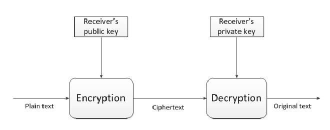

> *作者：musclesatz*
> 
> *来源：<https://www.musclesatz.com/articles/bitcoin-past-present-future/>*

在本文中，我准备讲讲跟比特币有关的最重要的事实、比特币协议当前的情况以及未来可能的开发方向。如果你想了解更多，你可以听听 Giacomo Zucco 主持的播客 [Il Priorato del Bitcoin](https://priorato.org/) 。

求道之心伴随宽容的美德（The priory is benevolent）。

> **注 1**：本文的第一部分讲述的是比特币的史前史，也包含了许多重新梳理比特币协议的起源的文章、论文、书籍和访谈。虽然读起来会有些枯燥，但对于理解比特币诞生的背景和理由，都有重要意义。就我个人而言，我认为这部分非常迷人。因此不推荐你跳过。

> **注 2**：为了让解释更简单，我将以 “简化” 的方式处理一些材料。如果我必须解释每一个小细节（例如建立在有限域上的椭圆曲线），文章会变得很长，重点也会迷失。请记住，有些陈述你只能接受它作为行文的假设，至于它本身的真假，你当然可以自己验证，只要你愿意。

> **注 3**：最后一部分处理的是 LNP/BP（闪电网络协议/比特币协议）未来的开发方向，它是完整的，也是自洽的，但考虑到最近几个月新出来的材料的数量，我计划大修大补一番。

请支持我！如果你想支持我的工作，你可以访问这个[捐赠](https://musclesatz.com/support-me/)页面，里面也介绍了比特币社区中我最看重的人。每一笔资助，无论是大是小，都会帮助我花更多时间在写作、回顾和更新这些文章上。谢谢！

## 步步回首

比特币是在 2008 年诞生的。但事实上，它是计算机领域数十年的学习和研究的结果。为了更好地了解比特币的起源，我们必须回到 1933 年。这段历史满是重大事件，为了理解我们今天的位置，我们必须花上一些时间。

### 从 1930 到 1940

1933 年，Franklin Delano Roosevelt（富兰克林·德拉诺·罗斯福）签署了 [6102 号行政令](https://en.wikipedia.org/wiki/Executive_Order_6102)，禁止私人使用直接形式的货币（例如金杜布隆（doubloons）和金币）和间接形式的货币（例如代表抵押品的银行票据和金块）。那时候，美国的通货膨胀非常严重，联邦财政正在崩溃，经济形势也很困难。因此，政府没收了所有公民的黄金。这件事对理解比特币的历史极为重要，因为这件事情发生在所谓的 “*自由大陆*”、宪政自由民主政体的故乡，而不是在北朝鲜。

> 一个奇怪的事实是，中本聪将自己的出生日期写为 1975 年的 4 月 5 日：4 月 5 日正是罗斯福签署 6102 号行政令的时间，而 1975 年是 Gerard Ford（杰拉尔德·福特）总统取消这一行政令的时间。

> 比特币的[难度调整算法](https://en.bitcoin.it/wiki/Difficulty)是每 2016 个区块发生一次，这个数字正是上述行政令的编号（6102）的倒序。（难度调整算法的含义我们后文有述。）

时间跳到 1936 年，年轻的 Alen Turing（艾伦·图灵）发表了一篇名为 “[论可计算的数字以及可判定性的运用](https://www.cs.virginia.edu/~robins/Turing_Paper_1936.pdf)”，为现实中的 `信息革命` 奠定了理论基础；而如果没有信息革命，比特币当然就不可能产生。不久之后，1938 年，第一台使用电磁脉冲（electromagnetic pulses）的计算机，叫做 “[鱼雷数据计算机](https://en.wikipedia.org/wiki/Torpedo_Data_Computer)”，在一艘潜水艇上制造出来。虽然它只能执行三角函数的计算，远远不是我们今天日常使用的这种 `通用` 的计算机。1939 年，第一台电子计算机诞生，叫做 “[Z2](https://en.wikipedia.org/wiki/Z2_%28computer%29)”，是由一名德国工程师制造的，不过，关于这台计算器的实际作者是谁，还有一些争议。

### 从 1970 到 1980

在 1971 年，另一个重大事件发生了，人们后来称作 “[尼克松冲击](https://en.wikipedia.org/wiki/Nixon_shock)”。因为越南战争和普遍的衰退，美国联邦政府需要钱，而 Richard Nixon（理查德·尼克松）决定暂停美元与黄金的汇兑。

在此之前，整个世界的经济体系都基于这样一种方案：所有国家的法定货币都可以兑换成美元，而且各国的中央银行都承诺可以将本国货币兑换成美元，而美国央行则承诺可以将美元兑换成黄金。

尼克松声称要保护美元不受投机者的攻击，在电视直播上宣布美元跟黄金的兑换将 `暂时停止`。但现在是 2022 年了，尼克松的禁令依然在全面执行。

- - -

从经济学中抽身，我们回到技术。1974 年，Cerf 和 Kahn 发表了一份题为 “[分组网络互通协议](https://www.cs.princeton.edu/courses/archive/fall06/cos561/papers/cerf74.pdf)” 的研究，这份协议允许多个计算机网络连接在一起，也就是我们今天所知的 IP（互联网协议 Internet Protocol）。

- - -

在 1976 年，研究院 Diffie（迪菲） 和 Hellman（赫尔曼）发表了论文《[密码学的新方向](https://ee.stanford.edu/~hellman/publications/24.pdf)》。

在此之前，加密程序使用的都是对称的密钥，其运作流程如下（举个例子）：

- Alice 写出了她想发送给 Bob 的明文，现在她想对这份明文加密；
- Alice 将信件中的每一个字母都换成其在字母表上前 7 个位置的字母，使得文字变成没有逻辑含义的字母块；
- Alice 把密文发送给 Bob；
- 为了恢复出原文，Bob 必须把每一个字母都换成其在字母表上后 7 个位置的字母，这样就能找回 Alice 的明文。

（译者注：这是西方历史上流传久远的 “凯撒密码法”，即把每一个字母都换成另一个字母，并且替换关系就表现为字母表上的相对位置：假如 A 会全部替换成 D，那么 B 就会全部替换成 E，以此类推。在这里，3 就是用于加密和解密的密钥。）

在 1976 年以前，所有的密码系统都是这样的（对称的），也是不安全的，因为它们基于这样一个概念：“拿着密钥往一个方向运算（从明文到密文）” 跟 “拿着同一个密钥执行反方向运算（从密文到明文）” 是同样容易的（或者说同样困难的）。（译者注：因为加解密用的是同一个密钥，解密步骤跟加密步骤正好相反。）

而在迪菲和赫尔曼建构的 “密码学的新方向”（非对称密码学）中，“拿着密钥往一个方向运算（从明文到密文）” 依然非常容易，但 “使用同一个密钥执行反方向运算（从密文到明文）” 却近于不可能。

非对称加密的例子：

- 参与密码学交换的双方各有两个密钥，一个是公开的，一个是私密的；
- Alice 生成一个私钥；
- Alice 运用数学，确定性地计算出跟这个私钥相关联的公钥；
- Alice 可以把公钥发给任何人；
- Bob 想要加密跟 Alice 的通信，他可以使用 Alice 的公钥，让文本变得没法阅读（即加密）；
- 而密文只能用 Alice 的私钥来解密。

- 非对称加密的例子 -

两年之后，1978 年，Rivest（李维斯特）、Shamir（沙米尔）和 Adleman（阿德尔曼）发表了题为 “[一种获得数字签名和公钥密码系统的方法](https://people.csail.mit.edu/rivest/Rsapaper.pdf)” 的研究。这三位作者提出了一种算法，在实质上使 1976 年引入的非对称密钥密码学成为可能，它是基于质数的。

质数有一种重要的特性：如果我让你把数字`3` 和 `5` 相乘，你很容易给我答案；但如果我问你像`15` 这样的数的质因数，那算起来可就复杂得多了。你可能会认为，显然 `15` 的质因数就是 `3` 和 `5`，但要是我问你的是一个非常大的数字，那你求解就不是那么容易了，因为没有可以接近这类问题的简单算法。

同年，诺贝尔经济学奖得主、奥地利学派经济学的代表认为 F.A. Hayek（F.A.哈耶克）出版了一本影响力很大的书，名为 “[货币的去国家化](https://iea.org.uk/wp-content/uploads/2016/07/Denationalisation%20of%20Money.pdf)”。哈耶克非常反对国家对货币的垄断；在他看来，国家垄断的货币 “以前在人类历史上从未存在过”。根据哈耶克的思想，全面垄断是破坏性的，而他的提议是，货币应该回到由市场参与者来发行（以及选择），杜绝任何形式的、可以产生腐败和系统性风险的集中化。

某种程度上，哈耶克预言了比特币的完美概念 : )

视频：https://youtu.be/s-k_Fc63tZI

1979 年，数学家 Claus P. Schnorr（克劳斯·施诺尔）为默克尔树的想法申请了专利。（译者注：此处应有事实性错误。为默克尔树申请专利的是 [Ralph Merkle](https://zh.wikipedia.org/wiki/%E7%91%9E%E5%A4%AB%C2%B7%E5%A2%A8%E5%85%8B)（拉尔夫·默克尔），默克尔树的提出者。）简单来说，默克尔树的基本概念就是设计一种结构来验证一个数据集的完整性。其工作流程是将数据分成许多小块，然后为这些小块配对，并为这些数据对计算其哈希值（一种独一无二的、不可预测而且不可逆向计算的数值）。这样的步骤会不断重复（因为得到的哈希值可以继续配对、继续生成哈希值），直到所有的小块都蕴藏在一个根值中，叫做 `默克尔根`，这个根值就总结了所有的小块。

当你想要检查一个数据集的完整性的时候，只需要检查每个小块的哈希值，并检查它们是否跟默克尔树的值相等，即可。如果某个小块的哈希值与默克尔树上的有所不同，那就意味着这个小块已经被改过了。此外，默克尔树是非常高效的，因为它只需要少量的硬盘空间，而且允许数据的完整性得到验证，哪怕数据已经分散成了小块、分散到了网络中。

### 1980 到 1990

在 1980 年，Samuel Konkin III 发表了《[新自由意志主义宣言](https://en.wikipedia.org/wiki/New_Libertarian_Manifesto)》，在该文中他倡导一种激进的思想：

> *“光叙说自由的美丽和统治的丑陋是不够的，我们还必须采取务实的行动，开发出能够抵御统治的技术工具。”*
>
> —— Samuel Konkin III

这种思想后来被 “密码朋克” 运动继承了。

1981 年还发生了另外两个重大事件：

1. 互联网协议（IP）发行了第四版（IPv4）。有趣的是，直到 2022 年，这个过时的版本依然在服役（比如你阅读本网站，就借助了 IPv4），即使互联网早已成为了现代社会的骨架；
2. David Chaum（大卫·乔姆）先生设想了一种使用数字假名、无法追踪的电子邮件协议，并出版了《[不可追踪的电子邮件、返回地址以及电子假名](https://chaum.com/wp-content/uploads/2022/09/UNTRACEABLE-ELECTRONIC-MAIL-RETURN-ADDRESSES-AND-DIGITAL-PSEUDONYMS-tech-report.pdf)》。这份文件非常重要，因为他标志着使用非对称密码学来签名消息（而非加密文本）的用法的开端。

为了更好地理解这种数字签名技术与非对称加密技术的区别，我们举这样的一个例子：

- Alice 发送一条消息给 Bob，并希望证明她是这条消息的发起人；
- Alice 使用自己的私钥签名这条消息；
- Alice 把明文和使用自己的私钥 “加密” 过的密文（译者注：即签名）都发送给 Bob；
- Bob 知道 Alice 的公钥，所以他可以使用 Alice 的公钥 “解密” Alice 给他的密文（译者注：即验证签名）
- 如果 Alice 真的使用她的私钥签名了这条消息，那么明文将与密文具有一致性（译者注：即 Bob 的签名校验会通过）

Alice 通过证明自己签名了信息，表示了许可这次通信。

从 1982 年到 1988 年，重要的步骤接连不断：

- 在 1982 年，虽然没有发生什么关键的进展，但有迹象表明，一种普遍的文化正在形成：在《[自由的伦理](https://en.wikipedia.org/wiki/The_Ethics_of_Liberty)》一文中，Murray N. Rothbard（穆瑞·罗斯巴德）（另一位奥地利学派经济学家）建议废除美国联邦储备委员会，回到市场化货币模式；

- 在 1983 年，大卫·乔姆出版了《[用于不可追踪的支付的盲签名](https://sceweb.sce.uhcl.edu/yang/teaching/csci5234WebSecurityFall2011/Chaum-blind-signatures.PDF)》，第一次提出了使用密码学签名系统来构造不可追踪的电子支付的想法；

- 两年以后（1985 年）Koblitz（科布利茨）出版了《[椭圆曲线密码学](https://www.ams.org/journals/mcom/1987-48-177/S0025-5718-1987-0866109-5/S0025-5718-1987-0866109-5.pdf)》，提出了一种基于有限域椭圆曲线、替代 RSA（见上文 1978 年大事件）的公钥签名算法。

- 最后，1988 年，Timothy May（蒂莫西·梅）的《[密码无政府主义宣言](https://en.wikipedia.org/wiki/Crypto-anarchism#:~:text=In%20his%201988%20%22Crypto%20Anarchist,meeting%20of%20the%20chyperpunk%20movement.)》问世。这位像 Konkin III 一样的无政府主义者在总结部分写道：

  > *“在物理世界中，国家控制着我们，但在互联网的电子世界中，感谢密码学，只要我们开发出了正确的工具，国家就无法控制我们。我们可以创造假名、交换思想服务和产品，而不必忍受监视。”*
  >
  > —— Timothy May

1989 年，大卫·乔姆基于非对称密码学和盲签名开发了一个电子支付系统（以及专利），叫做`DigiCash`。

DigiCash 背后的想法是为支付提供安全、匿名和保证用户隐私的电子工具。为了实现这个目标，乔姆使用了密码学来保护交易，并保证只有发送者和接收者能知晓交易的细节，而且所有的东西都和一套 “数字签名” 系统绑定在一起，以验证交易的合法性及防止伪造。

DigiCash 系统基于电子货币 ecash，ecash 可以在网络中传输、用于完成在线支付。用户可以从银行和其它金融机构购买 ecash，实现快速和安全的支付。

> 这还不是比特币，但我们离它更近了。

### 从 1990 到 2000

1990 年，克劳斯·施诺尔为一种使用椭圆曲线密码学的签名算法申请了专利；这种签名被证明非常高效而且具备特定的属性，例如 `形式化的可证安全性` 以及签名的 `可聚合性`。如果 Alice 和 Bob 用自己的私钥签名了一份文本，然后加总他们的签名，结果将是对 Alice 和 Bob 的公钥之和（依然是一个公钥）的有效签名。看着头疼？没关系，这些技术对比特币的近期进展（例如 taproot）非常重要，我们会在后文详细解释。

> 在 2008 年，Satoshi Nakamoto（中本聪）并没有使用 Schnorr 签名，虽然那个时候施诺尔的专利已经到期了，但中本聪认为将这么重要的系统构筑在一种新的、未经生产环境考验、缺乏审计、测试和同行评议的技术上，可能有危险。相反，他选择了一种不那么高效的、叫做 “[ECDSA](https://en.bitcoin.it/wiki/Elliptic_Curve_Digital_Signature_Algorithm)” 的算法；ECDSA 还不像 Schnorr 签名那样支持签名聚合。

1991 年，也发生了两件大事：

1. Phil Zimmermann（菲尔·齐默尔曼）发明了 [PGP(Pretty Good Privacy)](https://philzimmermann.com/EN/background/index.html) 软件，它的作用就是为用户生成一对公私钥。公钥用来加密要发给其所有者的消息，而其人的私钥则用来解密这样的信息和文档。如此一来，就只有公私钥的转发可以阅读发送给他的消息和文档，因为只有 TA 拥有能够解密的私钥；
2. 研究员 Haner 和 Stornetta 出版了论文《[如何为电子文档添加时间戳](https://link.springer.com/content/pdf/10.1007/3-540-38424-3_32.pdf)》（中本聪在比特币论文中也引用了这篇文章）。在该文中，两位研究员发掘了证明一份文档在给定时间就已存在的技术，但比特币必须做到更多：在相同的时间间隔同时证明 `存在性` 和 `唯一性`。

1992 年，密码朋克团体在旧金山诞生，自由意志主义的积极分子主张大量运用计算机密码学，作为社会和政治变革的路径，比如黑进证书档案中心，将某些令人不悦的真相公之于众。

> 著名记者 Julian Assange（朱利安·阿桑奇）也是这个团体的成员。

接下来两年，1993 和 1994 年，下面两份文件先后出版了：

- [密码朋克宣言](https://bitcoinstan.io/prehistory/doc/1993.pdf)：密码朋克和密码无政府主义的区别在于，后者主张使用密码学技术，作为在社会中支持无政府主义和个人注意的工具，但密码朋克是使用密码学来变革社会和政治的活动家。
- [The chypernomicon](https://github.com/drwasho/chypernomicon/tree/f8026176a14033ab97e37f80783f308564fb4fc3)（直译为 “密码学”）：也是蒂莫西·梅的作品。这本书在某种程度上是预言，因为它探讨了密码学技术可以如何用来保护个人数据的隐私性、创建用于交换商品和服务的网络而无需政府机构的控制、在日益相互连接的世界中保护言论自由。

> 此时，一些密码朋克正投身于 “密码学战争（Crypto Wars）”：美国政府宣布实现密码学的系统和软件将被定义为军火，因此出口密码学将等同于出口军火。这就是关于 “[非法数字](https://en.wikipedia.org/wiki/Illegal_number)” 的著名（荒谬）故事。

也是在 1994 年，乔姆的 DigiCash 的一种替代版本，“[CyberCash](https://en.wikipedia.org/wiki/CyberCash)”，由 Daniel C. Lynch（丹尼尔·林奇）创建出来。

> CyberCash 跟 DigiCash 一样，也是基于法定货币的，但包含更多东西：它有一种测试系统，可以支配有限数量的美元。测试币没有价值，但因为它的数量是有限的，它们后来变得比 CyberCash 在生产环境中的美元更有价值 —— 这些测试币实际上成了一种收藏品。

两年以后（1996 年），律师 Barry Downey（巴瑞·唐尼）和肿瘤医师 Douglas Jackson（道格拉斯·杰克逊）在加利福尼亚州成立了 [e-gold](https://en.wikipedia.org/wiki/E-gold)，因为他们认为，美元不可兑换成黄金、中央银行印钞又没有限制，整个国家的货币系统必将内爆。但是，黄金与互联网时代格格不入，所以他们决定创建一家公司，以黄金作为担保品（受到严格的审计）；只要有人希望以 e-gold 支付，他们就会开出电子支票（使用类似于乔姆的 DigiCash 的系统）、使之可以通过电子邮件发送给他人。这个想法使得表示黄金的电子证券的交易成为可能。

同一时期，美国国家安全局（US NSA）也出版了一篇关于创建类似于 DigiCash/CyberCash 的在线货币系统的论文，但无人知晓出版这篇论文的实际目的。

1997 年发生了三件大事：

1. Adam Back（亚当·贝克）为解决下列问题而提出了 [HashCash](http://www.hashcash.org/papers/announce.txt)。亚当·贝克是一位密码朋克，用（匿名的）电子邮件跟其他人交流，而且电子邮件都是一次性的。这就产生了滥发消息（spam）的问题。为了避免被消息轰炸，亚当使用了一种非常大胆的方法。我用一个例子来解释：

   - Alice 创建了一条电子邮件消息 `哈喽，你好吗？`，带上的当天的日期后，就开始对消息运行哈希函数；
   - Alice 给 Bob 发送文本和对应的哈希值；
   - Bob 检查消息的哈希值是否以 `0` 开头，如果是，他会打开邮件，如果不是，就直接丢掉；
   - 如果 Alice 注意到她的邮件的哈希值以 `1` 开头，她直接就不发送这条消息了，她会稍微修改文字，以产生一个新的哈希值：如果新的哈希值以 `0` 开头，就发出去（然后 Bob 也会打开、阅读），不然她就继续修改；
   - 等等。

要是 Bob 觉得自己收到的邮件还是太多了，他可以改变难度：他可以表示自己只阅读消息的哈希值以 `00` 开头（而不是 `0` 开头）的邮件。我要强调的是，难度不是变成了两倍，而是平方级上升。

这正是比特币的工作量证明！

> 中本聪在论文中引用了亚当·贝克和他的 HashCash 论文，作为创造比特币的基础。
>
> 不过，出版于 1992 年的论文《[通过运算来定价，打败垃圾邮件](https://web.cs.dal.ca/~abrodsky/7301/readings/DwNa93.pdf)》已经提出了类似的想法。

1997 年发生的另外两件大事是：

2. 计算机科学家（也是密码朋克）Nick·Szabo（尼克·萨博）发表了一篇文章，首次提到了 `智能合约（smart contracts）` 的概念（这可以证明智能合约这个概念并不是某些垃圾币爱好者的新发明）。尼克在论文《[在公用网络上形式化及保存关系](http://myinstantid.com/szabo.pdf)》中表示：不仅可以做到把资金从一个公钥发送给另一个公钥（就像大卫·乔姆在 DigiCash 中实现的那样），这个问题还可以推广开去，表明使用密码学来保护线上通信和交易、进而保护敏感信息和电子资产也是有可能的。尼克引用了智能合约的概念：这种自动化的程序可以根据预先定义的条件执行特定动作，从而形式化网络中的关系，并保证用户的安全性，例如：可以实现时间检查或者多签名检查。

3. 《[主权个人](https://en.wikipedia.org/wiki/The_Sovereign_Individual)》一书出版。这本书也很有先见之明。为了简洁，我们可以总结如下：

   > “主权国家的世界将走向末路，因为互联网将带来选择生活居所的可能性，主权个人将可以使用不同的国籍、身份、护照，游历四方。这样，个人就能选择最好的国家，国家将不再是 TA 的统治者，而是 TA 的服务商。”

经过火热的 1997 年，我们抵达 1998，这一年甚至更为繁华，因为尼克·萨博发明了一种可以去中心化的 DigiCash，叫做 “[BitGold](https://nakamotoinstitute.org/bit-gold/)” 。他在 1998 年就完成了描述，但直到 2005 年才以完整和正式的形式公开。可以说 BitGold 非常接近于比特币的想法，只是还缺少一个基础的部分。

同时，一位非常著名的密码朋克，Wei Dai（戴伟）发表了一篇创造 “[B-Money](https://nakamotoinstitute.org/b-money/)” 的论文，虽然没有提供任何代码，但提出了使用一个智能合约系统来管理交易并保证系统安全性的想法。这些智能合约会成为交易的自动化中介，在执行交易之前验证前提条件得到了满足。如此一来，这样的系统不需要中心化的控制者，就能运行。但是，尼克·萨博和戴伟的设想都受困于同一个问题：资金可能被 `重复花费`。

> 如果一个用户尝试在一个去中心化的系统中多次花费同一批电子货币，那会怎么样？如何防止这样的行为呢？

面对这个绝妙的问题，戴伟提出为交易建立排序，为此，参与者需要投票，以确定哪一笔交易先到达、那一笔交易后到达。但是，这就有一种风险，一些假节点会参与投票，让交易看起来的到达时间早于（或晚于）实际的到达时间。此外，（在戴伟的设想中）并非每一个节点都拥有相同的投票权。一些节点的票可能具有更多的权重，因为他们放置了更多的电子货币作为担保：投票的权重就取决于投票者放置了多少电子货币作为担保（stake）。

（译者注：这里的表述不是那么连贯。因为，你可以将所有的分布式共识都理解为一种投票机制，因此 上文所述的 “假票” 是所有的分布式共识系统都要面对的问题（正式的名称叫做 “女巫攻击问题”）。而 “提供了更多电子货币作为担保的节点拥有更高的投票权” 正是戴伟为解决这个问题而提出的解决方案：当投票需要提供担保品，就不能无成本地投假票。而比特币所用的办法 —— 也是 HashCash 所用的办法 —— 是将无成本创建的票判定为无效票，只有具备计算难度的哈希值，才算有效票。戴伟方案行不通的部分原因见下文。）

在许多分析之后，我们终于可以得出结论：戴伟方案行不通，因为这是一个循环机制；在这个系统中，决定交易排序的投票权重是由在押的资金存量决定的，但在押的资金存量又取决于上一轮的交易排序，这个排序又依赖于上一轮的在押资金存量，又依赖于上上轮的交易排序 …… 无限循环。这种逻辑循环会产生一个更弱的系统，很容易导致攻击和集中化。

> 戴伟方案实际上就是 “权益证明（proof-of-stake）” —— 也就是说 PoS 早在 1998 年就形成了理论，并因为架构上的弱点而被抛弃了。

（译者注：有些聪明的人以为这是权益证明的唯一问题，因此只要能为系统设定一个初始状态，权益证明就没问题了。这是天真的想法。从技术上来说，权益证明的另一个重大问题是其验证时候的低效率，验证者必须获得投票者的押注情况才能了解其投票的权重。而从社会影响上来说，一种初始状态无能证明自己比别的初始状态更优，所以其他参与者会通过构造别的初始状态来吸引参与者、分裂原系统的网络效应；同时，此刻的参与者可以决定下一批交易的排序，自然也能决定其他人能不能参与进来，这就是它的集中化趋势的源头。）

1998 年的其它重要事件：

- Bernard von NotHaus（伯纳德·冯·诺德豪斯）创建了 “[Liberty dollar](https://en.wikipedia.org/wiki/Liberty_dollar_(private_currency))”，一种基于黄金和白银的电子货币。Liberty Dollar 系统可用于发行实体和电子的金币和银币，以及可以换成现金的信用卡和支票。这种货币基于黄金和白银市场形成的汇率，可以作为传统货币（例如美元）的替代。2009 年，美国联邦政府起诉他，把他送进了监狱，表明自由主义的故乡已经不允许竞争。

- Peter Thiel（彼得·泰尔）创建了 “[Coinfinity](https://en.wikipedia.org/wiki/Confinity)”，一种用于电子商务的在线支付系统，但他的愿景类似于比特币：

  > *“在现实世界中，你需要跟你所在国度的货币打交道，但到了互联网上，你就是赛博空间的公民，因此是无国界的、无官僚主义的，你将用 coinfinty 货币来支付。”*
  >
  > —— 彼得·泰尔

1999 年，Elon Musk（伊隆·马斯克）入局，创建了 [X.com](https://en.wikipedia.org/wiki/X.com)。这是一种跟彼得·泰尔的 Coinfinity 有相似基本理念的支付系统；同一年，Milton Friedman（米尔顿·弗里德曼）给我们带来了另一段让人欣喜的预言：

> *“我认为，互联网将是削弱政府权力对人们生活的影响的重大力量。但还少了一样东西 —— 我觉得很快就会有人发明出来 —— 一种互联网电子货币，允许 A 将资金转移给 B 且 B 不必认识 A。这样的系统还不存在，但一定会出现的，而且它会让互联网变成最伟大的变革。”*
>
> —— 米尔顿·弗里德曼
>
> 视频：https://youtu.be/leqjwiQidlk

### 从 2000 到 2007

2000 年，伊隆·马斯克的 X.com 和彼得·泰尔的 Coinfinity 合并了，PayPal 由此诞生。跟以往一样，监管介入了，武断地禁止了 PayPal 的开发，因为不允许和美元竞争。在接触了中央银行以及联邦政府之后，PayPal 放弃了自己的 `互联网货币` 的想法，转而成为了传统货币的一个支付网络（高于持有许可的银行，但具有相同的一切问题：官僚主义、审查、通胀）。

在 2001 年，我们看到了三件大事：

1. Bram Cohen（布莱姆·科亨）创建了 “[BitTorrent](https://en.wikipedia.org/wiki/BitTorrent_(software))”，一种点对点的网络协议，使用开源软件运行；因为它是分散化的，所以无法关闭它。在 2001 年，已经出现了可以传输音乐、视频和电子文件的 Napster，但它是以中心化的范式运行的。

   > 许多音乐团体（例如 Metallica）和唱片公司都起诉了 Napster，因此他们不得不关闭了自己的服务器，为这个中心化的现象级产品画上了句号。

有了 BitTorrent，打击盗版音乐的斗争就几乎完全失败了。

2. 在 Twin Towers（纽约双子星塔）在 9 月 11 日倒塌后，有史以来最严格的金融管制（在反恐的口号下）出台，随之而来的是许多制裁和预防性的监控。他们断言美国联邦政府的政客和官僚有权知道每一个人 —— 无论是否身处美国司法辖区 —— 的每一笔资金动向以及理由。监管要求的 [KYC](https://en.wikipedia.org/wiki/Know_your_customer)（了解客户身份）和 [AML](https://en.wikipedia.org/?title=Anti_Money_Laundering&redirect=no)（反洗钱措施）铺天盖地而来。

3. 在此时 16 岁的 Peter Todd（彼特·陶德）和著名的亚当·贝克的一番邮件往来中，亚当向彼特解释，鉴于戴伟和尼克·萨博已经发展出来的理论，HashCash 不仅可以用于对抗垃圾邮件，还可以作为电子现金货币系统的基础。但是，彼特·陶德向亚当指出了一个问题：如果这种工作量证明是可以在主体间转移的，那么它将会 `恶性通胀`；推理过程是，使用工作量证明可以证明了你付出了一些计算代价（机器的时间和能量），而关键是让工作量证明可以转移，也就是证明了某人花费了时间和投入了机器，而我只是复用了已经发生的计算代价：

   - 在 2001 年完成的一个工作量证明，将跟 2022 年完成的工作量证明截然不同，因为机器的计算力是指数增长的，所以 2001 年的工作量证明会变得毫无意义；
   - 如果人们对 “电子货币” 有很大的需求，那么它的价格会上升，其盈利空间也会增加，更多人会尝试加入，从而创造更多供给量。而供给量的增加会让价格回落；因此，糟糕的经济周期会出现，就像法币系统一样。

   > 解决方案就是自动化的难度调整，这将由中本聪来实现。

在 2003 年，视频游戏《第二人生（Second Life）》爆火，因为你可以在里面购买商品、服务和土地（ 元宇宙？往后稍稍吧），在这种游戏里还有一种叫做 “[Linden Dollar](https://en.wikipedia.org/wiki/Economy_of_Second_Life)” 的货币，既可以在游戏内，也可以在游戏外交换。这个游戏经济非常繁荣 —— 而且其货币政策不像美联储那么愚蠢 —— 单位 Linden Doller 的价值大大超过了单位美元的价值。

> 一家由两个意大利人运作的马耳他公司为 Linden Dollar 的虚拟股份和债券创建了一个交易中心，叫做 “The Rock Trading”。这是现存最早的虚拟资产交易所，比比特币诞生还要早。

当然，意料之中，监管者又来了，他们禁止了 Linden Dollar 和美元的交换，并且强迫《第二人生》的开发者让 Linden Dollar 跟美元保持 1：1 的锚定价格。Linden Dollar 此后一蹶不振。

一年以后（2004 年），又一位密码朋克 Hal Finney（哈尔·芬尼）（也是 PGP 2.0 的作者）创建了 “[可复用的工作量证明（RPOW）](https://nakamotoinstitute.org/finney/rpow/)”，最终让 HashCash 的工作量证明变得可以转移。

但重复花费问题依然存在。哈尔·芬尼的解决方案，简单来说（虽然可能不准确）就是你必须信任电脑里面的芯片（例如 Intel），信任它会准确地签名交易数据并避免重复花费。这是一种依赖于硬件第三方（Intel 芯片）的系统，理论上 Intel 公司不会跟参与者勾结，但这个方案并不是那么成功。2005 年，高峰到来，尼克·萨博再次公开了 bitgold（构思于 1998 年的电子货币），而且可以认为其通过创建货币以及对交易历史投票，解决了重复花费问题；这个概念类似于戴伟的权益证明，但它不是用锁定的货币来为投票赋予权重的，他认为可以在工作量证明的基础上实现。萨博搜寻了开发者，但在 2006 年又撤下了这篇论文。我们已经非常接近比特币的想法，只差临门一脚了。

### 元年：2008

两件大事发生：

1. Schnorr 签名的专利过期了（虽然中本聪没有选择它）
2. 另一场由法币触发的经济危机（“[次级抵押贷款危机](https://en.wikipedia.org/wiki/Subprime_mortgage_crisis)”）爆发。这场危机由多国政府精心导演，他们使用美联储人为压低的贷款利息率，吹胀了房贷（抵押贷款）市场，而许多贷款是永远无法还清的。

2008 年 10 月 31 日，完美的构想终于出现：中本聪发表了比特币论文。落幕。

（未完）

