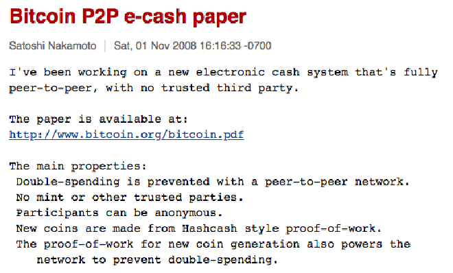

> *作者：musclesatz*
>
> *来源：<https://www.musclesatz.com/articles/bitcoin-past-present-future/>*
>
> *本文为《比特币的过去，现在和未来》译本的第二篇。前篇见[此处](https://www.btcstudy.org/2023/02/12/bitcoin-past-present-future-part-1/)。*

## 中本聪其人

### 名字，域名和主机

中本聪的第一个被记录下来的踪迹可以追溯到 2008 年，虽然在许多公开的帖子中，这位匿名人士（也许是匿名人士团体）漫不经心地表示他在 2007 年就已经开始开发叫做 “比特币（Bitcoin）” 的项目了。想象一下，2007 年，这地球上的某个地方，某人已经开始开发比特币了。

但是，真正被记录下来的故事始于 2008 年 8 月 18 日，那一天，有人使用互联网服务 `anonymousspeech` 注册了一个 网站`bitcoin.org`（此网站现已不存）。顾名思义，这种服务允许用户匿名地注册域名并支付费用。

> 那么中本聪在 2008 年是如何匿名地支付域名费用的呢？

那时候，anonymousspeech 接受邮寄到他们工作地点的现金支付，以及 `e-gold` 支付。因为 2008 年以前的电子货币实验的连续性，许多人认为，中本聪使用 `e-gold` 买到了这个域名。（译者注：2008 年以前的电子货币实验，见[前篇](https://www.btcstudy.org/2023/02/12/bitcoin-past-present-future-part-1/)。）

有趣的是，虽然我们不知道中本聪的法律身份，但是 anonymousspeech 给每个客户都分配了一个 ID，因此我们发现中本聪还买了另一个域名，是 `netcoin.org`，我们可以假设，那时候他不确定要给自己创造的东西安什么名字。

> 那中本聪是怎么匿名为主机支付费用的呢？

主机（hosting，托管网站的服务器）的信息也在 anonymousspeech 手上（现在已经关闭了），从现实的角度看，中本聪会使用类似的服务来为自己的主机支付；也许自建主机太危险了，而且为了保持绝对的匿名性，他也会倾向于购买主机。

### 白皮书

10 月 31 日，中本聪的白皮书发表，首次展示了比特币工作的实际方式和技术细节。中本聪在一个叫做`cryptography（密码学）` 的邮件组 —— 这个邮件组其实是 `密码朋克` 邮件组的精神后裔，后者早在多年以前就关闭了 —— 里面说：

> *“我一直在开发一种新的、完全点对点的电子现金系统，无需信任第三方就可以做。论文地址是 bitcoin.org/bitcoin.pdf”*
>
> —— 中本聪

中本聪在邮件组中提到的比特币的主要特征有：

- 重复花费是靠点对点网络来阻止的；
- 整个网络不存在一个中心点，也没有需要参与者信任的团体；
- 参与者可以是匿名的；
- 新的货币靠 HashCash 形式的工作量证明来产生；
- 用于创建货币的工作量证明也会被整个网络用来防止重复花费。

- 中本聪的第一条消息 -

我们来分析一下这篇论文的摘要：

`摘要`. 一种完全点对点的电子现金，将允许一方直接向另一方发送在线支付，而无需经过第三方金融机构。数字签名提供了一部分的解决方案，但其主要优点，将会因为需要一个被信任的第三方来防止重复花费而失去。我们提出了一种使用点对点网络来解决重复花费问题的方案。整个网络为交易标记时间戳、将交易放置在一条连续的、由基于哈希函数的工作量证明组成的链条中，从而形成一条只有通过重算所有工作量证明才能改变的记录。最长的链条不仅是被认可的事件的顺序的证据，也是它们来自最大的 CPU 群体的证据。只要大部分的 CPU 算力掌握在不会串谋攻击网络的节点手上，他们就能产生最长的链条并挫败攻击者。网络只要求最基本的结构，消息会在节点间 *尽可能多* 地转发，而且节点可以随意离开和进入网络，他们可以把最长的链条作为自己缺席期间发生的事件的证据。

- - -

中本聪的白皮书没有处理诸如通胀、中央银行、电子黄金之类的主题。论文完全中立，避免了政治上的关联，表达的是一种纯商业性的论点。但是，在别的互联网帖子中，中本聪展示了自己的密码学无政府主义师承。另一个有趣的点是，在论文中，中本聪专注于解决 `重复花费` 问题，完全将必要的技术当成是理所当然的东西，例如：

> *“…… 数字签名提供了一部分的解决方案 ……”*
>
> —— 中本聪

中本聪没有在这份文件中解释诸如比特币的智能合约语言（`Script`）之类的重要概念，也没有讨论 2100 万 BTC 的货币供应量限制，更没有提到增发速度定期减半的机制。

中本聪的邮件收到的一个回复表达了明显的怀疑，类似于：*“听起来很棒，但是行不通，它的吞吐量不够大。”*

### 时间链和中本聪的错误

`blockchain（区块链）` 一词并未出现在比特币白皮书中。相反，中本聪使用的是 `chain of blocks（由数据块串成的链条）`、`chains of proofs of works（由工作量证明串成的链条）` 以及 `chain of hash-based proof-of-works（由基于哈希函数的工作量证明串成的链条）` 来描述他的讨论对象。在代码中，他通常使用 `timechain（时间链）` 来指代区块序列。这个词单纯是用来指代区块的时间顺序的。但是，也有一些人，比如 Peter Todd（彼特·陶德），反对使用时间链一词，因为它会跟中本聪滥用的 `timestamp（时间戳）`  一词产生关联；时间戳的字面意思是 “保证特定信息在特定时间存在的戳记”，但中本聪把它当成了 “存在性证明（proof of existence）”。比特币不需要存在性证明，只需要唯一性证明，或者说排他性的存在证明（existence of non-alternatives）。

1. 中本聪滥用了 `时间戳` 的概念，因为比特币不需要一个保证特定信息在某一个时间存在的戳记，而只需要唯一性证明。例如，要是我签名了两笔交易，第一笔断言明天会下雨，而第二笔断言明天会有好天气，然后我等到明天才揭晓对应的那一笔交易，这就违反了交易的唯一性，这是在重复花费。彼特·陶德正确地指出，更合适的术语是 `一次性密封（single-use-seals）` ，而不是时间戳。Giacomo Zucco 建议把唯一性证明叫做 `timesealing（时间密封）`。不过，我们可以原谅中本聪的这个错误，因为在 2008 年，关于密码学时间证据的文献还没有出现；

2. CPU 一词在论文中常常出现。但是，现在你已经没有办法使用 CPU 来挖矿了，因为 CPU 的专业性太差了。CPU 可以做所有运算（模拟任意图灵机），但 GPU 的效率更高，因为它可以只做某一些事，例如视频游戏和 3D 渲染。后来，我们又从 GPU 挖矿转向了 FPGA（通用制作的可编程主板），再转向 ASIC（专用型集成电路），这些 ASIC 是纯为比特币挖矿而设计的（没有任何别的用途）。不过，这不算是中本聪的大错，因为 TA 不可能预见未来 14 年的技术进步。

   > 2010 年 7 月 18 日，第一个使用 GPU 挖矿的区块出现。

3. 中本聪在论文里常常提到最长链，但这是一个错误，因为假设我们只使用这条规则，那么我们可以回到创世区块，使用 ASIC 在 10 分钟之内挖出比现在的比特币区块链更长的链条；因为那时候的挖矿难度非常低，而这么快的挖掘速度不会触发难度调整。解决这个问题（也是中本聪的源代码中的错误）的办法是检查 `最重链（heaviest chain）`，也即积累了最多工作量证明的链条，这可以靠将链的长度乘以每个区块的难度系数得到。

4. 中本聪在论文中不严格地使用 `node（节点）` 一词，描述的是参与挖矿、管理钱包、验证共识和参与点对点连接的节点。时间推移之后，节点的含义变得更加具体：举个例子，参与挖矿的节点不再使用通用的（常常用于验证共识）的软件，转而使用专门为挖矿而设计的软件。而我们的家用计算机里的节点也不再挖矿，仅仅验证共识和交易；我们手机中的钱包也不验证共识，仅仅用于生成私钥和交易。甚至更进一步，专门的签名设备（也即硬件钱包）甚至连交易构造、手续费估计和资金选择都不做，只做交易签名。

5. 关于 [SPV（简易支付验证）节点](https://en.bitcoinwiki.org/wiki/Simplified_Payment_Verification)，中本聪认为并非每个人都需要下载全部区块，有些人只需要下载区块头就够了（区块头中包含了区块内交易的默克尔树根）。只要确认一笔交易在默克尔树根中，就足以相信它是存在的，并因为可以信任矿工而合理假设它是有效的；如果某人发现了一笔无效交易，TA 可以播报错误，其他人可以下载完整的区块。问题在于，如果某个恶意节点为所有的区块报告了错误，那么每个轻节点都会下载所有区块，然后变成一个全节点。

6. 在区块内，所有的交易都是公开的，但其隐私模式是新的：每个人都能看到交易，但交易的主人的真实身份是未知的，因为暴露出来的只是交易参与者的公钥。也正因此，隐藏公钥与真实身份之间的关联，变得很重要。作为一种额外的安全措施，为每一次交易使用一对新的公私钥，是一种好习惯（实际上也就是避免重复使用相同的地址）。中本聪说：“某些关联是不可避免的；当一笔交易有多个输入时，这自然而然会暴露交易的所有输入资金都属于同一个人”。但在现实中，并不绝对如此，因为多人可以将他们的多个输入放在同一笔交易中。后面我们介绍 “CoinJoin” 概念时就会讲到。

7. 白皮书没有介绍我们今天所知的比特币：它没有提到 2100 万 BTC 的供应量限制、增发速度定期减半机制、UTXO 集、智能合约编程，也没有提到自动化的难度调整。Bitcoin 0.1 软件并不是从白皮书中产生出来的；白皮书仅仅是为了介绍一个重大问题（重复花费）的解决方案。

- - -

### 创世区块与 Patoshi

一群密码学家表示，在 2008 年 11 月，中本聪联系了他们，并给他们提供了代码副本用作私下评审；这份代码跟 2009 年 1 月发布的公开代码非常相似。

这份秘密代码有两个有趣之处：

- 它实现了一种点对点的扑克游戏（后来移除了，完全集中在比特币上）
- 实现了一种使用复杂的商家声誉系统的去中心化市场（后来也移除了，以保证代码完全集中在比特币上）

2009 年 1 月 3 日，第一个比特币区块挖出：源代码于 1 月 9 日在 Souceforge 网站上发布，但从 2008 年 11 月以来，这份代码已经在各种圈子里流流传。第一个挖出的区块也叫 “创世区块”，是正式的起点，它标注的日期为 2009 年 1 月 3 日。而在这个区块中，中本聪写道：

> *“The Times 03/Jan/ 2009 Chancellor on Brink of Second Bailout for Banks（泰晤士报 2009 年 1 月 3 日刊 财政大臣即将释放对银行的第二批救助）”*

- 泰晤士报（译者注：原文为 “New York Times”，为事实性错误。应为 “Times”） 2009 年 1 月 3 日的头版 -

这版泰晤士报还有一些有趣之处：

- 一位名为 Gordon Ramsey（高登·拉姆齐）的先生为自己的餐厅榜单打广告：外出就食，最低只需 5 英镑（这 14 年来的通货膨胀多么可怕！）
- 底部有啤酒广告：一杯只售 1 英镑
- 以色列（Israel）军队开进加沙地带（Gaza）。中东地区无休无止的战争，跟 “石油美元（petrodollar）” 有关吗？也许真有什么阴谋。

所有这些，在中本聪那里的目的是什么？显然，一方面是表达对货币议题和经济危机的关注，另一方面是表明他和其他人早在 1 月 3 日就开始挖矿了；第一个区块不是在代码公开的几周前创建的：就是在 2009 年 1 月 3 日创建的。同时，这也是一个证据：证明无论是他还是其他人，都没有为了某种好处而准备隐藏的工作量证明。这还没完，在挖出第一个区块后，中本聪得到了一些比特币，但这些比特币并没有被花掉，因为 —— 它们是不可花费的！所有这些因素都展示了中本聪本人的超然和清白。

据说中本聪给自己挖出了 130 万 BTC，但没有证据；而且这种说法也是毫无根据的、完全不可能的。这种传奇故事来源于 Sergio Lerner（塞尔吉奥·勒纳）在 2013 年的研究，他研究了早期区块以及这些区块是如何处理 `nonce` 的。每一个比特币区块都有一个区块头，包含多个字段：数据、前一个区块的哈希值、难度、区块内所有交易的默克尔树根，以及 nonce。nonce 是一个无意义的数字，改变这个字段的数值可以改变区块头的哈希值；矿工会一直试验不同的 nonce，以使自己的区块产生符合当前网络难度要求的哈希值（即获得工作量证明）。

> 现在的 ASIC（挖矿设备）已经不再使用 nonce 这个字段了，因为它的长度太短，矿机很快就能搜索完全部可能性（而可能依然找不到符合难度的工作量证明）。现在的 ASIC 会微调 coinbase 交易，以获得额外的可能性和随机性。

塞尔吉奥检查了所有区块，他注意到一些连续的区块的 nonce 并不是从 0 开始的，而是在已经得到验证的区块的 nonce 值上递增。因此，塞尔吉奥发现，很有可能某一个人在 2009 年挖出了非常多的区块，获得了 130 万 BTC。这个人的行为展现出了一种模式，所以塞尔吉奥称 TA 为`Patoshi`。

主要的反对意见并不是质疑 Patoshi 的真实性（TA 很有可能存在），而是认为 Patoshi 不是中本聪。我们来看看反对者的证据：

1. 中本聪花了很大力气，运用泰晤士报的头条来证明创世区块的公平性；这清楚地表明，他不会 “吃独食”；
2. 在源代码没有传播开来的时候（还没有在 SourceForge 网站上发布的时候），中本聪没有再挖掘过任何区块；
3. 中本聪利用自己挖出的区块的 coinbase 交易，将比特币发送给 Hal Finney（哈尔·芬尼）的时候，其区块并不符合 Patoshi 模式（而且很明显）。

### 最后一篇帖子、最后一次分叉、告别

2 月 11 日，中本聪在 “P2P Foundation” 论坛（<https://p2pfoundation.net/>）创建了一个账号，将 Roosevelt（罗斯福）没收黄金的日子定为自己的出生日期，将 Nixon（尼克松）终结金本位的年份定为自己的出生年份。

在他的第一篇帖子中，他说自己已经开发出了一种完全去中心化的、点对点的电子现金，并给出了指向 bitcoin.org 的跳转连接，还补充了一句：

> *“传统货币的主要问题在于它们的运作所需的信任因素，你需要信任中央银行不会滥发货币，但法定货币的历史满是这种信任遭到背叛的例子。”*
>
> —— 中本聪

从此，中本聪的语气开始变得更有政治味儿。

> 现在有人说中本聪的想法只是允许自然的在线支付（类似于 PayPal），然后才建立起关于通胀和价值存储的所有论述。这种说法绝对错误：白皮书保持着科学的优雅，但中本聪的真实动机和观念，都散布在互联网上。

10 月 29 日，中本聪被一些开发者说服，将 Bitcoin 软件的代码从 SourceForge 迁移到 GitHub 上，因为 GitHub 更适合于 Linux 操作系统。Gavin Andresen（嘉文·安德烈森）主持了这次迁移，很快，其他重要的开发者也在 GitHub 上加入了它们。11 月 22 日，Bitcoin 论坛迁移到了一个新的叫做 “[BitcoinTalk](https://bitcointalk.org/)” 的论坛，由用户 `theymos` 和 `cobra` 运营。

在这一时期加入的开发者中，一位来自谷歌的开发者 Mike Hearn（麦克·赫恩）提出了比特币的 `绝对标准化`，作为对抗国家权力封禁威胁的一种保护措施。嘉文·安德烈森也成为了这项策略的一个坚定支持者。

同时，中本聪给代码作了一些变更：

- 2010 年 7 月 28 日，他主持了一次软分叉，修复了 `OP_RETURN` 中的一个 bug（尚未被任何人利用），该 bug 将允许任意人花费任意比特币。OP_RETURN 本身是一个可用来加入最多 100 字节的数据的操作码。

- 2010 年 7 月 31 日，他主持了另一次软分叉：一些用户在升级时遇到了问题，于是中本聪移除了两个操作码，然后通过一次硬分叉，引入了 `OP_NOP`，这种操作码不会触发任何行为，但未来的软分叉就可以利用它，执行新的行为了。

- 后续的另一次硬分叉，将 `脚本签名（scirptSig）` 和 `脚本公钥（scriptPubKey）` 的求值分割开来。这两者是比特币的价值转移系统的两个关键元素。脚本签名是比特币交易中的一些代码，包含了交易参与者的数字签名，以及验证交易合法性所需的其它信息。而脚本公钥则是交易的输出中的代码，指定了花费该输出中的资金所需满足的条件。脚本公钥和脚本签名两者一起构成了比特币的花费机制，保证了只有真正的比特币所有者能将资金转移到别的地方。中本聪发现的 bug 允许人们随意花费明明不属于自己的比特币；

- 8 月 15 日，人们发现了另一个 `数值溢出` 漏洞。这个漏洞非常危险，因为输入一个超过限制的数值会产生另一个意料之外的数字。利用这个 bug 的操作持续了 51 个区块，产生了 1845 亿 BTC。中本聪注意到了，于是通过回退这 51 个区块来重启比特币区块链。这里不想为他辩护，但这是发生在比特币刚启动不久的事，所以完全是情有可原的。

- 9 月 7 日，另一次软分叉发生，添加了单个区块内的签名验证操作不得超过 2 万个的限制；如无此限制，可以创建一笔让节点崩溃的交易，因为交易可以要求验证极多的签名；

- 9 月 12 日，中本聪主持了另一次软分叉，添加了区块体积不得超过 1 MB 的限制；

  > 2010 年 11 月 27 日，一位来自捷克共和国、名为 Slush 的开发者，创建了 Slush Pool，实质上提出了 “矿池” 的原始概念。矿池是由多个矿工组成、合力挖掘相同区块的系统；实际挖出区块的矿工将与同矿池内的其他人共同分享奖励。（Slush 也是硬件钱包品牌 Trezor 和 SatoshiLabs 的创始人。）

9 月 12 日之后，中本聪的故事就告终了。不过，还发生了两件大事：

1. 2010 年 12 月 11 日，中本聪发出了他的倒数第二条公开消息：有人在一份报纸（Business Insider）报道称 WikiLeaks（维基解密）正在讨论以比特币接收资助的可能性，因为他们被 Visa 和 Mastercard 审查了。中本聪的回应是正式要求维基解密不要迈出这一步：

   > *“维基解密捅了马蜂窝，蜂群冲着我们来了。【我呼吁维基解密不要尝试使用比特币。比特币只是一个还处在起步阶段的小型实验性社区。现阶段你只能得到一些零钱，但你带来的压力有可能会摧毁我们。”*
   >
   > —— 中本聪

   中本聪指出，“就当下而言” 比特币还太小，不可能直接对抗美国政府。

2. 2010 年 12 月 12 日，18 时 22 分 33 秒，中本聪发出了最后一条公开消息，他说：*“还有好多工作要做呀。”* 在一份日期为 2011 年 4 月 23 日的邮件中，中本聪向麦克·赫恩表示他希望指定嘉文·安德烈森作为他的精神继承人（可惜的是，这个日期没有密码学证据）。

（未完）

> 续篇见[此处](https://www.btcstudy.org/2023/02/14/bitcoin-past-present-future-part-3/)。