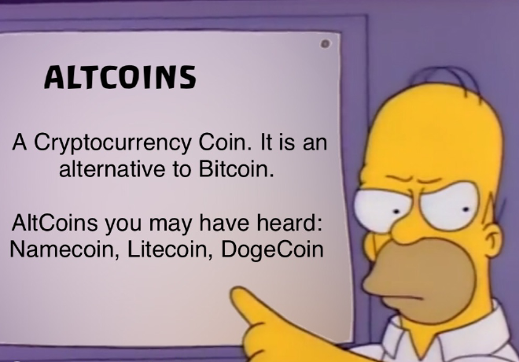
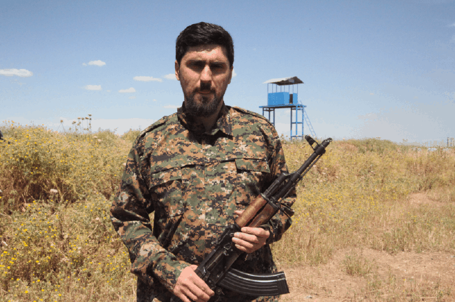
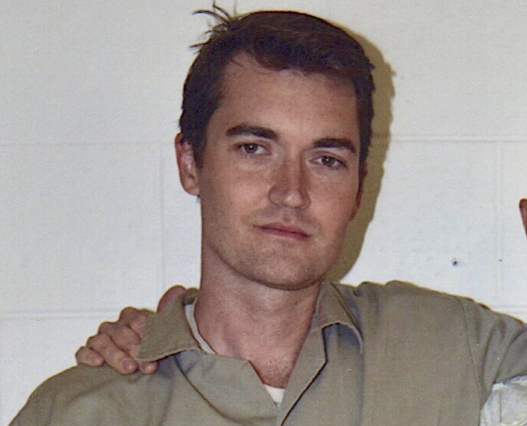

> *作者：musclesatz*
>
> *来源：<https://www.musclesatz.com/articles/bitcoin-past-present-future/>*
>
> *本文为《比特币的过去、现在和未来》译本的第三篇，前一篇见[此处](https://www.btcstudy.org/2023/02/13/bitcoin-past-present-future-part-2/)。*

## 协议的青春期

### 普及

2011 年，比特币因为被 Electronic Frontier Foundation（电子前线基金会）接受而变得流行；这个基金会致力于提升公民在互联网上的自由。但是，因为担心使用密码货币接受捐赠的法律后果，他们在当年 6 月份又停止了接受比特币。2011 年 11 月，奥地利学派的自由市场支持者 Ross Ulbricht（罗斯·乌布里希）以假名 `Dread Pirate Roberts（恐怖海盗罗伯茨）` 创建了 The Silk Road（“丝绸之路”）电子商务网站，在 TOR 网络（洋葱网络）上运行。丝绸之路有一些伦理上的限制，但没有道德、宗教和政治上的限制，例如，不能出售偷来的东西和信用卡，但书籍和精神药品都可以出售。

“丝绸之路” 只接受比特币，因此比特币的第一个应用场景就这么诞生了。

> 历史上的丝绸之路真实存在；这条通路从中国出发，经过印度、阿富汗甚至日本，一直延伸到西班牙，全世界的商人都在通路上交换商品。

### 第一种垃圾币和第一种 BIP

2011 年 4 月 17 日，第一种 utility coin（“效用型代币”）诞生，叫做 `namecoin（域名币）`，跟现在（2022 年）的诸多效用型代币相比，它也是相当实诚的，所以并不算是垃圾币（shitcoin）：

- 没有 ICO（初次代币发行）（译者注：这个词的意思是代币的发行方在代币能够使用之前就出售代币）；
- 没有营销部门；
- 在介绍文档中没有谎言；
- 没有 “黑科技” 概念。

域名币的主要目标是为互联网当前使用的域名解析系统（domain name resolution system，DNS）提供一种去中心化的替代方案，因为 DNS 是由 ICANN（互联网域名和数字分配协会）这样的中心化机构来管理的。域名币致力于提供一种能够抵抗政府和其它中心化机构的审查和伪造的域名解析系统，让限制和阻止互联网用户对特定网站和服务的访问变得更难。它还为域名提供了一种证书系统，允许用户以去中心化的方式证明自己对一个域名的所有权，而不需要使用中心化的第三方。所有这些都汇集成浏览器地址栏的一个新后缀：`.bit`。给定比特币时间链的可扩展性问题，似乎有必要把这个系统搬到另一个地方，那么进一步就是从头创建另一条链，但不要重新挖矿，也就是跟比特币 `合并挖矿`。

合并挖矿的原理是将次级链（比如这里的域名币）的区块哈希值可以嵌入主链（比特币）区块的 coinbase 交易中，跟主链区块一起挖矿。被嵌入的哈希值有一个简短的描述性文字作为前缀，称作 “tag”，因此次级链可以轻松定位它。然而，变成一条独立的链，就会产生一个问题，这导致了 scamcoin（诈骗币）的诞生：

> 如何为矿工的额外工作支付呢？肯定不能用 `.bit` 域名支付呀，因为手续费必须用同质化的资产来支付。这就催生了比特币的克隆币，这些币种复制了比特币的各种属性，因此 —— 显然 —— 没有任何价值。
>
> （译者注：作者的意思是说，当时的合并挖矿链没法解决为额外的工作量支付手续费的问题，实际上也就是合并挖矿技术不成熟，因此大家转向了复制比特币并开发新的区块链。）

> 有些使用 `.eth` 域名的人还觉得自己很原创、很前卫呢。

第二种著名的垃圾币是 `litecoin（莱特币）`，这跟域名币是完全不同的东西，而且被比特币开发者揭穿了。莱特币的创始人断言了一些完全没有根据的假设：

1. `断言`：*比特币的设计很愚蠢，因为区块每 10 分钟才产生 1 个，我们可以让区块每 2 秒产生一个*。

   `比特币开发者的回应`：*中本聪设定 10 分钟的出块时间并不是武断的，而是因为在相同的哈希率（挖矿速率）下，1 分钟的出块时间下产生的 1 个区块的价值不仅不如 10 分钟的出块时间下产生的 1 个区块，而且其对数价值也会小于后者的 1/10 。所以出块时间更短不会有更高的安全性。其次，更短的出块时间会提高产生孤儿块的概率：如果区块出现得更频繁，就会更经常出现两个区块同时被发现的情况，因此也会有更多的并行链出现（它们之间必定你死我活），这就意味着矿工的盈利空间下降；因为收益的方差提高，激励机制会有利于大矿工而不是小矿工。*（译者注：孤儿块是指被放弃、没有人在后面继续挖矿的区块；因为比特币遵循最长链共识，如果在同一顺序位置（区块高度）出现了两个乃至多个区块，最终只会有一个区块被保留下来、变成最长链的一部分。）

2. `主张`：莱特币的手续费会比比特币更低；`回答`：我们会在下一章，关于 “区块体积战争” 的章节讨论这个问题。

3. `主张`：比特币可以用 GPU 来挖矿，这是不行的；莱特币不会使用 SHA256 算法，而会使用一种抗 GPU 挖矿的，叫做 “script” 的算法；

   `比特币开发者的回应`：*没有这样的抗性，script 依然是一种算法，依然会有人找出办法使之适应 GPU 的特点并且可以扩展，仅仅是可能会慢一些。提高挖矿算法的复杂性会产生进入的门槛，所以第一个找出 GPU 挖矿办法的人将获得极大的竞争优势。*

莱特币有一些明显的问题：首先，在它启动的第一天，挖出的区块明显比预期的要多。然后，莱特币也常常被称为 “白银版比特币”，意思是比特币是黄金，而莱特币价值稍欠。但是，这种说法是不靠谱的，因为它们都是数字资产，因此都是天然可分割的，不像黄金和白银有性质上的差别：黄金更容易转移但分割起来不是那么容易，白银更难以转移但更容易分割，但电子资产是同样易于分割和易于转移的。

9 月 19 日，一位密码朋克开发者 Amir Taaki（阿米尔·塔奇）提出了一个天才的想法：创建一套 `BIP（比特币优化提议）` 流程。这套系统将允许（而且依然允许）任何有提议的人遵循一套结构化的路径来提交提议。具体来说，这样的提议会在反馈征集流程中得到讨论，然后形成具有摘要、前言、详细规范、辩护意见、兼容性解释及参考实现的文本。一旦提议正式形成，就将呈给一群维护 Bitcoin 代码库的人，不论提案重要与否。这些人不会决定这个提议是否有效，只会给提交的每个 BIP 分配一个标号。

- 除了为比特币贡献代码，Amira 还在叙利亚的 YPG 军队中服役，并为罗贾瓦（Rojava）民间的各种经济项目工作了一年半。 -

### 仁慈的独裁者

*BIP30 - 交易复制* 提案是创建来解决交易混淆问题的，这个问题是说，两笔不同的交易可能具有相同的交易 ID（标识符）。这个 BIP 没有任何恶意和奇怪之处，但 Gavin Andresen（嘉文·安德烈森）—— 自称是中本聪的继承人 —— 这时候是自封的比特币项目领导者，他决定在某个时间（2012 年 3 月 15 日）激活以 BIP30 为内容的软分叉。

问题是，谁决定了嘉文是新一任的领导者？

在 2012 年 1 月，嘉文提出了 *BIP16 - 支付给脚本哈希值*，该提议允许将资金发送给一条脚本的哈希值（地址将以 3 开头），而不必非得发送给一个公钥的哈希值（地址以 1 开头）。问题的起因是，如果我想要给一个使用了两个乃至更多公钥的智能合约支付，我就不能靠一个地址完成支付，我必须给完整的、包含多个公钥的合约脚本支付。于是一种想法开始流传：如果可以给智能合约的哈希值支付，那会更加智能。有点复杂，但大意是说，与其在支付时表达：“我支付的这笔钱，这个公钥可以花哦，这个公钥也可以花哦，那个公钥也可以花哦”，不如把这些条件先写下来，通过哈希运算取得哈希值，然哈把这个哈希值放在时间链上：这笔钱是支付给这个哈希值所代表的智能合约的；在花费这笔钱时，只有揭晓完整的智能合约、并提供合约所需数据（比如足够多的签名）的人，才能成功花费。这是一种高效的解决方案，不论从隐私性还是可扩展性上来说，都是如此，因为合约是隐私的，仅在被花费时才会公开，而且仅在此时才会进入时间链（一开始放在时间链上的只是其哈希值，而不是其本身）。

但是，强烈的反对意见出现了，因为 Luke Dashjr（卢克·达实）分析了 BIP 16，然后认为它实现得很差，于是提议了 *BIP 17 - OP_CHECKHASHVERIFY（CHV）*。卢克毫不松口，他认为嘉文对交易的验证方式作了激进的改变，包括（他认为的）：

- 哈希值是在脚本开始运行之前检查的；
- 脚本的表现方式完全改变了；
- 签名验证操作的限制也改变了；
- 新的 OP_EVAL 操作码有危险，因为它允许创建递归的循环。

卢克断定脚本哈希化是没有意义的，好得多的做法是让脚本默克尔化（让脚本变成一棵默克尔树），这样一来，在花费时就仅需要揭开特定部分的脚本。嘉文不同意，并决定使用标签日（flag data）方法激活自己的提议，时间就定在 2012 年 2 月 1 日。

结果，开发者们就分裂成了不同的派系，他们的第一步就是迫使嘉文移除 `OP_EVAL`，因为这个操作码会产生后来在以太坊上发生的攻击那样的严重问题（译者注：作者所指应为 2016 年以太坊基金会 devcon 2 会议期间发生的攻击）。他们还提出要加入一种阈值激活机制，让矿工表态。如果至少 55% 的矿工都在自己的区块中表示支持，那就说明共识形成了。

不仅矿工，所有的用户也必须达成共识。实际上，嘉文主持的标签日激活可悲地失败了。嘉文于 2 月 27 日在 bitcointalk 论坛上发帖，宣布道：

> *“虽然我们还没有达到 55% 的阈值，我已经决定，BIP16 将从 2012 年 4 月 1 日开始服役（这不是愚人节玩笑。）”*
>
> —— 嘉文·安德烈森

在区块高度 170060 处，有一笔交易虽然挖出来了，但执行失败了，因为它没有遵守 P2SH 的规则。据估计，截至 2012 年 12 月，45% 的矿工都在继续挖掘必定成为孤块的区块，因为他们没有遵守 P2SH 规则。

（编者注：P2SH 的技术构型也经历过多次改变。详细内容请见[此处](https://www.btcstudy.org/2022/04/20/the-battle-for-p2sh-the-untold-story-of-the-first-bitcoin-war/)。）

在 2012 年 9 月，受到 Linus Torvald（林纳斯·托沃兹）的 Linux 基金会的层级式结构的启发，Bitcoin Foundation（比特币基金会）成立，工作地点在华盛顿。根据 Mike Hearn（麦克·赫恩）的建议，这是为了给比特币项目一个更加有组织的结构，以选择像嘉文一样的 `仁慈独裁者`（嘉文是中本聪在一封没有经过验证的、发给麦克·赫恩的邮件中指定的）。比特币基金会也在媒体中获得了声望，变成了想要访谈 “比特币项目的领导者们” 的记者的正式参考点。但是，这也造成了比特币社区的第一次重大内部斗争，一些人尝试把比特币基金会展现成一个无害的机构、避免讨论避税、洗钱等话题，而另一些人则对解释现实、解释比特币的目的更感兴趣。

### 区块战争前夜

2013 年 3 月 11 日，比特币的协议升级期间出现了严重的问题；这次升级本身是为了将 Berkeley DB 数据块替换成 LevelDB 数据库。问题在于，表面上，中本聪为区块的体积设置了 1 MB 的上限，这是被 2010 年 9 月的社区接受的限制；但是，Berkeley DB 中还有一个隐式的、未明说的限制，是小于 1 MB 的。因此，虽然 1 MB 的区块在共识层面是有效的，但在数据库层面，它是无效的，因此会被拒绝掉。换用 LevelDB 之后，一些节点开始接受 0.9/1 MB 的区块，但是链就分裂了（那些还没升级的节点会拒绝这些区块）。在一团混乱中，一次预料之外的重复花费攻击成功了：某个输入先是出现在旧链上，然后又意外出现在新链上，收到 9000 美元的商家眼睁睁看着这笔钱因为区块链重组而消失了，所有这一切都是由共识问题，深层来说是数据库层面的技术变更而导致的。

2013 年 6 月 14 日，维基解密再次接受比特币捐赠，但坏消息转眼就来，10 月 2 日，“丝绸之路” 网站的创始人在经历了一个月的躲藏之后被逮捕，因为创建 “丝绸之路” 而被判处两个无期徒刑，并且不可以假释。

- 罗斯·乌布里希目前被关押在图森 USP 监狱，这是美国安全级别最高的监狱。 -

> 罗斯很可能犯了一些错误，比如在 TOR 网络上使用验证码，揭开了其可能使用的 IP，从而让美国国家安全局得以追踪到网站所在的主机。

有人发现，在这次调查中，一名参与逮捕罗斯的 FBI 特工偷走了他大部分的比特币。而且，在罗斯被逮捕的时候，他正在一家公共图书馆里，以主管的身份访问网站的控制台。就在他盯着屏幕时，一些警察在他背后打斗，引起了他的注意。与此同时，镣铐落下。网站上所有的比特币都被没收了，但其中一些因为两个特工的腐败不翼而飞；两人中还有一位在后来也被逮捕了。

> 他们是怎么没收罗斯的比特币的？

不走运的是，这些比特币都放在一个 “热钱包”（联网的钱包）里，通过网站的界面就可以直接取出。

在 2014 年，Bitcoin Meetup 在米兰成立，很快就变成了欧洲最大也最有影响力的比特币活动。但是，很快，另一个打击又来了：2 月份，电子货币交易所 MtGox 因为网络攻击而关闭了取款通道并宣布破产。MtGox 的关闭催生了第一批区块链（资金流向）分析公司；并且，在中国导致了对比特币的禁令。

2015 年 Gizcomo Zucco（贾科莫·祖科）在米兰成立了 BlockchainLAB，目标是让全世界最好的比特币专家汇集在一间办公室里。开发者可以自由工作，做任何自己想做的事，只要他们分享自己的知识并撰写报告，BlockchainLAB 会卖给银行和机构。他们的办公室在米兰的哥白尼街，未来有许多重要的事情在这里发生。

（未完）