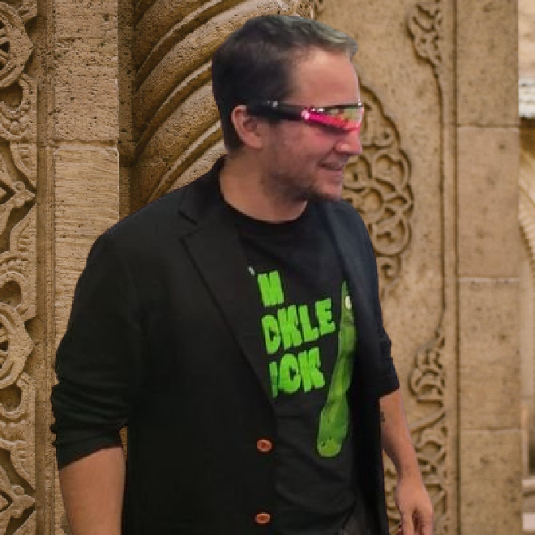

> *作者：musclesatz*
>
> *来源：<https://www.musclesatz.com/articles/bitcoin-past-present-future/>*
>
> *本文为《比特币的过去、现在和未来》译本的第四篇。前一篇见[此处](https://www.btcstudy.org/2023/02/14/bitcoin-past-present-future-part-3/)。*

## 区块体积大战

### 背景和方向

区块体积大战是从 2015 年开始正式开打的，但要想完全搞懂这件事，我们还要补充一些历史背景：

1. 2010 年 7 月 15 日，中本聪引入了 1 MB 的区块体积限制，这个限制是在 2010 年 9 月激活的。2010 年 10 月 4 日，开发者 Jeff Garzik（杰夫·贾兹克）放出了一种新的客户端，该客户端用一个补丁将中本聪引入的限制移除了。这时候，Bitcointalk 论坛和 r/reddit 论坛的主人 Theymos（德默斯），公开呼吁不要使用贾兹克的补丁版本，因为这样做会让你自己从网络中分离。中本聪也回复 “+1 Theymos”；但贾兹克告诉中本聪，这不是会不会从网络中分叉出去的问题，更多是一个营销问题：要是有一天，比特币的交易需求达到了 Visa 的量级，这个区块体积限制就会限制交易的吞吐量。那时候，中本聪的回复是，要是有必要改变这个限制，未来可以做，但也要可控、逐步地进行。

2. 2011 年发生了三个相关的事件：

   - 2011 年 3 月 7 日，比特币迎来第一位带薪的开发者：Mike Hern（麦克·赫恩）。谷歌公司有一个规定，允许雇员贡献 20% 的工作时间在个人项目上，只要提前打报告就行。麦克·赫恩向谷歌提出要开发 BitoinJ，让比特币拥有 Java 语言的客户端。
   - 2011 年 4 月 23 日，麦克·赫恩公开了跟中本聪的一次邮件往来，在该邮件中中本聪指定 Gavin Andresen（嘉文·安德烈森）作为自己的精神继承人；
   - 2011 年 5 月 5 日，一位新用户 `Gregory Maxwell（格里高利·麦克斯韦尔）` 进入了 bitcointalk 论坛；他后来成为了最多产的比特币研究者和开发者之一，是大区块支持者眼中的 “终极反派”。他用一篇很长的帖子解释了自己为什么支持中本聪施加的区块体积限制：这不仅避免了未来可能无法下载区块的问题、孤儿块率提高的风险，还有一些纯经济上的影响：如果没有限制，区块的体积就将膨胀，因此矿工的手续费将变得非常低；货币通胀奖励总有一天会变得太低（请记住，到 2140 年比特币就将不再增发）；我们都知道价格只会在稀缺商品上形成，要是区块空间不稀缺，它就不会有价格，因为没人愿意为它支付价格。（译者注：孤儿块是指被放弃、没有人在后面继续挖矿的区块。按照比特币的共识机制，如果同一区块高度上出现了多个区块，最终只会有一个变成主链区块，别的就会变成孤儿块。）

3. 2012 年，第二位拥有全职薪水的开发者加入，就是嘉文·安德烈森。

4. 2013 年，麦克·赫恩说服嘉文，将 Bitcoin 软件重新命名为 “Bitoin Core”。

5. 2013 年 5 月，Peter Todd（彼特·陶德）发布了 keepbitcoinfree.org 网站，成为大区块主义者的另一个眼中钉。他在网站上发布了一份好莱坞大片一样的视频，解释说区块体积限制不是一个技术选择，而是一种道德选择，背后对应的是两种价值观：一个是给予矿工控制整个网络的机会，从而让比特币中心化；另一种是希望比特币自由、每个人都可以自主验证。

6. 很快，2013 年 8 月 19 日，格里高利·麦克斯韦尔在 bitcointalk 论坛上发表题为 “[终极终极区块链压缩技术：CoinWitness](https://bitcointalk.org/index.php?topic=277389.0)”的文章，提出了 `coin witness` 的概念。这是第一种侧链方案。格里高利写道：

   > *“我们可以拥有许多区块链，而在比特币区块链上，我们可以使用一些叫做 `SNARKs` 的技术，为长历史生成紧凑的证明。我们可以在比特币上实现一种操作码，用于验证 SNARKs，这样一来，你就可以让整条区块链生活在比特币上。好处在于，我们可以在主链上冻结一个比特币，然后相应在侧链上发行一个侧链币，等到这个币需要回到主链上时，我们再验证其历史的紧凑证据；这将提升可扩展性，并且不必创建垃圾币就可以开展实验。”*
   >
   > —— 格里高利·麦克斯韦尔

7. 10 月 14 日，Adam Back（亚当·贝克）发表了题为 “Bitcoin Staging（比特币的发展阶段）” 的论文，在文中他解释道，试验更大或更小的区块和各种隐私性方案，都是好事；但如果需要为此创建新的垃圾币，就不算什么好事了；格里高利的想法可以用来创建侧链。

8. 嘉文放弃了他对 GitHub 上的 Bitcoin Core 代码库的控制权，将自己的角色移交给了 Wladimir Wan Der Laan（弗拉基米尔·范德兰）；他没有表示这是收缩了自己的权力，而是称代码维护工作非常繁重，而他还有更重要的工作要做。

9. 2014 年 10 月 23 日，有关侧链的白皮书完成了。这份论文指出，使用 SNARKs 的 Coin Winess 还不可行，但搭配中本聪提出的 “SPV（简易支付验证）” 这样的技术，就可以创建这些独立的链，比特币可以移动到这样的链上，尝试不同的隐私性、速度和可扩展性的搭配。在这份白皮书上署名的有：亚当·贝克、麦克斯韦尔、Matt Corallo（马特·科拉罗）、Luke Dashjr（卢克·达实）、Pieter Wuille（皮耶特·乌勒）、Andrew Poelstra（安德鲁·博尔斯特）、Andrew Miller（安德鲁·米勒）和 Jorge Timón（乔治·蒂蒙）。但是，所有这些开发者都犯了一个错误：他们成立了一个规模太大、明星太多的公司，产生了比特币 “已经中心化” 的印象。

10. 2014 年 12 月 27 日，麦克·赫恩发布了 `BitcoinXT` 软件，这是可以替代 Bitcoin Core 的重构软件。XT 版本的推出是因为麦克在不久之前提出了 *BIP64 - getutxo message*，但这个 BIP 没有迅速在 Bitcoin Core 中实现，于是麦克决定创建一种替代性的版本，跟原版做出一些差异化，包括实现 BIP64。

讲完了这些，现在我们可以开始讨论区块体积大战了：大战的主要话题是比特币链上的区块的体积上限，以及一系列纯技术上的话题：

- 下载一个时间链区块所需的时间；
- 区块的传播时间，这个时间改变可能会改变产生孤儿块的概率；
- 自私挖矿（selfish mining）的可能性；
- 大矿工吞掉小矿工的可能性；
- 手续费的趋势。

所有这些技术上的问题，又会关联起另一些问题：

- 如何改变区块体积，出块的速度？
- 应该使用硬分叉来改变这些参数吗（硬分叉将不与过去的规则兼容），还是使用软分叉（做到跟过去的规则兼容）呢？
- 我们应该动态调整这些参数，还是按照某个规则来调整？

接下来，我们将讨论需要扩大链下区块的问题，以及链下技术（例如闪电网络和侧链）的实效性问题。另外两个话题关系到中本聪一开始的想法：即使只有少数大的节点可以运行 “真正的节点”，整个网络依然受到 SPV 协议的保护；以及治理问题：谁来决定比特币协议往哪个方向改变？矿工吗？还是开发者？比特币基金会？数字资产交易所？还是用户自己决定？

最后，我们还会分析关系到表达自由的论坛礼仪争论。

### Blockchainlab 和第一次争吵

2015 年 1 月，Giacomo Zucco（加科莫·祖科）成立了 `Blockchainlab` 公司，这家咨询公司意在成为祖科的创业公司的孵化器。那时候祖科的创业公司的商业模式就是 *亏钱，但是在比特币上玩一些很酷的事情，所以没关系*。

Blockchainlab 的商业模式是去接触祖科的所有客户，销售关于比特币的建议和培训；这样，这些建议就不是来自祖科个人的，而是来自于一个汇聚了比特币最大的创业公司和开发者的专业知识的团队；Blockchainlab 也是新创业公司的一个孵化器。第一个被孵化的企业是 Riccardo Casatta（里卡多·卡萨塔）的 Geobit （后来创建了 Eternity Wallet）；后来更多人加入了进来，包括 Franco Cimatti（弗兰克·齐玛蒂），他是意大利最早的比特币友之一，因为把 Bitcoin 客户端翻译成意大利语，还获得了中本聪本人的认可。

但很快，这个 “创业孵化器” 性质就被抛到了九霄云外，因为祖科意识到，这些创业公司没有商业模式，也不想拥有商业模式。所以，Blockchainlab 形成的商业模式就是变成开发者的研究中心、优先获得信息并打包和转售；也就是用帮助服务来交换信息。

2015 年 2 月，Thaddeus Dryja（撒迪厄斯·锥亚）和 Joseph Poon（约瑟夫·潘）发表了有关[闪电网络](https://lightning.network/lightning-network-paper.pdf)的第一篇论文；就在三个月后，2015 年 4 月 15 日，在伦敦举办的一场大会上，嘉文作了题为 *为什么我们需要更大的链* 的演讲，表示需要区块变大、移除中本聪为区块体积设置的限制。

演讲之后的问答环节，嘉文被问到，*要是区块体积限制的辩论没有形成共识，那该怎么办？* 嘉文的回答斩钉截铁：*我怎么说，大家就会怎么做，就像 P2SH 激活的时候一样*。这个回答非常令人震惊，实际上， 5 月 7 号就出现了第一个摩擦：弗拉基米尔·范德兰（Bitcoin Core 代码库的新维护者）就声明他不同意嘉文的提升区块体积限制的想法：他警告称扩大区块是危险的、不成熟的，尤其是没有社区共识的话。

5 月 29 日，嘉文发出了最后通牒，声称麦克·赫恩将在 BitcoinXT 客户端中实现更大的区块；6 月 22 日，嘉文发布了 *BIP 101 - Increase maximun block size（提高区块体积上限）* —— 直接将区块体积上限从 1 MB 提高到了 8 MB，并且每年都翻倍。

嘉文声称，根据 `摩尔定律`，硬盘的存储空间会每年翻倍。但是，问题不在于存储空间，而在于：

- 带宽并不遵循摩尔定律，不会每年都翻倍
- 用于验证的计算能力也不会每年都翻倍

嘉文选择 8 MB 的理由是，一开始他和麦克计划将区块大小限制提高到 20 MB；但中国的矿工（他们当时掌控着全网 60% 的哈希率）反对这一点，因为这样的话他们就会被政府的网络防火墙切断跟比特币网络的连接。因此，中国矿工接受了 8MB，作为一种妥协（译者注：原文如此，疑应为嘉文接受妥协）。后来，麦克披露他们选择 8 MB 是因为 8 这个数字在中国文化中意味着发财和地位提高，可以让中国矿工开心（这个动机可真科学啊）。

然后，贾兹克提出了两个提议：

1. *BIP 100 - Dynamic maximun block size by miner vote（根据矿工投票实现动态的区块体积限制）*：因为区块体积限制可以根据矿工的多数票而改变，如果他们形成了多数，就可以改变区块体积限制。这个提议也很有争议，因为显然，如果区块过大，一个矿工就可以把所有其他小矿工都赶出网络；而且，如果单个矿工占据了多数，他可以一直维持大区块，让所有少数派都无法再进入这个市场，这非常危险；
2. *BIP 102 - Block size increase to 2MB*：更快的解决方案：现在直接让区块体积限制翻倍，从而 “搁置争论，以后再说”。即使这个提议也没有受到欢迎，许多人都好奇，执行一次硬分叉、只是为了回避一个几年后就会再次发生的问题，究竟有何意义。

后来，皮耶特·乌勒（也叫 “sipa”）也加入了进来，提出了 *BIP 103 – Block size following technological growth（跟随技术进步提高区块体积限制）*：我们现在就做一次硬分叉，但不是把体积限制翻倍，而是逐步提高，到 2063 年提高 17.7%。Sipa 在文档末尾点名了弗拉基米尔和格里高利，表示感谢他们的正面反馈。但事后，格里高利说：*虽说我被放在文末的致谢部分，但我的反馈是：别这样做。我根本就不同意 Sipa。*

最激进的当属亚当·贝克，他同意贾兹克的 BIP 102，因为他认为这是 “安全的”，甚至玩笑般提出了 BIP 248：“我们现在先倍增到 2 MB，然后，在比特币下一次增发速度减半时倍增到 4 MB；等到下下次增发速度减半时倍增到 8 MB，以此类推；与此同时，链下和侧链技术会缓解这个问题。”

亚当·贝克跟贾兹克一样，是一个大区块主义者，跟格里高利·麦克斯韦尔和卢克·达实的意见完全相反。但是，在某种程度上，他们都同意：如果没有完全达成共识，就 `无法` 推动硬分叉。

### 总有新叙事的货币，还有 “比特币耶稣”

2015 年 7 月 30 日，以太坊（不幸地）诞生了。

Vitalik Butarin（维塔利克·巴特林），一位非常年轻和天才的记者，曾经（在 Jimmy Song 委托下）发表了一系列关于 Bitcoin 2.0 协议（比特币上的资产发行协议）的文章。维塔利克得出了正确的结论：在比特币上，资产的管理与比特币的管理必然不同，因为矿工不会执行这些资产需要遵循的规则。所以他转而创建了以太坊（但同样的逻辑，让彼特·陶德和祖科走向了开发现在被称为 `RGB` 的技术方案）。

但是，这种垃圾币的诞生很值得一提，因为这也是比特币故事的一部分；只不过，它是一种总有新叙事的垃圾币：

- 第一种叙事是：“在我们这里可以发行资产，比比特币要强”；
- 第二种叙事是：“环保主义，我们将使用权益证明（proof-of-stake）而不是工作量证明（proof-of-work）”；
- 第三种叙事是：“我们拓展了智能合约的语言，使之能用于分布式的通用计算”；
- 第四种叙事是（就像莱特币）：“我们手续费更低、出块更快、区块更大”。

维塔利克 —— 虽然是在另一条链上 —— 成了大区块的狂热支持者，而且，根据他的想象，区块的可扩展性是没有限制的，你可以把任何你想要的东西放进去、所有的智能合约和数据都应该放在链上，而且区块应该足够大、手续费应该足够低。

乘此机会，我要分享一下加科莫·祖科对以太坊的温和观点：

> *“我认为以太坊是这个行业最糟糕的骗局之一，所以任何对比特币感兴趣的人都应该完全无视它，不要污染比特币这样严肃的东西。以太坊像所有山寨币一样，其开发工作是中心化的，但更糟糕的是，它还有救助 TheDAO 这样的先例，以及 ‘你们能先别交易吗’ 这样的荒唐命令，还有因为创始人的各种假新闻而引发大涨大跌的风险。以太坊也具备所有的不可持续问题，因为他们误解了区块链的取舍（“我们想把一切都放在链上！”），是标准的 ‘大区块’ 诈骗币，所以节点在技术上就会趋于中心化。它具备一切假装懂技术的脑残制造的安全缺陷，因为这帮人根本就不知道自己在干什么（到目前为止，已经证明你在以太坊上甚至没法实现简单的多签名安全性以及保证不被别的用户 ‘意外打断’ …… 就别提什么复杂的 ‘智能合约’ 了）。因为预挖货币和 ICO，它还同时具备道德上、伦理上、法律上的问题以及扭曲的经济激励。它跟所有的 ICO 一样使用欺诈性的 ‘我们不是货币，我们是应用币’ 措辞。它的叙事每个月都在变，而且他们会无视虚假承诺被揭穿的事实，不断增加新的空头支票（具有应用币的世界计算机啦，图灵完备啦，无法停机的应用啦，富状态性啦，可以收藏的电子猫啦，DeFi 啦，开放式金融啦，价值储存啦，统统都是泡影）。它还有一个惯于销售骗局的创始人，在启动这个骗局之前喜欢介绍 ‘在普通计算机上模拟量子计算’（就像那些销售疗愈水晶和时间机器人没什么区别）。以太坊的网站上还放着一个因为 TheDAO 事件而完全沦为商业骗局的标语（‘不可停机的应用’）。它的验证基础设施完全集中在一家公司（Infura）。它还有一个 ‘2.0 路线图’，完全就跟科幻小说一样，就是一份失败宣言。我觉得它甚至比 Bitconnect、Dentacoin 和 BSV 还要糟，因为在后者上虽然有人赢钱有人输钱，没有人会浪费声誉、技巧、天赋和时间。以太坊则相反，浪费了许多有价值的智力资源。”*
>
> —— 加科莫·祖科
>
> （译者注：“TheDAO 救助事件” 发生在 2016 年；TheDAO 声称要使用以太坊上的智能合约实现一种投资者可以随时进入和退出、投资方向由投资者投票决定的投资机构；但其智能合约的代码有安全缺陷，黑客利用了这个缺陷取走了合约中的 364 万 ETH；以太坊基金会后来选择了硬分叉，产生了一条资金归还了原位并修补了安全漏洞的链。今天的以太坊是这条分叉过的链；而没有硬分叉的链是 “Ethereum Classic”。“你们能先别交易吗” 疑是指事件发生时，以太坊创始人维塔利克在线上聊天室里要求交易所暂停以太坊交易：“ok can you guy stop trading”。）

- 谢谢加科莫跟我们分享他的富有启发的观点 -

2015 年 8 月 15 日，区块体积大战正式开打。嘉文和麦克共同发布了一篇博客，声称新版的 BitcoinXT 将实现嘉文的 BIP 101，而且嘉文也不再支持 Bitcoin Core。不会 有什么矿工投票，直接就会激活。

此时离中本聪消失已经快 5 年了，但神奇的是，他的邮件地址居然发出了一封新邮件：

> *“我跟进了近期的辩论，我本希望最后能形成普遍的共识，但是 BitcoinXT 0.11a 的发布表明这似乎是不可能了，因此我不得不分享我对这次非常危险的分叉的担忧。这位 ‘wannabe Bitcoin’ 开发者说他们跟随了我最初的愿景，但事实远非如此。在我设计比特币的时候，我希望它（desinged it in such a way that）如果没有全体共识就难以进一步改变、甚至不可改变。我希望它不受克里斯玛领袖的影响，不论那个领袖是嘉文·安德烈森、巴拉克·奥巴马还是中本聪。他们使用我以前的文字，说比特币一定要这样发展才行，但我也可能犯错误，而且今非昔比。如果仅仅两个开发者就可以改变比特币、随心所欲地重新定义它，那我只能说比特币是一个失败的项目。”*
>
> —— 中本聪
>
> （译者注：“克里斯玛领袖（charismatic leader）” 是社会学家马克斯·韦伯发明的概念，指的是以魅力、非凡特质号召人们行动、形成统治的领袖。）

这条消息无法明确证明来自中本聪本人，但它的意义不变：即使这封信真的来自中本聪，一个去中心化的协议如果还是依赖于其创造者才能走向未来，那依然是一个失败。

2015 年 8 月 17 日，德默斯在 Bitcointalk 论坛和 r/bitcoin 版块上颁布了一条新规则。在此之前，人们一直讨论且只讨论 BitcoinXT，两个论坛基本上都被这个话题垄断了。德默斯声称，被讨论的东西打破了比特币的共识，应该算作一种山寨币。作为论坛的版主，他要求所有想要讨论这种山寨币的人到别的地方去：新规则会删除跟垃圾币相关的帖子。BitcoinXT 在 Bitcointalk 上会进入山寨币板块，但在 Reddit 论坛的 r/bitcoin 板块上，人们不可以再讨论它。

Roger Ver（罗格·沃），也就是 `Bitcoin Jesus（比特币耶稣）`，是一位在 2010 年发现比特币并成为坚定支持者的人。他是一个超级自由意志主义者，甚至放弃了美国国籍，还投资了一些比特币初创企业。罗格没有什么技术知识，只是想让比特币变得更加政治化，他跟嘉文、麦克、卢克·达实和格里高利不一样：他们想让比特币变得更中立，不那么吓人。在区块体积大战中，罗格并不是那么在乎区块体积，只是一直鼓吹比特币消费和储蓄的理论（I’d add thank fuck when you’ve made millions with Bitcoin :-D（译者注：此句不可解。））。在他所写的支持嘉文和麦克的帖子被德默斯封掉之后，他彻底炸毛了。所谓 “自取其辱”，说的就是这个比特币耶稣，他搞得自己除了论坛的公告板，在所有地方都被禁言了。结果，罗格·沃成了 r/bitcoin、Blockstream 和 Bitcoin Core 最热切的反对者，事后也被证明是大区块主义最热切的支持者（后来延伸到其它几乎每一种垃圾币）。

8 月 24 日，BitPay、blockchain.info、Circle、BitGo、 KnCMiner、itBit 和 Xapo 各公司一起发出了一份公开信，称他们已经跟嘉文 —— 比特币的领袖 —— 讨论过了，意识到摆在眼前的道路就是提高区块体积限制；他们同意并决定支持嘉文。整个行业都决定支持 BitcoinXT，大区块主义者似乎已经胜券在握，因为这似乎是行业的巨头们一起作出的选择；这种选择也让人担心，因为这具有政治上的影响：比特币是由不可变更的共识治理的吗？还是由合法的、主要在美国受监管的实体控制的呢？这似乎是一个很容易被管制的市场，只要美国政府控制了这些企业，比特币立即就会变得像 Linden Dollar、e-gold 和 PayPal 一样遭人唾弃。

### 隔离见证与假中本聪

两种以后，[IETF](https://www.ietf.org/)（互联网工程任务小组，开发了 TCP/IP 的非正式工程师团体）的前成员 Pindar Wong（品达·王）建议停止用博客相互攻击，面对面解决问题，并呼吁格里高利、嘉文、亚当和各大公司在 9 月 12 日、蒙特利尔举行的 Scaling Bitcoin Phase 1 大会期间亲自讨论这个问题。

格里高利·麦克斯韦尔本来在大会的萎靡气氛中非常羞怯，但他开始跟嘉文争论之后，这场友好交流就变成了真正的辩论 —— 你要知道，有 80 个人在场聆听这两位开发者的观点。40 分钟之后，格里高利停止了会议，他说让他们两个人来决定比特币的命运是不公平的，合理的是让每个有想法的人都说出来，要是能在黑板上写下来就更好。

12 月 6 日，Scaling Bitcoin 的第二场会议举行，这次是在香港。在第一次会议期间（除了格里高利跟嘉文的争论），会议基本上被闪电网络的演讲主导；这一次，则是被皮耶特·乌勒提出的一种叫做 `隔离见证（Segregated Witness）` 的提议的有关演讲主导了。隔离见证致力于提升比特币的可扩展性，办法是提高可以在单个区块内包含的交易的数量，并减少交易对存储空间的花销。隔离见证实现目标的办法是将交易的签名数据（“witeness（见证数据）”）跟交易的其余部分分割开来。如此以来，交易的体积就可以减小，不改变 1MB 的体积限制也可以在单个区块中塞入更多加以。此外，卢克·达实还发现，有了隔离见证，不必执行硬分叉就可以稍微提高区块体积的上限。

在香港会议期间，一个大玩家现身了：比特大陆的 CEO 吴忌寒。比特大陆是一家生产挖矿 ASIC 的企业，占据了 80% 的市场份额。吴忌寒声称隔离见证应该用硬分叉来实现，而不是用软分叉来实现（我们后面再讨论这两个词的含义）。

2016 年 1 月 3 日，Coinbase 交易所的 CEO Brian Armstrong（布莱恩·阿姆斯特朗）宣布支持 BitcoinXT，公开贬低了 Bitcoin Core。但是，问题在于，1 月 14 日，麦克声称他在香港，意识到了大部分矿工都不想要 BitcoinXT，而且也不会支持它，所以在一篇题为 “比特币实验的解决方案” 中宣布（用他自己的话说） `bitcoinXT 实验的终结`。从行业的角度看，bitcoinXT 似乎非常强劲，因为得到了 Coinbase 的支持；但在矿工那里，bitcoinXT 得到这支持非常弱，因为矿工们达成了一个不成文的约定，决定用硬分叉支持一个 2MB 的隔离见证。后面我们再说为什么许多人渴望这个隔离见证硬分叉。

在 2016 年 2 月 5 日，两份美国杂志《Gizmodo》和《Wired（连线）》上出现了文章，声称澳大利亚投资人、企业家 Craig Wright（克雷格·怀特）就是真正的中本聪，是比特币的匿名创建者。怀特声称自己拥有130 万比特币 —— 著名的 “Patoshi” 挖矿模式挖出的比特币的数量，许多人都相信那就是中本聪本人的踪迹。

这条新闻在社区中引发轩然大波，因为许多比特币人，包括格里高利、卢克和弗拉基米尔，都跟怀特划清了界限，认为他的说法中有水分。后来怀特改变了他的说法，标榜自己是大区块主义者的领袖，并声称有必要将区块体积提高到 GB 级别，甚至 TB 级别，而隔离见证是 “垃圾”。

### Bitcoin Classic 和名人们

2016 年 2 月 10 日，嘉文放出了一种新的比特币客户端，叫做 “Bitcoin Classic”，这个客户端获得的支持比 BitcoinXT 还要少。不久之后，香港的圆桌会议会聚集了一些已经参加过 Scaling Bitcoin phase 2 的开发者和矿工。之所以有这个圆桌，是因为一些矿工威胁要运行嘉文的 Bitcoin Classic；关键就在这里，吴忌寒再次现身释放了一个清晰的信号：这不是区块体积的问题，而是隔离见证应该要用硬分叉（不向后兼容）来实现，而不是软分叉。

> “Bitcoin Classic” 的名字似乎意味着：*我们要加入一个变更，但这个变更是尊重中本聪的最初愿景的。即使它是一个变更，也几乎是回到原本的状态。*我要说，这是卑鄙的营销手段。

在两天的密集讨论之后，人们达成了下列约定：

*“我们中国矿工，承诺不会运行 Bitcoin Classic，只会运行 Bitcoin Core。作为回报，我们在场的比特币开发者，愿意为隔离见证开发一种硬分叉，但仅在社区接受它的时候才会激活它。”*

格里高利·麦克斯韦尔，时任 Blockstream 公司 CTO，跟亚当·贝克发生了口角，因为格里高利说：“*你不能代表任何人，你也不是比特币，你也不能做这样的黑箱交易。比特币就是比特币，根本不在乎你的约定。*” 亚当则回应说，他们没有跟矿工承诺要改变比特币，只是承诺了会开发可以硬分叉的代码，而这些代码也仅会在社区形成共识的时候发布到生产环境中。

- - -

2016 年 5 月 2 日，嘉文·安德烈森迈出了一步，完全改变了历史：他写了一篇博客文章，声称自己被邀请去了伦敦，在克雷格·怀特的一架私人飞机上，克雷格秘密向他证明了自己就是中本聪。他也声称，几天之后，怀特就会向公钥签名向整个世界证明自己是中本聪。

事实证明，克雷格没有提供真正的签名，他发布了一篇文章，在文中似乎是提供了签名，但这个签名是错误的。随后克雷格发文称自己不能签名，因为他还不够强大，不能暴露自己，因为他太在乎自己的隐私了。随后他删除了自己的博客。

大人物！

不久之后，2016 年 5 月 5 日，在一次称为 `Consensus` 的大会上，嘉文继续主张怀特就是中本聪，这时候维塔利克·巴特林巧妙地打断嘉文之后也给出了他自己的说法：

视频：https://youtu.be/2qLI3VIHuKU

2016 年 5 月 6 日，弗拉基米尔（Bitcoin Core 的 GitHub 代码库维护者）移除了嘉文的公钥，并称嘉文给怀特的背书是危险的，可能导致对嘉文被劫持的担忧。嘉文对代码库拥有太多权限了。

### Blockchainlab 里发生的事情

2016 年 7  月 27 日，blcokchainlab 团队里也发生了分裂：Lawrence Nahum（劳伦斯·那恩）（首席科学家）被 Blockstream 挖走了 。Blockstream 是大区块主义者眼中的三大反派之一，自然也是小区块主义者眼中的三大英雄之一。这三大团体分别是：

- Bitcoin Core；
- Bitcointalk 论坛和 r/bitcoin 板块的版主组合，也就是德默斯和 cobra（科布拉）。
- Blockstream。

Blockchainlab 中的一号名人同时是 Blockstream 的雇员； 还有另一位成员叫做 “Franco Cimatti（HostFat）”，是一位狂热的大区块主义者（但他更多是从言论自由的角度反对糟糕的审查：也就是说他并没有那么主张 “大区块更好”，只是主张每个人都应该有机会参与改变比特币和表达看法）。

Blockchainlab 中的裂痕变得不可弥补，而祖科也不再尝试维持派系的平衡，他开始选边站，并向品达·王提议在米兰举办 Scaling Bitcoin 的第三次会议。

两个 “大事件” 被认为是祖科和 blockchainlab 表明了自己的立场：

1. 承办和组织一场倾向于小区块主义者的会议；

2. 直接参与会议议程的起草，因此祖科和其他组织者可以决定哪些论文可以上台演讲、哪些不行；又因为会议有两天，有数十个演讲，所以决定必定是在定性的基础上作出的。主要的话题是，给定区块的体积有上限，如何才能最好地扩展协议？

   - 除了主要话题，组织者依然留下了一个环节来讨论激进改变共识机制和提高区块体积限制的可能性。有一位 Meni Rosenfeld（曼宁·罗森菲尔德）准备了关于弹性限制的演讲：他的想法是你可以在交易池较慢满时临时让区块变大，并在交易池清空时让区块变小。显然，不是由矿工来决定何时扩大和收缩区块，而是由一套规则，根据最低的可入块交易费水平来决定。这个提议没有展示出来，因为论文的质量实在是太糟糕了。但 Bitcoin Unlimited 客户端在这个环节出现了，在 Bitcoin Classic 死亡之后，Bitcoin Unlimited 成了大区块主义者们凝聚共识的新圣杯。
   - 彼特·陶德介绍了客户端验证比特币（client-side validated Bitcoin）的想法，标志着 RGB 的诞生。他声称：矿工不仅不需要决定区块的体积，甚至不需要知道交易是有效的还是无效的。矿工只需要因为在链上包含他称为 `一次性密封条（single-use-seal）` 的东西而得到支付。如果 Alice 给 Bob 支付了，那么支付证明（包括签名、输入脚本和输出脚本），都应该点对点地传递给 Bob，只有交易的哈希值需要留在链上，这样甚至连矿工都不知道 Alice 和 Bob 在干什么。这可以提供巨大的可扩展性和惊人的隐私性；
   - 唯一被讨论和容忍的共识变化是使用软分叉激活、可能增大区块体积的隔离见证。隔离见证可以用软分叉来实现，因为旧的节点将只能看到交易的一小部分（输入和输出），不再包含花费脚本；花费脚本会放在一个并行的、称作 `witness program（见证程序）` 的数据结构中，放到区块之外；区块中只会包含这些见证程序的承诺；结果，新的节点可以通过的单个区块理论上可高达 4 MB，而在旧的节点那里，会把这些交易当成有效的，并且区块依然只有 1 MB（不会看到见证程序）。

   > 一些大区块主义者，包括吴忌寒和罗格·沃也参加了这次会议。他们非常扎眼，因为他们在分发印有 `Hard Fork Café（硬分叉咖啡馆）` 的 T 恤（模仿了 “Hard Rock Café” 的图标）

真正的宣战事件是，大区块主义者团体甚至复刻了大会结束时候的终场聚会：他们组织了一个 `言论自由聚会` ，辞令是这样的：*在大会上，你不得不听大会组织者想让你听的内容；但在我们的言论自由聚会上，任何人都可以拿起话筒，提出对共识规则的任意更改。*

许多人都去参加这个偏门会议，而且令人震惊的是，他们把所有的中国矿工都邀请来了。唯一一个例外是 F2Pool（鱼池）的 CEO 王纯，他既去了大会的终场聚会，也去了这个言论自由聚会。

> 这是第三次让世界上最重要的比特币开发者齐聚一堂的大会，存在明显的 `单点故障` 问题。正是出于这种担忧，这个国际化的组织委员会制定了严格的规则，例如，食品必须是全生产链条可验证的。加科莫·祖科还委托了一个富有反恐经验的国际安全公司，他们能保证高度的安全性，同时允许高度的自由。众所周知，比特币友不喜欢被截住、搜身和骚扰。

- 祖科假装成前摩萨德，在第三次 Scaling Bitcoin 会议上搜索恐怖分子 -

在 Scaling Bitcoin 会议之后，祖科给 blockchainlab 办公室安排了两件事：

1. 主持 Bitcoin Core Meetup，在大会结束后组织正式的开发者聚会；

2. Gabriele Domeninichini（加布里埃尔·多梅尼基尼）曾是 Blockchainlab 的雇员，他想测试一些东西：

   - 由撒迪厄斯·锥亚和约瑟夫·潘开发的，闪电网络的 Go 语言实现；
   - Christian Decker（克里斯蒂安·德克尔）的实现；克里斯蒂安发明了完全类似于闪电网络的东西；后来他跟长期的 linux 开发者 Rusty Russell（罗斯提·拉塞尔）一起受雇于 Blockstream。他们俩持续开发着这种 C 语言的闪电网络实现；
   - 两个非常聪明的法国小伙。他们在开始设计硬件钱包之后，发现巴黎已经出现了一款非常强大的硬件钱包 `Ledger`，于是他们转而开发一种叫做 `eclair` 的闪电网络实现，并创建了 `ACINQ`  公司。

   加布里埃尔安装好这些软件后，意识到虽然理论上它们在实现的是相同的想法，但依然缺乏共通的技术规范。后来，祖科就说服了 Lightning Labs 的 Elizabeth Stark（伊丽莎白·斯塔克），将这些 公司/开发者 都聚集在一起，让他们一起工作，直到产生所有实现都遵循的互通规范，让实现之间开启通道和实现路由成为可能。

> 这并不是这种方法第一次派上用场。几个月前，里卡多·卡萨塔正在开发区块链上的公证服务，需要制作时间戳；彼特·陶德和另外三个人也在开发类似的东西。在米兰形成一个团队、集体头脑风暴之后，彼特·陶德开发的 `opentimestamps` 被选中作为首屈一指的协议。

- 米兰的 Blockchainlab 办公室里的头脑风暴，由比萨驱动（感谢 OpenAI） -

回到闪电网络，所有的参与者最终形成了一套协议，名为 `米兰协议`；不过，两天以后，名字就改了，叫做 `BOLT`（闪电网络技术基础）。

2016 年 11 月，Bitcoin Core 0.13.1 版本分三步，包含了隔离见证的代码以及可以让软分叉激活的表态机制（矿工可在区块内特定位置表示 “我们已经准备好了”）。软件马上进入了生产环境，但激活时间是在几个月之后，并且要求在此期间内形成 95% 以上的同意。

### 大酱缸：Bitcoin Unlimited

2017 年 1 月 30 日，运行 Bitcoin Unlimited 的矿工挖出了一个大于 1MB 的区块，该区块立即成了一个孤儿块。

2017 年 3 月 12 日，Shaolin Fry（少林炒饭）（虚构身份）提出了 *BIP148 - Mandatory activation of segwit deployment（强制激活隔离见证）* ，本质上就是一个要求矿工在特定日期前表示接受隔离见证的 Bitcoin Core 软件；要是矿工不这么做，不包含支持信号的区块就会被运行这种客户端的节点认为是无效区块、抛弃掉。这个提议非常具有进攻性，因为它不仅要求矿工接受隔离见证，还需要明确表态支持，不然就有颗粒无收的风险。大部分 Bitcoin Core 开发者都反对 BIP 148，但卢克·达实表示支持，他说：*用户制定规则，矿工必须接受，不然就要承担区块被拒绝的风险。*因此，一场运动形成了，他们声称像 Bitcoin Core 一样不支持 BIP 148 的只是少数人。反对者则辩称，虽然隔离见证是一个好方案，而且工作情况良好，但不应该鲁莽，因为这样做可能破坏网络内部的共识。

2017 年 3 月 15 日，Bitcoin Unlimited 客户端上发生了一件怪事。这种小众的比特币客户端添加了许多新技术，其中一种存在 bug，它会一次性拉取网络中的所有节点的数据。在 Slack 频道里，吴忌寒和嘉文·安德烈森两人都表示，可以通过制造空区块来反击 Bitcoin Core。他们的想法是：因为这是一个 bug，而且这个 bug 让所有人都宕机了，那么一定是有人有心利用；一定是来自 Bitcoin Core 的坏人，应该给他们点颜色瞧瞧。

比特大陆（吴忌寒的公司）在一个聊天频道中表示大约 1 亿美元将被投放到空区块生产和攻击比特币网络上（没有书面证据）。他们计划让比特币网络死掉，只剩下 Bitcoin Unlimited。

两天后，全世界最大的密码货币交易所（除了 Coinbase）发出了一封给 Bitcoin Unlimited 的联名信，他们说：

1. 如果 Bitcoin Unlimited 不添加重放攻击保护（rely protection），他们不会提供分叉币的交易服务（译者注：如果你分裂了网络，那就会出现两条区块链，因为它们的相似性，在一条链上有效的交易，在另一条链上可能也有效，因此，其他人可以把你在一条链上的交易广播到另一个网络中、造成执行；例如，你在交易所中取出了一些比特币，你可以把同一笔交易放到另一条链 —— 暂命名为 “bitcoin cash” —— 上，从而获得一些 bitcoin cash；重放攻击保护就是在解决这个问题）
2. 修复重放攻击问题等同于宣布 Bitcoin Unlimited 不再是（不再服务于）比特币，而是一种山寨币。

（译者注：作者没有说，但从这里的描述可见，Bitcoin Unlimited 已经开始计划硬分叉比特币了：形成一个共识规则与比特币网络不兼容、原有的比特币节点无法在其中运行的网络；这样做也会形成另一条区块链、另一种密码货币；只不过，它会跟原有的比特币网络有一段相同的历史。）

幸运之神非常照顾我们，3 月 18 日，更大的打击来临：Bitfinex 交易所推出了分叉期货：你现在存入一个比特币，就可以获得交易所的两份期货，一份是 core 版本的比特币期货，另一份是 unlimited 版本的比特币期货。他们放开了交易，而且，一开始的时候，unlimited 币期货的价格比 core 币期货高出 20%，后来稳定在后者的大约 3%。这些期货清楚地表明，要拿真金白银选择其中之一的时候，97% 的资金会放在比特币而不是 Bitcoin Unlimited 上。

4 月 5 日，又一个打击来临。格里高利·麦克斯韦尔发表了题为 `隐形 AsicBoost` 的文章。大意是说，在使用 SHA256 哈希算法时，它不是对整个文件操作的，它会先把文件分成许多片段，然后哈希每一个小块；而在哈希区块头时，需要把区块头分成 `两个片段`。在你想要改变区块头的哈希值的时候，你不必使用两个新片段，你可以按住第一个片段不变，仅仅改变第二个片段，这样可以节约每一次哈希运算的时间。有两种办法可以做到，一种办法是使用区块头中的信号位（signalling bits）字段作为熵源（这将暴露你在使用 AsicBoost 技术）；另一种办法是（格里高利发现），按特定的顺序排列区块内的比特币交易，可以隐藏你在使用 AsicBoost 的事实。他也意识到：

- 用硬分叉实现隔离见证，不会影响这样使用 AsicBoost；
- 但如果以软分叉实现隔离见证，就不可能这样 “悄悄地” 使用 AsicBoost。

然后，格里高利·麦克斯韦尔拿到了比特大陆的 ASIC  使用的 FPGA 固件，发现所有矿机都有一个隐形的优化：使用隐形 AsicBoost。比特大陆在生产中有竞争优势，这就是为什么吴忌寒非常希望隔离见证是一个硬分叉。骗局穿帮。随后格里高利·麦克斯韦尔又发现了另一个骗局，他称为 `antbleed`：只要比特大陆愿意，它可以通过互联网发送一个信号，远程关闭比特大陆卖出的所有 ASIC。

4 月6 日发生了另外两件事：

- Samson Mow（缪永权）加入了 Blockstream（大区块主义者眼中的一个大反派加入了另一群大反派）
- 闪电网络的创造者之一约瑟夫·潘反对隔离见证并提出了一种叫做 `扩展区块` 的替代方案，这种方案也是软分叉，但跟隔离见证不同，它也让吴忌寒满意。后来人们发现，扩展区块不会打破比特大陆的隐形 ASICBoost 算法。

> 约瑟夫·潘后来离开了比特币，转而在以太坊上开发。比特币社区因此发现，有一个 Slack 秘密频道 `Dragon'S Den`，喜欢在互联网上攻击别人，是由缪永权领导的。约瑟夫·潘认为自己是受害者。

### 纽约协定和 Bitcoin Cash

2017 年 5 月 22 日，Consensus（共识）大会（就是嘉文被巴特林嘲笑的那个会议）的另一次会议举行；在会议上，组织者 Coindesk 宣布他们已经解决了可扩展性争议。他们宣布，他们已经让所有的比特币大公司形成了合意：接受硬分叉形式的隔离见证。这个一致意见被称为 “[纽约协定](https://en.bitcoinwiki.org/wiki/New_York_Agreement#:~:text=The agreement intended to put,then doubling the block size)”。在接下来的两天里，大约 50 个创业公司似乎表示支持这个决定，其中包括 Blockstream、Lightning Labs 这样的公司。荒谬的是，这其中有一些纯粹小区块主义的公司；实际上，这样的公司多到许多人公开否认这条新闻，因为他们从未签名，也没有接受这样的共识。不久之后真相大白，一个 Coindesk 的员工没有询问任何人就直接通报这些创业公司的会员身份。50 个公司中大概有 20 个是错的，他们根本没有同意纽约协定。

既是开发者也是矿工的 James Hilliard（詹姆斯·西利亚德）通过 *BIP 91 – Reduced threshold Segwit MASF（减低强制激活隔离见证的门槛）*给所有支持隔离见证硬分叉的人喊话：“你也想要隔离见证，我也想要隔离见证。是用（吴忌寒不喜欢的）软分叉来实现，还是用硬分叉实现、让它通过，这就是争议的核心。”

从 2017 年 3 月 22 日到 6 月 5 日，争论四处发生，但隐形 AsicBoost 的发现，在公共舆论中扮演了重要的角色；甚至一些原本的大区块主义者，也开始动摇了。

> 大约是 6 月 20 日，Unicode 联盟在其字符集中引入了比特币的图标。

7 月 21 日，BIP91 通过，真正的 “锁定” 到来。吴忌寒发表了一篇回应文章，他声称大错已经铸成，现在的路线并非共识；还表示，他们将执行一次用户激活的硬分叉（UAHF）。吴忌寒预告的就是 Bitcoin Cash，将在 8 月 1 日从比特币中分叉出来。Bitcoin Cash 链将拥有更大的区块，而且不会包含隔离见证。

9 月 9 日，另一场新的大会 Breaking Bitcoin 举行。至少，他们不再讨论可扩展性，转而讨论 “如何打破比特币” 以及所有可能的攻击和安全问题了：

视频：https://youtu.be/R2Ohxdwtp80

在这次大会的舞台上，一些矿工被问及会不会支持 2x 分叉，BitFury 的 Alex Petrov（艾力克斯·佩德洛夫）回答：*不会；在我签名纽约协定的时候，我的意思是，如果有这样的共识，那我们会执行硬分叉；很显然，如果没有共识，我们永远也不会挖掘 2 MB 的区块（配合见证程序的折扣，总体积可以高达 8 MB）*。（译者注：这里的 “2x 分叉” 指的应该是上文所说的 “纽约协定” —— 以硬分叉激活的隔离见证；该方案也包含了将区块体积上限提高到 2 MB 的内容；被人称为 “Segwit2x”。）

在 Breaking Bitcoin 会议后，许多其他人（比如 RootStock 和 Xapo）也确认了佩德洛夫的这种表述。但依然有一些公司（他们支持纽约协定），比如 Coinbase 和 BitPay，发了邮件提醒自己的用户要下载新版本的软件，不然会被切断跟网络的连接。这是一个鲁莽的举动；在正式发布以前，这个软件就被人发现有漏洞，会导致运行这个软件的网络从第一天开始就崩溃（这个软件很快就被人放弃了）。除此之外，这个软件还包含了两种奇怪的机制：

- 将一些地址加入了黑名单；

- 取消了 boostrap 节点，优先连接这些企业的节点（嗯哼）。

  需要这些节点，是因为 Bitcoin Core 在第一次启动时不知道到哪里寻找其它节点，所以它会使用硬编码在软件内的初始化节点（有 6 个）；这 6 个节点来自几位德高望重的开发者，从这 6 个节点处获得数据之后，Bitcoin Core 就能建立起跟其它对等节点的连接、找到点对点网络的合适入口。

在 BitPay 发出邮件、邀请用户为了安全理由（没有任何解释）下载新版本的软件时，法国开发者 Nicolas Dorier（尼古拉斯·多里亚）说：

> *“太过分了，我对你的信任已经破产了。我要把你们扫进历史的垃圾堆。”*
>
> —— 尼古拉斯·多里亚

经历了一番疯狂的 C# 语言编程，几天以后，尼古拉斯发布了 BTCPay Server，一个没有 BitPay 公司的 BitPay 软件，开源、免费下载。

2017 年 11 月 8 日，区块体积大战落下帷幕。

（未完）

> 续篇见[此处](https://www.btcstudy.org/2023/02/18/bitcoin-past-present-future-part-5/)。