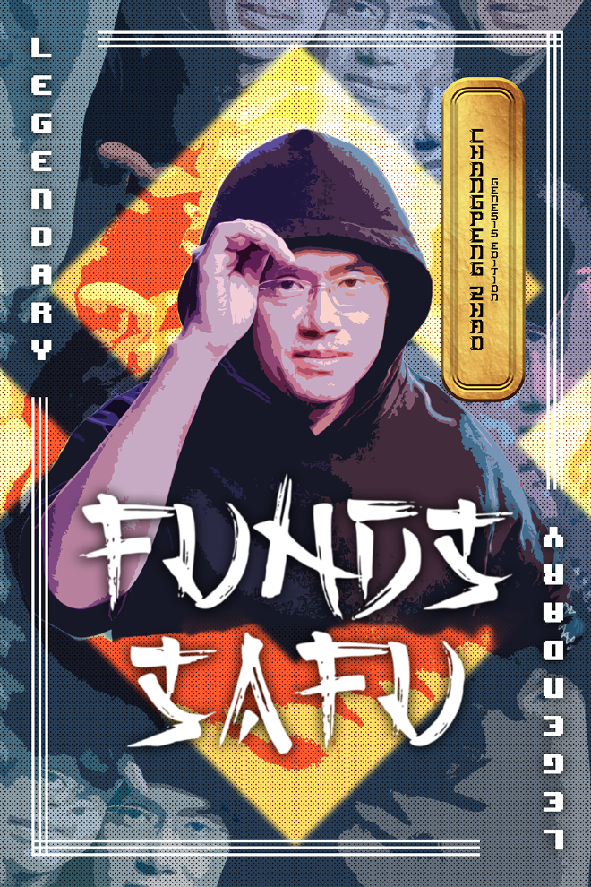

> *作者：musclesatz*
>
> *来源：<https://www.musclesatz.com/articles/bitcoin-past-present-future/>*
>
> *本文为《比特币的过去、现在和未来》译本的第五篇。前一篇见[此处](https://www.btcstudy.org/2023/02/16/bitcoin-past-present-future-part-4/)。*

## 协议的现状

### 屋漏偏逢连夜雨

在摧毁了叫做 “纽约共识（New York Agreement）” 的群氓之后，人们意识到，比特币是不可驯服的。即使 80% 的哈希率、最大的报纸、最大的 ASIC 制造商、最大的交易所和开发者多数，一起参与一个最大的比特币会议，想要控制比特币也只能垮台。没错，比特币是不屈不挠的。欣喜之情洋溢四方。

但是，这种欣喜，很快被两个负面事件（以及有歧义的第三件事）给浇灭了：

1. 2017 年 11 月 14 日，Baltic Honeybadger 大会开幕的几天前，一位 Bitcoin Cash 程序员在 Bitcoin Core 的代码中发现了一个通胀 bug，他声称这个漏洞如被利用，可以导致另一次不受控制的通胀，就像比特币早期的那次一样（逼得中本聪不得不执行一次软分叉）。

这个 bug 是由 Matt Corallo（马特·科拉罗）通过更新加入到代码中的。简单来说，节点会先检查一笔交易时有效的 —— 检查脚本有效、签名有效、没有制造通胀 —— 然后再放到交易池中；新区块到达时也会执行这样的检查；所以，有两次检查，交易池检查和区块检查。

马特在一系列的优化中删掉了其中一次检查，然后连续两次检查之间的交互就会创造这个很难利用、但并非绝不可能利用的漏洞，产生了不受限制的通胀风险。跟中本聪的 bug 的区别在于，中本聪的 bug 本来就存在，而这个是后来产生的，所以很多人都很困惑，因为这意味着： 

- Bitcoin Core 的开发者们，虽然能够嘲笑 “叛教者” Gavin（嘉文）、Gzrzik（贾兹克），等等、揭穿 Bitcoin Unlimited 客户端的漏洞、纽约共识的漏洞，但也不是绝对正确的；
- 一种社会风气已经形成，有些人提交的代码没有得到任何人的评审，因为他们被认为不可能犯错；
- 这个发现并不来自 Bitcoin Core 开发者自己，而是来自 Bitcoin Cash 的开发者。

2. Steam（一个正版游戏分发平台）最终放弃了支持比特币支付，虽然他们此前已经支持比特币大约 1 年了。在博客文章中宣布此事时，他们提到的理由有：
   - 比特币的价格汇率波动太大；
   - 链上的手续费太高（但我必须说一句，这是因为网络中都是空区块，所以交易池非常堵；谢谢你吴忌寒）。
3. 12 月 9 日，由[芝加哥期权交易所](https://www.cboe.com/)授权的第一份比特币期货合约推出并正常化。在这些期货合约执行前不久，比特币兑法币的汇率在 12 月 17 日达到了历史新高：19783 美元。

> 快进到 2022 年：本轮市场波动的低点低于历史高点，因此许多人都很恐慌。但打开 [bitcoinvgold](https://www.bitcoinvgold.com/) 网站，并使用 Jameson Lopp 的[工具](https://bitcoin.craighammell.com/never-look-back)，我们会发现，实际上比特币在 2017 年的购买力是被高估了的。

### 天才想法：taproot

2018 年在行情下跌中开始，但在 1 月 22 日，Gregory Maxwell（格里高利·麦克斯韦尔）提出了一个非常有趣的想法。对协议层的改变总是会讨论很长事件，但两个特性是被讨论得最多的：

- Schnorr 签名：如本文第一章（[译本第一篇](https://www.btcstudy.org/2023/02/12/bitcoin-past-present-future-part-1/)）所说的，这种签名的最显著的优点是，你可以加总 Alice 的公钥和 Bob 的公钥、产生一个新公钥；在签名时，两人分别签名，最后却可以得出一个签名，且这个签名正是那个新公钥的有效签名。实质上就像一种链下的 multisig；
- [MAST（Merkelized Abstract Syntax Trees，默克尔抽象语法树）](https://www.musclesatz.com/articles/bitcoin-past-present-future/mit.edu/~jlrubin/public/pdfs/858report.pdf)：利用一棵默克尔树来表达一笔交易的所有花费条件。只有实际上用到的花费条件才会曝光，所以交易的体积可以更小、效率可以更高。此外，MAST 还可以创建仅在特定条件下才能执行的合约，可以让交易变得更加灵活和强大。2018 年 1 月的时候，这个想法有两种 BIP：*BIP 114 – Merkelized Abstract Syntax Tree* 和 *BIP 117 – Tail Call Execution Semantics* ；它们之间是互不兼容的，所以要选就只能选其中一个。

格里高利想出了一个绝妙的主义：

> *“我们不必把脚本的默克尔树根作为输出放在时间链上，可以放一个 Schnorr 公钥上去，因为，几乎每一种合约，都有一种退化情形（最明显的情形），就是所有参与者都同意的那个。我们可以在比特币上实现一种标准合约，其公钥是所有参与者的公钥之和，因此，如果所有参与者形成了一致意见，都签名了，他们的签名就可以加总起来，形成一个签名，直接花费合约中的资金而不必诉诸合约的代码。此外，这个公钥又是通过乘以默克尔根，微调过的。所以，如果参与者之间有争议，他们可以选出需要执行的合约代码分支、通过默克尔分支揭示默克尔树的结构，然后展示这个树根是如何包含在调账后的公钥中的。”*
>
> —— 格里高利·麦克斯韦尔

格里高利采用了 Schnorr 签名的提议和两种 MAST 提议，将两者融合在了一起，形成了它称为 `taproot` 的想法。

同样在 2018 年 1 月，Stripe 放弃了对比特币的支持，因为 Steam 已经放弃了。隔离见证已经进入了生产环境，闪电网络也在蓬勃发展，但依然非常小众，还没有触及主流。

2018 年 3 月 23 日，一个重要的非技术事件发生了。在此之前，最著名的比特币书籍毫无疑问是 Andreas M. Antonopoulos（安德鲁斯·M·安东波罗斯）所著的《[精通比特币](https://aantonop.com/books/)》。这时候，Saifedean Ammous（赛费迪安·阿莫斯）所著的《[比特币本位](https://www.saifedean.com/)》出版了，而且很快便进入了大众，因为它不仅影响了比特币人，还显著影响许多不了解比特币技术、纯粹从经济视角看待它的人。

> 这本书被 Michael Saylor（迈克尔·塞勒）和 Jack Dorsey（杰克·多洛希）引为给他们启蒙的东西之一。

### Drivechain 和 “后比特币神教”

2018 年 3 月 31 日，Blockchainlab 关门大吉了；但是，4 月 7 日，Paul Sztorc（保罗·斯托克）的博客 [truthcoin](https://www.truthcoin.info/) 上发表的一篇文章引发了一个新的现象。保罗本来想在比特币上创建一种预测市场，但是比特币缺失了一些功能。保罗没有提出引入这些功能的提议，转而成了侧链技术最大的支持者之一。但是，他发现，比特币上的侧链都以特定的形式（免信任的想法）开始，但最终都走向了信任模式。

保罗不喜欢这种模式，他提出了 `drivechain` 的概念，本质上，就是让矿工可以对一条侧链的历史投票，这样节点就不必自己验证这些历史，但需要信任矿工中的多数。这是一种完全不同的信任模式，而且将大量的权力交到了矿工手上；而且，因为矿工在隔离见证的故事中表现得好像敌人一样，所以，人们对信任矿工来运行去中心化系统的核心想法产生了怀疑。许多人因此拒绝 drivechain 的想法，认为这实在太过危险。保罗也将自己的提议视作区块体积争论的解决方案，因为主链保持小区块的同时，各 drivechain 上可以使用大区块；但这也没有被人们接受，因为它要求人们非常信任矿工。

> 保罗还写过一篇关于工作量证明的，非常精彩：[Nothing is Cheaper than Proof of Work](https://www.truthcoin.info/blog/pow-cheapest/)（[中文译本](https://www.btcstudy.org/2022/02/21/pow-cheapest/)）

4 月 7 日，保罗发表了这篇文章《[Bitcoin Post-Maximalism](https://bitcoinwords.github.io/bitcoin-post-maximalism)》，开创了一种趋势。虽然早在 2014 年，就出现了以前的比特币人憎恨比特币的情形，因为他们原来用比特币赚了很多钱，但又在市场下跌中损失惨重。但在这篇文章中，保罗提出了 “后比特币神教” 和 “反-比特币神教” 的概念：这是一种文化反应，当垃圾币的世界陷入灾难时，这些人就开始指责警告了垃圾币未来会崩溃的比特币神教教徒。尤其是 ICO 的崩溃，保罗说市场崩溃并不是因为有人创建了不可持续的泡沫并且每个人都在其中投机，而是因为神教教徒阻止了 drivechain 技术，要是有 drivechain，市场就不会崩溃。所以，他宣布自己不再是个神教教徒了。

它引发了至少 11 次这样的浪潮。

### eltoo、RGB、闪电火炬、CoinJoin 战争和黑名单

4 月 30 日，Christian Decker（克里斯蒂安·德克尔）、Rusty Russell（洛斯蒂·拉塞尔） 和 Olaoluwa Osuntokun（奥罗卢瓦·奥森托昆）又带来了一项技术创新：“[eltoo](https://runbitcoin.org/wp-content/uploads/2019/04/eltoo.pdf)”。eltoo 是德克尔在几年前构思的想法，非常类似于 Thaddeus Dryja（撒迪厄斯·锥亚）和 Joseph Poon（约瑟夫·潘）的闪电网络。eltoo 是另一种实现闪电网络的方式，而且更简单、备份数据的风险更低，支持多方通道，以及其它微小的优势。想法很棒，但需要在比特币链上作一个改动才能让它跑起来，这就是 *BIP 118 – SIGHASH_ANYPREVOUT*  。简单来说，在创建一笔比特币交易的时候，你需要为交易的每一个输入提供（该项资金所有者的）签名。一般来说，只有当前这个输入会被签名，以前的输入、未来的输入都不能使用这个签名；也就是说，如果这个输入被移到另一笔交易中，你所创建的签名就失效了 —— 这是为了保证输入只能按其主人的意愿被花费。

`SIGHASH_ANYPREVOUT` 则是这样一种签名选项，它允许签过名的输入可以放到未来的任何交易中，不论这个输出是否已经被移动过。This allows signatories to retain control over how their funds are spent even if the input is moved to different transactions（此句不可解）。

这个想法获得了大量好评，但依然停留在概念阶段，克里斯蒂安不想太过急切地推行它。

2018 年 7 月 3 日，Zucco（祖科）在里斯本演讲了 RGB 协议，分享了文档和 RGB 背后的想法。从这里开始，RGB 的想法将由 Maxim Orlovsky（马克西姆·奥尔洛夫斯基）带领的一队乌克兰年轻人带着继续前进；后来 Federico Tenga（费德里科·腾戈）加入了，并推出了第一款 RGB 钱包（[Iris Wallet](https://mobile.twitter.com/iris_wallet)），在 2022 年 10 月发布。

2019 年末1 月，一位匿名的推特用户 `Hodlonaut` 提出了建立一个叫做 `闪电火炬` 的闪电中继网络的想法：他发了一条推特，表示他会给第一个回复他这条推特的人支付 10 万聪（satoshi，比特币的最小单位），只要留下闪电网络发票即可；但这个人必须发一条同样形式的推特，并加码 1 万聪，也就是给下一个最快回复的人支付 11 万聪，以此类推；他想看看闪电网络能让这个实验进行到什么程度。在实验断掉、又经 Elizabech Stark（伊丽莎白·斯塔克）和 Jack Dorsey（杰克·多洛西）重启之后，这个实验变得宏大起来，而且不止于此：在 Bitcoin Magazine 因为担心法律后果而拒绝接受邀请之后，这笔钱通过一个苏格兰人流入了伊朗，因此违反了美国的管制。这支火炬变得非常著名，而且骗子也蜂拥而至：一个著名案例是，当火炬传到祖科手上时，一位名为 “比特币巫师” 的用户留下了一条闪电发票；得到支付后，这个人就带着资金完全消失了（那确实是一个创建不久的账号，但也有很多交互，而且有一些名人是其粉丝）。这时候，祖科自己拿出了同样数额的钱，重启了火炬传递；当火炬达到了一个可观的数额之后，它被发给了 Bitcoin Venezuela，一个致力于帮助受到恶性通胀和独裁统治折磨的委内瑞拉人的志愿者协会。

4 月 12 日，另一件大事发生了：`We are Hodlonauts（我们都是 Hodlonauts）`。Hodlonaut 因为闪电火炬而变得非常著名，他在推特上的粉丝数量超过了 1 万，然后，他开始使用自己的影响力警告人们 Craig Wright（克雷格·怀特）的可疑，因此，他收到了克雷格·怀特的威胁信。他是匿名的，但 Calvin Ayre（卡尔文·艾尔）（克雷格·怀特背后的金主）在产出的出版物 CoinKeeg 中悬赏 5000 美金（以 BSV 支付）揭开 Hodlonaut 的真实身份（BSV 是一种分叉自 Bitcoin Cash 的垃圾币，译者注 ）。有人获知 Hodlonaut 可能住在奥斯陆，于是就给 Hodlonaut 的雇主打电话，假装成挪威警察，要调查这个推特账户。这位雇主真的相信了他是一名警察，因此公开了 Hodlonaut 的全名和地址；然后，克雷格的起诉书就送到了 Hodlonaut 的家里，起诉理由是诽谤。

这件事引发了一场壮观的运动：每个人都在自己的个人简介页添加了 Hodlonaut 的图片，并把卡通人物的头都放进 Hodlonaut 的头盔里面。

- 推特上充斥着给 Hodlonaut 的声援 -

克雷格·怀特诉 Hodlonaut 案在 2022 年 10 月结案，Hodlonaut 胜诉。

视频：https://youtu.be/KniTdm-qKpY

2022 年 12 月 23 日，Hodlonaut 在推特上披露克雷格已经请求上诉（并且已被接受）：

> *“我刚刚知道挪威法庭接受了克雷格的上诉。我将不得不重头再来一遍。我当然不会认输。”*
>
> —— hodlonaut 13%er 🌮⚡🔑 🐝 ([@hodlonaut](https://twitter.com/hodlonaut/status/1606221441376038912?ref_src=twsrc%5Etfw))

2019 年 5 月 1 日，Nicolas Dorier（尼古拉斯·多里亚）提出了 *BIP 78 – A Simple Payjoin Proposal（简单的双向支付提议）* ；Payjoin 是一种类型的 Coinjoin（多人为同一笔交易添加输入），只不过在执行 Coinjoin 的同时你也完成了一笔支付。具体来说，Payjoin 交易有两个输入，一个来自支付方，一个来自接收方。也就是说，资金不是由支付方直接发给接收方的，而是（相当于）双方都把资金给了某个 “中间” 地址，然后双方再各自把资金从 “中间地址”（混合过的资金）中取出。这样一来，外部的观察者就不知道谁是发送者，谁是接收者了，因为他们的资金混合过了。

几天以后，2019 年 5 月 8 日，第一个可能成真（因此让人担忧）的为了保护私人利益而回滚比特币的提议出现了。具体来说，币安交易所被黑了，其 CEO 赵长鹏宣布他会给矿工付钱，让发生盗窃的链变成孤儿链；他希望拿回这些资金，并说服矿工挖掘另一条链。这没有给比特币链制造无效的状态，产生重组也没有违反规则；但仅仅是为了挽回币安的安全性问题所造成的损失就发动重组，也是非常有争议的。最后，重组并没有发生。

- “资金是安全的！” -

再说回链上隐私。8 月 2 日，`CoinJoin` 实现之间的战争开始了。CoinJoin 就是多方为同一笔交易提供输入；一开始，中本聪在他的白皮书里说，当一笔交易有多个输入时，很明显这些输入都属于同一个人，这是链上隐私的局限性 —— 有些线索必然暴露；但实际上，几年以后，格里高利·麦克斯韦尔在 bitcointalk 论坛上写了一篇帖子，指出交易的输入并不必然来自同一个人。你需要做的只是实现一个足够好的钱包（让多个人为同一笔交易提供输入）。格里高利，theymos（德默斯）和其他人提供了 15 BTC 作为奖金，悬赏开发这样的钱包，但这个原型迟迟没有出现，直到 nopara 推出了 [zerolink](https://github.com/nopara73/ZeroLink)，它采用了 David Chaum（大卫·乔姆）最初的 e-cash 的理念，并放在 CoinJoin 的语境中，从而让协调员失明；就像在 e-cash 中，协调员靠着盲签名，在不知道自己签名了什么东西的情况下防止了重复花费，CoinJoin 的协调员也失明了。CoinJoin 在 Wasabi 钱包、Whirpool 钱包和 Samorai 钱包中都实现了。

8 月 2 日，`Dojo` 推出，这是一种 Bitcoin Core 的从属应用，跟 Bitcoin Core 一起运行，用来跟 Samourai 钱包 `沟通`。Dojo 是必要的，因为在此之前，在使用 Samourai 和 Whirpool 之时，CoinJoin 期间的服务器是通过大卫·乔姆密码学致盲的，但 Samorai 是一种手机钱包，而且所有的公钥都需要进入和退出 Coinjoin。这种批评因为 Dojo 的推出而部分得到缓解，因为，如果少数用户使用了 Dojo，而许多用户 “正常” 使用 Samourai，结果就是，如果一个使用 Dojo 的人跟许多使用 Samourai 的人进入了一笔 CoinJoin 交易，那么你的公钥是哪个将一目了然，因为只有你的哪一个是不可追踪的，别人的都是可以追踪的。

这件事具有历史意义，因为随着 Dojo 的推出，Luke Dashjr（卢克·达实）和格里高利·麦克斯韦尔的批评开始了，他们警告这个实现不好，建议不要使用。其他许多开发者加入了进来，随之而来的是一场没有边际的、无关技术的 文化/道德 战争。

> 2019 年 12 月 3 日，Bitfinex 成为第一个集成闪电网络的交易所。

2019 年 12 月 12 日，第一种 “第二代” 闪电钱包 `Phoenix` 发布，这种实验性的钱包的理念是这样的：“当每个人都在使用比特币、小额资金无法在链上结算（也就是普通支付将使用 Layer2 或其它形式的链下技术）时，你使用一个复杂的、要分别管理链上和链下两种余额的钱包，有什么意义？”

因此，分别展示两种余额（链上的、所有闪电通道中的）也没有意义。但也不是要展示每一条通道的余额，只是抽象地表示出来。就像在浏览网页时，我们不会想要看到每一个 TCP 连接，如果真的需要，我们会手动打开浏览器的高级选项，但在日常使用中，浏览器作了一次抽象，来隐藏这些复杂性。

这种简洁性意味着许多的妥协和取舍：

- 从隐私的角度看，如果你在使用 Phoenix 时不使用洋葱网络，那么别人可以看到你的 IP 地址，并观察你的所有公开通道；
- 当某人通过链上交易（潜水艇互换）给我支付时，代价可能很高；
- 它可以出借流动性给你，但价格非常高。

> 2019 年 12 月 27 日，Facebook 公司推出的密码货币实验 Libra 以失败、关门告终。各种各样的记者找上最著名的比特币人，要求他们评论此事：他们直接以早期的 PayPal 和 Linden Dollar 的例子回应。

2020 年 1 月 6 日，一个将在 2022 年变成一场大戏的提议出现了：Jeremy Rubin 的 `BIP 119 - CHECKTEMPLATEVERIFY`，但在当时，它乏人问津。这是一种 `限制条款（covenant）`：在当前的比特币上，如果我可以花一笔钱，我就可以把它发到任何地方去。我创建一个满足花费条件的脚本，它会放在输入里面，然后这个输出就被花费掉了；此时我创建一个输入，使用完全不同的花费条件 —— 我先满足 A 条件，然后才能创造 B 条件。花费条件 B 无法做到：只有你创建的输出（条件 C）满足某一些条件时，你才能满足我这个花费条件。你是做不到让一笔资金只有在交易的输出满足预定义的条件时才能花费的。（而限制条款就是开启这种特性的技术。）

2020 年 1 月 19 日，Pieter Wuille（皮耶特·乌勒）、Jonas Nick（乔纳斯·尼克）和 Anthony Towns（安东尼·唐斯）提出了 *BIP 341 – Taproot: SegWit version 1 spending rules* 。两个月后，3 月 16 日，新型冠状病毒 COVID-19 大流行爆发，封锁和隔离也开始了，经济活动面临普遍衰退，连比特币也大跌了。

5 月 11 日，在半个地球处在封锁管制之中的时候，比特币增发速度的第三次减半到来。6 月 9 号，又出现了一场闹剧，是关于 “blacklist（黑名单）” 的。比特币软件可以按照 IP 屏蔽滥发消息的、不值得信任的或者经常搞破坏的对等节点。实际上，这就是我们说的 “黑名单”，但在美国文化中，从 2020 年开始，就有一种攻击软件项目的风气，说 “blacklist”、“whitelist（白名单）”、“Master（常被用作软件开发的主分支的命名）” 这样的词语会让人联想到奴隶制，因此应该使用别的词语。2020 年 6 月 9 日，一个路人用户（没有别的贡献）在 Bitcoin Core 代码库里发起了一项 Pull Request，要把 blacklist 这个种族主义用词替换成 blocklist。除了是一个有点搞笑的事件，它也是一个技术问题，因为在比特币软件中，这个词的含义是非常模糊的。这个 PR 被 Marco Falke（马尔科·法尔克）不经讨论立即投入了生产环境中，因为他希望避免 “混乱”，而且显然如果他拒绝这个 PR，就会吸引那些指控他是种族主义者的人。所以，他出于自己的意愿，就把这个 PR 合并到了生产环境中。Bitcoin Core 在生产环境中合并了一个荒谬的请求，这激怒了许多开发者，他们指出 Bitcoin Core 不是过家家，不是人们搞政治宣传的地方，它是一个至关重要的软件，你不能不经过社区的同意就把一个请求合并到生产环境中。状况升级到 John Newbery（约翰·纽伯瑞）不仅开始为这个举动辩护（“为了包容性”），甚至拉黑了一位曾经给 BTCPay Server 代码库提交代码的贡献者。这个影响是非常负面的，而且引发了一个持续至今的问题。开发者的角色改变了，而且一直在变化：在区块体积大战中，开发者是 “守土英雄”；但如今我们可以看到，同样一些人，难以对抗开始影响社会的民粹主义（populusmo） 。新一波的开发者屈服于这种清教徒式的傲慢，而且被赶出项目的恐惧变得越来越强烈，尽管这样的事情明明跟管理代码和创建软件的能力没什么关系。这跟 90 年代和 20 世纪初期的文化形成了鲜明的反差，那是一个 “别烦我（no bullshit）” 的年代，穿着奇装异服、放肆无礼和玩世不恭才是常态。

> Richard Stallman（理查德·斯托曼）被逐出了他自己创建的基金会 —— Free Software Foundation（自由软件基金会，FSF），因为他的一些言论和行为被认为不合适、对软件自由事业有害。具体来说，斯托曼被指控发表性别歧视言论以及提议对遭到性侵的受害者采取不当行为。FSF 决定开除他的主席职位，以保护组织的体面、确保他推动软件自由事业的努力不会因为不当言行而被破坏。

- “自由是指言论自由，不是指免费啤酒。” -

2020 年 9 月 3 日，由芝加哥期货开启的金融化浪潮仍在持续。11 月 30 日，比特币的法币汇率突破前高；对美元的汇率突破了 19850，因此我们正式进入了牛市。

（未完）

> 续篇见[此处](https://www.btcstudy.org/2023/02/19/bitcoin-past-present-future-part-6/)。