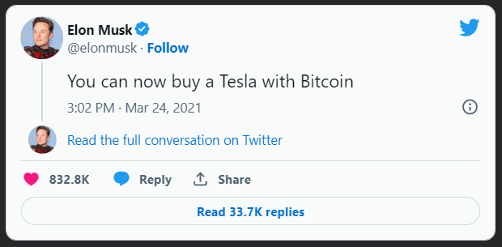
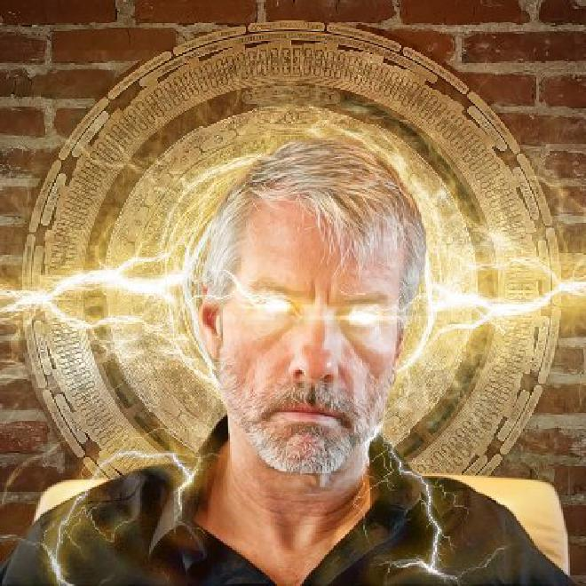

> *作者：musclesatz*
>
> *来源：<https://www.musclesatz.com/articles/bitcoin-past-present-future/>*
>
> *本文为《比特币的过去、现在和未来》译本的最后一篇。前篇见[此处](https://www.btcstudy.org/2023/02/18/bitcoin-past-present-future-part-5/)。*

## 现在与未来

### Taproot 锁定以及二氧化碳寓言

终于讲到现在了。出于便利，我们就从 2021 年开始。

2021 年初，Elon Musk（伊隆·马斯克）这个小可爱就宣布从 2 月 8 号开始，特斯拉公司将储备一些比特币；这是在封锁结束之后的宏观局势中，对美元和其它法币表达的不信任。到 3 月 24 日，特斯拉公司直接接受了比特币作为支付手段。

马斯克依赖于 BTCPay Server，与之建立了良好的或伙伴关系，这也引发了比特币价格的一波上涨。所有这些炒作和权力都在人们意料之外，是基于马斯克这样的名人的态度转变的。名人效应非常让人意外，人们的热情也直冲云霄，全部都是价格上涨的有利条件。

2 月 12 日，一位用户在推特上创建了一个 “#LaserRayUntil100K” 活动，字面意思就是，在比特币的价格到达 10 万美元之前，一直使用带有镭射眼的头像；然后每个人都在推特上使用带有镭射眼的照片。

- Micheal Saylor（迈克尔·塞勒）的镭射眼 -

3 月 6 日，taproot 的激活历程开始了；此前虽然已经有了 BIP 341，但并没有出现任何实际的激活提议。讨论很多，但都不是关于 taproot 本身的，因为不论技术上还是政治上都没有争议（不像隔离见证）。Taproot 对所有人都是好事。真正的辩论时关于如何在生产环境中激活的；人们讨论了两种方向：

- *BIP 8 – Version bits with lock-in by height（按高度锁定的信号位激活机制）：“我们给矿工一些时间，让他们在准备好之后告诉我们；但即使他们没有准备好，我们依然会执行这次软分叉”；*
- *BIP 9 – Version bits with timeout and delay（带有超时和推迟机制的信号位激活）：“我们给矿工一些时间，他们在准备好之后就可以告诉我们；如果他们没有准备好，那这次软分叉就算失败”。*

分歧带来了一个问题：想要保守一些，BIP 9 方法肯定是更好的，但另一方面，一些向来非常保守的开发者（例如 Luke Dashjr）又坚持，这种 “保守” 方法让矿工可以掀起政治活动，让软分叉的预备机制变成一种政治投票机制。

最终，一种令人难以置信的提议出现了，并且它因为 Bitcoin Core 的开发活动而拥有了巨大的推动力，但实际上所有人都不高兴。这就是叫做 `Speedy Trial（速战速决）` 的提议，它允许先使用 BIP 9 这样的机制，但不会给矿工一年的时间，最多只会给一个月。也就是说它给出了在尝试、失败之后也许还能再发起 BIP 8 的余地。

“速战速决” 提议出现之后，所有 BIP 8 阵营的人都不满意，因为不论如何它还是给了矿工权力；但保守的 BIP 9 阵营又认为这种激活方式太危险，因为时间窗口非常短。

Bitcoin Core 维护者们的普遍感觉是，就没有什么具体的措施，虽然 taproot 已经被讨论了很久了，但没有人出来做任何事情。然后 “速战速决” 就被部署到了生产环境中，而且还有一个用户可以操作的标签，可以把 “速战速决” 变成 BIP 8，在窗口期结束后就直接激活。

从技术的角度看，每个人都会对 taproot 的到来感到高兴；但从方法的角度看，很多人都感到失望，因为这看起来就跟垃圾币上的情况一样：开发者觉得某个东西足够好了，其他人就必须接受。

> 6 月 12 日，Taproot 正式进入了生产环境。

2021 年 5 月 5 日，一家上市的矿业公司 Bitcoin Marathon 挖出了一个区块，并在其 coinbase 交易中写道 *“这是一条 OFAC 合规的区块链”*（OFAC 是一个金融特别工作组，工作内容是在全球市场中消灭被认为 “有害和肮脏” 的交易以及任何妨碍政治制度的东西）。我们不知道一条区块链变成 “OFAC 合规的” 是什么意思，但一边倒的抗议马上就爆发了，比特币人开始制作 CoinJoin 交易、让居住在伊朗的朋友将资金转发到 Marathon 的 coinbase 地址里。基本上，Marathon 被混洗过的货币和来自 “不合规地址” 中的 “自由货币” 给淹没了。

5 月 19 日，对那些把一切都押在马斯克身上、把他当成比特币吉祥物的人来说，灾难降临了；特斯拉公司宣称：

> *“我们做错了。我们发现比特币会产生二氧化碳，并导致全球变暖，因此我们不再接受比特币了。”*
>
> —— 特斯拉

显然，这种说法没有任何道理，他们还提出了每一笔比特币交易的能源消耗量：这个指标没有任何道理，因为比特币交易不消耗能量，最多你只能以区块为单位，估计挖矿所消耗的能量，但进一步推导到每一笔交易的能量消耗就没有任何意义。不然你要干什么？因为特斯拉的电车要耗电，就让特斯拉关门吗？

特斯拉的声明是完全错的，但奇怪的是，特斯拉公司并没有卖出自己储备的比特币，只是不再接受比特币支付而已。关于这样做的动机，人们有几种猜想。最流行的一种（没有证据，只是联想）是，一些人提到，自特斯拉在 2 月 8 日宣布接受比特币支付依赖，许多人都用比特币购买了特斯拉，但在美国，如果你出售比特币来换取法币，你需要支付资本利得税，除非你拿去买东西，那就不需要支付资本利得税。所以，许多人通过拿比特币购买特斯拉（免税），再把特斯拉卖成美元，就躲避了资本利得税。

上面的环保注意什么可能进一步掩盖了这种没有证据的猜想。同样的，矿工并不必然会产生二氧化碳，因为挖矿是用电的 …… 然后有人可能会说：*“那电力是燃烧化石燃料产生的呀，因此也会释放二氧化碳到大气中。”*。那行啊，特斯拉的电池是不产生二氧化碳（目的是为了停止使用内燃机），你的电池不是也要用电吗，电不是也要从什么地方来吗？特斯拉要扮演环保主义者、说比特币不环保，怎么着都让人汗颜。

### 禁令、战争和限制条款

2021 年 5 月 21 日，另一份禁令在中国下达 —— 从 2014 年以来，中国一直在毫不动摇地封锁比特币。所有矿工都不得不停止在中国大陆挖矿。有趣的事实是，中国境内的哈希率有 30% 是地下的，这是以往的禁令失败的绝佳证据。另一个有趣的事实是，价格并没有因为禁令而改变（再次为马斯克感到尴尬）。

2021 年 5 月 31 日，Marathon 的 CEO Fred Thiel（弗莱德·泰尔）在一段视频中露脸，宣布他们会拥抱比特币社区的原则，根据协议确认一切有效的比特币交易。不会有黑名单，而且他们会支持 taproot。

6 月 5 日，在迈阿密的比特币大会上，Jack Mallers（杰克·迈勒斯）（非常激动地，哭着）宣布萨尔瓦多将接受比特币作为法定货币：

视频：https://youtu.be/_59hrgTiRJU

几天以后，这项法律在萨尔瓦多接受投票，而且发生了一些微妙的事情：萨尔瓦多的总统 Nayib Bukele（纳伊布·布克勒）开设了 一个 twitter space（语音聊天室），跟比特币人平等交谈，而且制作了标准的推特表情包。显然，布克勒这是在自己家里，因为他在聊到一半的时候道歉说自己要去投票了。这项法律得到了大量赞成票，因此通过了：

- *“所有萨尔瓦多的公民都有义务，在接受支付时接受比特币，只要客户希望以比特币支付”*。这在许多人心中产生了矛盾，一方面，比特币能被用于支付当然是好事，但另一方面，如果某个商家不愿意接受比特币，就会遭到警方的强迫，那在伦理上就不是好事了。
- 如果商家面临技术上的困难因此无法接受比特币，则可免除这种义务；
- 国家将会为所有商家提供基础设施，让他们可以实时交换比特币和美元，而且不必支付手续费。

这是一种可以容忍的法定货币，因为它不是由国家强加的。9 月 7 号，萨尔瓦多实行比特币法。

- 纳伊布·布克勒的漫画 -

2021 年 11 月，Adopting Bitcoin 大会在萨尔瓦多举行，在此期间，taproot —— 已经在 6 月锁定 —— 激活了。

现在是 2022 年。

2 月 24 日，俄罗斯军队入侵了乌克兰；许多年轻人决定逃离乌克兰；虽然乌克兰被入侵了、不是侵略者，但它毕竟是个民族国家，具备民族国家的所有特点，因此国家立即动员起来，阻止年轻人离开祖国。

许多人认为自己有一些事情比向素未谋面的人开枪更重要，所以依然决定逃离。一个乌克兰人在银行账户和 ATM 被冻结、无法携带现金离开祖国的情况下，拿着比特币成功逃离；他的故事在互联网上传开了。

不仅有人逃离乌克兰，也有人逃离俄罗斯，因为俄罗斯也有一样的全民动员。随着这些故事的传播，比特币回到了聚光灯下，此外，乌克兰政府还发起了一项密码货币募捐（比特币和垃圾币来者不拒）来支援军队，这项募捐活动也非常成功。

4 月 19 日，又发生了一场戏剧。Jeremy Rubin（杰里米·鲁宾）（不是一个特别受欢迎的开发者，曾跟 Mike Hearn 一起提出在比特币中增加黑名单）在两年前提出了著名的 `限制条款` 技术（可以限制花费交易的输出的花费条件）的一个非常全面的版本：*BIP 119 – CHECKTEMPLATEVERIFY*。杰里米突然发表了一篇博客文章（用 Gavin Andresen 的口气）宣布，关于 BIP119 的讨论已经太多了，但没有人表明立场。

他转而提议也为这个 BIP 来一次 “速战速决”。在 taproot 升级之后，一些人依然对 “速战速决” 耿耿于怀，因为他们认为，即使是 taproot 这样技术上没有争议的提议，使用这种升级方法也会带来负面效果，会激励每个人都使用速战速决来提议任何东西。

还有一些人因为杰里米曾经提议过黑名单而害怕限制条款，而有些人单纯是不喜欢杰里米，因为他使用了嘉文一样的不可一世的语气，用一篇文章就把所有人打死。当有一些人表示，限制条款是个好东西，但谁会认为它比 CISA（跨输入的签名聚合）、APO（eltoo 背后的技术）更重要？

这似乎变成了一场在推特和各种邮件组中上演的、伴有各种尖锐反应的闹剧。最后，在 5 月 2 日的时候，杰里米发表一篇文章，并在消息中宣布，他会等待社区的共识解决这个问题，等到他等不下去的时候，他会改变想法，为以太坊工作（嗯，你去吧）。

6 月 28 日的时候，另一波反比特币神教浪潮到来，这一次是由 Nic Carter（尼克·卡特）发起的。尼克有一个著名的身份是 Castle Islang Ventures 的联合创始人之一，这家风险资本专注于投资区块链项目。意思是，这家风投公司也投资垃圾币和模棱两可的共识，比如尼克投资了做链上活动分析的，和在以太坊上实现自动化 KYC 的。

不久之后，尼克就会参与一档倾向以太坊的播客，夸奖以太坊的诸多优点和历数比特币人的不是。接下来就出现了四十几篇文章的群舞，主题一模一样，都是比特神教的死亡。这些文章中，最主要的概念就是（用各种各样的方式）把比特神教跟 plan B 提出的 “[存量流量比](https://buybitcoinworldwide.com/stats/stock-to-flow/)” 价格预测模型联系起来（这个模型预测了 15 万美元的高点；许多神教教徒都同意这个预测）。实际上，许多人都嘲笑基于这种模型的价格预测，因为显然，市场价格是永远不可预测的。不然的话，不就等于天降油炒饭了吗。

在这个长篇故事中，最后一件事情不是关于比特币的，而是一种垃圾币 Tornado Cash，其 创始人/开发者 Alexey Pertsev（阿列克西·佩德采夫）被当局逮捕了。这个事件非常热门，因为首先，最大问题的垃圾币是以太坊，以太坊已经完全被审查了，其 51% 的出块者都表示服从 OFAC 的监管。但最令人震惊的是一位开源软件的开发者被逮捕了，他不像 Ross Ubrich（罗斯·乌布里希）是一个中心化的网站的主管、一位商人；也不像 Assange（阿桑奇）是一个组织的头头，他完全就是个开发者，人们以为他是受到保护的。但事实并不如此，而且，不幸的是，冲突往往都会加剧。

### 新的技术和固化

- `CISA（跨输入的签名聚合）`：我们已经说过，Schnorr 签名优于 ECDSA 的地方在于其可聚合性，即，如果 Alice 和 Bob 用自己的私钥签名了同一条消息，那么这两个签名的和将正好等于 Alice 和 Bob 的公钥之和的签名。这个方式已经存在于 taproot 中，我们可以制作出一个公钥，需要 Alice 和 Bob 两方的签名才能生成该公钥的签名。这种聚合是在单个输入的内部发生的，需要花费一笔这样的资金时，Alice 和 Bob 的签名就要聚合，然后只发布最终聚合而成的签名。

  > 但是，如果也能聚合不同输入的签名，是不是更好呢？
  
  一笔交易的多个签名都是签名的整个交易，为什么我们非得一个一个输入这样验证签名？我们可以将所有输入中的所有公钥的签名汇总成一个签名。这样做的好处很明显：节约时间链上的空间；让基本的 CoinJoin 交易在提高隐私性的同时费用更低（如无 CISA，CoinJoin 的手续费将比普通交易更贵，因为你在链上写入了更多东西，而且必须跟更多人协调；有了 CISA，假设 Alice 要支付一个输入和一个输出的手续费，她要独自支付一个签名的手续费；但 Alice 和 Bob 一起也只需要支付一个签名的手续费，这样签名的手续费就会在两人之间平坦）。
  
  真正的大问题在于，隔离见证是通过给签名数据的手续费打折来实现区块扩大的，所以 CISA 带来的手续费缩减已经很少了（签名数据的手续费本身就只有同体积的交易元数据的 1/4）。CISA 和隔离见证折扣不是好朋友。
  
  解决这个问题的办法之一是取消隔离见证的折扣，并引入 CISA，这样使用 CISA 的 6 个参与者就能获得跟隔离见证一样幅度的手续费减免（至少要有 4 个参与者，因为有一些开销是省不下来的）；而且，从架构的角度看，CISA 也比隔离见证折扣要干净清爽很多（隔离见证的折扣实在丑陋）。
  
  但也有开发者反对 CISA 的想法，不过，这是因为他们已经对比特币基本技术的固化做好了准备：
  
  > *“或迟或早，我们将不得不止步。CISA 确实是个好想法，但我们要走到哪里去呢？CISA 实现之后我们又会找出另一个好想法，但固化对于基础协议来说是必要的。稳定性比优雅更重要。就像 TCP/IP 协议自 1981 年至今的变化一样，只有顶层的协议改变了。”*
  >
  > —— John Carvalho（约翰·卡瓦略）

- `Simplicity`（已经在 Liquid 侧链上部署）：这是一种非常高级的比特币通用编程语言，在此基础上你几乎可以做任何你想做的事，包括重构几乎每一种你能想到的软分叉，然后将这种软分叉变成脚本定义的一部分（而不是变成共识规则）。节点在运行一段 Simplicity 脚本之前就可以知道需要投入多少计算资源以及它将耗费多少时间，所以它跟 Script 是显然不同的，因为它非常通用。Simplicity 是 Blockstream 公司创造的，而 Adam Back（亚当·贝克）声称：

  >*“Simplicity 是一种可以带来固化的软分叉，因为一旦它作为软分叉部署了，你就不再需要任何软分叉，所有需要的东西都可以用 Simplicity 复制出来。”*
  >
  >—— 亚当·贝克
  
- `APO（ANYPREVOUT)`：一开始 `APO` 是由 eltoo 论文提出的，叫做 `SIGHASH_NOINPUT`，而且有些地方很像限制条款。基本上，它的作用就是让签名可以用来花费输出，但不指定要花费哪个输出，你只需签名并确定可被花费的 UTXO 的脚本需要满足的一些条件即可。这种技术很有趣，它可以支持一种叫做 `eltoo` 的闪电通道建构方案，比目前在用的方案更优雅，因为不仅备份数据更加简单，而且可以同时跟 N 个人共享通道。APO 是完整的，而且有详细描述了（CISA 还没有）。它缺少的只是推动它的支持者，因为 Christian Decker（克里斯蒂安·德克尔）不想被看成不惜一切代价也要推动一次软分叉的人。

## 结论

我就在此处停笔了。

后面可能会有适当的更新，但此时我想先谢谢你，谢谢你跟我一起走了这么远的路，这意味你拥有的不只是一点点的耐心。

想给我留言的话，请不要客气，直接在 telegram 找我；或者你也可以在推特上找我！

（完）

