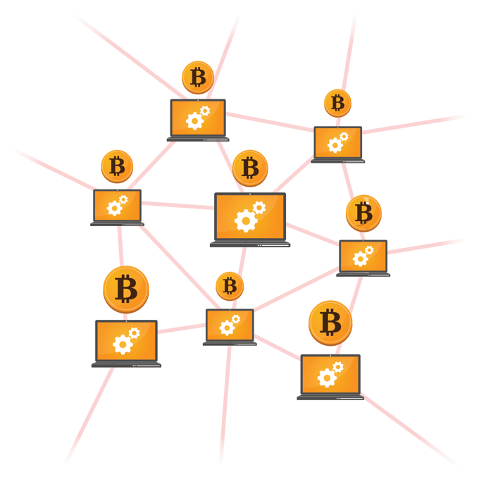
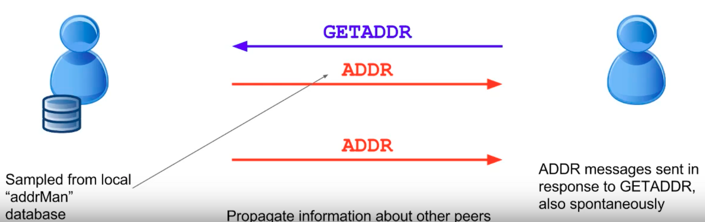
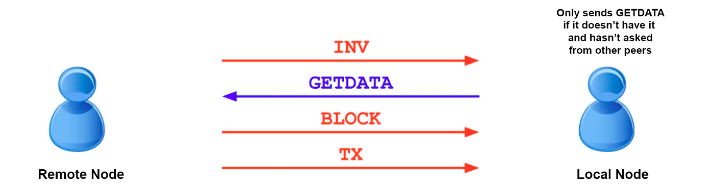
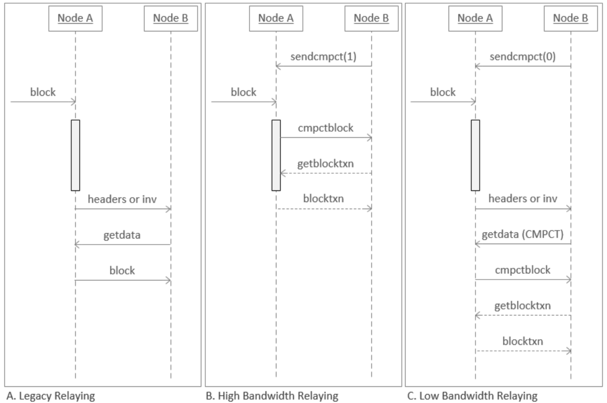

> *作者：samparsky*
> 
> *来源：<https://medium.com/coinmonks/bitcoin-peer-to-peer-networking-improvement-proposals-70841fdd572f>*




<p style="text-align:center">- 图源：https://portaldobitcoin.com/transacoes-nao-confirmadas-bitcoin-batem-recorde-e-chegam-155mil/ -</p>


本文旨在说明比特币点对点网络的运作方式。本文共分为 3 个不同的部分，分别讨论了比特币点对点网络的不同功能。

- 连接到网络中的一个节点
- 探测网络中的其它节点
- 接受交易或区块数据

## 连接到网络中的一个节点

如果你在自己的电脑上安装比特币节点，你会在配置文件中看到一些硬编码的比特币节点地址，即，种子节点（seeder node）。种子节点就是你在比特币网络中连接的首批节点。

以下是其中一个种子节点地址。你可以使用 dig 命令查看可供连接的比特币节点 IP 地址列表。

```java
$ dig seed.btc.petertodd.org
```

在连接到比特币网络中远程节点之前，你的本地比特币节点会发送 “**PING**”给想要连接的远程节点，后者会回复“**PONG**”。但是，如果远程节点（因掉线之类的原因）拒绝回复，就会被 “**FIRED**”，即，切断连接。

成功连接到网络中的比特币节点后，你会执行初次“**握手**”，即，发起连接的本地节点先发送其版本消息，等待远程节点返回其版本消息，然后本地节点发送确认远程节点版本的 “**Verack**”消息，等待远程节点返回同样的确认消息。


<p style="text-align:center">- 比特币节点的初次连接和握手 -</p>


在收到版本消息之前，远程节点不会发送任何消息。“**版本**”消息包括你正在运行的比特币节点的版本。

## 探测网络中的其它节点

你可以发送“**getaddr**”消息来了解网络中的其它比特币节点。成功连接到一个远程节点后，你可以向其发送“**getaddr**”消息，后者会回复一个可供连接的其它远程节点 IP 地址采样列表。

而且，这个远程节点会持续向你发送自己已连接的节点 IP 地址。



<p style="text-align:center">- 比特币节点探测流 -</p>


## 接收交易或区块数据

在从网络中的其它对等节点处接收到某个区块或交易后，远程节点会向已连接的对等节点发送 “**inv**”消息，检查它们是否已经存储了该交易或区块。没有存储该交易或区块的对等节点会向远程节点回复“getdata”，远程节点会返回该交易或区块的详细信息。



<p style="text-align:center">- 比特币数据请求流 -</p>


## 比特币点对点网络改进提案

为了提高比特币点对点网络的性能，目前已有多种比特币改进提案（BIP）。下面我们来看看其中几个。

### BIP 152 —— [致密区块](https://github.com/bitcoin/bips/blob/master/bip-0152.mediawiki)

BIP 152 旨在降低比特币网络中节点之间转发区块所占用的带宽。

该协议可以在“高带宽”和“低带宽”两种模式下使用，取决于可用的对等节点和带宽。在低带宽模式下，对等节点会同时发送新区块公告和 inv/区块头公告。不支持致密区块的节点依然可以使用传统的区块中继协议。

致密区块包含的是普通区块内交易 ID 的简缩版。在收到 cmpctblock 消息后，节点将计算其交易池（mempool）中所有交易的简缩版 txid，然后根据简缩版 txid 的匹配来检索出区块内包含的交易，从而构建出完整的区块。如果有某个交易找不到，节点会向发送 cmpctblock 消息的对等节点请求该交易。这样一来，节点无需发送区块的所有数据即可完成区块中继。通常情况下，区块中的绝大部分乃至全部交易都能在节点的交易池中找到，然后重新构建出区块。



<p style="text-align:center">- 来源：https://github.com/bitcoin/bips/blob/master/bip-0152.mediawiki -</p>


致密区块已经实现，并合并到比特币核心代码库中。点击下方链接可以查看提交到 Bitcoin Core 代码库的 pull request：

- https://github.com/bitcoin/bitcoin/pull/8068
- https://github.com/bitcoin/bitcoin/pull/8393

### Graphene —— 区块传播

Graphene 是一种新颖、高效的区块传播协议（由 *A. Pinar Ozisik、Gavin Andresen 等人开发*），提出使用布隆过滤器在本地的交易池中找出已加入某个区块的交易。（交易池是网络中所有等待验证和打包的比特币交易集合。）

Graphene 是基于 BIP 152（致密区块）的改进措施，将布隆过滤器和可逆式布隆查找表（Invertible Bloom Lookup Tables，IBLT）相结合，以降低区块传播成本。

### BIP 157 —— [客户端区块过滤](https://github.com/bitcoin/bips/blob/master/bip-0157.mediawiki)

该 BIP 介绍了一种新型比特币轻客户端协议，在现有可用选项上进行了改良。目前使用的轻客户端协议存在一些已知缺陷，不仅会削弱客户端的安全性和隐私性，而且容易招致对全节点的拒绝服务攻击。

BIP 157 可以代替现有协议，让轻客户端向网络中远程对等节点请求数据的同时保护其隐私性。

在该 BIP 中，过滤器并非由轻客户端发送给对等全节点。相反，全节点为所提供的区块数据会生成确定性过滤器。如果过滤器匹配到了目标数据，轻客户端就会下载完整的区块。由于过滤器具有确定性，每当有新的区块上链，过滤器只需构建一次，并存储在硬盘上。

这有助于提高隐私性。区块可以从 *任何来源* 下载，因此没有对等节点可以获得客户端所需数据的完整信息。另外，这样更能保证轻客户端看到所有相关交易，因为比起检查过滤后区块的完整性，检查来自对等节点的过滤器是否有效则更简单。

### 结论

比特币点对点网络的运作方式已经有了很大改进。关于如何优化比特币点对点网络，人们还在作进一步讨论和研究。

（完）