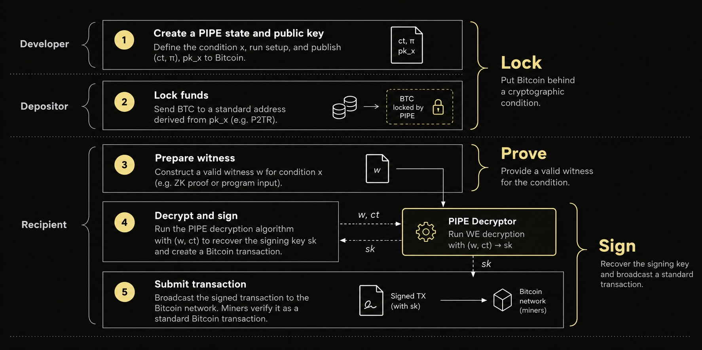

> *作者：allocinit*
> 
> *来源：<https://allocinit.notion.site/Bitcoin-PIPEs-v2-Covenants-and-ZKPs-on-Bitcoin-via-Witness-Encryption-3e536974087f805585d8ee3fb232cff7>*

**“Bitcoin PIPEs v2” 是一种密码学原语。它是扩大比特币协议可以强制执行的事项而不改变比特币共识规则的前进道路**。使用 “见证加密（witness encryption）”，PIPEs 让一个比特币签名密钥根据是否满足一个任意的计算语句而启用 —— 从而可以实现二元限制条款、非交互式的零知识证明、可编程的安全保险柜，以及比特币元协议。不需要软分叉、不需要受信任的运营者，也没有单独的共识环境。

## 本文的内容

本文将介绍 [Bitcoin PIPEs v2](https://x.com/allocinitxyz/status/2019411470232989918?s=20) 背后的核心思想：将花费条件放到 Bitcoin Script（比特币脚本）以外、密码学之中。我们将介绍从函数式加密（functional encryption）到见证加密的转向，二元限制条款、非交互式 ZKP、可编程的安全保险柜，以及元协议，以及还在积极研究中的安全性和启动假设。

## 引言：扩大比特币可以强制执行的事项

比特币的有意限制的脚本变成环境是其标志性特征之一， 但也限制了其脚本可以直接表达的花费条件。因为这一点，限制条款、任意的零知识证据（ZK Proof）的验证、 基于外部协议状态的条件语句，催生了 `OP_CAT`、`OP_CTV`、`OP_CSFS` 和 `OP_VAULT` 这样的提议，但所有这些提议都需要改变比特币的共识规则。

 [Bitcoin PIPEs v2](https://x.com/allocinitxyz/status/2019411470232989918?s=20) 则探索了一种互补性的方法：**除了扩展 Bitcoin Script 可以求值的东西， 我们能否通过密码学来扩大比特币可以强制执行的事项**？

其中的核心机制是 “**密码学条件性签名密钥释放**”。 使用见证加密技术用一个 NP 语句来加密一个比特币私钥。如能提供一个有效的见证 —— 例如一个ZK 证据 —— 就能复原这个私钥并用于生成一个普通的 Schnorr 签名。比特币自身并不执行底层的计算，也不理解这些条件；矿工和节点最终只在已有的共识规则下验证一笔普通的比特币交易。

这就创造了一种有用的隔离：协议定义什么事项必须为真，而一个证据则可以证明它确实为真，PIPEs 控制着签名能力是否可用，而比特币会验证和结算最终的花费动作。

## 将条件藏在签名背后

抽象地说，一个 PIPE 会用一个计算语句来加密一个比特币签名密钥。BTC 可以正常发送到其对应的公钥中，而私钥则是不可访问的，除非能满足必要的条件。

一旦生成一个有效的见证， 签名密钥就能解密，并用于授权花费。对比特币来说，没有发生任何反常的事情：节点只是验证保管着一些  BTC 的一个公钥的 Schnorr 签名。

这就是 PIPEs 背后的路线转变：**不是要求比特币来求值一个新的条件， 而是把条件放在生成签名的能力中**。

## 为什么要使用见证加密？

见证加密允许用一个语句（而不是公钥）来加密信息。任何持有能够证明该语句为真的有效见证的人，都可以解开密文。

**PIPEs 将这种原语用在了比特币签名密钥中**。比如说，一个语句可能要求一个具体的 ZK 证据通过验证。一个有效的证据就可以复原这个私钥；没有这样的有效证据，就不能拿到私钥。这让任意的 NP 谓词（NP  predicates）都能成为潜在的比特币授权条件，并且无需 Bitcoin Script 实现这些谓词。

（译者注：此处的 “predicate” 应该是逻辑学上的 “谓词” 概念， 相当于应用在对象上的一个函数，其值要么为真，要么为假。）

当前的 PIPEs 研究使用 “ Arithmetic Affine Determinant Programs（算术仿射行列式程序，AADPs）”，作为一种候选的见证加密构造。 AADPs 直接在算术约束上运算，所以，比起较早的布尔 ADP 方法，更加适合算术繁重的运算，比如 SNARK 验证。

## 从 PIPEs v1 到 PIPEs v2

PIPEs v1 探索了函数式加密作为强制执行花费条件的一种方式。这种方法的吸引力在于永久的强制执行：这种密码学机制可以求值一种策略并生成签名，无需揭晓底层的私钥。但在实践中，在这些构造内高效计算 Schnorr 签名被发现是困难的。

PIPEs v2 作出了不同的取舍。它不再在加密机制内计算签名，而是用见证加密来保护签名密钥，并在出现所需的见证时释放签名密钥。这样更简单，而且跟现有的比特币原语更加一致，但也意味着，PIPEs v2 提供的是以见证为条件的密钥释放，而不是永久的按签名强制执行。

这种区别导向了 PIPEs v2 中的中心概念之一：二元限制条款。

## 通过 PIPEs 实现限制条款

PIPEs 带来了我们所谓的 “只有 纯镜头-屏幕模式”。它不是在创建的时刻就承诺固定的一笔未来交易或一条花费路径，一个 PIPE 可以基于对任意谓词的有效见证来授权花费。

这将限制条款从预先描述 *接下来必须发生什么样的交易* 转变成了 *为了授权一笔交易必须证明什么* 。一个见证也许证明了一笔提议的花费满足特定的属性，比如满足了一个退出条件，或者某一个协议状态转换是有效的。

因此，PIPEs 可以为有用的限制条款功能提供**非共识的操作码求值**：这种能耐是由密码学来强制执行的，无需向 Bitcoin Script 添加对应的操作码。这当然不是跟操作码完全等价的。因为一旦 PIPE 释放了签名密钥，这个密钥就成了一个普通的私钥。这种模式是 “二元授权”—— 要么解锁，要么不解锁 —— 而不是永久的从一笔交易到另一笔交易的强制执行。

## 通过 PIPEs 实现非交互式 ZKP

一个 ZK 证据也可以作为一个 PIPE 的见证。它不需要比特币来验证一大段的运算 —— 或甚至要实现一个 SNARK 验证器 —— 运算在别的地方发生，一个简洁的证据可以认证其有效性，而 PIPE 让比特币可以把这个证据当成花费的条件。

这跟今天在比特币上实现任意运算的乐观方法是有区别的。BitVM 类型的系统依赖于断言、挑战、裁决机制，以及相关的交互性和活性假设。PIPEs 瞄准的是**非交互式的密码学授权**：一个有效的证据就能释放签名能力，无需 挑战-响应 过程。

牺牲的地方也有。PIPEs 引入了见证加密假设、大体量的密文、显著的链外计算开销，以及启动和可用性（availability）考量。PIPEs 可能也是 BitVM 的互补而非替代；PIPEs v2 论文介绍了一种混合构造，同时保持了 BitVM 的底层签名人和挑战者假设。

区别是架构上的：**乐观系统通过挑战的可能性来强制执行正确性，而 PIPEs 致力于通过直接持有一个有效的密码学见证来强制执行授权。** 

## 通过 PIPEs 实现可编程的安全保险柜

PIPEs 为比特币保险柜合约带来了一种新的架构：**可以在 L1 上，在密码学强制执行的花费条件上持有原生的 BTC** 。

一个 PIPE 控制的保险柜通过一个公钥来持有比特币，这个公钥背后的签名密钥是经过见证加密的。当控制这个保险柜的密码学条件得到满足时，这些  BTC 就变得可以花费 —— 比如说，一个有效的 ZK 证据、复原条件，或者有效的协议状态转换。

这是非常有用的，当一个保险柜变成了原生的 BTC 与另一个协议环境的边界时。它不依赖于联盟、多签名委员会或运营者集体来决定是否释放一笔 BTC ，而是看是否有一个有效的证据能够满足 PIPE 条件，从而复原签名密钥。

因此，这种架构能够消除外部控制的保险柜和桥接合约中常见的多种假设：**它没有 桥接-运营者 托管模式、没有交互式挑战过程（有 PIPE 授权）、不依赖于运营者的活性，也不要求运营者流动性或退出担保品**。它的授权条件是密码学的，而不依赖于中间人（或者以多签名委员会为形式的中间人集合）决定是否释放比特币。

这并不是说 PIPEs 就没有基础设施或者可用性假设。密文的存储和可得性、启动、运算和其它工程考虑依然是系统设计的一部分。

## 通过 PIPEs 实现元协议

保险柜指出了 PIPEs 的更广泛的一类应用：连接原生的 BTC 与比特币元协议，而无需将元协议的验证规则放到比特币共识中。

一个元协议可以向比特币发布数据，并定义确定性的规则、从比特币的历史中派生更高层的状态。一个 ZK 证据可以证明一次状态转换是有效的，而一个 PIPE 控制的保险柜可以让其中的 BTC 响应这样的证据。比特币不需要理解这些元协议的状态机；只需要验证最终的签名。

**考虑一种隐私性元协议**。这样的协议可以使用加密的协议、废止符（nullifiers）以及零知识证据，来实现隐私的转账，同时公开必要的数据，以通过比特币重新构造正义的协议状态。一个 ZK 证据可以证明，根据当时的状态，一笔取款是合法的，而这个证据可以满足控制着对应的原生 BTC 保险柜的 PIPE 条件。

这种架构并不只适用于隐私性。其它元协议也可以定义不同的状态转换规则，并使用 PIPEs 让原生的 BTC 会对密码学验证的状态作出响应。

这种广义的模式是直截了当的：**比特币提供出版、排序和结算；元协议定义和检查其状态；PIPEs 用密码学将其状态与原生的比特币所有权连接起来**。

## 安全假设与受信任的启动仪式

将验证任务移到比特币共识之外，并没有消除安全性假设，只是改变了假设。当前的基于 AADP 的见证加密构造是**启发式**的，还没能将安全性化约为可证否的密码学假设。进一步的密码分析和更健壮的理论基础，还是重要的开放研究问题。

还有一个单独的受信任启动仪式，跟证明系统有关。**我们的参考资料使用了 Groth16，它需要一个一次性的启动仪式，并且其安全性陈述仅在该仪式包含至少一个诚实参与者时才为真**。其它证明系统有不同的取舍（证据的体积、验证的效率、启动的假设），所以最终服役的证明系统也还是一个开放的部署决策问题。

PIPE 密钥生成带来了另一个启动装置考量。签名密钥最终是通过 MPC/DKG（多方计算/分布式密钥生成）产生的，从而构造中没有哪一个参与者完全知晓它；否则，这个参与者就能完全绕过 PIPE 条件。

实用性也还是一个热门研究课题。论文中的 AADP 参考资料生成了一个大约 **338 TB** 的密文。这些估计来自一个模块化的脚本，并非完全端到端的实现，但它提供了现在就能实现、基准测试、密码分析和优化的具体参数。

**2026 年 9 月更新：来自我们的密码学团队的持续研究带来了显著的效率优化，密文降低到大约 50 TB** 。特定的技术可以将密文的体积缩减到小于 10 TB，提升 33 倍，但安全性还有待分析。我们的研究团队继续专注于开发进一步的效率优化技术，以及开展中的密码分析和开放挑战。

这些效率提升让 AADP 见证加密 / PIPEs 成为第一种足够具体的见证加密实用设计方案，可以在比特币的 10 分钟区块间隔内完成端到端应用和计算。

## 是什么让 PIPEs 成为可能

PIPEs v2 来自一个简单的想法：让使用比特币签名密钥以满足一个密码学语句为条件。 

从这个原语开始，二元限制条款让花费以可以被证明的事项为条件；ZK 证据带来了非交互的授权；可编程的安全保险柜用密码学条件来保管原生的 BTC ；元协议可以连接更丰富的状态与比特币结算。它们一起指向了一个更广义的架构：将额外的强制执行移到密码学中，保持比特币的共识规则不变。

许多研究还在进行中，尤其是见证加密安全性、具体的效率、启动仪式、DKG 和密文可得性。但 PIPEs v2 给了这个方向一个具体的架构，以及一些可度量的问题。

**比特币依然是比特币，只是扩大了可以强制执行的事项**。

详见[我们的论文](https://x.com/allocinitxyz/status/2019411470232989918?s=20)。

（完）