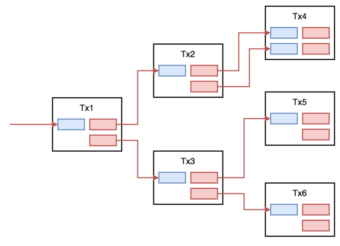
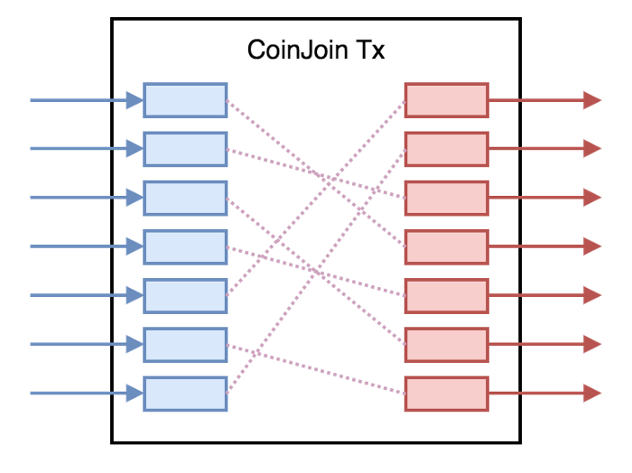
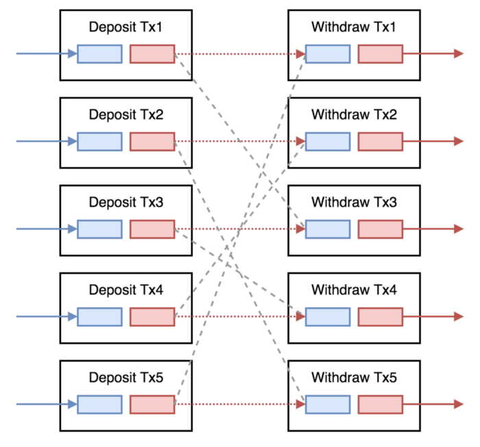

> *作者：CommerceBlock*
> 
> *来源：<https://blog.commerceblock.com/bitcoin-privacy-and-tainting-coinjoins-and-coinswaps-meet-statechains-b0d6c1146a24>*

比特币的信任最小化特性和免许可性，来源于区块链的公开可验证性。在确认一笔交易的有效性时，用户必须验证该交易所使用的 UTXO（未花过的交易输出）的存在 —— 也就是说要用户要将输出的历史追溯到它诞生的那个区块。比特币的密码学特性使得其隐私保护仅仅是伪匿名级别（pseudonymous），而支付者、接收方和输出的金额都是完全暴露的。这种特性影响了比特币的同质性（fungibility，亦称 “可互换性”）。

保持尚未花用的交易输出的同质性是一项艰巨的任务，因为即使是一个地址的元数据有稍微的泄露，都会破坏一个输出的隐私性。在分析交易图时，有一个概念叫 “污染（taint）”，用来量化一个输出与其现任私钥持有者的历史关联。有两种主要的 “污染” 模式：“中毒（poison taint）” 和 “驱邪（haircut taint）”；前者指的是一个输出的任何后代输出都因为这种关联而 “中毒”；后者则是指，如果一个有毒的输出跟无毒的输出参与了同一笔交易，该输出的的 “毒性” 会降级。污染分析依赖于对钱包工作模式的假设，比如 “共同输入所有权” 和 “找零输出”的启发式分析，它猜测一笔交易中的所有输入都属于同一个钱包，并且输出总会有真实支付和返回发送者钱包的找零输出。

（译者注：如上图所示，比特币的每一笔交易都要使用此前发生交易的输出作为输入，因此交易之间有明显的关联，将交易的关联可视化就会形成一张 “图”。交易（关联）图的分析是区块链分析（去匿名化）的最基本工具，也是我们在理解比特币的隐私性以及相关技术的最基本概念。）

在严格定义的环境下，这些工具在交易图的分析中是差不多准确的。但是，超出这个范围，这些工具就会变得非常危险，比如，一个无知无觉的私钥持有者可能会因为其输出的某一段历史而受到歧视。举个例子，一个交易为其用户指定了一个与该交易所的热钱包有关联的存款地址。当用户存入资金的交易确认后，该输出就立即与其他用户的输出捆绑在一起、执行取款操作。如果这个交易的输入数量很少，没有足够元数据的图分析者可能会认为交易所的这两个客户（存款者、取款者）在做直接的交易。那就大错特错了。

考虑到 CoinJoin 及其衍生协议（例如 PayJoin， SNICKER），这些假设就更不成立了。[0] 在验证一条比特币交易时，网络参与者要验证输出的数额总和不大于输入的数额总和，但如果合理运用了 SIGHASH 标签，那输出和输入之间就没有内在的关联。CoinJoin 就建立在这种认识上：CoinJoin 协议让多个持币者可以将他们的币 “汇集（join）” 成一笔交易；那关于污染的假设自然就不成立了。有许多办法可以联合成一笔 coinjoin 交易（例如，ZeroLink、CoinShuffle、Maker/Taker）每一种都有自己的用户体验取舍。

传统的 CoinJoin 的结果是结构化的（每个输出的面额都相等），所以它们在交易图上非常显眼；可能需要一系列菊花型的交易（daisy-chained joins）才能获得用户想要的隐私性。未来，与 CoinJoin 交易有历史关联的输出可能会发现自己处于一种永久的 “有毒” 状态中，并被某些人视作 “二等公民”，这并非耸人听闻。除此之外，随着链上手续费率的提高，采用多轮 Coinjoin 的方法可能也会变得非常昂贵、高不可攀。

另一种挑战污染分析的协议是 CoinSwap。[1] 在链上的 CoinSwap 协议中，两个（或多个）面额相等的输出参与一个原子化互换协议。在这里，参与者本质上不是在交换价值，而是在交换这些币的历史，也就是 “污染度” 的互换。如果正确处理，交易图中看不出被交换的输出之间的关联，只有参与者才知道互换的存在。不过，为了实现这种正确的操作，必须有多笔 coinswap 交易来避免人们察觉到数量上的关联。[2] 如果两个用户交换了相同面额的输出，在链上也是看得见的。链上的 CoinSwap 需要每一位参与者发起多笔链上的交易，因此也可能会随着交易笔数的增加而变得更昂贵和繁琐。

还有一些热钱包服务会协助参与者之间的输出交换。用户将资金存入一个实体的钱包中，该实体会拿另一个用户的输出发回给该用户。不过，用户必须信任协调者，不仅因为协调者托管着他们的资金，还因为协调者有 存款/支付 的记录。虽然如果操作正确，此类中心化的协调者在链上的足迹会暴露得很少，但没有办法能从根本上保证输出不会因为糟糕的热钱包实践和数据泄露而被污染。

比特币上的 “分层” 协议，给交易图增加了更多的复杂性。因为这些高层协议作了新的取舍，新的隐私可能性也随之打开。举个例子，一旦资金潜入了闪电网络，链上交易图的分析就会变得非常困难，因为 HTLC 的所有权可能跟链上可见的东西没有任何关联。而取舍在于，有足够路由流动性的节点会始终在图上出现。

Statechain 是另一个分层协议的例子，它使用了一种新的信任模式，但允许 statechain的参与者在彼此之间即时、脱链地转移私钥，不需要锁定资金，也没有路由容量的限制。[3] 这种新的信任模式是，一个提供 statechain 服务的实体（下文简称 “SE”）处在被信任的位置，虽然他们不能直接窃取或冻结用户的资金，但他们可以跟币的曾经所有者勾结从而偷取资金。虽然这不是最理想的方案，但这种信任模式对同质性的影响可谓巨大。

举个例子，如果一个盲化的 coinswap 撮合服务在一个 statechain 中实现，参与者可以执行任意多次 coinswap，而只需在链上提交两笔交易：一笔是向 statechain 存入资金，另一笔是取出资金。在 Statechain 中，CoinSwap 将按 “轮次” 发生，很像他们一起参与了 CoinJoin，用户自己配置想要的匿名集规模（CoinSwap 的团体规模），然后静默，直到达到阈值、新的一轮启动。因为没有链上交易的拖累，轮次可以更频繁地发生，无需像链上一样担心经济问题。实际上，一个用户参与的互换轮次越多，整体上每单位的匿名性成本就越低。

也正因此，基于 Statechain 的 Coinswap 结果不像链上的 CoinJoin，只有互换的协调者可以看到链下的 Coinswap 图。在链上的 CoinJoin 中，假设需要一个匿名的网络来参与，协调者将跟公开网络上的每个人一样拥有完全相同的信息。在 Statechain 上发生的 CoinSwap 因为不上链，交易的历史也不会在链上公开。这种不对称性在基于热钱包的输出交换服务那里也有，但是，如果在 Statechain 上使用了密码学盲化的 Coinswap，协调记录的访问权在功能上等价于观察到一次链上的 Coinjoin，其匿名集由参与者的数量来定义。

在开发我们的基于 Statechain 的 CoinSwap 撮合服务 Mercury 时，我们已经思考过了这些，以及许多其他源于这些建构的实现。为了实现我们的想法，我们修改了原始的 Statechain 方案，加入了两方的 ECDSA 门限签名、过期的密钥分割无效化（expired key share invalidation）以及一个递减的时间锁[备份方案](https://github.com/commerceblock/mercury/blob/master/doc/statechains.md#p2pkh-output-transfer)（以替代 Schnorr 签名和 eltoo）。我们的 Mainstay 见证协议用于发布[所有权证明](https://github.com/commerceblock/mercury/blob/master/doc/statechains.md#sparse-merkle-tree)（以提供 SE 行为不当的证明）以及[盲化 CoinSwap 的协调协议](https://github.com/commerceblock/mercury/blob/master/doc/swaps.md)。除此之外，我们将公开所有的 Mercury 互换，消除由链下互换图带来的信息不对称。

在 Mercury 的互换方案中，我们设计了一种中心化的协调协议（不同于 JoinMarket 的 Maker/Taker 模式）。通过围绕这个中心化协调者开发我们的盲化 swap 方案，甚至连参与者也无法知道币之间的关联（只知道一轮中有哪些币参与），比链上的 CoinSwap 还要更好。Mercury 的 SE 也跟 CoinSwap 的协调者紧耦合，让 SE 可以通过强迫攻击者使用备份交易找回资金来惩罚 DoS 攻击。备份交易内的时间锁增量是可以配置的，如果一轮 swap 中的不当行为增加，增量就可以增加。你可以认为，这是一种 “忠诚契约”，只有在不良行为被侦测到的时候才会使用。这不同于链上的 CoinJoin 协调者能够动用的惩罚，他们最多只能禁止某些输出参与混币，但没法让攻击者的币被锁定一段时间。

我们欢迎任何形式的反馈。在我们的 telegram 群里我们会踊跃回答一切技术问题。

请关注我们的 [博客](https://blog.commerceblock.com/)、[Twitter](https://twitter.com/commerceblock) 和 [Telegram](https://t.me/CommerceBlock)。

**注**：

[0] https://bitcointalk.org/index.php?topic=279249.0
[1] https://bitcointalk.org/index.php?topic=321228.0
[2] https://gist.github.com/chris-belcher/9144bd57a91c194e332fb5ca371d0964#multi-transaction-coinswaps-to-avoid-amount-correlation
[3] https://raw.githubusercontent.com/RubenSomsen/rubensomsen.github.io/master/img/statechains.pdf

（完）

