> *作者：Max Mittelstaedt*
> 
> *来源：<https://medium.com/@Max_BTC/bitcoin-the-most-innovative-technology-the-multilayer-approach-of-bitcoin-15269b65c9c3>*

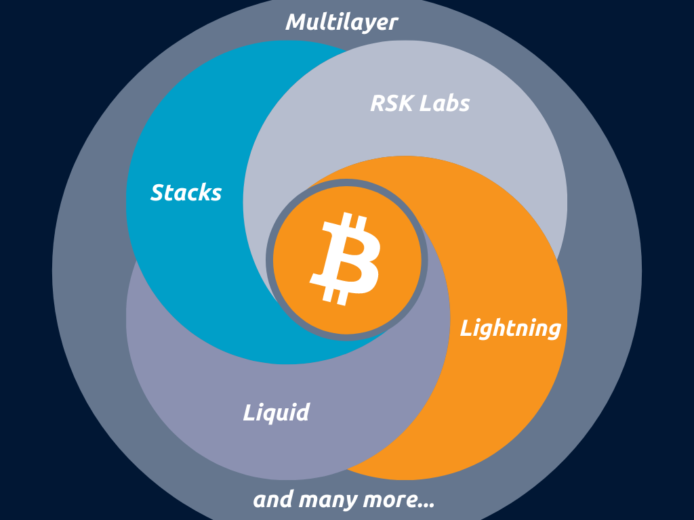

- 比特币是一种分层的技术 -

> “所 以 凡 听 见 我 这 话 就 去 行 的 ， 好 比 一 个 聪 明 人 ， 把 房 子 盖 在 磐 石 上 。雨 淋 ， 水 冲 ， 风 吹 ， 撞 着 那 房 子 ， 房 子 总 不 倒 塌 。 因 为 根 基 立 在 磐 石 上 。凡 听 见 我 这 话 不 去 行 的 ， 好 比 一 个 无 知 的 人 ， 把 房 子 盖 在 沙 土 上 。雨 淋 ， 水 冲 ， 风 吹 ， 撞 着 那 房 子 ， 房 子 就 倒 塌 了 。 并 且 倒 塌 得 很 大 。” —— 圣经，马太福音 7:24-27。（译文引自[和合本](https://www.o-bible.com/cgibin/ob.cgi?version=hgb&version=kjv&version=bbe&book=mat&chapter=7)） 

> “中心化的系统产生了不兼容的激励措施和无效率，增长缓慢、创新乏力，同时鱼肉我们所有人而肥了那些当权者。分布式系统产生了更好的结果、更公平的交互，以及更健壮的系统。” —— [Join Dhruv Bansal and Ryan Gentry](https://www.youtube.com/watch?v=qlV5_udJkC0)

## 比特币是一种不可阻挡的技术

**比特币具备山寨币不可能具有的特性**：

- *不依赖于武断决定的固定供给量*：它非常适合穿越时间和空间。而且比特币的稀缺性对支付不是问题。1 BTC 等于 1 亿聪（Satoshi）；1 聪等于亿分之一 BTC。
- *货币政策由一个分布式的网络来执行*：所以这个网络是世界上最安全的网络。比特币区块链相对比较轻量。任何人，只需花费 200 美元，就能部署一个比特币全节点并保卫这个网络。在 https://bitnodes.io/ 网站上，你可以看到比特币网络上运行着超过 1 万个节点。他们分散在全球。做个对比：互联网也只有 340 个商用节点。
- *可预期的增发*：你可以精确到每个月会有多少比特币增发出来、总量会是多少。当前比特币的通胀率是 1.73%，而且会逐渐趋近于 0%。比特币当前的存量流量比（stock-to-flow ratio）是 57，所以比特币是世界上最 “硬” 的资产之一。
- *开放、全球、免准入*：无论在什么地方，它都一样运行；无论谁来使用，服务都完全相同。比特币不属于某一家公司也没有 CEO。想使用比特币，你只需要一台智能手机和互联网。
- *技术进步*：你可以像其他人一样立即获得同样的技术开发水平和金融基础设施。比特币区块链是第一层网络。当前，第二层和第三层网络正在开发。在 2021 年年底，还会有一个重大的软件升级，带来新的功能（译者注：应指 Taproot 升级）。比特币无法被复制，比特币拥有最大的市值、最高的流动性/交易量、最广为人知的品牌、最大的网络效应、最多的投资，等等。
- *能源消费*：比特币很难挖出，而且是唯一一个有效通过工作量证明（比特币挖矿）在计算力之间分发信任的网络。比特币挖矿的算力与日俱增。比特币挖矿要耗能不是一个漏洞，而是一个优点。它让比特币网络变成了世界上最安全的网络、无法被攻击的网络。中国对比特币挖矿的禁令是迄今比特币网络遭遇的最大规模的攻击。全网的算力有所掉落，但比特币没有被摧毁，也没有被控制。一切都像它应该的那样运行。“比特币让互不信任的个体能通过使用工作量证明机制解决拜占庭将军问题来达成分布式的共识。比特币能抵御通胀、抢劫和审查。” —— [Wiz](https://www.youtube.com/watch?v=T2Bx-aUcGjw)

> “比特币是一个由软件规则组成、没有管制者的系统。它是完全去中心化的，因为中本聪隐退了，他把社区和比特币的价值放在第一位，看得比自己的自我重要。你知道，其它密码学货币（的创始人）做不到这样。” —— [Alyse Killeen](https://www.youtube.com/watch?v=hLJJuKDO38s)

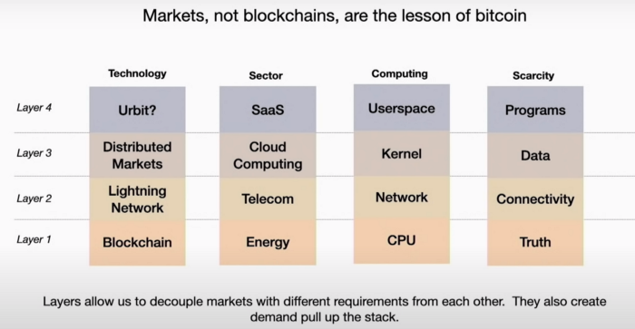

- 比特币是一个开放的分布式市场，任何人都可以加入以及在上面开发。图片来源：https://www.youtube.com/watch?v=qlV5_udJkC0 -

## 比特币是一个货币软件，你可以在上面随心所欲地开发

> “比特币自身无法扩容到能让世界上的每一笔金融交易都广播给每一个人并记录到区块链上。需要一个更轻量、更高效的次级网络作为支付系统。”—— [哈尔·芬尼](https://bitcointalk.org/index.php?topic=2500.msg34211#msg34211)，2010

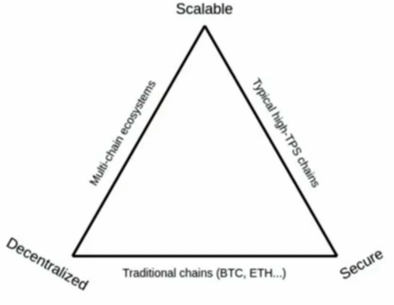

- 基础层的扩容需要牺牲。来源：https://www.thebword.org/c/track-1-demystifying-bitcoin -

比特币的区块容量不算太小，它只不过不是为容纳许多交易而优化的。比特币的主要层（或者说基础层、区块链、第一层）是为价值存储用途优化到了极致。

这就是为什么比特币正在转变成一个多层级的生态系统。许多成果已经运行在二层或者三层上了。举个例子，除了直接发送比特币交易以外，你还可以通过闪电网络来发送比特币。闪电网络就是一种建立在比特币区块链（第一层）上的二层技术，而且一切都是开源的。你可以把它们看作是洋葱 —— 它有许多层，每一层都建立在另一层之上，但最终来说，所有层都受到基础层的保护。

> “有了[比特币](https://twitter.com/hashtag/Bitcoin?src=hashtag_click)，你就有可能在整个价值互联网中获得一个所有权分红。” —— [Croesus](https://twitter.com/Croesus_BTC)

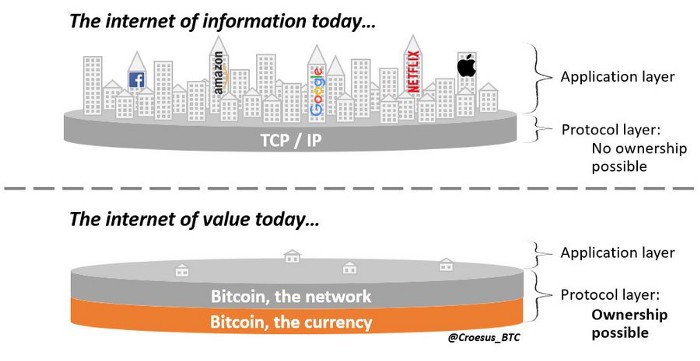

- 来源：https://twitter.com/Croesus_BTC/status/1367165017280237569 -

比特币已经拥有了最好的支付生态和交易生态。

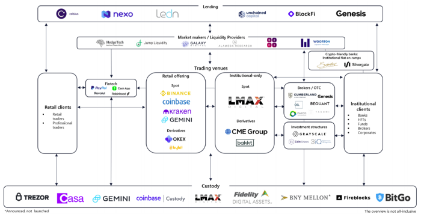

- 最好的支付生态和交易生态，来源：https://www.research.arcane.no/blog/bitcoin-trading-system-overview -

## 那有没有智能合约、DeFi（去中心化金融）或其它进一步的进展呢？

> “比特币一直都有智能合约功能。比特币是一种可编程的货币，所以，比如说，你可以要求一笔交易要多个签名才能生效、或在一段时间之后才能生效、或输入特定的数据才能生效。在比特币的开发环境中，自始至终最重要的是环境的安全和稳定。这样做的好处是，比特币从未在核心层遭到破坏或劫持。停机事件我们遭遇过，但非常短。毫无疑问，在存储着数十亿美元价值的金融系统中，这些都是极为重要的。” —— [Alyse Killeen](https://www.youtube.com/watch?v=QBG2XTgO2gI)

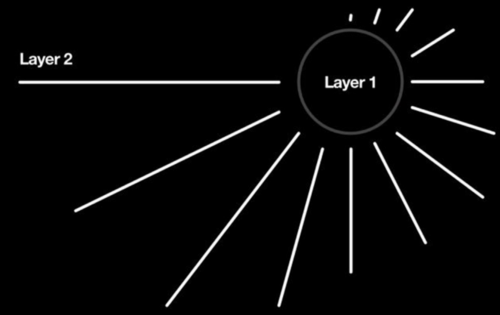

- 第一层和第二层，来源：https://twitter.com/visbitcoin/status/1285545048680144896 -

“闪电网络可以在网络内部实现一些东西，比如身份；它也实现了支付的标准、收账的标准、两个对等节点间互相信任的标准、最终清算的标准。如果你从整体上思考这个问题，你会问：‘货币网络到底是如何运行的？’，你会发现，Visa 也在自己的网络里做一模一样的事情。Visa 定义了身份：我怎么知道这是我的 Visa 卡而那是 Peter 的 Visa 卡？你们都有确定的卡号，对不对？而且你也有确定的账户、确定的发账和收账规则、信贷规则和结算规则。我们认为，比特币不仅比其它任何货币网络更好、更便宜、更快以及更加全球化，更重要的是，它还更开放。而开放网络，包括货币，一般来说总能胜出。开放网络具有明确的规模经济和极为强大的网络效应。因此，如果你认为一个竞争对手会加入一个网络；在一个开放的网络中，每一个新加入的人都是增量，会强化整个网络。所以，竞争者实际上 ‘帮衬了你的生意’。” —— [Jack Mallers](https://www.whatbitcoindid.com/wbd338-jack-mallers-miles-suter-michael-peterson)

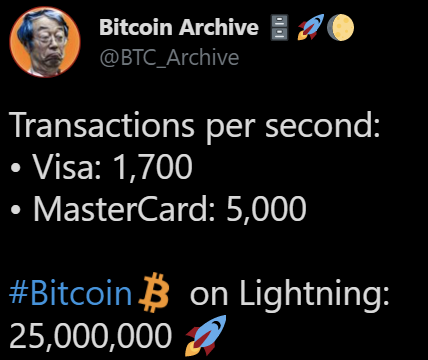

- https://lightning.network/ -

“网络有能力每秒处理百万乃至十亿笔交易。这个容量超过传统的支付中介许多个量级。现在，无需托管方即可为每个操作、每一次点击附支付。” —— https://lightning.network/

在闪电网络中，你只需为一笔交易支付几分钱手续费，就可以实时且几乎免费地发送资金。

Square 和 Twitter 的 CEO Jack Dorsey 说：“这就是我投身闪电网络的原因，它会被越来越多人使用。而我对比特币的信念是，虽然这是一种神奇的资产，但互联网需要一种原生的通货。我们要能用它来全球转账。Sequare 加入比特币的唯一目标就是这个。”

比特币和闪电网络已经有许多应用了： Strike、Bluewallet、wallet of satoshi、Breez、Muun，等等！如果你认为闪电网络只是未来的一种畅想，那你就错了，它是正在发生的现实。

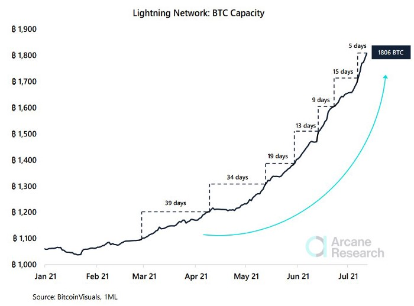

- 来源：https://www.research.arcane.no/ -

## 未来的可能如梦如幻

> “山寨币不过是未来比特币二层网络的测试网。” —— @BTCSupport21

你在比特币底层上使用多签名脚本（它本身已经是一种智能合约）锁定一些比特币。锁定之后，你就能在其他层上发行一些新 “币”（它其实还是比特币或者说聪），然后你就可以做任何你想做的事。比特币就像一个黑洞，可以把所有重要的金融服务都吸进去。

> “区块链技术就是一种同步并且安全地添加了时间戳的数据库。它可以存储有关所有权，因此它本身就意味着某些东西的所有权。”—— Andreas M. Antonopoulos

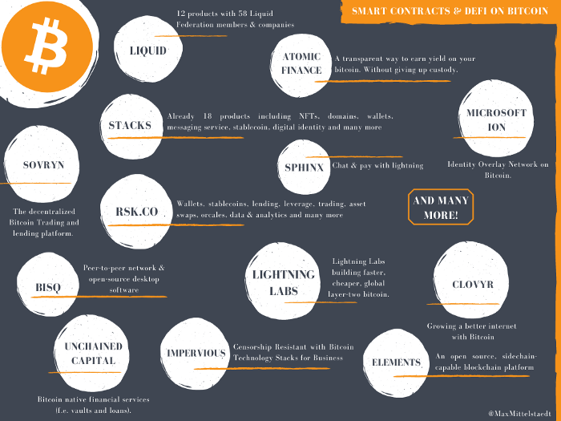

- 比特币上的智能合约和 DeFi -

[Liquid](https://blockstream.com/liquid/)：“更快、更隐私的比特币交易。Liquid 是一个基于侧链（将比特币绑定到另一个有独立安全性的链上）的结算网络，为交易员和交易所设计，可以发送更快、更隐私的比特币交易以及发行数字资产。”

[Atomic finance](https://atomic.finance/)：“不妥协的比特币金融。最终，它是一个你可以使用比特币来赚取利息的透明方法，无需你放弃托管。”

[Stacks](https://www.stacks.co/)：“一个更好的互联网，建立在比特币上。Stacks 让比特币变得可以编程，支持继承了比特币所有力量的去中心化应用和智能合约。在比特币上开发 app 和智能合约。Staks 连接到比特币，让你可以开发集成了比特币的安全性、资本和网络的应用、智能合约和数字资产。我们已经有了：NFT、.btc 域名注册器、钱包、博客、数字身份、交易所，等等。”

[Rsk.co](https://www.rsk.co/)：“开放金融。比特币上的免信任和透明金融。比特币是最大的 DeFi 机会，可以在 RSK 上得到完全的释放。RSK 是世界上最安全的智能合约平台，比特币用户可以在上面出借资金、借入资金、交易和赚取利息。金融的未来是去中心化的。”

[Bisq](https://bisq.network/)：“Biaq 是一个点对点的交易网络，没有中心化的服务。它是你运行在自己的硬件上的软件，而不是运行在某人服务器里的网站。它是开源的，是社区驱动的。Bisq 是代码，而不是一个公司。它是一个开源的项目，以去中心化自治组织（DAO）的形式建立在比特币上。”

[Sovryn](https://www.sovryn.app/)：“你的私钥，你的控制权。去中心化的比特币交易和借贷平台。”

[Digital Ids with Microsoft´s ION](https://techcommunity.microsoft.com/t5/identity-standards-blog/ion-booting-up-the-network/ba-p/1441552)：“ION（身份覆盖层网络）以及迁移到比特币主网。我们很高兴看到 ION 在比特币主网上进行公开测试。ION 是一个开放的、公开的、免准入的 ‘二层’ 网络，建立在所有人都可以审核、运行和贡献的开源代码上。从一开始，ION 就被开发成一个去中心化网络，不依赖于中心化的参与者和受信任的中介，包括微软。ION 并不依赖于特殊的效用 token、受信任的验证者节点和任何额外的共识机制；比特币的线性区块技术的稳定运行是唯一需要的共识机制。DID 技术的核心目标是赋予所有个人和实体对自己身份的所有权和控制权，与我们的使命 —— 为所有人带来工作、娱乐和成就跟 —— 是一致的。…… 作为一个开放、公开以及免信任的网络，IOS 不依赖于任何特权验证者或受信任的权威 —— 任何人都可以运行一个节点来参与这个网络。”

[Unchained Capital](https://unchained-capital.com/business/)：“我们对合作托管的运用提供了更好的安全性，并能触达更多的金融服务。比特币原生的金融服务（例如：金库和贷款）。”

[Impervious](https://www.impervious.ai/)：“Impervious 提供基础设施，在私有云服务器上安全地传输和托管数据，并保证不受限制的访问、保留操作的完整性。利用闪电网络，Impervious 开设了即时和安全的通道来保证隐蔽访问托管在私有云服务器上的数据。”

[Redphone](https://github.com/pseudozach/redphone)：“允许你和你的闪电网络对等节点通过闪电网络和 Impervious 发送信号，从而开设点对点的实时音频通道。端到端加密的隐私音频，没有第三方。”

[Lightning Labs](https://lightning.engineering/)：“建设更开、更便宜的全球二层网络比特币。我们 Lightning Labs 开发软件来增强闪电网络。我们的开源、安全和可扩展的闪电系统，让用户可以收发资金并且效率前所未有地高。我们也提供了一系列可验证的、非托管的、基于闪电网络的金融服务。我们为开源软件的世界和下一代比特币的金融软件构筑桥梁。”

[Elementsproject](https://elementsproject.org/)：“Elements 是一个开源的、支持侧链的区块链平台，提供了社区成员开发的强大功能，比如保密交易（Connfidential Transaction）和资产发行。基于比特币的代码库并加以延伸，它让熟悉 bitcoind API 的开发者可以快速而高效地创建可用的区块链并测试概念验证项目。” 已经实现了铆定法币的稳定币和股票 token。

[Drivechain ](http://bip300.info/)（BIP 300+301）：“在侧链上，币可以换手无数次，并且交易方式也不可限量。因此，BTC 所有者可以选择性 加入新功能/作出取舍。与此同时，没有加入的比特币民无需关心侧链上正在发生什么。”已经复制了 Zcash。

[Sapio](https://github.com/sapio-lang/sapio#readme)：“为比特币复制以太坊合约的开发者体验。一种比特币编程语言。”

[Spacechain](https://gist.github.com/RubenSomsen/c9f0a92493e06b0e29acced61ca9f49a)：“一种创建免信任区块链的无需许可的方法；不作为价值储存物，便可允许更多实验，从而强化比特币的生态系统。”

[Sphinx chat](https://sphinx.chat/)：“通过闪电网络来聊天和支付。每个用户都有一个专用服务器。”

[Lastbit](https://lastbit.io/about/)：“便宜、瞬时、无国界、任意使用的支付手段。基于比特币闪电网络。”

[lolli](https://www.lolli.com/)：“在超过 1000 家顶级商店购物时，Lolli 会奖励你免费的比特币或现金。”

[swanbitcoin](https://www.swanbitcoin.com/)：“Swan 是你积累比特币的最佳办法，支持自动循环买入和即时买入。”

[layer1](https://www.layer1.com/)：“开发比特币的电池。Layer1 Technologies 公司开发一站式的、完全集成了比特币挖矿的数据中心，从而最大化能源资产的盈利能力，并提供电网的稳定性。”

想要比特币背书的稳定币？

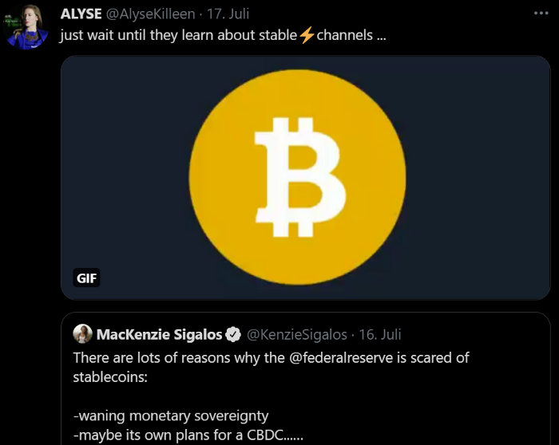

- 比特币稳定币 -

Jack dorsey 最近宣布会创立一个新的比特币智能合约公司：

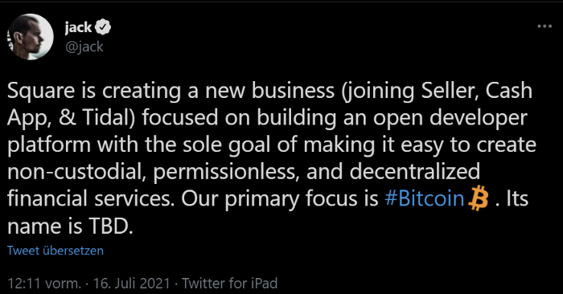

- 待续 -

大机构也一直在开发，举个例子， [NYDIG](https://nydig.com/about-nydig/) 是 Stone Ridge（一家百亿美元的另类资产管理公司）的子公司。“我们的使命是通过技术和金融服务来安全地解锁比特币的力量，让有远见的公司和投资者能获得这类资产。”

所有这些已经完成的工作都还没用上 2021 年底的重大升级 Taproot。比特币上的每一个新层级，都让第一层变得更有价值、有更大的网络效应。追逐其它项目已经没有意义了，因为比特币在技术上更优越、而且你可以在上面做任何事。

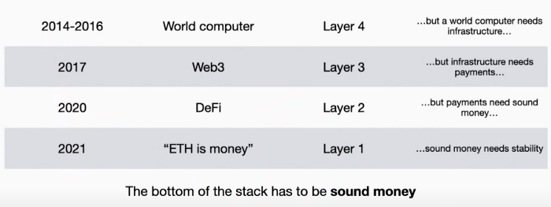

- 举个例子，以太坊就是本末倒置的。来源：https://www.youtube.com/watch?v=qlV5_udJkC0 -

比特币上也有这些概念，但次序弄对了。比特币区块链作为基础层，已经为安全性和稀缺性（健全货币）尽可能优化了。然后所有东西都可以在此基础上建立。所有其它项目都不关心底层的基础设施。只有比特币尽可能优化了其基础设施。所以只有比特币网络，就像只有一个互联网一样。也许你可以看到某个山寨币只是一个可以添加到世界上最安全的网络（比特币区块链）上的一个新功能。而这种分层的方法让比特币变得极为宝贵、并为之带来全新用途。比特币可以做其它项目希望做的事，只不过做得更好、更可扩展和健壮。

> “比特币既是货币又是软件，如果哪些地方不够用，开发就好了。你真想跟工程学打赌吗？跟工程学打赌，就是跟人性打赌。” —— Jack Mallers

“比特币上面没有创新？” 把这篇文章发给山寨币拥趸和仇视比特币的人看看。

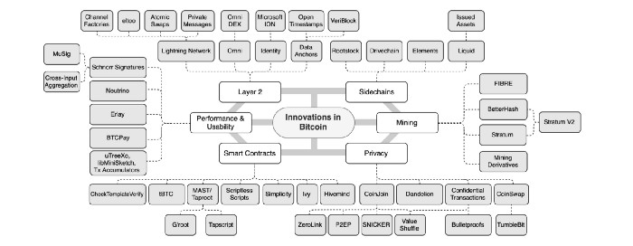

- 来源：https://twitter.com/mrcoolbp/status/1417213646409814021 -

结语见 Michael Saylor 的视频：https://youtu.be/pFxEM29LyeE?t=4719 。

（完）