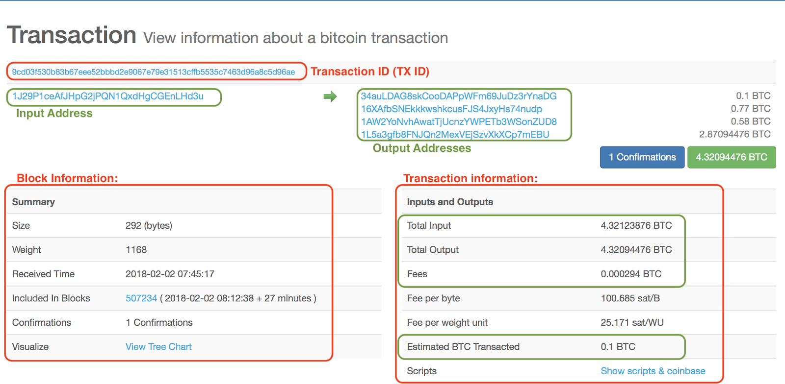

> *作者：sheinix*
>
> *来源：<https://medium.com/coinmonks/bitcoin-transactions-be401b48afe6>*
>
> 原文发表于 2018 年 6 月。

## 何为比特币交易

比特币交易是比特币区块链的基础组成部分。这一操作可以帮助我们将价值从一方安全地转移给另一方。下图随机截取了比特币区块链上某个经过一次确认的交易：



- 比特币区块浏览器上的交易 -

上图显示了比特币交易中包含的部分信息，但是无法体现它是如何运作的，只是通过用户可读的方式将这些信息展示出来而已。

除了解释上图出现的一些概念之外，本文还将阐述一个事实：从协议层来看，比特币根本不是 “币”，没有所谓的余额，也无法被存储。在比特币的定义中，“分布式账本” 可谓重中之重，因为比特币实际上是记录交易输入和输出的账本！

*注：1 BTC 最多可以分割至小数点后 8 位，而 0.00000001 BTC 又可称为 1 satoshi。因此，假设我通过一笔交易发送了* *0.00000045 BTC，也可以说是发送了 45 satoshi。*

比特币交易由输入和输出组成。*所谓的输入和输出并不仅仅是上图所示的输入和输出地址*。从现在起，我们会更准确地将输出称为：**未用过的交易输出（Unspent Transactions Output，UTXO）**。在比特币协议中，**交易输入就是前一笔交易的 UTXO**。因此，UTXO 是比特币交易中的基础组成部分。

*注：我们这里说输入是前一笔交易的 UTXO，事实也确实如此。但是，我们还会在后文提到另一个输入，就是 UTXO 中的解锁脚本。特此说明，请注意区分。*

现在，你是不是已经对比特币区块链的运作方式有了一些了解了呢？请记住，比特币是记录每个 UTXO 的分布式账本。现在，你能明白为什么我会说比特币没有余额，也无法被存储了吧？因为一切都包含在交易历史中！

例如，为了显示你的比特币 “余额”，钱包软件必须在比特币区块链上查询所有由你的私钥控制的 UTXO，然后将这些 UTXO 的值相加，并显示最终余额。同样地，假如你想花费 1 BTC，你的钱包会检查你所有的 UTXO 加起来是否有 1 BTC。如果有的话，你的钱包就会使用这些 UTXO 作为输入来创建另一笔交易。

*钱包软件和轻客户端通常会追踪其私钥持有的 UTXO。全节点客户端则会把比特币网络中的所有 UTXO 存储在本地的 UTXO 集合中。*

UTXO 是**不可分割**的独立价值单位，使用 satoshi 计价。在说到 UTXO **不可分割**时，你肯定会想：如果我们想要花费的比特币数额低于我们所拥有的 UTXO 的面值，那该怎么办呢？我们来看下面这个例子：

我想给 Sarah 发送 0.5 BTC，我的余额只有一个面值为 1 BTC 的 UTXO。因此，我无法将这个 UTXO 拆分开来，**必须通过交易花掉一整个 BTC，并创建另一个输出作为找零**。这就好比我们拿一张 5 元纸币去买 2 块钱的东西，我们不能把这张纸币撕开来付款，只能支付整张 5 元纸币，然后获得 3 块钱的找零。这就是比特币交易的关键特性。

再来看上图的比特币交易，我们可以看到来自前一个 UTXO 的总输入是 4.32123876 BTC，预计 BTC 交易额是 0.1 BTC，输出地址有 4 个，那个输出额为 0.1 BTC 的地址可能是交易的收款方，剩下三个是随机生成用来找零的地址。出于安全性和匿名性的原因，一些钱包会生成随机的比特币地址，并将找零分开支付，让资金流向变得更难追踪，这就是为什么我们前面说的是 “预计交易额”，因为我们也不能断定哪个 utxo 才是真正的支付行为。

只有一类交易不花费已有 UTXO。这类交易被称为 coinbase 交易。这是区块中的第一笔交易，把该区块内所有交易的交易费支付给矿工。

## 交易费

你注意到总输入和总输出之间的差值没？如果你看交易的 “Fee” 一栏显示的数值，就会发现交易费就是总输入和总输出之间的差值。因此，交易费的计算公式如下：

总输入 - 总输出 = 交易费

这个公式很重要，因为交易费必须动态计算，交易结构中没有指明交易费的地方。在创建交易时，我们必须确保输出略低于输入，让矿工知道交易费是多少。

大多数交易都包含一笔交易费，用来补偿保护网络安全的矿工。这样也有利于阻止有人连续不断发送交易来攻击网络。交易费由将交易打包到下一个区块的矿工收取。另外还要注意的一点是，交易费不是强制收取的，但是很少有零交易费的交易会被打包挖出，有时甚至不会在网络中广播。

### **交易费是如何计算的？**

为了选择总输入和总输出之间的差值，我们必须判断交易的复杂性。交易费是根据交易的数据量大小（以 kb 为单位）而非交易数额计算的。一笔 10 BTC 的交易支付的交易费可能低于一笔 2 BTC 的交易。

如今，一些服务可以根据用户的输入动态计算交易费的大小。用户可以选择支付高、中、低水平的交易费。交易费的高低会影响交易处理的优先级，因为矿工会优先处理交易费高的交易来获得更高的收益。低交易费的交易需要等待更长时间才会得到处理。

## 如何花费 UTXO？交易输入是如何创建的？ 

在这一小节，我们将探索比特币是如何验证付款方是否拥有其所花费的 UTXO，以及收款方是否能使用该笔交易所产生的 UTXO 的。 为此，每笔交易都使用最基本的密码学难题或锁定脚本作为交易的验证器。为了解开锁定脚本，我们还需要解锁脚本。让我们更深入地了解锁定脚本和解锁脚本：

### **锁定脚本和解锁脚本**

**锁定脚本**规定了花费 UTXO 的条件，即，未来花费该输出需满足的条件。**解锁脚本**满足锁定脚本规定的花费输出的条件，让输出得以花费。解锁脚本存在于交易输入中。



- 比特币交易图解 -

创建输入时，我们必须提供满足所用 UTXO 的锁定脚本所规定条件的解锁脚本。验证交易的节点可以从交易中获得输入和解锁脚本（但其中没有锁定脚本），因而必须追踪需要花费的 UTXO 并获取其锁定脚本。之后，节点将一同执行锁定脚本和解锁脚本。如果解锁脚本满足锁定脚本规定的条件，该输入就是有效的。

### **Scrypt 语言**

比特币交易语言叫作 Scrypt。锁定脚本和解锁脚本就是用 Scrypt 语言编写的。Script 被**设计**成了一种非图灵完备的编程语言，这意味着它缺乏图灵完备语言所具有的某些流程控制特性 —— 这是出于安全目的而有意设计的。这样可以降低编程语言的复杂性，让执行次数变得可以预测，从而降低遭到黑客攻击或出现漏洞的概率。

*还需指出的是，锁定脚本和解锁脚本是基于编程语言编写的，因此与代码内的逻辑相绑定，这赋予了编程人员很强的灵活性，可以表达近乎无限多种条件。换言之，交易验证并非基于静态模式。*

尽管如此，比特币网络中的大部分交易都是使用 **Pay-to-Public-Key-Hash（P2PKH）**锁定的**。** 这些输出包含的锁定脚本会将输出锁定到某个比特币地址。使用 P2PKH 脚本锁定的输出必须出具公钥和由对应私钥创建的数字签名才能花费。

总而言之，几乎所有比特币交易都使用 P2PKH 锁定脚本来锁定未花费交易。这就意味着我们必须提供数字签名和对应公钥作为交易输入中的解锁脚本。然后，验证节点将获取对应的 UTXO 并使用我们的解锁脚本执行相关的锁定脚本来检查其是否有效。如果有效，交易就通过了验证，可以在网络中传播、可以打包到区块内。

这就是比特币交易的运作方式。感谢你阅读到最后，希望你能有新的收获。

（完）