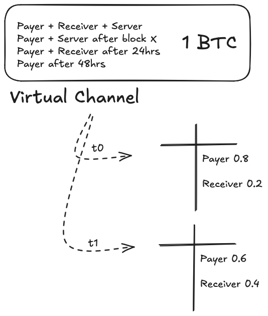

> *作者：Marco Argentieri*
> 
> *来源：<https://blog.arklabs.xyz/bitcoin-virtual-channels/>*


利用 Ark 的 VTXO 范式将智能合约转移到链下，“虚拟通道” 可以带来高效、低成本的比特币支付通道。

Ark 带来的最有前景的机会之一是，他可以将比特币原生的智能合约放到链下的树结构中。支付通道就是展示这种潜力的一个绝佳候选者。

虽然在当前，人们都是在闪电网络的语境下理解支付通道的，但在闪电网络出现以前，更早的提议研究了更简单的单向支付通道。BitcoinJ 项目就[描述](https://bitcoinj.org/working-with-micropayments?ref=blog.arklabs.xyz)了这样一个实现：它使用 “斯皮尔曼式” 支付通道，可以带来高吞吐量的单向（从发送者到接收者）支付通道。

这种方法的显然劣势在于，因为需要使用链上交易来开启，启动成本较高。

我们提出了一种消除这种劣势的解决方案：利用 Ark 协议，为比特币支付通道启用**更高效、成本更低**的部署方式，我们称之为 “**虚拟通道**”。

## 斯皮尔曼式支付通道

所有支付通道的起点都是在比特币区块链上确认一笔注资交易、锁定一定数量的资金到一个参与者共享的多签名地址中。这笔注资交易充当这条通道的基础，需要一次链上的操作。

这种**智能合约**的最简单版本就是标准的单向支付通道。支付者向一个合约注资，该合约有两种可能的花费条件：

- 支付者和接收者双方签名的合作结算
- 支付者在一段时间后可单方发起的退款

这里的核心概念很简单：支付者通过签名花费这个合约的新交易、将更大的资金份额分配给接收者，就可以**即时**在链下转移资金。接收者验证了支付者的签名之后，这笔交易就可以被认为生效了 —— 消除了对比特币区块的重复花费保护机制的依赖。

只要通道保持开启，就可以继续发送交易，每一笔新交易都会增加接收者可以得到的资金。

在这条通道过期**以前**，接收者一直拥有使用支付者的最新签名、加上自己的签名、广播一笔完全有效的比特币交易的选择。这笔交易花费的是通道合约（上述多签名地址）、以一个或更多输出准确地反映了通道内最新的余额：接收者的收益，以及支付者的找零（如果有的话）。

过期机制本质是为了保证支付者能收回自己的资金，如果接收者变得无响应，或者拒绝合作更新通道状态的话。

这种设计的主要优势在于，它不需要双方都同时在线。只要支付者签名了更新，就可以下线。接收者也只需要存储最新的通道状态（交易），不需要承担困扰闪电网络的用户和操作者的备份负担。

最明显的缺点，可能你也猜到了，就是这种方法不能高效扩容。一个普通用户可能有多个对手，而且建立通道的链上成本可能不划算（长期来看无法负担）。

## 放在 VTXO 内的通道

VTXO 范式最强大的特性是它对 UTXO 模式的原生支持，这使得我们可以使用 Tapscript，让裸的 VTXO 脚本拓展到超越单个签名人。通过定义额外的签名路径，我们可以封装多方合约 —— 创建包含支付者、接收者和 Ark 服务商的**虚拟通道**。



它所用的 Taproot 脚本路径是这样的：

- **弃权**：所有参与者对如何花费这个 VTXO 达成一致。随时可用。
- **退款和弃权**：在某一个区块高度之后，支付者和服务商一起花费，以退款或创建新的通道。
- **24 小时之后**：在 VTXO 树在链上展开的 24 小时之后，支付者和接收者的共同控制开始生效。
- **48 小时之后**：在 VTXO 树在链上展开的 48 小时之后，支付者可以完全控制这笔资金。

### 注资

一旦支付者和接收者对一个脚本模板达成一致，他们就一起通过参与一个 Ark 轮次来创建一条通道。支付者用自己的 VTXO（或者一个[进群 UTXO](https://arkdev.info/docs/learn/boarding?ref=blog.arklabs.xyz)）为这个通道注资，然后接收者验证并联合签名包含了代表这条虚拟通道的叶子的 VTXO 树。这个过程要求所有参与者同时在线，而且依赖于服务商来提供必要的 UTXO 流动性。

### 支付

支付者创建并签名一个花费该合约、在支付者和接收者之间分割通道余额的 PSBT。

接收者接收这笔部分签名的交易，存储它以备日后使用，然后发送承诺好的商品或服务。

## 退款

如果接收者不再合作了怎么办？

不需要手动展开整个 VTXO 树。一个绝对时间锁允许支付者跟服务商完全放弃这个通道合约，在 VTXO 树过期以前。

### 单方退出

如果 Ark 服务商离线了，或者无法响应，其它的花费路径就有用了。VTXO 树可以展开、广播到比特币区块链上，从而激活其它花费路径。这保证了支付者和接收者的交易依然能在链上结算，防止资金因为服务商不可用而永远锁定。

## 给我看看你的代码

我们需要分叉来支持虚拟通道吗？完全不需要！

在即将到来的 `arkd` 0.4 版本中，服务商不再需要显式支持一种具体的脚本模板，只要[弃权路径](https://arkdev.info/docs/learn/concepts?ref=blog.arklabs.xyz#forfeit-transaction)存在、所有[单方面赎回路径](https://arkdev.info/docs/learn/concepts?ref=blog.arklabs.xyz#vtxo)都带有时间锁就行。

### 脚本路径

**弃权**

```
<PayerPubKeyOP_CHECKSIGVERIFY<ReceiverPubKey>OP_CHECKSIGVERIFY<ServerPubKey>OP_CHECKSIG
```

**退款和弃权**

```
<BlockHeight>OP_CHECKLOCKTIMEVERIFYOP_DROP<PayerPubKey>OP_CHECKSIGVERIFY<ServerPubKey>OP_CHECKSIG
```

**通道：更新**

```
<144>  // 1 day in blocksOP_CHECKSEQUENCEVERIFYOP_DROP<PayerPubKey>OP_CHECKSIGVERIFY<ReceiverPubKey>OP_CHECKSIG
```

**通道：退款**

```
<288>  // 2 days in blocksOP_CHECKSEQUENCEVERIFYOP_DROPPayerPubKeyOP_CHECKSIG
```

### 开启通道

支付者[放弃自己的 VTXO（或者 UTXO）](https://github.com/ark-network/ark/blob/master/api-spec/protobuf/ark/v1/service.proto?ref=blog.arklabs.xyz#L24-L29)以参加下一个轮次，为通道注资；TA 跟接收者都注册一个额外的新[公钥](https://github.com/ark-network/ark/blob/master/api-spec/protobuf/ark/v1/service.proto?ref=blog.arklabs.xyz#L141)，用于代表自己只用来签名 VTXO 树的私钥。通道输出的 taproot 脚本树会在花费时揭晓，在注册输入时，需要提供一个十六进制编码的 tapscript 列表。

```
message Input {  Outpoint outpoint = 1;  oneof taproot_tree {    string descriptor = 2;    Tapscripts tapscripts = 3;  }}message Tapscripts {  repeated string scripts = 1;}
```

### 发起支付

再简单不过了：支付者签名一个 PSBT 并发送给接收者。即时结算，而且没有什么收款额度概念！

### 关闭通道

在关闭通道时，接收者结合支付者的最新签名和自己的签名，请求服务商联合签名一笔赎回交易，从而将通道的关闭终局化。这笔交易可以结算成常规的 VTXO，不论是同步结算还是在未来的轮次中结算。

## 洞见

- 斯皮尔曼通道构造非常适合 Ark 框架。
- 与闪电通道不同，单向通道的风险和开销都显著低了许多。用户不需要备份，也不需要为了持久化通道状态而保持在线。
- Ark VTXO 脚本编程允许超越单签名合约的链下扩容应用。

（完）