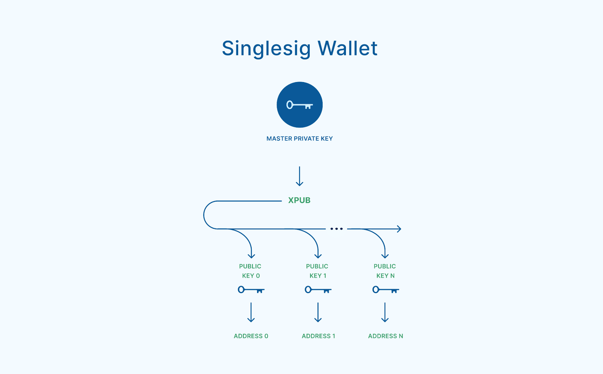
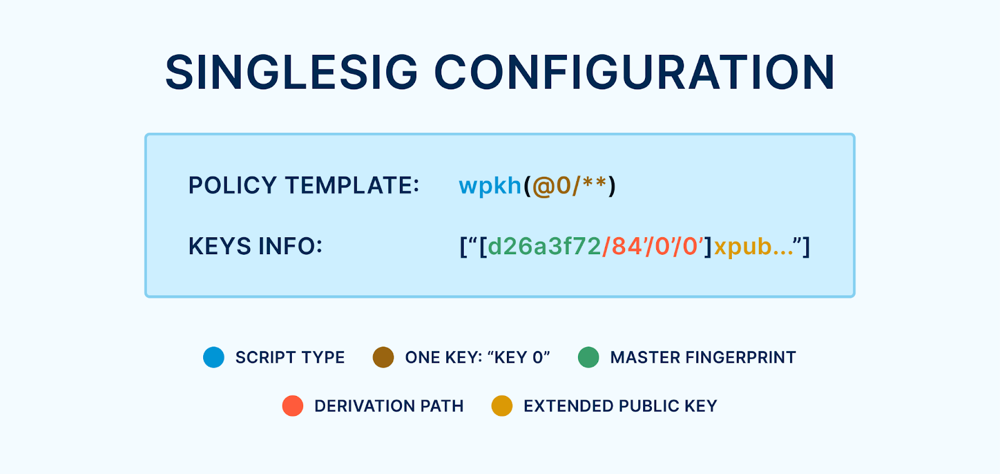
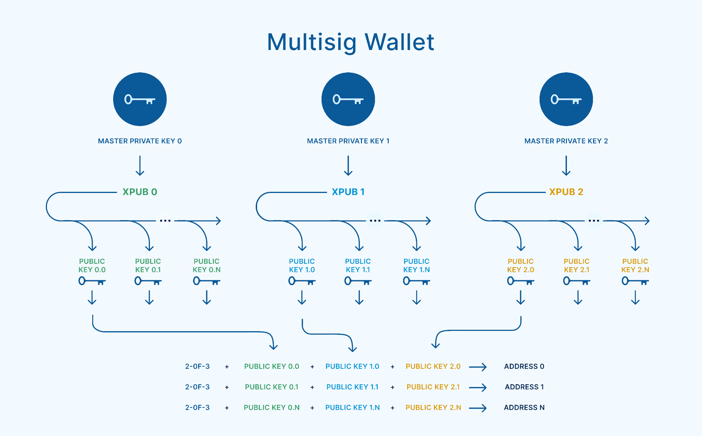
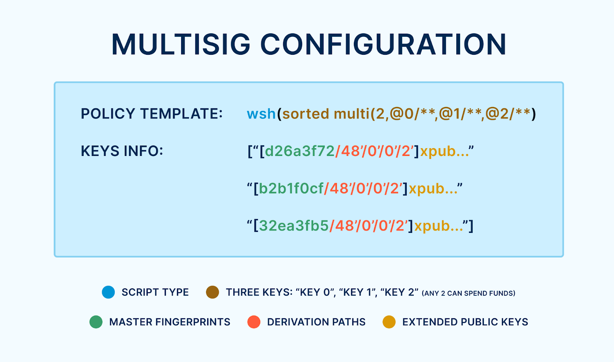

> *作者：Tom Honzik*
> 
> *来源：<https://www.unchained.com/blog/bitcoin-wallet-configurations>*

要想自己控制你的比特币，你必须保管持有这些资金的[密钥](https://unchained.com/blog/what-is-a-bitcoin-key/)、消除你对第三方密钥的以来。但这还不够 —— 同样重要的是，确保你不会依赖于你的钱包 *应用*。

钱包应用就是你观察自己的比特币余额、构造交易的地方。它通常是你的电脑或手机上的一个程序。如果这个应用宕机了，或者遇到了故障，那你可能需要使用另一个应用来重获对你的钱包（资金）的控制权。这需要导入你的 *钱包配置*（有些时候会被称为 “ *钱包描述符* ”）。如果不知道（或者说不掌握）钱包配置的信息，你当前的钱包应用就会变成你自主保管装置中的一个单点故障。

因此，钱包配置在钱包复原中是极为关键的，尤其在[多签名钱包](https://unchained.com/features/what-is-multisig)的复原中。了解其中的原理可以帮助你建立自信 —— 你已经掌握了重获比特币控制权所需的一切，即使你所用的钱包应用出现了异常也不怕。当你[在 Unchained 的钱包应用中搭建好一个多签名钱包](https://unchained.com/vaults)之后，你总是可以[轻松保存你的钱包配置](https://help.unchained.com/download-unchained-bitcoin-multisig-configuration-file)，从而[永远不会被迫依赖于你当前使用的平台、网站或者企业](https://help.unchained.com/can-i-import-my-vault-into-third-party-wallets)。

## 种子词只是基础

如果你研究或实践过比特币的自主保管，你可能很熟悉 “[种子词](https://unchained.com/blog/what-is-a-bitcoin-seed-phrase/)” 的概念。简单回顾一下，种子词就是一组用来创建（和重建）一个主[私钥](https://unchained.com/blog/what-is-a-bitcoin-key/)的单词。然后，这个主私钥可以用来控制几乎无数的[地址](https://unchained.com/blog/what-is-a-bitcoin-address/)和[钱包](https://unchained.com/blog/your-bitcoin-isnt-in-your-wallet/)。

你可能会认为，只要你保存了种子词（加上可选使用的 “密语（passphrases）”），你就拥有了找回比特币的全部信息。但是，这种信念是否为真，取决于一些特定的假设。为了保证你的钱包可以毫无困难地复原出来，你可能需要跟踪种子词之外的信息，例如你使用的 “[密钥派生路径](https://unchained.com/blog/bitcoin-derivation-paths/)” 和 “[脚本类型](https://unchained.com/blog/bitcoin-address-types-compared/)”。[多签名钱包](https://unchained.com/features/what-is-multisig)还需要额外的关于阈值和所有相关密钥的背景信息。

钱包配置是种子词之外复原钱包所必需的（或有用的）信息的全集。你可以认为种子词是重建钱包的基础，而钱包配置是建筑的架构蓝图。蓝图的具体元素及其重要性，会被因为钱包的类型（单签名 vs. 多签名）而略有不同。

## 单签名配置

如我们在《[比特币钱包剖析](https://unchained.com/blog/bitcoin-wallet-anatomy/)》一文中所述，单签名钱包是使用一个拓展公钥（“xpub”）构造出来的；而这个拓展公钥又是从一个主私钥（种子词）生成出来的。这一个拓展公钥可以容易地派生出用在这个钱包的所有地址中的普通公钥。

- 一个主私钥从许多可能性中创建一个 xpub 。这个 xpub 就代表着一个单签名钱包 —— 它可以创建出许多在区块链上接收（持有）比特币的地址。 -

单签名钱包的结构是非常基础的，因此，组成其钱包配置的信息也相对简单。以下就是一些元素。

### 主密钥指纹

主密钥拥有一个 *指纹*，是 8 位的十六进制字符（比如：d26a3f72）。这个指纹不会暴露任何能够用来花费资金的敏感信息，但可以用作具体主密钥的唯一标识符。虽然它并不是钱包复原所必需的信息，但如果你需要处理多个主私钥，指纹就是非常有用的提醒，可以用来确定跟一个钱包相关的主密钥。

### 拓展公钥

拓展公钥（xpub）是计算地址所必需的；有了地址，才能显示和监控钱包的余额、收取新支付。在钱包配置中包含拓展公钥，将使上述操作（计算地址、收取支付）无需种子词和任何私钥就能完成。这创造了一种更安全的环境，如果钱包的主人并不急于将这些钱转出钱包 —— 转出资金就需要由种子词产生的私钥。

如果已经有了种子词，那么不需要预先处理拓展公钥，可以使用 “派生路径”，从种子词中计算出拓展公钥。

### 派生路径

一个种子词能够产生几乎无限数量的 xpub ，每一个都可以用来生成一个独一无二的钱包。因此，如果你试图用种子词复原一个具体的钱包，你就需要知道如何产生跟这个钱包相关的具体 xpub 。为从种子词出发的你一步步导航到一个 xpub 的信息称作 “ *派生路径* ”。它大概是 ` m/84'/0'/0' `这样的东西，你可以[在我们关于这个主题的文章中了解更多](https://unchained.com/blog/bitcoin-derivation-paths/)。

如果这个钱包最初是根据流行的标准建构出来的，那么就有可能使用了一些候选的派生路径，那么就可以通过试错法来确定（如果你弄丢了钱包配置的话）。当前，最常用的公式是 `m/x'/0'/y'`，其中的 *x* 取决于钱包的脚本类型，而 *y* 通常是 0 ，但可能会递增，如果同一个种子词曾用来生成多个使用相同脚本类型的钱包的话。不过，也不是所有钱包都使用这条公式；你可以看看 [walletsrecovery.org](http://walletsrecovery.org/) ，这是一个极好的资源网站，适合每一个尝试复原不明确配置钱包的人。

派生路径是单签名钱包配置中最重要的部分。即使 xpub 自身已知，派生路径依然是计算能够从钱包中花费比特币的私钥所必需的信息。

### 脚本类型

恰当地在一个新应用中重建一个钱包也需要知道该钱包的[脚本类型，或者说地址格式](https://unchained.com/blog/bitcoin-address-types-compared/)。单签名钱包可能是以下四种脚本类型之一：P2PKH、P2SH_P2WPKH、P2WPKH 和 P2TR 。

- 如果钱包地址以数字 “1” 开头，那么就是 P2PKH 类型，派生路径可能以 `m/44'/` 开头。
- 如果钱包地址以数字 “3” 开头，那么就是 P2SH-P2WPKH 类型，派生路径可能以 `m/49'/ `开头。
- 如果钱包地址以字符 “bc1q” 开头，那么就是 P2WPKH 类型，派生路径可能以 `m/84'/` 开头。
- 如果钱包地址以字符 “bc1p” 开头，那么就是 P2TR 类型，派生路径可能以 `m/86'/` 开头。

- 单签名钱包配置的一个案例，以 <a href="https://github.com/bitcoin/bips/blob/master/bip-0388.mediawiki">BIP388</a> 钱包条款格式呈现 -

### 单签名钱包复原总结

如果你拥有种子词（以及你可能使用的密语），那么，即使 *不知道* 任何其它信息，在一个新的钱包应用中复原自己的单签名钱包也是有可能的。新应用可能会假设你使用了通行标准所定义的派生路径，而如果你的钱包最初真是这么生成的，那么迁移就不会遇到任何障碍。派生路径本身会表明脚本类型，并能够从种子词重新生成对应的 xpub 。然后，就可以计算出地址、了解钱包余额，能够签名花费资金的私钥也可以重新计算出来。

然而，依赖于原来的钱包软件使用了特定的标准，是不理想的；尤其是，标准自身也可能在时间长河中改变。如果你原来那款钱包应用跟新款应用所用的流程不同，那么这种不兼容性就会让你无法立即找回你的比特币（余额会显示为零）。为了避免这种让人紧张而且困惑的情形，了解你的钱包配置并保存这些信息是精明之举。然后，只要你拥有这些信息和种子词，你就获得了信心：即使需要在新应用中手动调整一些选项，你也必定能够重获单签名钱包的控制权。

## 多签名配置

理解了单签名签名是如何构造的，多签名钱包的配置也变得更容易理解。如我们在《[比特币钱包剖析](https://unchained.com/blog/bitcoin-wallet-anatomy/)》一文中所述，多签名钱包为每一个参与其中的主私钥（种子词）使用了一个拓展公钥。比如说，在一个 2-of-3 多签名钱包中就有 3 个拓展公钥，而在一个 3-of-5 多签名钱包中就有 5 个拓展公钥。多签名钱包中的每一个地址，都是使用来自各拓展公钥的一个普通公钥集体建构出来的，而且这些普通公钥会根据 [BIP67](https://github.com/bitcoin/bips/blob/master/bip-0067.mediawiki) 标准的要求、按照[字典顺序](https://en.wikipedia.org/wiki/Lexicographic_order)排列。在 Unchained 钱包应用中，我们建议使用[编织模型](https://unchained.com/features/the-braid-model)来理解这一切。

- 在一个 2-of-3 多签名钱包中，三个主私钥各自派生一个 xpub 。这三个拓展公钥的集合就代表着这个多签名钱包，然后它们可以一起产生许多收取（持有）比特币的地址。 -

多签名钱包的结构比单签名钱包更加复杂，因此其钱包配置信息也更详尽。备份多签名钱包配置被认为极其重要，因为（如果没有配置信息）重建出来可能难得多。

多签名钱包配置中的许多元素跟单签名钱包配置中的箱单，但一部分元素必需为每一个参与的密钥安排一份。

### 主密钥指纹

如前所述，主密钥指纹是一个主密钥的十六进制标识符。一个多签名钱包中有多个主密钥，每一个都有自己的指纹。这是有用的信息，它意味着每一个密钥都容易区分出来，保证了每一个派生路径都会应用在合适的主密钥上，避免混淆。多签名钱包软件的常见做法是强制让所有指纹都不同，以防止在同一个钱包中重复使用同一个密钥。

### 门限要求

绝大部分多签名钱包的主人都熟悉要使用的密钥门限要求，比如 2-of-3 和 3-of-5 。这个门限要求在根本上定义了钱包中的资金要如何解锁。虽然易于记忆，它也是多签名钱包配置中的一个必要部分。即使我们知道 3 个 xpub 形成了一个多签名钱包，那也有不同的门限可能性：1-of-3、2-of-3、3-of-3 。门限要求不同，产生出来的钱包（地址）也会完全不同。

### 所有的拓展公钥

多签名名的一个极为重要但没有得到充分理解的侧面是，知道**所有的拓展公钥**是使用资金的前提。通常人们会以为，如果自己使用的是一个 2-of-3 多签名钱包，那么只要有其中两个主私钥（种子词），就有了足以触及自己钱包中的资金的一切；这是不正确的。还需要来自每一个主私钥的拓展公钥。

这就意味着需要以下三者之一：

- 一直使用一款记忆了钱包配置（因此记忆了所有 xpub）的钱包应用；或者
- 持有钱包配置（因此知道所有的 xpub），并且（在需要时）导入选中的钱包应用；或者
- 找出一个办法，能够获得第三个 xpub 或者主私钥，通过试错法重建钱包配置。

### 所有的派生路径

如前面单签名钱包配置部分所述，[派生路径](https://unchained.com/blog/bitcoin-derivation-paths/)是让你可以从一个主私钥生成特定 xpub 的信息，极为重要。对多签名钱包中的每一个 xpub 也都如此。

多签名钱包中的拓展公钥的派生路径也许能够猜测出来 —— 假设创建该钱包的时候遵循了常用标准的话，但只要有一个拓展公钥的派生路径猜错了，就会在取出资金的道路上遇到障碍。这意味着，如果缺乏钱包配置，多签名钱包的用户在复原钱包的时候会更容易遇到障碍和困惑。再说一次，[walletsrecovery.org](http://walletsrecovery.org/) 是一个非常有用的资源网站，可以帮助你寻找不同钱包应用所用的派生路径。

### 脚本类型

多签名钱包可能使用这四种[脚本类型](https://unchained.com/blog/bitcoin-address-types-compared/)：P2SH、P2SH-P2WSH、P2WSH，还有 P2TR 。

- 如果钱包地址以数字 “3” 开头，那么可能是 P2SH 或 P2SH-P2WSH 类型
  - P2SH 多签名钱包的拓展公钥派生路径可能以 `m/45'/ `开头。
  - P2SH-P2WSH 多签名钱包的拓展公钥派生路径可能以 `m/48'/` 开头，并包含额外的一层路径为 `1'`，如 [BIP48](https://github.com/bitcoin/bips/blob/master/bip-0048.mediawiki) 所定义的。
- 如果钱包地址以字符 “bc1q” 开头，那么就是 P2WSH 类型，派生路径可能以 `m/48'/` 开头，并包含额外的一层路径为 `2'`，如 BIP48 所述。
- 如果钱包地址以字符 “bc1p” 开头，那么就是 P2TR 类型，派生路径可能以 `m/86'/` 开头。

- 一个 2-of-3 多签名钱包配置的例子，以 <a href="https://github.com/bitcoin/bips/blob/master/bip-0388.mediawiki">BIP388</a> 钱包条款格式呈现  -

### 多签名钱包复原总结

如果没有钱包配置信息的话，在一个新的钱包应用中复原多签名钱包可能会遇上困难  —— 甚至于不可能。需要所有的 xpub ，意味着如果它们没有全部记录在钱包配置中、并且某一个主私钥丢失或损坏，那么剩余密钥将不足以复原资金。或者，如果钱包配置弄丢了、而某一个密钥使用了一个罕见的派生路径，那么复原资金也可能是极为艰难、令人沮丧而且无法成功的。

多签名是保管比特币的强大工具，因为它没有单点故障，这是[机构级保管](https://unchained.com/features/mpc-vs-multisig-vs-sss)的必要条件。但是，如果多签名钱包配置没有备份，已在服役的钱包应用就会成为唯一保存了配置的地方。这可能会让这个钱包软件变成单点故障（具体取决于多签名装置的细节）。所有多签名钱包的用户都应该理解这些，以保证自己的比特币是得到了充分保护的，或选择与比特币专家进行合作式保管。

## 了解合作式保管

使用[合作式多签名保管](https://unchained.com/features/diy-vs-collaborative-multisig)的一个重大好处在于，这个合作伙伴可以帮助保存钱包配置信息，并在复原钱包时提供专业的指导。比如说，你的 [Unchained 账户](https://my.unchained.com/sign_up)中的钱包应用为每一个多签名钱包包含了[易于访问的](https://help.unchained.com/download-unchained-bitcoin-multisig-configuration-file)钱包配置信息。我们自豪地提供关于[备份这些信息](https://help.unchained.com/how-to-store-bitcoin-multisig-wallet-configuration-file)和[在复原场景中使用它们](https://help.unchained.com/can-i-import-my-vault-into-third-party-wallets)的资料。这足以让你安心，知道即使有一天 Unchained 的网站下线，你也总是能够选择你自己的开源工具、控制你的比特币，独立自主、无需许可。

（完）