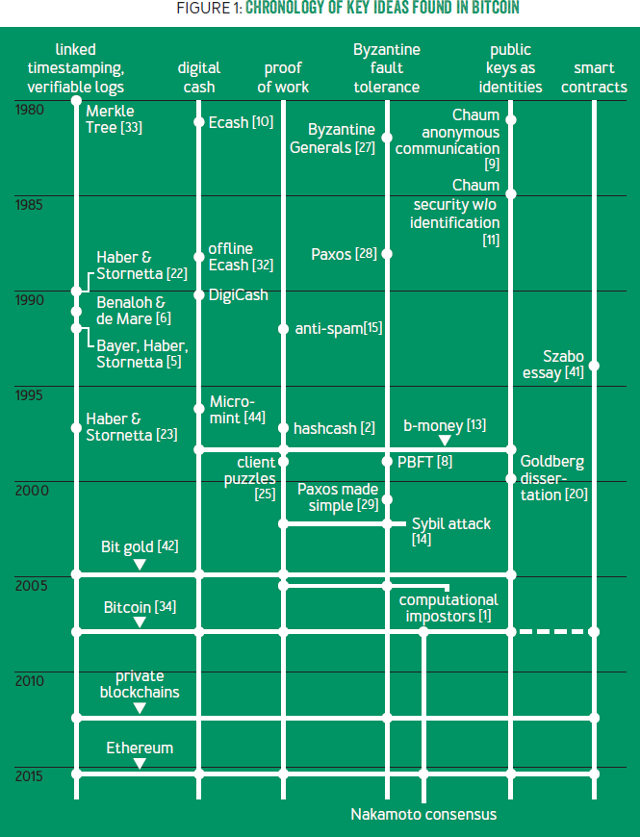
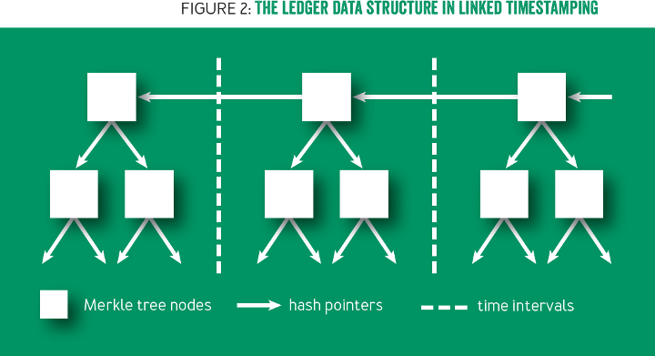
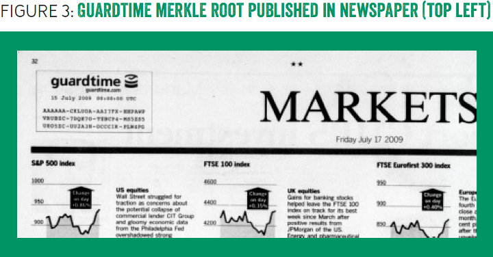

> *作者：Arvind Narayanan & Jeremy Clark*
> 
> *来源：<https://queue.acm.org/detail.cfm?id=3136559>*

如果你读过比特币的新闻报道，并且熟悉密码学领域的学术研究的话，你应当会留下这样的印象：自 David Chaum 10,12 起，学术界对数字货币展开了长达数十年的研究，却未能取得商业上的成功，因为整个数字货币系统需要一个类似银行的中心化服务机构加以控制，事实上没有一家银行对此感兴趣。比特币则另辟蹊径，提出了创建无需银行的去中心化密码货币的想法，数字货币终于迎来了成功。人们普遍认为，神秘的比特币之父中本聪并非学术界人士，比特币与之前的学术设想毫无相似之处。

为反对上述观点，本文特别列出了图 1，显示比特币用到的所有技术几乎都源自 20 世纪 80 和 90 年代。笔者并非有意贬低中本聪的贡献，而是要指出他也站在巨人的肩膀上。通过对比特币概念的溯源，我们可以专注于中本聪在洞察力上的真正飞跃 —— 他是如何通过某种准确且复杂的方式将这些技术结合起来的。这有助于解释为什么比特币这么晚才诞生。已经熟悉了比特币运作原理的读者或许能从这些历史回顾中获得更深刻的理解。（请参见 Arvind Narayanan 等人所著的 *Bitcoin and Cryptocurrency Technologies* 作为入门读物36。）比特币的学术史作为一项案例，也展示了学术界人士、外部研究人员和相关从业人士之间的关系、教育了我们三方可以如何互相受益。

 

## 账本

如果你有一个安全的账本，将它应用于数字支付系统的过程很简单。举例来说，如果 Alice 通过 PayPal 发送 100 美元给 Bob ，PayPal 会从 Alice 的账户取出 100 美元，并记入 Bob 的账户。传统的银行业大致上也是这么操作的，只不过因为银行之间的没有一个统一的账本而变得复杂了。

账本的概念是理解比特币的基础。账本可以记录系统中发生的所有交易，向系统中所有参与者公开，并且受到他们的信任。比特币将这种记录支付情况的系统转化成了一种货币。然而在银行业中，账户结余代表户主可以从银行取出的现金，那么一单位的比特币代表什么？暂且将它理解为具有内在价值的交易物。

如何在一个类似于互联网的环境（参与者不信任彼此）中构建一个账本？让我们先从简单的部分开始：如何选择数据结构。我们期望这个账本能满足几个属性。这个账本应该是不可更改的，或者更确切来说，是只能 *添加* ：只能添加新的交易，不能删除、修改或重新排序已有的交易。此外，还应该有方法随时获取账本状态的简洁化 *密码学摘要*。摘要是避免存储整个账本的短字符串，如果账本遭到任何篡改，摘要也会随之改变，因此篡改会被发觉。之所以要满足上述属性，是因为这个账本不同于存储在单一机器上的普通数据结构，而是由一组互不信任的参与者共同维护的 *全球* 数据结构。另一种实现去中心化数字账本的方法 7,13,21 是由多位参与者维护本地账本，并由查询这组账本的用户解决账本间的冲突。

## 链接型时间戳

比特币的账本数据结构借鉴自 Stuart Haber 和 Scott Stornetta 于 1990 年至 1997 年间撰写的一系列论文（其中 1991 年的论文是与 Dave Bayer 合著的）5,22,23 ，只做了少数改动。这是中本聪在比特币的白皮书中亲口所述 34。 Haber 和 Stornetta 解决了文件时间戳的问题 —— 他们希望创建一个“数字公证”服务。对于专利、商务合同等文件来说，所有者想要确保文件创建于特定时间点，而不是后来才创建的。他们定义的文件概念很广，而且可以是任何类型的数据。顺带一提，他们在论文中确实提及金融交易是一种潜在应用，不过并未当作重点。

简单说下 Haber 和 Stornetta 的意思：文件是处于不断创建并广播中的；每份文件的创建者确认创建时间并附加自己的数字签名，签名的对象包括文件本身、文件的时间戳以及上一个被广播的文件。上一个文件已经由之前的创建者签署了，因此这些文件形成了一条带有时间指针的长链。其他人无法改变带有时间戳的消息，因为该消息是由创建者签过名的；就算创建者想要改动它，也必须连同后面链接的消息一起改动。因此，如果一个可信的来源（例如，另一个用户或某个专门的时间戳服务）将某个东西添加到了链上，到这个东西为止的整条链会被锁住，无法进行更改，并且暂时定下顺序。此外，假设这个系统会拒绝带有不正确的创建时间的文件，按理可知这些文件的创建时间至少不会晚于其时间戳所示的时间。无论如何，比特币只是借鉴了 Haber 和 Stornetta 的研究成果中的数据结构部分，在此基础上新增了工作量证明机制，重新设计了数据结构的安全属性。关于工作量证明机制，我们会在后文中讲解。

在后续论文中，Haber 和 Stornetta 引入了能提高数据结构的效率的想法（其中一些想法在第一篇论文中已有提及）。第一，文件之间的链接可以通过哈希值而非签名创建；哈希值计算起来更加简单迅速。这类链接称为哈希指针。第二，不同于将文件一个个连接起来——如果同一时间创建出了很多文件，这种方式会变得很低效 —— 可以将这些文件打包进 “批数据（batches）” 或 “数据块（blocks）”，每个数据块里的所有文件都共享同一个时间戳。第三，每个数据块中的文件可以由哈希指针创建的二叉树（即默克尔树），而非一条线性链相连接。顺带提一下，在 Haber 和 Stornetta 的第一篇论文发表之后不久， Josh Benaloh 和 Michael de Mare 分别于 1991 年引入了上述 3 个想法 6。

## 默克尔树

比特币本质上使用的是 Haber 和 Stornetta 于 1991 和 1997 的论文中撰写的数据结构，其简化形式如图 2 所示 （中本聪当时可能不知道 Benaloh 和 de Mare 的研究成果）。当然，比特币把文件换成了事务（transaction，在比特币语境中也即 “交易”，译者注）。在每个区块（实质即上文所说的数据块）的默克尔树中，叶节点都是交易，且每个内部节点都包含两个指针。这种数据结构有两大重要属性。第一，最新区块的哈希值可充当摘要。对任意交易（叶节点）的改变都必然将变化传导至交易所在区块的根节点，以及后续区块的根节点。因此，如果你知道了最新区块的哈希值，就可以从你并不信任的数据源下载剩余账本，并验证它是否有过变化。一个相似的论证确立了数据结构的另一大重要属性 —— 任何人都可以高效地向你证明某个交易是否包含在账本中。这个用户只需向你发送关于这个交易所在区块的默克尔树的少量节点（这就是默克尔树的意义），以及后续每个区块所需的少量信息。性能和可扩展性的提高非常需要高效证明交易是否包含在区块内的能力。

 

顺便一提，默克尔树是以非对称密码学先锋 Ralph Merkle 命名的，他在 1980 年的论文中提出了这一想法 33。 他当初预期的应用是为公开的数字证书目录生成一个摘要。 例如，如果一个网站向你出示证书，它还会出示一个简短的证明，证明这个证书确实存在于全球目录。只要你知道目录中证书的默克尔树的根哈希值，你就可以高效地验证这个证明。按照密码学领域的标准来看，这个想法已经算不上新颖了，不过它的力量直至最近才得到重视。它处于近期实现的证书透明化（Certificate Transparency）系统的核心 30。 一篇 2015 年的论文提出了 CONIKS ，将公钥目录的想法应用于端到端的加密邮件 32。 新型密码货币以太坊提供的主要账本功能之一就是高效地验证部分全球状态。

比特币可能是 Haber 和 Stornetta 提出的数据结构在现实世界中最著名的实例，不过不是第一例。至少有两家公司提供文件时间戳服务 —— Surety 始于 20 世纪 90 年代中期，而 Guardtime 始于 2007 年。这两种服务发生了有趣的转变，因为 Bayer、Haber 和 Stornetta 5 提出了一个想法，即腾出报纸上的一个广告位定期发布默克尔根。图 3 显示了 Guardtime 在报纸上发布的默克尔根。

 

## 拜占庭容错

当然，不受中心权威实体控制的互联网货币需要满足更严格的要求。分布式账本不可避免会出现分叉，这意味着一些节点会认为区块 A 是最新的，另一些节点会认为区块 B 是最新的。一个原因可能是有作恶者试图扰乱账本的运作，另一个原因可能仅仅是网络延迟，导致不同的节点在无意识的情况下近乎同时生成区块。正如 Mike Just 在 1998 年的论文 26 中所述，仅仅依靠链接型时间戳不足以解决分叉问题。

另一个研究领域（容错型分布式计算）已经研究过这一问题，不过用的名称不同，比如 “ *状态复制* ”。一种解决方案是允许一组节点按照相同的顺序应用相同的状态转换 —— 通常来说，确切的顺序并不重要，只要所有节点保持一致就好。对于数字货币来说，要复制的状态是一组余额表，交易代表的是状态转换。图灵奖得主 Leslie Lamport 在 1989 年发表的论文 28,29 中提出了包括 Paxos 在内的早期解决方案 。他提出使用状态复制的方法避免通信信道不可靠或是少数节点可能出现某些“现实”故障 —— 如永久离线或是首次离线后重启并发送过时消息 —— 的问题。后续的文献讨论了更加不利的环境和效率权衡关系。

一些相关的工作研究了网络可靠性高的情况（消息必定会在一定的时延内送达），然而其对“错误”的定义扩大成了 *任何* 背离协议的情况，因此，这类拜占庭错误包括自然发生的错误和恶意制造的行为。早在 1982 年，Lamport、Robert Shostak 和 Marshall Pease 就在其合著的论文 27 中首次研究了这类错误。 之后直到 1999 年，Miguel Castro 和 Barbara Liskov 发表了一篇具有里程碑意义的论文，介绍了 PBFT （实用拜占庭容错算法）的概念，同时解决了拜占庭错误和不可靠网络的问题 8 。与链接型时间戳相比，关于容错的学术文献数量庞大，而且囊括了数以百计的 Paxos 和 PBFT 等开创性协议的变体和优化版本。

在最初的白皮书中，中本聪并没有引用这类文献或是使用相关术语。他使用了一些概念，作为他的协议中共识机制的参考，并考虑了攻击者以及加入和离开网络的节点的故障问题。相比之下，他明显依赖于链接型时间戳（以及下文将要论述的工作量证明）的文献。在邮件讨论中被问及比特币与拜占庭将军问题的关系（需要拜占庭容错来解决的思维实验）之时，中本聪坚称采用工作量证明模式的区块链可以解决这一问题 35。

在接下来的几年，其他学者已经从分布式系统的角度研究了中本聪的共识机制。这些研究仍在推进中。一些学者表示比特币的属性非常脆弱 43 ，而另一些学者认为拜占庭容错视角无法公正评价比特币的一致性（consistency，在分布式共识领域与 “安全性” 含义接近，“安全性” 与 “活性” 相对，都有确切的含义，译者注） 40。另一种方法是定义已经过充分研究的属性的变型，并证明比特币满足这些变型 19。这些定义最近经过了大幅改进，在更为现实的消息传递假设下，变成了一种更为标准的一致性定义 37。然而，所有这些研究成果都建立在参与者行为“诚实”（即遵守协议）的前提之下，然而中本聪认为，无需盲目假设何为 “诚实的行为”，因为行为终究是被激励出来的。关于中本聪共识（Nakamoto consensus）如何扮演激励机制的丰富分析，无法套在过去的容错系统模型里。

## 工作量证明

实际上，所有容错系统都假设系统中绝大多数（例如，超过 2/3 的）节点都是诚实且可靠的。在一个开放式的点对点网络中，节点无需注册，而且可以自由加入退出。因此，作恶者可以发起 *女巫攻击* ，创建多个马甲节点、破坏整个系统的共识保障。 John Douceur 14 于 2002 年正式提出了 “女巫攻击（Sybil attack）” 的概念，并指出可以利用 *工作量证明* 的密码学模型来缓解这一问题。 

### 起源

要了解工作量证明，先得从源头讲起。Cynthia Dwork 和 Moni Naor 15 在 1992 年最先提出了工作量证明的雏形。其目的是阻止垃圾邮件。要注意的是，垃圾邮件、女巫攻击和拒绝服务这些问题都是大同小异的，作恶者会将普通用户所造成的影响在网络中放大数倍。工作量证明能够同时抵御这三种攻击。根据 Dwork 和 Naor 的工作量证明设计，发件人在发送邮件的同时只有附上已完成适量计算的证明（即，工作量证明），收件人才会处理这封邮件。一台普通的计算机大概需要几秒钟的时间来完成工作量证明。因此，这不会给普通用户造成困难，然而想要发送 100 万封垃圾邮件的人如果使用相同的硬件设备，则需要几周时间。

要注意的是，工作量证明 *实例*（也称作 *难题* ）应该针对不同的邮件和收件人有所区别。否则，垃圾邮件发送者会向同一个收件人发送不同的邮件（或者向不同的收件人发送同一封邮件），其成本等同于向一个收件人发送一封邮件。第二个重要的属性是，收件人只需承担极少的计算量，即，无论这些难题计算起来有多难，验证计算结果正确与否应该很容易。此外，Dwork 和 Naor 提出了带有陷门（*trapdoor*）的函数，陷门由中心实体掌握，可以免去解决难题所需的工作量。一种可行的陷门应用是让中心实体无需成本就可以批准邮件的发送。 Dwork 和 Naor 提出了三种满足上述属性的候选难题，它引入了一个全新的领域，我们之后会提到。

### Hashcash

还有一种非常类似的想法叫作 hashcash，是由博士后研究员 Adam Back 于 1997 年提出的，那时他是密码朋克社区的一员。密码朋克聚集了一群激进分子，他们反对政府和中心化机构集权，力图通过密码学推动社会和政治改革。Back 方向感很强：他先是发布了 hashcash 软件 2，在 5 年之后的 2002 年又发布了 hashcash 的互联网草案（标准化文档）和一篇论文 4。

Hashcash 比 Dwork 和 Naor 的想法要简单得多：它没有陷门和中心机构，而且仅使用哈希函数而非数字签名。它基于一则简单的原理：哈希函数是一种为了达成某些实用目的的随机函数，这意味着如果要找到一个能让哈希函数得出特定输出值的输入值，唯一的方法是尝试多个输入值，直到得出期望的输出值为止。进一步来说，要找到对应任意一组输出值的输入值，唯一的方法是将不同的输入值依次代入哈希函数进行运算。因此，如果我让你找到一个输入值，它对应的（二进制）哈希值是 10 个零开头的，你必须尝试很多输入值；然后你会发现，每个输入值满足条件的概率是 1/210 ，这意味着你平均需要尝试 210 个输入值，约等于 1000 次哈希计算。

从 hashcash 的字面意义可知，Back 将工作量证明视作一种货币形式。 他在个人主页上将其定位为 DigiCash 的替代方案。DigiCash 是 David Chaum 提出的一种银行向用户发行不可追踪的数字货币的系统 3 。为了更加突出数字货币的货币特征，Back 甚至在技术设计上做出了妥协。后来，他发表评论称比特币是由 hashcash 衍生而来。不过，Hashcash 根本算不上是货币， 因为它无法抵御双花攻击。Hashcash 代币无法进行点对点交易。

于此同时，从学术角度来看，研究人员发现除了防止垃圾邮件之外，工作量证明还有很多应用场景，如抵御拒绝服务攻击 25、确保网站分析的完整性 17、及对口令猜测实行网络限速等 38。顺带一提，*工作量证明* 这一术语首次出现于 Markus Jakobsson 和 Ari Juels 在 1999 年撰写的一篇论文里，该文还详细总结了到那时为止的工作量形式 24 。要注意的是这些研究人员似乎没听说过 hashcash ，而是独立地开始探讨基于哈希的工作量证明，这在 Eran Gabber 等人 18 以及 Juels 和 Brainard 25 所著的论文中有所介绍。（直到这些论文发表很久之后，本段提到的许多名词才成为标准术语。）

### 工作量证明和数字货币：两难困境

你或许知道工作量证明最初作为抵御垃圾邮件的手段并不成功。一个可能的原因是不同设备的解题速度差异显著。这意味着垃圾邮件制造者只需小小地投资一把定制硬件，垃圾邮件的制造速度就能提升几个数量级。从经济学角度来说，生产成本的不对称会自然而言地带动贸易的发展，即工作量证明解决方案的市场。然而，这是一种两难困境，因为需要一种有效的数字货币。而事实上，产生这样一种货币正是工作量证明被发明的主要动机。一种原始的解决方案是将难题的解作为货币，正如 hashcash 所做的那样。

在比特币的白皮书发表之前，有两篇文章提出了更加符合上述思路的解决方案，分别是 b-money 13 和 bit gold 42 这两种概念。上述两种方案在货币创造时（通过工作量证明）提供时间戳服务；并且，在货币创造出来之后、转装之时，也可得到时间戳。然而，如果各服务器或节点对账本存在分歧，没有明确的解决之法。这两篇文章似乎都暗示了采取多数决的机制，不过由于女巫攻击的存在，这些机制的安全性都不高，除非针对网络入口设置一个把关人（gatekeeper）或是通过工作量证明抵御女巫攻击。（见下方注解）

**抗女巫攻击的网络**

在 John Douceur 关于女巫攻击的论文中，他提出的解决方案是要求所有加入拜占庭容错协议的节点解决哈希难题。如果一个节点伪装成 N 个节点，是不可能及时解决 N 个难题的，假身份会被清除。不过，恶意节点依然比没有伪造身份的诚实节点有优势。John 后续在 2005 年 1 又写了一篇论文，指出诚实节点可以模仿恶意节点的行为，根据自己的算力尽可能多地虚报身份。如果这些虚拟身份都实行拜占庭容错协议，“故障节点的占比不能超过 f % ”的假设可以替换成“故障节点的算力占比不能超过总算力的 f % ”的假设。因此，不再需要对身份进行验证，而且开放的点对点网络可以运行拜占庭容错协议。比特币采用的也是同样的想法。然而，中本聪提出了一个更深层次的问题：什么能够激励节点花费大量算力进行工作量证明？解决这一问题需要再一次的飞跃：数字货币。

### 集大成者

理解了这些包含比特币设计内容的项目，就能真正欣赏中本聪的天才之处。比特币出现之后，首次将难题的解与数字货币分离开来，难题的解并不直接构成货币，仅仅用于维护账本。解决工作量证明难题的专业化实体叫做“矿工”（不过中本聪没有想到挖矿的专业化程度会变得这么高）。

矿工一直在竞争寻找下一个难题的解；每次面对的都是一个略有不同的难题，因此一个矿工成功的概率与 TA 的算力占全球算力的比例成正比。解出难题的矿工可以向账本贡献下一组交易（区块）；这些区块根据时间戳串联起来便成了账本。作为提供账本维护服务的奖励，贡献区块的矿工会得到新铸造的货币。如果有矿工贡献的交易或区块是无效的，则会遭到多数矿工的抵制（不在其后继续创建区块），导致不良块得不到有效的区块奖励。这样一来，在货币激励之下，矿工会确保彼此都遵守协议。

比特币巧妙地避免了 “工作量即货币” 方案的多重花费问题（double-spending problem），因为它不为难题的解本身赋予价值。实际上，难题的解与经济价值的关系被 *双重* 解耦了：出块所需的工作量是一个浮动的参数（与全球算力成正比），而且每个块发行的比特币数量也不是固定的。区块奖励（铸造新比特币的方式）被设置成每 4 年减半（2017 年，比特币的区块奖励从最开始的 50 个比特币降到了 12.5 个比特币）。比特币还纳入了另一个奖励机制 —— 交易的发送者要给矿工支付将自己的交易打包到区块内的服务费。交易费和矿工奖励预期将由市场决定。

**中本聪的天才之处不在于比特币使用的任何一个组件，而是在于将这些组件巧妙地结合起来为整个系统注入活力**。时间戳和拜占庭容错协议的研究者没有想出激励节点诚实的机制，直到 2005 年才想到使用工作量证明来代替身份。相反，提出 hashcash、b-money 和 bit gold 构想的研究人员没有融入共识算法来防止多重花费问题。在比特币系统中，安全的账本是防止多重花费并保障比特币的货币价值的必要条件。有价值的货币是奖励矿工的必要条件。反过来，强大的算力又是保障账本的安全性的必要条件。否则，作恶者可以聚集 50 % 以上的全球算力，使其生成区块的速度超过剩余网络，从而发动多重花费攻击，有效覆写历史，倾覆整个系统。因此，比特币是一个自举（bootstrapped）的系统，循环依靠上述三个组件。中本聪面对的挑战不仅在于设计，还在于说服最初的用户和矿工社区一起跨入未知领域 —— 最初，一份披萨价值 1万个比特币，全网的算力还不到如今的万亿分之一。

## 以公钥作为身份

本文开头说安全的账本能够直接创造数字货币。现在我们来重温一下这个例子。Alice 想付钱给 Bob ，她将这笔交易广播给所有的比特币节点。一笔交易就是一串字符：一条带有 Alice 数字签名的声明，表示 Alice 想给 Bob 支付一些钱。最后矿工将这份签过名的声明纳入账本，这样就能让这笔交易成真。要注意的是，这一过程完全不需要 Bob 的参与。我们发现交易中明显不存在 Alice 和 Bob 的身份；只包含二者的公钥。这在比特币中是一个很重要的概念：公钥是这个系统中唯一的身份类型。交易在公钥之间转移价值，后者被称为 *地址* 。

为了“证明”一个身份，你必须知道相应的密钥。只要生成一个新的密钥对，你就可以创建出一个新的身份，不受中央权威机构或中央注册系统的控制。你不需要注册用户名或是通知其他人你使用了哪个名称。这就是去中心化身份管理的概念。比特币没有指明 Alice 应该如何将她的名称告诉 Bob —— 这不属于比特币系统。

这一设想历史悠久，最早由数字货币之父 David Chaum 提出，与现如今的大多数支付系统截然不同。事实上，它还是 Chaum 在积极推动匿名网络发展的过程中提出的。他在 1981 年所著论文《论无法追踪的电子邮件、回信地址和数字假名》中写到：“数字‘假名’就是公钥，用来验证对应私钥的匿名持有者的签名。”

只知道消息接收方的公钥这一设想显然存在一个问题：没有办法将信息发送到正确的计算机上。因此，Chaum 提出的设想效率很低，尽管可以在一定程度上以牺牲匿名性为代价来提高效率，但是这种低效问题是无法彻底解决的。同样地，比特币相比中心化的支付系统也非常低效：包含所有交易的账本由系统中的每个节点维护。比特币以牺牲效率为代价以实现安全性，因此“无偿“获得了匿名性（即以公钥作为身份）。在 Chaum 的  1985 年的论文 11 中，他将这种设想推得更远：他提出了基于普遍的假名制以及“盲签名（blind signatures）” 来隐私保护型电子商务。“盲签名” 也是他自己提出的数字货币构想背后的核心。

在比特币白皮书之前，关于 b-money 和 bit gold 的文章也讨论过以公钥作为身份的设想。然而，基于这一设想的很多研究工作以及 Chaum 本人后续对于电子货币的研究都偏离了这一设想。密码学朋克对于隐私保护型通信和商务非常感兴趣，他们也接受了假名制，并称之为 *nym* 。然而他们认为， nym 不只是加密身份（即公钥），而是与公钥相关的电子邮件地址。同样地，Ian Goldberg 在其博士论文中虽然认可了 Chaum 的设想，却也建议 nym 应该是绑定了证书的人脑可记忆昵称，这篇论文为后人的许多匿名通信研究奠定了基础 20。因此，比特币经证明是最成功的 Chaum 设想实例。

## 区块链

到目前为止，本文尚未介绍区块链，据传它是比特币的主要发明。请不要惊讶，其实中本聪从没提到过区块链。区块链一说没有标准的技术定义，而是涵义广泛的术语，用来指代与比特币及比特币账本有不同程度上相似性的系统。

讨论得益于区块链的应用案例有助于阐明区块链这一术语的不同用法。首先，可以考虑为一组银行之间的交易创建一个数据库后端，由中央银行在一天结束之时结算交易并结清账款。在这样一个系统内，只有少数几个身份明确的参与方，中本聪的共识机制就大材小用了。因为账户是以传统货币计价的，所以也不需要区块链货币了。另一方面，链接型时间戳显然是有用的，至少能在网络延时的情况下确保交易顺序的全局一致性。状态复制也很有用：银行会知道自己本地的数据副本与中央银行用来结算的账本一样。这样就为银行免去了目前必不可少但成本又很高的账本核对过程。

其次，也可以考虑将区块链应用于资产管理，例如通过建立一个注册表来追踪金融证券、房地产等资产的所有权。使用区块链会增强互操作性并降低准入壁垒。我们想要的是一个安全的全局注册表，最好还能允许公众参与。从根本上来说，这就是 20 世纪 90 年代和 21 世纪的时间戳服务致力于达成的目标。如今，公有链（public blockchain）提供了一个很有效的途径（数据本身或存储于链下，只将元数据存储于链上）。还有很多应用也得益于时间戳或是抽象化“公告板”，最典型的用例是电子投票。

以资产管理为例。假设你想要通过区块链进行资产交易，而不仅仅是将交易记录在上面。要想实现这一点，一方面要求这个资产是以数据化的形式发布在区块链上的，另一方面要求区块链支持智能合约。在这种情况下，智能合约解决了“公平交易”的问题，确保资产转移和付款同时进行。概括来说，如果所有必需的输入数据（资产及其价格等）都在存储在区块链上，智能合约可以编码复杂的业务逻辑。

-----

**智能合约**

智能合约的构想是将 *数据* 放入一个安全的账本中，并将其扩展至 *计算* 。换言之，它是一种为正确实行公开指定程序而设计的共识协议。在智能合约程序所规定的限制条件下，用户可以调用这些程序中的函数，函数代码由矿工依次执行。用户无需重新计算就可以相信输出值，还可以自行编写程序来执行其他程序的输出值。在与密码货币平台结合的情况下，智能合约变得尤为强大，因为特定程序可以处理货币 —— 持有、转账、销毁，甚至在某些情况下加印货币。

比特币在编写智能合约时使用的是一种限制性编程语言。“标准”交易（即，将货币从一个地址转移到另一个地址）指的是用这种语言写的一段简短脚本。以太坊提供的是一种限制更少、更强大的语言。

智能合约的概念是 Nick Szabo 于 1994 年 41 提出的，因效仿法律合同而得名，区别在于前者是自动执行的。( Karen Levy 31 和 Ed Felten 16 批评了这一观点。）Szabo 很有先见之明地将智能合约作为数字货币协议的扩展，并认识到拜占庭协议和（各参与方的）数字签名可以用来构建区块。密码货币的成功为智能合约赋予了实用性，也掀起了一波研究热潮。例如，编程语言的研究人员已经调整了他们的方法和工具，可以自动发现智能合约中的漏洞，并编写可证实是正确的智能合约。

----

通过应用来了解区块链的属性，不仅能让我们感知其潜力，还能破除我们的盲目崇拜。首先，许多人提议的区块链用法，尤其是在银行业，并不采用中本聪的共识机制。他们更倾向于采用账本数据结构和拜占庭协议（由上文可知，其历史可追溯至上世纪 90 年代）。由此，区块链是一种突破性新技术的谣言便不攻自破。不过，这些关于区块链的炒作促使银行开始集体部署共享账本技术，就像那则“石头汤”寓言一样。对于去中心化账本的作用，比特币是一个显而易见的证明。Bitcoin Core 项目提供了一套便利的代码基础，在必要之时可以做出相应调整。

其次，还有一种很常见说法是，区块链比传统注册表更安全 —— 这种说法具有误导性。原因在于，系统或平台的总体稳定性必须与终端安全性 —— 用户和设备的安全性 —— 区别开来。没错，区块链的系统风险或许低于许多中心化机构，不过其终端安全性风险远远高于许多传统机构。区块链交易近乎是即时且不可逆的，而且在公链上采用的是匿名设计。对于区块链上的股票注册表来说，如果用户（或股票经纪人或代理人）丢失了自己的私钥 —— 丢了手机或电脑中毒之类的 —— 等同于丢失了资产。比特币自诞生以来不乏黑客攻击、盗窃和诈骗之类的黑历史，这方面的安全性实在堪忧 —— 据估计，流通中的比特币至少有 6 % 被盗过一次以上 39。

---

**许可链（permissioned blockchain）**

虽然本文已经强调了私有链（private blockchain）和许可链遗漏了许多区块链的创新之处，但这并不意味着要抹杀它们的有趣之处。许可链限制了哪些人可以加入网络、创建交易或是挖矿。尤其是，如果矿工仅限于一组值得信赖的参与者，就可以抛弃工作量证明机制，转而采用更传统的拜占庭容错机制。因此，很多研究都集中于拜占庭容错，致力于解决以下问题：我们能否用哈希树来简化共识算法？能否假设网络只会在特定几种情况下瘫痪？

此外，还有很多重要的考量因素是围绕身份和公钥构架、访问控制，以及存储在区块链上的数据的保密性的。这些问题很大程度上不会出现在公链上，也不会出现在传统的拜占庭容错文献里。

最后，还需要解决的工程问题是，如果为实现高吞吐量扩展区块链，以及如何将区块链融入供应链管理和金融技术等应用。

---

## 经验总结

本文对比特币的溯源为从业者和学者提供了丰富的（补充性）经验教训。从业者应该对过度夸大比特币的论调持怀疑态度。正如文中所言，引起业内轰动的诸多比特币概念，如分布式账本和拜占庭协议，实际可追溯至 20 多年以前。我们应认识到，要解决某个问题不一定要突破创新 —— 前人的研究论文中或有 “遗珠” 可寻。

不过，至少在比特币的研究上，学术界的问题正相反：习惯性抵制激进的、外来的思想。比特币白皮书虽然吸纳了许多前人的想法，但是比多数学术研究都要新奇。此外，中本聪并不在意学术界的同行评议，没有充分联系其学术谱系。因此，比特币被学术界忽视数年之久。许多学术圈子基于理论模型或过往系统的经验妄加否定比特币的可行性，尽管事实已经证明了这一点。

即便对于热门的研究领域来说，研究文献中的想法仍会被逐渐遗忘或是无人赏识，尤其是在超越时代的情况下，这种情况屡见不鲜。从业者和学者最好能温习一下旧的想法，或能借鉴到当前的系统中。比特币之所以如此特别、如此成功，不是因为它使用了任何前沿技术，而是因为它融合了许多之前互不相关的研究领域的想法。这并非易事，毕竟这需要将互不相关的术语和设想联系起来，不过这确实提供了很有价值的创新蓝图。

若能学会如何辨别过度炒作的技术，从业者必将从中获益。关于过度炒作有以下几个衡量指标：看不出技术创新之处；公司强行蹭热点而造成其产品的技术术语定义不明；搞不懂解决了什么问题；尬吹技术解决了某些社会问题，或是具有很大的 经济/政治 意义。

相比之下，学术圈很难实现成果变现。例如，不幸的是，原先的工作量证明研究人员并没有因为比特币的热度而受益，很可能是因为圈外人对此知之甚少。学术圈对发布代码和业界合作等行为奖励不足。

实际上，原先的工作量证明学术圈直至现在（2017年）都不知道有比特币！与现实相结合不仅能带来好处，还会减少重复发明并提供新的灵感。

**致谢**

由衷感谢 Adam Back 、Andrew Miller、Edward Felten、Harry Kalodner、Ian Goldberg、Ian Grigg、Joseph Bonneau、Malte Möser、Mike Just、Neha Narula、Steven Goldfeder 和 Stuart Haber 对本文的宝贵建议。

## 参考文献

\[1]: Aspnes,J.,etal.2005.Exposingcomputationally challenged Byzantine imposters. Yale University Department of Computer Science; <http://cs.yale.edu/publications/techreports/tr1332.pdf>. 

\[2]: Back,A.1997.Apartialhashcollisionbasedpostage scheme; <http://www.hashcash.org/papers/announce.txt>. 

\[3]: Back,A.2001.Hashcash;<https://web.archive.org/web/20010614013848/http://cypherspace.org/hashcash/>. 

\[4]: Back,A.2002.Hashcash—adenialofservicecounter measure; <http://www.hashcash.org/papers/hashcash.pdf>. 

\[5]：Bayer,D.,Haber,S.,Stornetta,W.S.Improvingthe efficiency and reliability of digital time-stamping. *Proceedings of Sequences 1991*; <https://link.springer.com/chapter/10.1007/978-1-4613-9323-8_24>. 

\[6]：Benaloh,J.,deMare,M.1991.Efficientbroadcast timestamping; <http://citeseerx.ist.psu.edu/viewdoc/summary?doi=10.1.1.38.9199>. 

\[7]：Boyle,T.F.1997.GLTandGLR:Componentarchitecture for general ledgers; <https://linas.org/mirrors/www.gldialtone.com/2001.07.14/GLT-GLR.htm>. 

\[8]：Castro,M.,Liskov,B.1999.PracticalByzantinefault tolerance. *Proceedings of the Third Symposium on Operating Systems Design and Implementation*; <http://pmg.csail.mit.edu/papers/osdi99.pdf>. 

\[10]：Chaum, D. 1983. Blind signatures for untraceable payments. *Advances in Cryptology*: 199-203. 

\[11]: Chaum, D. 1985. Security without identification: transaction systems to make Big Brother obsolete. *Communications of the ACM* 28(10): 1030-1044; <https://dl.acm.org/citation.cfm?id=4373>. 

\[12]：Chaum, D., et al. 1988. Untraceable electronic cash. *Advances in Cryptology*: 319-327; <https://dl.acm.org/citation.cfm?id=88969>. 

\[13]：Dai, W. 1998; <http://www.weidai.com/bmoney.txt>. 

\[14]: Douceur, J. R. 2002. The Sybil attack; <https://dl.acm.org/citation.cfm?id=687813>. 

\[15]: Dwork, C., Naor, M. 1992. Pricing via processing or combatting junk mail; <https://dl.acm.org/citation.cfm?id=705669>. 

\[16]: Felten, E. 2017. Smart contracts: neither smart nor contracts? Freedom to Tinker; <https://freedom-to-tinker.com/2017/02/20/smart-contracts-neither-smart-not-contracts/>. 

\[17]; Franklin, M. K., Malkhi, D. 1997. Auditable metering and lightweight security; <http://www.hashcash.org/papers/auditable-metering.pdf>.

\[18]: Gabber, E., et al. 1998. Curbing Junk E-Mail via Secure Classiffication. <http://www.hashcash.org/papers/secure-classification.pdf>.

\[19]：Garay, J. A., et al. 2015. The bitcoin backbone protocol: analysis and applications. *Advances in Cryptology*: 281- 310; <https://eprint.iacr.org/2014/765.pdf>.

\[20]: Goldberg, I. 2000. A pseudonymous communications infrastructure for the Internet. Ph.D. dissertation, University of California Berkeley; <http://moria.freehaven.net/anonbib/cache/ian-thesis.pdf>. 

\[21]：Grigg, I. 2005. Triple entry accounting; <http://iang.org/papers/triple_entry.html>.

\[22]：Haber, S., Stornetta, W. S. 1991. How to timestamp a digital document. *Advances in Cryptology- CRYPT0’ 90* 3(2): 99-111; <https://link.springer.com/chapter/10.1007/3-540-38424-3_32>. 

\[23]：Haber, S., Stornetta, W. S. 1997. Secure names for bit- strings. In *Proceedings of the 4th ACM Conference on Computer and Communications Security*: 28-35; <http://dl.acm.org/citation.cfm?id=266430>. 

\[24]: Jakobsson, M., Juels, A. 1999. Proofs of work and bread pudding protocols; <http://www.hashcash.org/papers/bread-pudding.pdf>. 

\[25]: Juels, A., Brainard, J. 1999. Client puzzles: a cryptographic countermeasure against connection completion attacks. *Proceedings of Networks and Distributed Security Systems*: 151-165; <https://www.isoc.org/isoc/conferences/ndss/99/proceedings/papers/juels.pdf>. 

\[26]：Just, M. 1998. Some timestamping protocol failures; <http://www.isoc.org/isoc/conferences/ndss/98/just.pdf>. 

\[27]：Lamport, L., et al. 1982. The Byzantine Generals Problem. *ACM Transactions on Programming Languages and Systems* 4(3): 382-401; <https://dl.acm.org/citation.cfm?id=357176>. 

\[28]：Lamport, L. 1989. The part-time parliament. Digital Equipment Corporation; <https://computerarchive.org/files/mirror/www.bitsavers.org/pdf/dec/tech_reports/SRC-RR-49.pdf>. 

\[29]：Lamport, L. 2001. Paxos made simple; <http://lamport.azurewebsites.net/pubs/paxos-simple.pdf>. 

\[30]：Laurie, B. 2014. Certificate Transparency. *acmqueue* 12(8); <https://queue.acm.org/detail.cfm?id=2668154>. 

\[31]: Levy, K. E. C. 2017. Book-smart, not street-smart: blockchain-based smart contracts and the social workings of law. *Engaging Science, Technology, and Society* 3: 1-15; <http://estsjournal.org/article/view/107>. 

\[32]：Melara, M., et al. 2015. CONIKS: bringing key transparency to end users. *Proceedings of the 24th Usenix Security Symposium*; <https://www.usenix.org/system/files/conference/usenixsecurity15/sec15-paper-melara.pdf>. 

\[33]：Merkle, R. C. 1980. Protocols for public key cryptosystems. IEEE Symposium on Security and Privacy; <http://www.merkle.com/papers/Protocols.pdf>. 

\[34]：Nakamoto, S. 2008. Bitcoin: a peer-to-peer electronic cash system; <https://bitcoin.org/bitcoin.pdf>. 

\[35]：Nakamoto, S. 2008. Re: Bitcoin P2P e-cash paper; <http://satoshi.nakamotoinstitute.org/emails/cryptography/11/>. 

\[36]：Narayanan, A., et al. 2016. *Bitcoin and Cryptocurrency Technologies*. Princeton University Press; <http://bitcoinbook.cs.princeton.edu/>. 

\[37]：Pass, R., et al. 2017. Analysis of the blockchain protocol in asynchronous networks. *Annual International Conference on the Theory and Applications of Cryptographic Techniques*; <https://link.springer.com/chapter/10.1007/978-3-319-56614-6_22>. 

\[38]: Pinkas, B., Sander, T. 2002. Securing passwords against dictionary attacks. *Proceedings of the Ninth ACM Conference on Computer and Communications Security*: 161-170; <https://dl.acm.org/citation.cfm?id=586133>. 

\[39]: Reuters. 2014. Mind your wallet: why the underworld loves bitcoin; <http://www.cnbc.com/2014/03/14/mind-your-wallet-why-the-underworld-loves-bitcoin.html>. 

\[40]：Sirer, E. G. 2016. Bitcoin guarantees strong, not eventual, consistency. Hacking, Distributed; <http://hackingdistributed.com/2016/03/01/bitcoin-guarantees-strong-not-eventual-consistency/>. 

\[41]: Szabo, N. 1994. Smart contracts; <http://www.fon.hum.uva.nl/rob/Courses/InformationInSpeech/CDROM/Literature/LOTwinterschool2006/szabo.best.vwh.net/smart.contracts.html>. 

\[42]: Szabo, N. 2008. Bit gold. Unenumerated; <https://unenumerated.blogspot.com/2005/12/bit-gold.html>.

\[43]：Wattenhofer, R. 2016. *The Science of the Blockchain*. Inverted Forest Publishing.

（完）