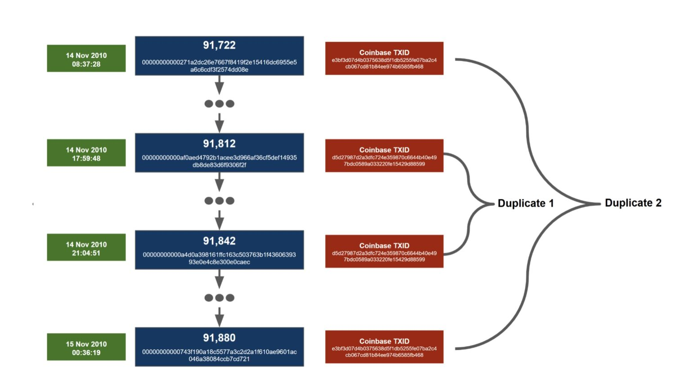
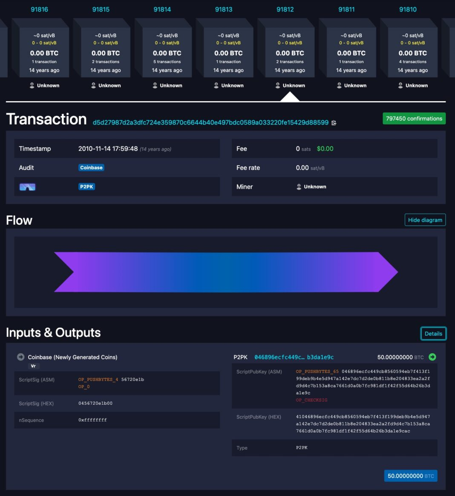
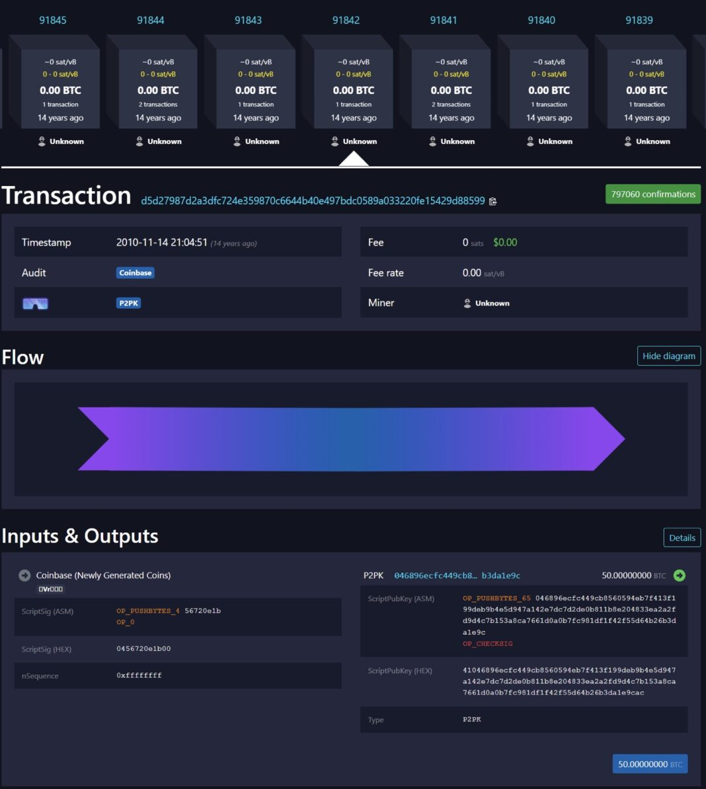
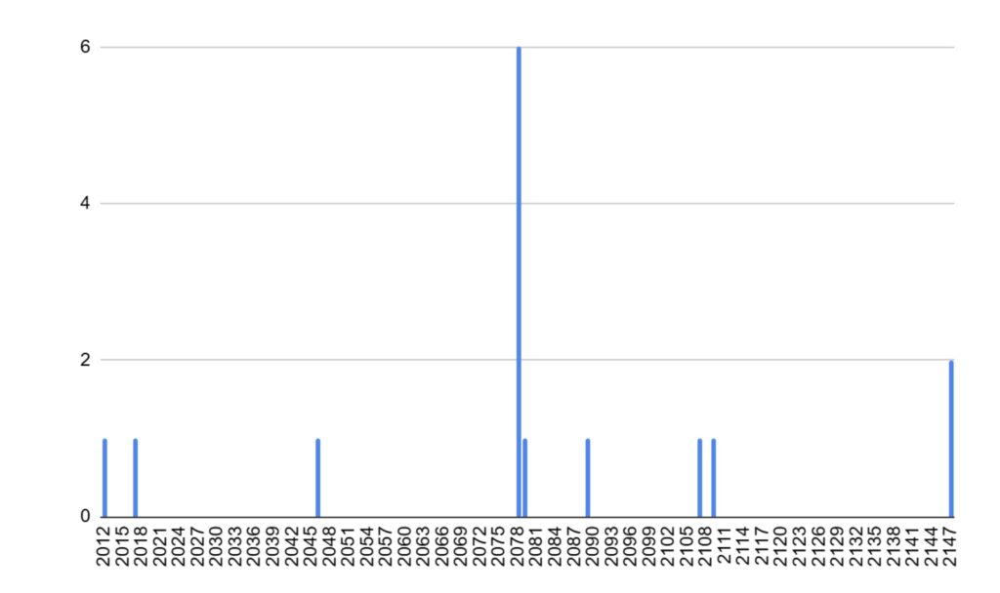

> *作者：BitMEX Research*
> 
> *来源：<https://blog.bitmex.com/bitcoins-duplicate-transactions/>*

**摘要：**在比特币区块链上，有两对一模一样的交易，其中一对夹在另一对之间，而且全都出现在 2010 年 11 月中旬。重合交易可能会导致混淆，而比特币开发者已经想尽各种办法与之搏斗了多年。这问题仍未得到完全解决，下一次可能重合会发生在 2046 年。虽然现在与重合交易有关的风险是很小的，但它依然是一个值得思考的有趣 bug。

## 概述

正常的一笔比特币交易会花费来自过往交易的至少一个输出，也即是会引用前序交易的交易标识符（TXID）。这些未花费的输出只能花费一次 —— 要是能花费两次，那就意味着你可以重复花费同一笔比特币，那比特币就没有价值了。然而，实际上，比特币链上出现过两对完全一样的交易。这是有可能的，因为 coinbase 交易（让出块者获得区块奖励的交易）并没有任何交易输入，而是产生了新的货币。因此，有可能两笔不同的 coinbase 交易会发送相同的数额到同一个地址中、并以完全相同的方式构造出来，从而它们是完全一样的。因为交易是一样的，所以它们的 TXID 也是一样的（TXID 是交易数据的哈希摘要）。除此之外，导致 TXID 重合的唯一可能性便是哈希碰撞（两个不同的原像产生了完全相同的哈希值）；对于一种密码学安全的哈希函数来说，这被假设是不太可能的、不会出现的。对于 SHA256 哈希算法来说，哈希碰撞在比特币和其它地方都从来没有发生过。

这两对相同的交易的发生时间都很接近，在 2010 年 11 月 14 日 UTC 时间 08:37 到 2010 年 11 月 15 日 UTC 时间 00:38 之间。第一对交易交易把第二对交易夹在中间，就像三明治一样。我们将 [d5d2….8599](https://mempool.space/tx/d5d27987d2a3dfc724e359870c6644b40e497bdc0589a033220fe15429d88599) 当作第一对重合交易，因为它是最先出现重合的，虽然（奇怪的是），更早的一笔交易 [e3bf….b468](https://mempool.space/tx/e3bf3d07d4b0375638d5f1db5255fe07ba2c4cb067cd81b84ee974b6585fb468) 与未来的一笔交易产生的重合。

## 重合交易的细节

在下文中，你可以看到来自 [mempool.space](https://mempool.space/) 区块浏览器的两张截图，它们是第一对重合交易，发生在两个不同的区块中。

有趣的是，如果你给区块浏览器网站输入相关的 URL 来查询它们，[mempool.space](https://mempool.space/) 区块浏览器在显示第一对重合交易（[d5d2….8599](https://mempool.space/tx/d5d27987d2a3dfc724e359870c6644b40e497bdc0589a033220fe15429d88599)）时默认显示更早的区块（高度 91812）中的那一笔；而在显示第二对重合交易（[e3bf….b468](https://mempool.space/tx/e3bf3d07d4b0375638d5f1db5255fe07ba2c4cb067cd81b84ee974b6585fb468)）时则默认显示更晚的区块（高度 91880）。Blockstream.info 和 Btcscan.org 的结果也是一样的。根据我们的基础测试，Blockchain.com 和 Blockchair.com 不一样，它们总是显示更新的那一个区块。

在这里涉及到的 4 个区块中，只有一个包含了 coinbase 交易以外的其它交易，那就是高度为 91812 的区块；该[交易](https://mempool.space/tx/777ed67c58761dcaf3762e64576591c8d39317bcbebf0cb335e138d6ea438ce2)将 1 BTC 和 19 BTC 汇集成一个价值 20 BTC 的输出。

## 这些输出能够花费吗？

因为有两对一模一样的 TXID，后来的交易要引用它们就发生了难题。每一笔重合交易都价值 50 BTC。因此，这些重合交易总计涉及 4 * 50 BTC = 200 BTC；或者，也可以说是 2 * 50 BTC = 100 BTC，这就取决于你怎么理解它们了。从一个角度看，有 100 BTC 并不存在。截至今日，全部 200 BTC 都还没有被花费。就我们所知（不一定完全准确），如果有人知道这些输出背后的私钥，那么可以花费这些比特币，然而，一旦花费，这些 UTXO 就将从数据库中移除，而相关重合交易中的 50 BTC 就会因此变得不可花费（丢失），所以，只有 100 BTC 是可以找回的。至于花费的到底是来自哪个区块的交易（较早出现的那一笔还是较晚出现的那一笔），那是无法定义的，不可能说得清楚。

在重合交易产生之前，当事人是可以花费交易中所有的比特币的；当事人可以之后再创建重合输出，从而在数据库（或者说未花费输出集合）中创建一个新的条目。如果真是这样，那就意味着不仅会出现重合交易，还可能出现带有重合的已花费输出的重合交易。如果真是这样，那就开启了创建甚至更多重合交易的可能性，在这些输出被花费的时候，产生重合交易的链条。当事人得非常小心安排事件的顺序，确保总是在重合交易创建之前先花掉它，不然，可能就有一部分比特币永远找不回来了。这些新的重合交易将不是 coinbase 交易，而是 “常规” 交易。幸运的是这一切没有发生。

## 重合交易带来的问题

重合交易显然是坏事。它会给钱包和区块浏览器带来混淆，让比特币的来源变得模糊。它还产生了许多攻击和爆破的可能性。比如说，你可能会使用两笔重合交易，给同一个人支付两次。然后，当这人决定花费这些资金的时候，就发现只有一半是可以花费的。还比如说，这也可能给交易所带来危险、让交易所资不抵债，攻击者没有任何代价，因为他们可以在存入资金后立即要求取款。

## 禁止带有重合 TXID 的交易

为了缓解重合交易问题，在 2012 年 2 月，比特币开发者 Pieter Wuille 提出了 [BIP30](https://github.com/bitcoin/bips/blob/master/bip-0030.mediawiki)，这个 BIP 禁止了创造与已有 TXID 重合的交易，除非之前那笔交易已被完全花费掉。这一软分叉应用在 2012 年 3 月 15 日之后的所有区块上。

在 2012 年 9 月，比特币开发者 Greg Maxwell [修改](https://github.com/bitcoin/bitcoin/commit/ab91bf39b7c11e9c86bb2043c24f0f377f1cf514)了规则，将 BIP30 检查应有在所有区块上（而不仅仅是 2012 年 3 月 15 日之后产生的区块）。上文提到的两组重合交易被处理为例外。这修复了一些 DoS 漏洞。技术上来说，这是另一次软分叉，虽然规则变更仅适用于 6 个月以前产生的区块，所以不具备常规的协议规则变更所具有的任何风险。

BIP30 检查是重度计算。节点必须检查一个新区块中的所有交易输出，看哪一个输出的输出点（output endpoints）是否已经存在于 UTXO 集中。这可能是为什么 Wuille 设计了只检查未花费的输出。如果要检查（从创世区块以来的）所有输出，那计算量会更加恐怖，而剪枝模式也不再可能实现。（译者注：剪枝模式是删去一部分历史区块，但保留完整的 UTXO 集，从而可以验证新区块的节点运行模式。）

## BIP34

在 2012 年 7 月，比特币开发者 Gavin Andresen 提出了 [BIP34](https://github.com/bitcoin/bips/blob/master/bip-0034.mediawiki)，这个软分叉在 2013 年 3 月激活。该协议变更要求 coinbase 交易包含区块高度，同时启用了区块格式的版本区分。区块高度要作为添加到 coinbase 交易的 scriptSig（脚本签名）中的第一个元素。Coinbase 交易脚本签名中的第一个字节要指明区块高度数字所用的字节数量，然后就是区块高度数字本身。在第一个 160 年（`2 ^ 23 / (144 blocks/day * 365 day/year)`）里，第一个字节应该都是 0x03。这就是为什么今天的 coinbase 脚本签名（的十六进制编码）总是以 03 开头。这一软分叉似乎完全解决了重复交易问题，现在所有交易都应该是独一无二的了。

在 BIP34 已经得到采用之后，2015 年的 11 月，比特币开发者 Alex Morcos 向 Bitcoin Core 软件仓库添加了一个[合并请求](https://github.com/bitcoin/bitcoin/pull/6931)，该变更意味着节点将停止执行 BIP30 检查。毕竟，因为 BIP34 已经修复了这个问题，这种昂贵的检查也就不再必要了。当时还不知道，但从技术上来说，这确实是一次硬分叉，会将未来以极小概率出现的区块判为无效。现在来说，这种潜在的硬分叉不重要了，因为几乎没有人还运行 2015 年 11 月以前发布的节点软件。在 [forkmonitor.info](http://forkmonitor.info/)，我们正在运行 Bitcoin Core 0.10.3，它是在 2015 年 10 月 发布的。因此，这是一个遵循硬分叉以前规则的客户端，依然会执行昂贵的 BIP30 检查。

## 区块 198 3702 的问题

后来人们发现，有一些在 BIP34 激活以前的区块的 coinbase 交易，其脚本签名的开头恰好跟未来（BIP34 规则下）有效的区块一致。因此，虽然 BIP34 在绝大部分情况下都修复了问题，但还不是 100% 修复。在 2018 年，比特币开发者 John Newbery 列出了这些可能重合的完全列表，如下：

| 老区块  | 新区块    | 预计新区块到来的日期 |
| ------- | --------- | -------------------- |
| 209,920 | 209,921   | 28/11/2012*          |
| 176,684 | 490,897   | 21/10/2017*          |
| 164,384 | 1,983,702 | 13/01/2046           |
| 169,895 | 3,708,179 | 28/10/2078           |
| 170,307 | 3,709,183 | 03/11/2078           |
| 171,896 | 3,712,990 | 30/11/2078           |
| 172,069 | 3,713,413 | 03/12/2078           |
| 172,357 | 3,714,082 | 07/12/2078           |
| 172,428 | 3,714,265 | 09/12/2078           |
| 183,669 | 3,761,471 | 02/11/2079           |
| 196,988 | 4,275,806 | 12/08/2089           |
| 174,151 | 5,208,854 | 11/05/2107           |
| 201,577 | 5,327,833 | 14/08/2109           |
| 206,039 | 7,299,941 | 11/02/2147           |
| 206,354 | 7,299,941 | 11/02/2147           |

- 来源：https://gist.github.com/jnewbery/df0a98f3d2fea52e487001bf2b9ef1fd -

关于 “*” 的注解： 这些区块已经在 2012 年和 2017 年挖出，它们的 coinbase 交易并没有重合。209921 区块（第一次增发量减半的倒数第 79 个区块）不可能重合，因为那时候还实行 BIP30 检查。

**重合 coinbase 交易的可能数量年度表**

- 来源：https://gist.github.com/jnewbery/df0a98f3d2fea52e487001bf2b9ef1fd -

因此，下一个可能出现重合交易的区块是 198 3702 高度，预计会在大约 2046 年 1 月产生。高度为 16 4384 的区块产生于 2012 年 1 月，其 [coinbase 交易](https://mempool.space/tx/3aa03753fc238b38f4db9e5889362f3a6f0900d602baa8c9a7e789cb13ca1462)发送了 170 BTC 到 7 个不同的地址。因此，如果 2046 年的一个矿工要发动这种攻击，就不仅要能够挖出这个区块，还得烧掉接近 170 BTC 的手续费，总成本会稍微高于 170 BTC（包括了 0.09765625 BTC 区块补贴的机会成本）。基于当前的比特币汇率 88500 美元，这需要付出 1500 万美元的代价。至于谁拥有 2012 年这笔 coinbase 交易中的 7 个地址，则是未知的，有很大概率这些私钥以及丢失了。这笔 coinbase 交易的所有 7 个输出都已经被花掉了，其中 3 个是在[同一笔交易](https://mempool.space/tx/02b0c6c1b99b78a86a9f8c6ec6f82d375068d513251a7ab6bfb30470ae617bc7)中花掉的。我们认为，这些资金可能跟 [Pirate40](https://blog.bitmex.com/reckless-chapter-7-the-early-years/) 庞氏骗局有关，虽然这只是一种猜测。因此，这种攻击似乎不仅是非常昂贵的，还几乎是完全无用的。要花费相当相当大的一笔钱，才能将一个运行 31 年的软件的节点从网络中踢出。

（译者注：此处的逻辑是，BIP34 并不禁止重合交易出现，BIP30 才禁止。因此，如果 198 3702 高度创造出了重合交易，只会对仍在运行 BIP30 检查的节点带来困扰 —— 将它从已经不再运行 BIP30 检查的节点所组成的网络中分叉出去。当然，因此也可以说，在当前，关于如何处理重合交易，我们是没有明确标准的。）

下一个可能发生危险的区块，其 coinbase 交易可能跟 2012 年 3 月出现的高度为 16 9985 的区块重合。历史上这笔 coinbase 交易的输出只略微超过 50 BTC，远远低于 170 BTC。50 BTC 当然跟当时的区块补贴有关，而在有重合危险的未来，2078 年，区块补贴会低得多。因此，为了利用这个漏洞，矿工要烧掉大约 50 BTC 的手续费，这些手续费是拿不回来的，因为它们必须发送给在 2012 年的交易中出现的输出。谁也不知道 2078 年比特币的价格，但这种攻击可能也是极度昂贵的。因此，这一问题可能不是比特币面临的主要风险，但依然算是一个困扰。

自 2017 年隔离见证升级以来，coinbase 交易还可以包含一个对区块内所有交易的承诺。这些 BIP34 以前的区块并不包含见证数据承诺。因此，为了产生重合的 coinbase 交易，矿工需要从区块中剔除所有花费隔离见证输出的交易，这就进一步地增加了攻击的机会成本，因为能够纳入区块的、支付手续费的交易就更少了。

## 结论

重合交易 bug 看起来不是比特币的重大安全问题，因为利用它的难度非常高、代价非常昂贵，而且机会也很罕见。然而，这依然是一个有趣的问题，考虑到其时间尺度和重合交易的有趣特性。尽管如此，开发者已经在这个问题上花费了大量时间，2046 这个日期可能一直埋在一些开发者的脑海中，作为修复这个问题的最后期限。有不少办法可以修复这个问题，可能需要一次软分叉。一种可能的办法是让（coinbase 交易包含）隔离见证承诺成为强制要求。

（完）