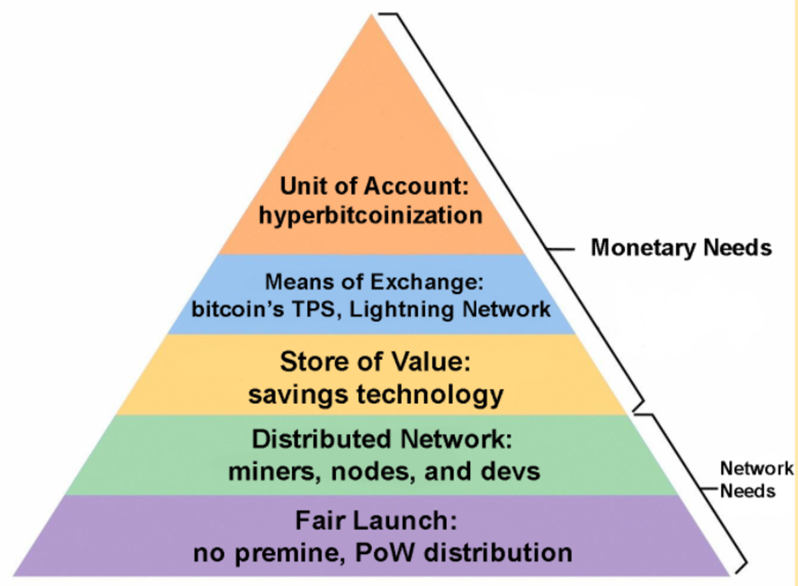
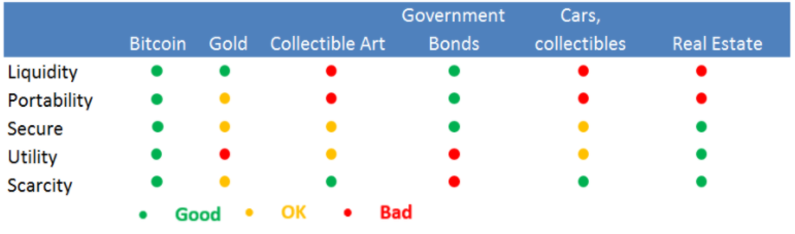
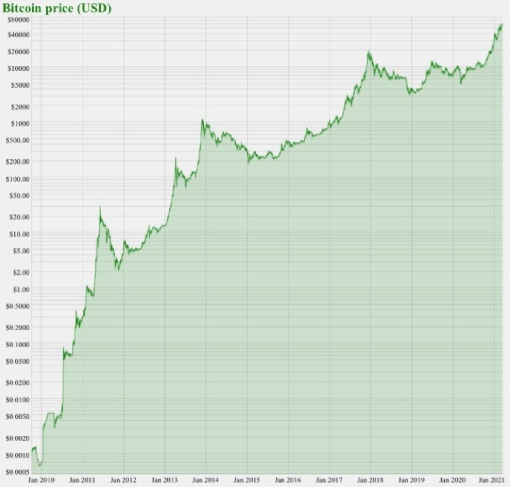
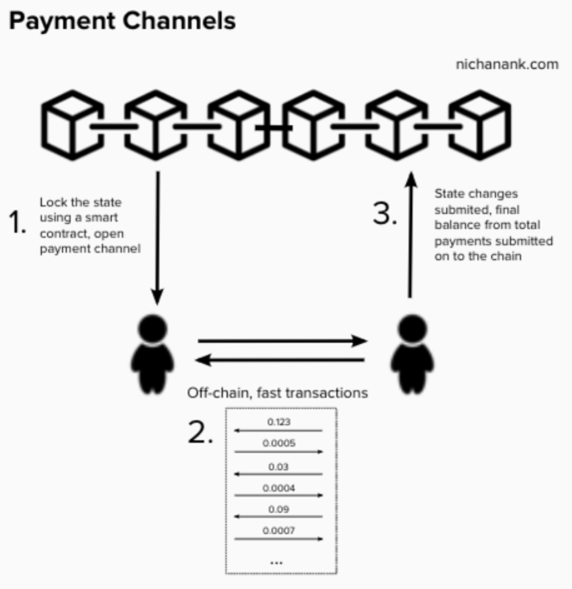
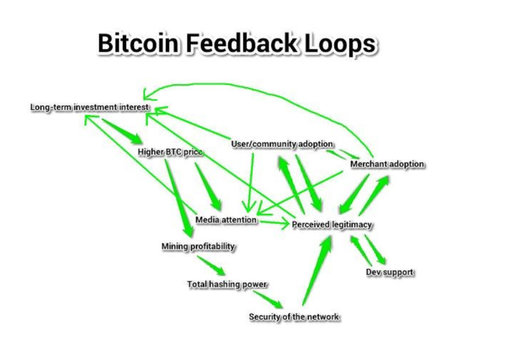

> *作者：NIK*
> 
> *来源：<https://bitcoinmagazine.com/culture/bitcoins-hierarchy-of-needs>*

比特币要想实现 “超级比特币化”，就必须满足特定的网络和货币需求。如果不能获得以及（更重要的）维持这些特性，比特币就无法成功。如果比特币可以获得和维持这些特性，那比特币就无可阻挡。

本文是对马斯洛的需求层级理论（Maslow’s hierarchy of needs）的诠释；马斯洛的理论是说，人必须经历一定的生活层次才能最终达至幸福、实现自己的全部潜能。这个理论也适用于比特币。

- 图片来自 @Nikcantmine  -

这就是方案，这就是比特币成为世界储蓄货币的路径。

## 网络需求

### 基础层：公平启动

如果一种货币自启动之始就带有欺骗，那它绝没有机会获得广泛采用、成为全球储蓄货币。

让比特币不同于其它几千种密码货币的原因之一就是：它是在 2009 年 1 月 3 日公平启动的；此时距中本聪首次公开比特币白皮书（在 2008 年 10 月 31 日）已经过去了两个月之久。更不用说，比特币最开始是受 2007 年至 2008 年法币和中央银行系统的金融危机的刺激而产生的。它致力于成为一个问题的解决方案。而所有其它币都是在看到比特币的成功之后尝试复制它，然后失败。

中本聪发明比特币时从未想过要欺骗他人，他发明比特币是为了给所有人一个包容、公平的货币系统。不仅体现在这个系统没有 “预挖”（就是创始人给自己分配一大笔钱的行径），中本聪还确保在启动之前给了潜在的参与者提醒。显然，对中本聪来说，很重要的是，比特币不要被看作是为了使一些人能鱼肉另一些人而创造的东西。

中本聪在编写第一个区块时锁定了它，导致第一个区块发放的 50 BTC 奖励是无法获得的，不论是中本聪，还是其他人，都无法拿走这些比特币。比特币的供给量上限大约是 2100 万 BTC，就此少了 50 BTC。如果创建者拿走了这些比特币，这个项目就不是公平的了。而有了第一个区块之后，矿工就可以开始以哈希计算来挖矿、构建出区块链。

在区块链上铸造新币必须是公平的，即没有哪个人比别人有先天的优势地位。这个系统应该是包容的，即任何人都可以运行节点、为自己验证所有事项都是正确的、诚实的参与者会得到奖励、恶意的参与者将面临后果。无论使用什么系统来创造更多的货币，都必须付出一定的代价来阻止有人从欺骗这个系统中获益并形成垄断。

比特币使用分布式的工作量证明（PoW）解决了这个问题。

### 第二层：分布式的网络

因为比特币是没有恶意、公平启动的，所以我们可以放心地开发和延展这个网络。比特币如果真的想走向成功，极为不像黄金、法币和山寨币那样是中心化的。

比特币的强大源于两个原因。其一，比特币的创始人很久以前就消失了，再未出现过。所以没有中心权威能逮捕 TA 乃至利用 TA 来摧毁这个项目。七二，开发者、经济节点以及矿工分散再全球。这三大利益相关团体相互监督、相互制衡，没有哪一方能单方面控制比特币。

[Der Gigi](https://bitcoinmagazine.com/culture/video-bitcoins-nature-with-gigi) 做了一个大胆的类比：比特币就像蚁群。你可以踩死巴掌大地方上的蚂蚁，但你不可能消灭掉地球上所有的蚂蚁，因为它们数量庞大而分布广泛。

比特币开发者指的是勤奋工作以提高比特币的个人。这些开发者必须开发用户需要的功能，不然就没有用户会用他们的软件。攻击网络并不是开发者的上策，因为一切都是公开的；也没办法偷偷地攻击比特币，因为整个过程很花时间，必然曝光。如果一个开发者真的尝试攻击比特币，TA 会就此名誉扫地，再也没人使用 TA 所开发的软件。一个开发者改变网络的提议，会在其提交比特币升级提议（BIP）的过程中受到其他开发者的密集审核。任何人都可以成为比特币开发者，而且比特币的开发者在世界各地都有。

矿工和节点也不能完全控制网络。矿工为比特币账本慢慢写入交易并 “铸造” 新的比特币。节点快速和高效地验证区块链上的交易，但无法增发货币。矿工必须遵循节点设定的规则，而这些规则只有节点运行者个人集体选择运行新软件时才会改变。

必须以网络的参与者为优先，这样才能保持比特币的去中心化。比特币网络越是去中心化，它的抗审查性就越强。它的抗审查性越强，就越能抵御国家和其他人的控制。好消息是，整个网络在缓慢壮大。2021 年 1 月，比特币网络的全节点数量达成新高，全网共有 11558 个全节点（[bitnodes.io](https://bitnodes.io/nodes/) 数据）。

如果你认为：“只要政府发动 51% 攻击，比特币就会失败”，我有许多回应，但为了节省你我的时间，你可以直接看这个两分钟的视频：

https://youtu.be/ncPyMUfNyVM

## 货币需求

### 第三层：价值储存

比特币的分布式网络必须先就位，然后大家才能安全、可靠地用它来存储自己的财富。我认为这就是我们当前（在撰文之时）所处的阶段。

比特币近来在这方面长势喜人，其市值最近[刚刚超过 1 万亿美元](https://bitcoinmagazine.com/markets/bitcoin-market-cap-breaks-1-trillion-as-btc-price-surges-again)，还有几百亿美元希望进入这个市场。今日之世界有价值储存危机。全世界有大约 [80 万亿美元](https://www.businessinsider.com/heres-how-much-money-there-is-in-the-world-2017-10)就只是放在那里，等待着放到实际的价值储存手段中去。全球有大约 [100 万亿美元的股票](https://www.fidelitydigitalassets.com/bin-public/060_www_fidelity_com/documents/FDAS/bitinvthessisstoreofvalue.pdf)，是由宁愿储蓄而不愿意承担风险的人持有的。 [房地产的市值超过 281 万亿美元](https://www.fidelitydigitalassets.com/bin-public/060_www_fidelity_com/documents/FDAS/bitinvthessisstoreofvalue.pdf)，但房地产有许多缺点，比如它很容易被征税、难以转移、流动性差。黄金有大约 11 万亿美元的市值，但它不过是一块亮晶晶的石头。[全球债务市场的市值大概是  253 万亿美元](https://www.fidelitydigitalassets.com/bin-public/060_www_fidelity_com/documents/FDAS/bitinvthessisstoreofvalue.pdf)。比特币会继续吞噬他们，即便不能全部吞下，也会吃掉一大部分。

- 图片来自https://medium.com/@markharvey_52065/store-of-value-a-case-for-3-million-bitcoin-6809877f3c3e  -

十二年多以前，比特币入局，成为市场上的竞争者。自那以后，比特币一直在经历价格发现过程、辨明自己在货币食物链上的位置。比特币已被证明是一种极好的价值储存无，不仅因为它拥抱了所有良好货币通常具有的特质（持久存在、易于转移、易于分割、均质性、稀缺性、可接受性以及可验证性），更因为它是流动性最好的货币，并且积累起了强大的网络效应。这就是它具有主导地位的原因。

散户投资者早就拿比特币作为一种储蓄手段了，但过去几年来，机构也就入了进来。在去年夏天， [MicroStrategy 买入了比特币总供给量的百分之 0.1](https://bitcoinmagazine.com/culture/microstrategy-buys-0-1-percent-of-total-bitcoin-supply)之后，机构买入的潮流也真正开始了。从那时候开始，我们已经开到了 [MassMutual 在去年十月买入了价值 1 亿美元的比特币](https://bitcoinmagazine.com/markets/ushering-in-a-bitcoin-standard-marathon-buys-150-million-of-bitcoin)，[Marathon Patent Group 在今年 1 月买入了 1.5 亿美元的](https://bitcoinmagazine.com/markets/ushering-in-a-bitcoin-standard-marathon-buys-150-million-of-bitcoin)，甚至[Tesla 买入了 15 亿美元](https://bitcoinmagazine.com/markets/its-happening-tesla-buys-1-5-billion-of-bitcoin)。机构正在吸纳越来越多的比特币，因为他们已经知道了接受比特币本位的好处。

每个人都需要将自己获得的价值储存在某个不会随时间流失购买力的地方。发达国家的居民不得不将法比薪酬投入到投资用途中，希望能 保持/提高 自己的购买力。发展中国家的居民没有这种特权，还不得不将财富以美元存储，以逃避他们快速崩溃的本国货币。

比特币让储蓄成功成为一种选择。人们可以真的将财富储存起来并使之增值，而无需担心它因为通货膨胀而不断流失价值的问题。2100 万 BTC 的硬顶以及用户接受度的不断增加使之牢不可破。现在每个人都可以工作以及正确分配财富来提高自己的生活质量。

- 图片来自 https://bitcoin.zorinaq.com/price/  -

## 第四层：交换媒介

在比特币吸收了数万亿美元之后，比特币征服世界的下一步就是变得足够方便，以至于能够在日常生活中购买商品和服务。

重要的是，我们要意识到，比特币区块链应该被当成一个结算层，而不是支付层。与传统金融系统的缓慢的支付处理速度相比，比特币区块链已经有了重大提升。法币转账的速度慢到令人发指。ACH 转账要花两到三天时间。支票、现金计账卡和信用卡要花 30 天来清算。此外，当我们用法币来交易时，最终结算（final settlement）甚至无法进行，因为它总是暴露在法币发行者的对手方风险之下。所以，发送大额比特币时只需 30 分钟甚至更短时间就可以达到最终结算，已经是一个巨大的升级。但我们可以使用额外的支付层来继续拔高比特币。

比特币的优点在于，因为它是一套开源的协议，所以我们可以在上面开发解决方案。一个类似的现象是，传统金融系统的基础层无法扩展到全球，所以他们在此基础上加入额外的层级，例如 Square、Visa 和 Mastercard 来帮助交易。比特币世界也有类似的想法，就是闪电网络。

“问题在于，每秒处理 7 笔交易就可以了。因为未来，它（闪电网络）会成为 Square 现金，每天一次性转移 1.82 亿美元的比特币。闪电网络会向 3700 万用户提供 Square 现金账户，而这些用户每天会产生 1.87 亿次交易。这就是一个二层解决方案。3700 万用户每天可以产生 1.8 亿次交易，但只需在比特币区块链上发起一笔交易就可以全部结算，它同时也扩大了比特币的体量。比特币赢了，Square 赢了，用户也赢了。” —— [Michael Saylor ](https://youtu.be/jwgOVPJ2FnU)

- 图片来自 https://www.nichanank.com/blog/2019/1/5/bitcoin-scaling-lightning-network-micropayments  -

一个很棒的类比是 Saylor 说的 George Lucas（乔治·卢卡斯）的超级英雄。超级英雄拥有一些过人的能力，例如眼镜可以发射激光、飞行、瞬间转移、极快的速度，等等。但他们有一个缺点：他们很容易死。

现在，设想一个没有那么多花哨的能力（比如激光和瞬间转移）但打不死的超级英雄。行动很慢，也没啥可抓人眼球的东西。这个杀不死的超级英雄只需拿上一把枪，就可以把其他所有的花哨的超级英雄都干掉，而且面对攻击还能谈笑自若。这个能拿起新枪的超级英雄就像比特币，而那些浮夸的超级英雄就像山寨币。

如果这样类比，那比特币的枪在哪儿？这把枪就是建立在比特币基础之上的分层解决方案，比如闪电网络。结果是，比特币成了一个去中心化而且牢不可破的基础层，在上面可以开发扩容方案，而比特币也成了有史以来最势不可挡的货币。

闪电网络这样的扩容方案将使比特币能超越当前的阶段，成为一种交换媒介。有些人会说闪电网络中的交易也是最终结算，当然有些人会说，从技术上来说不是，把交易提交到比特币区块链上才是。但使用和开发闪电网络的比特币人越来越觉得它是（最终结算工具）。

## 顶层：记账单位 —— 超级比特币化

越来越多人使用比特币来储蓄自己的财富，越来越多商家接受比特币支付，机构也接受它作为自己财库的储备资产，这就到了终局阶段。

在这个阶段，世界上的所有东西都用比特币而非美元来标价。价格发现会贯穿这个长期过程，直至其走向完成；而比特币的价格发现从比特币出现的第一天就开始了。超级比特币化完成之后，我很怀疑人们会以 BTC 为单位给日常物品计价（比如：0.00345727 BTC）。相反，我们会以 “聪”（BTC 的亿分之一）为单位。

随着比特币黑洞吸收越来越多的财富、越来越多商家接受比特币作为商品和服务的支付手段，超级比特币化就在眼前。

人们有逐渐汇集到同一种货币媒介来储蓄、投资和执行经济计算的倾向。这只会是一种货币。因为使用多种通货会使经济计算更为负载，并推迟发展出统一的货币系统的时间。比特币会同时成为全球所有人的记账单位以及最有吸引力的资产。这只会鼓励更多人继续使用它作为自己的价值储存五和交换媒介。

这个金字塔的五层创造了一个正循环，会不断加强比特币的方方面面。

- 图片来自 https://bitcointalk.org/index.php?topic=144911.0  -

（完）