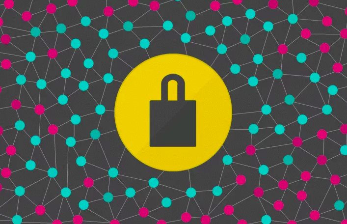
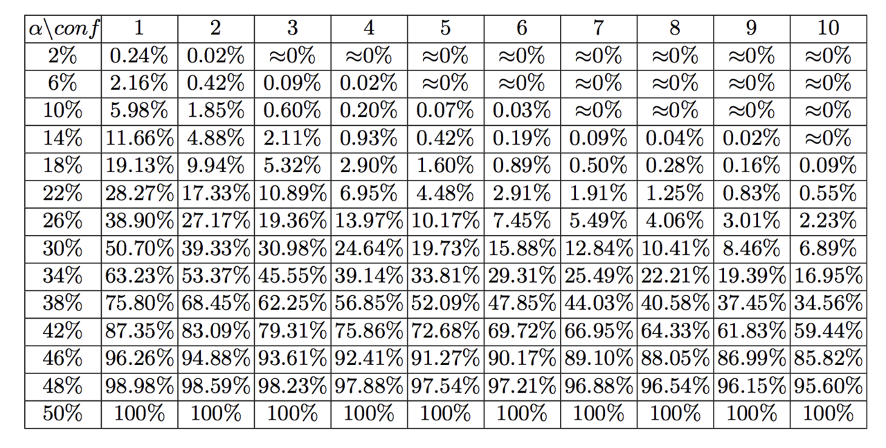
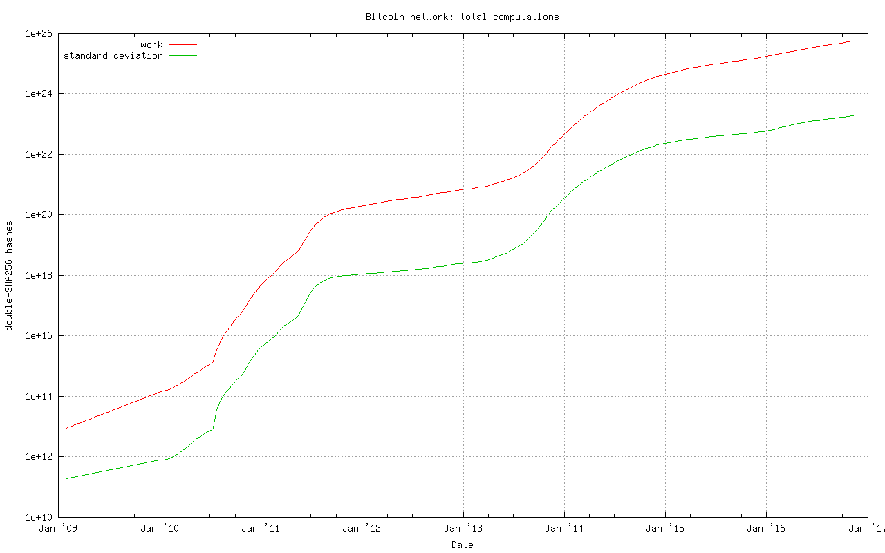
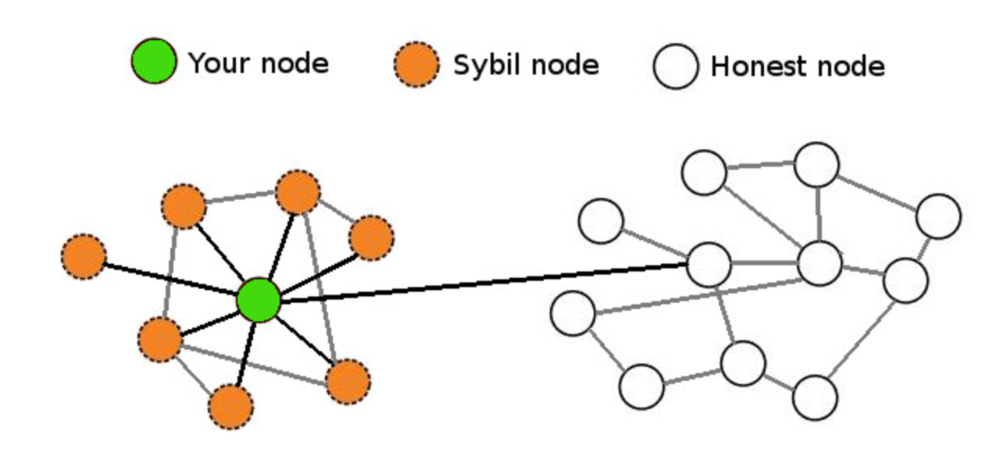
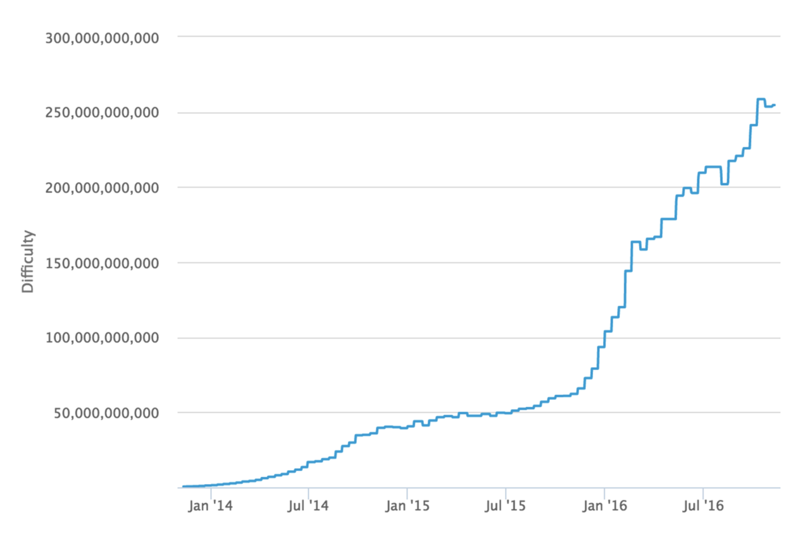
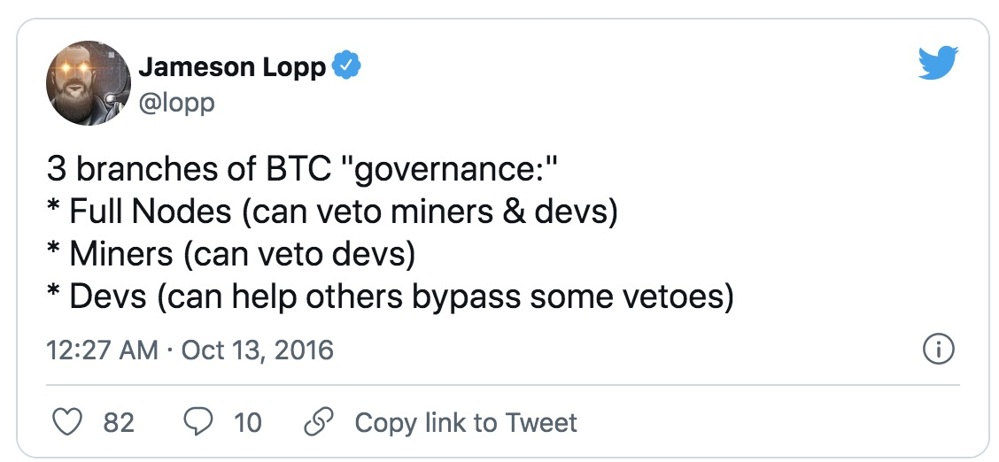
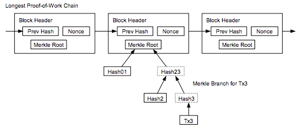
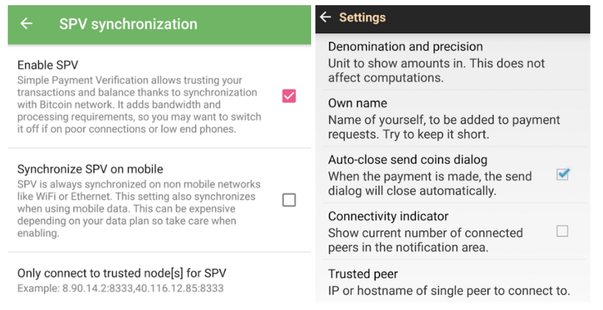

> *作者：Jameson Lopp*
> 
> *来源：<https://blog.lopp.net/bitcoins-security-model-a-deep-dive/>*




人们在[讨论不同密码学货币的共识机制](https://blog.lopp.net/bitcoin-the-trust-anchor-in-a-sea-of-blockchains/)时经常会产生争议，主要是因为他们对这些密码学货币用来保护账本历史数据的安全模型缺乏了解（和定义）。虽然所有共识模型都是在防范各种理论上的攻击，但是了解这些模型的具体目的非常重要。

安全模型可以分为两个部分：假设（assumption）和保证（guarantee）。如果用作输入的假设成立，则安全模型输出的保证也应成立。

让我们来深入探索比特币为其全节点运营者提供的安全模型。

## 求真

>“用户间信任需求最小化是比特币的优势之一。我个人甚至认为这是比特币最大的优势。” —— [Pieter Wuille](https://www.reddit.com/r/BitcoinBeginners/comments/3eq3y7/full_node_question/ctk4lnd/)

分布式账本旨在提供有序的事件记录，因为在分布式系统中你不能单纯地信任时间戳。

新的参与者刚加入一个区块链网络时，会从软件硬编码的创世块开始下载所有可获得的区块，然后鉴别整条区块链的有效性。

比特币安全模型最重要的假设之一是绝大多数矿工都是诚实的 —— 他们在努力保护区块链的安全性，而不是试图破坏它。实际上，纵观比特币的发展史，得益于有效的矿工激励机制，这个假设至今未被打破，虽然已经有人[怀疑](https://freedom-to-tinker.com/2016/10/21/bitcoin-is-unstable-without-the-block-reward/)它能否长期保持。

有了这个假设作为前提，全节点运营者完全可以确信：

* 除矿工之外没人能增发比特币，而且比特币的供应量会严格按照发行计划表增加。
* 没有私钥就无法花费对应的比特币。
* 没有人可以重复花费同一笔比特币。

在比特币区块链强有力的保证下，全节点运营者还可以确信以下两点：

* 任何比特币区块都是在其时间戳的大约两小时内创建的。
* 他们正在同步的是 “真实的” 区块链历史。

从技术层面来讲，比特币区块需要经过大量检查：

* 所有区块都遵守共识规则：
  * 每个区块都[与其父块相连](https://github.com/bitcoin/bitcoin/blob/0.13/src/main.cpp#L3643)
  * 每个区块都达到目标难度值，并且有[充足的工作量证明](https://github.com/bitcoin/bitcoin/blob/0.13/src/pow.cpp#L77)
  * 区块时间戳位于[与上一最新区块之间的时间窗口](https://github.com/bitcoin/bitcoin/blob/0.13/src/main.cpp#L3520)内
  * [默克尔根与区块所记载的交易相匹配](https://github.com/bitcoin/bitcoin/blob/0.13/src/main.cpp#L3385)
  * 区块大小[不超过上限](https://github.com/bitcoin/bitcoin/blob/0.13/src/main.cpp#L3405)
  * 每个区块的第一笔（也只有第一笔）交易[是 coinbase 交易](https://github.com/bitcoin/bitcoin/blob/0.13/src/main.cpp#L3409)
  * Coinbase 输出不超过[区块奖励](https://github.com/bitcoin/bitcoin/blob/0.13/src/main.cpp#L2495)
  * [区块内包含的签名操作不超过许可范围](https://github.com/bitcoin/bitcoin/blob/0.13/src/main.cpp#L3405)
* 所有交易都遵守共识规则：
  * 输入值和输出值[都是合理的](https://github.com/bitcoin/bitcoin/blob/0.13/src/main.cpp#L1070)
  * 交易[只花费还未被花费过的输出](https://github.com/bitcoin/bitcoin/blob/0.13/src/main.cpp#L1250)
  * 所有即将花费的输入都[有有效签名](https://github.com/bitcoin/bitcoin/blob/0.13/src/main.cpp#L2026)
  * [coinbase 交易创建后的 100 个区块内](https://github.com/bitcoin/bitcoin/blob/0.13/src/main.cpp#L1971)，该 coinbase 交易的输出无法花费
  * 当某笔交易仍处在区块确认的窗口期，其输出就[不能花费](https://github.com/bitcoin/bitcoin/blob/0.13/src/main.cpp#L3571)
  * 篇幅有限，[其余规则](https://en.bitcoin.it/wiki/Protocol_rules)不作赘述


## 热力学安全性

区块内的交易一经确认无法回滚，除非有人花费大量能源重写这条链。

只要没有攻击者拥有全网 50% 以上的算力，且诚实的节点可以快速通信，发生交易回滚的概率就会随着交易确认次数呈指数级下降。其它类型的攻击（[例如，自私挖矿](https://bitcoinmagazine.com/articles/selfish-mining-a-25-attack-against-the-bitcoin-network-1383578440)）虽然没有这么高的能耗需求，但是实施起来很难。



<p style="text-align:center">- 来源：Yonatan Sompolinsky1 和 Aviv Zohar 撰写的 <em>Bitcoin’s Security Model Revisited</em> -</p>

从比特币矿工当前的累积工作量来看，攻击者需要计算出将近 10^26 个哈希值，才能从创世块开始构建出一条累积工作量证明更多的链。全节点会将这条链视为 “合法” 的链。



<p style="text-align:center">- 来源：http://bitcoin.sipa.be  -</p>

我们来计算一下 51% 攻击的成本：

一台蚂蚁矿机 S9 的功耗是 *0.1 J/GH（10^9 hash）*。（译者注：hash 在这里表示哈希计算的次数。每一次哈希计算都要花费一些能量）

```python
10^26 hashes * 0.1 J / 10^9 hashes = 10^15 焦耳
10^15 焦耳 = 2,777,777,778 千瓦时（度） * 0.10 美元/度电 = 277,777,778 美元（重写整条区块链所需的电力成本）
```

撰写本文时，一个区块必须达到 253,618,246,641 的目标难度值，这大约需要：

```python
253,618,246,641 * 2^48 / 65535 = 1.09 * 10^21 hashes
1.09 * 10^21 hashes * 0.1 J / 10^9 hashes = 1.09 * 10^11 焦耳
1.09 * 10^11 焦耳 = 30,278 焦耳 * 0.10 美元/度电 = 3,028 美元（创建每个区块所需的电力成本）
```

因此，我们可以说比特币具有热力学安全性。

你可以调整上述计算中的一些变量来降低成本，但我们可以肯定的是，仅重写整条区块链就需要价值数百万美元的电力。然而，在最坏的情况下，拥有如此强大算力的攻击者能够将交易回滚至 2014 年 —— 我们很快就会深入探究其原因。

另外请注意，购买和运行矿机所需的成本并未考虑在内。

## 抗女巫攻击

由于比特币协议认为累积工作量证明最多的链才是合法的链（最长链原则是常见的误解），新加入网络的对等节点只需与另一个诚实的对等节点建立连接，就可以找到合法的链。

这也被称为抗女巫攻击，这意味着攻击者无法通过运行多个不诚实的对等节点来向某个对等节点提供虚假信息。



上图显示了一个近乎最糟糕的情况：你的节点遭受了大规模女巫攻击，但是依然与一个诚实的节点保持连接，就可以通过这个节点连接至真正的区块链。只要有一个诚实的对等节点将真实的区块链数据传输给你的全节点，你的节点就会识破那些试图欺骗你的女巫攻击者，然后将它们忽略。

## 实时共识

当你的节点同步至区块链顶端时，你就会发现比特币协议通过其它一些有趣的属性来维护全网共识。

[《比特币和其它密码学货币的研究视角及挑战》](https://eprint.iacr.org/2015/261.pdf)的作者指出，以下特性对密码学货币的稳定性来说至关重要：

**最终共识**。在任何时候，所有遵守规则的节点都要就最终的 “合法” 区块链的最新一个区块达成共识。

**指数级收敛**。深度为 n 的分叉的概率是 O(2−n)。这使得用户坚信他们的交易可以在 “k 次确认” 后得到永久结算。

**活性**。新区块会不断生成，支付适当交易费的有效交易会在合理时间内被打包上链。

**正确性**。在累积工作量证明最多的链上，所有区块内包含的交易都是有效的。

**公平性**。拥有全网总算力 X % 的矿工可以挖出大约 X% 的区块。

论文作者指出，比特币看起来具备上述特性，至少是在假设大部分矿工都保持诚实的前提下。这就是区块奖励和工作量证明机制想要达到的目的。

还有许多其它算法可以用来维护分布式系统中的共识，例如：

* 权益证明（PoS）
* 币龄证明（Proof of Coin Age）
* 质押证明（Proof of Deposit）
* 燃烧证明（Proof of Burn）
* 活动量证明（Proof of Activity）
* 耗时证明（Proof of Elapsed Time）
* 联合共识（Federated Consensus）
* 实用型拜占庭容错（Practical Byzantine Fault Tolerance）

上述算法创建了不同的安全模型 —— 与工作量证明最明显的区别在于，基于这些算法的系统都是以消耗内部资源（币或声誉）而非外部资源（电力）来达成共识的。受其影响，这些系统对网络中验证者的激励措施和信任需求各不相同，极大地改变了安全模型。

## 安全模型误区

一个常见的误区是，比特币有一个明确定义的安全模型。

事实上，无论是过去还是现在，比特币协议都没有一个正式定义的规范或安全模型。我们能做的最好的事情就是研究系统参与者的动机和行为，以便更好地理解和描述比特币的安全模型。

尽管如此，经常有人误解了比特币协议的一些特性。

一些区块链存在很严重的隐患，因为开发者在节点软件中增加了[专断设定的已签名检查点](https://github.com/ppcoin/ppcoin/blob/0.4.2/src/checkpoints.cpp#L369)，表示 “开发人员已经确认区块 X 位于正确的那条链上”。这是一个极端中心化的单点问题。

值得一提的是，比特币有[ ](https://github.com/bitcoin/bitcoin/blob/0.13/src/chainparams.cpp#L138)[13 个被硬编码的检查点](https://github.com/bitcoin/bitcoin/blob/0.13/src/chainparams.cpp#L138)，但是这些检查点并没有像被专断设定的检查点那样改变安全模型。最后一个检查点被添加到了 [Bitcoin Core 0.9.3](https://bitcoin.org/en/release/v0.9.3) 内，区块高度是 295000 （创建于 2014 年 4 月 9 日）。这个区块的难度值是 6,119,726,089，所需电力成本约为：

```python
6,119,726,089 * 2^48 / 65535 = 2.62 * 10^19 hash

2.62 * 10^19 hash * 0.1 J / 10^9 hash = 2.62 * 10^9 J

2.62 * 10^9 J = 728 kw/h * $0.10 kw/h = $73（创建该区块所需的电力成本）
```

因此，如果女巫攻击者将一个新加入的节点（需要从头开始进行同步）围住，几乎不需要任何成本就可以在较低的区块高度创建较短的区块链，但是不能超过检查点。

如果女巫攻击者将一个节点从同步超过区块高度 295,000 的网络分离出来，就能以每个区块 73 美元的成本开始提供虚假区块，至少是在发生难度调整之前。但是，受害节点同步的区块链越长，攻击者创建一条累积工作量证明更多的链所需的成本越高。

[Greg Maxwell](https://bitcointalk.org/index.php?topic=194078.msg3009608#msg3009608) 和 [Pieter Wuille](https://bitcoin.stackexchange.com/questions/1797/what-are-checkpoints/1798#comment36402_1798) 都表示，他们希望某天能完全移除检查点。Bitcoin Core 的维护负责人 Wladimir van der Laan 指出，对于那些想要了解比特币安全模型的人来说，检查点[**经常**使人感到困惑](https://github.com/bitcoin/bitcoin/issues/7591#issuecomment-254448921)。

可以说，位于区块高度 295,000 的检查点意味着，全节点 “相信” Bitcoin Core 开发者所说的 2014 年 4 月 9 日之前的区块都是有效的。但是，全节点依然会检查每个区块头里的默克尔哈希值，也就是说，交易历史的有效性依然受到工作量证明的保护。首次同步历史区块链时，这些旧的检查点[可以改善性能](https://github.com/bitcoin/bitcoin/blob/0.13/src/main.cpp#L1996)（跳过签名验证），尽管 libsecp256k1 的引入[让性能差异变得不那么明显](https://github.com/bitcoin/bitcoin/issues/7591#issuecomment-188369540)。

[检查点存在](https://github.com/bitcoin/bitcoin/pull/5927)的目的主要有三个：

1. 防止节点的内存被有效但低工作量证明的区块头[占满](https://github.com/bitcoin/bitcoin/pull/5562#issuecomment-68637511)。
2. 跳过早期区块内的签名（提升性能）。
3. 估量同步进度。

在撰写这篇文章时，Greg Maxwell 提出使用[累积工作量证明检查](https://github.com/bitcoin/bitcoin/pull/9053/files#diff-64cbe1ad5465e13bc59ee8bb6f3de2e7R100)来[代替检查点](https://bitcoincore.org/en/meetings/2016/10/27/)。一旦节点成功同步了某条包含超过 5.4 * 10^24 次哈希计算工作量的链，累积工作量证明较少的那条链就会被拒绝。这恰好与 2014 年 9 月创建的区块 320,000 的工作量大致相符，这时单个区块的难度值约为 27,000,000,000。



<p style="text-align:center">- 来源：<a href="https://blockchain.info/charts/difficulty?timespan=3years">Blockchain.info</a> -</p>

*当难度值为 27,000,000,000 时，挖矿需要计算大约 27,000,000,000 \* 2^48 / 65535 = 1.16 \* 10^20 次哈希函数。*

```python
1.16 * 10^20 hash * 0.1 J / 10^9 hash = 1.16 * 10^10 J

1.16 * 10^10 J = 3,222 kw/h * $0.10 kw/h = $322（平均创建每个区块所需的电力成本）
```

因此，根据提议进行修改后，如果女巫攻击者将一个需要从头开始同步的全新节点完全包围起来，就可以从任一区块开始向这个节点发送虚假的区块数据，而且几乎不需要成本。如果女巫攻击者将一个已经同步超过区块 320,000 的节点完全包围起来，那么从区块 320,000 开始向该节点发送每个虚假区块的成本是 322 美元。

简而言之，如果一个实体可以完全控制你的节点的网络连接，无论是采用哪种方式对节点的初始同步进行检查，攻击成本都相对较低；如果你的节点的网络连接不受任何实体的控制，就可以轻而易举地忽略来自攻击者的区块。

另外，每个区块链系统都将[创世块硬编码](https://github.com/bitcoin/bitcoin/blob/0.13/src/chainparams.cpp#L51)到了节点软件中。你可能会觉得，“共享历史” （即，账本）是一种社会契约 —— 一旦某个区块的历史足够悠久，网络中的所有参与者之间都会达成共识，认为这个区块永远都不会被回滚。当开发者选定一个早期挖出的区块并用它来创建检查点时，更多是作为一种公认的完整性检查，而非对历史的客观描述。

除了检查点之外，节点如何实现自引导也是一个问题。目前，比特币节点的自引导流程是检查节点是否在本地存储了之前从对等节点那里了解到的数据。如果没有的话，节点将查询一组[被硬编码到软件中](https://github.com/bitcoin/bitcoin/blob/0.13/src/chainparams.cpp#L117)的 “DNS 种子”。这些种子负责维护一个连接良好的比特币节点的列表，并将这个列表返回给你的节点。

正如我们可以从代码中看到的那样，Bitcoin Core 0.13 目前使用由 Pieter Wuille、Matt Corallo、Luke Dashjr、Christian Decker、Jeff Garzik 和 Jonas Schnelli 运行的 DNS 种子。任何人都可以使用 Pieter Wuille 的[比特币种子生成器软件](https://github.com/sipa/bitcoin-seeder)或 [Matt Corallo 的软件](https://github.com/TheBlueMatt/dnsseed-bitcoinj)来运行 DNS 种子。但是，他们必须说服某个全节点实现的开发者将他们的 DNS 种子主机添加至对方的软件。

新节点的引导过程仅仅依赖 6 个 DNS 种子，这看似又是一个极端中心化的单点问题。但是别忘了，比特币的安全模型只需要你连接到一个诚实的对等节点，就足以抵御女巫攻击。

因此，一个新的节点只需能够连接到一个没有遭受攻击的 DNS 种子即可，这个种子会返回诚实节点的 IP 地址。但是，为了防范所有 DNS 节点因某种原因全都无法访问的情况，还有一个备用方案 —— 一个被[硬编码](https://github.com/bitcoin/bitcoin/blob/0.13/src/chainparamsseeds.h#L10)到软件中的可靠节点 IP 地址的列表，会随着每个新版本发布而[更新](https://github.com/bitcoin/bitcoin/tree/0.13/contrib/seeds)。

在围绕这些初始化参数构建的安全模型下，全节点运营者不需要信任 X 个 DNS 种子或 Y 个 Bitcoin Core 软件开发者会向他们提供真实的数据，只需要相信有 1/X 的 DNS 节点没有遭受攻击，或 1/Y 的 Bitcoin Core 软件开发者会诚实地[审查被硬编码的对等节点更改的有效性即可](https://github.com/bitcoin/bitcoin/pull/7415)。

## 没有绝对安全性

从更深层次来看，你在运行一个全节点时，会在一定程度上信任你正在运行的硬件和软件。

你可以采用多种方法将[你的二进制文件的签名与 ](https://www.reddit.com/r/Bitcoin/wiki/verifying_bitcoin_core)[van der Laan 的进行核对](https://www.reddit.com/r/Bitcoin/wiki/verifying_bitcoin_core)，以此验证软件是否可靠，但是很少会有人愿意惹这个麻烦。至于如何验证硬件的可靠性，这是个棘手的问题。如果你需要一个安全的硬件解决方案，最接近的选择是 [ORWL](https://www.crowdsupply.com/design-shift/orwl)。如果有人试图篡改 ORWL，会触发它的 “自毁” 机制。 


但是，由于 CPU、RAM 等重要硬件通常都是专有的，你永远也无法 100% 确定它们不会遭到入侵。

## 比特币的分权制衡

当你开始研究比特币系统中不同参与者之间的关系时，会发现自己如坠五里雾中。

运行全节点的目的是保护你的金融主权。这就意味着，一旦你安装并运行了特定版本的软件，即表明你与该软件以及其他所有网络参与者都达成了一项协议 —— 不仅你会遵守该软件的规则，而且其他网络参与者也必须遵守这些规则。

因此，如果人们想要对软件的规则做出无法向后兼容的更改，你必须运行新版本的软件来表示你明确同意这些规则更改。另一方面，如果是向后兼容的规则更改，即使你不同意，也可以在网络中实行。

有人高度概括了比特币内部的分权制衡：



比特币治理的三大权力部门：

* 全节点（可以否决矿工和开发者）
* 矿工（可以否决开发者）
* 开发者（可以帮助其他人绕开某些否决）

需要注意的是，全节点软件不会自动更新，这是设计使然。自动更新会导致权力的天平向开发者倾斜，让开发者可以在未经节点和矿工许可的情况下强制更改规则。

可惜的是，虽然规则更改在技术层面上有可能是向后兼容的，但是多年来的经验告诉我们足够有创意的软分叉也是可以实现违背旧版本规则的更改的。例如，[Vitalik Buterin 曾经提过这样一个设想](https://www.reddit.com/r/btc/comments/428tjl/softforking_the_block_time_to_2_min_my_primarily/)：通过软分叉将比特币的区块时间从 10 分钟缩短到 2 分钟，这必然会加快比特币的发行速度。

面对不喜欢的软分叉，全节点有一张王牌：利用硬分叉与其他支持软分叉的矿工划清界限。这（在设计上）执行起来很难，而且引发了关于如何衡量共识和找到经济比重高的节点等诸多问题。

从技术上来说，这种硬分叉可以通过将挖矿算法从双 SHA256 改成另一种哈希函数来实现。一旦成功，所有 SHA256 ASIC 矿机将无法用来挖比特币。因此，节点运营者应该时刻警惕比特币生态中发生的变化，并提醒矿工越权会有被取代的风险。

许多博弈论都会讨论矿工操作及其对比特币安全性的威胁，我[在之前的文章中](https://medium.com/@lopp/the-future-of-bitcoin-mining-ac9c3dc39c60)推测了挖矿生态可能会发生怎样的变化。虽然比特币挖矿的中心化程度不尽如人意，但是迄今为止依然运作良好。这是因为比特币矿工投入了大量资金，他们不会冒着巨大的损失在一个受到所有人监视的系统中作恶。

## SPV 安全性

很多比特币用户使用轻量级客户端而非全节点访问网络，因为前者需要消耗的资源要少得多，但依然能够提供很强的安全性。

使用简易支付验证（SPV）的客户端会下载整条链上所有区块的区块头的完整副本。这就意味着，自比特币诞生以来，下载和存储需求会随时间的推移呈线性增长。详情见[比特币白皮书](http://bitcoin.org/bitcoin.pdf)的第 8 节。



中本聪在白皮书中写道，SPV 客户端 “无法自行验证交易，但是通过把交易与区块链关联起来，它可以看到网络中的节点已经接受了该交易，随着越来越多区块上链，则进一步证实网络已经接受了该交易”。SPV 假设经过 X 个区块确认后的交易伪造成本极高。

SPV 看似具备堪比全节点的安全性，但是它引入了额外的假设：只要一个区块的区块头和工作量证明有效，它包含的所有交易也都是有效的。因为 SPV 客户端不会验证本文第 1 节中提到的所有共识规则，所以它们假设响应交易查询请求的节点已经验证过了共识规则。

另一个较小的安全性差异在于对等节点有可能向你隐瞒信息。如果你运行了一个全节点，对等节点可以向你隐瞒未确认的交易和区块。但是，一旦你从对等节点那里获得了一个区块，就没人可以向你隐瞒这个区块中的任何交易。另一方面，如果你运行的是 SPV 客户端，对等节点有可能向你提供区块头，然后隐瞒对应区块中的交易信息。

SPV 客户端可以查询某个地址的相关交易。尽管对等节点使用虚假交易来欺骗 SPV 客户端会付出很高的代价（需要挖出一个带有充分 PoW 的区块），但是它们可以谎称 SPV 客户端用来查询交易的布隆过滤器（bloom filter）没有结果。另外还要注意的一点是，由于布隆过滤器的缺陷，SPV [在隐私性上遭受了严重破坏](https://www.youtube.com/watch?v=HScK4pkDNds)。

[BitcoinJ 在一篇文章中很好地阐述了 SPV 的安全性模型](https://bitcoinj.github.io/security-model)。关于未确认交易，他们指出：

>在 SPV 模式下，只要你所连接的节点将某个交易转发给你，你就只能相信这个交易是有效的。如果攻击者能够确保你所连接的节点都是他的，就可以向你发送一个完全无效的交易（花费根本不存在的钱），而你会认可这个交易是有效的。

对于普通用户来说，SPV 的安全性已经 “足够高” 了。尽管如此，我们还可以利用 SPV 欺诈证明对其进行改进。虽然人们已经就[欺诈证明](https://diyhpl.us/wiki/transcripts/mit-bitcoin-expo-2016/fraud-proofs-petertodd/)进行了[一些讨论](http://coinjournal.net/how-fraud-proofs-may-improve-spv-node-security-in-bitcoin/)，但是关于如何将它们构建到比特币协议内的[提案](https://gist.github.com/justusranvier/451616fa4697b5f25f60)尚未实现。

## **比特币网络没有 127.0.0.1**

如果你没有运行全节点（以及实际用它来验证交易），那你至少要在一定程度上信任第三方，这会导致安全性模型产生差异。请注意，这不需要所有用户和企业直接在 Bitcoin Core 的 RPC API 上构建他们的软件。

一些替代基础设施配置包括但不限于：

1）使用[安卓版比特币钱包](https://play.google.com/store/apps/details?id=de.schildbach.wallet)、[GreenAddress](https://greenaddress.it/) 或 [Stash](https://stashnode.com/#wallet) 等移动钱包配置仅查询你自己的全节点的钱包。



2）在 SPV 节点库（如 BitcoinJ）上构建应用并将这些应用设置成仅连接你自己的全节点。在 BitcoinJ 中，这可以通过定义你自己的 [SeedPeer](https://github.com/bitcoinj/bitcoinj/blob/a7cad0ede447d4bcba7dd55639df442a408df6fb/core/src/main/java/org/bitcoinj/net/discovery/SeedPeers.java) 并在初始化过程中将其传递给你的 [PeerGroup](https://github.com/bitcoinj/bitcoinj/blob/release-0.14/core/src/main/java/org/bitcoinj/core/PeerGroup.java) 来实现。通过 libbitcoin，你可以[使用该示例](https://github.com/libbitcoin/libbitcoin/blob/b1722139f9e701ceedbb88a0d90cd786bdda2408/doc/sphinx/examples/connect.rst)定义与特定节点的网络连接。

3）构建一个兼容 Bitcoin Core 的 JSON-RPC API 的代理服务器。这个 API 不仅会向第三方服务发送一些调用，也会通过调用本地全节点自动验证第三方服务返回的数据。[BitGo 的 BitGoD 软件](https://github.com/BitGo/bitgod)就是一个例子。这种混合模型可以达到两全其美的效果：你可以使用第三方提供的高级功能，同时保留自己的金融主权。

## 全节点：为自由故

显然，运行自己的全节点是最安全的方案，需要的假设也最少。构建一台能够运行可靠全节点的计算机只需几百美元。你不妨算一下这笔账，再决定是否值得付出这些来保护自己的金融主权。

*感谢 Kristov Atlas、Eric Martindale、Andrew Miller 和 Kiara Roble 对本文的审阅和反馈。*

（完）

