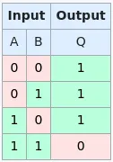
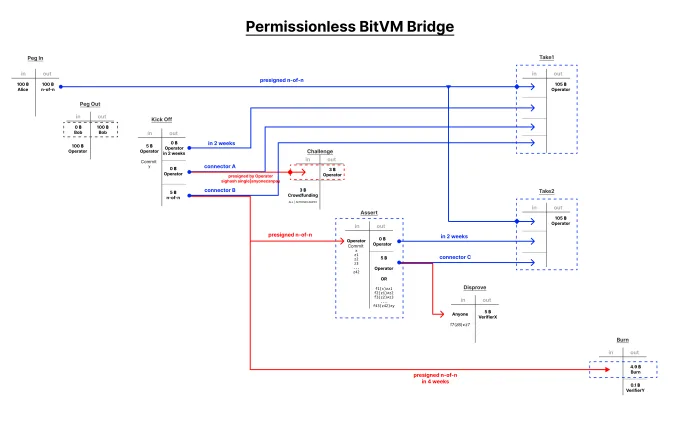

> *作者：SHINOBI*
> 
> *来源：<https://bitcoinmagazine.com/technical/bitvm-2-opening-up-the-playing-field>*

去年 10 月，来自 Zerosync 的 Robin Linus 抛下了一颗名为 “[BitVM](https://bitcoinmagazine.com/technical/the-big-deal-with-bitvm-arbitrary-computation-now-possible-on-bitcoin-without-a-fork)” 的炸弹。

对比特币的最持久的批评就是它不能变成任意程序来控制资金的花费和锁定。比特币的脚本语言只拥有非常局限的可编程性、可用的元件也极为有限。你可以检查一个签名、给某些东西设置一个时间锁、以少数极为简单的方式操作数据，仅此而已。你可以编程一个比特币 UTXO 使之要求一次签名检查、一次时间锁验证，等等。但你没法编程到基于任意我们想要的条件来解锁。

Robin 在 BitVM 中的洞见来自计算领域的一个元件，并且它 *可以* 用比特币脚本来强制执行：“[与非门](https://en.wikipedia.org/wiki/NAND_gate)（NAND gate）”，这是 物理/电路 层面用于计算的基本元件之一。任意的计算都可以用与非门建构出来。

通过使用 OP_BOOLAND 和 OP_NOT，脚本可以实际上验证一个与非门。OP_BOOLAND 是一个 “与（AND）” 操作，与 NAND 正好相反。而 OP_NOT 以二进制的 1 或者 0 数值为输入、输出相反的数值。这两个结合在一起，你就可以在脚本中直接强制执行一个 NAND 操作。再结合哈希锁，与非门脚本可以制作成每个输入和输出字段都有两个可能的哈希锁来 “解锁” 这条花费路径；每个哈希锁都会给堆栈推入一个 1 或者 0 来执行 NAND 操作。每个脚本也都有一个路径，只要你可以同时揭晓决定一个比特值的 *两个* 哈希值的原像，你就可以立即取走所有的资金。这样一来，一旦某人决定了要给一个与非门提供什么样的输入（译者注：准确来说是使用哪个哈希值来决定一个量的比特值），想改变主意就只会损失资金。

## 局限性

BitVM 的主要局限性在于，只有参与创建一个 BitVM 合约的人才能参与其中，而且角色数量是非常有限的。其中一个是证明者，在链下断言计算将如何发生；还有证明者，如果证明者不能在链下完成计算，或者尝试谎报结果，就在链上发起挑战、强制让计算在链上得到证明。

设计 BitVM 的其中一个理由是为比特币建立到侧链或其它系统的双向锚定。而 BitVM 在这个场景中确实提供了一个非常强大的元件：基于一段自定义任意计算的正确性来决定将资金分配给一方或者另一方，即，根据一条侧链规则来检查一笔退出交易是否有效。问题在于，只有在 BitVM UTXO 中有公钥的人才能在有人作弊时吹哨、参与挑战协议。这最终让整个系统依然是需要信任的。

另一个局限性在于，挑战-应答 协议可能要运行很长时间。如果一些人意识到计算的结果会导致他们输钱，他们会停止应答，而验证者将不得不猜测哪一个与非门位于证明者说谎的计算中、证明者将不得不为同一个量的两个哈希值揭晓原像。在链上挑战找出这个门之前，证明者都可以正确应对挑战。这可能相当耗时，也很低效。

自初版提议公开一来，人们对这个设计作了许多优化，以允许系统中存在多个验证者，从而创造一种 1-of-n 的信任模型，即只要有一个验证者是诚实的，就足以击败不诚实的证明者。不过，这需要并行化实现多个 BitVM 实例，因此会让初始的两方设计的低效率变本加厉。

### BitVM 2

Robin 最近提出了一种称为 “[BitVM 2](https://www.bitvm.org/bitvm2)” 的设计方案。这个方案尝试用一些牺牲（相比于初版设计）来换取缓解上述两个重大缺点的好处。BitVM 2 缩短了 挑战-应答 协议的长度，将最坏情况下可能高达数十笔的不确定交易，缩短到只需两轮 挑战-应答。此为，通过使用 “连接器输出（connector output）”，*任何人* 都可以作为验证者（挑战不诚实的证明者），不要求他们是参与建立 BitVM 合约的其中一人。

这里的根本转变是不再直接使用与非门脚本来实现裸的计算跟踪，而是转变成使用它们来实现一个通用的 SNARK 零知识证据验证器（这是 Robin 一开始就打算使用 BitVM 实现的核心元件之一）。不再将裸的输入传进裸的计算踪迹中、用一个又一个位于叶子脚本中的门来运行，BitVM 2 实例的输入将直接是一个零知识证据输入，以及一个对计算输出的断言。

除了使用零知识证明来抽象掉计算，所用的叶子脚本也从一个与非门脚本拓展成 ZKP 验证器一个完整子函数。挑战-应答 协议的基础不再是验证者猜测证明者要在哪一个与非门上说谎（选择性挑战一个门），而是根据输入证明一个完整子函数的输出是无效的。

与 BitVM 1 一样，合约是使用预先签名的交易和分支脚本预先协调过的。进入一个 BitVM 的资金将被发送到一个 n-of-n 的多签名输出中，这个输出有两种可能的 “执行交易”，一种用在没有挑战发生的情形中，另一种用在发生了挑战的情形中。要开始执行合约的流程，证明者先要发起一笔 “启动交易”。这笔启动交易会承诺他们声称计算会得到的结果（输出的数值）`y`；该交易包含三个输出：一个时间锁输出，将包含在没有挑战的执行交易中；一个连接器输出 A，以及一个连接器输出 B，这两个输出也会在无挑战执行交易中花费。

然后就是这个设计允许任何人变身验证者的地方。连接器输出 A 有第二笔预先签名的交易可以花费它，就是有挑战执行交易。这笔预签名交易会给证明者支付一笔比特币保证金，但连接器输出 A 的自身的价值是不够的。任何人，只要加入自己的输入，使得这笔交易有足够高的输入价值，就可以花费连接器输出 A、作废掉给证明者准备的无挑战取款交易（因为该交易的一个输入已不复存在）。

这样就可以强制进入挑战情形。连接器输出 B 也可以用一笔预签名的交易（“断言交易”）来花费；该交易会将资金花费到一个带有该 BitVM 2 合约所有的子函数的交易输出中。这会是一笔携带了大量数据的大体积交易，但不要忘记，证明者声称的最终输出 `y` 已经在启动交易中承诺了。断言交易会创建两个输出。一个是时间锁输出，另一个是连接器输出 C。这两个输出，以及最初的进入 BitVM 的资金，都会在第二种执行交易 —— 有挑战执行交易 —— 中允许证明者取走资金（在时间锁过期之后）。

连接器输出 C 也可以被任何可以证明该 BitVM 2 合约的任一子输出并不产生证明者所声称结果的人花费。这也需要一笔非常大的交易，因为证明 BitVM 没有被正确运行所需的脚本是非常大的，但在这一笔交易中，验证者可以用一个有效的证据来拿走连接器输出中的钱。一旦这事发生，第二笔执行交易就作废了，这笔锁定在 BitVM 2 合约中的资金就犹如烧掉了一般。到了这一步，挽救这些资金的唯一方法是锁定交易输出（那个 n-of-n 多签名输出）中的证明者和 *所有* 验证者合作（如果在启动仪式中，参与者需要删除密钥，那么这种复原方法也将不复存在）。启动交易中的连接器输出也可以在（比无挑战执行交易）更长的时间锁解锁之后花费，这会作废掉无挑战执行交易和断言交易，将资金烧掉。

这将原版 BitVM 提议中为强制执行正确结果而可能需要的长到离谱的交易链条降低到最多只需要 4 笔交易（虽然不可否认，变成了非常大体积的交易），而且，在 BitVM 2 实例的运行中，让每个拥有足够自己的人都可以为挑战交易注资。

BitVM 2 可能会在这一波致力于使用 BitVM 作为双向锚定机制的 rollup 和其它 layer 2 的浪潮中成为重大突破。一个 rollup 系统的运行者（BitVM 中的证明者）可以使用自有资金来供给用户取款，同时周期性地从 BitVM 合约中取出锁定的资金以补偿自己。*任何* 用户或者有利益的参与者，都可以在能够证明运营者并未正确处理所有取款的时候惩罚运营者、烧掉属于运营者的资金。

需要指出的是，一个 BitVM2 实例的安全性是由那 n-of-n 个密钥持有者支撑的，虽然不参与其中的人也可以挑战证明者。但因为证明者在没有挑战的情形中有一种高效的退出手段、任何可以为挑战交易提供自己的人都可以作为验证者，所以 n-of-n 的多签名输出可以参照类似于 Zcash 启动仪式的做法，通过删除密钥来提高安全性。

BitVM2 可能会在提升双向锚定的灵活性和信任模型上成为重大突破。又一次，Robin 证明了自己是真正的巫师。

（完）