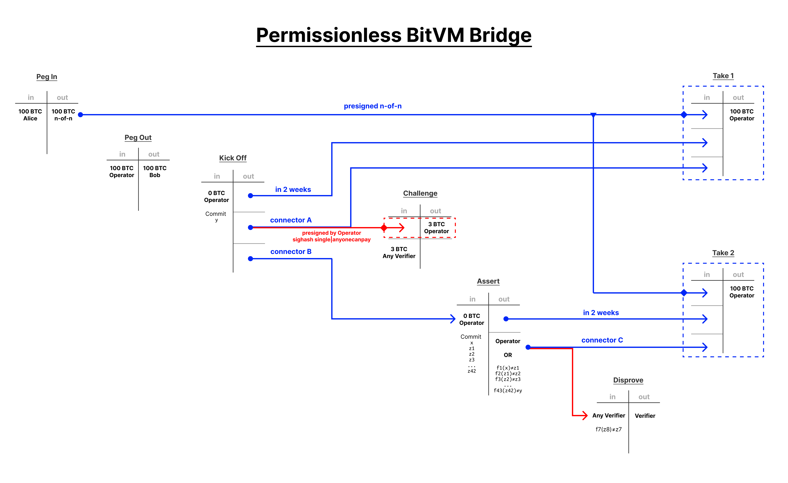
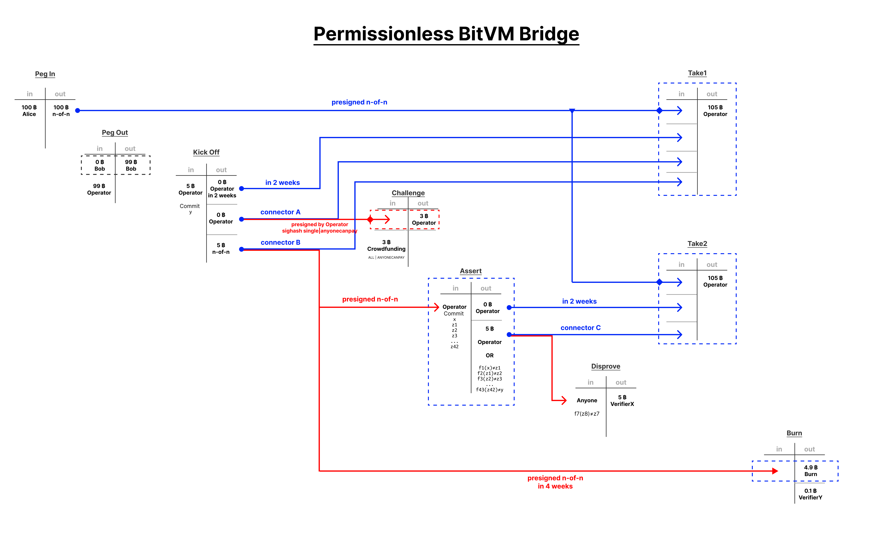

> *作者：Robin Linus*
> 
> *来源：<https://bitvm.org/bitvm2.html>*


初版 BitVM 的设计局限在两个参与者。后续的工作结合了并行以及冗余的实例，以引入基于 1-of-n 诚实假设的多方参与。这些合约的主要局限在于所有验证者都必须在编译时定义好。而且，启动开销会随着验证数量的增加而增加。这暗示着，想要打破一个合约，永远只需贿赂有限数量的参与者。

BitVM2 是一个大胆的变种：任何人都可以作为验证者。这依然需要带有 1-of-n 诚实参与者假设的一次性装置，但在运行时，任何人都可以挑战一个无效的断言，不需要具备初始化团体成员的身份（不需要是那 n 个参与者之一）。这克服了以往方案的局限性，并优化了它们的信任假设。而且，它还简化了整体设计，将审判的最长轮次降低到两轮。

桥接合约（bridge）依然额外要求一些预先定义的操作员集合，并且 `m`  个操作员中至少要有一个是诚实的。不过，即使在所有操作员都不诚实的情况下，他们也无法偷走你的钱，最多只能烧掉这些钱。

## 引言

对于一个给定的程序 `f`，我们希望验证一些断言：输入一些 `x`，会输出 `y`，也即 `f(x) = y`。举个例子，`f` 可以是一个 [SNARK 验证器](https://bitvm.org/snark)，比如 Groth16 证明系统的验证器。那么 `x` 就是一个证据，而 `y` 就是一些 SNARK 证明了有效性的输出状态（output state）。

在 SNARK 验证器这样的例子中，程度太大，无法用一段比特币脚本来表示它。实现一个 Groth16 验证器可能需要体积高达 20 MB 的脚本。但是，可允许的脚本体积的上限是比特币区块体积的上限：4 MB。而就算压缩到这个体积，可能依然过于庞大了。

## 幼稚的解决方案

“Lamport 签名” 提供了一种办法，将一个程序 `f(x) = y` 分割成多个步骤。比如步骤 `n =42`：

```
f1(x)  = z1
f2(z1) = z2
f3(z2) = z3
...
f42(z41) = z42
f43(z42) = y
```

这样一来，`f` 的计算就可以分切成有顺序的 43 笔交易， 在多个区块中执行。每一笔交易都以上一笔交易的输出状态作为自己的输入状态。但凡证明者在任何一个状态 `z_i` 上含糊其辞，每个人都可以使用相冲突的 Lamport 签名作为一个欺诈证据。

这确实是一种挑战证明者的免信任办法。但是，这种解决方案的重大局限在于其密集的链上足迹，因为它依然要求证明者执行整个计算。此外，同样因为 Lamport 签名，它引入了转换状态的开销。

## 平衡式解决方案

我们可以将一些重度工作从证明者一方转移给验证者的欺诈证据，从而显著减少链上足迹。现在，证明者只需一次性承诺 `x`  和 `y`，以及所有中间结果 `z1, z2, ... , z42`。

任何验证者都可以证否任何错误的断言。在启动阶段，我们定义一棵 Taptree，包含了 43 个脚本，以证否 `f1, f2, f3, ..., f43` 任何一段计算。只要一个断言

```
f_i( z_(i-1) ) == z_i
```

不能成立，任何人都可以从对应的脚本中花费。这就将最差情况下的计算量降低到了一步 `f_i`，由验证者执行。这一步可能依然需要可观体积的 Script 实现。理论上，只要它能塞进一个区块，就没有太大问题，或者更好一些，可以实现 400 KB 的标准化体积。在实践中，对一些具体的 `f` 实现，我们会尝试在证明者的承诺体积和验证者的脚本体积之间找出一个最优的平衡。

本质上，这允许任何人毁灭证明者的输出，只要证明者作出了任何不正确的断言。不然的话，如果没有人能证否任何一段计算，那么，到脚本超时的时候，诚实的证明者就能花费这个输出。最多只需要两轮。

这个机制可以作为桥接合约免许可验证的基本构筑模块。

## 乐观解决方案

下列协议提升了上述设计中的皆大欢喜路径（有希望是最常用路径），代价是在最差情况下增加了两轮交互：

1. 证明者承诺输出状态 `y`
2. 如果不正确，任何人可以开启一轮挑战
3. 证明者承诺中间结果 `z1, z2, ... z42`
4. 如果不正确，任何人都可以证否断言 `f_i` 

 ### 免许可的桥接合约设计



（如欲放大，请鼠标右键点击图片，选择 “在新标签页中打开”）

### 局限性：手续费

在上述设计中，证明者可以偷取一些手续费。在这种情况下，资金储备依然是安全的，只不过验证者会失去一些担保资金。

攻击场景如下：

- 证明者是恶意的
- 证明使用自己的 KickOff_Tx（不具备有效的 PegOut_Tx）
- 证明者等待一个挑战者执行 Challenge_TX，为执行挑战的证明者支付
- 证明者不执行挑战，直接停止响应

下面这幅修正后的图解决了这个问题。需要多两笔 n-of-n 的预签名交易。



### 局限性：诚实操作员

这个设计要求至少以为操作员是诚实的，否则资金最终会变成不可花费的。在现实中，活性故障可以搭配绑票攻击来盗窃资金（例如：除非你给我支付 50% 的赎金，否则你的资金就别想解锁。）