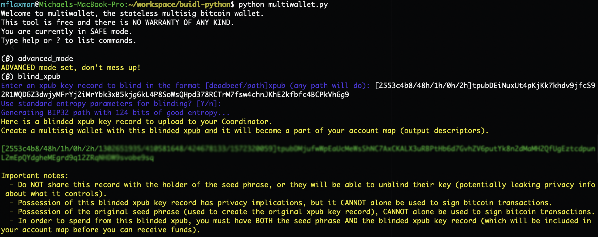
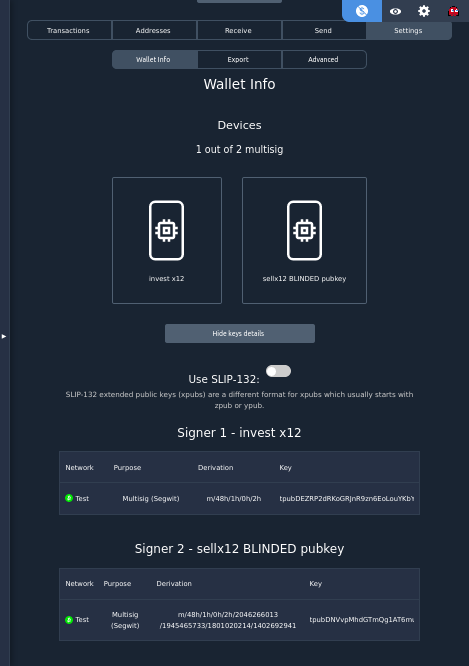
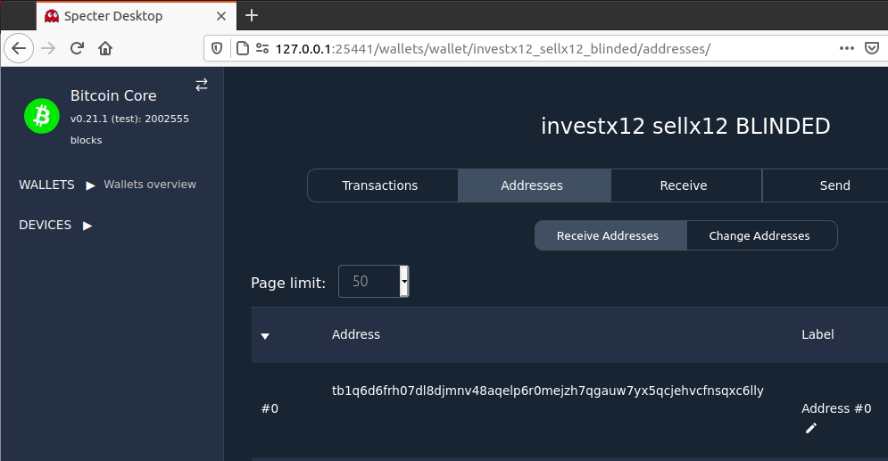
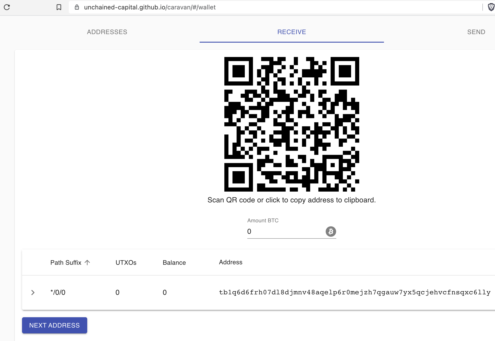
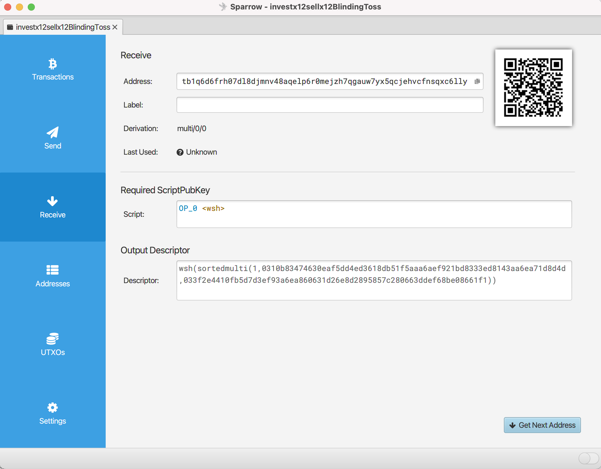
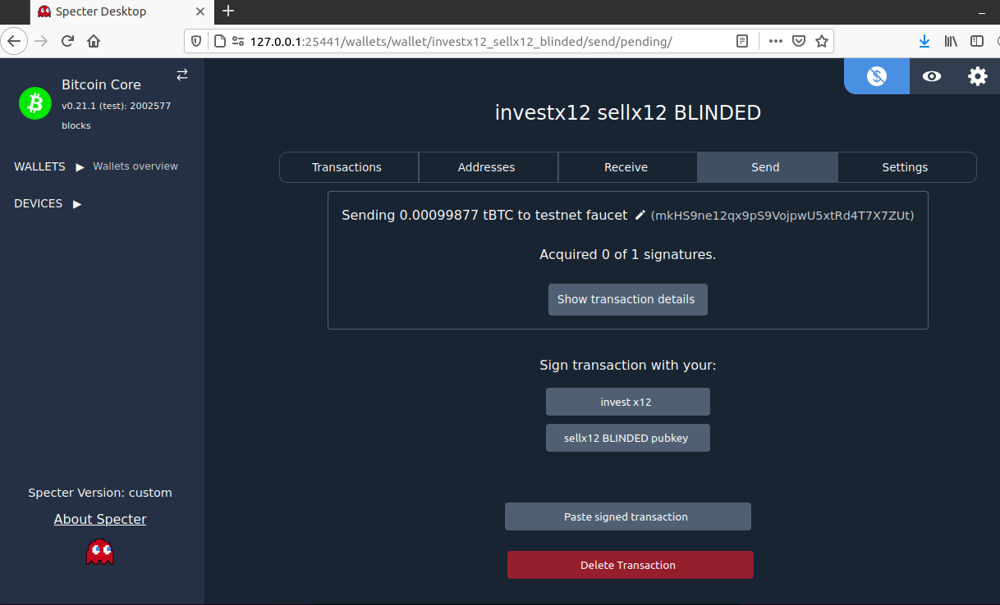
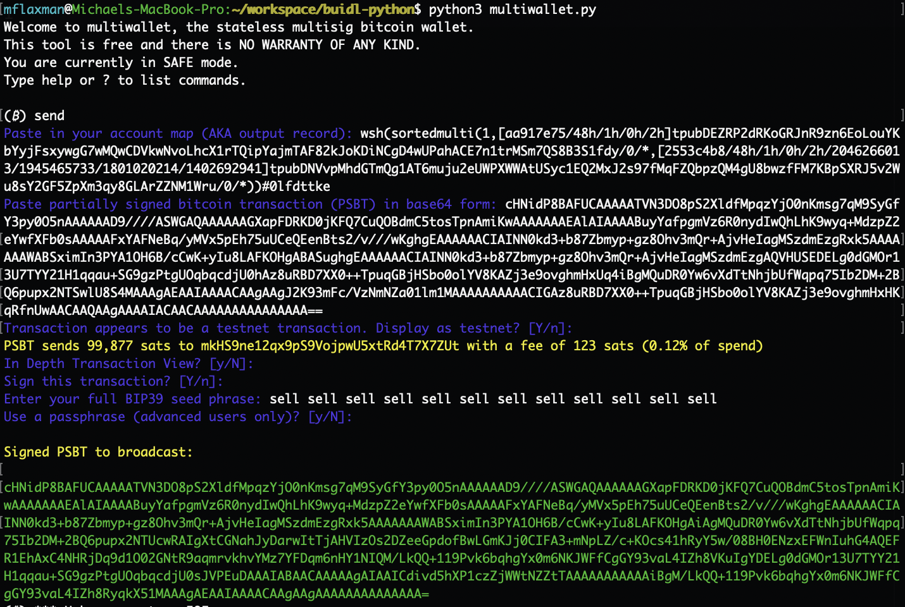
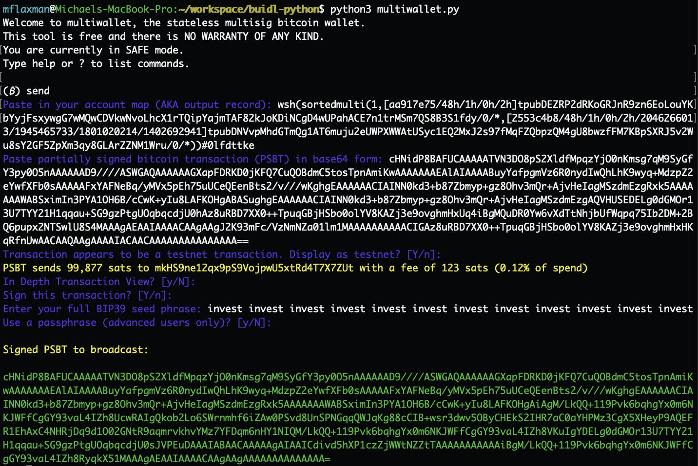

> *作者：mflaxman*
> 
> *来源：<https://github.com/mflaxman/blind-xpub/blob/main/README.md>*


## 引言

比特币的多签名安全模式是人类自主保管能力上的重大突破。相比之下，你不可能用 `3-of-5` 装置来保护你的黄金。多签名保管的采用有望减少比特币世界里的 黑客爆破/失盗/丢失，因为保管者可以犯下 1 个（甚至更多）致命性的错误而不会置资金于风险之中。

然而，当前的多签名装置却也引来一个令人痛苦的新问题：使用 `m-of-n` 装置（比如 `2-of-3`） 来保护你的资金 ，意味着你有 `n` 个种子词，每一个都会让你的隐私置于风险之中。

### 隐私泄露

标准/默认的 BIP32 派生路径的用法，使得如果坏人拿到了你的 BIP39 种子词，他们就可以扫描区块链上的交易输入的 见证/赎回 脚本，从而知晓这个种子词保护过哪些资金。举个例子，他们有可能知晓这些信息：

-  这个被盗的种子词是昨天转移的一笔大额比特币资金的保管装置的一部分。注意，即使这个种子词并未在交易中提供签名、只是安静地躺在冷存储媒介中，也依然会暴露。（译者注：这是因为 P2SH/P2WSH 在花费时会让整个脚本完全暴露，因此装置中的公钥会全部暴露。Taproot 可以缓解这种情形。）
- 这笔交易似乎将一大笔找零转回给了自己，所以这个种子可能还在用于保护（至少）这么多的比特币。
- 这笔交易的输入是 `2-of-3` 的 `P2WSH`，所以只需要再找出 1 个种子词（以及相关的输出描述符），就可以花费这个装置所保管的资金。
- 这个钱包在当地时间每个星期五的下午 4 点都会发起类似的交易。

尽管隐私泄露的结果不能直接用来抢劫，这些信息依然可以用在其它不法用途中：

- 执法机构可以传唤银行，要求打开保险柜、检查里面有没有 BIP39 种子词（例如刻在金属板上）。
- 联合保管人（例如，律师、审计员、继承人、密友、“爷叔”、联合保管服务商，等等）可以知道你的储蓄金额，而且可能泄露这些信息（因为被黑客攻击、商业决策，或被执法打击）。
- 心急的继承人可能迫不及待想继承财产。

### 解决方案

在这个方案中，我们会演示使用一个大且随机生成的 BIP32 路径，来遮掩（“盲化”）多签名装置中的一个 BIP39 种子词（更具体来说，是其对应的 “拓展公钥（xpub）”）。如果坏人在你不知情时拿到了这个 BIP39 种子词（及其密语（passphrase），如果有的话），对于该种子到底用在了哪里，他们将 *一无所知*。这个方案也让 1 个（乃至多个）准-受信任的联合保管人可以保管你的多签名装置中的一个紧急复原密钥，而 *无法* 知晓这个装置到底在保护哪一笔资金；这就使我们更为容易地实现密钥在空间、司法辖区 以及/或者 组织的分散性。

这个方案在当前的比特币主网上已经可用了，也兼容现有的多签名硬件签名器和用作协调器的软件（见下文的 “兼容性” 一节），而且对隐私性、钱包复原、联合保管人的信任最小化都有正向作用。

## 流程

在这个样品中，我们将使用 [Specter-Desktop](https://github.com/cryptoadvance/specter-desktop/)（以 Bitcoin Core 为支持），因为绝大多数新的自主保管的多签名用户都使用它。对任何支持新一代多签名标准（[输出描述符](https://github.com/bitcoin/bitcoin/blob/master/doc/descriptors.md)和 [PSBT](https://github.com/bitcoin/bips/blob/master/bip-0174.mediawiki)）的协调器软件来说，应该都是可以开箱即用的。我们也将代码复制到了 [buidl](https://github.com/buidl-bitcoin/buidl-python)，因为它是一个无依赖的 FOSS 比特币实现，为了这个盲化协议的每一步都提供了完整的支持。为了简洁，我们仅仅遮掩一个 `1-of-2` 装置中的 1 个种子词，但应该容易看出，扩展到 `2-of-3`、`3-of-5` 乃至更大的装置也不会是什么问题。最后，我们会讨论盲化所有 `n` 个种子词将带来的影响。

### 启动 Buidl 以验证（非必要）

最简单的安装和测试其正常工作的方法：

```
$ pip3 install buidl && python3
>>> from buidl import *
```

**更安全的方法**

因为 `buidl` 没有依赖，而且是为了 “隔空交互（air-gap）” 体验而设计的， 你并不真的需要安装它：
```
$ git clone https://github.com/buidl-bitcoin/buidl-python.git && cd buidl-python && python3
>>> from buidl import *
```

这些验证步骤可以用其它的开源库来执行，所以在下文我也会提到它们。

### 生成 2 个种子词

假设种子 A 是由我（生成并）持有的，而种子 B 是由一个信任最小化的第三方（生成并）持有的（这样的第三方可能是：律师、审计员、继承人、密友、“爷叔”、联合保管服务商，等等），仅仅用在紧急复原中。

**生成种子 A**

```
BIP39 Seed Phrase (invest repeated 12x):
invest invest invest invest invest invest invest invest invest invest invest invest

Public Key Record (from hardware wallet):
[aa917e75/48h/1h/0h/2h]tpubDEZRP2dRKoGRJnR9zn6EoLouYKbYyjFsxywgG7wMQwCDVkwNvoLhcX1rTQipYajmTAF82kJoKDiNCgD4wUPahACE7n1trMSm7QS8B3S1fdy
```

**生成种子 B**

```
BIP39 Seed Phrase (sell repeated x12):
sell sell sell sell sell sell sell sell sell sell sell sell

Public Key Record (from hardware wallet):
[2553c4b8/48h/1h/0h/2h]tpubDEiNuxUt4pKjKk7khdv9jfcS92R1WQD6Z3dwjyMFrYj2iMrYbk3xB5kjg6kL4P8SoWsQHpd378RCTrM7fsw4chnJKhE2kfbfc4BCPkVh6g9
```

**用 buidl 验证**

可以在 buidl 中生成，如下：

```
$ python3
>>> from buidl.hd import HDPrivateKey
>>> HDPrivateKey.from_mnemonic("invest " * 12, network="testnet").generate_p2wsh_key_record()
'[aa917e75/48h/1h/0h/2h]tpubDEZRP2dRKoGRJnR9zn6EoLouYKbYyjFsxywgG7wMQwCDVkwNvoLhcX1rTQipYajmTAF82kJoKDiNCgD4wUPahACE7n1trMSm7QS8B3S1fdy'
>>> HDPrivateKey.from_mnemonic("sell " * 12, network="testnet").generate_p2wsh_key_record()
'[2553c4b8/48h/1h/0h/2h]tpubDEiNuxUt4pKjKk7khdv9jfcS92R1WQD6Z3dwjyMFrYj2iMrYbk3xB5kjg6kL4P8SoWsQHpd378RCTrM7fsw4chnJKhE2kfbfc4BCPkVh6g9'
```

我们忽略 <a href="https://github.com/satoshilabs/slips/blob/master/slip-0132.md">SLIP132</a> 版本字节编码，但如果你的协调器软件需要它，那就向 <code>generate_p2wsh_key_record()</code> 传入 <code>use_slip132_version_byte=True</code> 或使用 <a href="https://jlopp.github.io/xpub-converter/">Jameson Lopp 的便利 xpub 转换器</a>。

如果你一头雾水，让我来告诉你，它们都是[有效的种子词](https://twitter.com/mflaxman/status/1386833296668102659)（虽然是非常不安全的）。

### 盲化 1 个种子词

请记住，种子词 B 是由我们的信任最小化第三方持有的。

我们使用 `buidl` 内置的 [multiwallet.py](https://twitter.com/mflaxman/status/1321503036724989952) 来盲化种子 B 的 xpub。对 4 层的 BIP32 路径，我们在每一层中都使用默认的熵设定，也就是说，`(2^31)^4 ≈ 124 bits`。这会让暴力搜索（brute-forcing）变得不可能。



<strong>文字版本</strong>

以下是运行该工具的完整文本，只是，它跟上图不是完全对应的：

```
$ python3 multiwallet.py 
Welcome to multiwallet, the stateless multisig bitcoin wallet.
This tool is free and there is NO WARRANTY OF ANY KIND.
You are currently in SAFE mode.
Type help or ? to list commands.

(₿) advanced_mode
ADVANCED mode set, don't mess up!
(₿) blind_xpub
Enter an xpub key record to blind in the format [deadbeef/path]xpub (any path will do): [2553c4b8/48h/1h/0h/2h]tpubDEiNuxUt4pKjKk7khdv9jfcS92R1WQD6Z3dwjyMFrYj2iMrYbk3xB5kjg6kL4P8SoWsQHpd378RCTrM7fsw4chnJKhE2kfbfc4BCPkVh6g9
Use standard entropy parameters for blinding? [Y/n]: 
Generating BIP32 path with 124 bits of good entropy...
Here is a blinded xpub key record to upload to your Coordinator.
Create a multisig wallet with this blinded xpub and it will become a part of your account map (output descriptors).

[2553c4b8/48h/1h/0h/2h/2046266013/1945465733/1801020214/1402692941]tpubDNVvpMhdGTmQg1AT6muju2eUWPXWWAtUSyc1EQ2MxJ2s97fMqFZQbpzQM4gU8bwzfFM7KBpSXRJ5v2Wu8sY2GF5ZpXm3qy8GLArZZNM1Wru

Important notes:
  - Do NOT share this record with the holder of the seed phrase, or they will be able to unblind their key (potentially leaking privacy info about what it controls).
  - Possession of this blinded xpub key record has privacy implications, but it CANNOT alone be used to sign bitcoin transactions.
  - Possession of the original seed phrase (used to create the original xpub key record), CANNOT alone be used to sign bitcoin transactions.
  - In order to spend from this blinded xpub, you must have BOTH the seed phrase AND the blinded xpub key record (which will be included in your account map before you can receive funds).
```

<strong>Ian Coleman BIP39 验证</strong>

你可以在一台隔空交互的电脑熵使用 <a href="https://iancoleman.io/bip39/">Ian Coleman 的开源工具</a>来验证它的正确性。


### 创建输出描述符

在我们这个案例中，我们取得常规的种子词 A 的 xpub，以及我们刚刚计算出来的盲化的种子词 B 的 xpub，（通过 Specter-Desktop）使用 Bitcoin Core 结合成一个 `1-of-2 p2wsh sortedmulti` 输出描述符：



这也可以生成 [pdf](https://github.com/mflaxman/blind-xpub/blob/main/investx12_sellx12_blinded_backup.pdf)、[json](https://github.com/mflaxman/blind-xpub/blob/main/investx12_sellx12BLINDED.json) 乃至 [QR 码](https://github.com/mflaxman/blind-xpub/blob/main/account_map.png)形式的输出描述符备份。

**用 buidl 验证**

我们在 python 中运行如下代码：

```
from buidl.descriptor import P2WSHSortedMulti

quorum_m = 1
key_records = [
    {
        # investx12 - regular path
        "xfp": "aa917e75",
        "path": "m/48h/1h/0h/2h",
        "xpub_parent": "tpubDEZRP2dRKoGRJnR9zn6EoLouYKbYyjFsxywgG7wMQwCDVkwNvoLhcX1rTQipYajmTAF82kJoKDiNCgD4wUPahACE7n1trMSm7QS8B3S1fdy",
        "account_index": 0,
    },
    {
        # sellx12 - BLINDED path
        "xfp": "2553c4b8",
        "path": "m/48h/1h/0h/2h/2046266013/1945465733/1801020214/1402692941",
        "xpub_parent": "tpubDNVvpMhdGTmQg1AT6muju2eUWPXWWAtUSyc1EQ2MxJ2s97fMqFZQbpzQM4gU8bwzfFM7KBpSXRJ5v2Wu8sY2GF5ZpXm3qy8GLArZZNM1Wru",
        "account_index": 0,
    },
]
p2wsh_sortedmulti_obj = P2WSHSortedMulti(quorum_m, key_records)
print(p2wsh_sortedmulti_obj)
```

### 获取收款地址

**Specter-Desktop**

（通过 Specter-Desktop）Bitcoin Core 提供了如下地址：



**用 buidl 验证**

```
>>> p2wsh_sortedmulti_obj.get_address(0)
'tb1q6d6frh07dl8djmnv48aqelp6r0mejzh7qgauw7yx5qcjehvcfnsqxc6lly'
```

**用 Caravan 验证**

你可以在 [Caravan](https://unchained-capital.github.io/caravan/) 中使用[这个钱包配置文件](https://github.com/mflaxman/blind-xpub/blob/main/bitcoin-1-of-2-P2WSH-testing.json)生成观察地址（这个配置文件是从上面生成的输出描述符中推导出来的）：



**Sparrow 验证**

你可以在 [Sparrow](https://sparrowwallet.com/) 钱包中使用这个输出描述符（就是 `wsh(sortedmulti(` 开头的字符串，见上文的 “创建输出描述符” 一节）创建观察地址：

 

**接收比特币**

使用一个测试网水龙头，我们向这个地址发送了一些 tBTC：https://blockstream.info/testnet/tx/67eed0727a639f214b3da3ee206b2a27ed8cd8aca6ccd795972da5bc33dc4d35

### 签名交易

为了从这个多签名装置中花费资金，以下两个条件 *都要* 满足：

1. 持有其中一个种子词 —— 种子 A 或种子 B
2. 知晓完整的输出描述符 —— 这个描述符介绍了用在这个多签名钱包中的**所有**种子，即使当前并未使用某个种子来签名某笔交易

我们将把资金打回测试网水龙头地址：`mkHS9ne12qx9pS9VojpwU5xtRd4T7X7ZUt` 。

**准备交易**

（通过 Specter-Desktop）Bitcoin Core 可以创建一个待签名的 PSBT 来清扫资金：



它所现显示的交易的对应 PSBT 是（用于隔空交互设备的图片版本可见[此处](https://github.com/mflaxman/blind-xpub/blob/main/psbt.png)）：

```
cHNidP8BAFUCAAAAATVN3DO8pS2XldfMpqzYjO0nKmsg7qM9SyGfY3py0O5nAAAAAAD9////ASWGAQAAAAAAGXapFDRKD0jKFQ7CuQOBdmC5tosTpnAmiKwAAAAAAAEAlAIAAAABuyYafpgmVz6R0nydIwQhLhK9wyq+MdzpZ2eYwfXFb0sAAAAAFxYAFNeBq/yMVx5pEh75uUCeQEenBts2/v///wKghgEAAAAAACIAINN0kd3+b87Zbmyp+gz8Ohv3mQr+AjvHeIagMSzdmEzgRxk5AAAAAAAWABSximIn3PYA1OH6B/cCwK+yIu8LAFKOHgABASughgEAAAAAACIAINN0kd3+b87Zbmyp+gz8Ohv3mQr+AjvHeIagMSzdmEzgAQVHUSEDELg0dGMOr13U7TYY21H1qqau+SG9gzPtgUOqbqcdjU0hAz8uRBD7XX0++TpuqGBjHSbo0olYV8KAZj3e9ovghmHxUq4iBgMQuDR0Yw6vXdTtNhjbUfWqpq75Ib2DM+2BQ6pupx2NTSwlU8S4MAAAgAEAAIAAAACAAgAAgJ2K93mFc/VzNmNZa01lm1MAAAAAAAAAACIGAz8uRBD7XX0++TpuqGBjHSbo0olYV8KAZj3e9ovghmHxHKqRfnUwAACAAQAAgAAAAIACAACAAAAAAAAAAAAAAA==
```

**使用盲化密钥来签名**

这可以在 Specter-DIY 上执行，也可以使用任何其它原生基于 PSBT、不限制用户使用哪个 BIP32 路径的硬件签名器：



**文字版本**

```
$ python3 multiwallet.py 
Welcome to multiwallet, the stateless multisig bitcoin wallet.
This tool is free and there is NO WARRANTY OF ANY KIND.
You are currently in SAFE mode.
Type help or ? to list commands.

(₿) send
Paste in your account map (AKA output record): wsh(sortedmulti(1,[aa917e75/48h/1h/0h/2h]tpubDEZRP2dRKoGRJnR9zn6EoLouYKbYyjFsxywgG7wMQwCDVkwNvoLhcX1rTQipYajmTAF82kJoKDiNCgD4wUPahACE7n1trMSm7QS8B3S1fdy/0/*,[2553c4b8/48h/1h/0h/2h/2046266013/1945465733/1801020214/1402692941]tpubDNVvpMhdGTmQg1AT6muju2eUWPXWWAtUSyc1EQ2MxJ2s97fMqFZQbpzQM4gU8bwzfFM7KBpSXRJ5v2Wu8sY2GF5ZpXm3qy8GLArZZNM1Wru/0/*))#0lfdttke
Paste partially signed bitcoin transaction (PSBT) in base64 form: cHNidP8BAFUCAAAAATVN3DO8pS2XldfMpqzYjO0nKmsg7qM9SyGfY3py0O5nAAAAAAD9////ASWGAQAAAAAAGXapFDRKD0jKFQ7CuQOBdmC5tosTpnAmiKwAAAAAAAEAlAIAAAABuyYafpgmVz6R0nydIwQhLhK9wyq+MdzpZ2eYwfXFb0sAAAAAFxYAFNeBq/yMVx5pEh75uUCeQEenBts2/v///wKghgEAAAAAACIAINN0kd3+b87Zbmyp+gz8Ohv3mQr+AjvHeIagMSzdmEzgRxk5AAAAAAAWABSximIn3PYA1OH6B/cCwK+yIu8LAFKOHgABASughgEAAAAAACIAINN0kd3+b87Zbmyp+gz8Ohv3mQr+AjvHeIagMSzdmEzgAQVHUSEDELg0dGMOr13U7TYY21H1qqau+SG9gzPtgUOqbqcdjU0hAz8uRBD7XX0++TpuqGBjHSbo0olYV8KAZj3e9ovghmHxUq4iBgMQuDR0Yw6vXdTtNhjbUfWqpq75Ib2DM+2BQ6pupx2NTSwlU8S4MAAAgAEAAIAAAACAAgAAgJ2K93mFc/VzNmNZa01lm1MAAAAAAAAAACIGAz8uRBD7XX0++TpuqGBjHSbo0olYV8KAZj3e9ovghmHxHKqRfnUwAACAAQAAgAAAAIACAACAAAAAAAAAAAAAAA==
Transaction appears to be a testnet transaction. Display as testnet? [Y/n]: 
PSBT sends 99,877 sats to mkHS9ne12qx9pS9VojpwU5xtRd4T7X7ZUt with a fee of 123 sats (0.12% of spend)
In Depth Transaction View? [y/N]: 
Sign this transaction? [Y/n]: 
Enter your full BIP39 seed phrase: sell sell sell sell sell sell sell sell sell sell sell sell
Use a passphrase (advanced users only)? [y/N]: 

Signed PSBT to broadcast:

cHNidP8BAFUCAAAAATVN3DO8pS2XldfMpqzYjO0nKmsg7qM9SyGfY3py0O5nAAAAAAD9////ASWGAQAAAAAAGXapFDRKD0jKFQ7CuQOBdmC5tosTpnAmiKwAAAAAAAEAlAIAAAABuyYafpgmVz6R0nydIwQhLhK9wyq+MdzpZ2eYwfXFb0sAAAAAFxYAFNeBq/yMVx5pEh75uUCeQEenBts2/v///wKghgEAAAAAACIAINN0kd3+b87Zbmyp+gz8Ohv3mQr+AjvHeIagMSzdmEzgRxk5AAAAAAAWABSximIn3PYA1OH6B/cCwK+yIu8LAFKOHgAiAgMQuDR0Yw6vXdTtNhjbUfWqpq75Ib2DM+2BQ6pupx2NTUcwRAIgXtCGNahJyDarwItTjAHVIzOs2DZeeGpdofBwLGmKJj0CIFA3+mNpLZ/c+KOcs41hRyY5w/08BH0ENzxEFWnIuhG4AQEFR1EhAxC4NHRjDq9d1O02GNtR9aqmrvkhvYMz7YFDqm6nHY1NIQM/LkQQ+119Pvk6bqhgYx0m6NKJWFfCgGY93vaL4IZh8VKuIgYDELg0dGMOr13U7TYY21H1qqau+SG9gzPtgUOqbqcdjU0sJVPEuDAAAIABAACAAAAAgAIAAICdivd5hXP1czZjWWtNZZtTAAAAAAAAAAAiBgM/LkQQ+119Pvk6bqhgYx0m6NKJWFfCgGY93vaL4IZh8RyqkX51MAAAgAEAAIAAAACAAgAAgAAAAAAAAAAAAAA=
```

然后这笔交易就广播到了测试网区块链上：https://blockstream.info/testnet/tx/1ae50b064c72ab0d71207693814519016755a89444f3d42ea4d32dad3b307536

**使用常规密钥来签名**

这个密钥使用了标准路径，所以我们就用 `multiwallet.py` 快速过一下。你可以使用任何兼容性良好的硬件签名器来签名。



**文字版本**

```
$ python3 multiwallet.py 
Welcome to multiwallet, the stateless multisig bitcoin wallet.
This tool is free and there is NO WARRANTY OF ANY KIND.
You are currently in SAFE mode.
Type help or ? to list commands.

(₿) send
Paste in your account map (AKA output record): wsh(sortedmulti(1,[aa917e75/48h/1h/0h/2h]tpubDEZRP2dRKoGRJnR9zn6EoLouYKbYyjFsxywgG7wMQwCDVkwNvoLhcX1rTQipYajmTAF82kJoKDiNCgD4wUPahACE7n1trMSm7QS8B3S1fdy/0/*,[2553c4b8/48h/1h/0h/2h/2046266013/1945465733/1801020214/1402692941]tpubDNVvpMhdGTmQg1AT6muju2eUWPXWWAtUSyc1EQ2MxJ2s97fMqFZQbpzQM4gU8bwzfFM7KBpSXRJ5v2Wu8sY2GF5ZpXm3qy8GLArZZNM1Wru/0/*))#0lfdttke
Paste partially signed bitcoin transaction (PSBT) in base64 form: cHNidP8BAFUCAAAAATVN3DO8pS2XldfMpqzYjO0nKmsg7qM9SyGfY3py0O5nAAAAAAD9////ASWGAQAAAAAAGXapFDRKD0jKFQ7CuQOBdmC5tosTpnAmiKwAAAAAAAEAlAIAAAABuyYafpgmVz6R0nydIwQhLhK9wyq+MdzpZ2eYwfXFb0sAAAAAFxYAFNeBq/yMVx5pEh75uUCeQEenBts2/v///wKghgEAAAAAACIAINN0kd3+b87Zbmyp+gz8Ohv3mQr+AjvHeIagMSzdmEzgRxk5AAAAAAAWABSximIn3PYA1OH6B/cCwK+yIu8LAFKOHgABASughgEAAAAAACIAINN0kd3+b87Zbmyp+gz8Ohv3mQr+AjvHeIagMSzdmEzgAQVHUSEDELg0dGMOr13U7TYY21H1qqau+SG9gzPtgUOqbqcdjU0hAz8uRBD7XX0++TpuqGBjHSbo0olYV8KAZj3e9ovghmHxUq4iBgMQuDR0Yw6vXdTtNhjbUfWqpq75Ib2DM+2BQ6pupx2NTSwlU8S4MAAAgAEAAIAAAACAAgAAgJ2K93mFc/VzNmNZa01lm1MAAAAAAAAAACIGAz8uRBD7XX0++TpuqGBjHSbo0olYV8KAZj3e9ovghmHxHKqRfnUwAACAAQAAgAAAAIACAACAAAAAAAAAAAAAAA==
Transaction appears to be a testnet transaction. Display as testnet? [Y/n]: 
PSBT sends 99,877 sats to mkHS9ne12qx9pS9VojpwU5xtRd4T7X7ZUt with a fee of 123 sats (0.12% of spend)
In Depth Transaction View? [y/N]: 
Sign this transaction? [Y/n]: 
Enter your full BIP39 seed phrase: invest invest invest invest invest invest invest invest invest invest invest invest
Use a passphrase (advanced users only)? [y/N]: 

Signed PSBT to broadcast:

cHNidP8BAFUCAAAAATVN3DO8pS2XldfMpqzYjO0nKmsg7qM9SyGfY3py0O5nAAAAAAD9////ASWGAQAAAAAAGXapFDRKD0jKFQ7CuQOBdmC5tosTpnAmiKwAAAAAAAEAlAIAAAABuyYafpgmVz6R0nydIwQhLhK9wyq+MdzpZ2eYwfXFb0sAAAAAFxYAFNeBq/yMVx5pEh75uUCeQEenBts2/v///wKghgEAAAAAACIAINN0kd3+b87Zbmyp+gz8Ohv3mQr+AjvHeIagMSzdmEzgRxk5AAAAAAAWABSximIn3PYA1OH6B/cCwK+yIu8LAFKOHgAiAgM/LkQQ+119Pvk6bqhgYx0m6NKJWFfCgGY93vaL4IZh8UcwRAIgQkob2Lo6SWrnmhf6iZAw0PSvd8UnSPNGqqQWJqKg88cCIB+wsr3dwv5OByCHEkS2IHR7aC0aYHPMz3CgX5XHeyP9AQEFR1EhAxC4NHRjDq9d1O02GNtR9aqmrvkhvYMz7YFDqm6nHY1NIQM/LkQQ+119Pvk6bqhgYx0m6NKJWFfCgGY93vaL4IZh8VKuIgYDELg0dGMOr13U7TYY21H1qqau+SG9gzPtgUOqbqcdjU0sJVPEuDAAAIABAACAAAAAgAIAAICdivd5hXP1czZjWWtNZZtTAAAAAAAAAAAiBgM/LkQQ+119Pvk6bqhgYx0m6NKJWFfCgGY93vaL4IZh8RyqkX51MAAAgAEAAIAAAACAAgAAgAAAAAAAAAAAAAA=
```

## 我们实现了什么

从种子的生成一直到揭晓（使用秘密 BIP32 路径的）输出描述符，种子 B 的持有者都无法知晓自己的公钥保护了什么：

- 交易历史（包括任何花费过的 UTXO）和余额
- 阈值信息（在这里是 `1-of-2` ）

即使这个种子的持有者是恶意的（或者被执法机构扫荡了），也无法揭晓 *任何* 私人信息。而且，因为这是建立在现有的 BIP32 路径标准上的，所以 *已经* 兼容现有的许多硬件签名器和协调器软件（见 “兼容性” 一节）。

当然，这个方案需要盲化密钥的持有者在需要他们的钱包复原场景中知晓输出描述符。可以假设，透露这些私人信息对钱包主人来说也是值得的：

- 如果钱包主人还活着，只是弄丢了 `m` 个种子，那么透露这个信息就可以复原资金，不然就什么也没有了。
- 如果钱包主人已经去世，那么隐私性也将不再是最重要的顾虑（他们只希望资金能真正传到继承人手上）。

常见的应用场景可能是在下列条件下设立的 `2-of-3` 装置：

- 种子 A 属于钱包主人，TA 把 A 放在家里或者办公室里（跟输出描述符的备份放在一起）
- 种子 B 也属于钱包主人，TA 先盲化 B 的 xpub，然后再把 B 放在保险柜里。这个保险柜在意外发生时会自动移交给 TA 的继承人。
- 种子 C 是由钱包主人的继承人生成并持有的，该人也拥有输出描述符的一个备份。

在这种情形中，即使某个银行职员打开了保险箱，拿到了种子 B，也无法断定这个种子到达能访问哪笔资金（数额 以及/或者 阈值 是不确定的）。

当然，这只是几乎无数种可能性中的一种。还有一些常见的情形比如：

- 盲化继承人的密钥（这样他们就不知道自己可以继承哪些财产），然后把输出描述符交给一位律师（收到 律师-当事人 保密特权的约束，而且**没有种子词**）。
- 让一个理解如何使用硬件签名器的、可信任的家族朋友持有 `1` 个盲化密钥（也许钱包主人的孩子还太小，没法自己持有种子）。这个朋友不知道自己的密钥在保护什么，因为输出描述符必须在律师在场时才能揭晓，以及/或者 放在了一个保险柜里。

## 兼容性

这套协议美妙的地方在于，因为它利于了已有的标准（BIP32 和输出描述符），现在的比特币网络上就已经可以使用它了！要添加对它的支持只需要消除对 BIP32 路径的限制，而不需要向比特币主网添加新的功能。

### 签名器

| 名称           | 类型     | 显示地址 | Sign Standard Path | 用盲化路径签名 |
| -------------- | -------- | -------- | ------------------ | -------------- |
| Specter-DIY    | Hardware | ✅        | ✅                  | ✅              |
| Sparrow        | Software | ✅        | ✅                  | ✅              |
| multiwallet.py | Software | ✅        | ✅                  | ✅              |
| Keystone       | Hardware | ✅        | ✅                  | ❌              |
| BitBox02       | Hardware | ✅        | ✅                  | ❌              |
| Passport       | Hardware | ✅        | ✅                  | ✅              |
| Coldcard       | Hardware | ⚠️        | ⚠️                  | ⚠️              |
| Trezor         | Hardware | ❔        | ❔                  | ❔              |
| Fully Noded    | Software | ✅        | ❔                  | ❔              |

在常规用法中，Coldcard [无法导入强化隐私的的多签名钱包并获得地址](https://github.com/mflaxman/blind-xpub/blob/main/coldcard_import_fail.jpg)，也不能使用 常规/非盲化 的路径来联合签名（除非你禁用基本的安全检查：`Settings > Multisig Wallets > Skip Checks`）。 

### 协调器软件

| 名称            | 显示地址 | 生成 PSBT 以签名 |
| --------------- | -------- | ---------------- |
| Specter-Desktop | ✅        | ✅                |
| Caravan         | ✅        | ✅                |
| Sparrow         | ✅        | ✅                |
| Fully Noded     | ✅        | ❔                |

提醒：要使用 Caravan 来签名 PSBT，你必须将每一个签名器都指定为 “Coldcard”，因为从内核来说它就是 PSBT 标准。

### 盲化多个种子

在上面的案例中，我们成功盲化了 `1` 个 xpub，无需信任硬件签名器 以及/或者 生成那个种子词的人。然而，相同的方案可以用在我们多签名装置的 *每一个* 种子词上。

这意味着，即使一个坏人在我们不知情时得到了一个种子词（可能是被因为一个安全位置被攻破了），他们也将 *无法* 知道该种子保护了什么、需要多少的阈值才能访问对应的资金。

注意，我们不需要在 “只盲化 1 个” 和 “盲化所有” 之间选择，我们可以挑选一个中间状态。只要用户理解了这个盲化方案，就有可能想要盲化 *所有* 的种子，但在硬件签名器支持较为有限的情况下（比如现在），会选择只盲化那些保存在不那么安全的地方的种子，或者更难保障隐私性的参与者的种子（例如，还未知晓你的输出描述符的联合保管服务商）。

### 种子词的复用

值得指出的是，在使用一个信任最小化的第三方时，这个第三方可以在几乎无数个信任最小化的装置中复用相同的种子词。举个具体的例子，“爷叔” 老郑可能给了许多 朋友/家庭成员 相同的 xpub，他们都想将老郑包含在多签名装置中，同时保持隐私性。

因为每一个盲化的 xpub 都有自己的 BIP32 路径，而且从设计上就是防碰撞（重合）的，所以理论上不会有隐私泄露。为了安全，最好的办法可能是老郑给每个人都提供一个不一样的 xpub。

甚至可以这样做（尽管不是必须），老郑也使用同一个种子词来保护自己的比特币，这意味着完全不需要新的创建仪式，也不需要额外的部分，直接就可以开始保护朋友的多签名钱包。更重度地依赖一个系统可能会进一步激励老郑提升自己的种子词安全性，也许是使用一个更好的熵源，也许是更可靠的金属板备份，也许是加入一个种子词，以及/或者 使用 [SLIP39](https://github.com/satoshilabs/slips/blob/master/slip-0039.md) 这样的协议。

### 紧急/复原 密钥

多签名装置的杀手锏特性（冗余性和消除单点故障）在种子词都放在同一个空间的时候会大大削弱。比如说，一个 `2-of-3` 装置的 2 个种子都放在同一间屋子里，那就很有问题。`4-of-7` 装置在理论上很好，但有多少人拥有 7 个具备全天候安保的地点？如果你还希望用地理分散性来抵御自然灾害（比如火灾、洪水、足以导致疏散的龙卷风），那就更难了。

使用这个方案，你可以选择委托一些信任给明确的第三方、给他们只能用于紧急复原的密钥。在常规场景中，他们不能签名交易，甚至看不到你的输出描述符。而在紧急复原情形中（你弄丢了 1 个或更多的种子，或者被公交车撞到了），这些联合保管人可以一起签名，只要他们得到了输出描述符。在不然就只能失去比特币的情形中，通过牺牲一些隐私性来复原钱包，对许多比特币人来说都是一个有吸引力的提议。

## 备份输出描述符

备份输出描述符是多签名装置带来的一个新问题，无论是否要使用我们这里的隐私方案。绝大部分新用户没有意识到，要想花费多签名钱包中的资金，光有 `m-of-n` 个种子词还不够；你还必须知道静态的包含所有 `n` 给种子的输出描述符（拓展公钥信息）。这意味着，如果用户在 `3-of-5` 多签名钱包中存储资金，即使只弄丢了 1 个种子（意思是依然还有 4 个种子），为了花费相关的资金，依然必须拥有输出描述符的备份。

在当前的最佳习惯（常规的/非盲化的种子）下，多签名输出描述符可以很容易从所有 n 个种子中重新生成出来，但如果只剩 `n-1` 个种子，那就已经无法重新生成了。因此，**输出描述符的备份已经是极为关键的了**！

这些备份有两个问题：

1. 它会向得到它的人暴露你所有的交易历史。
2. 一般来说都很长，不可能蚀刻到金属上（也很难转录）。

### 确定性路径

敏锐的读者会意识到本提议所带来的一个新问题：如果你盲化了 1 个乃至更多 xpub，又弄丢了你的输出描述符；即使你还持有所有的 `n` 个种子，也无法再重新生成跟你的资金对应的输出描述符。而在使用 常规/非盲化 路径时就不是这样，只要你还有 `n` 给种子，就可以确定性地重新生成出你的输出描述符。

当前的最佳习惯是备份你的每一个种子，但假设某个囤币者没有这样做，或者随着时间流逝，电子媒介 以及/或者 物理备份损坏了。[@stepansnigirev](https://github.com/stepansnigirev) 提出的一个独特想法是将来自公钥记录的数据喂进一个伪随机函数，然后使用结果来编码 BIP32 路径。因为算法是确定性的，所以使用所有 `n` 个种子来重新生成输出描述符是有可能的。

 一个简单的、用在 2-of-3 装置中的确定性算法是这样的：

```
hash_digest = sha256("2 xpub_A xpub_B xpub_C")
bip32_path = deterministic_path_from_entropy(hash_digest)
```

[这里](https://github.com/mflaxman/blind-xpub/blob/deterministic-paths/deterministic_paths.py)有一个更复杂的可用版本，包含了更多高级的特性：

1. xpub 的字典排序（不仅是子公钥层面的 `sortedmulti`，还排序了父 xpub，从而总是生成相同的伪随机函数输入）
2. 可以轻松复原 BIP32 路径（从而整个输出描述符也可以复原），即使你忘记了门限数量 `m` 个种子 以及/或者 哪些 xpub 你盲化过。
3. 未每个盲化 xpub 生成确定性唯一而且不可关联的 BIP32 路径，所以某一个 xpub 的 BIP32 路径公开不会泄露其它 xpub 的任何信息。
4. 一个可选的用户密语功能，可以给伪随机函数喂如额外的熵，创建无限诱饵的多签名钱包（**仅限专家模式**，默认禁止）。

注意，就像今天常见的 常规/非盲化 的多签名钱包，如果你弄丢了你的输出描述符，而且只有 `n-1` 个种子（比如在 `3-of-5` 多签名中，只剩下 4 个种子），那么依然**不足以**重新生成你的输出描述符。确定性的 BIP32 路径仅在你还拥有所有 `n` 个种子词，只是弄丢了输出描述符时才有用。

### 输出描述符的 SSSS

 无论本盲化协议是否会被广泛实现（带不带有上述确定性路径），Shamir 的秘密值分割方案（Shamir's Secret Sharing Scheme）对多签名标准的输出描述符来说，都是受欢迎的加法。

举个例子，假设：

1. 钱包主人加密了输出描述符，并使用 SSSS 将解密密钥分割成 `2-of-n` 个碎片（这里的 n 是任意的，只需有用就行）。
2. 设置 `n` 个保管地点，每个地点都有：`1` 个唯一的种子词（可能蚀刻在金属熵），`1` 个唯一的 Shamir 碎片（就是在上一步中得到的），以及被加密的输出描述符载荷的复制品。

注意，加密后的输出描述符可以超量保存在 *许多*  不那么安全的位置（甚至可以保存在云服务器），因为需要 `2` 个 Shamir 碎片才能解密输出描述符（而光凭这个描述符是无法花费资金的）。

然后，只要你还可以进入 `2` 个保管地点，你就可以复原出完整的输出描述符。因此，我们可以有 `3-of-5` 链上 `p2wsh` 多签名装置这样的东西：有 5 个 Shamir 碎片，需要至少 2 个才能复原出解密密钥，然后秘密输出描述符。 

如果有这样的工具，对现有的多签名装置来说也是非常棒的，而且配合秘密 BIP32 路径也是完美的。

## 与其它协议的比较

本协议与现有的其它选择相比如何？

### 常规/传统/非盲化 的种子词

虽然本协议提供了更强的隐私性保证，这值得吗？常规（非盲化的）种子词也有一些好处：

- 复杂性是安全的死敌。反对意见：备份输出描述符就是最大的复杂性，但对多签名来说已经是最佳习惯的，而且确实能解决问题。
- 更好的硬件签名器支持。反对意见：我希望所有的硬件签名器都可以在未来支持强化的安全性，但现在，也很容易只对支持的硬件签名器中的种子词添加强化的隐私性。
- 如果你没有备份输出描述符，但依然有所有 `n` 个种子，你依然可以复原资金。反对意见：你不会弄丢输出描述符的，因为它可以备份在许多地方。更新：上文的 “确定性路径” **已经消除了这种顾虑**。 

### 秘密的 BIP39 密语

另一个能够实现相同目标的办法是[为每一个 BIP39 种子使用一个唯一的密语](https://github.com/BlockchainCommons/Airgapped-Wallet-Community/discussions/37)，然后不要把密语跟 BIP39 种子词放在一起（只要分开存放就可以）。我认为，使用 BIP32 路径是 *严格更优的*。

- 绝大多数硬件签名器的输入设备都很糟（不是键盘），所以在 启动/使用 时输入一段很长的密语是很反人性的。“解锁” 硬件签名器时也需要密语；而相比之下，本协议只需使用现有的机制（输出描述符）向硬件签名器传入解锁数据。在基于 QR 码的钱包中，这种解锁在当前就已经无比流畅；你需要的只是扫描一次输出描述符，然后你的硬件签名器就准备好了。
- 唯一的密语必须保存在某个地方。当然，可以直接放在协调器里，但当前还没有 机制/标准（不像 BIP32 路径）。
- 需要访问冷存储，才能复用。对于加入了许多朋友和家庭成员的多签名钱包的 “爷叔” 来说，他必须先访问冷存储，输入一个唯一的密语，才能得出一个新的 xpub 给别人。
- 如果你希望在盲化密语熵使用常规的 BIP39 密语，那就太复杂了。你可能会将常规密语附加到盲化密语后面，但这太混乱了（有没有分隔符呢？）。
- 人类在制作密语上很蠢。虽然总是可以用好的软件来生成密语，但这又令人困惑，因为口令（password）一般都是由用户自定的。
- 来自[基于密语的提议的作者](https://github.com/BlockchainCommons/Airgapped-Wallet-Community/discussions/37#discussioncomment-627710)：“我喜欢你的隐私提议（使用长而无法预测的 BIP32 路径），比我的更好（使用 BIP39 密语）。”

### Taproot

[这篇文章](https://murchandamus.medium.com/2-of-3-multisig-inputs-using-pay-to-taproot-d5faf2312ba3)是一个很好的起点，可以学习多签名跟 taproot 在未来可以如何结合。

Taproot 提供了令人信服的隐私性、交易手续费、输入验证和复杂脚本模板的优势。但是，如果过往的升级给了我们什么教训，那就是供应商的采用将需要**非常**长的时间。甚至对多签名本身来说也是如此，在硬件签名器中的支持也依然有限（而且得到的 更新/关注 也是最少的）。

因为 taproot 允许使用 *大得多* 的脚本（同时确保手续费是可负担的），我们可以看到脚本花费路径的 联合签名人/保管位置 数量上一个大台阶。举个例子，你可以：

- 实现逐步降级的多签名装置，从 `4-of-7` 降级到 `3-of-7`，再到 `2-of-7`，直至 `1-of-7`。每一次降级都需要 `5` 年时间。
- 实现不同种子词具有不同权重的组合：`2` 个你自己的种子就足以花费资金；不过，`3` 个你的家人的种子也可以，或者，`4` 个你的朋友的种子。

Taproot 也使用描述符来描述地址，所以你会面临非常类似的隐私问题，如果你将描述符与每一个种子词一起保存（本身是推荐做法），而某一个保管地点被攻破了的话。因为 taproot 被设计成兼容 ECDSA 私钥（因此也兼容 BIP39），本协议也可以妥帖地用在未来的 taproot 多签名标准中。

Taproot 有一个很大的好处：脚本花费路径只会泄漏用来签名的密钥的信息（而其它安放不动的密钥不会泄露任何信息）。对于盲化的第三方种子词，Taproot 自身就足够强大了，因为一个信任最小化的复原密钥持有人必须得到输出描述符以联合签名（然后与他们相关的隐私就会暴露）。不过，taproot 对希望盲化自己的种子词（然后再放到保管位置）的钱包主人，并没有提供什么好处。

### Shamir 秘密值分割方案

虽然[从安全角度看在单签名钱包中使用 SSSS 严格劣于多签名](https://btcguide.github.io/why-multisig-advanced#shamirs-secret-sharing-scheme)，它也还是有些好处，如果某人只得到了不足 m 个 Shamir 碎片，就 *无法* 知道这些碎片是用来做什么的。

除了多签名本身的安全性好处之外，多签名所带来的潜在隐私风险在使用本协议之后就可以完全消除！

## 参考

- [Blockchain commons thread on nosy signatories](https://github.com/BlockchainCommons/Airgapped-Wallet-Community/discussions/37)
- [勾勒本提议观念的最早长推特](https://twitter.com/mflaxman/status/1329535324607885324)

感谢 Stepan Snigirev、Clark Moody、Jimmy Song、Christopher Allen、Buck Perley、SeedSigner，以及其他给我反馈、帮助我多番迭代本提议的人。欢迎提出更多反馈。

（完）