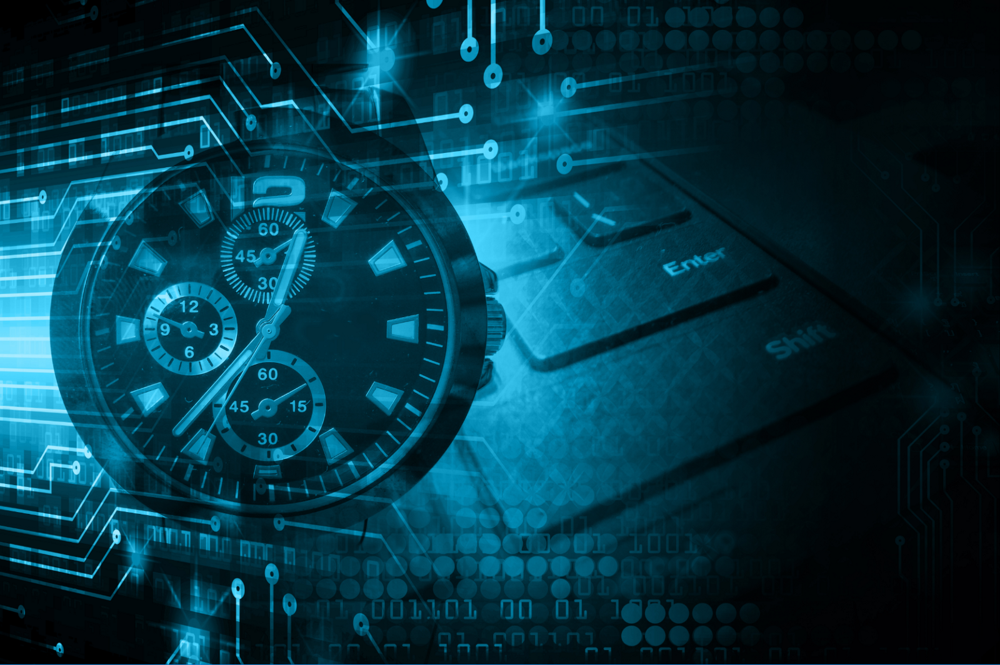

> *作者：Tony Little*
> 
> *来源：<https://hackernoon.com/blockchains-and-the-evolution-of-mechanical-time-60295326d9c2>*

> 机械时钟创造了全新的经济组织类别，不仅开辟了新的可能，也超越了以往的想象。—— [区块链经济学：制度加密经济学入门指南](https://medium.com/@cryptoeconomics/the-blockchain-economy-a-beginners-guide-to-institutional-cryptoeconomics-64bf2f2beec4)

当那些有商业背景的人问你 “什么是区块链” 时，不妨指指自己的手表。为便于理解区块链，人们常常将它与互联网进行类比 —— 但我认为，最好的说法是，**区块链是机械时钟演化的下一个阶段**。

时钟之于时间，正如区块链之于数据！在阐述这一点之前，我们先来看看机械时钟为经济带来了什么，以及区块链是如何推动机械时钟进入下一个阶段的。

从根本上来说，时钟是一个中介，可以让所有人就时间的增量达成共识。我们信任时钟。想象一下，在我们能够以可靠的方式度量时间之前，人类的生活是什么样子的。在时钟被发明之前，大自然赋予我们的最可信的时间标示是公鸡、一天之中太阳位置的最高点和日落。每个标示都会随着人们所处位置和观察点的变化而变化。

机械时钟为我们开辟了新的贸易管理方式，不仅摆脱了地理、生产和运输的影响，而且从根本上改变了我们的经营方式。

**只要参与者共享同一个时钟，就表明他们都认可同一个信息源来向他们播报时间的变化**，例如，商务合同的生效和终止日期，或货物的装船和到达日期。最终，共享时钟可以让全球经济协作成为可能。在时钟刚诞生时，有谁能想到它会创造出哪些新市场呢？

区块链也是一个中介，可以让互不信任的参与者就**数据**达成共识。在区块链被发明之前，数据孤岛、昂贵而不可信的交互界面和不对称的数据组织模型一起形成了可信度最高的数据库。但人们所信任的信息来源的内容和结构都有所不同，得出的 “真相” 也就所有不同。

区块链有望开辟新的经营和贸易方式，并从根本上改变市场。**如果参与者共享同一个区块链，即表明他们认可同一个不可篡改的数据来源**，这样可以极大减少验证（资产关系）的成本，即验证资产由谁持有、或是否满足特定合约条件的成本。区块链提供了一个关于过去的数字视图，所有参与者都能以极低的成本快速查看它，无需询问网络中其他参与者所看到的 “版本”。现在，所有人都在苦思冥想着，区块链能够带来哪些新型市场。

机械时钟并不储存过去的数据，它只表示现在。区块链并不表示当下，而是将过去的数据聚合起来。要想让某个数据的状态得到一条链的公认，需要经历一个推迟数据写入的共识过程（这就好比在一个会议室里，一群审计员在审查多个账本，然后创造出一个主账本），但是，一旦数据被写入，每个参与者都可以通过复杂数学公式（密码学）来验证这些过往的数据有没有被篡改。如同一个良好运行的区块链，机械时钟实际上也是高度去中心化的（即，有很多人提供准确的时间；此外，人们也运行自己的计时器）。

另一个可能会让区块链小白困惑的点是，公有链与私有链之间的区别。二者的区别主要在于对网络参与者的限制，这一点也与机械时钟相似。

开放式（免许可型/公共）网络面向所有人开放，并且使用密码学货币作为奖励来激励那些保护网络安全的参与者。讽刺的是，参与者越不信任彼此，数据就越安全，因为每个参与者都会努力确保网络中没有 “作恶者”。通过机械时钟，参与者之间很容易建立起信任，因为事实的最终仲裁者是获得所有参与者认可的主时钟的设计者。如果你在参加一场重要会议时迟到，你就会感受到围绕机械时钟产生的组织力量。

如今，封闭式（许可型）网络有些令人尴尬，而且在可用性上面临更多挑战。想象一下，如果你创造了自己的 “时间” 结构，并试图让一群人使用它。由于普遍的做法是使用传统商务合同在参与者之间 “人为建立信任”，如果这些合约没有被写成正确的代码放到网络上，让所有参与者都能理解其中关系，则无法与传统商务合同竞争，因而产生摩擦力。那些试图创造更中心化的区块链模式的人，经常会因为隐私顾虑（如，在医保方面）而发现区块链并不是那么有用，除非他们可以建立一套正确的激励机制。再强调一遍，机械时钟也是如此，如果你不能通过低成本的方式就当前时间达成共识，那么雇佣中介来通知每个人会议时间或许更便宜（想象一下，那些骑快马往返于各个王国之间送去舞会邀请函的信使）。

就像戴手表的人偶尔会跟主时钟对一下时间，我相信人们将来会参考一个大型的、可信任的区块链来提高信任程度，即使那只是一条由某个私有链定期上传到一个公开网络（比如以太坊）上的数据指纹（哈希值）（也有助于提高信任程度）。

所以，当你考虑如何描述区块链时，不妨试试我这个吧。记得要戴一块表。

如果你有任何想法，欢迎与我分享。

非常感谢 Will 和 Conrad 对这篇文章的贡献。

（完）

> 编者注：附：
>
> - [比特币就是时钟](https://www.btcstudy.org/2021/09/29/bitcoin-is-time/)
> - [工作量证明本质上是一个去中心化时钟](https://www.btcstudy.org/20a1/10/16/explaining-proof-of-work-as-a-decentralized-clock-echo-version/)
