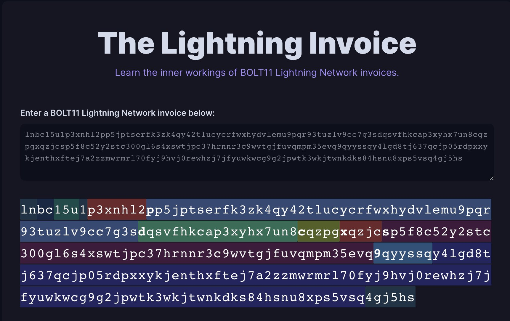

> *作者：LN.capital*
> 
> *来源：<https://twitter.com/LN_Capital/status/1589321548133203968>*

BOLT 12 是一个沉睡的巨人。但 99% 的比特币爱好者都还没有理解。在这个帖子中，我们尽可能简单地说清楚：

**首先，什么是 “BOLT”？**

“BOLT” 是 “闪电网络技术基础（Basis of Lightning Technology）” 的缩写。这是一种技术规范的草案，类似于 BIP（比特币升级提议）。

BOLT12 正由在 [@blockstream](https://twitter.com/Blockstream) 的 c-lightning 团队工作的 [@rusty_russel](https://twitter.com/rusty_russel) 开发。完成之后，还需要由 eclair 客户端（[@acinq](https://twitter.com/acinq)）或者 lnd 客户端（[@lightning](https://twitter.com/lightning)）实现，才能被视为 “激活了”。

**那么，BOLT12 到底解决了什么问题？**

要回答这个问题，我们还得先看看当前闪电网络上的发票协议，BOLT11。

BOLT11 发票主要有 3 个组成部分：

1. 目的地（目的节点的公钥）
2. 数额（以聪为代为）
3. 支付的秘密值（哈希值）

**那么，BOLT11 有哪些局限性？**

1. 一个 BOLT11 发票只能使用一次。只要一个发票创建了之后，这个支付的秘密值就泄露出去了。要是你想使用同一个秘密值创建一个新的发票，其他人会察觉，会通过揭晓原像直接拿走本不属于它们的钱。

2. 因为每个发票都只能使用一次，所以发票必须实时创建。这意味着，BOLT11 发票不适用于捐赠用途、打印的价格标签和其它异步支付场景。

   举个例子，如果你在杂货店出售苹果，并打印出了以聪计价的价格标签，在人们实际购买时，比特币的汇率可能已经发生了变化。所以，商家将暴露在 BTC 的价格波动中（除非比特币已经被广泛接受作为记账单位了）。

3. BOLT11 的发票仅能用于收账，不能用于发送。这就阻止了信用发票的使用。

   举个例子，一个 BOLT11 闪电 ATM 没有办法给你发送比特币来交换你的美元，只能你先创建一个发票然后把它发送给 ATM（这种用户体验不理想）。

   有了 BOLT12，你就只需要把你的美元塞进去，扫描一个 QR 码，然后 ATM 就会给你支付了。

**总结一下：**

- BOLT11 发票只能一次性使用（不安全）
- 必须实时创建（对于捐赠和价格标签不友好）
- 只能用于收账，不能用于发送

**那 BOLT12 呢？**

简而言之，BOLT12 是一种新的闪电网络发票规范。

它包含了一种新的发票，叫做 “offer”。

你可以认为 “offer” 是一种 “超” 发票 —— 一个发票之上的一个发票。

你可以扫描一个 BOLT12 offer，然后你的钱包就会弹出窗口来让你支付，跟使用 BOLT11 一样。但它也可以给你发送资金，就像在 ATM 的例子中一样。

不像 BOLT11 发票，你可以重复使用 BOLT12 offer 来创建静态的闪电网络发票，这可以用在捐赠页面和广告牌中。

现在，你可能会想，“这听起来有点像 LNURL。为什么不直接使用 LNURL 呢？”

主要的区别在于，BOLT12 提供了闪电网络原生的体验，也就是你不需要 web 服务器，TLS 证书和域名。

BOLT12 是对发票问题的一种协议层解决方案，而 LNURL 只是一种应用层解决方案。这意味着，BOLT12 会有更好的隐私性、更小的中心化风险（DNS 问题），而且可以为不懂技术的用户提供更好的体验。

**BOLT12 可以用在哪些地方呢？**

1. 订阅服务

   BOLT12 offer 可以要求用户每天、每周或者每个月支付一次发票（以美元或者以聪计价）。

   钱包依然需要构建这个功能，但是基础设施将就绪。

2. 比特币闪电网络 ATM

   Offer 可以通过信用发票的形式，给你发送资金。这在之前是不可能的。

   这可以实现更好的用户体验，推动闪电网络的普及。

3. 隐私退款

   在退款时，用户无需创建一个发票并发送给商家，用户可以扫描一个 “退款” offer，然后收回自己的钱。

   这对接收者来说更加隐私，而且整体上用户体验也比较好。

**简而言之：**

- BOLT12 是一种规范草案，提出一种新的 “超” 发票，叫做 “offer”。
- Offer 是静态的，用户和商家都可以接收资金和发送资金。
- 因为 offer 是持久存在的，所以可以用美元来计价，为商家回避比特币的价格波动。

BOLT12 还有其它许多特性，包括隐私强化，但这超出了本帖的范围了。

要是你还想听我的讲解，请留下评论！

感谢阅读，敬请关注。

额外的资源：

- https://bolt11.org
- https://bolt12.org
- https://youtu.be/LSP0p_IPUIM

如果你在运行闪电网络节点，可以看看 Torq：https://github.com/lncapital/torq