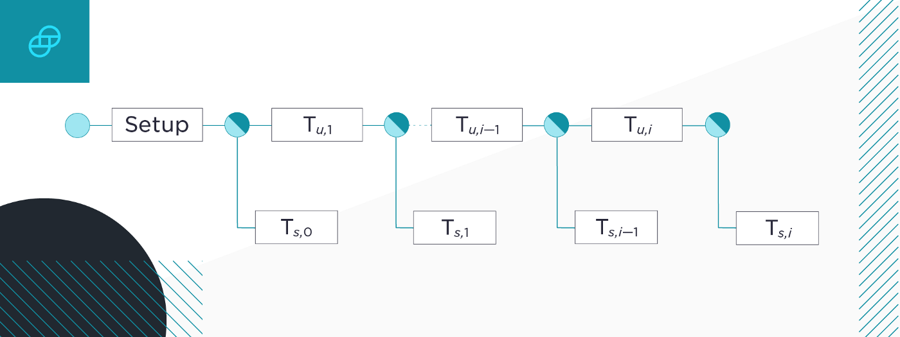
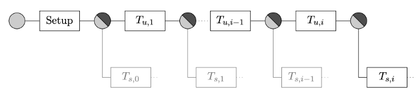
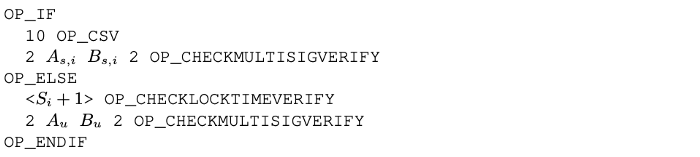
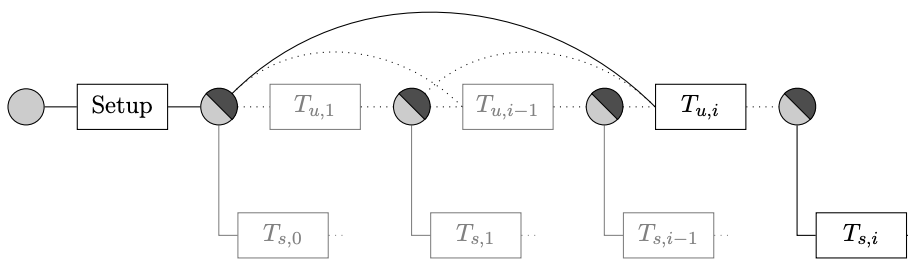

> *作者：Brandon Arvanaghi*
> 
> *来源：<https://medium.com/@brandonarvanaghi/breaking-down-the-bitcoin-lightning-network-eltoo-c48554f5ae02>*

- 图片来源：Eltoo 白皮书 -

闪电网络是一种 Layer 2 解决方案，让你可以跟其他比特币友创建微支付通道。它让即时、免信任的交易成为可能，并且只需在链上保留少量数据。

本文中，我将详细解释它是怎么工作的，以及一种新提出来的升级协议，叫做 “eltoo”（跟 “L2” 同音）。

## 单向通道

单向的支付通道是最容易实现的，因为资金只会往一个方向流动。最常见的应用场景是川流支付（streaming money），比如，每多付一点钱就可以看多一分钟的视频。

假设你要跟奈飞（Netflix）开启这样一个通道。首先，你创建一笔**充值交易**，就是锁定一些你想支付给奈飞的钱（但还不会立即支付给他们）。

假设你将一笔锁定 10 BTC 充值交易发到了比特币区块链上。该交易的输出资金项可被一个 2-2 的多签名（你的签名和奈飞的签名一起）花费。

奈飞开始给你播放流媒体视频时，你也就开始给他们付费 —— 假设你需要为每分钟的视频支付 0.000001 BTC —— 手法就是为花费充值交易的交易提供你的签名。

使用充值交易作为输入，创建两个新的输出：一个输出是给奈飞发送 0.000001 BTC，另一个输出是给自己发送 9.999999 BTC。给这笔交易签名后你把交易和签名在链下分享给奈飞（也就是说，你不会把它发到比特币区块链上）。这笔交易被认为是 “部分签名的”，正是因为它只包含了你个签名 —— 使之有效的两个必要签名中的一个。

当奈飞收到这笔部分签名的交易时，他可以有所选择。他可以选择加上自己的签名、把交易发送到比特币网络上、立即拿走这 0.000001 BTC（同时把 9.999999 BTC 发送给你）。这就成了 *关闭通道* 或者说 *结算交易*。

不过，只要你每次都提供数额更大的部分签名交易，奈飞就会继续给你播放视频。比如，一分钟过后，你要给奈飞发送另一笔部分签名的交易、但同样使用充值交易作为输入。这个部分签名的交易将给奈飞发送 0.000002 BTC、给你自己发送 9.999999 BTC。以此类推。

单向的支付通道中是没有欺诈的。如果你停止给奈飞发送支付数额更高的部分签名交易，奈飞就会停止给你传输视频。他们会签名你发给他们的最近的一笔部分签名交易（也就是给他们支付最多比特币的一笔）、发送到比特币区块链上，从而关闭这个通道。

更进一步地，也没有人会想发布一笔 “过时” 的交易。因为奈飞是唯一一个有能力补完部分签名的交易、使之成为有效交易的实体（因为奈飞有你的签名，但你没有奈飞的签名），而每一笔更新的你发给奈飞的交易，都会给奈飞带来更大的好处。要是奈飞广播了更早的一笔交易，那是搬起石头砸自己的脚。

但如果资金会双向流动，事情就会变得更加棘手。双方都可以广播交易，所以广播一个过时交易的动机是始终存在的。

## 双向通道的难题

假设 Alice 和 Bob 开启了一个支付通道，双方都在充值交易中锁入了 0.5 BTC。现在 Alice 同意给 Bob 支付 0.1 BTC 的洗车费。她给 Bob 发了一笔使用充值交易作为输入、有两个输出的部分签名交易：一个输出给自己支付 0.4 BTC，另一个输出给 Bob 支付 0.6 BTC。

Bob 收到交易后如果不广播出去，通道就继续保持开启状态。他后来同意给 Alice 支付 0.3 BTC 的打印费。

如果 Bob 给 Alice 发送了一笔使用充值交易作为输入的部分签名交易，那么，现在就有了两笔交易，这两笔交易是不同的，但都花费了同一笔充值交易，也都可以成为有效的交易。因为交易在比特币上没有超时日期，所以这两笔交易的有效性都是永久的。

他们可能会继续来回交换部分签名的交易，来获得商品或服务；但这不是关键。关键在于，他们中的任何一方都有可能会发布更早的交易（给自己支付更多比特币的交易），从而关闭通道，并让其它所有签名交易失效。这就是所谓的恶意行为。

双向通道需要一种办法来 *作废过时的交易*，使得 *只有最近的签名交易* 才可以用来关闭通道。这也是 *eltoo* 的用意。

## eltoo

闪电网络中的双向支付通道在今天可以上手即用，是因为[闪电网络白皮书](https://lightning.network/lightning-network-paper.pdf)创建了一种可用的协议来作废过期交易。这套协议叫做 “LN-Penalty”，即惩罚尝试发布过时交易的参与者、让对方可以拿走欺诈方所有的比特币。

虽然 LN-Penalty 在今天是可以工作的，它也存在一些问题。除了它自身的复杂性，还有一些罕见的情形，它可能会意外地惩罚诚实的用户。[*eltoo*](https://blockstream.com/eltoo.pdf) 当前还不可用，因为它依赖一种还在提议阶段的签名方案 [*SIGHASH_NOINPUT*](https://github.com/bitcoin/bips/blob/master/bip-0118.mediawiki)（译者注：该文撰写于 2019 年。至翻译之时，BIP-118 早已经改名为 “SIGHASH_ANYPREVOUT”，下文将沿用这个新名称），而这套方案还未被接受，但因为它不是基于惩罚的，所以也不会有意外惩罚的风险。

在 eltoo 中，双方在下图所示的 **Setup** 阶段创建充值交易。充值交易可能会包含来自双方的比特币，因为我们预期资金会双向流动。

- 每个圆都代表着一个交易输出。图片来自 eltoo 白皮书 -

在签名充值交易之前，Alice 和 Bob 先签名一笔 *结算交易*（上图中的 **Ts,0**），它会将充值交易中的比特币原样返回给双方。在 eltoo 中，“结算交易” 这个术语指代任何将资金分配给参与者双方（而不是他们共同控制的多签名输出）的交易。

在签名第一笔结算交易之后，双方可以安全地签名充值交易。充值交易的锁定逻辑如下：

- 充值交易以及所有状态更新交易的锁定逻辑。图片来自 eltoo 白皮书 -

有两种办法可以花费充值交易：一个是 *IF* 分支，另一个是 *ELSE* 分支。这两个路径依赖于两组不同的密钥：IF 分支需要 *结算密钥*；而 ELSE 分支需要 *状态更新密钥*。

你可能注意到了，锁定脚本的结算分支（IF 分支）包含 **10 OP_CSV**（OP_CHECKSEQUENCEVERIFY 的缩写）作为第一个指令。任何尝试通过 IF 分支来花费这笔充值交易的操作，都只有等充值交易记录在比特币区块链上之后的 10 个区块以后才能生效。如果 Alice 和 Bob 交换了结算交易的签名、让充值交易上链之后，立即广播结算交易，那么这笔结算交易要等 10 个区块以后才能挖出并产生归还相应资金的效果。

- - -

假设 Alice 和 Bob 不想结束通道。Alice 想给 Bob 发送 1 BTC，所以他们的新余额将是 Alie 拥有 4 BTC、Bob 拥有 6 BTC.

Alice 和 Bob 最先做的事情是交换一笔 *新的* 结算交易的签名。这笔新的结算交易将给只有 Alice 能控制的地址支付 4 BTC，给只有 Bob 能控制的地址支付 6 BTC。

这里就到了 eltoo 的关键：这笔新的结算交易不需要花费充值交易。相反，它花费的是一笔 Alice 和 Bob 还没构造出来的输出：一笔 *状态更新交易*。

状态更新交易的目的实际上就是多重花费充值交易，这样最开始的那笔结算交易（Alice 和 Bob 都签过名的、必须等待 10 个区块后才能上链的那个）就没用了。

回想一下充值交易的锁定脚本：

- 充值交易的锁定脚本 -

虽然结算分支有 10 个区块的延迟，但 *更新分支*（ELSE 分支）没有。只要 Alice 和 Bob 交换了他们相应的 *状态更新* 密钥的签名，他们可以在结算交易还未能生效之前立即通过更新分支来花费充值交易。

在 Alice 和 Bob 签名新的结算交易（给 Alice 的结算密钥支付 4 BTC、给 Bob 的结算密钥支付 6 BTC）之后，他们交换相应状态更新密钥的签名来创建状态更新交易。如此一来，旧的结算交易（按初始余额给双方退还资金的交易）就变得没有意义了，而新的结算交易 —— 它会花费当前要创建的状态更新交易 —— 是唯一一个能触发结算的交易。

如图所示，创建状态更新交易和结算交易的过程可以像上面说的这样无限持续下去。最新的结算交易 **Ts, i** 是唯一一笔有意义的结算交易，因为 Alice 和 Bob 签名了一连串立即就可以广播的更新交易，保证了没有一个更早的结算交易可以生效。

- 每个圆都代表着一个交易输出。图片来自 eltoo 白皮书 -

- - -

你应该也想到了，这个模型理论上是能够工作的，但它需要把每一笔状态更新交易都发布到比特币区块链上。这就跟闪电网络的初衷相违背了，闪电网络本身是想通过在链下发生交易来减少上链的数据的。

这就是我们需要 **SIGHASH_ANYPREVOUT** 的地方。**SIGHASH_ANYPREVOUT** 让你可以无需把整条状态更新交易的链条发布在链上，你可以跳过所有中间的状态更新交易，只发布最后一个你需要的。

- SIGHASH_ANYPREVOUT 允许 “绑定” 到任何更早的交易上 -

虽然一个输出的锁定脚本可以指定 *具体的哪那一组私钥* 是花费它的必要条件，它并未指定 *签名里面要包含什么*。一般来说，你会签名自己的交易中的所有输入和输出，并通过 **SIGHASH_ALL** 来告知比特币节点你做了什么操作。SIGHASH_ALL 意味着，你向所有的比特币节点表示，你的交易只有在包含你的签名承诺的特定的输入输出组合时，才是有效的。你是在告诉比特币节点，你的交易中如果出现了偏离签名的任何其它组合 —— 输入不同、输出的数额稍有不同，等等 —— 就都是无效的。

而在 **SIGHASH_ANYPREVOUT** 模式下，你可以创建一笔 “自由浮动” 的交易。你是在向检查你的交易的比特币节点宣布，你 *不在乎* 你的交易的输入是哪个 —— 你只在乎输出。所以，你的签名，对需要用你的私钥来花费的 *任意尚未花费的输入*，都是有效的 —— 花它们中的任何一个你都无所谓。

如上图所示，使用 **SIGHASH_ANYPREVOUT** 标签，你可以把最新一笔状态更新交易绑定到充值交易上。最后一笔状态更新交易已经被签名了，而且，虽然它一开始将输入指向前一笔状态更新交易，我们可以改变它所花费的 UTXO 而不使其签名作废，因为我们使用  **SIGHASH_ANYPREVOUT** 明确地指定了，输入与该签名的有效性无关。所有其它状态更新交易都可以被安全地跳过。

因此，自始至终，只有三笔交易需要发布到链上：充值交易、最新一笔状态更新交易以及最后一笔结算交易；结算交易将通过花费最新一笔状态更新交易来为双方分发最后的余额。

- - -

## 排序问题

你可能会想到，自由浮动交易可能产生问题。如果最新的状态更新交易可以被绑定到任何早先的更新交易（包括充值交易上），那么反过来说也成了：任何早先的更新交易也可以绑定到最后一笔更新交易上。这会使最后的更新交易无效！

为了解决这个问题，eltoo 很聪明地在其锁定脚本中加入了一个 *状态号* 的概念。它维持着更新交易之间的次序，使得更新交易只能无差别地绑定到 *早前的交易*，但不能绑定到 *更新的交易*。我们来看看调整后的更新交易的锁定脚本：

- 充值交易的锁定脚本 -

ELSE 分支是为状态更新交易设置的，其第一个指令是：

>  **<Si + 1> OP_CHECKLOCKTIMEVERIFY** [缩写为 OP_CLTV]

OP_CLTV 是一个未花费的输出检查尝试花费它的交易的 **nLockTime** 。当你提交的交易的 nLockTime 设成大于 5 亿时，比特币会把它解释成一个 Unix 时间戳。也就是说，花费交易无法在这个时间之前挖出。小于 5 亿的数值则会被解释成最小区块高度，在这个区块高度以前，这笔交易无法挖出。

但这里有一个很聪明的技巧！如果你让 *nLockTime* 大于 0 但是小于 5 亿，*同时* 小于比特币的区块高度，那么你发布的交易可以立即上链。它违背了 nLockTime 用来推迟交易上链时机的初衷，但我们可以使用这个范围内的所有值来为状态更新交易排列顺序，同时无须推迟其挖出的时间。

假设充值交易指定了 *OP_CLTV*  为 1，则第一笔状态更新交易，标记为 **Tu, 1**，将需要把 nLockTime 设得大于 1。这样，Alice 和 Bob 就可以确认下一笔状态更新交易的 nLockTime 至少是 1。第一笔状态更新交易的输出将在锁定脚本中指定 *OP_CLTV* 为 2；下一笔更新交易指定为 3，以此类推。

现在，假设 Alice 和 Bob 尝试绑定第一笔更新交易到更晚形成的一个输出 —— 比如按顺序是第三个输出（第三笔状态更新交易形成的输出） —— 上，那比特币区块链会拒绝它，因为第一笔更新交易的 nLockTime 是 1，而第三个输出要求 nLockTime 至少是 3。

这样一来，虽然所有的状态更新交易都是用 **SIGHASH_ANYPREVOUT** 签名的，更早的状态更新交易无法绑定到更晚的状态更新交易上，因为它们的 nLockTime 将低于更新输出的锁定脚本的 *OP_CLTV* 要求。这一设计保护了最后一笔结算交易（记为 **Ts, i**）的有效性。

结算交易也必须使用 **SIGHASH_ANYPREVOUT**。因为，如果它所花费的交易改变了输入（从指向上一笔状态更新交易变成指向了充值交易，正是通道关闭时发生的事情），它所花费的交易的 ID 会改变，因为交易输入是决定交易 ID 的一部分。因此，任何结算交易都必须有能力处理前序交易 ID 改变带来的影响。

不过，你可能会注意到，锁定脚本的结算分支并不包含状态号。

- 充值交易以及所有状态更新交易的锁定脚本 -

乍看起来，它会导致我们前面讲到的同样的问题：旧的结算交易可以花费后来才形成的状态更新交易，造成结算交易竞争进入区块链的赛跑（race condition）。

但是，这里的解决方案不是使用状态号，而是每一笔结算交易都使用 *从它所花费的状态更新交易的状态号里推导出来的不同密钥对*。因此，一方面，结算交易通过使用 **SIGHASH_ANYPREVOUT** 保持了改变状态更新交易 ID 也不会使签名作废的能力，另一方面，这些签名又只能用来花费 *特定的输出*，因为生成这些签名的密钥对 *只能用来解锁特定的状态更新交易*。因此，结算交易是通过设置只对某个输出有效的特定密钥对，来确保它唯一绑定到特定的状态更新交易的。

## 总结

双向状态通道可以很复杂，但是 eltoo 提供了一个简单新颖的方式来实现它。希望你喜欢本系列文章！

（完）