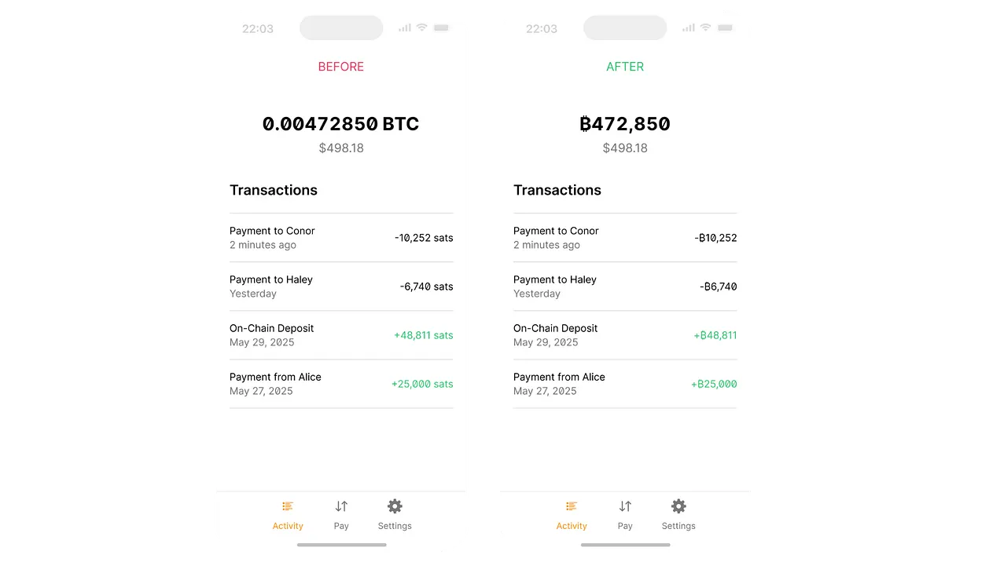

> *作者：Mat Balez*
> 
> *来源：<https://spiralbtc.substack.com/p/bringing-to-the-world>*

产品设计的很大一部分是帮助打造你希望看到的世界。

这意味着，你得有点未来主义：从眼前出发，想象未来的情景，先确定事物应该是什么模样，再回头看如何实现它。

回到比特币，我喜欢想象比特币变成了世界上每个人每天都使用的货币。这意味着，比特币长了一种全球的交换媒介和记账单位。几百万个商家会用比特币的数量来表示商品的价格。几十亿人会花费比特币。美好的一面是：支付将是中性的、便宜的、容易，而且迅速。既是信息网络，也是现实生活。

但是，你有没有停下来想过，比特币 —— 这个品牌、这个词、这个符号、这个概念 —— 在未来将如何显示、显示在哪里？

这就想想看吧。

目前，在你能用上的几乎所有软件和服务的界面中，比特币的数量都以下面两种方式之一显示 —— 通常 app 会同时支持这两种方式：

- 带小数的数量形式，通常用在较大的数额中，与 “BTC”（等于比特币协议的 1 亿个 “基本单元”）一起显示，比如 “0.625 BTC” 。这种显示方式通常用在传统的储蓄、抗通胀应用场景中。
- 整数形式，通常用在较小的数额中，与 “sats（聪）”（“satoshis”）乃至聪的符号 ☰ 一起显示，它是比特币协议的一个 “基本单元”，比如 “25,750 sats” 。这种显示方式通常用作 日常花费/支付 应用场景中。

变成这样完全是因为一些非常比特币的原因：随时间发生的有机演化、来自钱包开发者的草根支持、逐渐形成的去中心化的共识，等等。就是如此。

但是，如果我们继续推演，比特币的采用会扩散：比特币的汇率会上升、支付变成更加频繁的应用场景、日常花费钱包变成使用比特币的主要办法，然后，比特币 —— 这个品牌 —— 就从人们的视野中完全消失了。产品的 UI 上会显示 “聪”。所有地方的价格都以 “聪” 为单位。如果显示方式是我们触摸、观看、感受比特币的最具体形式，那么，我们当前的道路会走向一个 “聪” 的世界，而不是 “比特币” 的世界。

这是不是一定很糟糕呢？

我觉得它一定有人有些失落。

我的意思是，这样就放弃了比特币社区创造出的这种神奇的资产 ——  比特币社区在全世界范围内享有的极高的品牌辨识度 —— 将它放在一边。

但更大的问题还在于，现在世界上几乎没什么人知道什么是 “聪”。你不访问问你那些不爱比特币的朋友。比特币，听过；聪，不知道。几乎每个人都是这种反映。你可以现在就试试。

所以，沿我们现在的道路往下走，意味着给所有刚刚接触比特币的新用户强加这种完全没有必要的学习负担。

它会让人困惑，然后要求我们去解决这些困惑，包括：

- 明白 “聪” 不是一种垃圾币，而跟比特币是同一种资产
- 避开从谷歌搜索中得到的兜售假 “聪” 的诈骗链接
- 知道 1 BTC 就是 1 亿 “聪”
- 理解你可以在任何接受比特币支付的商家那里花费你的聪

更多学习 = 更多摩擦 = 更高的退出率 = 更慢接受。

你可以把它想象成一种对接纳征收的税。只不过，我们可以很容易避开这种税 ……

## **在所有使用 “聪” 的地方，都可以使用 ₿ 符号**

具体来说，我们可以在任何显示比特币数量的文本中都遵循这样的转化：1）只使用整数格式；2）使用 “₿” 作为标签。

比如，不使用 “0.6250000 BTC” 这样的现实方式，而是显示为 “₿62,500,000” 或者 “₿62.5M”。

不显示 “4,585 聪”，而显示一杯拿铁是 “₿4,585” 。

这样更简洁。它保证了比特币的品牌符号永远显示在价格中。最好的是，它非常清楚的表明，你在使用、发送和接收的资产，是比特币。

而且这很容易做到。

举个例子，这是一个来自 [Bitcoin Design Guide](https://bitcoin.design/guide/designing-products/units-and-symbols/#-only-format) 网站的截图，显示如何改造钱包软件的界面：

[Bitkit](https://bitkit.to/) 是去年第一个这样做的钱包，然后 [Boardwalk Cash](https://boardwalkcash.com/) 也这样做了；然后，[BIP-177](https://github.com/bitcoin/bips/blob/master/bip-0177.mediawiki) 将这些思想写成了规范；现在，Square [在他们的新 POS 机中推销这一变化](https://x.com/Square/status/1927396327039684690)。最近，[Blitz 也宣布](https://x.com/BlitzWalletApp/status/1940520281581502704)他们将在网页端钱包中提供这种选项。 [Wallet of Satoshi](https://x.com/joenakamoto/status/1938238281658822966) 甚至悄悄推行了这个转变（然后被抓住了 : ) ）。人们在呼喊。草根在生长。

但我知道，你可能觉得这些想法太离谱了。我一开始也这么认为：

- 感觉哪里不对劲。
- “聪” 这种显示方式早就有了呀。
- 离谱，离谱到不值得讨论。
- “聪” 根本没问题，为什么要浪费时间讨论这个？

但如果你看得长远，想到比特币支付的普及（从今天几乎没有到有一天所有人都用），这些想法似乎就没有那么荒诞了。要是你再仔细看看它的模型图，哪怕你不情愿，这种[只使用 ₿ 符号的显示模式](https://bitcoin.design/guide/designing-products/units-and-symbols/#-only-format)也相当养眼。很快，你就会开始嫌弃你在各种产品中看到的小数点和 “聪” 了。

₿ 是那种你无法视而不见的东西。

然后，我们再来聊聊那些油然而生的问题吧。

## 这个符号要怎么念呢？

人们要怎么说这些以 ₿ 为单位的数量？

很难创造口语的标准化用法，甚至连倡导都很难（即便不是完全做不到）。从本质上来说，口语就会不断变化，而且比较随意，跟它所在的社区密切相关。

- 一些比特币老玩家会继续说他们买咖啡花了 “5 千聪”。这很好！就这么干。展现你的老炮身份的绝佳方式。
- 其他人会说 “5 千比特币”。也没问题！这是对新用户来说最自然的说法。
- 还有一些人会用缩略语，比如 “bits”、“coins” 或者 “bitties”。也许连 “kb” 和 “mb” 也会变成常用的缩略语？谁知道呢。

语言会演化，它现在就在演化，以后也会继续演化。

我个人认为，关键是为产品的 UI 和文本尝试最好、最便利的数量显示方式并协调一致，其它的，就交给文化。

## 那汇率呢？

没有任何变化。

比特币的汇率的变化过程，从一文不值到价值 10 万美元，可能是比特币的流行文化和营销中最重要的一部分。它就是整个世界关注它的原因。

全世界的注意力和文化，会继续讨论以今天这种形式表示的比特币的汇率。

标准的价格标识是 “BTC”，已经在交易所得到普遍采用，将保持现状。我们只是采用 “ 1BTC = ₿100,000,000 ” 的定义而已。

因此，人们可以继续（也应该）使用 “BTC” 来讨论比特币的汇率，就跟今天一样。

## 那么 “2100 万” 这个口号呢？

也一样，没有什么变化。

比特币的稀缺性是根本的。不论是事实还是人们对它的感知，都不会改变。

改变表示比特币数量的方法不会创造新的比特币。

在我们需要讨论已经存在和将会出现的比特币的总数时，我们可以继续使用 “BTC” 这个单位，并表示它代表 1 亿个基本单元。所以，口号还是一样的，只是写成 “2100 万 BTC” 。

因为其实没有多少人知道这个 “2100 万” 的说法（请再试试问问你的比特币圈子外的朋友），所以也不会有什么误会。在我看来，我们可以（也应该）转变我们谈论这个事情的方式，突出币具体的数量更重要的东西：比特币是绝对稀缺的，而且这一点永远不会改变。

## 人们不会因此搞出代价巨大的错误吗？

不会，我认为不会有人会意外搞混 “₿4,585” 和 “ 4,585 BTC”，然后在手机的日常支付钱包中发送 4 亿美元给咖啡店。

1 BTC 与 1 ₿ 在价值上相差了 8 个数量级，所以这样的错误是不可能的。

不过，资金损失和用户误操作，确实是需要重视的事情，我很愿意了解我们的数量表示方法的改变可能引发的真正令人混淆的情形。请把案例发给我，我会自己研究。

最后，你可能还是会怀疑 ₿ 。

这没啥，我尊重你的意见。在比特币世界里，抵制变更总是有好处的。

但是保持开放的心灵也有好处，尤其是在考虑到全球有 78 亿人，许多人可能从未拥有比特币，那么做什么能最好地欢迎他们到来。所以哪怕你心怀疑虑，我也建议你冷静下来想一想。

最后，这事也不是我说了算。不论是 Block，还是 Spiral，都没有最终决定权。没有什么神秘工程师和设计师团体有这样的决定权。

这篇博文不过是阐述我个人对产品设计的看法。它只是涌现式去中心化共识的建立过程的一个微小浪花，最终无非是两个结果：更多钱包开发者和交易所开始采用这种只包含 ₿ 的格式，或者，他们直接无视我们，那么一切都不会变化。

市场，宇宙，还有普通人，会决定最终的结果。

我喜欢这样子的比特币。

（完）

