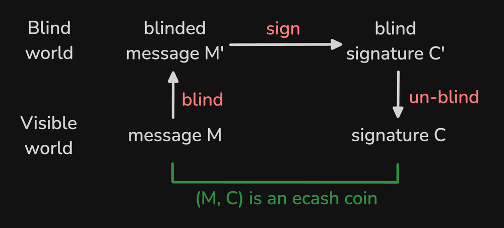

> *作者：Cashu  Developer*
> 
> *来源：<https://blog.cashu.space/buckets-of-blind-signatures/>*

- Cashu 坚果全家桶 -

Chaumian ecash 的一个标志性的特征是其钱币的取款（发行）与存款（赎回）是无法关联起来的（unlinkability）。不同的 ecash 实现运用了多样的密码学方法来实现这种效果，其中最突出的 “盲签名（blind signatures）”。盲签名是 Chaum [发表于 1982 的著名论文](http://bitcoin-class.org/readings/Chaum-blind-signatures.PDF?ref=blog.cashu.space)中的真正发明。就像许多标准的密码学方法一样，盲签名是一种密码学 “原语” —— 一种砖块 —— 可以用来构筑更大、更复杂的密码学系统。

本文会介绍 Cashu 中的盲签名的基本原理，并解释为什么 ecash 通常只能使用少数几种钱币面额，比如 2 的幂（1、2、4、8、16、32 聪，等等），来表示价值。我们先要了解盲签名是怎么工作的、实现了什么效果。我们会先从一个更加正式的定义开始，然后提出一个简化的例子，展示如何以盲签名为核心、构造一种支付系统。

给定一条消息，用户 `Alice` 可以**盲化**这条消息（称作 `M'`，这个记号表示盲化），从而没有人能发现新消息和原消息之间的关联。Alice 把这条盲化后的消息展示给铸币厂 `Bob`，而 Bob 会给出一条对它的密码学签名 `C'`。只有 `Alice` 才能**还原**这个盲签名，使之成为一个（没有盲化的）签名 `C`。神奇的地方在于，`C` 正好是对原消息 `M` 的签名，虽然 `Bob` 从未见过 `M`。你可能已经猜到了，`(M, C)` 这样的元组就是我们的 ecash 钱币。

人们也常常使用著名的 “碳纸信封” 来演示盲签名。先想象一份打印在之上的合同 `M`。`Alice` 希望 `Bob` 给这份合同签名，但又不希望 `Bob` 知道其中的内容。为此，`Alice` 先把合同 `M` 塞进一个由碳纸制成的信封里面。然后，我们把这个封好的信件 `M'` 交给 `Bob`。`Bob` 可以 *不打开信封，直接在信封上签名* ，然后把签好名的信件 `C'` 交给 `Alice`。当我们取出合同的时候，我们可以看到 `Bob` 的签名 `C` 已经在原合同 `M` 上了，虽然 `Bob` 从未见过这份合同。

这里还有一张图，展示了 Cashu 的盲签名方案所用的盲化、签名、还原、以及验证步骤。最重要的是，`Alice` 的钱包对 `(M, C)` 的操作是在 “光明世界” 了的，而铸币厂是 `Bob` 只能看到 “失明世界” 里的 `(M', C')`   .

## 带有价值的盲签名

现在，我们已经对盲签名方案的工作原理有了基本的了解，来看看铸币厂如何为发放给用户的签名赋予价值。

为了给自己的签名赋予价值，`Bob` 决定仅在 `Alice` 给他支付一定数额 `a` 的底层货币（比如，`a` 是 `128 聪` 的比特币）时，才会提供签名 `C'` 。`Bob` 也承诺会给任何能够在日后出示元组 `(M, C， a)`（分别代表原消息、签名和数额）的人 —— 不论是 `Alice` 还是她的收到了 ecash 的朋友 `Carol` —— 退还资金。这意味着，我们可以将元组 `(M, C， a)` 当成一枚钱币，是可以在用户间转移的钱币（比如，`Alice` 可以把它发给 `Carol`）。

那么 `Bob` 如何验证一枚钱币 `(M, C, a)` 真的价值 `a`（即，128 聪），既不是更贵、也不是更贱呢？为了理解这一点，我们需要在我们的盲签名方案中引入另一个细节，就是 `Bob` 要使用自己的私钥 `k` 来创建签名。实际上，这是一种简单（但不可逆转）的乘法，用私钥 `k` 乘以 `Alice` 所提供的盲化消息：`C' = k * M'`。

为了将一个具体的数额 `a` 绑定到这个签名上，`Bob` 还要为每一种可能赋予钱币的数值都生成一个私钥，也就是说，`Bob` 有很多个私钥 `k_a`，而这里的索引号 `a` 就表明了该私钥所代表的数额。当 `Bob` 以后要为钱币验证签名时，他将使用跟数额相对应的私钥 `k_a`。这样一来，他就能确定，钱币 `(M, C, a)` 中的数额 `a` 没有被篡改。在 Cashu 中，我们把对应于所有可能数额的所有签名密钥称做 “密钥集（keyset）”。

*侧边注：聪明的读者会意识到，严格来说，`C'` 并不是一种签名，而更像是一种消息认证码（MAC），因为它不能使用我们已经介绍的工具来公开验证。不过，对于我们当前的目标来说，这并不重要，所以我们暂时忽略这个细节。*

## 数字中的隐私

现在，我们已经打好了基础、介绍了这套签名方案的所有相关元素，可以转向这篇最重要的部分了：为什么 ecash 系统常常限制他们所支持的钱币面额（比如限制在使用 2 的幂上）？如前所述，铸币厂 `Bob` 需要为每一种面额使用一个特殊的私钥，以保证钱币的面额没有遭到篡改。然而，如果没有正确处理，这就会带来一个严重的问题：如果钱包可以使用任何整数作为自己的有效面额，那么铸币厂跟踪单个单个的钱币的生命历程（从发行到赎回）就非常容易，从而在实际上取消掉我们一开始用盲签名实现的所有效果。我们来举一个例子。

假设一个铸币厂为小到 `a = 1`、大到 `a = N` 之间的所有整数都准备一个私钥 `k_a`，也就是说，这个铸币厂需要 `N` 个不同的私钥。假设 `Alice` 希望铸造一个面额恰好是 `1337` 聪的钱币。铸币厂将使用私钥 `k_1337` 来创建一个盲签名，并在日后该钱币被花费的时候验证签名。

这种方法的问题在于，这种面额为 `1337` 的钱币的 *匿名集* 最大只能跟这个铸币厂已经发行过的 `1337` 面额的钱币的数量一样大。很容易看出，允许的面额越多，也即 *匿名桶* 越多，每一个匿名集就越小，这对用户的隐私性不利。

可以看出，要增加每一个匿名集的大小，一种简单的办法就是限制可以使用的面额 `a` 的可能性。 我们可以先将 `a` 限制在 2 的幂中，即 `a = 2^n`，然后用这些子数额组合出我们需要的任意数额。假设 `Alice` 想要铸造 `1337` 聪的 ecash 。 为此，她可以将总数额打散成一系列的子数额：`1 + 16 + 128 + 256 + 1024 = 1337` 。当我们支持的是 2 的幂时，找到这样的分解是很容易的。

事实上，这样的分解甚至是唯一的。我们可以通过将数的十进制表示 `1337` 转化成二进制表示 `10100111001` 来找出这样的分解。只需统计这个二进制数中哪些位置（记为 `n` ）的值是 `1` 还是 `0`，就可以知道我们需要几个钱币：从最小位（最右边）开始，一位一位往左边数，直到最左边；如果位置 `n` 的数值是 `1`，就把数字 `2 ^ n` 加入我们的和中。也就是说，`1337 = 2^0 + 2^4 + 2^7 + 2^8 + 2^10`（5 个面额不同的钱币）。是不是很简单！

限制可能面额的后果是，现在，不论 `Alice`（或她的朋友 `Carol` ）什么时候想赎回余额的一部分，她给 `Bob` 出示的钱币都跟 `Bob` 在过去发行过的许多钱币具有相同的面额。注意，如果 `Alice` 取出了刚好是总计 `1337` 聪，又立即把这么多钱存入，那这一点就不成立了。Bob 将很容易断定，这一取一存的是同一笔钱。也就是说，事实上，我们要通过（1）切分取款、部分存入；以及（2）存入之前稍等片刻，让其他曾经取款的用户可能在同一时间存入其他钱币；来获得安全性。

我们还可以看到，可能面额的集合也会影响匿名集的大小。假设在一种极端情形中，`Bob` 只发行面额为 `1` 的钱币。那么，`Alice` 将需要铸造 1337 个面额为 `1` 的钱币，才能获得自己想要的数额。然而，这样做虽然能获得最大程度的隐私性，却要面对最低的效，因为用户和铸币厂都不得不存储大量数据、在支付时传输大量数据。因此，必须选择一个合理的折中，例如使用 2 的幂分解。有趣的是，一篇发[表于 1997 年的论文](https://www.jstor.org/stable/2953714?ref=blog.cashu.space)发现，在法定货币的价格世界里，以 2.60 为基数将产生最高效的分解（数额表示）。

## 一键隐藏

就像许多其它情形一样，密钥集大小的选择也可以归结为效率和隐私性的取舍。更大的密钥集允许你更高效地表示数额，但也让钱币更容易被跟踪，反之亦然。不过，还有另一种解决方法，是我们这篇文章没有触及的，就是 “数额盲化”。使用跟 “机密交易（confidential transactions）” 类似的技术，我们可以用零知识证据来隐藏交易中的数额，就像在 [Liquid](https://blog.liquid.net/guide-to-confidential-transactions/?ref=blog.cashu.space) 侧链、[门罗](https://teemukanstren.com/2022/04/01/zero-knowledge-proofs-example-with-pedersen-commitments-in-monero/?ref=blog.cashu.space) [密码货币](https://www.moneroinflation.com/amounts_confidential_tx?ref=blog.cashu.space)，以及 [WabiSabi](https://eprint.iacr.org/2021/206.pdf?ref=blog.cashu.space) CoinJoin 协议中那样，我们可以将铸币厂的跟面额对应的私钥换成唯一一把私钥，并用它来创建所有签名。这将允许钱币使用任意的面额，同时提高整个系统的隐私性，因为将只有一个匿名集（因此其规模也是最大的）。

在这个例子中我们可以看出，匿名性和效率的取舍并不是自然规律，而大大取决于所用的密码学方法。在我们冒险进入 Chaumian Ecash 研究和 Cashu 系统开发的新领域时，请对这个方向上的更令人激动的进展保持关注。

在那之前，永远要记得：Pricey loves company（译者注：可能的意思是，要隐藏在众多同类中，才能具有隐私性，可译为“藏叶于林”）！

（完）