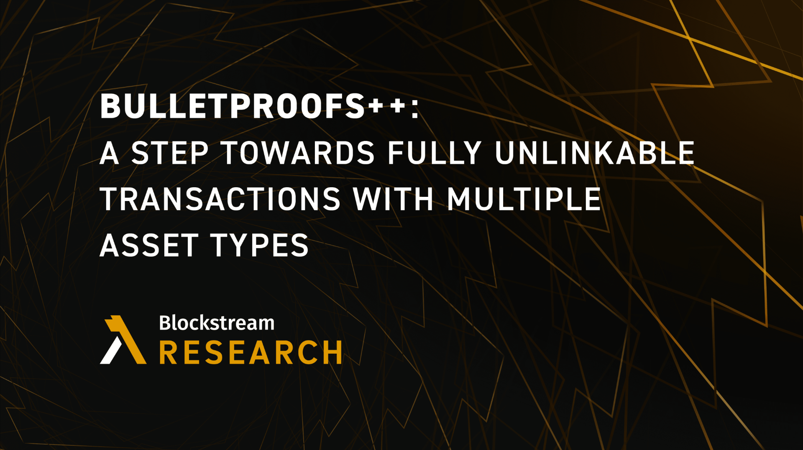

> *作者：Liam Eagen*
> 
> *来源：<https://blog.blockstream.com/bulletproofs-a-step-towards-fully-anonymous-transactions-with-multiple-asset-types/>*




隐私性和安全性密不可分，因为它们相互补充，也都是比特币用户所看重的属性。从 Green 和 Jade 的[钱包最佳习惯](https://www.youtube.com/watch?v=aqer3iKXyO0&ref=blog.blockstream.com)，到开发 [MuSig2](https://blog.blockstream.com/musig2-simple-two-round-schnorr-multisignatures/) 和 “机密交易（[Confidential Transactions](https://blog.liquid.net/guide-to-confidential-transactions/?ref=blog.blockstream.com)）”，Blockstream 一直在率先开发许多提升比特币用户隐私性的技术。普通的比特币交易只能提供很有限的隐私性，但机密交易可以隐蔽交易的数额，这是可观的进步。但是，完全匿名性依然是难以实现的，我们在此介绍一些朝向隐私目标的新演讲路径。

自比特币诞生以来，人们对完全不可关联（可以同时隐藏交易数额和交易图）的交易格式的兴趣日益高涨。虽然 Monero 和 ZCash 这样的密码货币已经通过 “环签名” 和 “简洁的非交互式知识陈述（SNARKs）” 实现了加强的安全性，但它们都不支持 *为多种资产类型实现完全匿名性*。在完全匿名性可以实现之前，关键一步是改进 Bulletproots++（BP++）。这种优化致力于强化机密交易的效率，同时保持其当前对多资产类型的支持，而不必引入一个受信任的初始化设置（trusted setup）。

Bulletproofs++ 是一种新的、更高效的基于离散对数的签名执行系统，它让我们可以提高机密交易的空间效率。机密交易让用户获得了交易数额的隐私性，保证了交易中的资金净流量为零。为了防止隐秘的通胀和 “负” 输出流，机密交易协议使用了 “范围证明”，以保证每个输出的数额都落在正数区间内。

## 早期的隐私保护协议：机密交易

当前部署在 Liquid 上的机密交易协议使用 “[Borromean 环签名](https://glossary.blockstream.com/borromean-ring-signatures/?ref=blog.blockstream.com)” 以实现范围证明、使用 “[机密资产](https://blockstream.com/bitcoin17-final41.pdf?ref=blog.blockstream.com)” 以实现多种资产类型。这是最早被部署的隐私保护型交易协议之一，可以直接追溯到 Greg Maxwell 早期对零知识证明和比特币的研究。从那时候以来，零知识证明已经得到了前所未有的发展。Blockstream 继续参与广大的零知识证明研究生态，尤其是 [Bulletproofs](https://glossary.blockstream.com/bulletproofs/?ref=blog.blockstream.com) （BP）的开发。BP 是个里程碑式的成果，因为它首先实现了较小的证据体积，而无需使用受信任的初始化设置。

## Bulletproofs++：紧凑性和效率的提高

无论什么区块链应用，便宜地保存、交互和验证交易的能力都是至关重要的。自然，我们也希望实现隐私交易的（无论什么）证明系统尽可能紧凑、验证起来尽可能高效，以约束存储在区块链上的数据的数量。BP++ 的 64 比特的范围证据只有 416 字节，比 BP 的证据小 39%，是当前的 Liquid 范围证据的 1/10。减小的证据体积也会降低交易的手续费以及节点的存储负担。在一个商品级笔记本电脑上，验证和证明 BP++ 的范围证据比 BP 快大约 4 倍，这让 BP++  更适合区块链验证场景。每个 BP++ 的范围证据的体积大概是 Schnorr 签名的 7 倍，验证时间则大概是 20 倍。通过 BP++，我们可以将 BP 的所有进步以及这些额外的好处带给 Liquid。

在当前的 Liquid CT 和 BP 范围证明中，我们通过证明对一个值的比特的知识，来证明它落在一个区间内。例如，为了证明一个数值在 [0, 2^64-1] 范围内，我们需要证明对 64 个比特的知识。Bulletproofs++ 允许我们使用更大的基数，这就减少了表示一个数字所需的位数。例如，[0, 2^64-1] 范围内的一个数值，可以用 16 进制来表示，跟使用比特来表示小臂，就节约了 4 倍。这是使用一种叫做 “倒数陈述（reciprocal argument）” 的新技术来实现的，它可以实现一种 “查找陈述（lookup argument）”。在实例化为查找时，这样的的倒数陈述也叫做 “对数导数型查找陈述（log derivative lookup argument）”。

## 多资产支持与倒数陈述

Bulletproofs++ 使用倒数陈述是为了在一笔交易中支持多种资产。它在根本上允许不同类型的 token 可以参与同一笔交易，同时保密所有输入和输出的类型。这个想法可以类比成在一个零知识证明中放置一张表格。

我们可以将倒数称述理解为在零知识证明内使用一个表格的方法；给定一个索引和一个数额，我们就可以在表格的索引位置增加或减去数额。交易的每一个输入和每一个输出都有自己的类型和数额。为了检查每一种类型的所有数额，我们会遍历每一个输入，并将数额添加到表格内由类型指定的索引位置。然后，我们再遍历所有输出，在类似所指定的索引位置减去数额。如果表格的所有条目的最终数值都是零，就说明交易是平衡的。

伪代码如下：

```
# 从空表格开始
T = {}

# 加入所有的输入
for (v, t) in I:
    T[t] += v

# 移除所有的输出
for (v, t) in O:
    T[t] -= v

# 检查表内所有的数额都是零
for (t, v) = T.items():
    assert(v == 0)
```

## 一种 Bulletproofs++ 实现

当前，我们已经将两个 PR 的[第一个](https://github.com/BlockstreamResearch/secp256k1-zkp/pull/205?ref=blog.blockstream.com)合并进了 libsecp256k1zkp 中，它实现了常规陈述。它建立在 BP 的 “内积陈述（inner product argument）” 之上，是让 BP++ 获得小体积的底层元件。下一步，我们要合并[第二个 PR](https://github.com/BlockstreamResearch/secp256k1-zkp/pull/207?ref=blog.blockstream.com)，以支持范围证明。此后，我们将实现对多资产的支持，以及私密地迁移现有资产到 BP++ 资产格式的必要证明。在 libsecp256k1zkp 中实现它们，让我们可以利用 libsecp 的顶级性能，而且可以容易地部署到 Liquid。

更长远来看，使用更灵活的 BP++ 以及 Blockstream 的一些研究方向，我们看到了一条在 Liquid（甚至在比特币上）实现强大隐私交易的道路，既可以提供交易之间的不可关联性，也能隐蔽交易的数额（在 Liquid 上还能隐蔽资产的类型）。

> *不可关联* 的交易格式协议处在零知识证明研究的最前沿，尤其是不需要的受信任初始化设置的实现。BP++ 将成为 Liquid 上的多资产的、不可关联的交易格式协议的机密核心。

除了机密核心（将使用在 BP++ 中开发的技术），不可关联的交易还要求证明复杂得多的语句（statements）。这个领域依然在活跃研究中。

隐私性永远是比特币理念的一个重要部分；货币需要可互换性，可互换性需要隐私性。我们的目标是将这样的隐私带给比特币生态系统，第一步是就是使用 BP++。将 [Simplicity](https://community.liquid.net/c/general-discussion/simplicity-a-next-gen-blockchain-language?ref=blog.blockstream.com) 构造为 BP++ 的一种实现，将允许任何支持 Simplicity 的项目集成和操作 BP++。

要了解更多，请阅读最新版本的 “*Bulletproofs++：通过倒数集合成员证明的新一代的机密交易*” 论文，当前放在 IACR eprint [档案库](https://eprint.iacr.org/2022/510?ref=blog.blockstream.com)中，可以免费获得；你还可以审核我们在 [Github](https://github.com/BlockstreamResearch/secp256k1-zkp/pull/205?ref=blog.blockstream.com) 上的正在开发的实现。

（完）