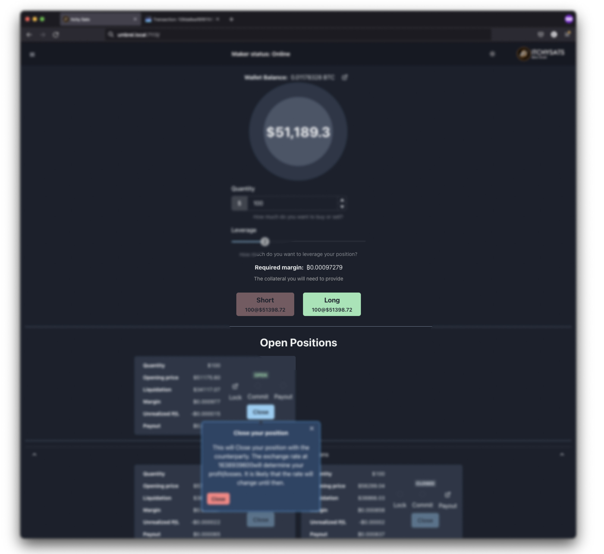
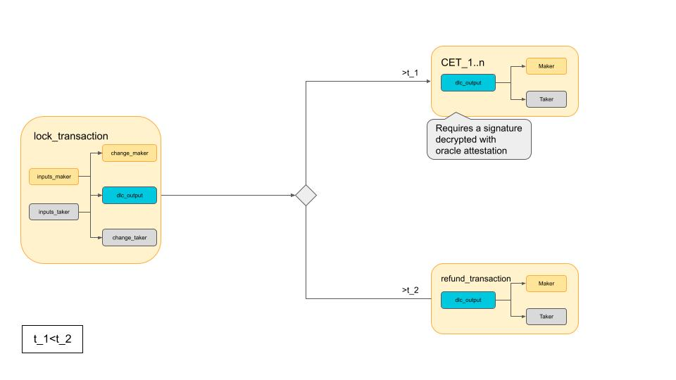
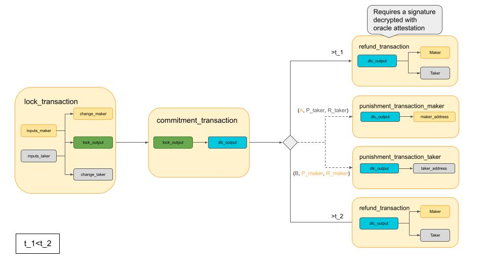
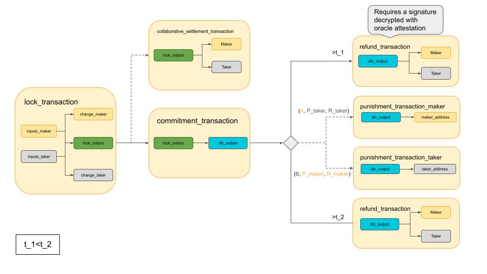

> *作者：lucas*
> 
> *来源：<https://comit.network/blog/2022/01/11/cfd-protocol-explained/>*


在 2021 年末，我们跟各位分享了创建[最出众的比特币去中心化交易所](https://itchysats.medium.com/itchysats-roadmap-to-the-most-awesome-bitcoin-dex-464a42bf4881)的计划。在那篇文章中，我们罗列了如何在那一年剩余的时间里将[我们的解决方案](https://comit.network/blog/2022/01/11/github.com/itchysats/itchysats)提升到更高层次。我们也承诺会给出我们的比特币 CFD（差价合约）的详细解释。这就是我们今天这篇文章的目的。

## 开启一个 CFD

如果你用过  `itchysats`，你可能看过这个 画面。在这个界面你可以吃掉挂单者创建的订单。



<p style="text-align:center">- 吃掉一个订单 -</p>


你点击界面中的按钮，界面就会告诉你，一个新的差价合约建好了。几秒之后，这个 CFD 会转变成新的  `Open（开启）` 状态，然后你可以看到一笔交易广播出去了。看起来一切都好，但你可能对发生了什么一无所知。

## 建立合约

点击按钮会给挂单者发送一条消息，告诉他们你希望用一定的杠杆率和数量接受他们的 CFD。如果他们同意了这个请求，应用就会开启 `contract_setup` （“合约建立”）进程：利用多条消息，交换开启 CFD 所需的双方公钥、地址和签名。

为了文章的简明，在此我们就不细述这些消息了；如果你想了解更多细节的话，欢迎你阅读代码。我们的 CFD 代码放在一个专门的仓储中：[maia](https://comit.network/blog/2022/01/11/github.com/comit-network/maia) 。

相反，我们会集中在这几轮通信的结果中：我们的差价合约实现的组成模块。



<p style="text-align:center">- 有限生命的差价合约 -</p>


### 锁定交易

参与一个差价合约的双方需要在区块链上锁定一些资金，这样协议才能强制执行打赌的结果 <sup><a href="#note1" id="jump-1">1</a></sup>。

 `lock_transaction` （“锁定交易”）会从各方处获得一个或多个输入。它会产生一个由挂单者和吃单者的资金合并而成的共享输出。下文我们会把这个共享输出称为 `dlc_output` 。具体含义我们到下一章再说。锁定交易也可能会包括给各方的一个或多个找零输出。

在 `contract_setup` 结束的时候，双方都可以获得这个安全签名的交易的副本。也就是说，挂单者也签名了自己贡献的所有输入，吃单者也是如此。因此，在跑完 `contract_setup` 流程时，任何一方都可以通过广播锁定交易，从而开启 CDF。不论是谁来广播，或者都广播，都没有关系：被广播的交易是同一笔。

在锁定交易被广播之前，任何一方都有机会退出正在建立的 CDF。如果他们用在锁定交易中的某个输入被用于零一笔交易，这笔锁定交易自然就无法挖出了（因为会被当成重复花费）。

### DLC 输出

如上所述，锁定交易的输入跟我们的协议有关的输出是 `dlc_output`（“DLC 输出”）。而 DLC（[谨慎日志合约](https://bitcoinops.org/en/topics/discreet-log-contracts/)）是一种取决于一个受信任的第三方（通常称为 “断言机”）所播报的事件结果产生资金分配结果的输出。依靠它的机制，我们可以让交易的花费条件依赖于区块链外部的事件。在我们这个差价合约的案例中，就是 BTC 的价格运动；我们以 BTC 的价格运动来结算差价合约。

DLC 输出是一个简单的  `2-of-2` 多签名输出，一个公钥 `A` 来自挂单者，另一个公钥 `B` 来自于吃单者。也就是说，需要挂单者和吃单者各提供一个签名，才能花费这个输出。

让 DLC 得以工作的东西是预先计算好的、以不同方式花费 DLC 输出的交易。这样的基于事件的结果来花费 DLC 输出的交易称为 “合约执行交易（CET）”。而断言机可以为某一笔 CET 赋能的办法则来源于 “适配器签名”<sup><a href="#note2" id="jump-2">2</a></sup>。我们会用一个简单的例子来展示它是如何工作的。

**CET 案例解释**

在我们这个例子中，挂单者和吃单者建立了一个非常简单的差价合约：如果在合约到期时， BTC 的美元汇率超过 40000，吃单者就赢走所有资金；而另一方面，如果 BTC 的美元汇率低于 40000，则挂单者赢走所有资金。因为只有两种可能的结果，所以我们只需要创建两笔 CET：一笔将 DLC 输出中的所有资金交给吃单者；另一笔把所有资金交给挂单者。

为了防止 CET 在锁定交易被广播之后立即被广播，双方都只向对方分享自己对每一笔交易的 *适配器签名*。这样的适配器签名只有在断言机播报（“*见证*”）价格之后才能被解密 和转化为常规的签名。

具体到我们这个案例中，在双方开始合约建立流程之前，断言机就已经 *宣布* 自己将会见证 24 小时之后的 BTC 美元汇率。断言机的身份以公钥 `O` 来表示，TA 将使用 `O`  背后的私钥以及一套已知的见证方案<sup><a href="#note3" id="jump-3">3</a></sup>，播报这个汇率。 断言机的 `announcemnt`（“宣言”）中包含了一个公钥 `K`，这个公钥代表断言机的承诺 —— TA 会在这个事件的  `attestation` （“见证消息”）中使用 `K` 背后的随机数 `k` 。这个一次性使用的随机数（nonce）（`k`）让断言机可以无限次见证不同的事件，而无需变换其用于发布见证消息的私钥 `o` <sup><a href="#note4" id="jump-4">4</a></sup>。

有了宣言中的 nonce 公钥 `K`、断言机的见证公钥 `O` 以及对价格区间的一个标识符（可用于解锁具体的 CET），参与这个差价合约的两方就可以构造出适配点（adaptor point），适配点则可用于产生相应的适配器签名（如上所述，他们仅向对方分享自己公钥的适配器签名）。举个例子，吃单者使用 `K`、 `O` 以及一个代表 `0-40k USD`（0 ~ 40000 美元）的标识符，就可以产生一个适配器点 `Y_short`。然后，TA 就可以用 `Y_short` 来加密自己的公钥 `B` 对那一笔把所有资金都分配给挂单者的 CET 的签名。在合约建立流程期间，吃单者把自己的适配器签名分享给挂单者。如果断言机见证了 BTC 的美元汇率低于或等于 40000，挂单者就可以解密这个签名并发布对应的 CET。

在实际操作中，我们整合 <sup><a href="#note5" id="jump-5">5</a></sup> 的断言机 `olivia` 不会见证代表一个价格区间的标识符，也不会见证一个具体的价格。相反，它会见证价格的二进制表示数值，一个接一个。这使得我们可以大量减少 CET 的数量，因此双方需要构造的适配器签名数量也大量减少。上面这个案例是一个简化版本，因为现实世界中 CFD 的可能结果通常会形成一条平滑的曲线。如果我们使用具体的价格，那么 CET 的数量会非常多，导致协议的存储效率和时间效率非常低下。

将支付曲线离散成区间，并使用播报 BTC 价格的二进制表示的断言机，意味着我们可以实现相对清楚的支付曲线，而无需将合约建立的流程拖得很长并占用惊人的存储空间。我们可能还会撰文讲解实现这些节约的规范，但还是鼓励你看看代码。如果你想了解更多，欢迎[向我们提问](https://matrix.to/#/!OSErkwZgvuIhcizfaI:matrix.org?via=matrix.org)。

### 退款交易

在上一节中，我们暗示了这个协议需要对第三方（断言机）的信任。即使你将这种信任分散到多个断言机，你也还是得准备应对在价格见证消息应该发布时太多断言机挂掉的情形。

如果只有 CET 能花费 DLC 输出，那么当 `olivia` 忘了发布对应于宣言的见证消息时，使用我们这套协议的资金就可能无法花费。

为了应对这种不太可能发生的情形，双方需要在合约建立流程中合作构造和签名一笔 `refund_transaction`（“退款交易”）。这笔交易会花费 DLC 输出，将挂单者和吃单者的资金按原比例返还。退款交易的输入会使用一个相对时间锁，从而保证这笔交易只能在锁定交易得到区块确认的一段时间之后才能挖出。这个相对时间锁的数值会设置得双方都有足够长的时间来发布 CET（即只要 `olivia` 发布了有效的见证消息，对应的 CET 就可以上链）。

## 永续 CFD

前面一个章节是对我们的 CFD 协议的第一个版本的准确描述。但是，在实现它的过程中，我们意识到我们还有一个尚未满足的要求：根据定义，CFD 必须没有到期日。

现在，我们还不能容易地选取来自传统金融世界的工具（例如差价合约）并在区块链上准确地重新制作出来。我们很可能总是需要预先定义出一个时间点，好让某一方能单方面结算 CFD（在见证消息发布后把 CET 发布上链）。要是没有这个终止点，不合作的对手方就可以无限期冻结你的资金。

但是，我们依然可以允许在双方一致同意时刷新合约的生命周期，从而越过此前约定的到期时间、模拟出传统差价合约的永续特性。



<p style="text-align:center">- 永续的差价合约 -</p>


### 延期

给一个 CFD “延期（Rollover）”，就意味着我们将添加一组全新的 CET，它们将依赖于更遥远的未来被见证的事件结果。构造新 CET 的过程跟前面讲述的没有什么差别。然而，想要直接花费锁定交易，可就不行了。最初在合约建立流程中创建的那一组 CET 依然是完全有效的，所以，虽然理论上双方可以在相应的见证消息出现后也不发布 “旧” 的 CET，但这需要相互信任（即背叛的一方不会得到惩罚）。

幸运的是，这类问题在之前就已经有解决方案了，最著名的一个例子就是 “[闪电网络的撤销机制](https://github.com/lightning/bolts/blob/93909f67f6a48ee3f155a6224c182e612dd5f187/05-onchain.md#revoked-transaction-close-handling)”。在开发出 “[广义的比特币兼容通道](https://eprint.iacr.org/2020/476.pdf)” 的[一个实现](https://github.com/comit-network/thor/)之后，我们确定了我们要在自己的 CFD 协议中使用相同的结构。

### 承诺交易

现在，锁定交易的输出要改称为  `lock_output`（“锁输出”） 。这个输出存在的目的只是为了让 CFD 的创建更加清晰。在锁定交易发布之后，双方将不再能退出合约；其输出也不再被 CET 直接花费。相反，我们要引入一笔 `commitment_transaction` （“承诺交易”），由这笔交易将锁输出转化为 DLC 输出。

而 DLC 输出，在现在协议中虽然变成了另一笔交易的输出，但其花费方式与前面的协议没有区别：一组 CET 定义了 DLC 输出如何根据 BTC 的美元汇率来分割。承诺交易的目的是为了保证 DLC 输出只能被一起构造的 CET 花费。

重要的是，退款交易的作用跟原来一样：它会花费 DLC 输出（现在是承诺交易的输出）。我们这里着重讲解 CET，但前一个章节对退款交易的描述放到这里依然城里。

举个例子，我们可以设想挂单者和吃单者一致同意延期一个 CFD，因为他们都相信日后的 BTC 价格波动会有利于自己。在合约建立流程中，他们创建并签名 `commitment_transaction_0` 以及相应的一组 CET。而在 `Rollover` （“延期”）流程中，他们要制作新的一笔 `commitment_transaction_1` 交易，以及全新的一组基于 `olivia` 的新宣言的 CET。因为他们都可以发布完全签名的承诺交易，所以他们最终可以发布 `commitment_transaction_1` 并根据来自 `olivia` 的新见证消息来结算 CFD。

### 惩罚交易

那么，要是某一方决定发布旧的一笔承诺交易、使用断言机所见证的旧的 BTC 价格来结算 CFD，该怎么办呢？这就完全违背了 CFD 延期的意义。这就是我们需要撤销机制的地方。

承诺交易的 DLC 输出有不止一种花费方式。它总共有 3 种花费方式：

```
1. 被 CET 花费（而双方手中的 CET 都只有对方的适配器签名，需要来自  `olivia` 的见证消息才能补成常规签名）
2. 被一笔 “退款” 交易花费，这是应对没有 CET 被  `olivia` 解锁的安全机制
3. 被各方的一笔  `punishment_transaction`（“惩罚交易”） 花费，当某一方发布一笔已被撤销的承诺交易时，另一方可单方面构造惩罚交易、取走 DLC 输出中的所有资金
```

在合约建立以及后续每一次延期流程中，双方都要一起为 DLC 输出添加另一个花费条件。他们各生成一对（用于撤销的）密钥 `(r, R)`，以及一对（用于发布的）密钥 `(p, P)` ，并将公钥分享给对方。DLC 输出不再是一个使用公钥 `A` 和 `B` 的简单 2-of-2 多签名输出。它的脚本还包括：

```
1. 挂单者知晓私钥 `a`、 `吃单者的 r` 和 `吃单者的 p` 就可以花费
2. 吃单者知晓私钥 `b`、 `挂单者的 r` 和 `挂单者的 p` 就可以花费
```

双方不是交换对承诺交易的常规签名，而且创建一个适配器签名并交给对方。举个例子，吃单者使用挂单者的 P 加密自己的公钥  `B` 对承诺交易的签名（从而生成一个适配器签名）。稍后，挂单者可以使用自己的 p 解密吃单者的适配器签名；但是，一旦他们使用这个解密后的签名发布了承诺交易，自己的 p 就泄露给了吃单者。

此外，每次完成延期流程时，双方都必须交换自己在 上一笔承诺交易中使用的撤销私钥（ `r` ）。如果一方不愿意分享这个私钥，另一方应该立即广播新的承诺交易。不然，对手就可以选择在任意时间发布某一笔承诺交易；这会给予他们选择更有利的结算结果的选择权。

安排好所有这些之后，挂单者和吃单者就知道他们可以应对对手尝试花费已被撤销的（并非最新的延期操作或合约建立操作所创建的）承诺交易的情形。只要对手敢于这样做，他们就能知晓对手的私钥 p，加上在延期过程中知晓的对手的 r，就可以签名一笔交易，将 DLC 输出中的所有资金收入囊中。

显然，这种机制要求双方几乎全时段在线（并且需要存储对手提供的每一个 r）。他们必须时刻关注对手有没有发布已经被撤销的承诺交易。 每个 CET 都有一个相对时间锁，所以被欺诈的一方有充足的时间可以发布惩罚交易。

### 在区块链上合作

如你们所见，这套 CFD 协议是非常有用的。这套系统让我们可以模拟传统 CFD 的机制，并且保护所有相关方的资金，而且是在区块链这样你无需信任任何人的环境中。

但我们也必须指出另一重局限性：我们无法随时清空仓位；这是我们希望克服的另一点。在传统金融中，你可以随时关闭差价合约，拿走你的盈利或承担你的损失。而在我们的比特币 CFD 中，我们只能等待断言机发布对应于合约建立或延期中的宣言的 BTC 价格的见证消息。



<p style="text-align:center">- 合作式结算的 CFD -</p>


看起来是没有办法让任何一方都能随时单方面关闭 CFD 了，但是我们引入了另一种机制，在双方 *一致* 同意之时，可以早于见证消息发布的时间关闭仓位。我们管这种机制叫  `collaborative_settlement`（“合作式关闭”）。如果挂单者和吃单者一致同意以某一种结果结算 CFD，他们可以一起创建和签名一笔交易，直接花费锁输出。这意味着双方都要在线，并一致同意提前平仓 CFD。但是，如果条件不能满足，双方都知道他们依然可以依赖于常规的结算操作（CET），这是由密码学保证的。

## 展望未来

虽然我们对这套比特币 CFD 协议的成果好自豪，我们也知道，还有很多工作要做。我们的[路线图博文](https://itchysats.medium.com/itchysats-roadmap-to-the-most-awesome-bitcoin-dex-464a42bf4881)介绍了一些我们需要追踪的东西，但我们也在考虑别的一些优化和特性。

除了我们已经有想法的部分，我们也认为，实现不依赖于单个断言机的 CFD 非常重要。如前所述，基于 DLC 的协议需要信任断言机。但如果我们可以把这部分责任分散给多台断言机，它们勾结和故障的可能性都会大幅降低。更具体地说，有了多个断言机，通过 CET 来结算的 CFD 就不再依赖于单个断言机。相反，我们将使用多个断言机的见证消息来决定哪个 CET 可以执行。举个例子，我们可以实现一种 4-of-7 的机制，7 个断言机中的简单多数才能决定解锁哪一笔 CET。

这个领域还有许多我们密切关注的正[在进行的研究](https://github.com/discreetlogcontracts/dlcspecs/blob/master/MultiOracle.md)。你可以在开源的代码库中跟进我们这个[协议](https://comit.network/blog/2022/01/11/github.com/comit-network/maia)和  `itchysats` 的进展。如有问题，欢迎加入我们的公开频道：[Telegram](https://t.me/joinchat/ULycH50PLV1jOTI0) 和 [Matrix](https://matrix.to/#/!OSErkwZgvuIhcizfaI:matrix.org?via=matrix.org)。

## 脚注

1.<a id="note1"> </a>就其核心，差价合约就是对资产未来价格的打赌。 <a href="#jump-1">↩</a>

2.<a id="note2"> </a>我们所用的、由适配器签名赋能的 DLC 输出基于 *[dlcspecs](https://github.com/discreetlogcontracts/dlcspecs)*，这个项目正在为谨慎日志合约开发一套规范。它跟 [Dryja 最初的工作](https://adiabat.github.io/dlc.pdf) *不同*。 <a href="#jump-2">↩</a>

3.<a id="note3"> </a>这样的见证方案通常是签名方案，比如 Schnorr 签名。实际上我们使用一种更简单的、由我们整合的独立断言机的方案。想了解更多信息，请在我们的 CFD 协议代码库中查找 `olivia` 以及[这个模块](https://github.com/comit-network/maia/blob/55ba9f2e4f0ff40b0b2e89458fbbbe2dadceb913/src/oracle.rs)。 <a href="#jump-3">↩</a>

4.<a id="note4"> </a>如果不使用 nonce（一次性随机数），或者更常见的，多次使用同一个 nonce，会导致这个断言机的见证私钥在见证结果后泄露。（译者注：即使用同一个 nonce、同一个私钥对不同消息签名会导致私钥泄露。） <a href="#jump-4">↩</a>

5.<a id="note5"> </a>重点是保证断言机不属于参与 CFD（广义来说是 DLC）的任何一方。否则他们就有可能为了自己的利益而干预结果。 <a href="#jump-5">↩</a>