> *作者：ajtowns*
> 
> *来源：<https://delvingbitcoin.org/t/chia-lisp-for-bitcoiners/636>*


我准备 [再续](https://lists.linuxfoundation.org/pipermail/bitcoin-dev/2022-March/020036.html) [前言](https://lists.linuxfoundation.org/pipermail/bitcoin-dev/2023-October/022099.html)，探讨如何为比特币脚本编程设计 Lisp 语言的一种变体，但深入细节之前，我发现，总结一下 [Lisp 在 Chia 区块链上是什么样子](https://chialisp.com/)，可能会有帮助，因为这给人们反馈的许多问题提供了很好的答案。如果你觉得文章的这个主题有趣，就读下去；如果你觉得无聊，那么也可以记得这篇帖子，这样你可以跳转回来，在日后读到我将本文内容作为前置知识、你又认为是有趣文章的时候！

本文假设你已经熟悉了比特币和 [Bitcoin Script](https://en.bitcoin.it/wiki/Script)，但还不熟悉 [Chia 区块链](https://en.wikipedia.org/wiki/Chia_(cryptocurrency))和 [Lisp 编程语言](https://www.buildyourownlisp.com/)。本文会采用逐步推导的方法，不会深入到关于实现方式的任何细节。

对于已经熟悉 Chialisp 的读者来说，请注意，我主要谈论的是 [clvm](https://chialisp.com/clvm/) 的动作（即，在 Chia 区块链的共识中实现、在链上可见的部分），而不是 Chialisp 本身（你用来编写复杂程序的语法；其代码会被编译到 clvm 中运行）。

## 为什么？

为什么这个问题值得思考？不论如何，Bitcoin Script 是一个非常小的语言，本质上是一个小巧的、基于堆栈的逆波兰表达法（PRN）计算器；它足够结实，已准备好取代中央银行的清算所，而且有足够多的可编程性，可以做出许多小玩意儿。但从一名程序员的角度看，作为一种编程语言，有两件事它做得不好：循环和结构化数据。

原生不能制作循环，意味着重复做同一件事的脚本在几轮之后就会变得烦人，比如说 “[Lamport 签名和 CAT 技巧](https://delvingbitcoin.org/t/lamport-signatures-and-other-cat-tricks/236)”，有 20 个步骤，每一步都涉及一个 8 层的默克尔树，每一次都要单独说明默克尔树，而不是用两个循环解决问题 —— 如果有循环，那么 160 个步骤应该只构成 1 个循环。以往也一直有关于向 Bitcoin Script 添加可以启用循环的构造的思考，比如 [BIP 12 OP_EVAL](https://github.com/bitcoin/bips/blob/b3701faef2bdb98a0d7ace4eedbeefa2da4c89ed/bip-0012.mediawiki) 和 [BIP 117 Tail Call Semantics](https://github.com/bitcoin/bips/blob/b3701faef2bdb98a0d7ace4eedbeefa2da4c89ed/bip-0117.mediawiki) ，两者都显式限制为禁用循环（或者说 [OP_FOLD](https://lists.linuxfoundation.org/pipermail/bitcoin-dev/2022-February/020021.html)）。

不能原生处理结构化的数据不算一个大问题：你可以通过使用多种堆栈轮换操作码（将数据在栈层中上下移动）来绕过这个问题；然而，如果真的要在实践中这么做，就会很烦人。举个例子，部分近期提出的脚本升级提议都建议了能够应用多一些结构的更改，例如：

- [OP_VAULT](https://github.com/bitcoin/bips/pull/1421) 让你可以指定少量数据，将它们编码为最小化的数据推入，作为给定的 `leaf-update-script-body` 的前缀。
- [OP_SEGMENT](https://rusty.ozlabs.org/2024/01/04/OP_SEGMENT.html) 提议引入一种类似于代码分隔符的操作码，自身并不做任何事，但可以用来隔离 `OP_SUCCESSx` 动作的影响，从而可以在脚本内部操作脚本的片段。
- [还有一种为 CHECKSIGFROMSTACK 而提议的想法](https://twitter.com/reardencode/status/1760324791343665396)，也允许指定额外最多 16 个比特的消息数据，该消息会被哈希并决定实际发生的签名验证操作

Chia Lisp 所采取的解决这些限制的方法，可能是最简单的：

- 它添加了一种 “应用” 操作码（`a`），该操作码允许递归，因此可以用来制作循环；
- 它将堆栈的概念替换成了二叉树（binary tree）的概念 —— 任何元素，要么是一个叶子节点（叫做 “atom”），即只是一个字节串（跟现在的堆栈元素一样）；要么是一个分支节点，包含了一对元素（叫做 “cons”），这些元素自身又可以是分支或者叶子。

在 Lisp 中，常见的做法是，程序会用相同的数据结构编码，从而，程序可以用操作任何其它数据结构的相同操作来内省自身。

## 制作列表

不过，Lisp 以其列表（而非二叉树）而知名，所以上述段落可能会让你稍微有点意外。不过，这很容易解释：Lisp 的列表就是递归地创建出来的，其中列表的第一个元素就放在一个 cons 的左边，而列表剩余的元素就放在右边，而空的列表被定义成空的字节向量，也就是众所周知的 “nil”。我们有一套特殊的记号：

- `()` 是一个空的列表，也是空的字节向量
- `(a . b)` 表示一个 cons，或者说一个分支元素，其中 `a` 在左边、`b` 在右边
- `(a b c d)` 表示一个包含四个元素的列表，等价于 `(a . (b . (c . (d . ()))))`
- `(a b c d . e)` 表示一个 “有断点” 的列表，以 `e`（而不是隐式的 `nil`）结尾，也即等价于 `(a . (b . (c . (d . e))))`

这意味着，`(a b . (c d))` 只是编写 `(a b c d)` 的另一种方法。

关于一个列表，如果你只看每一个 cons 的右边项，直到遇到一个 atom（即一个字节向量，也是一个叶子节点），那么要么这个字节向量是空的，说明这是一个正常的列表，也叫 “规整的列表”；要么，它不是一个空向量，从而这是一个 “不规整” 的列表。

如果你也像我一样，听过 “[car 和 cdr](https://en.wikipedia.org/wiki/CAR_and_CDR)”，但不明其意，那么，`car` 意味着取一对元素的左边项，`cdr` 以为这取右边项，它们来自于最初的 Lisp 的实现细节。我个人认为，最好管它们叫 “头” 和 “尾”（就像其它[函数式编程语言](https://hackage.haskell.org/package/base-4.19.1.0/docs/Data-List.html)的常见叫法一样）；或者，像 Common Lisp 和 Chia Lisp 那样，叫 “第一项” 和 “其余项”。

## 针对列表的操作码

然后，拓展出对一列参数的操作码就非常直接的，例如，我们不需要再使用 `OP_ADD` 从栈顶中取出两个元素并加总，我可以定义出 `+` 操作码，预期传入一列数值，然后输出这一列数值的和。然后，我们只需将操作码和它的参数组合成一对，即 `(+ . (1 2 3))`，就可以了；当然，如前所述，这跟 `(+ 1 2 3)` 的写法的意思是一样的，并且后者也成了我们程序中的表达式的通用记号。

## 运行环境

我们希望能够编写能够应用到一些 “用户输入” 上的程序，为此，我们定义一个叫做 “环境” 的概念，就是程序可以访问的东西。环境只是另一个列表（或者说二叉树），但我们有一种更聪明的办法来访问列表的任一部分，就通过整数。具体来说，`1` 会让我们得到整个式子；`2` 则会让我们得到左分支；`3` 会让我们得到右分支；`4` 会得到左分支的左分支；`6` 会得到左分支的右分支，等等。



通用的程序如下：

```
def get_env(n, e):
  if n == 0: return nil
  while n > 1:
    if n % 2 == 0:
      e = e.left
    else:
      e = e.right
    n //= 2
  return e
```

所以，如果环境是一个列表 `(1 2 3)`，那么 `get_env(2, env)` 会得出 1，而 `get_env(5, env)` 会得到 2，`get_env(11, env)` 会得到 3，而 `get_env(15, env)` 会得到整个列表的最后一个元素，`nil`。

因此，如果你想要程序 “ (a\*b)+c ”，你可以写成 `(+ (* 2 5) 11)`，这些数字会被视为环境查找，如果环境是 `(1 2 3)`，那么结果就是 `(1 * 2) +3 = 5`。

## 引用

要是你想让一个数字变成 3 倍大，而不是乘以某个由用户指定的输入，那该怎么办呢？这时候你可以 “引用” 数值，以避免将它解析成环境查找或者作为一个表达式来求值。这涉及到一个特殊的操作码 `q`，它的求值规则跟其它每一种操作码都不同。它的动作非常简单：它的结果就是我们传入的参数，没有任何求值过程。它的特殊性还在于，它的参数并不非得是一个规整的列表（以 nil 结尾的列表）。

所以，如果你想计算的是 `(a*b)+(3*c)`（而非 `(a*b)+c`），你可以写成 `(+ (* 2 5) (* (q . 3) 11)` 。

## 求值

抽象地说，对程序求值的过程是这样的：

- 如果这个程序是一个 atom，就认定它代表一个数字，然后基于这个数字来查找环境。查到的答案就是程序的结果。
- 如果这个程序是一个 cons，那就取前面的一项（左边项），并视之为操作码，然后将其余项视为参数；
  - 如果这个操作码不是 atom，也不是一个 atom 和 nil 的 cons，那么程序运行失败。如果这个 atom 不能匹配已知的操作码，也失败（或者，在一个不严格的模式中，会将它视为 no-op（无动作操作码），并作为 nil 求值）。
  - 如果操作码是 `q`（即一个字节的 atom，0x01），那就返回全部参数。
  - 否则，用参数求值：
    - 如果参数是 nil，终止；
    - 否则，如果参数是一个 cons，递归地将第一个元素（即左边项）作为一个程序、将它传入操作码，然后继续处理剩余的元素（右边项）；
    - 如果它既不是 nil，也不是 cons，就传出错误。
  - 返回给操作码传入处理过的参数的结果。

注意，这是一种 “急迫求值” 方法：例如，“if-then-else” 操作码（`i`）会接受三个参数，一个 “条件”、一个 “那么” 数值以及一个 “不然” 数值，但是，它不会短路，所以无论条件语句是否为真，“那么” 和 “不然” 的数值都会计算出来，即使其中一个会被立即抛弃掉。这一特性非常重要，在你想要制作 递归/循环 结构，又要评估程序的执行开销的时候。

此外，在 Chialisp 中，数字表示成有符号的、补码的（2’s-complement）大端序（big-endian）形式（或多或少与比特币使用一个符号比特及小端序的方法正好相反）。数字可以任意大，不限制在 4 字节或者 64 比特、128 比特、256 比特，相反，它们受到的是程序作为整体求值的时候的总开销。

## 操作码

跟前面介绍的 `q` 一样，还有很多其它操作码：

| 操作码（名称）          | 参数            | atom 数值 | 描述                                                         |
| ----------------------- | --------------- | --------- | ------------------------------------------------------------ |
| `q`（引用）             | ...             | 0x01      | 特殊操作码，返回未求值的参数                                 |
| `a`（应用）             | A B             | 0x02      | 利用环境 B 对程序 A 求值                                     |
| `i`（if）               | C T E           | 0x03      | 如果 C 不是 nil，那就运行 T，否则运行 E                      |
| `c`（cons）             | L R             | 0x04      | 使用 L 和 R（分别作为左边项和右边项）制作一个 cons           |
| `f`（第一项）           | C               | 0x05      | 返回 C 的左边项；如果 C 是一个 atom，就失败                  |
| `r`（其余项）           | C               | 0x06      | 返回 C 的右边项；如果 C 是一个 atom，就失败                  |
| `l`（listp）            | X               | 0x07      | 如果 X 是一个 cons，就返回 1；否则就返回 nil                 |
| `x`（raise）            | ...             | 0x08      | 让程序立即失败                                               |
| `=`（相等）             | \*A \*B         | 0x09      | 如果 A 和 B 都是 atom，并且相等，则返回 1；否则返回 nil      |
| `> s`（gr_bytes）       | \*A \*B         | 0x0a      | 如果在都解释成字节串的时候 A 大于 B，就返回 1；否则返回 nil  |
| `sha256`                | \*A \*B \*C ... | 0x0b      | 计算参数的拼接结果的 SHA256 哈希值                           |
| `substr`                | \*A \*B \*C     | 0x0c      | 返回 A 在 B 与 C 之间的子字符串                              |
| `strlen`                | \*A             | 0x0d      | 返回 A 的长度                                                |
| `concat`                | \*A \*B \*C ... | 0x0e      | 返回拼接了所有参数后得到的 atom                              |
| `+`（加法）             | \*A \*B \*C ... | 0x10      | 返回 A + B + C                                               |
| `-`（剑法）             | \*A \*B \*C ... | 0x11      | 返回 A - B - C                                               |
| `*`（乘法）             | \*A \*B \*C ... | 0x12      | 返回 A * B * C                                               |
| `/`（除法）             | \*A \*B         | 0x13      | 返回 A/B                                                     |
| `divmod`                | \*A \*B         | 0x14      | 返回 A/B 和 A % B（一对数据）                                |
| `>` （gr）              | \*A \*B         | 0x15      | 都解释成数字的时候，如果 A 大于 B，则返回 1；否则返回 nil    |
| `ash`                   | \*A \*B         | 0x16      | 返回 A 经过 B 个比特的算术移位的数值（即，使用符号插件）     |
| `lsh`                   | \*A \*B         | 0x17      | 返回 A 经过 B 个比特的逻辑移位的数值（即，作为无符号整数）   |
| `logand`                | \*A \*B \*C ... | 0x18      | A、B、C 的按位与操作（面对负数值，动作与 python 的 `&` 一样） |
| `logior`                | \*A \*B \*C ... | 0x19      | A、B、C 的按位或操作                                         |
| `logxor`                | \*A \*B \*C ... | 0x1a      | A、B、C 的按位异或操作                                       |
| `lognot`                | *A              | 0x1b      | A 的按位反转                                                 |
| `point_add`（`g1_add`） | *P1 *P2 ...     | 0x1d      | G1 点的 BLS12-381 加法（在 CHIP-11 中重新命名）              |
| `pubkey_for_exp`        | *A              | 0x1e      | BLS12-381 创建一个 G1 点（令 A 乘以生成元）                  |
| `not`                   | A               | 0x20      | 如果 A 是 nil，就返回 1；否则返回 nil                        |
| `any`                   | A B C...        | 0x21      | 如果 A、B、C 等等中任何一项不是 nil，就返回 1；否则返回 nil  |
| `all`                   | ...             | 0x22      | 如果 A、B、C 等等全部都是 nil，就返回 1；否则返回 nil        |
| `softfork`              | \*C \*E P A     | 0x24      | 使用环境 A 求值 P（就像一个操作码），但新的动作由 E 定义，代价为 C |

带星号的参数都必须是 atom；如果传入的是 cons，则程序会立即失败。（不过，请注意，这一限制仅仅会应用在参数被求值的情形中。）

此外，还有一些操作码是由 [CHIP-11](https://github.com/Chia-Network/chips/blob/b096b5735989b243f7c2dec8533aa0080d084dc8/CHIPs/chip-0011.md) 添加的；最初是通过 `softfork` 操作码使用插件 0 加入的，但在 [CHIP-12 硬分叉](https://github.com/Chia-Network/chips/blob/b096b5735989b243f7c2dec8533aa0080d084dc8/CHIPs/chip-0011.md)之后，也变成了直接可用的操作码，因此也列在这里。

| 操作码（名称）         | 参数                      | atom 数值  | 描述                                                         |
| :--------------------- | :------------------------ | :--------- | :----------------------------------------------------------- |
| `coinid`               | *PARENT *PUZHASH *AMOUNT  | 0x30       | 返回给定父 coin、puzzle 哈希值和数额的 coinid ；如果任何一个参数是 无效/非公认的，就失败 |
| `g1_subtract`          | *A *B *C …                | 0x31       | G1 点的 BLS12-381 减法（A-B-C）                              |
| `g1_multiply`          | *P *S                     | 0x32       | G1 点 P 和标量 S 的 BLS12-381 乘法                           |
| `g1_negate`            | *P                        | 0x33       | G1 点 P 的 BLS12-381 镜像点                                  |
| `g2_add`               | *A *B *C …                | 0x34       | G2 点的 BLS12-381 加法                                       |
| `g2_subtract`          | *A *B *C …                | 0x35       | G2 点的 BLS12-381 减法（A-B-C）                              |
| `g2_multiply`          | *P *S                     | 0x36       | G2 点 P 和标量 S 的 BLS12-381 乘法                           |
| `g2_negate`            | *P                        | 0x37       | G2 点 P 的 BLS12-381 镜像点                                  |
| `g1_map`               | *DATA *DST                | 0x38       | 使用可选的域分隔标签，将任意数据（通过哈希）映射成一个 BLS12-381 G1 点 |
| `g2_map`               | *DATA *DST                | 0x39       | 使用可选的域分隔标签，将任意数据（通过哈希）映射成一个 BLS12-381 G2 点 |
| `bls_pairing_identity` | *G1_1 *G2_1 *G1_2 *G2_2 … | 0x3a       | 如果所有给定数据对的配对都是同一个身份，则返回 nil，否则直接失败 |
| `bls_verify`           | *G2 *G1_1 *M1 *G1_2 *M2 … | 0x3b       | 如果签名（G2）对于给定的消息（Mn）和公钥（G1_N）是有效的，就返回 nil； |
| `modpow`               | *B *E *M                  | 0x3c       | 返回 B 的 E 次方对 M 取模的结果                              |
| `%`                    | *N *D                     | 0x3d       | 返回 N % D                                                   |
| `SOFTFORK`             | *C [unspecified]          | 0x5a       | 用于未来更新 Chialisp 程序可以返回的条件类                   |
| `secp256k1_verify`     | *P *M *S                  | 0x13d61f00 | secp256k1 曲线上的 ECDSA 签名检查（公钥 P、消息摘要 M、签名 S） |
| `secp256r1_verify`     | *P *M *S                  | 0x1c3a8f00 | secp256r1 曲线上的 ECDSA 签名检查（公钥 P、消息摘要 M、签名 S） |

值得指出的一件事情是，Chialisp 只有少数操作码用作流程控制和数据操作：`q`, `a`, `i`, `c`, `f`, `r`, `x`（只有 7 个）；不像 Bitcoin Script，有  `if`, `notif`, `else`, `endif`, `verify`, `return`, `toaltstack`, `fromaltstack`, `ifdup`, `depth`, `drop`, `dup`, `nip`, `over`, `pick`, `roll`, `rot`, `swap`, `tuck`, `2drop`, `2dup`, `3dup`, `2over`, `2rot`, `2swap`，总计 25 个。实际上，因为可以通过使用整数来指定位置、轻松访问环境的任何一部分，等于有了任意多个 “堆栈访问” 操作码。

## 软分叉操作码

Chialisp 也不使用一系列可升级的 NOP 操作码或者 taproot 的 `OP_SUCCESSx` 操作码，而是使用一个封装器函数（`softfork ...`），它接受 4 个参数：

- 一个程序和环境，会跟使用其它操作码（`a ...`）类似地将环境解释成参数，只不过其新动作 是以软分叉来定义的
- 一个代码，指定应该应用到这个程序中的软分叉（们）
- 求值该程序的预期总开销（这样，即使旧版软件没有实现程序所指定的软分叉，也能正确计算程序的共识关键开销）

这本质上就是一种延展了的 `OP_NOP` 操作码 —— 软分叉操作码的结果总是 nil ，所以可以在一个软分叉程序中实现的唯一增量动作就是让脚本完全失败，这跟通过 `OP_NOP` 操作码向 Bitcoin Script 引入新功能完全一样。区别在于，向 lisp 中的 `softfork` 操作码提供复杂的参数更加容易，可以包含一个使用许多新操作码的程序；而在 Bitcoin Script 中，想要做到同样的事情就没那么简单了，（仅仅）因为你需要定义一种指定这些复杂参数的新方法。

## 条件

你可能会注意到，在 Chia 的初版操作码列表中，并不包含 “CHECKSIG（检查签名）” 这样的操作码。这是因为，它不采用 Bitcoin Script 那种返回布尔值来确定脚本成功或者交易无效的方法，Chialisp 的方法是返回一组需要进一步验证的 “[条件](https://chialisp.com/conditions/)”，通常是交易区块的上下文。这包含了（聚合的）签名验证，但也可以包含 “这个 coin 必须同时被花掉” 这样的要求。

我不准备解释这种动作的细节，因为绝大部分都不能容易地映射到比特币中，而且不管怎么说，本质上它是 lisp 脚本编程的一个独立层。

## 递归和循环

给定这些原语，循环会是什么样的？考虑一个普通的例子，计算一个阶乘：

- `f(1) = 1`
- `f(n+1) = (n+1) * f(n)`

[clvm 对此的实现](https://github.com/Chia-Network/clvm_tools/blob/b78d414703fe9a0c1cb3f81a8ad9b42a33768dd8/README.md?plain=1#L50)看起来是这样的：

- `(a (q a 2 (c 2 (c 5 ()))) (c (q a (i (= 5 (q . 1)) (q 1 . 1) (q 18 5 (a 2 (c 2 (c (- 5 (q . 1)) ()))))) 1) 1))`

它可以分解成这些动作：

- `(a (q . PROGRAM) (ENV))` —— 使用环境 ENV 运行 PROGRAM

- `PROGRAM = (a 2 (c 2 (c 5 ())))` —— 在环境的 2 号槽运行程序，在一个新环境的上下文中（新环境跟现有环境几乎完全一样）

- `ENV = (c (q . APPLYIF) 1)` —— 使用 APPLYIF 在 2 号槽创建一个新环境，而当前的环境放在 3 号槽中

- `APPLYIF = (a (i (= 5 (q . 1)) (q q . 1) (q * 5 (a 2 RECURENV)) 1)` —— 检查 5 号槽的数值是不是 1，如果是，则作为 `(a (q . 1))` 来求值；否则，就作为一个递归调用，`(a (* 5 (a 2 RECURENV)) 1)`。`(a (i X (q . Y) (q . Z)) 1)` 模式让你有一种短路的 if，即使 `i` 操作码原生并不支持这种动作。

- `RECURENV = (c 2 (c (- 5 (q . 1)) ())))` —— 对参数的递归步骤变更； 2 保持原样、5 要从中减去 1、7 成为 nil


## 编译

将数值放在环境的正确位置、保证它们被正确引用，需要大量的微小操作，你从上面这些 `c` 和 `q` 调用中就能看出来；那么，手动保证它们全都正确是非常难的。这就要讲到 “Chialisp” 和 “clvm” 的区别。相比上面的 clvm 代码，阶乘 的 [Chialisp 代码](https://chialisp.com/modern-chialisp/)看起来就像非常普通的函数式程序：

```
(mod (INDEX)
    (defun factorial (VALUE)
        (if (= VALUE 1) 1 (* VALUE (factorial (- VALUE 1))))
    )
    (factorial INDEX)
)
```

它剋以给我们一些启发：

- `defun` 让你可以定义（可能是递归的）函数，可以像操作码那样处理它，而不是只能用 `a` 操作码来手动调用它们
- 不像 `clvm`，你不需要引用数字；在你想要访问环境的时候，你可以使用命名，编译器会决定把它放在环境的哪个位置。显然，在翻译成 clvm 代码的时候，编译器会引用那些数字（你可以使用 `@` 来直接访问环境，如果你出于某些理由不想使用命名的话）
- `if` 是一个支持短路的宏，与 `i` 操作码不同

一个值得强调的技巧是，chialisp 通常并不检查是否提供了额外的参数。以上面的 “阶乘” 举例，在提供输入 `(5)` 的时候，生成好的 clvm 代码会正确算出 `120` 作为结果；而如果输入是 `((10))`，则会给出一个 `= on list` 类型错误；或者，如果提供的输入是 `5`，则会出现 `path into atom` 错误；但是，如果给出的是延展了的列表 `(5 13)`，它又会计算出 `120` 作为结果 —— 它只取这个 cons 的左边项（数值 5），也不检查这个 cons 的右边项是不是 nil，而是直接将它们完全忽略掉。这产生了一种第三方熔融界面（third party malleability vector）；不过，虽然这在比特币的语境下可能会成为一个问题（第三方熔融会降低交易的实际费率，使得确认该交易的激励下降，而且会引入一个相互冲突、令人困惑的 wtxid），但在 Chia 的语境下可能不是大问题（因为 “捆绑” 给出了将未被引用的 atom 优化出去的机会）。

在抽象层面上，Chialisp 还有许多其它特性，包括可以 `包含` 来自其它文件的代码的能力，而且可以任意添加或者改变受到支持的特性，无需共识变更。在一定意义是上，你可以认为 Chialisp 类似于 miniscript 的 policy 语言；而 clvm 代码类似于 miniscritp/script 代码。

## 编码

如你所想，clvm 程序/数据 以二进制格式表示，而不是以  ascii 格式表示。其编码是非常直接的：

| 首字节       | 附加字节 | 含义                                  |
| :----------- | :------- | :------------------------------------ |
| `b0xxx_xxxx` |          | 具有相同数值的 1 字节 atom            |
| `b1000_0000` |          | 零字节 atom（nil）                    |
| `b10xx_xxxx` |          | 后面是 1-63 字节的 atom               |
| `b110x_xxxx` | 1        | 后面是 0-8,191 字节长的 atom          |
| `b1110_xxxx` | 2        | 后面是 0-1,048,575 字节长的 atom      |
| `b1111_0xxx` | 3        | 后面是 0-134,217,727 字节长的 atom    |
| `b1111_10xx` | 4        | 后面是 0-17,179,869,183 字节长的 atom |
| `b1111_110x` |          | 无效                                  |
| `b1111_1110` |          | 无效                                  |
| `b1111_1111` |          | 后面是 cons 元素                      |

这种格式确实意味着，同一个数据有多种编码形式，例如，单字节的 atom `0x42` 可以编码成单字节的 `0x42`，也可以编码成两字节的 `0x8142`，或者三字节的 `0xc00142`，等等。

它可能也没有为其应用场景而充分优化：每一个列表中的每一个条目都需要一个 `0xff` 标志，还需要一个 `0x80` nil 终止符；线性开销在 MB 乃至 GB 级别的 atom 上保持的更好（而在更小体积的列表上反而没那么好）。

相比 Bitcoin Script，clvm 对介于 17 和 127 （含）之间的单字节常量具有更低的开销，但对 64 ~ 75 字节的数据推入有更高的开销。后者会影响比特币中的签名，但不会影响 Chia 中的签名：BLS12-381 签名的长度大概是 96 字节，而且因为它支持配对，签名被设计成每个区块只有一个聚合签名，而每个区块有一个额外的字节开销，相比每一个被花费的 coin 都有字节开销，是微不足道的。这有一些影响：Chia 区块的开销限制意味着每个区块最多只能有 920 kB 的数据（如果你要加入实际的签名验证等等开销，还要少得多），而且体积是以序列化形式来度量的，所以被浪费的字节确实有一些影响。

## 开销

关于开销，[谨慎地统计开销](https://chialisp.com/costs/)是 Chialisp 允许灵活的计算原语而不会引入拒绝服务式攻击界面的原因（同样的界面导致了 Bitcoin Script 的一系列初版操作码被禁用）。

总体的区块开销限制是 11e9 ；每一个操作码都有一个开销，由三个部分组成：每种操作固定的开销、按参数数量计算的开销，以及按字节数量计算的开销。例如，`(* 0x10 0x2000 0x400000)` 有 3 个参数、6 个字节。此外，还有一个取决于返回的数值的体积的额外开销。最后，从一个脚本得到的条件也有巨大的开销（因为它们是导致资金被 花费/创建 以及签名被验证的原因）。此外，在最开始，还有一个为编码脚本而产生的按字节量计算的开销。

一个并不明显的区别是，在比特币中，我们的栈层数量限制是 1000，而一个元素的体积限制是 520 字节，所以，在任何时间点，一个程序最多只能占用 500 kB 的内存（虽然多种固定开销会让实际数值稍微大一些）。相反，Chia 很大程度上没有一种全时段贯穿的运行时限制，但是采用了一种总计算开销限制。这意味着，它很大程度上不会让你的程序变得更便宜，即使你设计成可以更早地释放内存。

我设想了一种程序，会使用大量的内存，但依然在 Chia 的开销预算内：

```
(mod (C) 
    (defun double (N X) (if (> N 0) (double (- N 1) (concat X X)) X))
    (double C "foo")
)
```

它仅仅是倍增 “foo” 字符串的长度，倍增次数则取决于你的要求。如果你说 “倍增 26 次” 吧，它会产生一个 200 MB 的字符串，而它的计算开销会是 5,234,558,878，依然略低于 Chia 区块的 11e9 限制的一半（交易池中的交易最多只能使用区块开销的一半）。

## 捆绑

Chia 和比特币开销的另一个并不显著的区别来自于 “[花费捆绑](https://docs.chia.net/spend-bundles/)”。这在很大程度上是支持自动签名聚合（automatic signature aggregation）的自然后果：交易不再是独立的，它们会成捆合并，然后它们的签名也会被聚合。不过，在签名被聚合的同时，它们的 lisp 交易也被捆绑在了一起，这自然允许一部分进一步的优化，例如：假定许多 coin 使用相同的脚本，只是公钥不同，你可以将脚本当成一个模板，为通过一个循环对相应的每一个 coin 重复使用。

对我来说，这样做的缺点有两重：

- 它让我们更难复用来自交易池已验证交易的缓存来加速区块验证；
- 它让区块组装变得更加复杂，而且在一个高度竞争的环境中，可能会增加中心化压力，并且编程一种审查界面。

所以，虽然它很整洁，我不会觉得将它引入比特币是好事，而且我几乎不把它当成一种特性。

## 工具箱

为了跟 clvm/chialisp 玩耍，起点似乎都是安装 [chia-dev-tools](https://github.com/Chia-Network/chia-dev-tools/) ；跟随 pip 安装流程，你会得到 `run`（一种 chialisp 编译器，可以生成 clvm 代码）、`brun`（一种 clvm 解释器，可以执行 clvm 代码）以及 `cdv`（可以做花里胡哨的事情，大部分我都不理解，也没有仔细看过）。我还没发现任何在线工具能够用来 编译/测试/调试，只能在本地安装软件。也有一种 [Rust 实现](https://github.com/Chia-Network/clvm_rs)，显然是更好的。

## 缺点

一个算得上有趣的事情是看看自发布以来，人们在 clvm 中发现了哪些缺点，又是如何解决的。我关注到的例子有：

- [除法结果不一致](https://www.chia.net/2022/03/04/divided-we-fork/)。这是一个 bug，`div` 操作码对负数值的动作不符合预期；通过让负数除法无法来修复；建议使用 `divmod` 操作码，仅在使用 `div` 可能更好的少数情形中才使用。
- [CATbleed](https://github.com/Chia-Network/post-mortem/blob/7889789f8ea6ae74a0783dbbb64845c2ea012930/2022-08/2022-08-19-CATbleed.md) 。这是一种智能合约编程错误（对哈希函数的输入的检查不充分，允许不同输入集得到相同的哈希值）；通过更新智能合约到新版本来修复，未来还通过引入一种新的 [coinid 操作码](https://github.com/Chia-Network/chips/blob/b096b5735989b243f7c2dec8533aa0080d084dc8/CHIPs/chip-0011.md#coinid)来缓解，这种新操作码会直接运行所有的检查。（这里的 CAT 指的是 “Chia 资产 token”，跟 `OP_CAT` 无关）
- [过度递归](https://github.com/Chia-Network/post-mortem/blob/7889789f8ea6ae74a0783dbbb64845c2ea012930/2023-01/2023-01-31-CLVM-infinite-recursion.md)。经由内部堆栈的用法未被统计到开销计量中（因而无法有效限制）的 bug 触发；通过加入一个堆栈深度限制来修复。
- 缺失功能。如上文所指出的，[CHIP-11](https://github.com/Chia-Network/chips/blob/b096b5735989b243f7c2dec8533aa0080d084dc8/CHIPs/chip-0011.md) 添加了许多操作码，涉及：BLS12-381 曲线上运行椭圆曲线密码学（ECC）、在 secp256k1 和 secp256r1 曲线上运行 ECDSA 签名检查、模幂运算，以及一种不需要额外步骤来抛弃除法结果的求模操作码。
- 缺失功能。[CHIP-11](https://github.com/Chia-Network/chips/blob/b096b5735989b243f7c2dec8533aa0080d084dc8/CHIPs/chip-0011.md) 和 [CHIP-14](https://github.com/Chia-Network/chips/blob/b096b5735989b243f7c2dec8533aa0080d084dc8/CHIPs/chip-0014.md) 添加了一些条件，即多种新的仅承诺 coinid 部分信息的签名（CHIP-11），以及反向时间锁条件（必须在某个时间点之前花掉）、并行的花费条件（花费交易必须跟 ...  发生在同一区块中），以及创建断言（正在被花费的资金是在某个时刻创建的）（CHIP-14）。

## 结论

不论如何，我认为，这篇文章以适量的细节介绍了 clvm/chialisp 的所有关键特性，只要你不是真的要开发 chia 脚本/合约（必须在一定程度上知道条件是如何工作的），就足够了。

注意，我并不是 lisp/clvm/chialisp 的专家，而且更关注 设计/潜能，而非细节，所以我的理解 以及/或者 描述可能会出错。无法担保，恕不尽言。

（完）