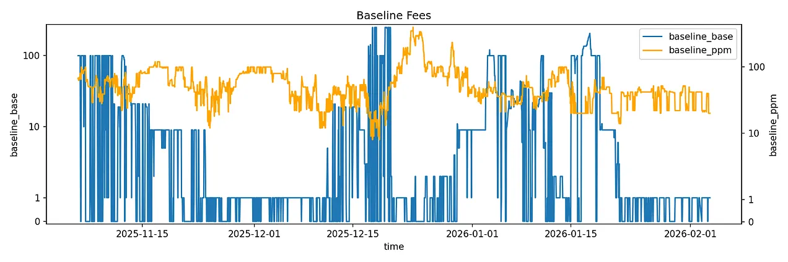
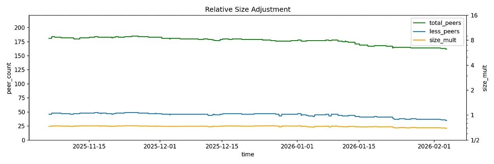
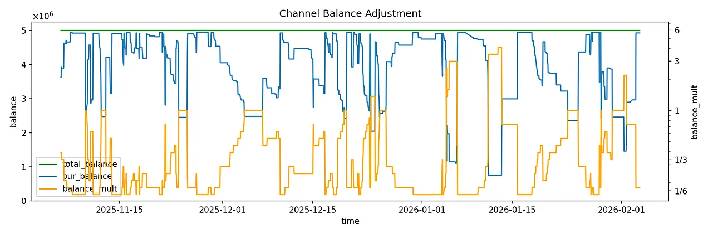
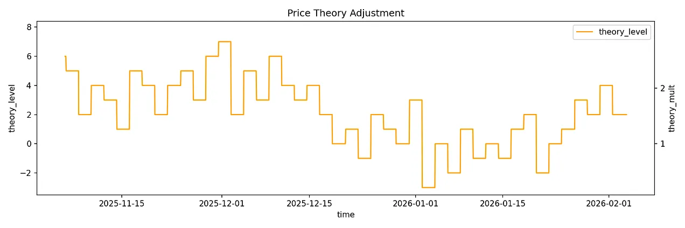
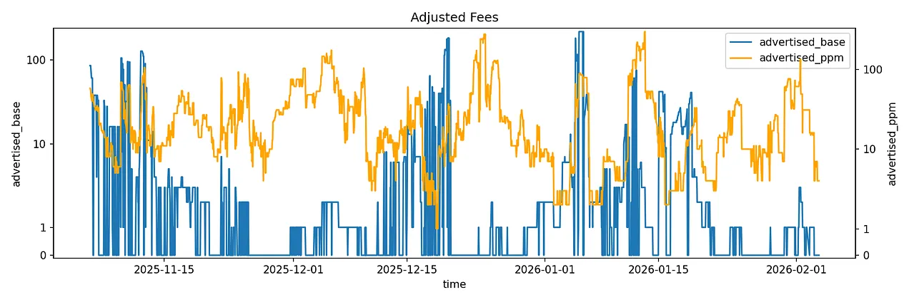

> *作者：TUMA*
> 
> *来源：<https://insider.btcpp.dev/p/clboss>*

运行一个闪电网络节点的最大挑战之一，就是流动性管理。简单来说，这里说的 “流动性” 指的是在一条闪电通道中你可以 “推给” 你的对手方、或者你可以从对手方那里 “拉过来” 的聪的数量。你需要准备好足够多的聪，才能完成支付。这就是所谓的 “流动性”，而确保你在需要的时候有足够多的聪可用，就是这里说的 “管理”。

节点运营者需要维护自己的公开通道，以使它可以持续地路由支付。随着支付完成、聪持续流向通道的某一端，就需要 “调平（rebalancing）”。“调平” 的意思是调整通道内的余额分布，让一个闪电节点在正确的方向上有足够多的余额来转发支付。绝大部分闪电节点运营者，都使用某一个服务或者手动来监控通道内的余额，以便介入流动性管理。

要是有一个项目，能够允许闪电节点有自动飞行模式呢？

## CLBOSS 来了

“[CLBOSS](https://github.com/ksedgwic/clboss)” 是一种为 Core-lighting 软件实现的自动化的流动性管理器。这个程序使用一组启发式分析，持续地监控本节点的通道余额及其通道对手的状态，以适应随着支付经过这些通道而不断改变的可用流动性。CLBOSS 的目标是让运行一个闪电网络节点简单到仅仅是安装一些软件、为钱包注入一些资金、为硬件提供互联网连接和电源。

CLBOSS 是从许多被称为 “模块” 的组件中开发出来的。每个模块都负责一个具体的职能，并通过一条共享事件的 “总线（bus）” 来相互通信。一条 <a href="https://en.wikipedia.org/wiki/Bus_(computing)">总线</a>就是一个通道通道，允许一个程序的不同部分交换信息和数据。各组件发布消息到总线中，并从总线订阅自己需要用于内部处理的消息，从而允许它们保持松散的耦合，同时协调它们的行为。

截至 2025 年，这个项目最初由闪电网络开发者 [ZmnSCPxj](https://github.com/ZmnSCPxj) 提出，正在由 [Ken Sedgwick](https://github.com/ksedgwic) 以及一小群闪电网络狂热爱好者维护。

虽然 CLBOSS （还）不允许完全自动化的管理，它已经可以在一个 core-lightning 节点上执行一些让人惊讶的操作：

- 它可以跟其它节点 *开启通道*，当区块链的手续费较低、资金又充足的时候。CLBOSS 内的一组模块可以提议开启通道的候选节点。然后，CLBOSS 会基于这个候选节点的持续运行时间来评估其健康。
- 它可以通过 [boltz.exchange](http://boltz.exchange/) 来购买 “*收款额度*”（也叫入账流动性），也就是将通道内的资金置换成区块链上的比特币。这个特性会在 CLBOSS 检测到收款额度的总量低于期望的门槛时触发。
- 它还会利用 “环路支付”（在自己的一条通道中发起支付、在另一条通道中收取支付）来 *调平* 已经开启的通道；既可以使用 “*按需调平* ”模式（在转发支付之前按需调平流动性），也可使用 “*盈利调平* ”模式（根据收益前景主动寻找调平机会）。这意味着，它会启动一笔通过一个环路给自己付款的支付、将节点的收款额度和付款额度推到新的状态。
- 它可以 *调整转发费率*，以支持通道余额并且在市场上保持竞争力。它会使用一组启发式分析来监控当前的手续费市场及其内部的状态。这个我们后文详说。

现在，我们来看看它的手续费调整模块是怎么实现的。

## 调整手续费

我个人认为，在上面提到的各项特性中，最后一项（自动调整手续费）是最有趣的。CLBOSS 会执行一系列的动作，将节点的收费条件保持在一个理想的水平上，这基于市场上的信号以及节点的通道的内部状态。 

基本上，CLBOSS 就像一个自动化的市场参与者，会根据竞争对手的收费条件变化、与对等节点的资金量相对大小、通道余额以及过往的收益，主动调整其流动性的价格。

价格调整算法有四个方面：基本费用、规模乘数、余额乘数，以及 ZmnSCPxj 称为 “价格理论” 乘数的东西。我们逐个来看。

### 基本费用

CLBOSS 为一条通道设置的基础费率，是通过观察你的通道对手的所有其它通道的费率集合来决定的。CLBOSS 会检查你的通道对手的每一条通道的入站方向，并计算它们的基础手续费和比例手续费的加权平均数（以各通道的容量加权）。

在这里，CLBOSS 的动作跟一个企业家没什么区别。它会检查竞争对手们为流动性收取多少费用，并以此作为本节点的基本价格。这样一来，它就能确保自己以一个对整个网络有吸引力（相对于其竞争对手）的价格进入市场。

- 基于通道对手的费率，调整本节点为转发支付而收取的基本费用以及比例手续费 -

### 规模乘数

然后，要在从上面得到的基本费用上应用三个乘数。

第一个乘数基于本节点的通道总容量与对等节点通道总容量的相对大小。当本节点的总容量相对较小，CLBOSS 就会应用一个较小的乘数；反之，则应用一个较大的乘数。

具体来说，CLBOSS 会根据本地节点大于或小于平均值来实施不同规则。如果本地节点的容量大于平均值，那么最终乘数将由一个指数函数来确定；而如果是小于平均值，那就用一个平方根函数来确定。

这背后的想法是，如果你的规模比自己的通道对手小，在手续费上打折，可以增加对你的节点的需求。反过来，更大的节点可以利用自己更高的路由容量（没错，就是能转发更大额度的支付）来赚取更多手续费，所以我们可以收费（相对）高一点。

### 余额乘数

另一个用来确定费率的乘数基于通道内的余额。

余额乘数使得手续费率能够根据简单的供给需求原理，对通道流动性的变化作出迅速反应。CLBOSS 将在己方余额较低时收取溢价，而在己方余额较高时提供折扣。

CLBOSS 还利用边际效用递减原理。事实上，CLBOSS 发现，在己方余额不多时以溢价销售它们，比己方余额较多时要更好；而在后面这种情形中，则应该通过打折来获得更多入账流动性。

### 价格理论乘数

CLBOSS 所用的最后一个调整价格的乘数，基于一种尝试最大化路由利润的迭代反馈机制。这个算法基于一种价格理论：假设没有局部最优解，只有一个全局最优解。

这个算法是这样的：

1. 在第一次迭代中，将 `price`（价格）设为 `0`；
2. 用 `price - 2` 、`price - 1`、`price`、`price + 1`、`price + 2` 等数值组成一副 “扑克牌”，然后洗牌。洗牌是必要的，为了防止被网络上的一些规律的周期性现象锁定你的策略；
3. 抽出牌堆最上面的一张牌，然后根据牌上的 `price` 数值来设定乘数。如果它的数值为负，就让乘数等于 `0.8^ (-price)`；如果数值为正，就让乘数等于 `1.2^price`。在使用这张牌期间转到的每一笔路由费，都会记录下来；
4. 两天之后，抽出另一张牌，根据新的 `price` 数值设定乘数。
5. 牌堆抽完时，找出带来最高收益的那张牌，作为新的 `price` 中值、创建新的牌堆，然后重新运行算法。

CLBOSS 这是在主动进行价格发现。一旦牌堆抽空，我们就用带来最大收益的 `price` 数值作为新的中值；这个数值意味着我们的节点处在最优运转状态时候的手续费率（从利润角度看运转状态）。这意味着，在后续的迭代中，我们将围绕新的 `price` 数值探索周围的空间，以此尝试收敛到全局的最优解。

虽然这张办法的效果，似乎比别的策略要慢，但它允许校正手续费率以获得尽可能多的收益。

## 经济学原理在行动

根据奥地利学派经济学的理论，价格只是信号，只是行动者们愿意为资源或服务支付多少钱的信息的传递机制。

在这个语境下，CLBOSS 就像一个自动化的市场参与者，会改变流动性的定价（费率），以向网络中的其他人发送关于市场变化和本地状态（或者说交换流动性的意愿）的信号。 下图可以直观地展示，在各项调整机制工作时，节点会如何广告自身的定价。

- 整体的基础手续费和比例手续费根据乘数来调整的情况 -

在这样做的同时，CLBOSS 还限制了节点向外泄露的内部信息的数量。实际上，通道对手们不需要知道本节点余额的变化，只需要收取费率变化的信号，就将作出反应，要么是寻找更便宜的路径，要么是接受更高的费率。

（完）